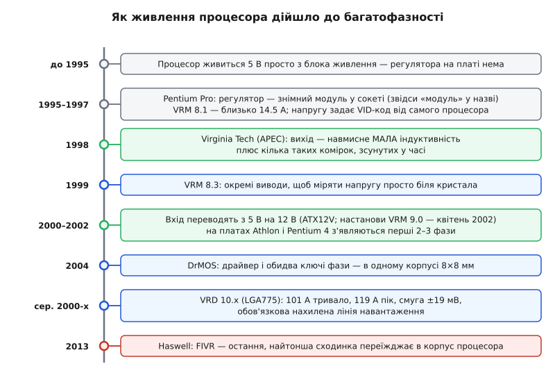
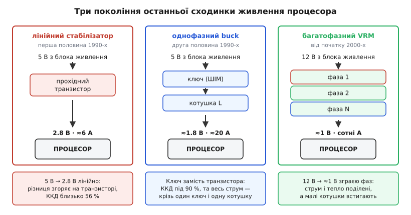

# 📜 Як живлення процесора дійшло до багатофазності

Зграя зсунутих у часі фаз під процесорним сокетом — не задум, а вимушений підсумок тридцятирічної гонитви, у якій кремній щоразу просив нижчу напругу й більший струм, а чергова конструкція живлення щоразу ламалася об нову межу. Ця лінія простежує шлях від часів, коли регулятора на платі не було взагалі, до специфікацій, які вимагали тримати сотню ампер у смузі кількох десятків мілівольтів — і показує, чому багатофазність народилася саме там і саме тоді, де й коли народилася.


*Вісім поворотів, кожен — відповідь на конкретну межу попередньої конструкції. Зеленим позначено два кроки, що безпосередньо привели до зграї фаз: ідея «мала котушка плюс зсув» і її вихід на масові плати.*

## Коли регулятора на платі не було

До середини 1990-х процесорного живлення як окремої інженерної задачі не існувало. Блок живлення видавав 5 В, і на цих 5 В працювало все: логіка, пам'ять, шини, сам процесор. Напруга була не параметром конструкції, а сталою епохи.

Зламало це зменшення транзистора. Тонший підзатворний діелектрик просто не витримує п'яти вольтів, а крім того, напруга живлення — найдешевший важіль, яким купують частоту, бо динамічна потужність [КМОН-логіки](topic:electronics/cmos) залежить від неї квадратично:

```
динамічна потужність КМОН-логіки:
  P ≈ C · V² · f

  5.0 В → 3.3 В:  (3.3/5.0)² = 0.44   — менш як половина за тієї ж частоти
  3.3 В → 2.8 В:  (2.8/3.3)² = 0.72
```

Кожна нова [технологічна норма](topic:electronics/moore-law) приносила нижчу напругу ядра — і плата вперше мусила виготовити для процесора щось своє. 486DX4 просив 3.3 В, Pentium P54C — теж 3.3 В, а Pentium MMX уже розділив живлення надвоє: 2.8 В на ядрі й 3.3 В на виводах.

Перші такі регулятори були [лінійними](topic:electronics/linear-regulator): прохідний транзистор, що спалює різницю напруг як тепло. Поки струм малий, це нормально. Порахуймо, коли перестає бути:

```
лінійний стабілізатор 5 В → 2.8 В за струму 6 А:
  корисно на процесорі   P = 2.8 · 6       = 16.8 Вт
  згоряє на транзисторі  P = (5 − 2.8) · 6 = 13.2 Вт
  ККД                    η = 16.8 / 30.0   ≈ 56 %
```

Тринадцять ватів в одному корпусі — це вже радіатор, більший за сам процесор. Гірше інше: ця втрата росте строго пропорційно струму. Подвоївся струм — подвоїлося тепло, і жодна оптимізація тут не допоможе, бо втрата закладена в самій ідеї «спалити зайве». Вихід був відомий: замінити прохідний транзистор ключем, який або повністю відкритий, або повністю закритий, і тому майже не гріється, — тобто [buck-перетворювачем](topic:electronics/buck). До кінця 1990-х плати перейшли на нього.


*Числа орієнтовні для своєї епохи. Лінійний стабілізатор платить теплом за кожен вольт різниці; однофазний buck знімає цю плату, але залишає весь струм в одному ключі й одній котушці; багатофазний ділить і струм, і тепло.*

## Модуль, який справді був модулем

Разом із власним живленням прийшла й нова біда: кожен наступний степінг хотів свою напругу. Плата, розпаяна під 3.3 В, ставала непридатною того дня, коли з'являвся процесор на 2.8 В.

Відповідь середини 1990-х була прямолінійна: зробити регулятор знімним. На платах під Pentium Pro (Socket 8) VRM — це справді окрема платка з гребінцем у 2×20 виводів, що вставлялася у свій білий сокет із засувками з обох боків; живився такий модуль переважно від 5 В (на серверних платах під Xeon — уже від 12 В). Новий процесор — новий модуль, плата лишається та сама. Саме звідси в абревіатурі й досі стоїть «модуль», хоча знімного модуля немає вже чверть століття.

Друга відповідь виявилася елегантнішою й пережила першу: хай процесор сам називає свою напругу. Кілька його виводів несуть код — [VID](topic:electronics/vid-voltage-identification), — а регулятор читає цей код і виставляє за ним опорну напругу. Знімний модуль після цього став непотрібним: один розпаяний перетворювач покривав усе сімейство, бо дізнавався потрібний вольтаж від самого навантаження. Регулятор переїхав із сокета просто на плату й став тим, що Intel надалі називала VRD — регулятором, вбудованим у плату.

Ранні числа тієї епохи скромні: специфікація VRM 8.1 говорить про максимум близько 14.5 А, і цього вистачало Pentium Pro з його неповними сорока ватами при 3.3 В.

А от у настановах VRM 8.3 (березень 1999) з'явився знак того, куди все йде: окремі виводи, щоб міряти напругу ядра й кеша не на виході перетворювача, а просто біля процесора. Причина проста — опір міді між перетворювачем і кристалом уже з'їдав помітну частку допуску, тож [чути напругу треба там, де вона важить](topic:electronics/kelvin-connection). Живлення перестало бути точковою задачею й стало [задачею всього шляху](topic:electronics/power-integrity).

## Дванадцять вольтів замість п'яти

З приходом Pentium 4 змінилася сама вхідна шина: перетворювач почали годувати від 12 В, а біля сокета з'явився окремий чотириконтактний роз'єм (ATX12V, приблизно 2000 рік). Настанови VRM 9.0 (квітень 2002) закріпили це на папері.

Мотив лежить не в перетворювачі, а в дорозі до нього:

```
навантаження 1.5 В · 100 А = 150 Вт на виході
за ККД ≈ 85 % з входу треба ≈ 176 Вт

  вхід 5 В:   I = 176 / 5  ≈ 35 А крізь роз'єм, дроти й доріжки
  вхід 12 В:  I = 176 / 12 ≈ 15 А

  втрата в шляху росте як I²:  (35/15)² ≈ 5.5 раза
```

Та сама потужність, але струм у джгуті менший удвічі з гаком, а втрата в ньому — у п'ять із половиною разів. Роз'єм і дроти зітхнули з полегшенням.

Перетворювачу ж стало гірше — і в цьому найцікавіше. Коефіцієнт заповнення дорівнює відношенню вихідної напруги до вхідної, і від переходу на 12 В він упав:

```
5 В → 2.8 В:   D = 2.8 / 5   = 0.56
12 В → 1.5 В:  D = 1.5 / 12  = 0.125
12 В → 1.0 В:  D = 1.0 / 12  ≈ 0.083
```

За частоти 300 кГц такт триває 3.3 мкс, а D = 0.083 лишає верхньому ключу всього 0.28 мкс відкритого стану. Уся сотня ампер має бути перекачана цими короткими скалками часу. Тобто перехід на 12 В полегшив дорогу до перетворювача ціною того, що всередині нього стало тісніше — і ця тіснота підштовхувала до конструкції з багатьох дрібних комірок, а не з однієї великої.

> 🔧 **Навіщо це.** Ця лінія пояснює те, що видно на будь-якій сучасній платі: окремий роз'єм 12 В коло сокета замість живлення від головного джгута, відсутність знімного регулятора, і те, чому в оглядах плат рахують саме фази. Кожна з цих деталей — слід конкретної межі, об яку розбилася попередня конструкція.

## Глухий кут, який побачили в лабораторії

Наприкінці 1990-х напрям руху вже читався: менш як вольт живлення, понад гігагерц частоти й такі стрибки струму, що жодна батарея конденсаторів їх не замаже. Питання стояло руба — чи витягне класичний синхронний buck те, що буде за кілька років.

У 1998-му на конференції IEEE APEC група з центру силової електроніки Політехнічного інституту Вірджинії (VPEC, згодом CPES) — Сюньвей Чжоу (Xunwei Zhou), Піт-Леон Вонг (Pit-Leong Wong), Лука Аморозо (Luca Amoroso), Фред Лі (Fred C. Lee), Ден Чен (Dan Y. Chen) та колеги — доповіла роботу з промовистою назвою «Investigation of candidate VRM topologies for future microprocessors». Висновок був невтішний: за очікуваних струмів і швидкостей їх наростання наявні топології VRM стають непрактичними — щоб утримати напругу в допуску, знадобилися б гори додаткової ємності, яким просто нема місця біля сокета.

Запропонований вихід звучить як перевертання звички. Класичний інстинкт проєктувальника — брати індуктивність побільше, бо вона згладжує пульсацію. Вірджинська група запропонувала протилежне: узяти індуктивність навмисне малою (звідси й назва режиму — quasi-square wave, «майже прямокутна хвиля»), бо мала котушка швидко міняє свій струм, а саме швидкості й бракувало. Пульсацію, яка від цього виростає, гасять інакше — ставлять кілька таких комірок на спільний вихід і зсувають їхні такти, тобто застосовують [паралельно-фазне вмикання](topic:electronics/interleaved-converter).

Тут варто чітко назвати статус кожної частини цього твердження. Сам зсув тактів між паралельними перетворювачами — давній і добре відомий прийом силової електроніки, його не винайшли заради процесорів. Новим було інше: систематичний доказ, що для процесорного навантаження зв'язка «навмисне мала індуктивність + зсув фаз» — не одна з можливих опцій, а єдиний вихід, і що без неї конструкція впирається в кількість конденсаторів, яку не можна побудувати.

Доказ був не тільки на папері. В огляді, опублікованому в лютому 2001 року, описано чотиримодульний паралельно-фазний прототип на 30 А сумарно, по 300 кГц на модуль, із перевіркою на стрибках навантаження від 0.5 А до 30 А: розбіжність струмів між фазами менш як 5 %, ККД близько 90 % на повному навантаженні, а перехідна характеристика — у кілька разів швидша за звичайний синхронний VRM тієї самої потужності.

Зверніть увагу на число: тридцять ампер. Не сотня. Ідею довели й виміряли ще тоді, коли навантаження було цілком скромне, — і саме тому вона виявилася готовою до моменту, коли скромним воно бути перестало.

## Із статті на плату

Ідеї бракувало мікросхеми. На зламі тисячоліть з'явилися контролери, чиї описи вже говорять не про перетворювач, а про систему фаз: приміром, Intersil HIP6301 і HIP6302 названі просто «Microprocessor CORE Voltage Regulator Multiphase Buck PWM Controller», і їхня документація подає багатофазність як свідомий розрив із однофазними схемами, що застосовувались доти, а причиною називає струми процесорів, які невпинно ростуть. Один контролер, кілька [драйверів затворів](topic:electronics/gate-driver), кілька комплектів ключів — конструкція, у якій фаза стала типовим елементом, а не окремою розробкою.

Перехід відбувся не одним стрибком. Уже 2000–2001 року любителі складали списки плат під Athlon на чипсеті KT133A, сортуючи їх на дво- й трифазні, — тобто плати одного покоління ще різнилися кількістю фаз залежно від ціни, і однофазні моделі мирно продавалися поруч.

Остаточно справу закріпили специфікації. Настанови VRD 10.x для сокета LGA775 просили від регулятора 101 А тривалого струму й 119 А в піку — і водночас вимагали втримати напругу в смузі ±19 мВ та вміти самостійно налаштовувати нахил лінії навантаження. Прочитайте ці дві вимоги поруч: сотня ампер і дев'ятнадцять мілівольтів в одному реченні. Проти ядерної напруги близько 1.3 В ця смуга — трохи більш як відсоток, і тримати її треба тоді, коли навантаження гуляє десятками ампер за частки мікросекунди.

Однофазний перетворювач тут програвав не через недбалу реалізацію, а принципово. Поки одна велика котушка розганяється, дефіцит струму мусять покривати [конденсатори](topic:electronics/decoupling), і потрібна для цього ємність просто не поміщається довкола сокета за жодних грошей. Вимога ж навмисного нахилу — це [адаптивне позиціювання напруги](topic:electronics/adaptive-voltage-positioning), яке зі специфікацій десятої серії стало обов'язковим, а не опційним хитрощем окремих виробників.

Далі лінія специфікацій ішла тим самим курсом: VRD 11.0 з'явилася в листопаді 2006-го, код VID із кількох ліній розрісся до п'яти, шести й восьми бітів, а згодом переїхав на послідовну шину. Через неї процесор уже не просто оголошує напругу раз при вмиканні, а веде з регулятором постійну розмову — і саме на цій розмові тримається те, що з боку програм зветься [динамічним масштабуванням напруги й частоти](topic:programming/dvfs).

## Фаза стискається в один корпус

Зростання кількості фаз оголило нову межу. Кожна фаза — це петля «драйвер → верхній ключ → нижній ключ», а петля має площу, паразитну індуктивність і місце на платі. Дванадцять фаз із дискретних деталей — це дванадцять таких петель, і кожна псує фронт перемикання, а [втрати перемикання](topic:electronics/switching-losses) ростуть із частотою.

У листопаді 2004-го Intel опублікувала специфікацію DrMOS (редакція 1.0): драйвер і обидва силові ключі фази — в одному корпусі QFN 8×8 мм на 56 виводів. У 2007-му редакція 3.0 додала менший варіант 6×6 мм на 40 виводів. Сенс не в економії місця, хоч і вона важлива. Коли драйвер сидить упритул до затвора, петля керування стискається до розмірів корпусу: фронт стає чистішим і швидшим, тож частоту можна підняти, не платячи за неї всім бюджетом втрат. Пізніші версії таких корпусів навчилися ще й повідомляти контролеру виміряний струм і температуру своєї фази — без цього балансувати десяток фаз наосліп було б неможливо.

## Куди переїжджає остання сходинка

Лінія не спинилася на платі. Haswell (2013) переніс тонке регулювання просто в корпус процесора — FIVR, повністю інтегрований регулятор: плата робить одну проміжну шину, а перетворювачі всередині корпусу ріжуть її на численні напруги для блоків кристала. Виграш очевидний із геометрії: провідник від перетворювача до навантаження скорочується з сантиметрів до міліметрів, і швидкість відгуку стає такою, якої платному перетворювачу не досягти в принципі.

Але перемоги не сталося. У наступному настільному поколінні Intel повернула регулювання на плату, а до FIVR повернулася вже в Ice Lake. Сам факт інтегрованого регулятора в Haswell та Ice Lake задокументований; поширені пояснення відступу — сконцентроване в корпусі процесора тепло й дорожчі плати — це радше усталена галузева версія, ніж оприлюднена офіційна причина, і саме так її варто читати.

Показово інше: навіть там, де FIVR є, багатофазний перетворювач на платі нікуди не подівся. Він просто перестав бути останньою сходинкою й став тією, що переносить сотні ампер через плату до корпусу. Суперечка, яка відкрилася в середині 1990-х — наскільки близько до кремнію мусить сидіти останнє перетворення, — досі та сама, змінилися лише числа. І щоразу, коли її розв'язували, відповідь мала одну й ту саму форму: не більший ключ, а більше дрібніших і прудкіших, розставлених ближче й зсунутих у часі.
