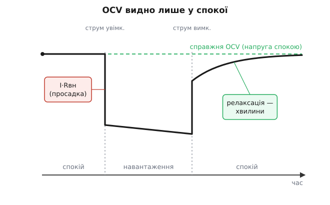
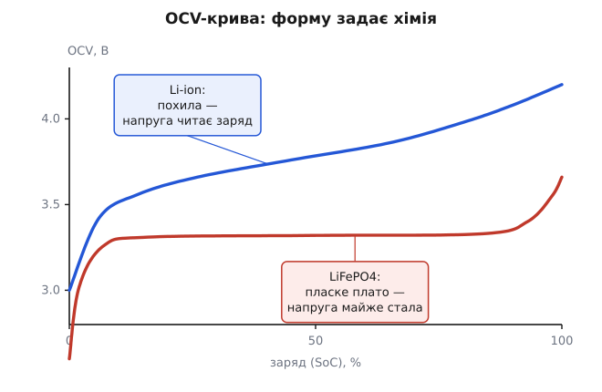
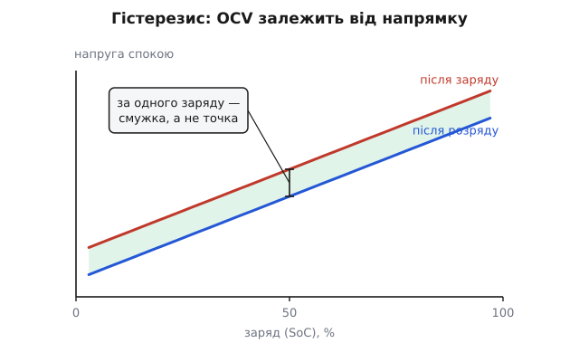

# OCV-крива комірки

<preknowlist>
- [Заряд, що лишився (SoC)](book:electronics/state-of-charge) — стан заряду: скільки заряду в комірці лишилось, від 0 до 100%, і що батарея не показує його прямо.
- [Акумулятори](book:electronics/batteries) — будова комірки: два електроди, між якими є напруга, а заряд/розряд переганяє носії з одного в інший.
- [Просадка під навантаженням](book:electronics/battery-sag) — під струмом напруга на клемах падає на I·Rвн через внутрішній опір комірки.
</preknowlist>

Заряджена комірка ховає свій заряд. Немає ні поплавця, ні віконця: скільки енергії всередині — знадвору не побачиш. Та одне комірка у спокої таки показує чесно — **напругу на клемах**. І напруга ця не випадкова: за кожного рівня заповнення комірка, якщо дати їй заспокоїтись, сама сідає на цілком певну напругу, завжди ту саму. Оця відповідність — «яка напруга спокою за якого заряду» — і є **OCV-крива** (англ. *open-circuit voltage*, «напруга розімкненого кола», тобто без навантаження). Це єдиний місток від невидимого заряду всередині до напруги, яку легко зміряти вольтметром. Лишається зрозуміти, звідки ця напруга-за-заповненням береться, чому має саме таку форму — і чому вона водночас ключ до паливоміра й пастка.

## Чому саме «розімкнене коло»

Слово «розімкнене» тут — не формальність, а суть. Щойно коміркою тече струм, він падає на її внутрішньому опорі: під розрядом напруга на клемах виходить нижчою за справжню рівно на [I·Rвн просадки](book:electronics/battery-sag). Тобто під навантаженням клема показує не стан комірки, а стан мінус падіння на опорі, ще й змішане з повільними перерозподілами всередині. Така напруга про заряд бреше.

І навпаки: коли струм — нуль, падати ні на чому. Комірка, відпочивши, сідає на свою **рівноважну** напругу, і тільки тепер напруга означає заповнення. Ось чому в назві стоїть «розімкнене коло»: OCV — це напруга, з якої **знято навантаження**, очищена від просадки. Лише її є сенс перекладати в заряд.


*Справжню OCV видно лише у спокої. Під навантаженням клема падає на I·Rвн (просадка), а коли струм прибрати — напруга не стрибає назад одразу, а хвилинами релаксує до рівноважної OCV. Читати заряд по напрузі можна лише на верхній лінії.*

## Звідки береться крива

Напруга комірки — це різниця [електродних потенціалів](root:basic-chemistry/electrode-potential) двох її електродів. А потенціал кожного електрода залежить від того, наскільки той заповнений носіями (для літієвих комірок — іонами літію). Заряд і розряд якраз і переганяють іони з електрода в електрод, міняючи заповнення кожного, — а отже, міняючи й різницю потенціалів, тобто напругу. Тому OCV не стала: вона йде за заповненням, бо за заповненням ідуть самі електродні потенціали. OCV-крива — це, по суті, прямий відбиток хімії електродів, знятий у вольтах.

Звідси й головне: **форму кривої задає хімія**, а не конструкція. Різні пари електродів дають різні криві, і саме [хімія комірки](root:embedded/battery-chemistries) вирішує, чи буде крива зручною для читання, чи ні.

## Форма: монотонна, та не пряма

Спільне в усіх OCV-кривих одне: вона **монотонна** — що повніша комірка, то вища напруга спокою. Саме це й робить її придатною за карту: кожній напрузі відповідає один рівень заряду. Але то не пряма лінія, і форма різко різниться між хіміями.


*Похила крива Li-ion читає заряд напругою добре по всьому діапазону, а пласке плато LiFePO4 — майже ні: у середині кілька мілівольтів «коштують» десятки відсотків заряду.*

- **Li-ion** (графіт + оксид металу): напруга похило росте від ~3.0 В (порожня) до ~4.2 В (повна), крутіше на самих краях і полого — у середині.
- **LiFePO4** (LFP): майже **пласке плато** близько 3.3 В на більшості діапазону, з різкими зламами лише скраю.

Що з цього корисне, вирішує не сама напруга, а **нахил кривої** — на скільки вольтів міняється OCV на одиницю заряду. Крутий нахил — напруга добра лінійка для заряду: дрібна зміна напруги означає дрібну зміну заряду. Пласке плато — лінійка нікчемна: там кілька мілівольтів «коштують» десятки відсотків заряду, і будь-яка похибка виміру напруги обертається величезною похибкою заряду.

**Приклад (нахил — це роздільність).** Хай вольтметр певний до ~5 мВ. Скільки заряду ми цим розрізнимо?

```
Li-ion, середина:  ~3.6 → 4.0 В на 20→80% заряду ≈ 7 мВ на 1%
   5 мВ виміру → ~0.7% заряду           (напруга читає заряд добре)

LiFePO4, плато:    ~3.25 → 3.32 В на 20→80% заряду ≈ 1.2 мВ на 1%
   5 мВ виміру → ~4% заряду; а в найпласкішій середині
   ще менший нахил робить ті самі 5 мВ вартими десятків %
```

Висновок різкий: на похилому Li-ion напруга — надійна лінійка, а на пласкому LFP тією самою напругою заряд у середині діапазону практично не прочитати — потрібен інший, незалежний від напруги спосіб.

Чому LFP така пласка — не примха: там перехід між зарядженим і розрядженим станом іде як співіснування **двох фаз**, а поки дві фази в рівновазі, потенціал електрода тримається майже сталим — звідси й полиця. Ця механіка, і чому натомість графіт дає похилу криву, — [окремо в математиці кривої](book:electronics/ocv-curve/math-curve-shape.md).

## Навіщо ця крива

OCV(SoC) — це та сама **абсолютна** карта, що перетворює одну виміряну напругу спокою на число заряду. Її цінність — у слові «абсолютна»: на відміну від [лічби заряду](book:electronics/state-of-charge), що з часом дрейфує, OCV щоразу дає свіжу прив'язку до істини. Тому [паливоміри](book:electronics/fuel-gauge) на ній і тримаються: гладко ведуть заряд лічбою струму, а напругою спокою раз по раз збивають накопичений дрейф. Але користати OCV можна лише там, де комірка **у спокої** й де крива **крута**; під навантаженням чи на пласкому плато вона сліпа.

> 🔧 **Навіщо це.** Практичне правило паливоміра прямо випливає з форми кривої: довіряй напрузі там, де крива крута (краї в Li-ion, і майже будь-де на похилій хімії), і не довіряй у пласкій середині. На LFP це означає, що напругою заряд надійно читається хіба біля повного й порожнього, а всю середину доводиться вести лічбою струму — саме тому дешевий «вольтметровий» паливомір на LFP такий брехливий.

Як цю карту вкласти в прошивку — таблицею OCV→SoC з інтерполяцією, ще й із вагою за локальним нахилом, щоб не вірити пласким ділянкам, — [в алгоритмічній вставці](book:electronics/ocv-curve/proj-ocv-lookup.md).

## Чому крива насправді розмита

Досі крива поставала одною чіткою лінією. Насправді її розмивають три речі, і кожну треба тримати в голові.

**Релаксація.** Прибрали навантаження — і напруга не стрибає на OCV одразу, а **повзе** до неї хвилинами, а то й годинами: всередині вирівнюються концентраційні градієнти, які лишив по собі струм (той самий повільний дифузійний хвіст [імпедансу комірки](book:electronics/battery-impedance)). Зміряєш зарано — прочитаєш не OCV, а ще не заспокоєну напругу, тобто знову похибку.

**Гістерезис** (грец. *hysteresis*, «відставання»). За того самого заряду комірка сідає трохи вище, якщо її щойно заряджали, і трохи нижче, якщо розряджали. Тож «OCV за 50%» — це не точка, а вузька **смужка**: справжня напруга спокою лежить десь у ній, залежно від того, з якого боку ми до цього заряду прийшли. У Li-ion смужка тонка, а от у LFP через ту саму фазову природу помітна — ще одна причина, чому пласке плато так погано читається.


*За того самого заряду напруга спокою — не точка, а смужка: після заряду вища, після розряду нижча (гістерезис). У Li-ion смужка тонка, у LiFePO4 — помітна, що додатково псує читання плаского плато.*

**Температура й старіння.** Крива трохи різна на холоді й у теплі та поволі зсувається [зі старінням комірки](book:electronics/battery-aging). Тому точний переклад напруги в заряд потребує правильної кривої — на цю температуру й на цей вік батареї, а не однієї на всі випадки.

Отже, OCV-крива — це єдиний чесний самозвіт комірки: рівноважна напруга як відбиток заповнення. І вся складність читання заряду батареї виростає рівно з двох фактів про цей звіт: він з'являється лише у спокої, а на пласких хіміях відбиток майже однаковий на пів-діапазону.
