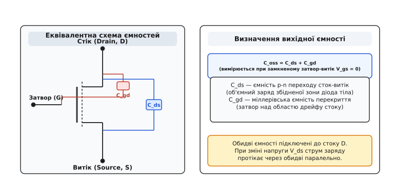
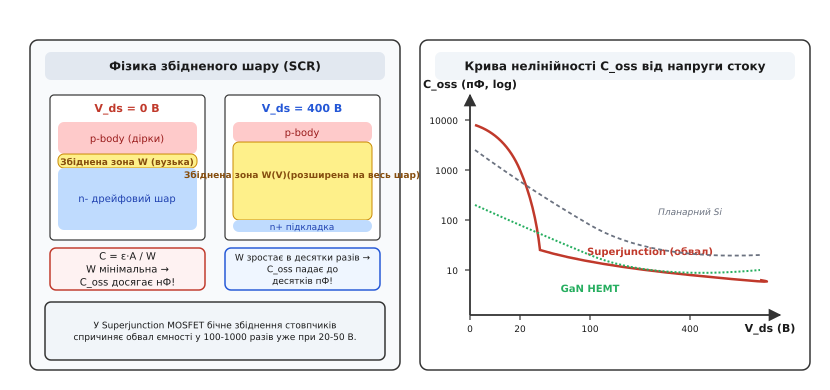
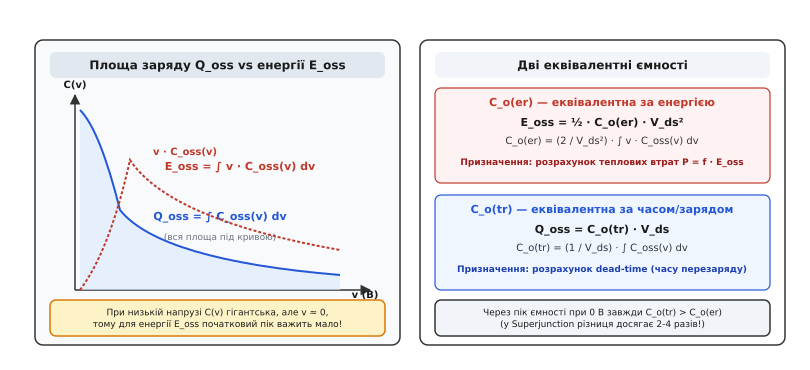
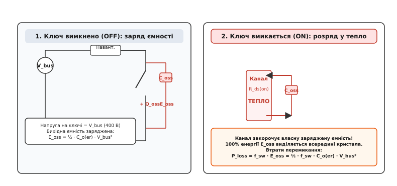
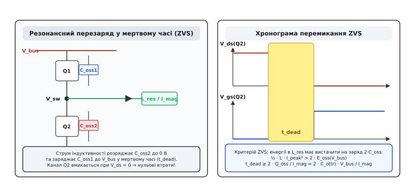
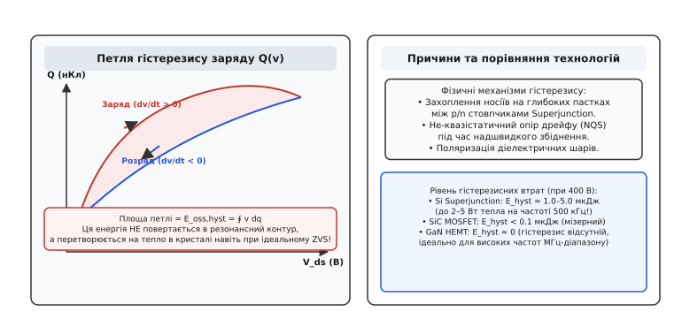

# Вихідна ємність MOSFET (C_oss)

<preknowlist>
- [Затвор як ємність](book:electronics/gate-capacitance) — паразитна ємність затвора, заряд Qg та плато Міллера.
- [Втрати перемикання в силових ключах](book:electronics/switching-losses) — перекриття напруги й струму під час комутації та енергетичний баланс перемикання.
- [Силовий ключ](book:electronics/mosfet-power-switch) — будова польового MOSFET-транзистора та опір відкритого каналу Rds(on).
- [М'яке перемикання: ZVS і ZCS](book:electronics/soft-switching-zvs-zcs) — принцип усунення комутаційних втрат нульовою напругою або нульовим струмом.
- [Питомий опір Ron·A та обмеження матеріалу](book:electronics/specific-on-resistance) — межа кремнію, баланс Баліги та суперперехідна структура стовпчиків.
</preknowlist>

Увімкніть високовольтний перетворювач живлення на напругу 400 В у режимі повного холостого ходу: струм у навантаження не йде, провідні втрати на опорі каналу дорівнюють нулю, а транзистори перемикаються на частоті 200 кГц. Якщо виміряти температуру радіатора через кілька хвилин, термовізор покаже розігрів до 70–80 градусів Цельсія, а ватметр зафіксує споживання кількох ватів активної потужності. Транзистори гріються не тому, що крізь них тече струм навантаження, і не через повільне спрацьовування затвора: причиною цього тепла є **вихідна ємність транзистора** *(output capacitance, Coss)*. Щоразу, коли ключ закривається, висока напруга шини заряджає його власну внутрішню ємність електричним зарядом; щоразу, коли ключ відкривається, провідний канал миттєво закорочує цю ємність, перетворюючи всю накопичену в ній електростатичну енергію на тепло безпосередньо всередині кремнієвого кристала.

На постійному струмі або низьких частотах (до кількох кілогерців) ця енергія непомітна, оскільки кількість перемикань за секунду невелика. Але в сучасних джерелах живлення, де ключі спрацьовують сотні тисяч і мільйони разів щосекунди, вихідна ємність стає головним фізичним бар'єром для підвищення частоти перетворення, джерелом комутаційних втрат і причиною виходу приладів із ладу.

## Анатомія вихідної ємності: де всередині транзистора сидить конденсатор

Вихідна ємність `C_oss` не є навмисно встановленим дискретним конденсатором — це паразитна фізична властивість самої напівпровідникової структури польового транзистора. Вона складається з двох паралельних складових, які підключені до стоку приладу:

```
C_oss = C_ds + C_gd
```

де `C_ds` — ємність між стоком і витоком *(drain-source capacitance)*, а `C_gd` — ємність зворотного зв'язку між затвором і стоком *(gate-drain / Miller capacitance)*.


*Вихідна ємність C_oss є сумою ємності p-n переходу сток-витік (C_ds) та міллерівської ємності перекриття затвор-стік (C_gd). Її вимірюють на змінному струмі високої частоти при нульовій напрузі затвора (V_gs = 0).*

Головну частку величини `C_oss` у високовольтному стані формує `C_ds` — це бар'єрна ємність зворотного p-n переходу між базовою областю кристала (p-body) та слабколегованим дрейфовим шаром стоку (n-drift). Цей самий p-n перехід утворює так званий внутрішній діод тіла *(body diode)* транзистора. Коли транзистор вимкнений, напруга на стоці додатна відносно витоку, тобто діод тіла перебуває під зворотною напругою зміщення.

Друга складова — `C_gd` — виникає через фізичне перекриття металевого або полікремнієвого електрода затвора над діелектриком (оксидом кремнію) та дрейфовою областю стоку. Коли затвор замкнений на витік сигналом драйвера (`V_gs = 0`), вивід затвора за змінним струмом виявляється з'єднаним із витоком. Тому струм заряду, викликаний наростанням напруги на стоці, одночасно заряджає обидва паралельні конденсатори — діелектрик під затвором і збіднений шар сток-витік.

> 🔧 **Навіщо це.** У даташитах на транзистори виробники завжди вказують три стандартні ємності, виміряні стандартизованим методом за високої частоти (зазвичай 1 МГц): вхідну `C_iss = C_gs + C_gd`, вихідну `C_oss = C_ds + C_gd` та прохідну `C_rss = C_gd`. Знаючи ці три значення з таблиці, інженер миттєво знаходить чисту ємність сток-витік як `C_ds = C_oss - C_rss`.

## Механізм нелінійності: чому ємність падає в сотні разів

Найважливіша особливість вихідної ємності напівпровідникового ключа полягає в тому, що вона не є постійним числом. У звичайному керамічному чи плівковому конденсаторі ємність визначається формулою плоского діелектрика `C = ε·A / d` і залишається незмінною, оскільки відстань `d` між металевими обкладками зафіксована на заводі. У напівпровідниковому переході роль діелектрика виконує **збіднена зона** *(space charge region, SCR / область просторового заряду)* — шар кремнію, з якого електричне поле повністю виштовхало всі вільні носії заряду (електрони та дірки).

Товщина цієї збідненої зони `W` безпосередньо залежить від прикладеної зворотної напруги `V_ds`. Поки напруга на стоці дорівнює нулю (`V_ds = 0 В`), збіднена зона надзвичайно вузька: вона утворюється лише внутрішнім контактним потенціалом переходу (вбудованим потенціалом `V_bi ≈ 0.7–0.8 В` для кремнію). Відстань між провідними зонами становить частки мікрометра, тому початкова ємність при нульовій напрузі `C_oss(0)` сягає гігантських значень — від кількох тисяч пікофарад до десятків нанофарад.

Коли напруга стоку `V_ds` зростає, електричне поле розширює збіднену зону глибше в товщу слабколегованого n-дрейфового шару. Оскільки товщина діелектричного шару `W(v)` збільшується, ємність стрімко спадає.


*При зростанні напруги V_ds збіднена зона p-n переходу розширюється, що зменшує вихідну ємність. У суперперехідних Superjunction MOSFET бічне змикання стовпчиків викликає обвал ємності на 2–3 порядки в діапазоні 20–50 В.*

Залежність зміни товщини збідненої зони від напруги визначається внутрішньою тривимірною геометрією кристала:

1. **Класичний планарний кремній (Planar MOSFET):**
   У класичних транзисторах збіднення поширюється вглиб одновимірно. Товщина шару росте пропорційно квадратному кореню з напруги `W ∝ √(V_bi + V_ds)`. Відповідно, бар'єрна ємність зменшується як `C_oss ∝ 1 / √(V_bi + V_ds)`. При зміні напруги від 0 до 400 В ємність такого транзистора плавно зменшується приблизно в 15–25 разів.

2. **Суперперехідний кремній (Superjunction MOSFET):**
   У сучасних високовольтних кремнієвих транзисторах (технології CoolMOS, MDmesh, SuperFET) дрейфова область складається з чергування паралельних вертикальних стовпчиків n- і p-типу. При малій напрузі стоку (від 0 до 20–50 В) збіднення відбувається не лише зверху вниз, а насамперед **вбік** між сусідніми стовпчиками. Оскільки відстань між стовпчиками становить лише кілька мікрометрів, при досягненні напруги змикання *(pinch-off voltage, V_pinch ≈ 25–40 В)* стовпчики повністю збіднюються на всю свою ширину.

У момент повного бічного змикання вся дрейфова зона миттєво стає єдиним ізолятором на всю свою вертикальну товщину. На графіку залежності `C_oss(V_ds)` виникає круте урвище ємності: у діапазоні від 0 до 30 В ємність падає в 100–1000 разів! Наприклад, транзистор із опором каналу 45 мОм має вихідну ємність `C_oss = 6000 пФ` при напрузі 0 В, але вже при 50 В вона падає до `80 пФ`, а при 400 В становить лише `45 пФ`.

## Інтегральна енергія E_oss: чому лінійна формула бреше в кілька разів

Для звичайного конденсатора з фіксованою ємністю `C` енергія, накопичена в електричному полі, розраховується за шкільною формулою:

```
E = ½ · C · V²
```

Якщо інженер підставить у цю формулу значення вихідної ємності, виміряне при робочій напрузі 400 В (наприклад, `C_oss(400В) = 50 пФ`), він отримає:

```
E = ½ · 50·10⁻¹² Ф · (400 В)² = ½ · 50·10⁻¹² · 160000 = 4.0 · 10⁻⁶ Дж = 4.0 мкДж
```

Цей розрахунок є абсолютно помилковим, а отримана похибка може сягати 300–500%. Річ у тім, що поки напруга наростала від 0 до 50 В, через транзистор протікав струм заряду величезної початкової ємності в кілька нанофарад.

Щоб знайти справжній накопичений електричний заряд `Q_oss` та справжню запасену енергію `E_oss`, необхідно взяти визначений інтеграл по всій траєкторії напруги:

```
Q_oss(V_ds) = ∫[0 → V_ds] C_oss(v) dv

E_oss(V_ds) = ∫[0 → V_ds] v · C_oss(v) dv
```


*Заряд Q_oss є повною площею під кривою C_oss(v), тоді як накопичена енергія E_oss зважує ємність на миттєву напругу v. Через колосальний пік ємності при малій напрузі значення заряду значно завищується порівняно з накопиченою енергією.*

Повний математичний апарат, покрокове аналітичне виведення інтегралів для ступінчастого переходу та чисельний алгоритм розрахунку наведено в математичній вставці [«Математика нелінійної вихідної ємності: виведення E_oss, C_o(er) та C_o(tr)»](book:electronics/output-capacitance/math-energy-charge.md).

З інтегрального виразу видно: у діапазоні низьких напруг (від 0 до 20 В), де ємність `C_oss(v)` максимальна, множник напруги `v` близький до нуля, тому внесок цієї області в загальну енергію `E_oss` відносно невеликий. Натомість для повного заряду `Q_oss = ∫ C(v) dv` цей початковий пік враховується з повною одиничною вагою, створюючи величезний накопичений заряд.

## Дві еквівалентні ємності: C_o(er) проти C_o(tr)

Оскільки інтегрувати графіки з даташита вручну для кожного розрахунку незручно, виробники напівпровідників стандартизували два різних еквівалентних параметри вихідної ємності, які подаються як фіксовані числа для певної напруги (зазвичай 400 В або 80% від максимальної напруги пробою):

```
1. Енергетично-еквівалентна ємність:  C_o(er) = (2 · E_oss) / V_ds²
2. Часово-еквівалентна ємність:        C_o(tr) = Q_oss / V_ds
```

Ці дві величини мають принципово різний фізичний зміст і призначені для розв'язання різних інженерних завдань:

1. **`C_o(er)` — еквівалентна ємність за енергією** *(energy-related effective output capacitance)*:
   Це фіксована ємність віртуального лінійного конденсатора, який при заряді до напруги `V_ds` накопичує ту саму енергію `E_oss`, що й реальний транзистор.
   *Де використовується:* виключно для розрахунку теплових комутаційних втрат і теплового балансу перетворювача (`P_loss = f_sw · E_oss = ½ · f_sw · C_o(er) · V_ds²`).

2. **`C_o(tr)` — еквівалентна ємність за часом заряду** *(time-related effective output capacitance)*:
   Це фіксована ємність віртуального конденсатора, якому для заряду постійним струмом `I_const` до напруги `V_ds` потрібен той самий час `t_ch`, що й реальному транзистору, тобто він накопичує той самий повний заряд `Q_oss`.
   *Де використовується:* виключно для розрахунку часових інтервалів комутації — тривалості мертвого часу *(dead-time)* у півмостових та мостових драйверах, а також для оцінки швидкості наростання напруги `dv/dt = I_drive / C_o(tr)`.

Через високий пік ємності при низьких напругах часова ємність **завжди значно більша** за енергетичну:

```
C_o(tr) > C_o(er)
```

Для класичних планарних транзисторів це співвідношення становить `C_o(tr) / C_o(er) ≈ 1.5`. Проте для сучасних кремнієвих суперперехідних транзисторів (Superjunction) через різке урвище ємності воно досягає **3.0–5.5**!

> ⚠️ **Пастка плутанини ємностей.** Якщо використати значення `C_o(tr)` (наприклад, 280 пФ) замість `C_o(er)` (55 пФ) у формулі комутаційних втрат `½·C·V²·f`, розрахункове виділення тепла буде завищено в 5 разів, що призведе до необґрунтованого встановлення величезного радіатора. Якщо ж навпаки — підставити малу ємність `C_o(er)` у розрахунок мертвого часу для резонансного перетворювача, виділеного часу не вистачить для перезаряду повного заряду `Q_oss`. Транзистор увімкнеться при ненульовій напрузі на стоці, що призведе до миттєвого зриву м'якої комутації, жорсткого перемикання та теплового пробою.

## Жорстка комутація (Hard Switching): куди зникає енергія під час відкриття ключа

Розгляньмо типову схему імпульсного знижувального перетворювача (Buck), підвищувального коректора коефіцієнта потужності (PFC) або прямоходового перетворювача (Forward). У цих топологіях транзистор працює в режимі **жорсткої комутації** *(Hard Switching)*: ключ вмикається в той момент, коли на його стоці присутня повна напруга силової шини живлення `V_bus`.

Поки ключ вимкнений, струм навантаження замикається через зворотний діод, а вихідна ємність транзистора `C_oss` заряджена до напруги шини `V_bus`, зберігаючи в собі порцію електростатичної енергії `E_oss`.


*При жорсткому ввімкненні транзистора канал провідності миттєво закорочує обкладки власної вихідної ємності Coss. 100% накопиченої енергії E_oss незворотно розсіюється у кристалі у вигляді тепла на кожному циклі перемикання.*

Коли драйвер затвора піднімає напругу `V_gs` вище порогового рівня відкриття каналу `V_th`, опір каналу сток-витік стрімко падає від гігаомів до часток ома. Оскільки обкладки внутрішнього конденсатора `C_oss` підключені безпосередньо до кінців цього каналу, утворюється замкнений внутрішній контур. Заряджений конденсатор починає розряджатися через провідний канал транзистора.

Куди дівається ця енергія? Вона не може повернутися в джерело живлення чи вийти в навантаження — їй нікуди подітися, крім як розсіятися у вигляді джоулевого тепла `∫ i_channel²(t) · r_channel(t) dt` безпосередньо в активному об'ємі кремнієвого каналу.

Втрати потужності від розряду вихідної ємності при жорсткому перемиканні з частотою `f_sw` розраховуються як:

```
P_coss = f_sw · E_oss = ½ · f_sw · C_o(er) · V_bus²
```

### Повний енергетичний баланс за цикл комутації

Часто виникає запитання: скільки повної енергії споживає процес перезаряду `C_oss` від шини живлення `V_bus`?

1. **Фаза вимикання (заряд ємності):** Джерело постійної напруги `V_bus` постачає в ємність повний заряд `Q_oss`. Енергія, яку віддає шина живлення за цей процес, становить:

```
E_source = ∫ V_bus · i(t) dt = V_bus · ∫ dq = V_bus · Q_oss
```

При цьому в самій вихідній ємності запасається лише енергія `E_oss = ∫ v · C(v) dv`. Решта енергії `E_turn_off_loss = V_bus · Q_oss - E_oss` неминуче розсіюється у вигляді тепла у зовнішньому колі заряду (на паразитному активному опорі доріжок, індуктивності та опорі навантаження).

2. **Фаза вмикання (розряд ємності):** Уся запасена енергія `E_oss` виділяється у кристалі увімкненого транзистора `E_turn_on_loss = E_oss`.

Таким чином, повні втрати енергії в усій системі за повний цикл заряду й розряду ємності від джерела напруги становлять:

```
E_total_cycle = E_turn_off_loss + E_turn_on_loss = V_bus · Q_oss
```

Цей фундаментальний результат показує, що загальні втрати енергії за цикл перемикання пропорційні повному заряду `Q_oss`.

### Числовий приклад розрахунку нагріву

Порівняймо роботу високовольтного транзистора (наприклад, 650 В / 50 мОм із `E_oss = 5.0 мкДж` при напрузі `V_bus = 400 В`) на двох різних частотах перемикання в схемі жорсткої комутації:

1. **Частота f_sw = 50 кГц:**
   `P_coss = 50 000 Гц · 5.0·10⁻⁶ Дж = 0.25 Вт` (цілком допустиме розсіювання, кристал ледь теплий).
2. **Частота f_sw = 500 кГц:**
   `P_coss = 500 000 Гц · 5.0·10⁻⁶ Дж = 2.5 Вт` (лише на перезаряд ємності йде 2.5 Вт тепла; без масивного радіатора кристал перегріється та згорить навіть без підключеного навантаження).

> 🔧 **Навіщо це.** Саме через втрати розряду вихідної ємності `P_coss = f_sw · E_oss` високовольтні схеми з жорстким перемиканням (традиційні PFC та Flyback) рідко проектують на частоти понад 100–130 кГц при використанні кремнієвих транзисторів. Щоб подолати цей бар'єр, переходять або на широкозонні напівпровідники з мінімальним `E_oss` (GaN HEMT), або на резонансні топології з м'яким перемиканням.

## М'яка комутація (ZVS): як зробити розряд ємності безперервним і безкоштовним

Єдиний спосіб повністю усунути комутаційні втрати від розряду `C_oss` — застосувати принцип **перемикання при нульовій напрузі** *(Zero Voltage Switching, ZVS)*. Цей принцип покладено в основу таких топологій, як резонансний перетворювач LLC, фазозсувний повний міст *(Phase-Shifted Full-Bridge, PSFB)* та прямоходові перетворювачі з активним обмеженням *(Active Clamp)*.

Головна ідея ZVS полягає в тому, що вихідну ємність транзистора розряджають до нуля **до того**, як сигнал керування відкриє провідний канал. Розряд здійснюється не внутрішнім закорочуванням, а зовнішнім індуктивним струмом.


*У напівмостовій схемі під час паузи мертвого часу (t_dead) струм індуктивності розряджає ємність нижнього ключа C_oss2 і заряджає ємність верхнього ключа C_oss1. Коли напруга V_ds падає до 0 В, затвор відкриває канал без будь-яких втрат енергії.*

### Послідовність фаз ZVS у напівмості

Розгляньмо, як відбувається м'яке перемикання у півмості, що живиться від шини `V_bus = 400 В`:

1. **Вимкнення верхнього ключа Q1:** Драйвер знімає напругу з затвора Q1, канал закривається.
2. **Пауза мертвого часу (Dead-time):** Обидва ключі Q1 і Q2 одночасно закриті. Проте первинний струм індуктивності (струм намагнічування трансформатора `I_mag` або струм дроселя) не може миттєво зупинитися. Цей індуктивний струм витікає з середньої точки (вузол Switch Node).
3. **Резонансний перезаряд ємностей:** Струм індуктивності працює як генератор струму: він забирає електричний заряд із вихідної ємності нижнього транзистора `C_oss2` (знижуючи її напругу від 400 В до 0 В) і водночас заштовхує цей заряд у вихідну ємність верхнього ключа `C_oss1` (піднімаючи її напругу від 0 до 400 В).
4. **Фіксація на нулі:** Коли напруга на стоці нижнього ключа Q2 досягає нуля, надлишковий струм індуктивності підхоплюється внутрішнім діодом тіла транзистора Q2, який відкривається і надійно фіксує напругу на рівні близько `-0.7 В`.
5. **Вмикання нижнього ключа Q2:** Тільки тепер драйвер подає імпульс відмикання на затвор Q2. Оскільки в момент відкриття каналу напруга між стоком і витоком дорівнює нулю (`V_ds = 0 В`), енергія розряду `E_oss = ½ · C · (0)² = 0`. Комутаційні втрати ввімкнення повністю усуваються.

### Умови досягнення ідеального ZVS

Щоб режим ZVS не зірвався, конструктор схеми зобов'язаний виконати дві обов'язкові умови:

1. **Енергетична умова (наявність запасу енергії в індуктивності):**
   Енергія, накопичена в магнітному полі індуктивності `L_res` на момент початку мертвого часу, має перевищувати сумарну енергію вихідних ємностей обох ключів напівмоста:

```
½ · L_res · I_peak² > 2 · E_oss(V_bus) = C_o(er) · V_bus²
```

2. **Часова умова (розрахунок мертвого часу):**
   Тривалість мертвого часу `t_dead` повинна бути достатньою, щоб струм намагнічування `I_mag` встиг перенести повний електричний заряд `2 · Q_oss`:

```
t_dead ≥ (2 · Q_oss) / I_mag = (2 · C_o(tr) · V_bus) / I_mag
```

Зауважте, що в розрахунку тривалості мертвого часу використовується виключно часова еквівалентна ємність `C_o(tr)`.

## Гістерезисні втрати вихідної ємності (C_oss Hysteresis) у Superjunction MOSFET

Довгий час вважалося, що режим ZVS у резонансних перетворювачах забезпечує стовідсотковий ККД перезаряду ємності: вся енергія `E_oss`, що виходить із вихідної ємності під час розряду, повністю повертається в резонансний контур без втрат у тепло. Проте з появою високочастотних LLC-перетворювачів на частотах 300–500 кГц на базі 600-вольтових транзисторів Superjunction розробники зіткнулися з аномальним явищем: транзистори продовжували розігріватися навіть за умови ідеально налаштованого ZVS та відсутності провідного струму.

Причиною цього ефекту є **гістерезисні втрати вихідної ємності** *(C_oss hysteresis loss, E_oss,hyst)*.


*При швидкому циклічному заряді та розряді вихідної ємності траєкторія заряду Q(v) не збігається з траєкторією розряду. Площа замкненої петлі гістерезису є незворотною втратою енергії E_oss,hyst, яка виділяється у кристалі на кожному такті ZVS.*

### Фізична природа гістерезису в стовпчиках Superjunction

Під час надшвидкої зміни напруги стоку з великою швидкістю наростання `dv/dt > 50 В/нс` поведінка заряду в складному тривимірному суперпереході відхиляється від ідеальної квазістатичної моделі:

1. **Захоплення носіїв на глибоких енергетичних пастках (Deep-level Trapping):**
   На межах розділу між вертикальними p- та n-стовпчиками утворюються дефекти кристалічної решітки та технологічні домішки. Під час швидкого розширення збідненої зони частина дірок та електронів захоплюється цими пастками. При наступному зворотному русі збідненої зони носії вивільняються з пасток із затримкою, виділяючи енергію у вигляді тепла решітки.
2. **Не-квазістатичний опір дрейфу (Non-Quasi-Static Drift Resistance, NQS):**
   Коли напруга стоку наближається до напруги змикання `V_pinch`, опір звужених кінчиків кремнієвих стовпчиків різко зростає до сотень омів. Зарядний струм ємності змушений протікати крізь ці надтонкі резистивні «шийки», розсіюючи енергію безпосередньо в товщі кристала.
3. **Поляризаційні втрати в діелектриках:**
   Внутрішній оксидний діелектрик затвора та пасивуючі шари мають діелектричний гістерезис при високих напруженостях електричного поля.

Внаслідок цих ефектів інтеграл роботи за повний замкнений цикл «заряд–розряд» не дорівнює нулю:

```
E_oss,hyst = ∮ v dq = ∮ v · C_oss(v) dv > 0
```

Для стандартних кремнієвих Superjunction MOSFET на напругу 600–650 В величина втрат гістерезису становить від `1.0` до `4.5 мкДж` на кожне перемикання при напрузі 400 В. На частоті 300 кГц це генерує `0.3–1.35 Вт` постійного паразитного тепла в кожному транзисторі моста незалежно від якості налаштування резонансу.

## Порівняння поведінки Coss у різних напівпровідникових технологіях

Розвиток силової електроніки привів до заміни традиційного кремнію новими широкозонними матеріалами: карбідом кремнію (SiC) та нітридом галію (GaN). Кожна технологія має унікальний профіль вихідної ємності:

1. **Кремній Superjunction (Si SJ):**
   * *Переваги:* мінімальний опір `R_ds(on)` на одиницю площі серед кремнієвих приладів, низька ціна.
   * *Недоліки:* екстремальна нелінійність (обвал у 1000 разів), великий повний заряд `Q_oss`, високе значення `C_o(tr)` (потрібен довгий dead-time), наявність гістерезису `C_oss`, великий заряд зворотного відновлення діода тіла `Q_rr`.
2. **Карбід кремнію (SiC MOSFET):**
   * *Переваги:* критичне поле пробою в 10 разів вище за кремній, що дозволяє зробити дрейфовий шар у 10 разів тоншим. Площа кристала значно менша, тому `C_oss`, `Q_oss` та `E_oss` істотно нижчі. Гістерезис ємності практично відсутній (`E_hyst < 0.05 мкДж`).
   * *Застосування:* високовольтні схеми 650 В – 1700 В із жорстким та м'яким перемиканням на частотах 100–300 кГц.
3. **Нітрид галію (GaN HEMT):**
   * *Переваги:* планарна бічна структура без p-n переходу (двовимірний електронний газ 2DEG). Повна відсутність діода тіла (`Q_rr = 0`). Найменша вихідна ємність `C_oss` серед усіх відомих приладів (у 5–10 разів менша за кремній), мінімальний заряд `Q_oss` та абсолютно нульовий гістерезис `C_oss`.
   * *Застосування:* мегагерцові перетворювачі, компактні адаптери живлення USB-PD, високоефективні сервери.

Детальне зіставлення числових параметрів, графіків та факторів добротності FOM *(Figure of Merit)* наведено у вставці [«Порівняння вихідної ємності: Кремній, Superjunction, SiC та GaN»](book:electronics/output-capacitance/comp-fet-technologies.md).

## Практичний інженерний чеклист для роботи з Coss

При проектуванні та розрахунку імпульсного силового каскаду дотримуйтесь таких правил:

```
1. Визначте тип комутації у вашій топології:
   ├── Жорстке перемикання (Hard Switching: Buck, Boost, Flyback, PFC):
   │   ├── Оцініть втрати: P_coss = f_sw · E_oss(V_bus) = ½ · f_sw · C_o(er) · V_bus²
   │   ├── Використовуйте тільки C_o(er) або графік E_oss із даташита!
   │   └── Якщо f_sw > 150 кГц при V_bus > 400 В — переходьте на GaN або SiC.
   │
   └── М'яке перемикання (Soft Switching: LLC, PSFB, Active Clamp):
       ├── Розрахуйте мертвий час: t_dead ≥ (2 · C_o(tr) · V_bus) / I_mag
       ├── Використовуйте тільки C_o(tr) або значення Q_oss!
       ├── Перевірте запас енергії: ½ · L_res · I_mag² > C_o(er) · V_bus²
       └── При f_sw > 200 кГц враховуйте гістерезис E_oss,hyst для кремнію Superjunction.

2. Захист від паразитного вмикання через ефект Міллера (dv/dt):
   ├── При швидкому заряді C_oss струм зміщення тече через C_gd: I_gate = C_gd · (dv/dt)
   └── Опір підтяжки затвора до землі повинен задовольняти умову:
       R_gate_down < V_th / (C_gd · (dv/dt)_max)
```

Вихідна ємність польового транзистора `C_oss` є фундаментальною фізичною характеристикою ключа, яка перетворює статичну напівпровідникову структуру на динамічний реактивний елемент силового кола. Точне розуміння її нелінійної природи, правильне розмежування параметрів `C_o(er)` і `C_o(tr)` та усунення втрат розряду за допомогою резонансного перемикання ZVS дозволяють створювати імпульсні джерела живлення з ККД понад 98% і питомою потужністю в десятки кіловатів на літр об'єму.
