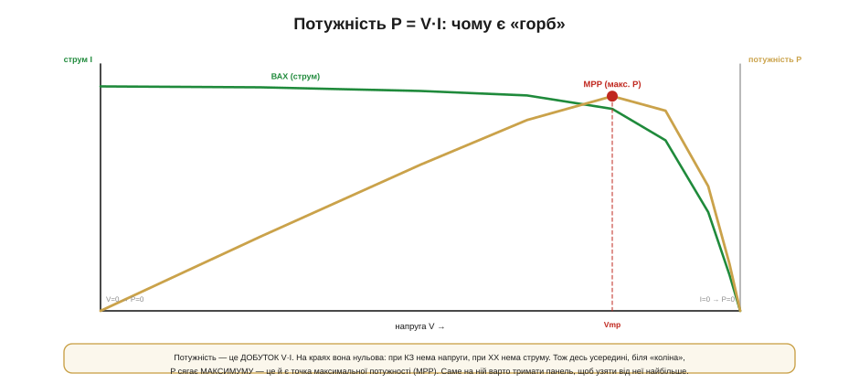
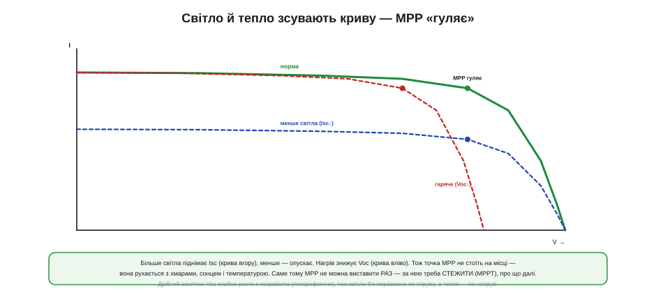

# ВАХ панелі: Isc, Voc і точка максимальної потужності

Якщо думати про освітлену панель як про [джерело струму паралельно з діодом](book:electronics/photovoltaic-cell), то цю модель можна перетворити на найкорисніший інструмент усього розділу — **вольт-амперну характеристику** (ВАХ, англійською I-V curve): графік, що показує, який струм панель віддасть за кожної напруги. Уся практика сонячного живлення — від прямого заряду до розумного MPPT — читається саме з цієї кривої, тож варто навчитися бачити її «внутрішнім зором».

Головне тут таке: у панелі є **одна найкраща робоча точка** — точка максимальної потужності (*maximum power point*, MPP), — і вона не там, де найбільший струм, і не там, де найбільша напруга, а посередині, «на горбі». Зрозуміти, **чому** цей горб існує і **чому** він гуляє, — це наполовину зрозуміти й MPPT.

### Крива з двома кінцями: Isc і Voc

Почнімо з двох крайніх точок кривої — їх найлегше уявити. Що буде, якщо виходи панелі **закоротити** (напруга 0)? Увесь фотострум потече назовні — це **струм короткого замикання** (*short-circuit current*, **Isc**), максимальний струм, який панель здатна дати, і він прямо пропорційний освітленості. А що буде, якщо лишити виходи **розімкненими** (струм 0)? На клемах з'явиться повна напруга переходу — **напруга холостого ходу** (*open-circuit voltage*, **Voc**), та сама ~0.5 В на елемент, помножена на кількість елементів.


*Рис. Між коротким замиканням (V=0, струм = Isc) і холостим ходом (I=0, напруга = Voc) ВАХ панелі має характерну форму з «коліном»: спершу струм майже сталий (панель поводиться як джерело струму), а біля коліна різко падає до нуля, віддаючи місце напрузі. Уся практика — про цю криву.*

Між цими двома кінцями ВАХ має дуже характерну **форму**, і зрозуміти її просто з тієї самої моделі. Доки напруга мала, діод «закритий» і весь фотострум іде в навантаження — крива майже **горизонтальна** на рівні Isc: панель тут поводиться як джерело струму. Та коли напруга підбирається до Voc, діод «відкривається» й починає відбирати струм собі — крива круто **завертає вниз**, до нуля. Місце цього завороту й звуть **«коліном»**. Ось вона, ключова форма: пласка «поличка» струму, тоді коліно, тоді обрив напруги — і все подальше стає очевидним.

Між цими кінцями є й важлива **несиметрія**, варта уваги. Струм Isc майже **прямо пропорційний** освітленості: удвічі менше світла — удвічі менший струм. А ось напруга Voc від яскравості залежить **дуже слабко** (логарифмічно): навіть у похмурий день чи в кімнаті панель тримає майже повну свою напругу, просто віддає крихітний струм. Практичний наслідок: у тіні чи всередині приміщення панель не «гасне» за напругою — вона радше **знесилюється за струмом**. Тому маленька панель у кімнаті ще покаже свої вольти на вольтметрі, та зарядити нею щось буде важко — бо ампер обмаль.

### Чому є горб: P = V·I

Тепер головне питання: де на цій кривій панель віддає **найбільше потужності**? Потужність — це **добуток** напруги на струм (P = V·I), і саме добуток народжує горб.


*Рис. Крива потужності P = V·I, накладена на ВАХ. На обох краях вона нульова: при короткому замиканні (V=0) добуток нуль, при холостому ході (I=0) — теж нуль. Тож десь усередині, біля коліна, потужність сягає максимуму — це і є точка максимальної потужності (MPP) при напрузі Vmp.*

Логіка проста й неспростовна. На лівому кінці кривої струм великий, але напруга **нульова** — отже, потужність V·I теж нуль (закорочена панель гріє сама себе, але назовні нічого не дає). На правому кінці напруга велика, але струм **нульовий** — і знову P = 0 (розімкнена панель тримає напругу, та не віддає струму). А якщо на обох краях потужність нульова, то десь **посередині** вона мусить сягнути максимуму. Цей максимум і лежить біля коліна — у точці максимальної потужності (MPP). Ось чому MPP не там, де найбільший струм чи напруга: бо потужність — це їхній **добуток**, а не кожне окремо.

Корисно зрозуміти й **чому коліно саме там**. Доки напруга панелі низька, внутрішній діод закритий і не заважає — увесь фотострум іде назовні. Та щойно напруга наближається до Voc, діод починає **відкриватися** й жадібно відбирати струм собі, у нагрів. Коліно — це і є та напруга, на якій діод «прокидається». Тому MPP завжди трохи **нижче** Voc: треба зупинитися рівно перед тим, як діод почне красти струм. Це та сама [експонента діода](book:electronics/diode-iv-curve), тільки тепер вона визначає, де панель найщедріша.

**Приклад (скільки втрачаємо не на MPP).** Панель: Voc = 6.0 В, Isc = 0.50 А; її MPP — у точці Vmp = 4.8 В, Imp = 0.45 А.

```
Максимум, що панель може дати:
   P_mpp = Vmp × Imp = 4.8 × 0.45 = 2.16 Вт

Заряджаємо літій 3.7 В НАПРЯМУ (панель змушена сидіти на 3.7 В):
   3.7 В — лівіше коліна, тож струм ще майже Isc ≈ 0.49 А
   P = 3.7 × 0.49 ≈ 1.81 Вт          ← на ~16% МЕНШЕ за можливе

MPPT (перетворювач 4.8 В → 3.7 В) тримає панель на MPP:
   бере 2.16 Вт і віддає ≈ 2.16 × ККД у батарею
```

Висновок промовистий: просто під'єднати панель до батареї — означає **подарувати** частину потужності (тут ~16%, а буває й більше), бо батарея силоміць стягує панель з її MPP. І що далі напруга батареї від Vmp панелі, то більший цей подарунок — а отже, і виграш від MPPT тим ваговитіший, чим гірше «природно» збігаються панель із батареєю. Саме цей розрив і прибирає [MPPT](book:electronics/real-sun-mppt). Докладне рівняння самої кривої (звідки береться її форма) лишимо математичній вставці.

> 🧮 **Рівняння кривої — у вставці.** Звідки математично береться форма ВАХ — модель «одного діода», що зв'язує фотострум, діодний струм і опори, — у математичній вставці цього розділу про модель одного діода.

### MPP, Vmp, Imp і «квадратність»

Назвімо точку максимуму як належить. Її напругу звуть **Vmp**, струм — **Imp**, і обидва трохи менші за крайні Voc та Isc. А наскільки «повну» потужність дає панель, показує проста й корисна міра.


*Рис. MPP лежить у точці (Vmp, Imp), трохи нижче Voc і Isc. Її прямокутник Vmp×Imp — це реальна максимальна потужність. Наскільки він заповнює «ідеальний» прямокутник Voc×Isc — це коефіцієнт заповнення (fill factor): що крива «квадратніша» (різкіше коліно), то FF ближчий до одиниці й то краща панель.*

Уявімо два прямокутники під кривою. Великий — Voc×Isc — це **недосяжний ідеал**: добуток найбільшої напруги на найбільший струм, якби їх можна було взяти одночасно (а їх не можна). Менший — Vmp×Imp — це **реальна** максимальна потужність у точці MPP. Відношення цих площ і звуть **коефіцієнтом заповнення** (*fill factor*, FF): він показує, наскільки «квадратна» крива, тобто наскільки різке в неї коліно. Добра панель має FF близько 0.7–0.8: чим квадратніша крива, тим ближче реальний максимум до ідеалу. Низький FF — ознака поганого елемента або великих внутрішніх втрат. Для нас FF — зручний однопоглядовий показник якості панелі.

Звідки беруть ці числа на практиці? Криву **знімають**, повільно змінюючи навантаження від короткого замикання до холостого ходу й записуючи V та I в кожній точці — тим самим способом, що й [зняття сітки робочих точок для перетворювача](book:electronics/converter-measure). У даташиті ж панелі одразу наводять ключові точки — Voc, Isc, Vmp, Imp і Pmax — за [стандартних умов (STC)](book:electronics/photovoltaic-cell). Варто лише тримати в голові, що це **паспортні** числа за ідеального сонця: у полі і Pmax буде меншим, і точка MPP стоятиме інакше, ніж у таблиці.

### Навантаження вирішує робочу точку

Дотепер ми говорили про криву **самої панелі**. Та де саме на ній панель опиниться, вирішує **навантаження** — і це ключ до розуміння, навіщо взагалі потрібен MPPT.


*Рис. Навантаження накладає на панель свою умову — «навантажувальну пряму». Резистор дає пряму крізь початок координат (V=IR), батарея — майже вертикальну лінію на своїй напрузі. Робоча точка — там, де ця пряма ПЕРЕТИНАЄ ВАХ панелі. Якщо батарея 3.7 В, панель змушена сидіти ліворуч від MPP (4.8 В) і віддає менше, ніж могла б.*

Панель — це джерело, але вона не сама обирає, де працювати: робочу точку задає **перетин** її кривої з умовою навантаження. Резистор накладає умову [V = I·R](book:electronics/ohms-law) — пряму крізь початок координат; де ця пряма перетне ВАХ, там панель і опиниться. Батарея ж тримає **майже сталу** напругу, тож її «навантажувальна пряма» — це майже **вертикаль** на напрузі батареї; панель, під'єднана до неї напряму, **змушена** працювати саме на цій напрузі, хоч би де була її MPP. І якщо напруга батареї (3.7 В) не збігається з Vmp панелі (4.8 В) — а вона майже ніколи не збігається, — панель сидить **не на горбі** й віддає менше. Уся ідея MPPT у тому, щоб **розв'язати** напругу панелі від напруги батареї — поставити між ними [імпульсний перетворювач](book:electronics/converter-spec), який дозволить панелі лишатися на своєму Vmp, а батареї живитися своїм.

Звідси й відповідь на спокусливе питання: «а чи не можна просто підібрати резистор, щоб панель сиділа на MPP?». Можна — але лише для **однієї** освітленості: щойно сонце зміниться, крива зсунеться, а фіксована резисторна пряма лишиться на місці — і робоча точка знову з'їде з горба. MPP рухається, а резистор — ні. Саме тому статичного навантаження замало: потрібен **активний** вузол, що підлаштовує умову під поточну криву. Це знайома з електротехніки [задача узгодження для максимуму потужності](book:electronics/power-matching), тільки тут «опір», який бачить панель, доводиться весь час підкручувати під погоду.

Варто й застерегти від звички, винесеної з батарей. [Батарею](book:electronics/battery-sag) зручно уявляти як джерело напруги з малим внутрішнім опором; із панеллю так **не вийде**. Її крива надто нелінійна: ліворуч від коліна вона тримає струм майже сталим (поводиться як джерело струму), а праворуч — обвалює напругу. Тож думати про панель треба не «напруга мінус I·R», а **в термінах усієї ВАХ**: робоча точка живе на кривій, а не на прямій. Хто переносить «батарейну» інтуїцію на панель, той раз у раз дивується, чому вона «не тримає напругу під навантаженням», — а вона її й не повинна тримати.

### Крива не стоїть на місці

І остання, найважливіша для практики річ: ВАХ панелі **не стала** — вона весь час **рухається** з умовами, а разом із нею мандрує й MPP.


*Рис. Більше світла піднімає Isc (крива вгору), менше — опускає її. Нагрів знижує Voc (крива вліво). Тож MPP не стоїть на місці: вона гуляє з хмарами, сонцем і температурою. Саме тому її не можна виставити раз — за нею треба безперервно СТЕЖИТИ (це й робить MPPT).*

Дві сили рухають криву. **Освітленість** керує переважно струмом: яскравіше сонце — вище Isc, крива піднімається; набігла хмара — струм просів, крива опустилася. **Температура** керує переважно напругою: що гарячіша панель, то нижча її Voc, і крива зсувається **вліво** (це той самий [спад напруги з нагрівом](book:electronics/photovoltaic-cell)). А оскільки рухаються і висота, і ширина кривої, разом із ними **переїжджає** й точка MPP. Звідси головний практичний висновок усієї теми: **MPP не можна знайти раз і назавжди** — вона безперервно гуляє з погодою, тож за нею треба **стежити в реальному часі**. Це і є завдання [MPPT](book:electronics/real-sun-mppt): не просто знайти горб, а весь час на ньому втримуватися, поки він мандрує.

Масштаби цих зсувів варто відчувати. Напруга падає приблизно на **три десятих відсотка на кожен градус** нагріву, тож панель, розжарена на сонці до +60 °C, легко втрачає десяту частину напруги проти прохолодної — і це б'є по врожаю відчутно. Є й приємна закономірність, на якій тримається спрощений MPPT: точка Vmp майже завжди лежить десь на **рівні ~0.75–0.8 від Voc**, і це співвідношення тримається сталим попри зміну світла. Тож грубо «влучити» в MPP можна, навіть не шукаючи горба, — просто тримаючи панель на цій частці її Voc. Цим і користуються прості [**«квазі-MPPT»** рішення](book:electronics/real-sun-mppt).

### Будуємо панель: послідовно й паралельно

Лишилося зв'язати криву одного елемента з кривою цілої панелі — і тут усе просто, бо діє та сама арифметика з'єднань, що й для комірок будь-якого джерела: послідовно додаються напруги, паралельно — струми.


*Рис. Елементи **послідовно** додають напругу: Voc і Vmp множаться на кількість, а струм лишається як в одного (крива розтягується праворуч). **Паралельно** — додають струм: Isc і Imp множаться, а напруга та сама (крива розтягується вгору). Крива панелі — це крива елемента, розтягнута по осях.*

Правило дзеркальне. З'єднати елементи **послідовно** — означає додати їхні **напруги**: десять елементів по 0.5 В дають Voc ~5 В, а струм лишається таким, як в одного елемента. На графіку це **розтягує** криву праворуч. З'єднати **паралельно** — означає додати **струми**: Isc множиться на число гілок, а напруга не міняється; крива розтягується вгору. Реальну панель набирають комбінацією: стільки елементів послідовно, щоб дістати потрібну напругу, і стільки паралельних рядів, скільки треба струму. Тому ВАХ будь-якої панелі — це просто **масштабована** крива одного елемента, і всі поняття (Isc, Voc, MPP, FF) переносяться на неї без змін.

Скільки ж елементів брати послідовно? Тут є практичне правило: напруги панелі має **вистачати з запасом** над напругою батареї, щоб понижувальному MPPT-перетворювачу було куди опускатися. Якщо Vmp панелі лише трохи вищий за напругу батареї, то в спеку (коли Voc просяде) панель може вже й не дотягувати — і MPPT втратить владу над точкою. Тому беруть помітно більше елементів, ніж «рівно під батарею», лишаючи запас на нагрів і просадку. Важлива й засторога з іншого боку: у послідовному ряду всі елементи мусять давати **однаковий** струм, інакше найслабший (затінений) тягне весь ряд донизу — але це вже [історія реального сонця й тіні](book:electronics/real-sun-mppt).

### Підсумок теми

ВАХ панелі — це крива «струм проти напруги» з двома кінцями: **Isc** (струм короткого замикання, ∝ світло) і **Voc** (напруга холостого ходу, ~0.5 В × N елементів), а між ними — характерне **«коліно»**. Оскільки потужність — це **добуток** V·I, на обох кінцях вона нульова, а максимуму сягає посередині, у **точці максимальної потужності (MPP)** з координатами Vmp, Imp; наскільки повну потужність дає панель, показує **fill factor**. Робочу точку задає **навантаження** (його «пряма» перетинає ВАХ): батарея силоміць тримає панель на своїй напрузі, тож напряму панель майже завжди сидить **не на MPP** і віддає менше — звідси й потреба в MPPT. Найголовніше: крива **не стоїть на місці** — світло рухає Isc вгору-вниз, тепло зсуває Voc вліво, і MPP **гуляє**, тож за нею треба стежити, а не виставляти раз. А сама панель — це крива елемента, **розтягнута** послідовним (напруга) і паралельним (струм) з'єднанням. Сама ж ця ідеальна крива в реальному світі псується — кутом, спекою й, найпідступнішим, [**тінню**](book:electronics/real-sun-mppt).
