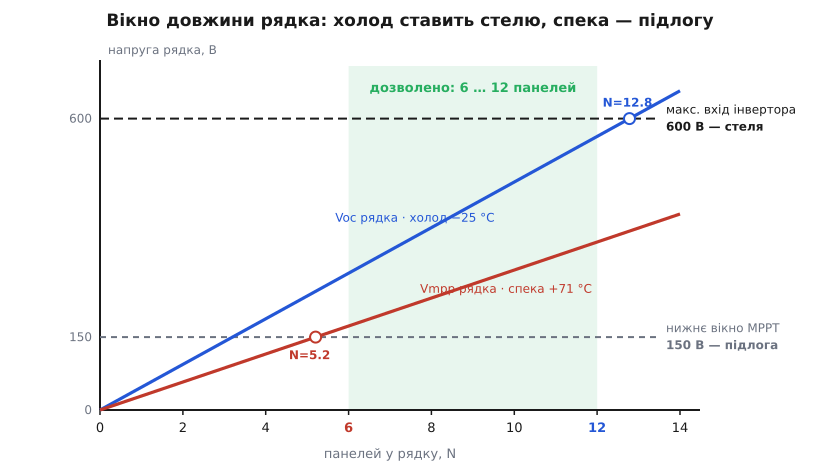

# ⚙️ Калькулятор рядка: скільки панелей ставити між холодом і спекою

Три числа з даташита — Voc, Vmpp, Pmax — і два температурні коефіцієнти при них разом кажуть на позір просту річ: скільки однакових панелей можна з'єднати послідовно в один **рядок** (*string*), щоб інвертор і взимку не спалив вхід, і влітку не втратив точку максимуму. «Просту» — доки не поставиш числа. А щойно поставиш, з'ясовується, що на двох кінцях рядка діють дві різні межі, рахуються вони за різними напругами й за різних температур, і переплутати їх — типова помилка, яка або палить перетворювач морозного ранку, або мовчки з'їдає врожай у спеку.

Тож зберемо все в один невеликий калькулятор. На вхід — рядок даташита й дві місцеві крайні температури; на вихід — три відповіді: **найбільша** дозволена довжина рядка, **найменша** дозволена, і **скільки потужності лишиться** на розпеченому даху.

## Що на вході, що на виході

**Вхід.** З даташита панелі беремо шість чисел: напругу холостого ходу Voc, напругу в [точці максимуму](book:electronics/panel-iv-mpp) Vmpp і потужність Pmax — усі за STC (25 °C на елементі) — та три температурні коефіцієнти при них (βVoc, βVmpp, γPmax, усі у %/°C і всі, крім струмового, від'ємні). Плюс NOCT панелі. З паспорта інвертора — два числа: абсолютний максимум вхідної напруги й нижню межу його вікна стеження MPPT. З місцевого клімату — дві крайнощі: **рекордно низька** температура повітря й розрахунково **гаряча**.

**Вихід.** Три величини:

- **N_max** — найбільше число панелей у рядку, за якого навіть найхолоднішого ранку сумарна Voc не перестрибне стелю входу інвертора;
- **N_min** — найменше число, за якого навіть у найбільшу спеку сумарна Vmpp не провалиться під нижню межу вікна MPPT;
- **втрата Pmax** — на скільки відсотків просяде реальна потужність гарячого полудня проти паспортної.

## Ідея: дві різні межі на двох кінцях рядка

Уся хитрість тут — зрозуміти, чому не можна порахувати «одну довжину рядка». Меж дві, і вони протилежні.

**Верхня межа — холод, напруга холостого ходу.** Температурний коефіцієнт двобічний: якщо спека Voc знижує, то мороз її **піднімає**, вище за паспортну. Найгірший — найвищий — стрибок Voc буває тоді, коли ясне сонце вдарило по ще крижаній панелі: елемент майже такий холодний, як повітря, а напруга вже підскочила. У цю мить рядок, поки інвертор не почав навантажувати його струмом, стоїть на **напрузі холостого ходу**. Тому стелю рахують саме за Voc і саме за рекордно низької температури: сума послідовних Voc не сміє перевищити абсолютний максимум входу, бо це вже не втрата відсотків — це пробій.

**Нижня межа — спека, напруга в точці максимуму.** Тепер протилежний край. [MPPT-контролер](book:electronics/real-sun-mppt) утримує робочу точку не будь-де, а лише у своєму **вікні напруг**; нижче нижньої межі він просто не бачить, де максимум, і або втрачає в ККД, або взагалі «засинає». Під навантаженням панель сидить не на Voc, а на **Vmpp** — і саме Vmpp просідає в спеку найдужче. Якщо рядок закороткий, у полуденну жароту його сумарна Vmpp падає під підлогу вікна MPPT. Тому мінімальну довжину рахують за Vmpp і за найгарячішого елемента.

> 🔧 **Навіщо це.** Дві межі — це не одна формула з різними знаками, а два різні розрахунки. Стеля — за **Voc** і за **холодом** (елемент ≈ повітря, бо гріти нема чому). Підлога — за **Vmpp** і за **спекою** (елемент через NOCT сидить куди вище за повітря). Переплутати напруги чи температури — значить порахувати не ту межу; калькулятор і потрібен, щоб на кожному кінці підставити правильну пару.

І один місток між кліматом і кремнієм: температуру елемента прямо не міряють, її прикидають з NOCT — температури, до якої панель нагрівається за м'яких умов випробування (800 Вт/м², 20 °C повітря, вітерець 1 м/с). Лінійна теплова модель дає елемент за будь-якого сонця:

```
T_елемента = T_повітря + (NOCT − 20) · освітленість / 800
```

На холодному кінці цю надбавку **не додають**: найвищу Voc ловлять на низькому вранішньому сонці, коли панель ще не встигла нагрітися, тож елемент беруть рівним повітрю. На гарячому — додають повністю, за повного полуденного сонця.

## Робочий калькулятор (Python)

Задача суто арифметична, і мова тут — не про регістри чи гарячий цикл, а про читабельний інженерний розрахунок; Python лягає рівно. Уся логіка — чотири короткі функції: температура елемента через NOCT, масштаб будь-якої величини за її коефіцієнтом, і збірка трьох відповідей.

```python
from dataclasses import dataclass
from math import floor, ceil


@dataclass
class Panel:
    voc: float      # Voc за STC, В
    vmpp: float     # Vmpp за STC, В
    pmax: float     # Pmax за STC, Вт
    b_voc: float    # βVoc,  %/°C  (від'ємний)
    b_vmpp: float   # βVmpp, %/°C  (від'ємний; нема в даташиті → став b_voc)
    g_pmax: float   # γPmax, %/°C  (від'ємний)
    noct: float     # NOCT, °C


@dataclass
class Inverter:
    v_max: float        # абсолютний максимум входу, В
    v_mppt_min: float   # нижня межа вікна MPPT, В


@dataclass
class Site:
    t_air_cold: float        # рекордний місцевий мінімум повітря, °C
    t_air_hot: float         # розрахунковий гарячий максимум повітря, °C
    ghi_hot: float = 1000.0  # освітленість у гарячий полудень, Вт/м²


def cell_temp(t_air, noct, ghi):
    """Температура елемента через NOCT (лінійна теплова модель)."""
    return t_air + (noct - 20.0) * ghi / 800.0


def scale(v_stc, coeff_pct, t_cell):
    """Значення за температурою елемента: лінійний температурний коефіцієнт."""
    return v_stc * (1.0 + coeff_pct / 100.0 * (t_cell - 25.0))


def size_string(p: Panel, inv: Inverter, s: Site):
    # ── ХОЛОДНИЙ бік: стеля напруги. Voc, елемент ≈ повітря (сонце ще низьке) ──
    t_cold = s.t_air_cold                       # без NOCT: гріти нема чому
    voc_cold = scale(p.voc, p.b_voc, t_cold)    # Voc однієї панелі на морозі
    n_max = floor(inv.v_max / voc_cold)         # більше — пробій входу

    # ── ГАРЯЧИЙ бік: підлога напруги. Vmpp, елемент через NOCT ──
    t_hot = cell_temp(s.t_air_hot, p.noct, s.ghi_hot)
    vmpp_hot = scale(p.vmpp, p.b_vmpp, t_hot)   # Vmpp однієї панелі на спеці
    n_min = ceil(inv.v_mppt_min / vmpp_hot)     # менше — випадаєш із вікна MPPT

    # ── Втрата потужності на спеці ──
    pmax_hot = scale(p.pmax, p.g_pmax, t_hot)
    loss_pct = (1.0 - pmax_hot / p.pmax) * 100.0

    return {
        "t_cold": t_cold, "voc_cold": voc_cold, "n_max": n_max,
        "t_hot": t_hot, "vmpp_hot": vmpp_hot, "n_min": n_min,
        "pmax_hot": pmax_hot, "loss_pct": loss_pct,
    }
```

Зверніть увагу на два `floor` і `ceil` — вони не косметичні. Стелю **округлюють униз** (одна зайва панель уже перевищує максимум), підлогу — **вгору** (одна відсутня панель уже провалює під вікно). Заокруглити не в той бік — і калькулятор дозволить рівно ту довжину, якої не можна.

Тепер проженемо реальний приклад. Панель — звичайний монокристалічний модуль 400 Вт; інвертор — з максимумом входу 600 В і нижнім вікном MPPT 150 В; майданчик — континентальний клімат із морозними ясними ранками:

```python
if __name__ == "__main__":
    panel = Panel(voc=41.0, vmpp=34.2, pmax=400.0,
                  b_voc=-0.29, b_vmpp=-0.34, g_pmax=-0.35, noct=45.0)
    inv = Inverter(v_max=600.0, v_mppt_min=150.0)
    site = Site(t_air_cold=-25.0, t_air_hot=40.0)

    r = size_string(panel, inv, site)
    n_naive = floor(inv.v_max / panel.voc)      # ПАСТКА: рахунок за STC

    print(f"холодний бік:  елемент {r['t_cold']:+.0f} °C, "
          f"Voc = {r['voc_cold']:.1f} В  →  max {r['n_max']} панелей")
    print(f"гарячий бік:   елемент {r['t_hot']:+.0f} °C, "
          f"Vmpp = {r['vmpp_hot']:.1f} В  →  min {r['n_min']} панелей")
    print(f"вікно рядка:   {r['n_min']} … {r['n_max']} панелей")
    print(f"Pmax на спеці: {r['pmax_hot']:.0f} Вт/панель  (−{r['loss_pct']:.0f} %)")
    print(f"якби за STC:   помилково дозволив би {n_naive} панелей "
          f"(на {n_naive - r['n_max']} більше — взимку це пробій)")

    n = r["n_max"] - 1                          # на панель нижче стелі — запас
    print(f"\nвибір {n} панелей у рядку:")
    print(f"  холодна Voc рядка = {n * r['voc_cold']:.0f} В  (стеля {inv.v_max:.0f} В)")
    print(f"  гаряча Vmpp рядка = {n * r['vmpp_hot']:.0f} В  (підлога {inv.v_mppt_min:.0f} В)")
    print(f"  потужність на спеці = {n * r['pmax_hot']:.0f} Вт  (STC {n * panel.pmax:.0f} Вт)")
```

Вивід:

```
холодний бік:  елемент -25 °C, Voc = 46.9 В  →  max 12 панелей
гарячий бік:   елемент +71 °C, Vmpp = 28.8 В  →  min 6 панелей
вікно рядка:   6 … 12 панелей
Pmax на спеці: 335 Вт/панель  (−16 %)
якби за STC:   помилково дозволив би 14 панелей (на 2 більше — взимку це пробій)

вибір 11 панелей у рядку:
  холодна Voc рядка = 516 В  (стеля 600 В)
  гаряча Vmpp рядка = 317 В  (підлога 150 В)
  потужність на спеці = 3688 Вт  (STC 4400 Вт)
```

Рядок можна робити завдовжки від 6 до 12 панелей. Беремо 11 — на одну нижче стелі, щоб лишити запас на негоду й старіння: його холодна Voc (516 В) сидить безпечно під 600 В, гаряча Vmpp (317 В) — з великим запасом над 150 В, а в полуденну спеку такий рядок віддасть 3688 Вт замість паспортних 4400.


*Дві похилі — сумарна напруга рядка як функція числа панелей: синя рахує холодну Voc, червона — гарячу Vmpp. Синя впирається у стелю входу (600 В) на N ≈ 12.8 → дозволено щонайбільше 12; червона перетинає підлогу вікна MPPT (150 В) на N ≈ 5.2 → потрібно щонайменше 6. Зелена смуга між ними — увесь дозволений діапазон. Холод ставить стелю, спека — підлогу.*

## Проходимо приклад руками

Щоб не вірити машині на слово, порахуймо ті самі три відповіді олівцем — і заразом побачимо, звідки береться кожне число.

**Холодний бік (стеля).** Найгірший ранок — рекордні −25 °C, елемент ще не нагрітий, тож беремо його рівним повітрю без NOCT-надбавки:

```
ΔT від STC:     −25 − 25 = −50 °C
Voc(−25):       41.0 · (1 + (−0.29/100)·(−50))
              = 41.0 · (1 + 0.145) = 41.0 · 1.145 = 46.9 В   ← вища за паспорт!
N_max:          floor(600 / 46.9) = floor(12.78) = 12 панелей
```

Мінус на мінус дав плюс: холод підняв Voc кожної панелі з 41 до 46.9 В. Тринадцята панель дала б 13·46.9 = 610 В — вище за стелю 600 В, пробій.

**Гарячий бік (підлога).** Найгарячіший полудень — повітря 40 °C, повне сонце; тепер NOCT працює на повну:

```
T_елемента:     40 + (45 − 20)·(1000/800) = 40 + 31.25 = 71.25 °C
ΔT від STC:     71.25 − 25 = 46.25 °C
Vmpp(71):       34.2 · (1 + (−0.34/100)·46.25)
              = 34.2 · (1 − 0.157) = 34.2 · 0.843 = 28.8 В   ← просіла!
N_min:          ceil(150 / 28.8) = ceil(5.20) = 6 панелей
```

Vmpp кожної панелі впала з 34.2 до 28.8 В. П'ять панелей дали б 5·28.8 = 144 В — під підлогою вікна 150 В, MPPT втратив би слід максимуму; треба щонайменше шість.

**Втрата потужності.** За того самого гарячого елемента:

```
Pmax(71):       400 · (1 + (−0.35/100)·46.25)
              = 400 · (1 − 0.162) = 335 Вт   ← −16 % від паспорта
```

Ті самі 40 °C у затінку означають 71 °C на елементі й шосту частину потужності геть — на кожній панелі, кожен спекотний полудень.

## Пастки

Формули тут — множення в один рядок; помиляються не в арифметиці, а у **виборі входів**. Ось де саме.

**1. Рахунок стелі за STC замість рекордного холоду.** Найспокусливіша й найнебезпечніша. Береш паспортну Voc = 41 В — і `floor(600/41) = 14` панелей, кругленька довжина. Але 41 В — це за 25 °C, яких морозного ранку немає й близько. За реальної холодної Voc 46.9 В стеля падає до 12. Дві «зайві» панелі виглядають безкоштовним приростом улітку — а першого ж ясного морозу віддадуть інвертору 610 В і спалять йому вхід. **Стелю рахують лише за холодною Voc, ніколи за STC.**

**2. Забути про NOCT на гарячому боці.** Другий за поширеністю недогляд — узяти для підлоги температуру **повітря** (40 °C) замість температури **елемента** (71 °C). За 40 °C Vmpp просідає лише до 32.5 В, і `ceil(150/32.5) = 5` — калькулятор «дозволяє» п'ятипанельний рядок. А реальний елемент опівдні під 71 °C, справжня Vmpp — 28.8 В, і той самий рядок віддає лише 144 В, провалюючись під вікно MPPT саме тоді, коли сонце найяскравіше. Чорна панель на сонці завжди гарячіша за повітря на 25–35 градусів — NOCT саме про це, і на гарячому боці його не оминають.

**3. Взяти на підлозі Voc замість Vmpp.** Тонша пастка. Хтось рахує обидві межі за напругою холостого ходу — «щоб однаково». Але гаряча Voc (35.5 В) вища за гарячу Vmpp (28.8 В), тож `ceil(150/35.5) = 5` — знову занижений мінімум. Під навантаженням панель ніколи не стоїть на Voc; її робоча точка — Vmpp, і саме вона визначає, чи втримається рядок у вікні MPPT. **Стеля — за Voc, підлога — за Vmpp; це не взаємозамінні напруги.**

**4. Додати NOCT-нагрів до холодного боку.** Симетрична до другої й підступніша, бо тягне в бік «оптимізму». Хтось міркує: раз елемент гріється сонцем, то й морозного ранку додаймо NOCT — і отримує «холодний» елемент не −25, а, скажімо, −19 °C, трохи нижчу Voc і дозвіл на довший рядок. Але найвища Voc буває саме на низькому вранішньому сонці, коли панель ще крижана: тут будь-яка NOCT-надбавка лише **приховує** справжній пік напруги. Холодний бік беруть за голим повітрям, без нагріву — це консервативно, і так і треба.

**5. Поставити рівно N_max, без запасу.** Калькулятор дає жорсткі межі, але будувати варто всередині діапазону. Рекордний мінімум наступної зими може побити попередній; інвертор часом має ще й окрему **напругу запуску**, вищу за нижнє вікно MPPT; у самого модуля є **максимальна системна напруга** до землі (зазвичай 1000 або 1500 В), яку теж не можна перевищувати всім масивом. Тому професійні норми (у США це стаття NEC 690.7) прямо приписують рахувати стелю за сумою Voc, приведених до **найнижчої очікуваної** температури — і беруть її не «на око», а з кліматичних таблиць ASHRAE (розрахунковий річний екстремум мінімуму). *Статус: усталена інженерна норма, кодифікована в NEC 690.7 та відповідних стандартах IEC.* Проста обережність — брати на панель-дві нижче стелі, як у прикладі 12 → 11.

## Складність

Обчислювальної складності тут немає: усе — сталого часу O(1), кілька множень і два заокруглення; калькулятор порахує масив на тисячу рядків так само миттєво, як один. Уся справжня складність — **не в математиці, а в тому, щоб на кожному кінці підставити правильну пару «напруга + температура»**: стеля — холодна Voc за голим повітрям, підлога — гаряча Vmpp за елементом через NOCT. Помиляються не в множенні — помиляються, узявши STC замість холоду, повітря замість елемента чи Voc замість Vmpp. Саме тому ці чотири функції варто мати під рукою окремо від «на око»: вони не рятують від складних розрахунків, вони рятують від переплутаних входів — а переплутаний вхід тут коштує або спаленого перетворювача, або тихо недобраного літа.
