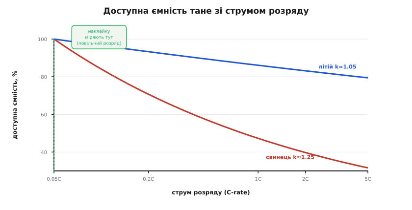
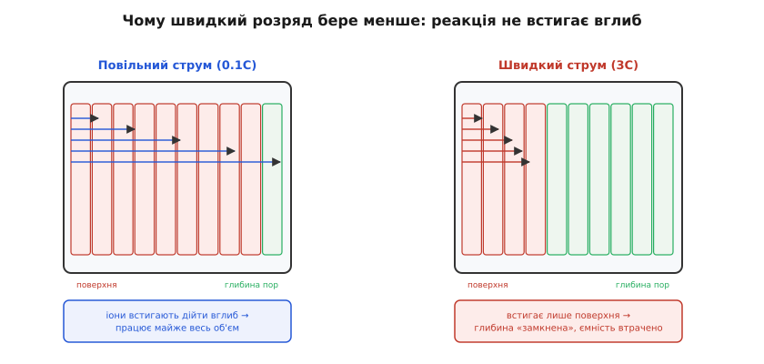
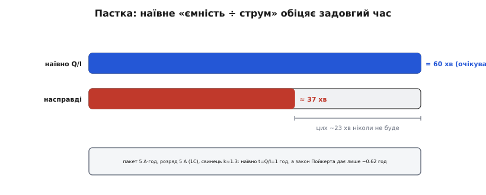

# Ефект Пойкерта й доступна ємність

На наклейці пише «5000 mAh» — і хочеться прочитати це як обіцянку: віддай мені 5 А, і я протримаюсь рівно годину. Не протримається. Реальний час буде помітно коротший, а якщо тягти струм ще жвавіше — коротший ще й ще, причому не пропорційно. Батарея начебто «недодає» тих ампер-годин, що обіцяла. Це не брак і не обман: тут працює **ефект Пойкерта** — стара, добре виміряна закономірність про те, що **доступна ємність тане тим більше, чим швидше розряджаєш**. Розберімо, звідки вона береться, як її рахувати числом і — головне — коли вона кусає боляче, а коли на неї можна майже не зважати.

### Ємність — не одне число, а сімейство

Перша й головна думка: **ємність батареї — не константа, а функція струму**. Коли виробник пише «5 А·год», він мовчки додає «…якщо розряджати повільно». Стандартний спосіб міряти ємність свинцевого акумулятора — **двадцятигодинний розряд** (позначають C/20): пакет висмоктують кволеньким струмом до відсічки й лічать віддані ампер-години. Це і є число з наклейки. Але щойно струм зростає, віддана ємність **падає** — і те саме число вже не діє.

Чому взагалі одна батарея віддає різну кількість заряду залежно від темпу? Бо хімія всередині — не миттєва. Заряд запасений у товщі електродів, а щоб його дістати, іони мусять **дійти** крізь електроліт до місця реакції, реакція має **встигнути**, продукти — **розійтися**. Дай на це час — і працює майже весь об'єм електрода. Квапся — і встигає прореагувати лише те, що близько до поверхні; глибина ще повна заряду, але ти вже дійшов до відсічки по напрузі й змушений спинитися. Заряд там **є**, але цієї миті **недоступний**.


*Доступна ємність (у відсотках від паспортної) як функція струму розряду. Наклейку міряють на **повільному** краю (ліворуч, штрихова лінія) — там усі 100%. З ростом струму крива осідає, і крутизна залежить від хімії: свинець (показник ≈ 1.25) втрачає велику частку вже на кількох C, а літій (≈ 1.05) тримається майже пласко. Це і є ефект Пойкерта — та сама батарея віддає різну ємність залежно від того, наскільки її квапиш.*

Ось чому так важливо не плутати два числа. Є **запасений** заряд — скільки хімії всередині взагалі здатне віддати. І є **доступний** заряд — скільки з нього вдасться дістати за цього конкретного струму, поки напруга не впала до відсічки. Ефект Пойкерта — це саме про розрив між ними: чим більший струм, тим ширший розрив, тим меншу частку запасу ти реально одержиш.

> 🔧 **Навіщо це.** Коли прикидаєш, «на скільки вистачить» батареї, ніколи не бери ємність із наклейки як пряме число для великого струму. Наклейка — це **повільний** край, найдоброзичливіший до батареї режим. Твій апарат майже завжди тягне швидше, тож реальний бюджет ампер-годин **менший** за паспортний — і саме на цю різницю проектують запас.

### Механізм: реакція не встигає вглиб

Придивімося зблизька, чому швидкий струм фізично не дає дістати весь заряд. Електрод батареї — не суцільний брусок, а **пориста губка**: величезна внутрішня поверхня, пронизана каналами з електролітом. Заряд «розкладений» по всій цій товщі. Щоб його забрати, у кожній точці має відбутися реакція, а для неї до цієї точки мусять **надійти** іони з електроліту.

За малого струму все спокійно: іони встигають продифундувати вглиб пор, реакція йде рівномірно по всій товщі, і майже весь запасений заряд стає роботою. За великого струму картина інша. Ти вимагаєш багато заряду **за одиницю часу** — а іони фізично не встигають дістатися глибини. Реакція концентрується біля **поверхні**, там швидко вичерпує доступне, місцева концентрація реагентів падає, і напруга на клемах провалюється до відсічки — хоча в глибині пор заряд ще й не чіпаний. Ти спинився не тому, що батарея порожня, а тому, що **не встиг** її випорожнити рівномірно.


*Чому швидкий розряд бере менше. Електрод — пориста губка з зарядом по всій товщі. Ліворуч (повільний струм) іони встигають дійти вглиб, реакція йде рівномірно — працює майже весь об'єм. Праворуч (швидкий струм) встигає прореагувати лише поверхня; глибина ще повна заряду, але напруга вже впала до відсічки, і той глибинний запас лишився недоступним. Заряд є — дістати його цим темпом не вдалося.*

Звідси — важлива й приємна деталь: **втрачена ємність не зникає безслідно**. Дай батареї відпочити після злого розряду — і напруга частково «оживе», бо іони встигнуть перерозподілитися, вирівняти концентрацію, і частину раніше недоступного заряду знову можна взяти. Це так званий **ефект відновлення** (англ. *recovery effect*): пакет, який щойно «сів» під великим струмом, за хвилину-дві спокою знову показує залишок. Тому переривчастий розряд (тягнув-відпустив-тягнув) віддає **більше** сумарного заряду, ніж той самий середній струм без пауз. Ефект Пойкерта в чистому вигляді — про **сталий** струм; жива робота з паузами до нього завжди трохи добріша.

Тепер видно й **чому** одні хімії страждають, а інші майже ні. Усе впирається в те, наскільки легко іонам рухатися й наскільки швидка реакція. У свинцевому акумуляторі електроліт — сірчана кислота, що сама **витрачається** в реакції: біля поверхні вона збіднюється, дифузія свіжої кислоти повільна, тож на великому струмі глибина «задихається» першою. У літієвій комірці іони літію рухаються крізь тонкі шари куди жвавіше, реакція інтеркаляції швидка, внутрішній опір малий — тому глибина встигає працювати навіть за пристойних струмів. Звідси й уся різниця в крутизні кривих вище: не магія, а різна рухливість носіїв заряду.

### Закон Пойкерта: доступна ємність числом

Спостереження гарне, але інженеру потрібне **число**. Ще 1897 року німецький інженер [**Вільгельм Пойкерт** (*Wilhelm Peukert*) виміряв цю залежність на свинцевих акумуляторах](topic:electronics/peukert-effect/hist-peukert-1897.md) і підібрав до неї просту степеневу формулу. Він розряджав акумулятори різних виробників сталими струмами різної величини й ретельно лічив віддані ампер-години до порогової напруги — і побачив, що вони систематично меншають зі струмом. У сучасному записі його формула зв'язує струм розряду I й час до відсічки t:

```
Iᵏ · t = стала
```

Тут **k — показник Пойкерта** (Peukert exponent), безрозмірне число, що й описує «норовливість» батареї. Уся сіль — у тому, що показник **більший за одиницю**. Якби k дорівнював рівно 1, формула казала б I · t = стала, тобто ампер-години не залежать від струму — ідеальна батарея, повний заряд доступний за будь-якого темпу. Але реальне k > 1 означає: підняв струм — і добуток Iᵏ·t мусить лишитися сталим лише за рахунок того, що t падає **швидше**, ніж просто обернено до струму. Різниця й з'їдається як «зникла» ємність.

Зручніше користуватися формою, що прямо дає **доступну ємність** відносно повільного розряду. Якщо на струмі I₀ (повільному, «паспортному») пакет віддає ємність C₀, то на швидшому струмі I доступна ємність C падає так:

```
C / C₀ = (I₀ / I)^(k − 1)
```

Показник (k − 1) — це і є «важіль» ефекту. Для ідеальної батареї він нуль, і C = C₀ завжди. Для реальної він додатний, тож більший струм I у знаменнику тягне частку вниз. [Виведення цієї форми з базового Iᵏ·t = стала й тонкість про вибір опорного струму](topic:electronics/peukert-effect/math-peukert-derivation.md) — окремою математичною вставкою; зараз важливіша сама поведінка й порядок чисел.

Типові показники варто тримати в голові, бо вони одразу кажуть, наскільки боятися ефекту:

```
свинець заливний   k ≈ 1.2 … 1.6   (найгірше — ефект дуже сильний)
свинець AGM/гель   k ≈ 1.05 … 1.25 (помітно краще)
NiMH               k ≈ 1.1  … 1.2
Li-ion / LiPo      k ≈ 1.01 … 1.1  (майже ідеал — ефект дрібний)
```

Порахуймо на живому, щоб цифри перестали бути абстракцією.

**Приклад (скільки ємності лишиться на 2C).** Свинцевий пакет із паспортом C₀ = 100 А·год, виміряним на повільному струмі I₀ = 5 А (тобто C/20). Показник k = 1.3. Скільки доступної ємності на струмі I = 40 А?

```
C / C₀ = (I₀ / I)^(k−1) = (5 / 40)^(1.3−1)
       = (0.125)^0.3
       ≈ 0.55

C ≈ 0.55 × 100 = 55 А·год
```

Тобто на цьому струмі зі «стоампергодинного» пакета доступно лише ~55 А·год — майже вдвічі менше за наклейку. А тепер той самий розрахунок для літію з k = 1.05:

```
C / C₀ = (5 / 40)^0.05 ≈ 0.90   →   C ≈ 90 А·год
```

Літій на тому самому темпі віддає ~90 із 100 — втрата лише десята частина. Ось чому в світі свинцю Пойкерт — постійна головна морока, а в світі літію про нього згадують хіба між іншим.

> 🔧 **Навіщо це.** Показник k — це паспорт «квапливості» вашої хімії. Свинець (k від 1.2 і вище) не можна проектувати «впритул»: на робочому струмі половини наклейки може не бути. Літій (k близько 1) прощає — можна рахувати майже за номіналом. Тому одна й та сама задача (скажімо, ДБЖ на пів години під великим струмом) вимагає геть різного запасу ємності залежно від того, свинець це чи літій.

### Головна пастка: наївне «ємність поділити на струм»

Тепер найпрактичніше — де ця фізика боляче б'є в розрахунках. Природний спосіб прикинути час роботи: узяти ємність і поділити на струм. Пакет 5 А·год, тягнемо 5 А — отже, година. Це **майже завжди бреше в більший бік**, і саме через Пойкерта: ділити треба не паспортну ємність, а **доступну на цьому струмі**, яка менша.


*Пастка наївного розрахунку. Формула «час = ємність ÷ струм» бере паспортну ємність (виміряну на повільному розряді) і застосовує її до великого струму — тому обіцяє задовгий час. Насправді на цьому струмі доступна лише частина ємності, тож реальний час помітно коротший. Різниця тим більша, чим більший показник k і чим жвавіший розряд.*

Полічімо чесно, з поправкою на Пойкерта.

**Приклад (справжній час роботи проти наївного).** Свинцевий пакет 5 А·год (паспорт на C/20, тобто I₀ = 0.25 А), показник k = 1.3. Тягнемо сталий струм I = 5 А (це 1C). Скільки протримається насправді?

Спершу наївна оцінка — просто ємність поділити на струм:

```
t_наївно = C₀ / I = 5 А·год / 5 А = 1.0 год
```

Тепер із поправкою. Знайдімо доступну ємність на 5 А:

```
C = C₀ · (I₀ / I)^(k−1) = 5 · (0.25 / 5)^0.3
  = 5 · (0.05)^0.3
  ≈ 5 · 0.407
  ≈ 2.0 А·год

t_реально = C / I = 2.0 / 5 ≈ 0.41 год ≈ 24 хв
```

Наївний розрахунок обіцяв годину — а пакет сів за ~24 хвилини. Більш ніж удвічі коротше, і вся різниця — Пойкерт. (Цифра сувора, бо взято велике k і струм у 20 разів вищий за паспортний; на м'якшому струмі й меншому k розрив був би менший — але напрямок помилки завжди той самий, у бік «занадто оптимістично».)

У прошивці цю поправку зручно тримати одним місцем — не рахувати час по паспортній ємності, а спершу привести ємність до реального струму:

:::tabs
```c
#include <math.h>

// Доступна ємність (А·год) на струмі load_A з поправкою Пойкерта.
// cap_rated_Ah  — паспортна ємність
// i_rated_A     — струм, на якому виміряли паспорт (напр. C/20)
// k             — показник Пойкерта хімії (свинець ~1.3, літій ~1.05)
static float peukert_capacity_Ah(float cap_rated_Ah, float i_rated_A,
                                 float load_A, float k)
{
    if (load_A <= 0.0f) return cap_rated_Ah;      // без навантаження — увесь запас
    return cap_rated_Ah * powf(i_rated_A / load_A, k - 1.0f);
}

// Оцінка часу до відсічки (год) за сталого струму.
static float runtime_hours(float cap_rated_Ah, float i_rated_A,
                           float load_A, float k)
{
    float cap = peukert_capacity_Ah(cap_rated_Ah, i_rated_A, load_A, k);
    return cap / load_A;                           // а не cap_rated_Ah / load_A!
}
```
```python
# Доступна ємність (А·год) на струмі load_A з поправкою Пойкерта.
# cap_rated_ah  — паспортна ємність
# i_rated_a     — струм, на якому виміряли паспорт (напр. C/20)
# k             — показник Пойкерта хімії (свинець ~1.3, літій ~1.05)
def peukert_capacity_ah(cap_rated_ah, i_rated_a, load_a, k):
    if load_a <= 0.0:
        return cap_rated_ah                        # без навантаження — увесь запас
    return cap_rated_ah * (i_rated_a / load_a) ** (k - 1.0)


# Оцінка часу до відсічки (год) за сталого струму.
def runtime_hours(cap_rated_ah, i_rated_a, load_a, k):
    cap = peukert_capacity_ah(cap_rated_ah, i_rated_a, load_a, k)
    return cap / load_a                            # а не cap_rated_ah / load_a!
```
:::

Ключове тут — коментар в останньому рядку: ділити на струм треба **приведену** ємність `cap`, а не паспортну `cap_rated_Ah`. Хто ставить у чисельник паспортне число, той і одержує оптимістичну брехню з першого прикладу.

> 🔧 **Навіщо це.** Будь-який «індикатор часу, що лишився» чи розрахунок автономності на свинці **зобов'язаний** мати цю поправку, інакше він систематично обіцяє більше, ніж пристрій дасть, — і вимикається раніше за обіцяне. Для літію поправка дрібна (k близько 1), тож нею часто нехтують; але для свинцевого ДБЖ, стартерної чи тягової батареї без неї розрахунок автономності просто неправильний.

### Межі закону: коли Пойкерт бреше сам

Закон Пойкерта — **емпіричний**: Пойкерт не вивів його з першопринципів, а **підібрав** просту формулу під виміряні криві свинцю. Тому в нього є чіткі межі застосовності, і плутати підгінну формулу з законом природи не варто.

Перше й головне: формула нічого не знає про **температуру**. А температура впливає на доступну ємність незалежно й сильно — на морозі хімія млявіша, дифузія повільніша, і навіть свіжий пакет віддає помітно менше. Класичне застереження звучить так: Пойкертом можна користуватися лише за **сталого струму й сталої температури**; вийшов за ці рамки — і формула вже не про твій випадок. Холодна батарея просяде куди глибше, ніж пророкує самé k.

Друге: Пойкерт мовчить про **старіння**. Показник виведено для конкретного стану комірки, а з віком і циклами реальна ємність [спадає окремим механізмом](topic:electronics/battery-aging), і внутрішній опір росте — тож стара батарея бреже вниз ще й із цієї, зовсім іншої причини. Пойкерт і старіння — два різні відрахунки від наклейки, які накладаються.

Третє: формула передбачає **сталий** струм. Жива робота — це піки й паузи, а через уже згаданий ефект відновлення переривчастий розряд віддає більше за рівний з тим самим середнім. Тому в реальному, «рваному» профілі Пойкерт зазвичай трохи **песимістичний** — фактичного заряду виходить більше, ніж дає формула для еквівалентного сталого струму.

І четверте, окреме для літію: там, де свинцю Пойкерт описує майже все, для літію він працює лише в **середині** діапазону (приблизно 0.2C…2C) з показником близько одиниці — а на **дуже** великих струмах літій усе одно втрачає ємність сильніше, ніж пророкує будь-яке скромне k. Тільки причина там уже інша: не так дифузія в глибину, як звичайна [просадка напруги на внутрішньому опорі](topic:electronics/battery-sag) — під великим струмом I·Rвн стягує напругу до відсічки завчасно, і розряд обривається, хоча заряд ще є. Тобто на високому C у літію головна втрата — не «класичний Пойкерт», а падіння напруги; підганяти під це степеневу криву можна, але фізика під нею інша.

> 🔧 **Навіщо це.** Пойкерт — добрий орієнтир, а не істина в останній інстанції. Для чесного бюджету енергії тримай у голові три поправки поза формулою: **холод** (окремо й сильно ріже ємність), **старіння** (окремий спад від наклейки) і **паузи** (рваний профіль додає заряду проти рівного). Точні паспортні криві «ємність від струму й температури» для конкретного пакета завжди надійніші за одне-єдине k.

### Місце в загальній картині

Складімо все докупи. Три поняття описують один живий бік батареї, і їх легко переплутати. **Просадка** — це миттєвий провал напруги під струмом (I·Rвн), який вертається, щойно струм спав. **Ефект Пойкерта** — це втрата **сумарного** заряду за весь розряд через те, що швидка реакція не дістає глибини; він не про мить, а про весь цикл. А [C-rate](topic:electronics/c-rate) — просто нормована мова струму, якою обидва явища зручно описувати (1C, 2C…). Просадка й Пойкерт — родичі (обидва ростуть із струмом і з внутрішнім опором), але це різні речі: одна про напругу зараз, другий про ампер-години загалом.

Практичний висновок теми короткий. **Ємність — не число, а крива від струму**; наклейку міряють на повільному краю, і на робочому струмі доступного заряду **менше**. Ефект Пойкерта дає цю втрату числом: C/C₀ = (I₀/I)^(k−1), де показник k > 1 тим більший, чим норовливіша хімія — від майже ідеального літію (k ≈ 1.05) до вередливого свинцю (k до 1.6). Головна пастка — рахувати час роботи як «паспортна ємність ÷ струм»: це систематично **завищує** результат, бо ділити треба **доступну** ємність. І пам'ятай межі: закон емпіричний, справедливий лише за сталих струму й температури, мовчить про холод, старіння й паузи. Хто тримає це в голові, той більше не дивується, чому «повний» пакет під навантаженням сідає раніше за обіцяне, — і закладає в розрахунок правильний, менший бюджет ампер-годин. Точний **розрахунок автономності** з усіма цими поправками разом — [окрема прикладна тема](topic:electronics/battery-life-calculation).

---
