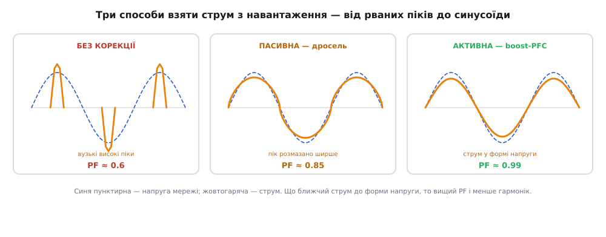
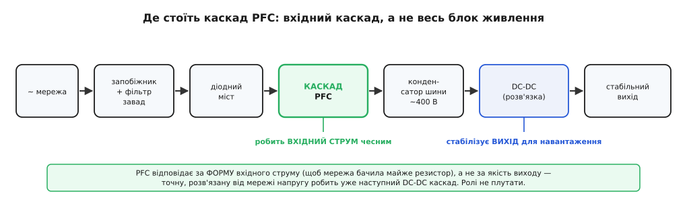

# Корекція коефіцієнта потужності (PFC)

<preknowlist>
- [Коефіцієнт потужності](book:electronics/power-factor) — що це за число й як воно розпадається на зсув (cos φ) і спотворення форми струму.
- [Гармонічні спотворення](book:electronics/harmonic-distortion) — з чого складається «несинусоїдний» струм: вищі гармоніки й міра THD.
- [Випрямлення](book:electronics/rectification) — діодний міст із конденсатором на вході приладу, звідки й береться рваний вхідний струм.
- [Реактивна потужність](book:electronics/reactive-power) — енергія, що лише гойдається між полем і мережею й нічого не робить; саме її прибирає конденсатор.
</preknowlist>

Сама назва — «корекція коефіцієнта потужності» (англ. *power factor correction*, PFC) — звучить так, ніби йдеться про одну процедуру. Насправді за нею ховаються два зовсім різні ремонти, і сплутати їх — найдорожча помилка початківця. Річ у тім, що [коефіцієнт потужності](book:electronics/power-factor) можна зіпсувати двома незалежними способами, і кожен лікують своїм інструментом; узяти не той — усе одно що ліпити пластир там, де потрібен гіпс. Тож розмову про PFC треба починати не з того, *чим* коригувати, а з того, *що саме* зламалося.

## Дві хвороби, два ліки

Уявімо поруч дві криві: напругу мережі й струм, який тече з розетки в прилад. Коефіцієнт потужності — по суті, міра того, наскільки добре ці двоє збігаються в часі. Збіг псується двома різними шляхами, і в цьому вся сіль.

Перший шлях — струм лишається **чистою синусоїдою, але зсувається** в часі відносно напруги. Так поводиться все, у чому багато заліза й обмоток: мотор, трансформатор, дросель. Вони тягнуть [реактивну потужність](book:electronics/reactive-power) — енергію, що не робить роботи, а лише перекочується між магнітним полем і мережею. Винен тут косинус кута зсуву, cos φ, і лік напрошується сам собою: причепити поряд елемент із протилежним норовом. Індуктивний мотор запізнює струм — конденсатор його, навпаки, випереджає; поставлені пліч-о-пліч, вони обмінюються тією гойданкою локально, між собою, не ганяючи її крізь усю лінію. Активна потужність до мотора доходить та сама, а зайвий струм у дротах зникає. Це найстарша, «енергетична» корекція: банка конденсаторів біля верстата чи в цеховому щиті.

Другий шлях зіпсувати збіг — геть інакший. Струм може бути точно **у фазі** з напругою — і все одно нищівно псувати коефіцієнт, бо він **не тієї форми**. Саме так поводиться вхід майже будь-якого сучасного приладу. Одразу за вилкою стоїть [випрямляч](book:electronics/rectification) і великий конденсатор, який заряджається лише короткими сплесками поблизу вершин синусоїди, а решту періоду мовчить, бо діоди закриті. Мережа бачить не плавну хвилю, а вузькі високі піки двічі за період. Ці піки симетричні відносно вершини напруги, тож зсуву майже немає, cos φ ≈ 1 — а коефіцієнт потужності все одно падає до 0.5–0.65. Уся біда сидить у формі: рваний струм — це сума синусоїди основної частоти й цілого хору вищих [гармонік](book:electronics/harmonic-distortion), яких у чистій синусоїді не буває зроду.

Ось чому діагноз важить більше за лік. Конденсатор, що творить дива з мотором, проти рваного струму випрямляча **безсилий**: він уміє прибрати зсув, але не вміє перемалювати форму. А щоб виправити форму, потрібна інша, активніша схема — і вона нічого не дасть моторові, у якого форма й так синусоїдна. Дві різні поломки, два різні інструменти — і саме ця розвилка задає всю решту теми.


*Коефіцієнт потужності гине двома незалежними способами. Зсув (ліворуч) — струм синусоїдний, але запізнюється чи випереджає напругу; його прибирає реактивна компенсація конденсатором. Спотворення (праворуч) — струм у фазі, та не синусоїдний, а рваний, багатий на гармоніки; тут конденсатор безсилий, треба перемалювати саму форму струму. Спершу постав діагноз — тоді обирай лік.*

> 🔧 **Навіщо це.** Плутанина цих двох хвороб — класична пастка на практиці. Інженер бачить у паспорті блока живлення «PF = 0.6» і за звичкою тягнеться до конденсатора, як біля мотора. Але тут причина у формі, а не у зсуві, тож конденсатор на вході нічого не виправить — лише додасть резонансів із індуктивністю лінії. Правильний хід — розпізнати, що струм рваний, і ставити схему, яка **формує** його. Тому перше питання про будь-яке навантаження одне: у нього струм зсунутий чи спотворений? Відповідь визначає геть усе інше.

## Чому спотворення стало проблемою цілих будівель

Мотори людство знає давно, і енергетики давно вміють їх компенсувати конденсаторами. Масовою й новою стала саме **друга** хвороба — спотворення. Причина проста: за кілька десятиліть майже кожен прилад у розетці обзавівся тим самим входом «випрямляч плюс конденсатор». Комп'ютер, зарядка телефона, світлодіодна лампа, телевізор, блок живлення роутера — усі вони тягнуть той самий рваний струм. Поодинці кожен дрібний, але їх мільйони, і їхні спотворення складаються.

Найпідступніша тут — **третя гармоніка** (утричі вища за частоту мережі) та її родички, кратні трьом (дев'ята, п'ятнадцята — їх звуть триплен-гармоніками). У трифазній проводці будівлі три фази зсунуті на 120°, і звичайні струми в нейтральному проводі гарно гасять одне одного. Але триплен-гармоніки цих трьох фаз виявляються **у фазі між собою** — тож у нейтралі вони не віднімаються, а **додаються**. Наслідок ламає інтуїцію: у будинку, напханому комп'ютерами, струм у нейтральному проводі може перевищити струм у фазних, хоч нейтраль розрахована на найменше навантаження й часто навіть не має власного запобіжника. Вона перегрівається. Додайте сюди зайвий нагрів трансформаторів і спотворення самої напруги мережі — і стане ясно, чому регулятори втрутилися.

Втручання набуло форми норми: європейський стандарт [EN/IEC 61000-3-2](book:electronics/harmonic-distortion) прямо обмежує гармоніки струму, які прилад має право вкидати в мережу через розетку (він стосується обладнання до 16 А на фазу й обмежує гармоніки з 2-ї до 40-ї). Для приладів на кшталт комп'ютерів, моніторів і телевізорів норма особливо сувора й вмикається вже понад приблизно **75 Вт** спожитої потужності. Простий випрямляч із конденсатором цих меж **не проходить** — і корекція форми струму зі зручної опції перетворилася на обов'язок. Саме норма, а не бажання інженера, зробила PFC повсюдним. Як склалася ця історія — від засмічених мереж 1970–80-х до чинних сьогодні стандартів і появи активного PFC — розказано в [окремій вставці](book:electronics/pfc-basics/hist-pfc-story.md).

## Пасивна корекція: виправити форму залізом

Найпряміший спосіб згладити рваний струм не потребує жодної електроніки — лише правильно поставленого **дроселя** (котушки з великою індуктивністю) у тракті струму, до або після мосту. Уся суть — у корінній властивості котушки: вона [опирається різкій зміні струму](book:electronics/inductor-energy), бо швидка зміна породжує на ній зустрічну напругу. Тож котушка просто не дає струмові скочити гострим піком на вершині синусоїди — вона розмазує той сплеск, робить його ширшим і нижчим, ближчим до плавної хвилі. Струм тече довше й рівніше, гармонік меншає, коефіцієнт потужності підіймається.

Ціна цієї простоти — вага й габарит. Дросель тут працює на частоті мережі (50 чи 60 Гц), а на такій низькій частоті котушка потрібної індуктивності — це чималий шмат заліза й міді, важкий і громіздкий. І виправляє він лише частково: пасивний дросель піднімає коефіцієнт потужності десь до 0.8–0.9, а не до одиниці, і його вплив залежить від навантаження й частоти мережі. Зате він майже незнищенний, нічого не гріється зайве, не свистить на радіочастотах і ніколи не «зависає», як мікросхема.

Є й хитріший пасивний прийом — схема **заповнення провалів** (англ. *valley-fill*): невеличка мережа з діодів і кількох конденсаторів, що змушує випрямляч живити навантаження не лише на самих вершинах, а й у провалах між ними, розтягуючи час, коли струм тече з мережі. Це піднімає коефіцієнт потужності приблизно до 0.9, коштує дешевше за важкий дросель, але додає більшу пульсацію на виході. Пасивні методи взагалі — вибір там, де понад усе цінують дешевину, надійність і байдужість до перешкод, а зайва вага й неідеальний коефіцієнт потужності терпимі: скромні блоки, прості світлодіодні драйвери, промислова техніка, що має пережити десятиліття.

## Активна корекція: примусити ключ малювати струм

Коли треба вичавити коефіцієнт потужності до майже одиниці — а норми для потужних приладів саме цього й вимагають, — пасивного заліза замало. Тоді між випрямлячем і рештою блока живлення ставлять невеликий імпульсний перетворювач і змушують його **активно тягнути з мережі струм тієї самої форми, що й напруга**. Не згладжувати пік заднім числом, як дросель, а від початку малювати гладку синусоїду, ганяючи струм слідом за напругою мережі. Прилад тоді поводиться перед мережею так, ніби за вилкою сидить звичайний **резистор**, — а резистор має коефіцієнт потужності рівно одиницю й не породжує гармонік. Цей прийом так і звуть — «емуляція опору».

Перетворювачем тут майже завжди служить [підвищувальний boost](book:electronics/boost): у нього котушка стоїть просто на вході й проводить вхідний струм безперервно, а безперервним струмом тільки й можна керувати гладко. Контролер щомиті підганяє роботу ключа так, щоб струм котушки повторював форму випрямленої напруги: на вершині синусоїди жене більший струм, біля переходу через нуль — майже нульовий. Результат разючий: коефіцієнт потужності 0.99 і вище, гармоніки далеко під нормами, і все це в усьому діапазоні напруг універсальної мережі. Розплата — доданий силовий каскад із власним ключем: це і гроші, і складніше керування, і власні високочастотні перешкоди, і пусковий кидок струму при вмиканні. Чому саме boost, як контролер будує еталон струму й чим різняться режими його роботи — докладно розібрано в темі про [активний boost-PFC](book:electronics/boost-pfc); тут досить утримати головне: активна корекція не гасить пік, а від початку не дає йому виникнути.


*Однакове навантаження, три способи взяти з нього струм. Некоригований вхід випрямляча тягне рвані піки — багато гармонік, низький коефіцієнт. Пасивний дросель опирається різкій зміні струму й розмазує пік у ширшу похилу горбину — уже помітно краще, але не синусоїда. Активна корекція формує майже ідеальну синусоїду в такт із напругою. Що ближчий струм до форми напруги, то вищий коефіцієнт потужності й менше гармонік.*

## Де стоїть каскад PFC і як обрати

Корисно бачити, куди в блоці живлення вписується корекція. Струм із розетки проходить запобіжник і фільтр перешкод, тоді [діодний міст](book:electronics/bridge-rectifier) робить із змінної напруги пульсуючу, і аж тепер — каскад PFC. Він віддає високу проміжну шину (в активному варіанті близько 400 В), із якої вже наступний [DC-DC перетворювач](book:electronics/switching-converter) робить точну, розв'язану від мережі напругу для апаратури. Звідси випливає річ, яку легко проґавити: **PFC не стабілізує вихід приладу**. Його робота — зробити струм на вході *чесним*, тобто схожим на напругу; годувати навантаження точною напругою — обов'язок наступного каскаду. Плутати ці ролі не можна.


*Корекція коефіцієнта потужності — це вхідний каскад, а не весь блок живлення. Він стоїть одразу за випрямлячем і готує високу проміжну шину з добрим коефіцієнтом потужності. Точну ж напругу для навантаження — стабільну, розв'язану від мережі — робить уже наступний DC-DC каскад. PFC відповідає за форму вхідного струму, DC-DC — за якість вихідної напруги.*

Вибір між пасивним і активним підходом майже завжди вирішує потужність укупі з нормами:

| | Пасивна (дросель / valley-fill) | Активна (boost-PFC) |
|---|---|---|
| Коефіцієнт потужності | ~0.8–0.9 | ~0.99 і вище |
| Складність | котушка, жодної електроніки | силовий ключ + контролер |
| Вага й розмір | великий низькочастотний дросель | компактний, працює на високій частоті |
| Перешкоди | майже нема власних | власні високочастотні, потрібен фільтр |
| Де доречна | скромні блоки, надійність, дешевина | потужні прилади, суворі норми |

Практичне правило коротке. Нижче приблизно 75 Вт норми поблажливі — часто корекція взагалі не потрібна, і виграє найдешевше рішення. Для скромної потужності, де важать ціна та невибагливість, а зайва вага терпима, беруть пасивний дросель. А от усе поважне — комп'ютерні й серверні блоки, зарядки ноутбуків, потужні світлодіодні драйвери — мусить проходити сувору норму, і там активний boost-PFC став стандартом де-факто.

Щоб відчути, що дає корекція на практиці, порахуймо не абстрактний коефіцієнт, а цілком відчутну річ — скільки приладів витримає одна розеткова лінія.

**Умова.** Лінія 230 В із автоматом на 16 А. Скільки блоків живлення по 150 Вт вона потягне — без корекції (типовий PF входу «міст плюс конденсатор» близько 0.6) і з активним PFC (PF ≈ 0.99)?

```c
// Струм, який блок бере з лінії: I = S / U = (P / PF) / U.
// Скільки таких блоків влізе під автомат: n = I_max / I.
float p_w   = 150.0f;    // корисна потужність одного блока, Вт
float u_v   = 230.0f;    // напруга мережі, В
float i_max = 16.0f;     // струм автомата лінії, А

// без корекції: рваний струм, низький коефіцієнт потужності
float pf_bad = 0.60f;
float i_bad  = (p_w / pf_bad) / u_v;   // = (150/0.60)/230 = 250/230 ≈ 1.09 А
int   n_bad  = (int)(i_max / i_bad);   // = 16 / 1.09 ≈ 14 блоків

// з активним PFC: струм у формі синусоїди, коефіцієнт майже одиниця
float pf_good = 0.99f;
float i_good  = (p_w / pf_good) / u_v; // = (150/0.99)/230 = 151.5/230 ≈ 0.66 А
int   n_good  = (int)(i_max / i_good); // = 16 / 0.66 ≈ 24 блоки
```

**Висновок.** Та сама корисна потужність, та сама проводка — але з корекцією лінія тягне близько 24 блоків замість 14, майже на сімдесят відсотків більше. Корекція не додала жодного корисного вата; вона лише прибрала «порожній» струм, який доти намарно грів дроти й займав автомат. А нагрів нейтралі від гармонік падає ще різкіше, ніж діюче значення струму, — бо разом із формою зникають і триплен-гармоніки, що складалися в нейтральному проводі.

І в цьому — уся суть PFC. Це не окремий прилад і не одна схема, а **дисципліна робити так, щоб струм навантаження знову скидався на напругу**: прибрати зсув конденсатором, коли винен мотор, або перемалювати форму — дроселем чи, коли треба по-справжньому, активним перетворювачем, — коли винен випрямляч. Назви хворобу правильно, і лік стане очевидним.
