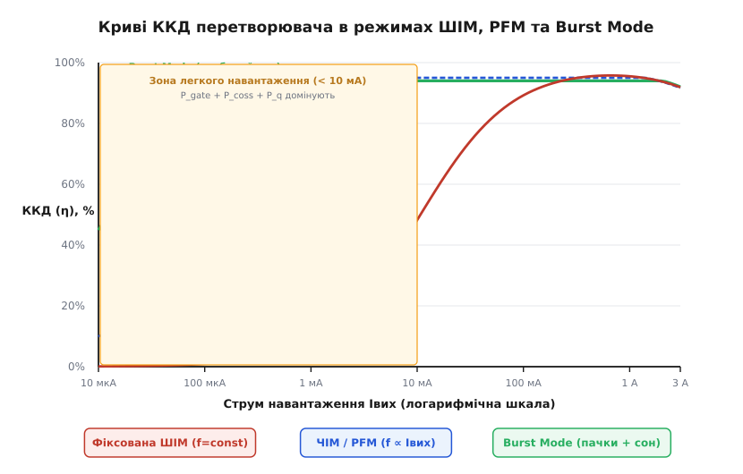
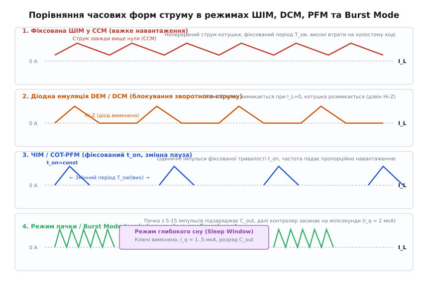
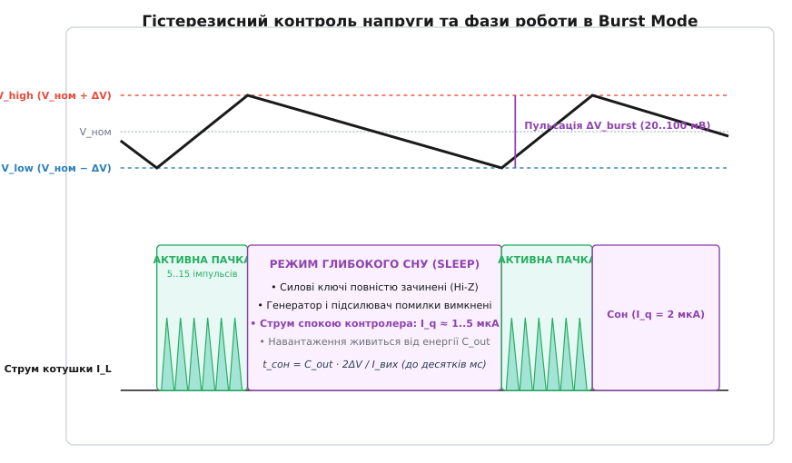
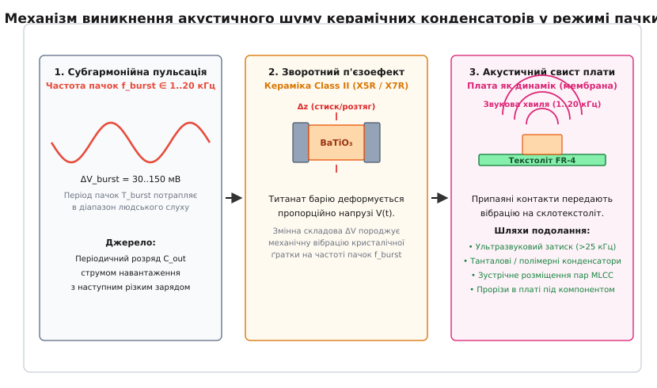

# PFM і burst-mode: режими легкого навантаження

<preknowlist>
- [Buck-перетворювач](topic:electronics/buck) — базові фази комутації, вольт-секундний баланс і роль індуктивності.
- [Втрати перемикання в силових ключах](topic:electronics/switching-losses) — динамічні втрати на перезаряд ємностей та перекриття струму й напруги.
- [Крива ефективності перетворювача](topic:electronics/converter-efficiency-curve) — чому фіксовані втрати домінують на малій потужності.
- [Межа CCM/DCM у DC-DC перетворювачах](topic:electronics/ccm-dcm-boundary) — перехід у переривчастий режим струму котушки.
- [Синхронний випрямляч](topic:electronics/sync-rectifier) — заміна діода на MOSFET і двостороннє протікання струму.
- [Ємність затвора](topic:electronics/gate-capacitance) — заряд Q_g і ціна його циклічного перезаряду на високій частоті.
</preknowlist>

Батарейний бездротовий датчик на базі мікроконтролера STM32 та радіомодуля BLE у режимі глибокого сну споживає струм 40 мкА при напрузі 3.3 В — тобто корисна вихідна потужність становить лише 132 мкВт. Якщо цей вузол живиться від літієвого акумулятора з напругою 12 В через звичайний синхронний знижувальний перетворювач (Buck), що працює на фіксованій частоті ШІМ 2 МГц, то на кожен такт комутації драйвер затворів витрачає заряд 15 нКл, перезаряджає паразитні ємності польових транзисторів і живить внутрішні аналогові вузли керування, розсіюючи понад 180 мВт фіксованої потужності незалежно від навантаження. У результаті коефіцієнт корисної дії перетворювача падає до 0.07 %, а акумулятор ємністю 2000 мА·год повністю розряджається за три доби замість запланованих п'яти років автономної роботи.

Цей парадокс виникає в усіх імпульсних топологіях (Buck, Boost, Buck-Boost, Flyback), коли їх змушують працювати на фіксованій частоті при струмах, на кілька порядків менших за номінальні. Щоб зберегти енергію джерела живлення, перетворювач повинен докорінно змінити фізику своєї роботи: припинити марне перемикання ключів, заблокувати зворотне викачування енергії з виходу та перейти в режими частотно-імпульсної модуляції (PFM) або пачкової генерації з глибоким сном (Burst Mode).

### Пастка фіксованої частоти: анатомія втрат на холостому ході

При номінальному навантаженні в кілька ампер імпульсний перетворювач демонструє відмінний ККД на рівні 92–96 %. У цьому робочому режимі переважну частку втрат складають омічні втрати провідності в каналах відкритих польових транзисторів (`I² · R_ds(on)`), активному опорі дроселя (`I² · R_dcr`) та еквівалентному послідовному опорі конденсаторів. Динамічні втрати на перемикання становлять порівняно невелику частку від сотень ват або ват корисної потужності, що проходять крізь схему.

Проте щойно навантаження спадає до мікроамперних значень, втрати провідності практично зникають, оскільки вони зменшуються пропорційно квадрату струму (`I_out²`). Натомість на перший план виходять процеси, ціна яких залежить виключно від кількості перемикань за секунду, тобто від тактової частоти `f_sw`.

Кожен період комутації вимагає виконання незмінного набору фізичних дій, на які витрачається чітко визначена порція енергії:

1. **Перезаряд затворів польових транзисторів (`P_gate`).** Щоб відкрити силовий MOSFET, драйвер повинен подати в його затвор повний заряд `Q_g`, піднявши напругу на затворі до `V_gs`. Під час закривання цей заряд скидається в землю. Потужність, що безповоротно перетворюється на тепло в драйвері та внутрішньому опорі затвора:

```
P_gate = f_sw · (Q_g_hs + Q_g_ls) · V_gs
```

При частоті 2 МГц, заряді затвора 15 нКл для верхнього і нижнього ключів та напрузі керування 5 В ця складова безперервно розсіює 150 мВт, незалежно від того, чи живить перетворювач потужний процесор, чи перебуває в повному холостому ході.

2. **Перезаряд вихідної паразитної ємності ключів (`P_coss`).** Комутаційний вузол схеми (точка з'єднання ключів і дроселя) має паразитну ємність відносно землі, утворену вихідними ємностями транзисторів `C_oss` та ємністю монтажу друкованої плати. Кожного разу, коли відкривається верхній ключ, ця ємність заряджається до вхідної напруги `V_in`, накопичуючи енергію `0.5 · C_oss · V_in²`, яка при закриванні розсіюється в тепло:

```
P_coss = 0.5 · C_oss · V_in² · f_sw
```

При `V_in = 12 В`, `C_oss = 150 пФ` та `f_sw = 2 МГц` втрати на ємності вузла додають ще 21.6 мВт постійного розсіювання.

3. **Втрати перекриття струму й напруги (`P_sw`).** Під час фронтів наростання (`t_r`) та спадання (`t_f`) напруги через відкриваний транзистор одночасно діє значна напруга та протікає струм, створюючи миттєвий сплеск потужності, пропорційний частоті комутації.

4. **Втрати на перемагнічування осердя дроселя (`P_core`).** Змінний магнітний потік у фериті викликає магнітний гістерезис і наводить вихрові струми Фуко в матеріалі осердя.

5. **Власне споживання контролера (`P_q`).** Внутрішній генератор пилкоподібної напруги, диференційний підсилювач помилки зі смугою пропускання в кілька мегагерц, високошвидкісні компаратори та прецизійне джерело опорної напруги (bandgap reference) потребують безперервного струму живлення `I_q ≈ 1–3 мА`. При вхідній напрузі 12 В це дає додаткові 12–36 мВт статичних втрат.


*Криві ККД перетворювача в режимах фіксованої ШІМ, ЧІМ (PFM) та Burst Mode. На струмах менше 10 мА незмінні втрати комутації в режимі ШІМ спричиняють лавиноподібне падіння ККД, тоді як PFM та Burst Mode утримують енергоефективність на рівні понад 85 % завдяки масштабуванню частоти комутацій та вимкненню внутрішніх вузлів.*

Сума всіх цих складових формує масивний енергетичний бар'єр холостого ходу:

```
P_fix = P_gate + P_coss + P_core + P_q ≈ 50..200 мВт
```

Якщо корисна потужність навантаження падає до 100 мкВт, а фіксовані втрати становлять 100 мВт, то 99.9 % всієї енергії акумулятора витрачається виключно на паразитичний саморозігрів мікросхеми перетворювача.

> 🧮 **Математика процесу.** Повний аналітичний вивід залежностей усіх складових динамічних і статичних втрат, знаходження точки оптимуму ККД та точний розрахунок терміну служби батареї наведено в математичній вставці [🧮 Баланс втрат і математика енергозбереження на малому навантаженні](topic:electronics/pfm-burst-mode/math-light-load-losses.md).

### Діодна емуляція (DEM) та перехід у режим DCM

Першим кроком до порятунку енергоефективності на легкому навантаженні є запобігання зворотній циркуляції енергії в силовому контурі.

У неперервному режимі провідності (Continuous Conduction Mode, CCM) струм крізь котушку індуктивності коливається навколо середнього значення з розмахом пульсацій `ΔI_L`. Розмах пульсацій визначається індуктивністю дроселя, вхідною та вихідною напругами й тактовою частотою:

```
ΔI_L = ((V_in - V_out) · V_out) / (V_in · L · f_sw)
```

Поки струм навантаження перевищує половину пульсацій (`I_out > ΔI_L / 2`), струм у дроселі ніколи не опускається до нуля. Проте коли споживання спадає нижче критичного порогу `I_crit = ΔI_L / 2`, нижній край трикутної хвилі струму перетинає нульову вісь.

Поведінка перетворювача в цій точці кардинально залежить від типу випрямляча:

В **асинхронному перетворювачі** роль нижнього ключа виконує діод Шотткі. Діод за своєю фізичною природою є односпрямованим приладом. Щойно струм дроселя спадає до нуля, діод миттєво зачиняється під дією зворотної напруги, розриваючи коло. Дросель вичерпує свій запас енергії, струм залишається нульовим до початку наступного такту, і схема автоматично переходить у переривчастий режим провідності (Discontinuous Conduction Mode, DCM).

У **синхронному перетворювачі** замість діода встановлено нижній польовий транзистор (Low-Side MOSFET). Відкритий канал польового транзистора є симетричним активним опором `R_ds(on)` і чудово проводить струм в обох напрямках — як від витоку до стоку, так і від стоку до витоку. Якщо схема керування продовжує утримувати нижній ключ відкритим упродовж усієї другої фази такту, струм у дроселі після перетину нуля не зупиняється, а продовжує наростати у від'ємну область.

Від'ємний струм означає, що енергія починає викачуватися з вихідного конденсатора назад у дросель і крізь нижній ключ скидатися на землю, а під час замикання верхнього ключа — перекачуватися у вхідне джерело. Цей режим називають **примусовим неперервним режимом** (Forced Continuous Conduction Mode, FCCM). У FCCM на холостому ході утворюються величезні реактивні циркуляційні струми, які марно гріють транзистори та котушку й генерують потужні високочастотні пульсації напруги.


*Часові діаграми струму дроселя в чотирьох режимах роботи. У режимі FCCM струм стає від'ємним; діодна емуляція (DEM) фіксує перетин нуля й розмикає ключ, переводячи вузол у стан Hi-Z; ЧІМ (PFM) масштабує період між поодинокими імпульсами; Burst Mode накопичує заряд серією імпульсів із подальшим глибоким вимкненням схеми.*

Щоб відновити природну поведінку діода в синхронній схемі, застосовують **режим діодної емуляції** (Diode Emulation Mode, DEM), також відомий як безаварійний перехід у DCM:

1. Внутрішній компаратор нульового струму (Zero-Cross Detector, ZCD) безперервно відстежує падіння напруги між стоком і витоком нижнього транзистора `V_ds = I_L · R_ds(on)`.
2. Поки струм дроселя тече у прямому напрямку (від землі до комутаційного вузла), напруга `V_ds` є від'ємною.
3. Щойно струм спадає до нуля, напруга на стоці досягає нульового потенціалу (`V_ds ≈ 0 В`).
4. Компаратор ZCD миттєво формує сигнал на вимкнення драйвера нижнього ключа, замикаючи транзистор достроково.

З моменту закриття нижнього MOSFET обидва силові ключі стають розімкненими (стан високого імпедансу, Hi-Z). Комутаційний вузол перетворювача повисає в повітрі. Індуктивність дроселя утворює паразитний коливальний контур із вихідними ємностями транзисторів `C_oss`, створюючи характерний затухаючий високочастотний дзвін на рівні вихідної напруги `V_out`. Струм при цьому залишається строго нульовим, а паразитичне розряджання вихідного конденсатора повністю припиняється.

Особливу інженерну увагу в схемотехніці ZCD приділяють швидкодії компаратора. Якщо затримка спрацьовування компаратора становить 30–50 нс, то при великій швидкості спадання струму `di/dt` струм дроселя встигає піти у від'ємну область на 50–150 мА до моменту фізичного вимкнення затвора. Для компенсації цієї затримки в сучасних PMIC застосовують схеми предиктивного вимкнення з невеликим позитивним зміщенням порогу спрацьовування (Offset Voltage).

> 🔧 **Навіщо це.** Діодна емуляція — обов'язковий перший бар'єр захисту енергії в синхронних конвертерах. Без неї перетворювач на холостому ході працює як повноцінний генератор струму розряду вихідної ємності, спалюючи акумулятор навіть за відсутності корисного споживача.

### Частотно-імпульсна модуляція (PFM): адаптивна частота комутації

Зупинка зворотного струму за допомогою діодної емуляції усуває викачування енергії, але залишає незмінною головну проблему: при фіксованій тактовій частоті верхній ключ продовжує відкриватися 1–2 мільйони разів на секунду, марно витрачаючи заряд затворів.

Якщо навантаження зменшилося в 1000 разів, то й кількість енергетичних імпульсів за секунду має зменшитися рівно в 1000 разів. Саме на цьому фізичному принципі базується **частотно-імпульсна модуляція** (Pulse Frequency Modulation, PFM), яку в технічній документації часто позначають як режим пропуску імпульсів (Pulse Skipping) або енергозберігаючий режим (Power-Save Mode / Eco-mode).

Найбільш досконалою формою PFM є схема з **фіксованим часом увімкнення** (Constant On-Time, COT-PFM):

1. Коли вихідна напруга під дією струму навантаження просідає нижче цільового значення, контролер відкриває верхній ключ на строго фіксований квант часу `t_on`.
2. За час `t_on` струм у дроселі лінійно наростає до постійного пікового значення:

```
I_pk = ((V_in - V_out) / L) · t_on
```

3. У котушці індуктивності накопичується строго дозована порція магнітної енергії `E_packet = 0.5 · L · I_pk²`.
4. Верхній ключ зачиняється, вмикається нижній ключ, і вся накопичена енергія повністю передається у вихідний конденсатор та навантаження.
5. Щойно струм спадає до нуля, компаратор діодної емуляції вимикає нижній ключ.
6. Контролер переходить у режим очікування: генерація наступного імпульсу блокується доти, доки вихідний конденсатор знову не розрядиться до порогу вмикання.

Оскільки кожна комутаційна подія передає фіксовану кількість енергії `E_packet`, вихідна потужність перетворювача прямо визначається частотою проходження цих імпульсів:

```
P_out = V_out · I_out = E_packet · f_pfm
```

Звідси випливає фундаментальна пропорція режиму ЧІМ:

```
f_pfm = (V_out · I_out) / E_packet ∝ I_out
```

Частота перемикання перестає бути жорсткою константою генератора й починає автоматично та плавно масштабуватися вслід за струмом навантаження:
- При струмі навантаження 1 А перетворювач працює на максимальній частоті 1.5 МГц.
- При зменшенні струму до 10 мА частота падає до 15 кГц.
- При струмі 100 мкА частота знижується до 150 Гц.

Разом зі зниженням частоти комутацій пропорційно зменшуються динамічні втрати на перезаряд затворів (`P_gate ∝ f_pfm`) та комутаційного вузла (`P_coss ∝ f_pfm`). ККД перетворювача залишається стабільно високим (80–90 %) у діапазоні зміни струму навантаження на 3–4 порядки.

### Режим пачки (Burst Mode): глибокий сон кіл керування

Попри високу ефективність ЧІМ, у мікропотужній зоні (струми споживання менше 50–100 мкА) навіть режим поодиноких імпульсів натрапляє на нездоланний бар'єр: власне статичне споживання аналогових блоків мікросхеми.

Швидкодіючий підсилювач сигналу помилки зі зворотним зв'язком, високочастотний внутрішній генератор тактових сигналів, джерела опорного струму зміщення та логіка захисту продовжують споживати свій струм спокою `I_q ≈ 0.5–2 мА` цілодобово. Навіть якщо комутаційні імпульси генеруються рідко, постійне споживання аналогового ядра у 1 мА при навантаженні датчика 10 мкА не дозволяє ККД піднятися вище 1 %.

Для подолання цієї межі розроблено **режим пачки** (Burst Mode / Sleep Mode), архітектура якого повністю відмовляється від безперервної роботи аналогових вузлів керування.


*Принцип гістерезисного регулювання в режимі Burst Mode. Контролер формує щільну пачку з 5–15 імпульсів високого ККД, заряджаючи вихідний конденсатор до верхнього порогу V_high. Після цього всі силові ключі, генератори й підсилювачі вимикаються, переводячи мікросхему в режим мікропотужного сну (I_q = 2 мкА) на десятки мілісекунд.*

У режимі Burst Mode керування базується на надмалопотужному гістерезисному компараторі з двома чіткими порогами напруги:
- Верхній поріг відключення: `V_high = V_nom + ΔV_burst` (зазвичай на 20–50 мВ вище номіналу);
- Нижній поріг увімкнення: `V_low = V_nom - ΔV_burst` (на 20–50 мВ нижче номіналу).

Робочий процес складається з двох циклічних фаз:

#### 1. Фаза активної пачки (Burst Active Window)
Коли вихідна напруга внаслідок розряду конденсатора падає до нижнього порогу `V_low`, компаратор пробудження активує силові драйвери та тактовий генератор. Перетворювач видає коротку, щільну серію з 5–20 імпульсів на найвищій тактовій частоті (1–2 МГц) з фіксованим, оптимальним з точки зору ККД піковим струмом дроселя.

Оскільки струм, що віддається пачкою імпульсів, у сотні разів перевищує слабкий струм споживання навантаження, надлишкова енергія з високою швидкістю закачується у вихідний конденсатор, швидко піднімаючи напругу від `V_low` до `V_high`. Тривалість активної пачки зазвичай складає лічені мікросекунди (5–20 мкс).

#### 2. Фаза глибокого сну (Burst Sleep / Standby Window)
Щойно напруга на виході перетинає верхній поріг `V_high`, контролер негайно зупиняє комутацію та знеструмлює власні внутрішні блоки:
- Верхній і нижній силові транзистори повністю блокуються у стані Hi-Z;
- Вимикаються високошвидкісні підсилювачі помилки та тактовий генератор;
- Знеструмлюються проміжні каскади драйверів затворів.

Увімкненим залишається лише один надмалопотужний компаратор стеження на базі нанопотужних джерел струму. У результаті власний струм спокою мікросхеми падає з міліампер до мікроамперного рівня:

```
I_q_sleep = 1..5 мкА (у передових PMIC — до 60 нА)
```

Упродовж усієї фази сну навантаження живиться виключно за рахунок енергії, накопиченої у вихідному конденсаторі. Тривалість сну визначається ємністю вихідного фільтра `C_out`, розмахом гістерезисного вікна `2 · ΔV_burst` та струмом навантаження:

```
t_sleep = (C_out · 2 · ΔV_burst) / I_out
```

При вихідній ємності 47 мкФ, розмаху гістерезису 50 мВ та струмі споживання сплячого контролера 20 мкА час сну становить:

```
t_sleep = (47·10⁻⁶ · 0.050) / 20·10⁻⁶ = 0.1175 с = 117.5 мс
```

Коефіцієнт заповнення активної роботи схеми (Duty Cycle) складає:

```
D_burst = t_active / (t_active + t_sleep) = 15·10⁻⁶ / 0.1175 ≈ 0.000127 (0.013 %)
```

Контролер спить 99.99 % усього часу, споживаючи мізерні 2 мкА. Завдяки цьому середньозважений ККД вузла живлення навіть при екстремально малих мікроамперних навантаженнях упевнено сягає 85–92 %.

> 🔌 **Порівняння схем.** Детальне зіставлення архітектур FCCM, Pulse Skipping, COT-PFM та Burst Mode за шістьма інженерними критеріями разом із розбором фірмових технологій провідних виробників наведено у вставці [🔌 Порівняння архітектур легкого навантаження: FCCM, пропуск тактів, ЧІМ і Burst Mode](topic:electronics/pfm-burst-mode/comp-light-load-modes.md).

### Інженерні компроміси: пульсації, динаміка та акустичний шум

Екстремальне енергозбереження в режимах PFM та Burst Mode досягається ціною істотного погіршення інших параметрів джерела живлення. Проєктування силового каскаду вимагає врахування трьох головних фізичних компромісів.

#### 1. Зростання вихідних пульсацій напруги
У режимі постійної ШІМ вихідні пульсації мають фіксовану високу частоту (наприклад, 1.5 МГц) і легко придушуються керамічними конденсаторами невеликої ємності до рівня кількох мілівольт.

У режимах PFM та Burst Mode розмах пульсацій безпосередньо визначається шириною вікна гістерезису `ΔV_burst` та становить від 30 до 120 мВ. Крім того, спектр цих пульсацій зміщується з мегагерцової області в низькочастотний діапазон (від десятків герц до десятків кілогерц), де опір керамічних конденсаторів є значно вищим. Для живлення чутливих аналогових трактів (високорозрядні АЦП, малошумні підсилювачі, радіочастотні синтезатори частоти) такі пульсації є неприпустимими, що вимагає встановлення вторинних лінійних LDO-стабілізаторів із високим коефіцієнтом придушення пульсацій живлення (PSRR).

#### 2. Погіршення динамічної реакції на стрибок навантаження (Transient Response)
Коли пристрій раптово прокидається з глибокого сну і вмикає потужний передавач (наприклад, струм стрибкоподібно зростає з 20 мкА до 1.5 А за 100 нс), виникає проблема латентності пробудження (Wake-up Latency):
- Аналогові кола контролера, генератор і драйвери перебувають у знеструмленому стані.
- Для їхнього виходу на стабільний режим роботи потрібно від 5 до 40 мікросекунд.
- Упродовж цього часу перетворювач фізично не здатен генерувати імпульси струму.

Увесь колосальний струм навантаження в цей проміжок часу вимушений забезпечувати виключно вихідний конденсатор. Якщо ємність фільтра недостатня, напруга на виході відчуває глибоке динамічне просідання (Undershoot):

```
ΔV_sag = (I_step · t_wake) / C_out + I_step · ESR
```

При стрибку струму 1.5 А та затримці пробудження 20 мкс конденсатор ємністю 22 мкФ дасть просідання напруги понад 1.3 В, що призведе до аварійного перезавантаження мікроконтролера за сигналом Brown-out Reset (BOR). Тому системи з режимом пачки вимагають встановлення конденсаторів зі значно більшим запасом ємності.

#### 3. Акустичний шум керамічних конденсаторів (п'єзоефект)
Найбільш підступною проблемою Burst Mode є виникнення чутного високочастотного свисту, писку або дзижчання плати при струмах навантаження в діапазоні від 500 мкА до 20 мА.


*Фізичний ланцюг виникнення акустичного шуму. Пульсації напруги з частотою повторення пачок 1–20 кГц деформують кристалічну ґратку титанату барію (зворотний п'єзоефект). Вібрація передається на друковану плату, яка працює як акустичний дифузор.*

Фізичний механізм цього явища складається з трьох послідовних ланок:

1. **Субгармонійна модуляція напруги:** при струмах у кілька міліампер період повторення пачок імпульсів `T_burst` потрапляє в діапазон від 50 до 1000 мкс, що відповідає частотам звукового спектра `f_burst = 1..20 кГц`, які безпосередньо сприймаються людським вухом.
2. **Зворотний п'єзоелектричний ефект у діелектрику:** більшість багатошарових керамічних конденсаторів високої ємності (MLCC класів діелектрика X5R, X7R, Y5V) виготовляються на основі сегнетоелектричної кераміки — титанату барію (`BaTiO₃`). Кристалічна ґратка цього матеріалу не має центральної симетрії й має виражені п'єзоелектричні та електрострикційні властивості. Змінна напруга пульсацій розмахом 50–100 мВ викликає пропорційну механічну зміну геометричних розмірів корпусу конденсатора (стискання та розтяг уздовж осей X, Y, Z).
3. **Акустичне випромінювання друкованої плати:** амплітуда деформації самого корпусу конденсатора мізерна (одиниці нанометрів), проте через жорсткі паяні контакти вібрація передається на масивний склотекстоліт друкованої плати (FR-4). Тонка пружна плата площею в десятки квадратних сантиметрів спрацьовує як ідеальний дифузор гучномовця, випромінюючи в повітря чітко чутний неприємний свист.

Для боротьби з цим ефектом інженери застосовують комбінацію схемотехнічних і топологічних заходів:

- **Ультразвуковий затиск (Ultrasonic Clamping):** контролер примусово обмежує мінімальну частоту повторення пачок на рівні не менше 25–30 кГц. Якщо пауза між пачками перевищує 35–40 мкс, схема формує короткий мікроімпульс, навіть якщо напруга не опустилася до нижнього порогу. Це виводить усі механічні коливання в область ультразвуку, нечутну для людини.
- **Заміна типу конденсаторів:** використання танталових або алюміній-полімерних конденсаторів на виході перетворювача повністю усуває шум, оскільки ці діелектрики позбавлені п'єзоефекту.
- **Топологічні прийоми на платі:** розміщення двох однакових конденсаторів MLCC симетрично один навпроти одного (один на верхньому боці плати, другий — строго під ним на нижньому). У такому разі протилежно спрямовані сили деформації взаємно компенсують одна одну, не згинаючи текстоліт. Ефективним є також фрезерування спеціальних розвантажувальних пазів (прорізів) у текстоліті навколо контактних майданчиків конденсатора для розриву акустичного моста.

> ⚙️ **Практична реалізація.** Програмний алгоритм супервізора ультразвукового затиску на мовах C та C++ з автоматом станів, таймером захисту та захистом від перенапруги представлено в проектній вставці [⚙️ Алгоритм ультразвукового затиску та гістерезисного керування режимом пачки](topic:electronics/pfm-burst-mode/proj-ultrasonic-clamp.md).

### Практичний вибір режимів і керування у сучасних PMIC

Сучасні інтегральні мікросхеми керування живленням (PMIC) та імпульсні перетворювачі рідко обмежуються лише одним зафіксованим режимом. Для досягнення максимальної гнучкості вони оснащуються спеціалізованим виводом конфігурації режиму (найчастіше позначається як `MODE`, `SYNC/MODE` або `FPWM`).

Цей інтерфейс дозволяє розробнику апаратно або програмно адаптувати поведінку перетворювача під поточний стан пристрою:

1. **Вивід `MODE` підтягнутий до напруги живлення (Logic High / FPWM Mode):** перетворювач примусово фіксується в режимі неперервної ШІМ (FCCM). Частота комутації залишається абсолютно стабільною незалежно від струму. Цей режим активують під час роботи чутливих трактів прийомопередачі даних, радіозв'язку Wi-Fi/Bluetooth, зчитування сигналів високоточних сенсорів або аудіовідтворення, де чистота спектра важливіша за споживання енергії.
2. **Вивід `MODE` з'єднаний із землею (Logic Low / Auto PFM/Burst Mode):** контролер автоматично перемикається між режимами. При важкому струмі навантаження схема працює в класичній високочастотній ШІМ. Щойно струм споживання падає нижче межі DCM, контролер плавно та безшовно переходить у режим ЧІМ або Burst Mode, гарантуючи багаторічний ресурс роботи батареї.
3. **Подача зовнішнього тактового сигналу на вивід `SYNC`:** внутрішній генератор синхронізується із зовнішнім джерелом тактування (наприклад, таймером мікроконтролера), що дозволяє рознести робочі частоти перетворювача та радіотракту й повністю виключити інтермодуляційні завади.

Окремим викликом при проєктуванні плати є трасування сигналів зворотного зв'язку в режимах пачки. Оскільки струм через дросель під час пачки наростає з високою крутизною `di/dt`, виникають потужні імпульсні магнітні поля. Дільник зворотного зв'язку повинен розташовуватися якомога ближче до виводу `FB` мікросхеми, а сигнальна земля (AGND) має з'єднуватися з силовою землею (PGND) лише в одній точці — безпосередньо біля вихідного конденсатора, щоб уникнути помилкових спрацьовувань гістерезисного компаратора від синфазного шуму комутації.

Правильний вибір режимів легкого навантаження — це фундаментальний інструмент розробника сучасної енергоефективної електроніки. Розуміння фізики процесів перезаряду ємностей затворів, своєчасне блокування зворотних струмів діодною емуляцією та грамотне дозування пачок енергії з ультразвуковим контролем перетворюють громіздкі джерела живлення на компактні, високоефективні та абсолютно безшумні вузли енергопостачання.
