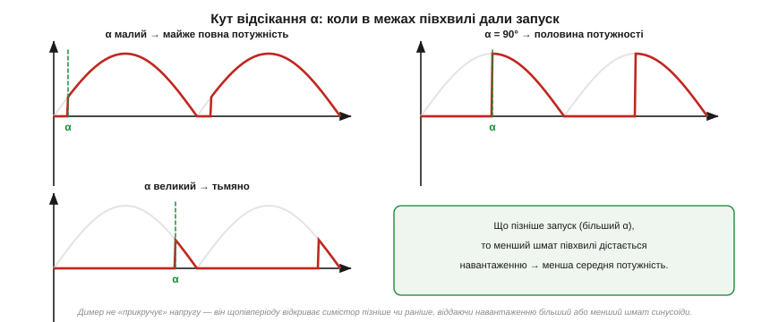
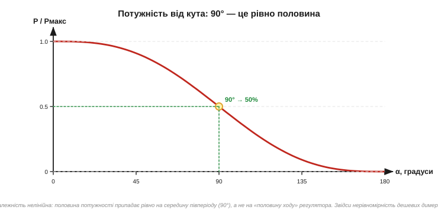

# Фазове керування потужністю: димер

І [тиристор](book:electronics/thyristor-scr), і [симістор](book:electronics/triac) гаснуть у кінці кожної півхвилі самі, а вмикаються тоді, **коли ми дамо імпульс**. Отже, регулюючи **момент** запуску в межах півхвилі, ми регулюємо, **скільки** синусоїди дістанеться навантаженню. Цей спосіб керування потужністю називають **фазовим** *(phase control)*, а пристрій на його основі — **димером** *(dimmer)*, бо найчастіше ним приглушують світло. Розгляньмо, як він працює і де його межі.

### Кут відсікання

Уявімо одну півхвилю синусоїди. Якщо ввімкнути ключ на самому її початку, навантаження отримає всю півхвилю — повну потужність. Якщо ж зачекати й увімкнути ключ, скажімо, на середині півхвилі, навантаження отримає лише її **другу половину** — менше енергії. Те, наскільки ми затримуємося з вмиканням, природно міряти не часом, а **кутом**: повна півхвиля — це 180°, тож затримку запуску виражають **кутом відсікання** *(firing angle, α)* від 0° (вмикаємо одразу) до 180° (не вмикаємо зовсім).


*Рис. Та сама синусоїда при трьох кутах запуску. Малий α — ключ відмикається рано, навантаженню дістається майже вся півхвиля (повна потужність). α = 90° — запуск посередині, навантаженню йде половина. Великий α — ключ відмикається пізно, проходить лише хвостик півхвилі (тьмяно). Закрашена частина — те, що реально дісталося навантаженню.*

Симістор у димері відмикається із затримкою α **на кожній** півхвилі — і на додатній, і на від'ємній (бо він двобічний). Доки запуску нема — симістор закритий, напруга на навантаженні нуль; після запуску він проводить до кінця півхвилі, де гасне сам. Виходить, що навантаження бачить не плавну синусоїду, а її **обрізані шматки** — і чим пізніше запуск, тим менші ці шматки.

Описаний спосіб — коли симістор вмикається **посеред** півхвилі й проводить до її кінця — називають **відсіканням переднього фронту** *(leading-edge dimming)*: відрізається початок кожної півхвилі. Саме так працює класичний симісторний димер, і саме тому він любить навантаження, яке витримує різкий стрибок напруги на старті провідності (лампа розжарення). Існує й зворотний підхід — **відсікання заднього фронту** *(trailing-edge dimming)*: ключ вмикається в нулі (м'яко), проводить початок півхвилі, а потім **обриває** струм десь усередині. Такий димер не можна збудувати на простому симісторі, бо [симістор сам не вимикається посеред півхвилі](book:electronics/thyristor-scr) — потрібен прилад із примусовим вимиканням (транзистор, MOSFET). Зате trailing-edge м'якший до електроніки й тихіший — тому в сучасних димерах для світлодіодних ламп частіше саме він.

> 🔧 **Навіщо це.** Фазове керування — найдешевший спосіб регулювати потужність із мережі **без втрат на тепло**. Можна було б приглушити лампу й послідовним резистором — але той розсіював би відрізану потужність у себе, гріючись. Симістор натомість просто **не пропускає** частину синусоїди: відрізана енергія не виділяється ніде, бо в закритому стані струму нема, а у відкритому спад на симісторі мізерний. Тому димер на симісторі холодний і ефективний — у цьому вся його принада.

У фазового керування є й приємний побічний ефект — **плавний пуск** *(soft start)*. Лампа розжарення в холодному стані має малий [опір](book:physics/resistance) і в першу мить тягне струм у кілька разів більший за робочий — це **пусковий струм** *(inrush)*, від якого нитки часто й перегоряють саме при ввімкненні. Якщо ж димером плавно піднімати потужність від нуля (поступово зменшуючи кут α за кілька секунд), нитка прогрівається м'яко, без кидка струму, — і служить помітно довше. Той самий прийом рятує й двигуни від ривка при пуску. Тобто фазове керування — це не лише «приглушити», а й «увімкнути обережно»; багато промислових регуляторів використовують його саме як плавний пускач, а не як димер.

### Скільки потужності дає кут α

Інтуїція підказує: α = 90° (запуск посередині) має давати половину потужності. І це майже правда — але треба бути обережним, бо залежність **нелінійна**. Потужність визначається не висотою синусоїди в точці запуску, а **площею під квадратом** напруги по всій провідній частині півхвилі (бо потужність на резисторі ∝ U²). [Інтегруючи](book:math/integral) синусоїду в квадраті від кута α до 180°, отримують частку повної потужності:

```
P(α) / Pмакс = (1/π) · [ (π − α) + sin(2α)/2 ]      (α у радіанах)

α = 0°    →  P/Pмакс = 1.00   (повна потужність)
α = 90°   →  P/Pмакс = 0.50   (рівно половина)
α = 180°  →  P/Pмакс = 0.00   (вимкнено)
```

Цікаве саме те, що **рівно половина** потужності припадає на 90° — середину півперіоду. Але навколо цього значення крива йде полого, а ближче до країв (малі й великі α) — круто. Тобто однакова зміна кута дає різну зміну потужності залежно від того, де ми на кривій.

Звідки в цій формулі взявся **квадрат** напруги і чому потужність — це площа під U²? [Миттєва потужність на резисторі](book:physics/electric-power) дорівнює p = u²/R. Якщо ми відрізали початок півхвилі, то на відрізаній ділянці u = 0, отже й потужність там нуль; а на провідній ділянці потужність змінюється як квадрат миттєвої напруги. Середня потужність за період — це **середнє від u²**, тобто площа під кривою u² на провідній ділянці, поділена на період. Саме тому залежність нелінійна: біля краю півхвилі (де синусоїда мала) ми відрізаємо ділянки з **малим** u², майже не зменшуючи потужність; а посередині, де синусоїда на піку, кожен градус відрізає ділянку з **великим** u² — і потужність падає круто. Це той самий зв'язок «потужність ∝ квадрат величини», що стоїть і за означенням [діючого значення RMS](book:physics/rms-value), і за точкою [−3 дБ як «половиною потужності»](book:electronics/bandwidth-3db).


*Рис. P/Pмакс як функція α. Крива S-подібна: біля 0° і 180° положиста, в середині крута. Половина потужності — рівно на 90°. Через цю нелінійність дешеві димери з лінійним потенціометром регулюють яскравість нерівномірно: ручка «майже не діє» на краях і «різко діє» в середині.*

**Приклад (потужність лампи при α = 90°).** Лампа розжарення 100 Вт увімкнена через димер на симісторі. Який ефект дасть установлення кута відсікання 90° на обох півхвилях?

```
P(90°) / Pмакс = (1/π) · [ (π − π/2) + sin(π)/2 ]
              = (1/π) · [ π/2 + 0 ]
              = 1/2 = 0.50

Потужність лампи: P = 0.50 × 100 Вт = 50 Вт
```

Лампа світитиме приблизно вдвічі тьмяніше за повну яскравість. Зауважмо: половина потужності — це **не** половина положення ручки регулятора, бо залежність нелінійна; на практиці «півяскравості» опиняється ближче до середини ходу ручки, але точно туди потрапити можна лише обчисленням або підбором.

### Чому лампа димерується, а імпульсний блок — ні

Тепер найважливіше практичне застереження. Фазове керування **чудово** працює з **резистивним** навантаженням — насамперед із **лампою розжарення** й **нагрівачем**. Чому? Бо такому навантаженню байдуже до форми напруги: воно перетворює на тепло будь-який поданий шматок синусоїди, а теплова інерція нитки розжарення згладжує миготіння, тож око бачить рівне (хай і тьмяніше) світло.

А от сучасну електроніку — **імпульсний блок живлення** *(SMPS)*, що стоїть у світлодіодних лампах, зарядних, комп'ютерах, — фазовим димером керувати **не можна**. Причина у тому, як влаштований вхід такого блока: там стоїть [**діодний міст і конденсатор**](book:electronics/rectification), який заряджається короткими **голками струму** біля піка синусоїди й тримає напругу між піками. Такому входу потрібна саме **верхівка** синусоїди — а димер часто саме її й відрізає або спотворює.


*Рис. Лампа розжарення (зліва) бере будь-який шматок синусоїди й рівно гріється — димерується чудово. Імпульсний блок (справа) качає струм голками біля піка й має власний конденсатор; відсічена синусоїда збиває його з пантелику — він мерехтить, гуде або вимикається. Для такої електроніки роблять окремі «димеровані» драйвери.*

Що буде, якщо все ж під'єднати звичайний димер до світлодіодної лампи? У кращому разі вона блиматиме, гудітиме чи світитиме ривками; у гіршому — димер узагалі не зможе її «запустити», бо струм навантаження надто малий і нестабільний, щоб утримати симістор вище [утримуючого струму](book:electronics/thyristor-scr). Саме тому продають окремі **димеровані** *(dimmable)* LED-лампи зі спеціальними драйверами, що вміють працювати з обрізаною синусоїдою, — і звичайні, які з димером несумісні.

Є й системний наслідок фазового керування, про який варто знати. Обрізана синусоїда — це вже **не чистий синус**: у її спектрі з'являються вищі **гармоніки** (складові на кратних частотах), а струм із мережі тече не плавно, а ривками, зсунутими відносно напруги. Інженери описують це через **коефіцієнт потужності** *(power factor)*: у фазового димера він гірший за одиницю навіть на чисто резистивному навантаженні — не через [зсув фаз, як у котушки](book:electronics/phase-shift), а через **спотворення форми** струму. Для однієї настільної лампи це дрібниця, але тисячі димерів і дешевих блоків живлення разом «бруднять» мережу гармоніками — тому для потужних пристроїв існують норми на гармоніки й окремі схеми **корекції коефіцієнта потужності**. Нам зараз досить розуміти причину: різати синусоїду — означає псувати її форму, а зіпсована форма має ціну на рівні всієї мережі.

> 🔧 **Навіщо це.** Це правило рятує від типової помилки: «куплю димер і приглушу будь-що». Ні — фазовий димер любить **резистивне** навантаження (лампа розжарення, нагрівач, іноді колекторний двигун). Для всього, що має власний імпульсний перетворювач, потрібен або сумісний драйвер, або зовсім інший спосіб керування. Перевіряйте позначку «dimmable» — інакше отримаєте мерехтіння, гудіння й перегрів.

### Скільки коштує тепло на самому симісторі

Твердження, що димер «холодний», варто перевірити числом — і заразом побачити межу. Симістор у відкритому стані має [спад ~1…1.5 В](book:electronics/thyristor-scr), і весь струм навантаження тече крізь нього. Отже, навіть «холодний» симістор виділяє трохи тепла — спад × струм, — і на великих струмах це «трохи» стає відчутним. Це принципово менше, ніж розсіював би послідовний резистор (який узяв би на себе **всю** відрізану потужність — десятки чи сотні ват), але не нуль.

**Приклад (тепло на симісторі димера).** Димер на повній потужності живить навантаження 5 А, спад на відкритому симісторі 1.2 В. Скільки тепла він виділяє і чи треба радіатор?

```
Розсіювана потужність: P = Uспад × I = 1.2 В × 5 А = 6 Вт

Порівняння: якби ту саму потужність «прикручували» резистором
на половину напруги, він би грів ~575 Вт — абсурд.
Симістор гріє лише 6 Вт.

Але 6 Вт — це вже відчутно: потрібен невеликий радіатор.
На струмах 1…2 А (≈1.5…2.5 Вт) часто обходяться без нього.
```

Звідси видно і принаду, і межу фазового керування: воно не марнує **відрізану** потужність (вона просто не тече), але «робочий» струм усе одно платить дещицю спадом на ключі. Тому потужні димери все ж мають радіатор — хоч і несумірно менший, ніж довелося б для резистивного регулювання.

### Прихована ціна різкого фронту

Фазове керування дає плавне й нежарке регулювання потужності, але має приховану ціну: різкий фронт у момент запуску посеред синусоїди породжує електромагнітні завади, а ще псує життя електроніці. Звідси природне питання: а що, як вмикати ключ не посеред синусоїди, де напруга велика, а **в момент її переходу через нуль**, де вмикати нема чого? Тоді ключ замикається без стрибка — і завад майже нема. Цей розумніший спосіб — [комутація в нулі](book:electronics/zero-cross-switching) — годиться там, де не треба плавно регулювати яскравість, а треба просто вмикати й вимикати потужне навантаження без сплесків.
