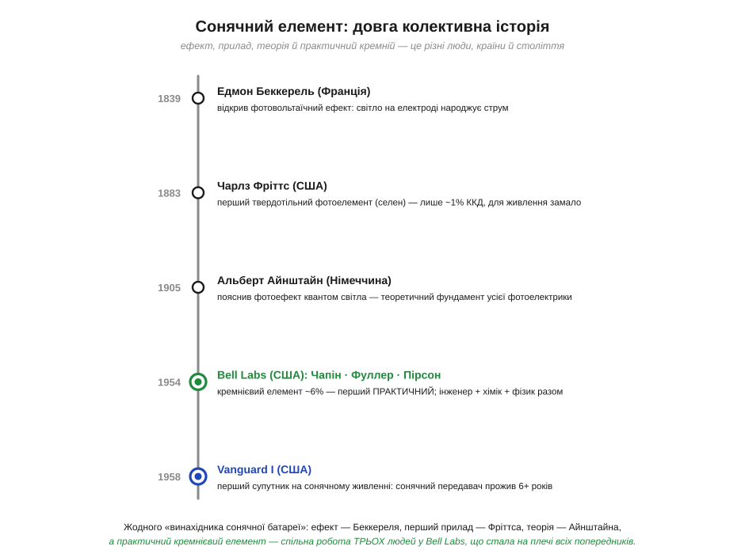
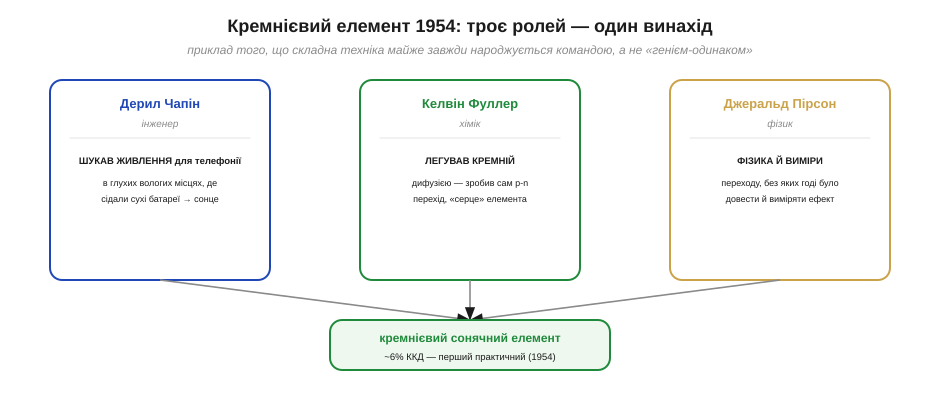
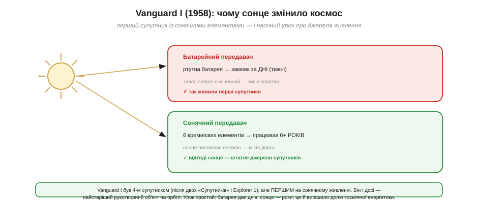

# 📜 Bell Labs 1954 і перший супутник на сонці

> Історія сонячного елемента: **звідки** він узявся — і чому «сонячну батарею» не винайшла одна людина одного дня, а зібрала команда, ставши на плечі цілого століття попередників.

Думка, що зі **світла** можна напряму дістати струм — без турбіни, без пари, без жодної рухомої частини, — звучить майже як фокус. Сонце світить безкоштовно й усюди; якби його проміння можна було просто «зібрати» в електрику, відпала б потреба і в розетці, і в заміні батарей. Та шлях від цієї мрії до першого елемента, що справді **живив** щось корисне, розтягнувся більш ніж на століття й пройшов через кілька країн і кілька несхожих умів. І коли практичний сонячний елемент нарешті з'явився — у 1954 році в американській лабораторії, — він був не осяянням генія-одинака, а злагодженою працею **трьох** різних фахівців. Ця історія добре показує, як насправді народжується складна техніка.

Щоб не загубитися в іменах і датах, гляньмо на весь шлях одним поглядом.

*Естафета завдовжки в століття: Беккерель відкрив фотовольтаїчний ефект (1839), Фріттс зробив перший твердотільний елемент (1883), Айнштайн пояснив фотоефект (1905), команда Bell Labs дала перший практичний кремнієвий елемент ~6% (1954), а Vanguard I вивів сонце в космос (1958). Кожен етап — інші люди й інша країна.*

За звичним «винайшли сонячну батарею» ховається саме така довга естафета: ефект, перший прилад, теорія й, нарешті, практичний матеріал — і кожна ланка належить іншим людям. Пройдімо її по порядку.

### Світло, що народжує струм: Беккерель і Фріттс

Першим помітив, що світло й електрика пов'язані напряму, юний француз **Едмон Беккерель** (*Edmond Becquerel*) ще 1839 року — у дев'ятнадцять років, експериментуючи з електродами в розчині, він побачив, що під променем виникає невелика напруга. Це й був **фотовольтаїчний ефект** (*photovoltaic effect*) — народження струму зі світла. Цікаво, що ця родина дала науці кількох Беккерелів: батько Едмона теж був фізиком, а його син Анрі згодом відкриє радіоактивність. Та сам ефект 1839 року лишився красивою лабораторною дивиною: ні теорії, чому так стається, ні приладу, який давав би помітну потужність, ще не існувало.

Минуло сорок з гаком років, і американець **Чарлз Фріттс** (*Charles Fritts*) 1883 року зробив наступний крок — **перший твердотільний фотоелемент**. Він покрив селен тонким, майже прозорим шаром золота, і ця пластина під світлом давала струм. То був уже не дослід у склянці, а справжній **прилад**. Біда лише, що його коефіцієнт корисної дії був жалюгідний — близько **одного відсотка**: майже вся енергія світла йшла намарно. Для будь-якого практичного живлення цього було безнадійно мало, тож селенові елементи знайшли застосування хіба що в експонометрах фотоапаратів — міряти яскравість, а не живити.

Чому ж селен був таким немічним? Річ у самому матеріалі: він кепсько перетворював світло на **розділені** заряди, і левова частка енергії фотонів губилася в теплі, не доходячи до контактів. Це не була вада конструкції, яку можна підкрутити обв'язкою, — упиралися в **фізику самого матеріалу**. Тому пів століття після Фріттса сонячні елементи лишалися радше науковою цікавинкою й приладом для вимірювання світла, ніж джерелом енергії. Щоб зрушити з місця, потрібен був інший, набагато кращий напівпровідник — і ним виявився кремній, але його ще треба було навчитися готувати.

Бракувало ще й **розуміння**. Чому світло взагалі вибиває в речовині струм? Відповідь дав **Альберт Айнштайн** (*Albert Einstein*) 1905 року, пояснивши **фотоефект**: світло поводиться як потік порцій-квантів, і кожен квант, влучивши в електрон, може його звільнити. Саме за це пояснення (а не за теорію відносності) Айнштайн дістав 1921 року Нобелівську премію. Його робота стала теоретичним фундаментом усієї майбутньої фотоелектрики.

Варто розрізняти дві близькі речі, що часто плутають. **Зовнішній фотоефект**, який пояснив Айнштайн, — це коли квант світла вибиває електрон геть із металу, у вакуум. **Фотовольтаїчний** ефект Беккереля тонший: тут світло не викидає електрон назовні, а лише **розділяє** заряди всередині матеріалу, піднімаючи електрон через внутрішній бар'єр і створюючи напругу на місці. Саме цей внутрішній механізм і працює в сонячному елементі. Та квантова картина світла, яку дав Айнштайн, лежить в основі обох: без поняття про порції-кванти годі було зрозуміти, чому енергія (колір) світла так важить. Тож між «зрозуміли, як» і «зробили корисний прилад» лежала ще піввікова прірва — і подолали її в зовсім іншому місці й з зовсім іншої причини.

### Задача, що привела до сонця

Парадокс, але до сонячного елемента дослідників привела не мрія про чисту енергію, а **проста інженерна морока з телефонами**. У 1950-х американська компанія Bell, що володіла телефонними мережами, мала клопіт: у віддалених вологих і спекотних місцях сухі гальванічні батареї, які живили апаратуру, **швидко псувалися** й вимагали постійної заміни. Інженер **Дерил Чапін** (*Daryl Chapin*) дістав завдання знайти джерело надійніше за ці батареї. Він перебрав кілька варіантів і зупинився на **сонці** як на одному з найперспективніших — адже в спекотних краях його якраз досхочу.

Спершу Чапін узявся за відомі **селенові** елементи — і вперся в ту саму стіну, що й усі до нього: близько одного відсотка ККД, безнадійно мало, щоб серйозно щось живити. Здавалося, глухий кут. Але поряд, у тій самій лабораторії, двоє інших дослідників якраз поралися з матеріалом, що невдовзі все змінить, — із **кремнієм**.

Місце дії тут невипадкове. Bell Labs тих років були, мабуть, найпотужнішою промисловою лабораторією світу: лише за кілька років до того, 1947-го, тут народився **транзистор**, і саме тут зосередилася найкраща у світі експертиза з **кремнію** — як його очищати, легувати, робити з нього p-n переходи. Тобто Чапінова сонячна задача впала не на голий ґрунт, а в середовище, де поряд уже володіли матеріалом майбутнього. Без цього збігу — потреби в одному кінці лабораторії й кремнієвої майстерності в іншому — практичного елемента, найпевніше, довелося б чекати ще довго. Винаходи часто народжуються саме на таких перетинах, де чужа задача зустрічає готове вміння.

### Троє в одній лабораторії (1954)

Тут і починається головний урок цієї історії. Практичний сонячний елемент зробили **не одна людина, а троє**, і кожен приніс те, чого не мали інші.

*Дерил Чапін — інженер, що приніс задачу живлення й доводив елемент до діла; Келвін Фуллер — хімік, що навчився легувати кремній дифузією й зробив сам p-n перехід, «серце» елемента; Джеральд Пірсон — фізик, без чиїх вимірів і розуміння переходу годі було довести ефект. Разом — перший практичний кремнієвий елемент.*

**Келвін Фуллер** (*Calvin Fuller*) був **хіміком**, і саме він володів ключем — технологією **легування** кремнію домішками через дифузію. Вводячи в кремній потрібні домішки, він навчився створювати в ньому **p-n перехід** — ту саму межу між двома по-різному «підправленими» областями кремнію, що стане серцем елемента (це той самий [p-n перехід](book:physics/pn-junction), що працює в діоді). **Джеральд Пірсон** (*Gerald Pearson*) був **фізиком**; працюючи з Фуллеровим кремнієм, він і помітив, що такий зразок під світлом дає на диво помітний струм — куди більший за селеновий. А **Чапін** із його телефонною задачею підхопив це відкриття й узявся **довести** його до практичного приладу: міряв, добирав, оптимізував.

Результат, показаний у квітні **1954 року**, був проривом. Кремнієвий елемент давав близько **6%** ККД — у шість разів більше за все попереднє, і вперше **достатньо**, щоб усерйоз про живлення говорити. На презентації Bell гордо продемонструвала «сонячну батарею» (*Bell Solar Battery*), що живила маленький радіопередавач і навіть іграшкове колесо огляду. Преса була в захваті: уперше світло справді перетворювали на корисну електрику.

У цій історії є й частка щасливого випадку, як майже в кожному відкритті. Пірсон натрапив на сильний фотоефект кремнію, не шукаючи його навмисне, — він поралося зі своїми напівпровідниковими дослідами, коли помітив незвично великий струм під світлом. Та випадок, як кажуть, сприяє підготованому розуму: щоб **помітити** аномалію, треба було бути фізиком Пірсоном; щоб **дати** для неї потрібний кремній — хіміком Фуллером; щоб **перетворити** її на робочий прилад і довести світові — інженером Чапіном. А далі були місяці марудної роботи Чапіна над тим, щоб із лабораторного зразка вийшов надійний елемент, придатний для діла. Газети тоді писали захоплено — мовляв, людство, можливо, нарешті навчиться «приборкати сонце»; до масового сонця, щоправда, було ще далеко.

Будьмо тут точні в авторстві, як того й вимагає чесна історія. Кремнієвий сонячний елемент — це **спільний винахід Чапіна, Фуллера й Пірсона**, де хімік дав матеріал і перехід, фізик — розуміння й виміри, а інженер — задачу й доведення до діла. Виокремити «головного» було б неправдою: прибери будь-кого з трьох — і елемента не було б. А над ними трьома стоять іще Беккерель (ефект), Фріттс (перший прилад) і Айнштайн (теорія). Це класичний приклад того, що велику техніку майже завжди робить **команда на плечах попередників**, а не самотній геній, якому в потрібну мить «сяйнуло».

На підтвердження цього спільного авторства варто згадати, що й **патент** на пристрій перетворення сонячної енергії подали всі троє разом — Чапін, Фуллер і Пірсон, — а не хтось один. Визнання, щоправда, прийшло до них не одразу: лише через десятиліття, 2008 року, усіх трьох **разом** увели до Національної зали слави винахідників США. Така колективна шана — і рідкість, і водночас справедливість: вона називає не «винахідника сонячної батареї», а команду, що її зробила, — саме так, як і годиться говорити про більшість великих винаходів. Запам'ятати цей принцип корисно й поза історією: коли наступного разу почуєте, що «такий-то винайшов» щось складне, варто спитати — а хто стояв поряд і хто був до нього.

### Vanguard I: сонце виходить у космос (1958)

Новий елемент був чудовий, але дорогий, і на Землі йому довго не знаходилось масового діла — він був надто коштовний проти звичайної електрики. Знайшлося місце, де ціна не мала значення, зате не було ні розеток, ні можливості поміняти батарею, — **космос**.

*На Vanguard I стояли два передавачі: один на ртутній батареї — він замовк за кілька тижнів, коли запас енергії скінчився; другий, на шести кремнієвих сонячних елементах, працював понад шість років. Наочний урок: батарея дає днів, сонце — роки. Відтоді сонячні елементи стали штатним джерелом супутників.*

Коли 17 березня **1958 року** США запустили супутник **Vanguard I**, він був уже **четвертим** рукотворним супутником в історії — після двох радянських «Супутників» (*Sputnik 1* і *2*, 1957) і американського Explorer 1. Та однією рисою Vanguard вирізнявся з-поміж усіх: він став **першим супутником на сонячному живленні**. На його корпусі сиділо **шість** маленьких кремнієвих елементів — прямих нащадків того, що Bell показала за чотири роки до того.

І саме Vanguard дав космічній енергетиці її головний урок, наочно й переконливо. На борту було **два** передавачі. Перший живився від звичайної ртутної батареї — і замовк за кілька **тижнів**, щойно її запас енергії вичерпався. Другий, на сонячних елементах, передавав сигнал понад **шість років**, бо сонце щодня поповнювало йому енергію. Контраст був разючий: батарея дала днів, сонце — роки. Після цього питання, чим живити супутники в довгих місіях, було, по суті, закрите — сонячні панелі стали для космічної техніки **штатним** рішенням, яким лишаються й донині.

Варто додати, що успіх Vanguard був не самоочевидним наперед. Дехто сумнівався, чи витримають крихкі кремнієві елементи сувору космічну радіацію й різкі перепади температур, — і саме Vanguard розвіяв ці сумніви на ділі, відпрацювавши роками. А ще цей маленький супутник (його будувала Військово-морська дослідна лабораторія США) несподівано прислужився науці про Землю: за крихітними відхиленнями його орбіти геофізики уточнили, що наша планета не ідеальна куля, а ледь сплюснута й трохи «грушоподібна». Сам же Vanguard I досі обертається навколо Землі — зв'язок із ним утратили 1964 року, та він і донині лишається **найстарішим рукотворним об'єктом на орбіті**, мовчазним пам'ятником тому кремнієвому елементу 1954-го.

> 🔧 **Звідки слова.** Bell назвала свій прилад «сонячною **батареєю**», хоча справжньою [батареєю](root:embedded/battery-chemistries) він не був — енергію він не зберігав, а виробляв із світла. Згодом усталився точніший термін — **сонячний елемент** (*solar cell*) чи **фотоелемент**, від грецького «фотос» (світло). А прикметник **фотовольтаїчний** (*photovoltaic*, скорочено PV) — це буквально «світло-напруга», пам'ять про Беккерелів ефект 1839 року.

### Що з цього лишилось — і навіщо нам це знати

Шлях сонячного елемента з космосу назад на Землю був довгий: десятиліттями кремнієві панелі лишалися надто дорогими для буденного живлення й тримались у нішах, де ціна не вирішувала, — спершу супутники, потім калькулятори, морські буї, віддалені давачі. І лише поступове, протягом півстоліття, **здешевлення** кремнію зробило сонячну енергію масовою. Але серце панелі лишилося тим самим, що показали в Bell Labs 1954 року, — **кремнієвий p-n перехід, обернений назустріч світлу**.

Поштовх до здешевлення дали й несподівані сили — зокрема **нафтові кризи** 1970-х, що змусили світ серйозно вкластися в альтернативні джерела й накачали гроші в дослідження фотоелектрики. А паралельно сонячні елементи знайшли свою першу масову споживчу нішу, дуже близьку нам: **калькулятори** 1970–80-х, яким вистачало крихітної смужки на світлі, щоб не міняти батарейку роками. Це був перший приклад **міліватного** сонячного живлення малих пристроїв, де збирають не кіловати для будинку, а крихти енергії для давача. Той самий кремнієвий елемент, що колись коштував як коштовність і літав лише в космосі, сьогодні дешевий настільки, що його клеять на садову лампу за копійки.

Саме тому ця історія — не просто шанування піонерів. Той самий [p-n перехід](book:physics/pn-junction), що працює як діод, у сонячному елементі працює «у зворотний бік» — від фотона до струму; а з нього вже виростають усі практичні питання фотоелектрики: чому в панелі є [точка максимальної потужності](book:electronics/panel-iv-mpp) і як за нею стежити (MPPT), як [реальне сонце](book:electronics/real-sun-mppt) — кут, спека, тінь — псує ідеальну картину, і як порахувати автономну систему, що переживе найгірший місяць. А головний урок самих піонерів простий і дуже інженерний: **велике рішення майже завжди складають з готових частин** — чужого ефекту, чужої теорії, чужого матеріалу — і доводять до діла спільно, а не вигадують із нуля наодинці.
