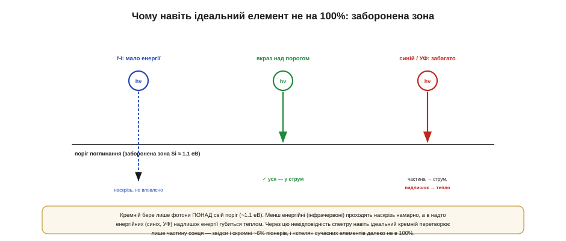
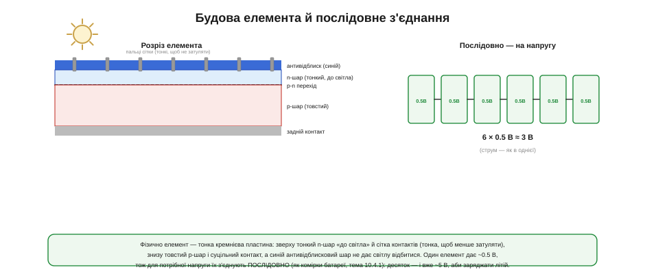

# Фотоелемент: PN-перехід назустріч світлу

Найкраще в фотоелементі те, що більшість його фізики знайома — просто з іншого боку. Сонячний елемент — це **той самий [p-n перехід](topic:physics/pn-junction)**, що в [діоді](topic:electronics/diode-iv-curve), тільки повернутий не для випрямлення струму, а **назустріч світлу**. Жодної нової магії: усе, що робить елемент, випливає з вбудованого поля переходу. Ланцюжок «фотон → струм» розгортається крок за кроком, і з нього стає видно, чому навіть ідеальний кремній не перетворює на електрику все сонце і чому один елемент дає завжди приблизно пів вольта незалежно від розміру.

Мета — не вивести рівняння, а збудувати **інтуїцію**: що саме коїться в кремнії під променем і чому з цього виходить джерело струму. На цій інтуїції тримається все практичне — і [крива панелі](topic:electronics/panel-iv-mpp), і стеження за максимумом потужності, і розрахунок системи.

### Той самий перехід

В основі лежить уже знайомий пристрій. У [звичайному діоді](topic:electronics/diode-iv-curve) зустрічаються дві області кремнію: **p** з надлишком «дірок» (позитивних носіїв) і **n** з надлишком електронів. На їхній межі виникає **збіднена зона**, а в ній — **вбудоване електричне поле**, що дивиться з n у p.


*На межі p- та n-областей утворюється збіднена зона з вбудованим [електричним полем](book:physics/pn-junction). У ролі діода цей перехід пропускає струм лише в один бік. Обернений назустріч світлу, він тим самим полем перетворюється на генератор.*

Це поле — головний герой усієї теми. У ролі діода воно відповідає за «однобічність»: пропускає струм в один бік і не пускає в інший. Тут воно працює інакше — як **сортувальник зарядів**. Усе, що потрібно, — це якось народити в кремнії вільні заряди поблизу переходу, а далі поле зробить решту. І народжує їх саме **світло**.

Варто наголосити на цьому «оберненні» ролей, бо воно й заплутує новачка. Той самий перехід у ролі **діода** служить, щоб **керувати** чужим струмом; як **фотоелемент** — щоб **виробляти** свій. Фізика одна, застосування протилежні. Більше того, цей самий освітлений перехід, зроблений маленьким і чутливим, працює [**фотодіодом**](topic:electronics/led-photodiode) — давачем світла (з нього роблять вимірювачі освітленості й приймачі в оптоволокні). Фотодіод і сонячний елемент — рідні брати: перший масштабовано **під вимір** світла, другий — **під його збір** у потужність. Тож, розбираючись із фотоелементом, заразом розумієш і фотодіод.

### Від фотона до пари

Світло, як показав Айнштайн, приходить **порціями-квантами** — фотонами. Коли фотон із достатньою енергією влучає в кремній, він віддає цю енергію електронові й **вибиває** його зі зв'язку в кристалі. На місці електрона лишається порожнеча — **дірка**. Так народжується **електронно-діркова пара**: один вільний негативний заряд і одне вільне позитивне місце.


*Квант світла, влучивши в кремній, вибиває електрон зі зв'язку — народжується пара: вільний електрон (−) і дірка (+). Та сама собою ця пара ще марна: електрон і дірка поряд і за мить можуть знову з'єднатися (рекомбінувати), віддавши енергію назад у тепло. Щоб дістати струм, пару треба РОЗВЕСТИ.*

І тут криється тонкість, без якої елемент не працював би. Сама по собі народжена пара **нічого не дає**: вільні електрон і дірка стоять поряд, притягуються одне до одного й за мить можуть **рекомбінувати** — знову з'єднатися, віддавши свою енергію назад у вигляді тепла. Якби так ставалося з кожною парою, уся енергія світла просто грала б кристал. Щоб дістати з пари **струм**, її половинки треба встигнути **розтягнути** в різні боки, перш ніж вони возз'єднаються. Саме цю роботу й виконує вбудоване поле.

А скільки то — «достатня енергія»? Поріг кремнію (~1.1 еВ) лежить в інфрачервоному, тож **усе видиме світло** — від червоного (~1.8 еВ) до фіолетового (~3.1 еВ) — енергійніше за поріг і здатне народжувати пари. Саме тому елемент працює не лише під прямим сонцем, а й у кімнаті від лампи — просто слабше, бо фотонів менше. А ось чисте тепло (далеке інфрачервоне) кремнієвий елемент не «бачить»: його фотони надто кволі. Звідси поширена помилка — чекати від панелі струму від «тепла»: вона живиться **світлом**, а не теплом, і в темряві мовчить, хоч би яка тепла була.

### Поле розводить — ось і струм

Уся суть фотоелемента — в одному реченні: пара має народитися **біля переходу**, де її одразу підхопить вбудоване поле й **розведе** половинки в протилежні боки.


*Фотон народжує пару поблизу переходу — і вбудоване поле негайно її розводить: дірку штовхає в p-область, електрон — у n. Розділені заряди накопичуються на двох боках і створюють напругу; під'єднане навантаження дає їм шлях замкнутися — і тече струм. Ось і весь фотоелемент: світло → пари → поле розводить → струм.*

Подивімося, як це працює. Поле в збідненій зоні штовхає позитивні заряди в один бік, негативні — в інший. Тож щойно поблизу переходу з'являється пара, поле **негайно** жене дірку в **p**-область, а електрон — у **n**, не давши їм рекомбінувати. Заряди накопичуються на двох протилежних сторонах елемента, і між його контактами виникає **напруга** — точно як між полюсами батареї. А якщо до контактів під'єднати навантаження, розділені заряди дістають шлях замкнути коло — і **тече струм**. Це і є фотоелемент: світло безперервно народжує пари, поле безперервно їх розводить, і доки світить сонце — доти йде струм. Жодної рухомої частини, жодного палива — лише квантова механіка кремнію.

Чому ж так важливо, щоб пара народилася саме **біля** переходу? Бо поле сильне лише у вузькій збідненій зоні; пара, що виникла далеко від неї, найімовірніше рекомбінує раніше, ніж поле встигне її дотягти. Тому елемент роблять **тонким**, а перехід — близько до освітленої поверхні: так більшість пар народжується там, де їх одразу підхопить поле. Якість кремнію теж важить: що менше в ньому дефектів, на яких заряди гинуть передчасно, то більша частка пар доживає до контактів. Уся боротьба за ККД елемента — це, по суті, боротьба за те, щоб **зібрати** якнайбільше народжених пар, перш ніж вони рекомбінують.

### Чому не 100%: заборонена зона

Якби кремній перетворював на електрику **все** сонячне світло, фотоелементи були б фантастично ефективні. Та реальність скромніша, і причина — у тому, що кремній бере не будь-який фотон, а лише той, чия енергія перевищує певний **поріг**, який звуть забороненою зоною (*bandgap*).


*Кремній поглинає лише фотони з енергією понад свій поріг (~1.1 еВ). Інфрачервоні (надто «слабкі») проходять крізь нього намарно. Енергійні сині й ультрафіолетові поглинаються, та їхній **надлишок** над порогом не йде в струм, а губиться теплом. Через цю невідповідність спектру навіть ідеальний кремній перетворює лише частину сонця.*

Тут дві втрати, і обидві принципові. Фотон **слабший** за поріг (інфрачервоне світло) кремнієві не «по зубах» — він просто проходить наскрізь, не народивши пари, і його енергія втрачена. Фотон **сильніший** за поріг (синій, ультрафіолетовий) пару народжує, але весь його **надлишок** енергії над порогом одразу перетворюється на тепло, а не на струм: у діло йде лише «порогова» порція. Сонячне світло — це суміш усіх цих фотонів, тож хоч би яким досконалим був елемент, частину спектру він проґавить знизу, а частину змарнує зверху. Саме через цю **невідповідність спектру** навіть теоретична межа кремнію далека від 100%, а перші елементи Bell 1954 року давали лише ~6%; сучасні — більше, але теж не диво. Знати про цю межу корисно, щоб не чекати від панелі неможливого.

Якщо скласти обидві спектральні втрати докупи, виходить принципова **стеля** ефективності одного кремнієвого переходу — близько третини сонячної енергії (це відома межа Шоклі–Квайссера). Обійти її можна, лише поставивши **кілька** переходів із різними порогами один за одним, щоб кожен ловив свою частину спектру, — так роблять дорогі багатоперехідні елементи, якими живлять супутники й концентраторні станції. Для нас же, у звичайній embedded-техніці, важливо інше: кремній — це розумний компроміс ціни й ефективності, і його «скромні» десятки відсотків — не недоробка інженерів, а фундаментальна межа фізики, з якою просто живуть.

### Елемент — це джерело струму

Тепер найважливіше для практики: як поводиться елемент **на клемах**. На відміну від діода, що лише пропускає чужий струм, **освітлений елемент сам його виробляє** — він поводиться як **джерело струму**, тим сильніше, чим яскравіше світло.


*Освітлений елемент моделюють як джерело струму (тим більше, чим яскравіше світло й більша площа) паралельно з діодом — самим переходом. Напруга одного кремнієвого елемента — лише ~0.5–0.6 В і майже не залежить від його розміру: її задає хімія переходу. А ось площа задає СТРУМ.*

Звідси два висновки, що визначають усе подальше. По-перше, **напруга** одного кремнієвого елемента — це завжди приблизно **пів вольта** (0.5–0.6 В), і вона майже **не залежить від розміру**: хоч маленький елемент із нігтик, хоч велика панель — кожен елемент дає ту саму півв'язку вольта, бо її диктує сама хімія переходу, а не площа. По-друге, площа задає **струм**: більший елемент ловить більше світла й дає більший струм за тієї самої напруги. Ця проста модель — джерело струму паралельно з діодом — і є зерном, з якого виростає [**крива панелі**](topic:electronics/panel-iv-mpp) (ВАХ), з її точкою максимальної потужності.

Одна тонкість про ту «постійну» напругу: вона трохи **спадає з нагрівом**. Що гарячіший елемент, то нижча його напруга — на пару мілівольтів на градус. Дрібниця для одного елемента, та в панелі з десятків послідовних вона додається, і гаряча на сонці панель віддає помітно меншу напругу, ніж холодна. Це парадокс, що дивує новачків: яскравіше сонце водночас і гріє панель, з'їдаючи частину виграшу. Докладніше це розбирає тема про [реальне сонце й роботу під ним](topic:electronics/real-sun-mppt); тут досить мати на увазі, що ті ~0.5 В — за помірної температури.

А ще корисно подумати, що робить елемент **у темряві**. Без світла джерело струму «вимикається», і лишається сам **діод** — тобто елемент стає звичайним переходом, який може навіть **споживати** струм у зворотний бік, якщо до нього прикладено напругу ззовні. Саме тому панель, під'єднану до батареї, вночі треба **відсікати** — простим блокувальним діодом чи розумним контролером заряду: інакше заряджена батарея потихеньку розряджатиметься назад крізь темну панель. Головне правило просте: на світлі елемент дає, у темряві може й брати.

**Приклад (скільки елементів на потрібну напругу).** Хочемо живити зарядник літієвої комірки, якому треба ~5 В на вході.

```
Один кремнієвий елемент:  ~0.5 В (майже незалежно від площі)

Скільки послідовно на 5 В:
   N = 5 В / 0.5 В = 10 елементів послідовно

Площа елемента задає СТРУМ (більший елемент → більший струм,
   але все та сама ~0.5 В на елемент).

Отже «панель» — це решітка елементів:
   послідовно → набираємо НАПРУГУ,   паралельно → набираємо СТРУМ.
```

Висновок практичний: оскільки пів вольта мало для будь-чого корисного, елементи майже завжди з'єднують **послідовно**, щоб набрати напругу (точно як [комірки батареї](root:embedded/battery-chemistries)), а за потреби й паралельно — для струму. Те, що ми звемо «сонячною панеллю», — це і є така впорядкована решітка елементів. Саме тому навіть найменша корисна панель фізично складається з багатьох елементів: із пів вольта однієї нічого путнього не зібрати, а от десяток послідовно вже живить реальний вузол.

### Будова й послідовне з'єднання

Залишилося глянути, як цей елемент виглядає **фізично**, бо конструкція прямо випливає з фізики.


*Елемент — тонка кремнієва пластина: зверху, до світла, тонкий n-шар і сітка металевих контактів (тонких, щоб менше затуляти світло), знизу — товстий p-шар і суцільний задній контакт, а синій антивідблисковий шар не дає світлу відбитися. Один елемент дає ~0.5 В, тож для напруги їх з'єднують послідовно: десяток — і вже ~5 В.*

Кожна деталь конструкції має сенс. Перехід роблять **близько до поверхні** (тонкий n-шар зверху), бо саме там світло народжує пари, а ми хочемо, щоб вони виникали в полі переходу. Контакти зверху — це **тонка сітка пальців**, а не суцільна пластина: метал не пропускає світло, тож його роблять якомога тоншим, лишаючи максимум поверхні відкритою. Знизу контакт може бути суцільним — туди світло й так не дістає. А характерний **синій колір** панелей — це антивідблисковий шар: без нього частина світла просто відбивалася б, не встигнувши спрацювати. І, нарешті, оскільки один елемент дає лише пів вольта, у панелі їх з'єднують **послідовно** — десяток елементів дає вже ~5 В, достатньо, щоб заряджати літій. Так фізика одного переходу масштабується в робочу панель.

Варто розрізняти й **елемент** та **модуль** (панель). Елемент — це одна кремнієва пластинка на пів вольта; **панель** — це багато елементів, з'єднаних і **запаяних** між склом та захисним шаром, щоб пережити роки під дощем, сонцем і морозом. Саме модуль ми зрештою купуємо й ставимо. Бувають елементи **монокристалічні** (з єдиного кристала — трохи дорожчі й ефективніші) і **полікристалічні** (зі зрощених зерен — дешевші, з характерним «візерунком»); для embedded різниця зазвичай несуттєва, та назви варто впізнавати. Головне — пам'ятати, що «панель» — це впорядкована, захищена від погоди решітка тих самих півв'язкових елементів.

Ще одне, що варто знати наперед: коли панель підписана «на 5 Вт», ця цифра — за **стандартних умов** (яскраве полуденне сонце, близько 1000 Вт/м², помірна температура). У реальному житті — під кутом, крізь хмару, на спеці — вона видасть менше, часом помітно менше. Тому паспортна потужність панелі — це **стеля за ідеалу**, а не те, на що варто розраховувати щодня. Цей розрив між «паспортом» і «полем» — ключ до розрахунку будь-якої автономної системи: реальний денний збір енергії планують від поля, а не від паспорта.

### Підсумок теми

Фотоелемент — це **[p-n перехід](topic:physics/pn-junction), повернутий назустріч світлу**. Механізм у три кроки: фотон із достатньою енергією **народжує** в кремнії електронно-діркову пару; якщо це сталося біля переходу, вбудоване **поле розводить** половинки пари в p- та n-області; розділені заряди дають напругу, а під'єднане навантаження — **струм**. Не все сонце йде в діло: фотони **слабші** за поріг (заборонену зону ~1.1 еВ) проходять намарно, а в **сильніших** надлишок енергії губиться теплом — звідси межа ККД навіть для ідеального кремнію. На клемах освітлений елемент поводиться як **джерело струму** паралельно з діодом; його напруга — завжди ~0.5–0.6 В (майже без огляду на розмір), а **площа задає струм**. Тому елементи з'єднують **послідовно** для напруги (десяток → ~5 В) і паралельно для струму — так із одного переходу постає панель. А з моделі «джерело струму ‖ діод» виростає [**крива панелі**](topic:electronics/panel-iv-mpp) з її точкою максимальної потужності — основа всієї науки про MPPT.
