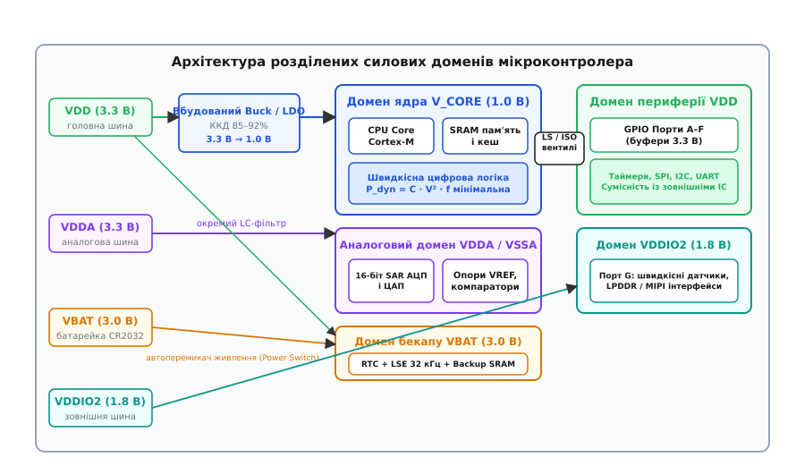
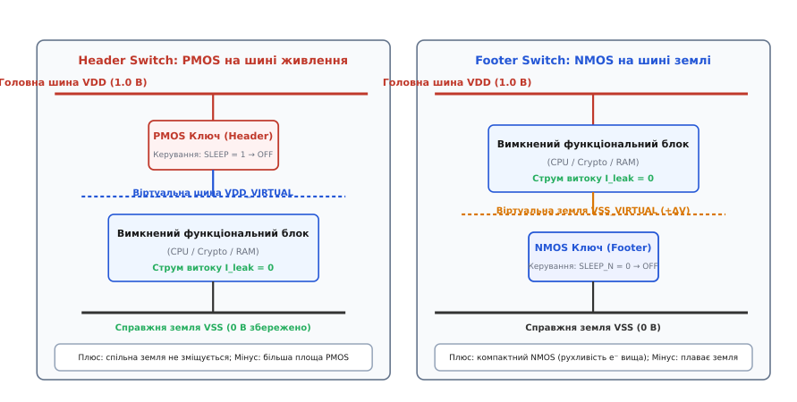
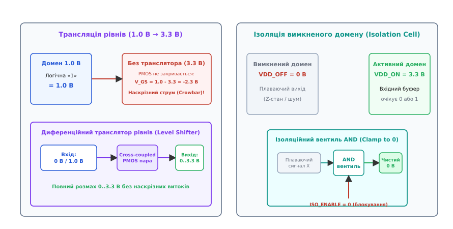
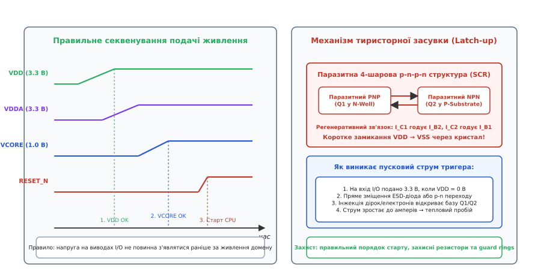

# Силові домени мікроконтролера

<preknowlist>
- [CMOS-інвертор і логічні елементи](topic:electronics/cmos-gate) — будова логічних вентилів на PMOS і NMOS транзисторах, механізм перемикання та наскрізні струми.
- [Польовий транзистор як перемикач](topic:electronics/mosfet-switch) — опір відкритого каналу, робота затвора та статичні витоки.
- [Лінійний стабілізатор LDO](topic:electronics/ldo) — перетворення напруги зі зниженням, коефіцієнт придушення пульсацій PSRR.
- [Рівні логічних сигналів](topic:electronics/logic-levels-as-ranges) — стандарти напруг 1.8 В та 3.3 В, пороги розпізнавання нуля й одиниці.
- [Шини живлення та розв'язка](topic:electronics/power-rails) — паразитні індуктивності провідників та стрибки напруги di/dt.
- [Послідовність подачі живлення](topic:electronics/power-sequencing) — ризики тиристорного замикання (latch-up) під час некоректного старту.
</preknowlist>

Якщо підключити всі вузли сучасного мікроконтролера — багатомільйонне цифрове ядро з частотою 200 МГц, оперативну пам'ять, 16-бітний прецизійний АЦП із чутливістю до часток мілівольта, зовнішні буфери портів введення-виведення на 3.3 В та годинник реального часу — до однієї спільної лінії живлення 3.3 В, кристал миттєво зіткнеться з нерозв'язним фізичним конфліктом. Динамічне споживання процесорного ядра на напрузі 3.3 В виявиться у 10–15 разів вищим за допустимий тепловий бюджет корпусу, струмові імпульси перемикання цифрових транзисторів `di/dt` створять сотні мілівольтів індуктивного шуму на шинах, повністю знищивши точність аналогових вимірювань, а статичні підпорогові витоки закритих транзисторів розрядять резервну літієву батарейку годинника за кілька днів замість запланованих десяти років.

З іншого боку, якщо знизити напругу всієї мікросхеми до 1.0 В заради порятунку ядра від перегріву, вихідні каскади мікроконтролера втратять здатність керувати зовнішніми мікросхемами, реле та стандартними промисловими шинами, чиї логічні рівні вимагають напруги 3.3 В або 5 В. Єдиним фізично обґрунтованим виходом із цієї суперечності є поділ кристала на електрично ізольовані функціональні острови — **силові домени (power domains)**.

## Фізична необхідність розділення силових шин

Розділення живлення в інтегральних схемах зумовлене чотирма фундаментальними обмеженнями напівпровідникових технологій: законом динамічних втрат у ємностях, межею електричної міцності тонких діелектриків затвора, завадозахищеністю аналогових трактів та необхідністю нульового струму витоку в режимах очікування.

### 1. Квадратичний закон динамічних втрат

Динамічна потужність `P[dyn]`, що виділяється у вигляді тепла під час роботи цифрової логіки, визначається енергією перезаряджання розподілених паразитних ємностей затворів і металевих провідників `C[total]`:

```
P[dyn] = α · C[total] · V² · f
```

де `α` — коефіцієнт активності перемикань логіки, `V` — напруга живлення, а `f` — тактова частота.

Оскільки напруга входить у формулу у квадраті, зниження робочої напруги ядра з 3.3 В до 1.0 В зменшує динамічне тепловиділення процесора у `(3.3 / 1.0)² = 10.89` разів. Для кристала з еквівалентною ємністю 1.2 нФ на частоті 200 МГц це означає падіння споживання обчислювального ядра з 392 мВт до 36 мВт. Повний аналітичний вивід формул енергетичного балансу та точки мінімального енергоспоживання наведено у вставці [детальний математичний розрахунок складових потужності](topic:electronics/power-domains/math-dynamic-vs-leakage.md).

### 2. Електрична міцність субмікронних транзисторів

Зі зменшенням топологічних норм літографії (від 180 нм до 40 нм, 28 нм і 16 нм FinFET) фізична товщина підзатворного діелектрика `SiO[2]` зменшилася до 1.2–2.0 нм. Напруженість електричного поля в оксиді сягає критичних значень `E = V / t[ox] ≈ 5–8 МВ/см`. Якщо до транзистора з довжиною каналу 40 нм прикласти напругу 3.3 В, напруженість поля перевищить межу діелектричного пробою (англ. *dielectric breakdown*), що призведе до миттєвого необоротного пропалювання затвора тунельним струмом. Тому високошвидкісні обчислювальні ядра фізично не можуть працювати при напругах вище 1.0–1.2 В.

Натомість периферійні виводи введення-виведення (GPIO) виготовляються на базі спеціальних транзисторів із товстим захисним оксидом (I/O Transistors), які витримують напругу 3.3 В, але мають значно більшу довжину каналу, більшу площу та меншу граничну частоту перемикання.

### 3. Імпульсний комутаційний шум та деградація аналогової точності

Кожен цифровий логічний вентиль під час перемикання споживає струм у вигляді короткого наносекундного імпульсу. Коли мільйони вентилів процесорного ядра перемикаються одночасно за фронтом тактового сигналу, сумарна швидкість зміни струму `di/dt` у провідниках живлення досягає `10⁸–10⁹ А/с`.

Протікаючи крізь паразитну індуктивність виводів корпусу мікросхеми та провідників друкованої плати `L[bond] ≈ 1–5 нГн`, цей струм викликає індуктивні викиди напруги:

```
V[bounce] = L[bond] · (di / dt)
```

Амплітуда таких коливань (англ. *ground bounce* та *power supply droop*) може досягати 50–200 мВ. Якщо до цієї ж лінії підключено чутливий аналогово-цифровий перетворювач (АЦП), де крок молодшого значущого розряду (LSB) для 16-бітної шкали 3.3 В становить лише:

```
V[LSB] = 3.3 В / 65536 ≈ 50.35 мкВ
```

цифровий шум у сотні мілівольтів повністю спотворює аналоговий сигнал, зменшуючи ефективну розрядність перетворювача (ENOB) із 16 бітів до 8–9 бітів. Для збереження точності аналогова підсистема вимагає абсолютно автономної шини живлення з окремими виводами та фільтрацією.

### 4. Статичний витік у режимі очікування

У періоди відсутності завдань мікроконтролер повинен споживати мінімальний струм, зберігаючи хід системного годинника реального часу (RTC) та вміст бекап-регістрів від дискової батарейки CR2032 (ємністю близько 220 мА·год). Якщо все ядро залишається під напругою, сумарний підпороговий витік закритих транзисторів становить 0.5–2.0 мА, що розряджає елемент живлення за 5–10 днів.

Розділення доменів дозволяє повністю знеструмити обчислювальне ядро та периферію за допомогою силових ключів, залишивши заживленим лише ізольований бекап-домен RTC зі струмом споживання менше 100–300 нА. За таких умов батарейка працює понад 10–15 років, обмежуючись переважно власним саморозрядом.

## Архітектура силових доменів сучасних мікроконтролерів

У сучасних мікроконтролерах загального та спеціального призначення (STM32, ESP32, Nordic nRF5340, NXP i.MX RT) внутрішній простір кристала розділений на 4–6 основних силових доменів.


*Архітектура розділених силових доменів сучасного мікроконтролера з незалежними регуляторами, трансляторами рівнів та ізоляцією.*

Розглянемо призначення, діапазони напруг і схемотехнічні особливості кожного домену.

### 1. Домен цифрового ядра (V_CORE / V_DDCORE / V_CAP)

* **Номінальна напруга:** 0.8–1.2 В (підтримує динамічне регулювання напруги — DVS).
* **Призначення:** Живлення центрального процесорного ядра (Cortex-M, RISC-V, Xtensa), кеш-пам'яті першого рівня, блоків швидкої оперативної пам'яті (Tightly-Coupled Memory — TCM/SRAM), системної шинної матриці (AXI/AHB) та блоків апаратного шифрування (AES, SHA).
* **Джерело живлення:** Внутрішній імпульсний понижувальний Buck-перетворювач (DC-DC) із ККД 85–92% або вбудований лінійний стабілізатор LDO. Для компенсації внутрішніх пульсацій до виводу `V_CAP` підключають зовнішній керамічний конденсатор ємністю 1.0–4.7 мкФ із низьким еквівалентним послідовним опором (ESR).
* **Масштабування напруги та частоти (DVFS):** У багатьох архітектурах домен `V_CORE` має кілька програмних рівнів напруги (Voltage Output Scaling — VOS). Наприклад, у мікроконтролерах STM32U5 напруга 1.2 В (Range 1) використовується для роботи на максимальній частоті 160 МГц, 1.0 В (Range 2) — для частот до 110 МГц, а 0.9 В (Range 3) — для ультранизького споживання на частотах до 24 МГц.

### 2. Домен периферії та загального введення-виведення (V_DD / V_DDIO)

* **Номінальна напруга:** 1.8 В, 2.5 В або 3.3 В.
* **Призначення:** Живлення вихідних буферів портів GPIO, послідовних інтерфейсів (USART, SPI, I2C), таймерів загального призначення, контролерів прямого доступу до пам'яті (DMA) та Flash-пам'яті програм.
* **Фізичні вимоги:** Цей домен живиться безпосередньо від зовнішнього джерела живлення плати. Його напруга визначає розмах вихідних логічних сигналів і рівні перемикання `V[IH]` / `V[IL]`.
* **Незалежні секції введення-виведення (V_DDIO2 / V_DDIO3):** У передових мікроконтролерах виводи поділяються на окремі підгрупи. Наприклад, виводи Порту G можуть живитися від незалежної зовнішньої шини `V_DDIO2 = 1.8 В`, дозволяючи мікроконтролеру напряму обмінюватися даними з низьковольтними датчиками або пам'яттю LPDDR, тоді як решта портів (Порти A–F) працюють від шини `V_DD = 3.3 В` без використання зовнішніх мікросхем узгодження рівнів.

### 3. Аналоговий домен (V_DDA / V_SSA)

* **Номінальна напруга:** 1.62–3.6 В.
* **Призначення:** Прецизійне живлення чутливих аналогових вузлів: багатоканальних АЦП послідовного наближення (SAR ADC), цифро-аналогових перетворювачів (ЦАП), вбудованих операційних підсилювачів, аналогових компараторів, джерел опорної напруги на ширині забороненої зони (Bandgap Reference) та фазових автопідстроювачів частоти (PLL).
* **Схемотехнічна ізоляція:** Шина `V_DDA` підключається до системного джерела 3.3 В через зовнішній пасивний LC-фільтр (феритову намистину Ferrite Bead та паралельну комбінацію керамічних конденсаторів 10 нФ + 1 мкФ + 10 мкФ). Аналогова земля `V_SSA` розводиться окремим провідником або полігоном і з'єднується з цифровою землею `V_SS` строго в одній спільній точці («зіркова земля»), щоб струми повернення цифрових комутацій не протікали через спільний опір аналогової шини.

### 4. Домен резервного живлення (V_BAT / V_BACKUP)

* **Номінальна напруга:** 1.65–3.6 В (типово 3.0 В від дискового літієвого елемента CR2032 або іоністора).
* **Призначення:** Живлення годинника реального часу (RTC), низькошвидкісного кварцового генератора 32.768 кГц (LSE), блоку бекап-регістрів та виділеної енергонезалежної пам'яті Backup SRAM (2–8 КБ) для збереження криптографічних ключів і калібрувальних коефіцієнтів.
* **Автоматичний перемикач живлення (Power Switch):** Всередині мікроконтролера встановлено інтегрований комутатор із захистом від зворотного струму. Поки головна шина `V_DD` активна, домен бекапу живиться від `V_DD`, заощаджуючи ресурс батарейки. Коли напруга `V_DD` падає нижче порога спрацьовування внутрішнього компаратора, схема миттєво і безшовного перемикає живлення на вивід `V_BAT`, не зриваючи генерацію кварцового резонатора 32 кГц.

### 5. Домен радіочастотного тракту (V_DDRF / V_PA)

* **Номінальна напруга:** 1.2–3.3 В.
* **Призначення:** Живлення підсилювача потужності передавача (PA), малошумного вхідного підсилювача приймача (LNA), змішувачів та генератора, керованого напругою (VCO/PLL радіотракту) у бездротових SoC (Bluetooth Low Energy, Wi-Fi 6, Zigbee, Sub-1GHz).
* **Вимоги до придушення пульсацій:** Будь-які шуми та пульсації живлення на частотах комутації імпульсних стабілізаторів модулятивно накладаються на радіочастотну несучу, погіршуючи фазовий шум передавача (Phase Noise) та чутливість приймача. Тому домен `V_DDRF` зазвичай живиться через внутрішній радіочастотний LDO з екстремально високим коефіцієнтом придушення пульсацій живлення (PSRR > 60 дБ на частотах до 1 МГц).

## Керування доменами та силове відсікання (Power Gating)

Коли функціональний блок завершує роботу, звичайної зупинки тактових імпульсів (Clock Gating) недостатньо для повного усунення енергоспоживання: статичний витік продовжує розсіювати потужність. Для переведення блоку в стан із нульовим витоком застосовують апаратне відсікання живлення — **Power Gating**.


*Топології силових ключів Power Gating: комутація шини живлення Header PMOS проти комутації шини землі Footer NMOS.*

### Силові комутатори: Header PMOS проти Footer NMOS

Для фізичного відключення живлення між глобальною мережею живлення кристала та локальною віртуальною шиною встановлюють силові польові транзистори великого розміру (англ. *sleep transistors*):

* **Header Switch (комутатор верхнього плеча):** PMOS-транзистор, включений між шиною `V_DD` і внутрішньою віртуальною шиною живлення `V_DD_VIRTUAL`. Оскільки носіями заряду в PMOS є дірки з низькою рухливістю `μ[p] ≈ 180 см²/(В·с)`, для досягнення малого опору відкритого каналу `R[DS(on)]` ширина затвора PMOS має бути у 2.5 рази більшою, ніж у NMOS. Проте Header-комутатор має вирішальну перевагу: земляний потенціал вимкненого блоку залишається фіксованим на рівні системного нуля `V_SS = 0 В`. Це усуває паразитне зміщення підкладки, спрощує побудову міждоменних інтерфейсів і запобігає появі блукаючих струмів.
* **Footer Switch (комутатор нижнього плеча):** NMOS-транзистор, включений між віртуальною землею `V_SS_VIRTUAL` і системною землею `V_SS`. Завдяки високій рухливості електронів `μ[n] ≈ 450 см²/(В·с)` комутатор NMOS займає на 60% менше площі кристала. Проте під час протікання струму потенціал локальної віртуальної землі зміщується вгору (`V_SS_VIRTUAL > 0 В`). Це викликає зворотне зміщення переходу витік-підкладка (Body Effect), що підвищує порогову напругу внутрішніх транзисторів `V[th]` та знижує граничну тактову частоту блоку.

З цієї причини в переважній більшості сучасних мікроконтролерів використовується саме топологія Header PMOS. Детальне порівняння фізики каналів, ефекту підкладки та схем збереження стану наведено у вставці [порівняльний аналіз Header і Footer ключів](topic:electronics/power-domains/comp-power-switches.md).

### Боротьба з пусковим струмом: багатостадійна комутація (Daisy-Chain)

Знеструмлений силовий домен володіє масивною розподіленою ємністю внутрішніх шин і затворів `C[domain]` (десятки й сотні нанофарад). Якщо відкрити низькоомний силовий ключ миттєво, струм заряду розряджених ємностей обмежиться лише мікроомами металізації:

```
I[inrush] = C[domain] · (dV / dt)
```

Піковий сплеск струму досягає десятків амперів за лічені пікосекунди. Цей кидок викликає різкий провал напруги живлення (Power Droop) на суміжних активних доменах через індуктивність виводів корпусу `L[bond]`:

```
ΔV[droop] = L[bond] · (di / dt)
```

Якщо величина `ΔV[droop]` перевищить 100–150 мВ, активне процесорне ядро виконає помилкову інструкцію, дані в пам'яті SRAM спотворяться, або мікроконтролер аварійно скинеться по захисту Brown-Out Reset (BOR).

Для безпечного вмикання силові ключі активуються за схемою **ланцюгової комутації (Daisy-Chain)**:
1. **Фаза м'якого заряду (Weak Turn-On):** Малопотужний «материнський» транзистор із токообмежувальним резистором плавно заряджає ємність домену струмом 5–10 мА протягом 10–25 мкс.
2. **Фаза ланцюгового підключення:** Керівний сигнал через буфери затримки послідовно відкриває розподілені силові секції матриці ключів.
3. **Фаза повної провідності (Hard Switch):** Після досягнення 95% номіналу напруги вмикаються всі паралельні силові транзистори, знижуючи результуючий опір ключа до часток ома.

## Міждоменні інтерфейси: транслятори рівнів та ізоляційні вентилі

Коли логічні сигнали перетинають межу між двома доменами з різними напругами або різними станами активності, виникають дві критичні апаратні загрози: наскрізні струми у вхідних інверторах та паразитне заживлення знеструмлених блоків.


*Трансляція логічних рівнів між доменами з різною напругою та ізоляція ліній вимкненого домену.*

### 1. Транслятори логічних рівнів (Level Shifters)

Якщо вихідний сигнал логічної одиниці з домену ядра 1.0 В подати безпосередньо на вхідний CMOS-інвертор периферійного домену 3.3 В, виникає аварійна ситуація:
* Напруга на затворах становить 1.0 В.
* Для нижнього NMOS транзистора напруга затвор-витік `V[GS,n] = 1.0 В > V[th,n] ≈ 0.4 В` — NMOS повністю відкритий.
* Для верхнього PMOS транзистора, підключеного витоком до шини 3.3 В, напруга затвор-витік становить:

```
V[GS,p] = 1.0 В - 3.3 В = -2.3 В
```

Оскільки `|V[GS,p]| = 2.3 В` значно перевищує поріг закривання `|V[th,p]| ≈ 0.5 В`, PMOS-транзистор не закривається, а навпаки — відкривається в режим сильної провідності. Обидва транзистори інвертора одночасно проводять струм від шини 3.3 В у землю, створюючи неперервний наскрізний струм (англ. *crowbar current*) амплітудою в кілька міліамперів на кожен логічний вентиль. Вихідний сигнал спотворюється до проміжного невизначеного рівня близько 1.5–2.0 В, а кристал зазнає локального теплового перегріву.

Для коректного перетворення застосовують **диференційні транслятори рівнів (Cross-Coupled Level Shifters)**. Вхідний сигнал 1.0 В керує парою нижніх NMOS-транзисторів, які через перехресно зв'язану PMOS-пару, заживлену від 3.3 В, забезпечують повнорозмахове перемикання 0..3.3 В із нульовим статичним струмом витоку.

При зворотній трансляції (зниження рівня з 3.3 В до 1.0 В) транслятор захищає тонкий підзатворний діелектрик 1-вольтових транзисторів ядра від електричного пробою за допомогою послідовних каскадних транзисторів (Cascode Structure).

### 2. Ізоляційні вентилі (Isolation Cells)

Коли домен A знеструмлюється (`V_DD_A = 0 В`), а домен B продовжує працювати (`V_DD_B = 3.3 В`), виникають дві проблеми:
1. **Плаваючий вхід (Floating Gate):** Виходи знеструмленої логіки переходять у стан високого імпедансу (Hi-Z) або плаваючого невизначеного потенціалу. Вхідні інвертори активного домену B вловлюють електромагнітні наведення, переходячи в лінійний підпороговий стан із високим струмом витоку.
2. **Паразитне заживлення через ESD-діоди (Phantom Powering):** Якщо активний домен B передає логічну одиницю (3.3 В) на вхід знеструмленого домену A, струм тече крізь внутрішній захисний діод електростатичного захисту (ESD Clamp Diode) в знеструмлену шину `V_DD_A`. Вимкнений блок частково заживлюється паразитною енергією через сигнальний провідник. Це спричиняє просідання сигнальних ліній, хаотичне неповне завантаження вимкненого блоку та ризик аварійного тиристорного замикання.

Для усунення цих явищ на межі доменів встановлюють **ізоляційні вентилі (Isolation Cells)** — спеціальні логічні елементи AND або OR, керовані системним сигналом `ISO_ENABLE`:
* **Вентиль AND (Clamp to 0):** При активному сигналі ізоляції вихід примусово затискається на нульовий рівень `0 В`, незалежно від стану знеструмленого входу. Застосовується для ліній скидання та стробів даних.
* **Вентиль OR (Clamp to 1):** Вихід примусово підтягується до напруги активного домену `V_DD_B`. Застосовується для ліній вибору кристала Chip Select (`CS_N`) та сигналів готовності `Ready`, де пасивним станом спокою є логічна одиниця.

Порядок керування ізоляцією є залізним правилом проектування: ізоляцію активують **до** вимкнення силового ключа живлення, а знімають — строго **після** повної стабілізації напруги відновленого домену.

## Секвенування живлення та захист від тиристорного засуву (Latch-up)

Під час увімкнення та вимкнення багатодоменної системи порядок наростання та спадання напруг на окремих шинах повинен строго контролюватися. Порушення послідовності подачі живлення загрожує виникненням руйнівного тиристорного ефекту.


*Часова діаграма послідовності подачі живлення та механізм виникнення паразитної тиристорної засувки (Latch-up).*

### Фізика тиристорного замикання (CMOS Latch-up)

У структурі масових CMOS-мікросхем на базі кремнієвої p-підкладки (p-substrate) з ізольованими n-кишенями (n-well) фізично утворюється 4-шарова паразитна структура `p-n-p-n`, еквівалентна кремнієвому керованому тиристору (Silicon Controlled Rectifier — SCR).

Ця структура складається з двох взаємно зв'язаних біполярних транзисторів:
* Паразитного вертикального `p-n-p` транзистора `Q1` (емітер — p+ область стоку/витоку PMOS у n-кишені, база — n-кишеня, колектор — p-підкладка).
* Паразитного горизонтального `n-p-n` транзистора `Q2` (емітер — n+ область NMOS у p-підкладці, база — p-підкладка, колектор — n-кишеня).

Колектор `Q1` підключений до бази `Q2`, а колектор `Q2` — до бази `Q1`, утворюючи замкнену петлю позитивного зворотного зв'язку за струмом.

У нормальному режимі обидва біполярні транзистори закриті. Проте якщо напруга на виводі порту перевищить напругу його силового домену на величину падіння на p-n переході (`V[IN] > V[DD] + 0.5 В` — наприклад, при затримці подачі живлення на мікроконтролер, коли до нього вже підключено зовнішній заживлений датчик), захисний діод або p-n перехід зміщується у прямому напрямку.

Струм інжекції неосновних носіїв відкриває базу `Q2`. Колекторний струм `I[C2]` починає витікати з бази `Q1`, відкриваючи `Q1`. Колекторний струм `I[C1]` ще сильніше підкачує базу `Q2`. Виникає лавиноподібний процес самопідтримуваного відмикання тиристора: опір між шиною `V_DD` і землею `V_SS` падає до часток ома. Через кристал починає протікати струм силою в кілька амперів, що призводить до термічного розплавлення кремнієвої структури та вигорання корпусу мікросхеми.

### Вимоги до секвенування подачі живлення

Для запобігання засувці виробники мікроконтролерів встановлюють суворі правила подачі напруг:
1. **Правило старту:** Первинна напруга периферії `V_DD` і аналогова напруга `V_DDA` повинні подаватися одночасно або раніше за внутрішню напругу ядра `V_CORE` (`V_DD ≥ V_DDA ≥ V_CORE`).
2. **Контроль швидкості наростання (Slew Rate):** Швидкість наростання напруги `dV/dt` на шинах живлення повинна лежати в межах від 0.05 В/мс до 20 В/мс. Занадто повільне наростання утримує схеми скидання в метастабільному стані, а надто швидке — викликає неприпустимі пускові струми заряду конденсаторів.
3. **Апаратні супервізори напруги:** Внутрішні блоки скидання по живленню (Power-On Reset — POR) та монітори зниження напруги (Brown-Out Reset — BOR / PVD) утримують лінію внутрішнього скидання процесора `RESET_N` у стані активного нуля доти, доки всі силові домени не досягнуть гарантованих порогів стабільності.

Практичну реалізацію покрокового керування доменами, роботу з регістрами моніторингу PVM та реалізацію безпечного RAII-контролера на C++ наведено у вставці [практикум із програмного секвенування та керування доменами](topic:electronics/power-domains/proj-power-sequencing.md).

> 🔧 **Навіщо це.**
> У практичній розробці апаратного забезпечення та прошивки для мікроконтролерів із розділеними доменами живлення дотримуються чотирьох правил проектування:
> 
> 1. **Локальні блокувальні конденсатори для кожного домену:** Кожен силовой вивід (`V_DD`, `V_DDA`, `V_DDIO2`, `V_BAT`, `V_CAP`) повинен мати власний керамічний конденсатор ємністю 100 нФ, розміщений на платі на відстані не більше 2–3 мм від виводу корпусу з прямим перехідним отвором у внутрішній шар суцільної землі. Для виводу `V_CAP` шини ядра ємність має строго відповідати документації (зазвичай 1.0–2.2 мкФ X7R/X5R із низьким ESR).
> 2. **Розв'язка аналогової землі V_SSA:** Ніколи не підключайте вивід `V_SSA` через довгі друковані доріжки до загального земляного полігону поруч із силовими ключами або імпульсними перетворювачами. Використовуйте фільтруючу феритову намистину на лінії `V_DDA` та з'єднуйте аналогову землю з цифровою в одній спільній точці безпосередньо під мікроконтролером.
> 3. **Захист від паразитних струмів вимкнених датчиків:** Якщо зовнішній датчик підключено до мікроконтролера через шину I2C або SPI, а датчик періодично знеструмлюється для економії струму через ключ Load Switch, обов'язково переведіть відповідні виводи GPIO мікроконтролера в режим аналогового входу (Analog Mode / Tri-state) або зніміть підтяжки. Інакше підтягувальні резистори інтерфейсу I2C будуть живити вимкнений датчик через внутрішні захисні діоди його ліній SDA/SCL, марнуючи мікроампери струму очікування.
> 4. **Програмне секвенування периферійних шин:** Перед входом у глибокий сон (Deep Sleep / Stop) завжди зупиняйте тактування периферії, активуйте апаратну ізоляцію виводів та перевіряйте стан бекап-регістрів конфігурації підтяжок. При виході зі сну очікуйте готовності стабілізатора за апаратним прапорцем компаратора PVM, перш ніж звертатися до регістрів зовнішньої шини.

## Парадигма багадоменного проектування

Поділ інтегральної схеми на незалежні силові домени перетворив сучасні мікроконтролери з монолітних обчислювальних кристалів на складні енергетично адаптивні системи. Кожен функціональний вузол кристала отримує живлення з параметрами, оптимізованими під його фізичні обмеження: наднизьку напругу для мінімізації динамічних втрат обчислювального ядра, прецизійну фільтрацію для аналогових вимірювань, підвищену напругу для сумісності з промисловими лініями введення-виведення та наноамперний автономний домен для збереження системного часу.

Узгоджена робота цієї багаторівневої структури тримається на трьох апаратних стовпах: силових ключах Power Gating для відсікання статичних витоків, трансляторах логічних рівнів для ліквідації наскрізних струмів та ізоляційних вентилях для захисту активних вузлів від невизначених станів. Розуміння цих фізичних механізмів дає змогу розробнику створювати енергоефективні, стабільні та надійні вбудовані пристрої, здатні роками функціонувати від мініатюрних автономних джерел живлення.
