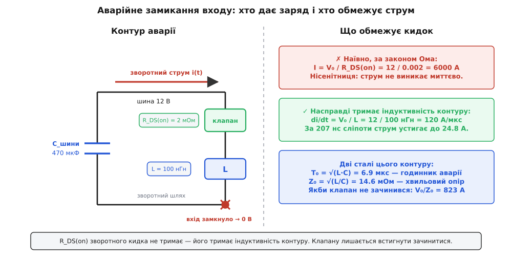
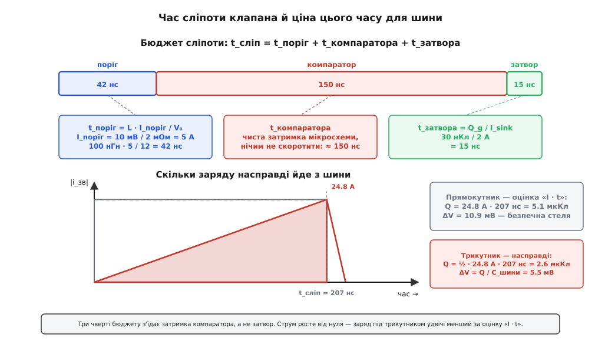
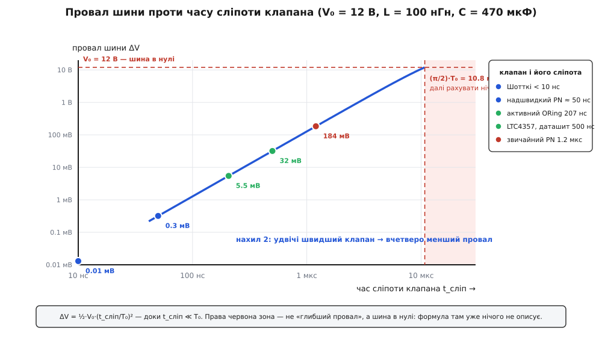

# 🧮 Динаміка аварії в ORing: чим насправді обмежений зворотний кидок

Оцінка «заряд дорівнює струм на час, провал дорівнює заряд на ємність» дає правильний порядок і правильний висновок: швидкий клапан рятує шину, повільний — ні. Але вона мовчить про найцікавіше. Звідки взявся той струм? Чому саме півсотні ампер, а не п'ять і не п'ятсот? Хто взагалі поставив йому стелю — адже відкритий MOSFET має опір у два міліоми, і закон Ома для дванадцяти вольтів на двох міліомах дає число, від якого стає смішно?

Порахуймо його. Просто щоб побачити, наскільки наївна відповідь нікуди не годиться:

```text
I = V₀ / R_DS(on) = 12 / 0.002 = 6000 А
```

Шість тисяч ампер. Стільки не буває — не тому, що «десь щось обмежить», а тому, що такий струм не має звідки взятися за ті наносекунди, поки триває аварія. Наївна відповідь хибна не в числі, а в самій постановці: вона відповідає на питання «який струм установиться», тоді як аварія закінчується задовго до того, як хоч щось устигне установитися. Ми питаємо про статику там, де все є чиста динаміка.

Отже, розберімо, що насправді відбувається у вузлі за ті двісті наносекунд. Виявиться, що весь вузол описують два числа, які нікуди не подінеш; що славнозвісна оцінка «I · t» помиляється рівно вдвічі й помиляється в безпечний бік; що добірний MOSFET із міліомним опором робить контролер **сліпішим**; і що інстинкт «стягнути контур якнайщільніше» тут працює проти вас.

## Струм має інерцію

Чому шість тисяч ампер не з'являться? Бо струм — це рух зарядів, а рух не виникає з нічого миттєво. Щоб розігнати заряди в провіднику, треба збудувати навколо них магнітне поле, а на це потрібна енергія й, головне, **час**. Міра цієї неповороткості й зветься [індуктивністю](topic:electronics/inductance) — коефіцієнт між прикладеною напругою й **швидкістю зміни** струму: щоб струм у контурі з індуктивністю L наростав, до контуру треба прикласти напругу, і що більша L, то повільніше наростання при тій самій напрузі. Індуктивність не обмежує струм — вона обмежує його **похідну**.

Аналогія з водою тут майже точна: труба з водою не дає струменя одразу, як крутнеш кран, бо воду треба розігнати, а вона має масу. Індуктивність — це маса струму, а напруга — сила, що його розганяє. Ламається аналогія в одному важливому місці: у трубі розгін закінчується, коли сила тертя зрівняє силу тиску, і далі тече стала течія. У нашому ж контурі є ще й конденсатор — а він, віддаючи заряд, **сам себе розряджає**, тобто сила, що розганяє струм, слабне в міру розгону. Вода в трубі виходить на плато; наш струм виходить на **горб** і вертається. Це вже не розгін, а коливання, і саме тому вузол доведеться рахувати як коливальний контур, а не як шматок дроту з опором.

Отже, правильне питання не «який струм», а «як швидко він росте»:

```text
di/dt = V₀ / L = 12 / (100·10⁻⁹) = 1.2·10⁸ А/с = 120 А/мкс
```

Сто двадцять ампер за мікросекунду. За двісті наносекунд це двадцять п'ять ампер — а не шість тисяч. Опір MOSFET у цьому рахунку не з'явився взагалі, і це не недогляд: **зворотний кидок тримає не опір ключа, а індуктивність контуру**. Опір ще зіграє свою роль, але зовсім в іншому місці — не там, де його шукає інтуїція.

## Контур аварії: хто дає заряд і що замкнулося

Щоб рахувати далі, треба точно знати, який саме контур замкнувся. Аварія — це коротке замикання одного входу: вузол, що був під дванадцятьма вольтами, раптом стає нулем. Спільна шина лишається під напругою — і між нею й новоспеченим нулем тепер стоїть тільки клапан аварійної гілки, який ще не знає, що сталося, і слухняно проводить.

**Хто дає заряд.** На часах у сотні наносекунд відповідь одна: **буферний конденсатор шини** і вся дрібна [розв'язувальна ємність](topic:electronics/decoupling), розсипана платою біля кожної мікросхеми — конденсатори, що стоять упритул до споживачів і віддають заряд миттєво, бо шлях до них короткий. Усе це за відкритими клапанами живих джерел зливається в одну ємність, і саме її ми звемо C_шини. Живе ж джерело — блок живлення — на цьому часі допомогти не може й нашкодити теж: на його виході стоїть дросель у десяток мікрогенрі, а тому

```text
di/dt джерела = 12 / (10·10⁻⁶) = 1.2 А/мкс
за 207 нс воно віддасть аж 0.25 А
```

чверть ампера. Блок живлення просто не встигає взяти участь у події, що триває двісті наносекунд, — його черга настане пізніше, на часах у мікросекунди. Тож на час аварії весь сюжет — це розмова конденсатора шини з місцем замикання.

**Що замкнулося.** Контур виходить короткий і простий: C_шини → доріжка → клапан → місце замикання → зворотна доріжка → назад до C_шини. Уся ця мідь має індуктивність. Тонка доріжка без близького зворотного шляху дає приблизно **1 нГн на міліметр**; над суцільним полігоном це падає до 0.3–0.5 нГн/мм, бо зворотний струм тече просто під доріжкою й компенсує поле. Додайте індуктивність корпусів і виводів — і типовий контур ORing-аварії на платі виходить у **50–200 нГн**. Візьмімо для розрахунків 100 нГн; заразом у контурі назбирується міліом десять опору — [ESR конденсаторів](topic:electronics/esr-capacitor), мідь і [сам відкритий канал](topic:electronics/rds-on).


*Заряд дає конденсатор шини, шлях замикає ще відкритий клапан, а стелю швидкості ставить індуктивність міді. R_DS(on) у цьому рівнянні не бере участі.*

Тепер випишімо контур як рівняння. Конденсатор, індуктивність, замикання — і два закони, які просто кажуть «напруга на котушці розганяє струм» та «струм виносить заряд із конденсатора»:

```text
L · di/dt = v          (напруга конденсатора розганяє струм у контурі)
C · dv/dt = −i         (струм виносить заряд, напруга падає)
```

Це послідовний LC-контур, розряджений на коротке — рівно [послідовний резонанс](topic:electronics/series-resonance), тільки не збуджений синусом, а відпущений з початкової умови v(0) = V₀, i(0) = 0. Розв'язок класичний:

```text
i(t) = (V₀ / Z₀) · sin(t / T₀)
v(t) = V₀ · cos(t / T₀)

де   T₀ = √(L·C)  = √(100·10⁻⁹ · 470·10⁻⁶) = 6.86 мкс
     Z₀ = √(L/C)  = √(100·10⁻⁹ / 470·10⁻⁶) = 0.0146 Ом = 14.6 мОм
```

Ось вони — **два числа, що описують цей вузол цілком**. T₀ — годинник аварії: єдиний час, який контур має власного, і мірка, з якою треба порівнювати всі інші часи. Z₀ — **хвильовий опір**: те саме √(L/C), яким живе [лінія передачі](topic:physics/transmission-line), і з тієї ж причини — це відношення напруги до струму для пари «індуктивність і ємність», що обмінюються енергією. Ані L, ані C поодинці нічого не вирішують; вирішують їхній добуток (час) і їхня частка (опір).

Перевірмо, що коротко-часова межа збігається з тим, що ми вже знаємо. При t ≪ T₀ синус дорівнює своєму аргументу:

```text
i(t) ≈ (V₀ / Z₀) · (t / T₀) = V₀ · t / (√(L/C) · √(L·C)) = V₀ · t / L
```

Те саме лінійне наростання зі швидкістю V₀/L, яке ми вгадали з інерції струму. Точний розв'язок і груба інтуїція зійшлися — можна рахувати далі спокійно.

## Ціна питання: якби клапан не зачинився

Перш ніж рахувати наносекунди, варто побачити, за що ми взагалі торгуємося. Уявімо, що клапан не зачинився зовсім — контролер завис, затвор лишився під напругою. Куди прийде струм?

Стеля вже виписана: перший множник у розв'язку. Синус доростає до одиниці за чверть періоду:

```text
I_макс = V₀ / Z₀ = 12 / 0.0146 = 823 А     на момент  t = (π/2)·T₀ = 10.8 мкс
```

У цю ж мить cos(π/2) = 0, тобто **шина в нулі**: конденсатор віддав усе. Опір контуру, звісно, гасить це коливання — з десятьма міліомами загасання виходить помітне, але не рятівне:

```text
ζ = R / (2·Z₀) = 0.010 / (2 · 0.0146) = 0.34     (загасання слабке)
I_пік ≈ 527 А   на момент  t ≈ 8.9 мкс
Потужність у ключі: I² · R_DS(on) = 527² · 0.002 = 555 Вт
```

П'ятсот двадцять сім ампер і півкіловата в корпусі завбільшки з ніготь. Виробники ORing-контролерів пишуть про це прямо: неконтрольований струм аварії сягає **сотень ампер за дуже короткий час**. Жодна [зона безпечної роботи](topic:electronics/soa-power-devices) такого не переживе, і мова тут уже не про провал шини, а про те, чи лишиться від ключа щось, крім диму.

> 🔧 **Навіщо це.** Швидкість зачинення — не спосіб «покращити якість живлення», а умова виживання ключа. Число V₀/Z₀ = 823 А варто рахувати першим для будь-якого ORing-вузла: воно каже, куди прийде струм, якщо захист не спрацює. І порівнювати його треба не з робочим струмом, а з імпульсною межею MOSFET і з тим, що станеться, коли він розкриється замиканням назавжди.

## Бюджет сліпоти

Тепер зрозуміло, за що змагаються наносекунди. Уведімо для цього чесну назву. Клапан не «зачиняється миттєво» й не «зачиняється повільно» — у нього є **час сліпоти** t_сліп: проміжок від миті замикання до миті, коли канал перестав проводити. Усю цю дільницю струм росте безборонно з відомим нахилом 120 А/мкс, і питання лише в тому, скільки вона триває.

Складається сліпота з трьох доданків, і корисно розібрати кожен окремо — бо вони мають зовсім різну природу й зовсім різну ціну.

**Перший: доки є що помічати.** Контролер бачить зворотний струм не безпосередньо, а за падінням на самому ключі: канал же має опір, тож струм малює на ньому напругу, і коли та змінює знак — струм пішов назад. Але компаратор не спрацьовує на нуль: у нього є поріг, зазвичай кілька міліволтів, інакше він тремтітиме від шуму. Отже, поки струм не доріс до порогу, аварії для контролера **ще не існує**:

```text
I_поріг = V_поріг / R_DS(on) = 0.010 / 0.002 = 5 А
t_поріг = I_поріг / (di/dt) = 5 / 120 А/мкс = 42 нс
```

**Другий: доки думає компаратор.** [Компаратор](topic:electronics/comparator) із логікою мають власну затримку поширення — чистий час від появи сигналу на вході до реакції на виході. Це властивість кремнію, і скоротити її неможливо ніяк, крім як купити інший контролер. Типово це **150 нс** — і, як зараз побачимо, саме тут і зникає майже весь бюджет.

**Третій: доки виривається заряд із затвора.** Щоб канал зачинився, з затвора треба [винести заряд](topic:electronics/mosfet-gate-charge) — MOSFET керується не напругою, а зарядом, і час зачинення дорівнює просто заряду, поділеному на струм, яким [драйвер](topic:electronics/gate-driver) той заряд висмоктує:

```text
t_затвора = Q_g / I_sink = 30·10⁻⁹ / 2 = 15 нс
```

Складаємо:

```text
t_сліп = t_поріг + t_компаратора + t_затвора
       = 42 + 150 + 15 = 207 нс
```


*Три чверті сліпоти з'їдає затримка компаратора — та частина, на яку розробник вузла не має жодного важеля. Праворуч видно, що заряд під трикутником удвічі менший за оцінку «I · t».*

Двісті сім наносекунд — це не вигадане число: виробники ORing-контролерів для сильного імпульсного розряду затвора називають саме діапазон **100–200 нс**, а поважний LTC4357 виносить у перший рядок опису «час зачинення 0.5 мкс обмежує піковий струм аварії». Ми в правильному класі.

Але подивіться на структуру бюджету, а не на суму. **Три чверті часу — затримка компаратора.** Затвор, навколо якого точиться вся інженерна метушня — потужні драйвери, товсті доріжки до затвора, MOSFET-и з малим Q_g, — коштує п'ятнадцять наносекунд із двохсот семи. Можна зробити драйвер удесятеро сильнішим і виграти цілих тринадцять наносекунд із двохсот семи. Головний важіль тут — вибір мікросхеми, а не героїзм у розводці затвора.

І тепер — несподіванка, схована в першому доданку. Перепишімо його через параметри ключа:

```text
t_поріг = L · I_поріг / V₀ = L · V_поріг / (R_DS(on) · V₀)
```

R_DS(on) стоїть у **знаменнику**. Що кращий MOSFET, то менше падіння він малює на однаковому струмі, — а отже, то більший струм потрібен, щоб докричатися до компаратора:

```text
R_DS(on) = 8 мОм → I_поріг = 1.2 А → t_поріг = 10 нс → t_сліп = 175 нс → ΔV = 3.9 мВ
R_DS(on) = 4 мОм → I_поріг = 2.5 А → t_поріг = 21 нс → t_сліп = 186 нс → ΔV = 4.4 мВ
R_DS(on) = 2 мОм → I_поріг = 5.0 А → t_поріг = 42 нс → t_сліп = 207 нс → ΔV = 5.5 мВ
R_DS(on) = 1 мОм → I_поріг =  10 А → t_поріг = 83 нс → t_сліп = 248 нс → ΔV = 7.9 мВ
```

Міліомний ключ, узятий заради мізерного спаду й холодного корпусу, робить контролер **удвічі сліпішим** за чотириміліомний. Опір каналу — це водночас і втрати, і **вимірювальний шунт**, яким контролер намацує аварію; прибираючи втрати, ви прибираєте й чутливість. Це не привід ставити гірший MOSFET — це привід розуміти, що «менший R_DS(on)» не є безумовним добром і що в аварійному рахунку він іде з мінусом.

## Заряд під трикутником

Тепер зведімо бюджет часу з ємністю шини. Питання просте: скільки заряду встигає піти з C_шини за час сліпоти?

Ось де оцінка «Q = I · t» показує свій характер. Вона мовчазно припускає, що всі 207 наносекунд струм тримався на піковому значенні — тобто малює **прямокутник**. Насправді ж струм росте від нуля лінійно й досягає піку рівно в мить зачинення, тобто площа під ним — **трикутник**:

```text
I_пік = (di/dt) · t_сліп = 120 А/мкс · 0.207 мкс = 24.8 А

Q = ½ · I_пік · t_сліп = ½ · 24.8 · 0.207·10⁻⁶ = 2.6 мкКл       (трикутник)
Q = I_пік · t_сліп     = 24.8 · 0.207·10⁻⁶     = 5.1 мкКл       (прямокутник)
```

Рівно вдвічі. Оцінка «I · t» помиляється — але помиляється в **безпечний** бік, даючи стелю, і саме тому нею й користуються: за неї не сховається жодна несподіванка. Знати треба інше — що вона стеля, а не відповідь, і що запас у ній рівно двократний, а не десятикратний.

Головне ж, чого не видно в «I · t»: пік і час **не є незалежними числами**. Задавши t_сліп і контур, ви вже задали I_пік. Підставмо це й дістанемо провал шини:

```text
Q  = ½ · (V₀/L) · t_сліп²  =  V₀ · t_сліп² / (2L)

ΔV = Q / C = V₀ · t_сліп² / (2·L·C) = ½ · V₀ · (t_сліп / T₀)²
```

Ось воно — найкорисніше рівняння всієї теми. Провал шини залежить від часу сліпоти **квадратично**, і залежить не від L і C окремо, а від єдиного безрозмірного відношення τ = t_сліп / T₀ — часу сліпоти, поміряного годинником контуру.

**Наскрізний вузол: V₀ = 12 В, C_шини = 470 мкФ, L = 100 нГн, t_сліп = 207 нс.**

```text
τ  = t_сліп / T₀ = 0.207 / 6.86 = 0.030

ΔV = ½ · 12 · 0.030² = 0.0055 В = 5.5 мВ
перевірка через заряд:  2.6·10⁻⁶ / 470·10⁻⁶ = 5.5 мВ   ✔
```

П'ять із половиною міліволтів. Замикання входу — подія, що звучить як катастрофа, — коштує спільній шині менше за шум звичайного імпульсного перетворювача. Ось що купують за наносекунди.


*У подвійному логарифмічному масштабі точний розв'язок ΔV = V₀·(1 − cos(t/T₀)) — пряма з нахилом 2, що впирається в стелю V₀. Робочі точки клапанів різних типів лягають на неї; червона зона праворуч — не «глибший провал», а шина в нулі.*

Квадрат — це важіль неабиякої сили. Удвічі швидший клапан дає **вчетверо** менший провал; удвічі повільніший — учетверо глибший. Саме тому змагання за наносекунди в цьому класі мікросхем має сенс, тоді як у більшості інших місць схемотехніки сотня наносекунд — величина, про яку не варто й згадувати.

І тут же — межа застосовності, яку варто знати напам'ять. Формула ΔV = ½·V₀·τ² виведена з припущення τ ≪ 1: ми замінили косинус параболою й вважали, що шина за час аварії майже не просіла, тож напруга, яка розганяє струм, лишалася сталою. При τ = 0.03 це бездоганно. При τ ≈ 1 — уже ні, а при τ > π/2 = 1.57 формула не просто неточна, вона **описує неіснуюче**: шина на той час давно в нулі, і питати «на скільки вона просіла» безглуздо. Груба оцінка з повільним клапаном на 20 мкс дає τ = 2.9 і провал у два вольти — насправді ж шина зникає повністю ще на 10.8 мкс. Лінійна формула бреше в обидва боки: при малих τ вона вдвічі песимістична, при великих — оптимістична настільки, що ховає катастрофу.

## Хвіст: чим швидше зачиниш, тим сильніше вдарить

Здавалося б, висновок готовий: женися за найкоротшою сліпотою й радій. Але з рівнянь випливає ще одна річ, і вона неприємна.

У мить зачинення в індуктивності контуру тече 24.8 ампера. Струм у котушці не можна обірвати — [енергія магнітного поля](topic:electronics/inductor-energy) мусить кудись подітися, і подітися їй нема куди, крім як у власну вихідну ємність MOSFET C_oss (це ємність між стоком і витоком разом із перехідною — те, що лишається на затиснутому ключі). Струм заряджає її, доки не вичерпає енергію:

```text
Енергія в контурі:   E = ½ · L · I_пік² = ½ · 100·10⁻⁹ · 24.8² = 31 мкДж

½ · L · I²  =  ½ · C_oss · V²   →   V_викид = I_пік · √(L / C_oss)
V_викид = 24.8 · √(100·10⁻⁹ / 1·10⁻⁹) = 24.8 · 10 = 248 В
```

Двісті сорок вісім вольтів поверх дванадцятивольтової шини — на ключі, розрахованому вольтів на тридцять. Це не теорія: практики описують ту саму послідовність подій — просідання шини, а тоді **викид і дзвін, коли обірвано струм і надлишкова енергія індуктивності шукає виходу**. Тридцять один мікроджоуль сам собою мізерний, і [лавинний пробій](topic:electronics/mosfet-avalanche) добрий MOSFET переживе — його паспортна лавинна енергія рахується мілі-, а не мікроджоулями. Але переживе тільки той, кому це паспортом дозволено; решту чекає [снабер або TVS](topic:electronics/snubbers-dvdt).

А тепер поміркуймо, що станеться, якщо стягнути контур щільніше — інстинкт же велить робити петлю якнайкоротшою. Уся хитрість у тому, що I_пік не є заданим: його **робить сама L**. Підставмо:

```text
E = ½ · L · I_пік² = ½ · L · (V₀·t_сліп / L)² = V₀² · t_сліп² / (2L)
V_викид = I_пік · √(L/C_oss) = V₀ · t_сліп / √(L · C_oss)
```

L опинилася в **знаменнику** обох. Менша індуктивність — **більше** енергії в контурі й **вищий** викид. Порахуймо чесно, з поправкою на те, що менша L ще й скорочує t_поріг:

```text
L =  25 нГн:  t_сліп = 175 нс,  I_пік = 84 А,  E = 89 мкДж,  V_викид = 421 В,  ΔV = 15.7 мВ
L =  50 нГн:  t_сліп = 186 нс,  I_пік = 45 А,  E = 50 мкДж,  V_викид = 315 В,  ΔV =  8.8 мВ
L = 100 нГн:  t_сліп = 207 нс,  I_пік = 25 А,  E = 31 мкДж,  V_викид = 248 В,  ΔV =  5.5 мВ
L = 200 нГн:  t_сліп = 248 нс,  I_пік = 15 А,  E = 22 мкДж,  V_викид = 211 В,  ΔV =  3.9 мВ
L = 400 нГн:  t_сліп = 332 нс,  I_пік = 10 А,  E = 20 мкДж,  V_викид = 199 В,  ΔV =  3.5 мВ
```

Щільніший контур програє за **всіма трьома** аварійними статтями одразу: більший пік, більша енергія, вищий викид, глибший провал шини. Це не помилка в арифметиці — це прямий наслідок того, що індуктивність тут не паразит, який шкодить, а **єдиний обмежувач**, який захищає. Чим менше в контурі інерції, тим швидше він розганяється за ту саму сліпоту.

Звідси й практика, що спершу здається дикою: щоб приборкати викид, у затвор ставлять **послідовний резистор на 10–200 Ом** — навмисно послаблюють розряд затвора й **сповільнюють** зачинення, щоб зменшити di/dt. Тобто платять зайвим зарядом із шини (квадратично!) за нижчий викид на ключі. Це і є справжній компроміс цього вузла, і зважують його не «на око», а по числах вище: скільки міліволтів провалу коштує кожен десяток вольтів збитого викиду.

> 🔧 **Навіщо це.** Розводячи ORing-вузол, розділіть два контури, які інстинкт зливає в один. Контур **робочого струму** — від джерела до шини — тягніть щільно: його індуктивність псує все, від передачі до цілісності живлення. А от аварійна індуктивність між ключем і буферним конденсатором — не ворог, а запобіжник, і намагатися звести її в нуль означає готувати ключу вищий викид і більший пік. Практичний висновок один: не «мінімізуй L», а **порахуй V_викид і порівняй із BV_DSS ключа** — і лише тоді вирішуй, чи потрібен снабер, чи резистор у затворі, чи інший MOSFET.

## Клапан клапану різний

Лишилося чесно порівняти, скільки триває сліпота в клапанів різної природи, — бо тут теж є ілюзія, яку варто розвіяти.

**Діод Шотткі сліпоти майже не має, і це фізика, а не швидкодія.** [Шотткі](topic:electronics/schottky-diode) — перехід метал-напівпровідник, струм у ньому несуть лише **основні носії** (електрони), а отже, за прямого струму в базі не накопичується запас неосновних носіїв. Нема запасу — нема чого виносити: заряд зворотного відновлення прямує до нуля, а час — до одиниць наносекунд (менш як 10 нс). Клапан справді зачиняється по суті миттєво.

**А от кремнієвий PN-діод миттєвим не є.** У [PN-переході](topic:physics/pn-junction) прямий струм несуть носії обох знаків, і за час провідності в базі накопичується заряд неосновних носіїв. Поки його не винесе, перехід **не здатний блокувати** — і чесно проводить назад. Це [зворотне відновлення](topic:electronics/reverse-recovery), і триває воно в звичайного випрямляча зі стандартним відновленням близько **мікросекунди** (у виміряного 1N4004 — приблизно 1.2 мкс), у надшвидкого — **25–50 нс**. Різниця між двома кремнієвими діодами з однієї шухляди — понад два порядки.

Порахуймо провал шини для кожного класу клапана в тому самому вузлі:

```text
Клапан                     t_сліп     I_пік      Q         ΔV шини
Шотткі                     < 10 нс    1.2 А    0.006 мкКл    0.01 мВ
надшвидкий PN                50 нс      6 А    0.15 мкКл      0.3 мВ
активний ORing (наш)        207 нс   24.8 А     2.6 мкКл      5.5 мВ
LTC4357 (за даташитом)      500 нс     60 А      15 мкКл       32 мВ
звичайний PN               1200 нс    144 А      86 мкКл      184 мВ
```

Порядок виходить повчальний. Пасивні клапани справді **швидші за активні** — Шотткі виграє в найкращого контролера два порядки, і не завдяки хитрощам, а тому, що йому нема чого «помічати» й нема чим «думати». Це справжня плата за активний клапан: мізерний спад і холодний корпус куплено двомастами наносекундами сліпоти. Але між пасивними клапанами прірва не менша: **звичайний кремнієвий випрямляч утричі повільніший за LTC4357** і краде з шини вп'ятеро більше заряду. Тож «діод зачиняється миттєво» — правда рівно про Шотткі і надшвидкий PN; звичайний PN-діод у цьому змаганні програє навіть неквапливому контролеру.

Тут-таки видно, як звести кінці з грубою оцінкою «50 А за 0.3 мкс», з якої зазвичай починають. Ці два числа не незалежні: якщо клапан був сліпий 0.3 мкс, а струм доріс до 50 А, то контур був

```text
L = V₀ · t / I = 12 · 0.3·10⁻⁶ / 50 = 72 нГн
```

сімдесят два наногенрі — цілком типова петля на платі. Оцінка виявляється не вигадкою, а тим самим вузлом, поміряним трохи іншим олівцем.

## Три важелі — і той, що тягне в обидва боки

Зберімо все в одне рівняння й подивімося, за що взагалі можна смикати:

```text
ΔV = V₀ · t_сліп² / (2 · L · C)
```

**Час сліпоти** — важіль квадратичний, найсильніший. Але майже весь він — затримка компаратора, тобто вибір мікросхеми, а не творчість; і знизу його підпирає викид на ключі, який росте, коли зачиняєшся швидше.

**Індуктивність контуру** — теж у знаменнику: що вона більша, то мілкіший провал, то нижчий пік, то слабший викид. За аварійним рахунком індуктивність виходить суцільним добром. То чому ж її не нарощують?

Бо та сама L і та сама C живуть у вузлі не лише під час аварії. Подивімося на **звичайну передачу** — ту, заради якої вся схема й існує: одне джерело згасло, друге підхоплює. Друге джерело мусить розігнати свій струм від нуля до струму навантаження, і розганяє його крізь ту саму індуктивність. Поки воно розганяється, навантаження живить конденсатор шини — і шина просідає. Рівняння ті самі, тільки початкова умова інша: напруга на шині в нормі, а струму в котушці ще нема (i(0) = 0, u(0) = 0, j(0) = −I_нав). Розв'язок:

```text
i(t) = I_нав · (1 − cos(t/T₀))
v(t) = V_дж − I_нав · Z₀ · sin(t/T₀)

Провал при передачі:  ΔV = I_нав · Z₀ = I_нав · √(L/C)
```

І ось воно, найкрасивіше в цьому вузлі: **той самий хвильовий опір Z₀, що ставив стелю аварійному струму, тепер ставить глибину провалу при передачі**. Одне число, дві ролі — бо це та сама пара L і C, що обмінюється енергією.

```text
I_нав = 10 А:  ΔV = 10 · 0.0146 = 146 мВ   (із загасанням ≈ 93 мВ, за 8.9 мкс)
```

Порівняйте: **аварія-замикання коштує шині 5.5 мВ, а буденна передача на резерв — 93 мВ.** Уся драма з наносекундами й сотнями ампер програє за глибиною провалу звичайному перемиканню джерел у шістнадцять разів. Ось навіщо на шині сидить чималий конденсатор — не стільки проти аварії, скільки проти буднів.

І ось де L нарешті показує свій рахунок. Аварія хоче Z₀ **більшим** (стеля струму V₀/Z₀ вища) і T₀ більшим (τ менше). Передача хоче Z₀ **меншим** (провал I·Z₀ мілкіший). А оскільки

```text
T₀ = √(L·C)    Z₀ = √(L/C)      →      T₀ · Z₀ = L      T₀ / Z₀ = C
```

то виходить чіткий вирок кожному важелю. **C збільшує T₀ і зменшує Z₀ водночас** — єдиний беззастережний виграш у цьому вузлі, і платить за нього лише місце на платі та гроші. **L тягне в обидва боки**: більша індуктивність рятує від аварії й псує передачу, — а оскільки передача коштує вшістнадцятеро дорожче, у реальній платі перемагає вона, і контур усе-таки тягнуть щільно. Не тому, що «менше паразитів — завжди краще», а тому, що на цих числах передача важить більше за аварію.

Звідси й порядок перевірки для будь-якого ORing-вузла, у три рядки:

```text
1.  τ = t_сліп / √(L·C) ≪ 1 ?        інакше рахувати нема чого — шина обвалиться
2.  ΔV = ½·V₀·τ²  <  дозволеного ?   провал від аварії
3.  V₀ + I_пік·√(L/C_oss) < BV_DSS ? чи переживе ключ власне зачинення
```

Три рядки, дві сталі, один безрозмірний параметр. Усе решта — вибір мікросхеми з даташита.
