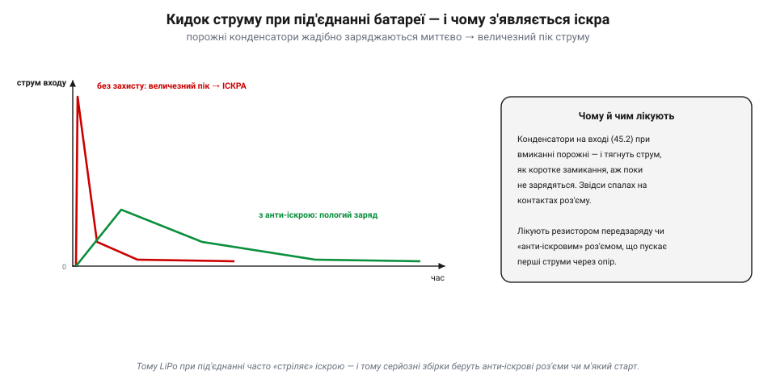
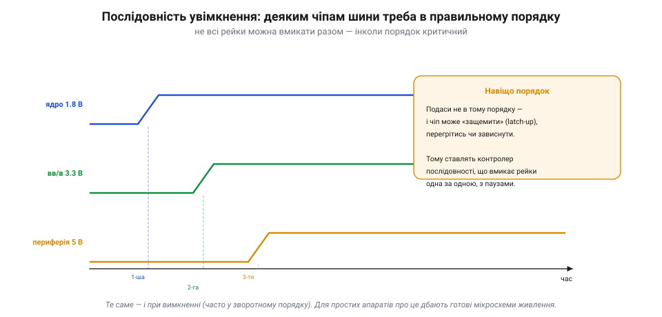
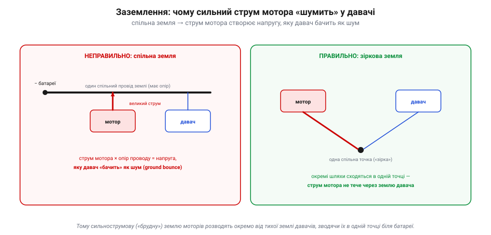

# Кілька шин живлення й послідовність

Маючи [перетворювачі напруги](book:electronics/switching-converter), складемо з них **усю систему живлення**. Бо на складному апараті це не один регулятор, а ціле **дерево** шин — і разом із ним приходять субтильні, але кусючі проблеми: кидок струму при під'єднанні, порядок увімкнення рейок, місцева розв'язка й — найпідступніше — заземлення. Саме тут живлення найчастіше «йде не так», тож пройдімо по черзі.

### Дерево живлення

Від єдиного кореня — батареї — живлення розходиться гілками: щось бере напругу сирою, щось — через перетворювачі, і кожна гілка має своїх споживачів:

*Рис. Живлення апарата — дерево. Корінь — батарея. Одна гілка йде «сирою» до моторів через ESC (їм потрібна потужність, не точність). Інша — через знижувальний перетворювач на головну 5-вольтову шину (контролер, приймач), а від неї тихий LDO робить чисті 3.3 В для давачів. Третя — на 12 В для камери чи підвісу. Часто все це збирають на одній платі розподілу живлення (PDB).*

Кожна гілка має свій **струмовий бюджет**: перетворювач і дроти розраховані на певний максимум, і навантажити гілку понад нього — означає перегрів чи просадку. А головне правило дерева — те саме, що й у [надійності системи](book:programming/redundancy): **відмова в корені валить усі гілки нижче**. Сіла батарея, згорів головний перетворювач, відпав головний роз'єм — і знеструмлено все. Тому корінь дерева бережуть найпильніше.

Кілька слів про практику. Готовий вузол, що робить 5 чи 12 В для логіки з батареї, на дронах часто звуть **BEC** — це просто перетворювач у складі [регулятора обертів (ESC)](book:electronics/esc) чи окремий блок. А там, де падати не можна, дерево живлення **дублюють**: ставлять два акумулятори через діодне «АБО» (кожен через свій діод у спільну шину, тож відмова одного не знеструмить борт) — а в сильнострумових чи ощадливих системах звичайний діод (з його падінням напруги й нагрівом) замінюють на **MOSFET-«ідеальний діод»** (*ORing/PowerPath*) — або окреме надійне живлення політного контролера. І рахуючи бюджет гілки, завжди додають запас: пікові струми (різкий газ, ввімкнення) вищі за середні, і перетворювач мусить витримати їх без просадки й перегріву.

Не варто забувати й про найпростіше — **дроти й роз'єми**. Сильнострумова гілка (батарея → ESC → мотори) тягне десятки ампер, тож дроти там товсті: тонкий провід має помітний опір, грітиметься й «з'їдатиме» напругу (та сама [втрата I²R на нагрів](book:physics/joule-heating)). Роз'єми теж мусять бути на потрібний струм, інакше гріються в контакті. А сигнальні лінії, навпаки, тонкі — струми там мізерні. Тому, дивлячись на джгут апарата, за товщиною дроту одразу видно, де тече сила, а де лиш сигнал.

Числовий приклад допомагає відчути масштаб. Скажімо, чотири мотори на повному газі тягнуть по ~25 А — це вже близько 100 А на сильнострумовій гілці (звідси й товсті дроти, і потужна батарея). А вся «розумна» частина — контролер, давачі, приймач — разом споживає, може, 0.5 А на 5-вольтовій шині, тобто лише ~2.5 Вт. Контраст разючий: майже вся енергія йде на політ, а логіка — крихта. Тому 5-вольтовий перетворювач можна взяти маленький, а от силову гілку рахують прискіпливо: помилка в десяток ампер тут — це перегрітий дріт чи просадка напруги.

> 🔧 **Навіщо це.** Перше, що варто намалювати (або відновити подумки) для будь-якого апарата, — це його **дерево живлення**: від чого живиться кожен вузол, через який перетворювач, з яким лімітом. Тоді одразу видно, де вузькі місця (перевантажені гілки), а де єдині точки відмови (спільний корінь). Це той самий [погляд через відмови](book:programming/redundancy), тільки для живлення.

### Кидок струму й іскра при під'єднанні

Перша несподіванка чатує вже в мить, коли ти **під'єднуєш** батарею. На входах [перетворювачів](book:electronics/switching-converter) стоять конденсатори, і поки апарат вимкнений, вони **порожні**. А порожній конденсатор у перші миттєвості поводиться як **коротке замикання** — і жадібно тягне величезний струм, щоб зарядитися:

*Рис. Кидок струму (*inrush*) при під'єднанні. Порожні вхідні конденсатори заряджаються майже миттєво, видираючи з батареї пік струму в десятки чи сотні ампер на коротку мить — і саме він спалахує **іскрою** на контактах роз'єму. Лікують це резистором передзаряду чи «анти-іскровим» роз'ємом, що перші струми пускає через опір, а вже тоді змикає основний контакт.*

Ось чому літій-полімерна батарея при під'єднанні часто **стріляє** видимою іскрою — це не поломка, а нормальний кидок струму на заряд конденсаторів. Але іскра шкідлива: вона **обпалює** контакти роз'єму (з часом псує їх), стресує батарею й може злякати. Тому на серйозних збірках ставлять **анти-іскрові** роз'єми (з додатковим контактом-резистором, що замикається першим) або схему **м'якого старту**, яка плавно піднімає напругу. Принцип скрізь один: дати конденсаторам зарядитися **повільно**, через опір, перш ніж пустити повний струм.

Як саме резистор приборкує кидок? Він просто **обмежує** перший струм законом Ома: великий опір — малий початковий струм, конденсатори заряджаються плавно за частку секунди, а вже тоді змикається прямий контакт. На дронах для цього є спеціальні роз'єми з додатковим «передзарядним» штирком, що торкається першим через опір (відомі як анти-іскрові). Без них доводиться вмикати акумулятор обережно або через зовнішній модуль м'якого старту.

> 🔧 **Навіщо це.** Іскра при під'єднанні LiPo — норма, але якщо вона велика й контакти чорніють, варто перейти на анти-іскровий роз'єм: обпалені контакти зростають опором, гріються й зрештою підводять у польоті. А ще: великі вхідні конденсатори (потрібні для тихого живлення) **посилюють** кидок — тож тут є компроміс між чистотою живлення й силою іскри.

### Послідовність увімкнення

Друга субтильність: на деяких апаратах рейки не можна вмикати **як заманеться** — їх треба піднімати в певному **порядку**. Складні чіпи (процесори, ПЛІС) часто мають окремі живлення для ядра й для входів-виходів, і виробник вимагає, щоб вони з'являлися строго одне за одним:

*Рис. Деяким чіпам потрібен порядок. Тут ядро (1.8 В) має піднятися першим, потім живлення входів-виходів (3.3 В), а тоді периферія (5 В). Подаси напруги не в тому порядку — і чіп може «защемити» (latch-up), перегрітись чи зависнути. Тому ставлять **контролер послідовності**, що вмикає рейки одна за одною з паузами; те саме — і при вимкненні, часто у зворотному порядку.*

Що таке те «защемлення» (latch-up)? У деяких чіпах неправильна напруга на входах раніше за живлення відкриває паразитний шлях усередині кремнію, і чіп починає проводити сам крізь себе — гріється й може згоріти, поки не знімеш живлення. Тому й порядок. Споріднена ідея — **блокування за низькою напругою** (*UVLO*): перетворювач сам не вмикає вихід, поки вхід не підніметься до робочого рівня, щоб не годувати чіпи «недопеченою» напругою.

Для простого апарата про це здебільшого подбали вже **готові мікросхеми** живлення чи плата контролера — але знати, що така вимога існує, корисно: інколи «чіп не стартує» чи «гріється на ввімкненні» — це саме порушений порядок живлення, а не дефект.

> 🔧 **Навіщо це.** Якщо складний модуль поводиться дивно одразу після ввімкнення — серед підозр має бути **послідовність живлення**. А проєктуючи власну плату з потужним процесором, перевір у його даташиті розділ *power sequencing*: знехтуваний порядок рейок — підступне джерело нестабільності.

### Розв'язка й заземлення

Дві останні, але найважливіші тонкощі. Перша — **розв'язка** (*decoupling*): біля кожного чіпа ставлять маленькі [конденсатори](book:electronics/capacitor), що служать **місцевим запасом** енергії. Коли чіп раптом смикає струм (а цифрові чіпи смикають його різко, щотакту), цей запас віддає його **миттєво**, поки далека шина «не помітила», — і напруга біля чіпа не просідає. Без розв'язки кожен такий смик «дзвенів» би по всій платі. Ось чому на платах так багато дрібних конденсаторів — кожен стереже спокій свого сусіда.

Зазвичай розв'язку роблять **двома** типами конденсаторів: дрібні керамічні — біля самих ніжок чіпа, бо вони реагують найшвидше на різкі смики; і більші, «об'ємні» (електролітичні чи танталові) — трохи далі, як ширший резерв на повільніші коливання. Разом вони покривають і блискавичні, і неквапні провали напруги. Тому біля кожного складного чіпа бачиш розсип конденсаторів різного розміру — це не надмір, а ешелонована оборона напруги.

Друга, найпідступніша — **заземлення**. Здавалося б, земля одна для всіх. Але провід має опір, і коли через спільну землю тече **сильний** струм мотора, він створює на ній маленьку напругу — яку чутливий давач, прив'язаний до тієї ж землі, бачить як **шум**:

*Рис. Чому сильний струм «шумить» у давачі. Ліворуч (неправильно): мотор і давач ділять один провід землі; струм мотора, помножений на опір проводу, дає напругу, яку давач помилково «бачить» (*ground bounce*). Праворуч (правильно): **зіркова земля** — сильнострумова земля моторів і тиха земля давачів ідуть окремими шляхами, що сходяться в одній точці біля батареї; струм мотора більше не тече через землю давача.*

Це класична пастка: апарат начебто справний, а давачі «шумлять» чи компас «бреше» — і причина не в них, а в тому, що їхню землю «забруднив» струм моторів. Розв'язок — **зіркова земля** (*star ground*): розвести «брудну» сильнострумову землю й «тиху» сигнальну окремими шляхами та звести їх в **одній** точці. Тоді струм моторів не тече крізь землю давачів, і шум не потрапляє в сигнал.

На друкованих платах цю ідею втілюють **площиною землі** — суцільним мідним шаром, що дає струмам найкоротший шлях і малий опір. А от **різати** цю площину на «тиху» (аналогову, біля давачів та АЦП) й «гучну» (цифрову/силову) — рішення тонке й часто **шкідливе**: сучасна порада для змішаних плат — радше **суцільна** низькоомна площина, продумане **розміщення** блоків і контроль **зворотних струмів**, а розрізати її варто лише тоді, коли це прямо радить даташит чи архітектура (бо розрив у непідходящому місці лише подовжує петлю зворотного струму й **додає** завад). Дрібниця в розведенні землі вирішує, чи буде давач чистим, чи «брудним», — і це одна з найтонших, найменш очевидних частин проєктування, помилку в якій видно лише в готовому виробі за дивним шумом.

> 🔧 **Навіщо це.** Заземлення — найчастіша прихована причина «нез'ясовного» шуму давачів і збоїв. Якщо компас чи аналоговий давач «брудний» саме під газом — підозрюй спільну землю із силовою частиною. А правило просте: сигнальну землю тримай окремо від сильнострумової, зводячи їх в одній точці. Те саме стосується й розташування — [бортові давачі](book:electronics/onboard-sensors) монтують подалі від силових петель.

Помітьмо, що розв'язка, зіркова земля й фільтри проти шуму [імпульсних перетворювачів](book:electronics/switching-converter) — це все боротьба з **одним ворогом**: завадами. Швидкі струми всюди — у перемиканнях перетворювача, у смиках цифрових чіпів, у моторах — наводять напруги там, де їх не чекали. Тому «чисте» живлення — це не один прийом, а ціла культура: коротити петлі струму, розводити брудне й тихе, ставити конденсатори там, де енергія потрібна вмить. Недбалість в одному місці зводить нанівець старання в інших.

### Захист і підсумок

Лишилося згадати **захист**. Серйозна система живлення має запобіжники: [**захист від зворотної полярності**](book:electronics/reverse-polarity) (переплутав «+» і «−» — і без захисту електроніка згоряє миттєво), **запобіжники** чи електронні «еФьюзи» від перевантаження й короткого, контроль перегріву. Усе це — бо живлення критичне, а помилки тут руйнівні.

І ще один вузол варто згадати саме тут — **давач живлення**. Він сидить на головній шині й міряє напругу та струм батареї (струм — через малий шунтовий резистор, напругу — дільником). Звідси контролер знає спожиту енергію, поточну потужність і — головне — коли вмикати failsafe за низьким зарядом. Тобто система живлення не лише роздає енергію, а й **доповідає** про себе, замикаючи місток на [бюджет енергії](book:electronics/energy-budget) і на [надійність](book:programming/redundancy).

Отже, система живлення апарата — це **дерево** шин від батареї-кореня, кожна гілка зі своїм перетворювачем, бюджетом і споживачами. Навколо нього — субтильності, що найчастіше й підводять: **кидок струму** з іскрою при під'єднанні (лікують анти-іскрою), **послідовність** увімкнення для складних чіпів, **розв'язка** місцевими конденсаторами й — найпідступніше — правильне **заземлення** зіркою, щоб струм моторів не шумів у давачі. Плюс захист від зворотної полярності й перевантажень. А над усім — пам'ять, що живлення є головною [єдиною точкою відмови](book:programming/redundancy), тож його проєктують найретельніше.

Звідси й практичний підсумок: коли апарат «дивно поводиться», а явної поломки нема, винна несподівано часто саме система живлення. Перелік підозр сталий: просіла напруга під газом (слабкий перетворювач чи тонкі дроти); шум давачів під навантаженням (спільна земля); збій на ввімкненні (кидок струму чи порядок рейок); раптовий перезапуск контролера (просадка логічної шини). Навчившись підозрювати живлення першим, заощаджуєш години марних пошуків деінде.

А в корені всього цього дерева стоїть саме джерело енергії — [акумулятор](book:electronics/batteries) зі своєю хімією, напругою, ємністю й внутрішнім опором, що й задає, скільки струму гілки можуть узяти й як довго.

---
