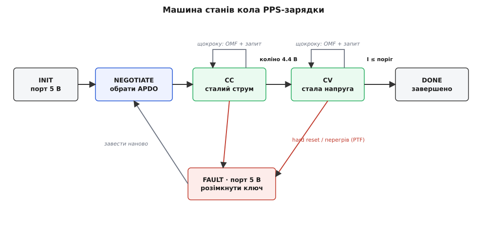
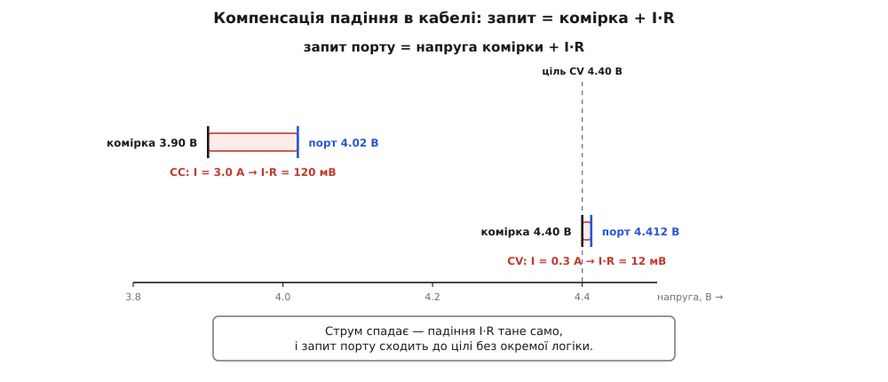

# ⚙️ Робоче коло PPS-зарядки: вести комірку й не впустити контракт

Уявімо, що PD-стік у телефоні вже стоїть на ногах: він оголосився через [дисципліну стіка](topic:electronics/usb-pd-sink) — резистор на лінії CC, укладений контракт, — знайшов у меню джерела рядок PPS-APDO і домовився про перший запит. На порті стоїть якась розумна напруга. Але зарядка від цього ще не почалась. Комірка — рухома ціль: її напруга повзе від 3.4 до 4.4 вольта, струм має бути сталим, а тоді спадати, і хтось мусить **безперервно** переформовувати запит до адаптера, ведучи батарею її кривою [CC/CV](topic:electronics/li-ion-charger). Цей «хтось» — коло керування в прошивці мікроконтролера, що сидить над PD-контролером і кожні кількасот мілісекунд перепитує в адаптера нову пару «напруга-струм».

Питання цієї вставки дуже конкретне: **як виглядає це коло цілком** — від станів CC→CV до читання того, що адаптер сам про себе каже, — **і де в ньому три тихі пастки**, на яких робоча з вигляду прошивка одного дня кладе заряд або переливає струм у комірку.

## Ідея: повільне коло, машина станів і два зворотні зв'язки

Усе коло — це маленький [скінченний автомат](topic:electronics/finite-state-machines) поверх готового стіка. Станів небагато: домовитися про APDO, гнати сталий струм (CC), тримати сталу напругу (CV), завершити. А між станами крутиться повільна петля — не мегагерци аналогового регулятора, а спокійні кількасот мілісекунд на виток, бо комірка змінюється поволі й квапитися нема куди.

Ключова відмінність від наївного уявлення — тут **два** зворотні зв'язки, не один. Перший очевидний: телефон міряє струм і напругу на комірці й підкручує запит. Другий менш очевидний і саме він відрізняє надійну прошивку від крихкої: адаптер PPS **сам повідомляє**, у якому він режимі — тримає напругу (CV) чи вперся в стелю струму (CL), — і чи не перегрівся. Читати цей прапорець означає керувати за **фактом**, а не за здогадом; ігнорувати його — третя й найпідступніша з пасток.

І ще одна річ, що пронизує все коло: кожен запит до адаптера — не лише корекція, а й **сигнал «я живий»**. Стандарт вимагає, щоб стік слав новий запит щонайменше раз на 10 секунд; замовк надовше — адаптер робить [hard reset](topic:electronics/usb-pd) і зганяє напругу на безпечні 5 вольтів. Тому саме коло керування, поки воно крутиться, і тримає контракт живим.


*Хребет прошивки — п'ять станів. З CC у CV переходять на коліні 4.4 В; у кожному стані самопетля щокроку шле новий запит (він же keep-alive) і читає режим джерела. Убік від обох робочих станів — аварійна гілка: hard reset чи перегрів кидають автомат у FAULT, звідки він розмикає ключ і заводить контракт наново.*

## Скелет: стани, межі APDO і затиск

Почнімо з кістяка — станів, констант і одного помічника, без якого не можна робити жодного запиту. Домен тут наскрізь апаратний: регістри PD-контролера, переривання таймера, польовий ключ — тож природна мова C.

```c
// ── Стани кола зарядки ──────────────────────────────────────────────
typedef enum {
    ST_INIT,       // нема контракту; на порті безпечні 5 В
    ST_NEGOTIATE,  // шукаємо PPS-APDO і укладаємо перший запит
    ST_CC,         // сталий струм: женемо струм комірки до цілі
    ST_CV,         // стала напруга: тримаємо комірку на 4.40, струм спадає
    ST_DONE,       // струм упав нижче термінації — заряд завершено
    ST_FAULT,      // аварія (hard reset, перегрів) — усе спочатку
} charge_state_t;

static volatile charge_state_t g_state = ST_INIT;
static int g_vreq_mv;        // поточна запитана напруга ПОРТУ (сітка 20 мВ)
static int g_ilim_ma;        // поточна стеля струму APDO (сітка 50 мВ)
static int g_i_charge_ma;    // цільовий струм CC (може падати від перегріву)

// ── Числа задачі ────────────────────────────────────────────────────
#define PPS_VSTEP_MV      20      // крок напруги PPS
#define PPS_ISTEP_MA      50      // крок струму PPS
#define APDO_VMIN_MV      3300    // мінімум обраного APDO (тут 3.3 В — межа стандарту)
#define APDO_VMAX_MV      11000   // максимум обраного APDO
#define APDO_IMAX_MA      5000    // стеля струму обраного APDO
#define V_CELL_TARGET_MV  4400    // коліно CV
#define I_CHARGE_MA       3000    // цільовий струм CC
#define I_TERM_MA         150     // поріг термінації CV (≈ C/20)
#define R_PATH_MOHM       40      // опір шляху порт→комірка: кабель + конектор + ключ
#define CC_HEADROOM_MV    60      // запас над коміркою, щоб триматись у CL

// Оголошені наперед — тіла цих статичних функцій нижче, кожне у своєму блоці.
static void enter_cv(void);                  // перехід CC→CV
static void thermal_backoff(int drop_ma);    // тепловий відкат цільового струму

// Затиснути напругу в межі обраного APDO і лягти на 20 мВ-сітку (вниз — безпечно).
static int clamp_to_apdo_v(int mv) {
    if (mv < APDO_VMIN_MV) mv = APDO_VMIN_MV;   // ← ПАСТКА №2 живе саме тут
    if (mv > APDO_VMAX_MV) mv = APDO_VMAX_MV;
    return (mv / PPS_VSTEP_MV) * PPS_VSTEP_MV;   // округлення ВНИЗ до сітки
}

// Затиснути струм у стелю APDO і лягти на 50 мА-сітку.
static int clamp_to_apdo_i(int ma) {
    if (ma > APDO_IMAX_MA) ma = APDO_IMAX_MA;
    if (ma < 0) ma = 0;
    return (ma / PPS_ISTEP_MA) * PPS_ISTEP_MA;
}

// Скільки замовити на ПОРТІ, щоб на КОМІРЦІ вийшло v_cell_mv при струмі i_ma:
// порт вищий за комірку рівно на падіння I·R у кабелі (ще без затиску/сітки).
static int port_for_cell(int v_cell_mv, int i_ma) {
    return v_cell_mv + (i_ma * R_PATH_MOHM) / 1000;   // мА·мОм = мкВ, /1000 → мВ
}
```

Два затиски — не формальність, а два дахи. Верхній (`APDO_VMAX_MV`) береже від того, щоб випадковий розрахунок не попросив напруги, вищої за обіцяну APDO: адаптер таке відхилить, а гірше — контракт може розвалитись. Нижній (`APDO_VMIN_MV`) виглядає безневинно, та саме в ньому чаїться друга пастка, і до неї ми ще повернемось із числами. Округлення **вниз** до сітки теж свідоме: з двох сусідніх вузлів беремо нижчий, бо трохи недодати напруги комірці безпечніше, ніж трохи перелити.

## CC-фаза: хай струм тримає саме джерело

Наївне коло гнало б струм до цілі, підкручуючи напругу вгору-вниз, як термостат. Так можна, але крихко. Набагато надійніше зробити роботу **чужими руками**: віддати стелю струму самому адаптерові й дати йому втримати струм у режимі CL, а собі лишити тільки турботу тримати запит достатньо високим, щоб адаптер у тому CL сидів.

```c
// CC: тримати струм комірки на g_i_charge_ma. Кличеться періодично, ~кожні 150 мс.
void pps_cc_step(void) {
    int vc_mv = batt_voltage_mv();   // струм тут навмисно НЕ міряємо: його тримає джерело в CL

    if (vc_mv >= V_CELL_TARGET_MV) { enter_cv(); return; }   // дійшли коліна → у CV

    // Стеля струму = сам цільовий струм. У режимі CL джерело САМЕ тримає рівно її —
    // ось і захист від перельоту: хай напруга смикнеться, струм вище стелі не піде.
    g_ilim_ma = clamp_to_apdo_i(g_i_charge_ma);

    // Запит напруги: досить високий, щоб джерело лишалось у CL і віддавало стелю.
    // port_for_cell додає падіння I·R у кабелі; CC_HEADROOM — запас, щоб не випасти з CL.
    g_vreq_mv = clamp_to_apdo_v(port_for_cell(vc_mv, g_i_charge_ma) + CC_HEADROOM_MV);

    if (!pps_source_in_cl())          // джерело НЕ в CL → струму недобір: тиснемо вище
        g_vreq_mv = clamp_to_apdo_v(g_vreq_mv + PPS_VSTEP_MV);

    pps_request(g_vreq_mv, g_ilim_ma);   // новий запит: і корекція, і keep-alive
}
```

Уся хитрість — у двох рядках стелі й напруги. Стелю струму ставимо **точно** на цільовий струм; напругу просимо з запасом угору. Тоді адаптер опиняється в ситуації «напруги вистачить на більший струм, ніж дозволено стелею» і робить єдине, що йому лишається, — впирається в струм і **сам** притримує його на стелі, просідаючи напругою скільки треба. Ми при цьому не ганяємось за струмом вручну; ми лише стежимо, щоб запит не впав так низько, що адаптер вискочить із CL у CV (тоді струм просів би нижче цілі). Прапорець `pps_source_in_cl()` — це і є той погляд на **справжній** режим джерела: доки він каже CL, усе гаразд; сказав CV — ми недотиснули, додаємо крок.

Чому не гнати струм самою напругою, без стелі? Порахуймо, у що обходиться один крок.

**Умова.** Опір усього шляху від порту до комірки — кабель, конектор, польовий ключ — разом `R = 40 мОм`. Комірка біля 3.9 В поводиться майже як [джерело напруги за малим опором](topic:electronics/battery-impedance). Питання: наскільки посуне струм **один** крок PPS у 20 мВ, якщо керувати струмом самою напругою?

```
Крок напруги на порті:      ΔV = 20 мВ
Опір шляху:                 R  = 40 мОм = 0.040 Ом
Зсув струму за крок:        ΔI = ΔV / R = 0.020 / 0.040 = 0.50 А

Один-єдиний крок 20 мВ ворушить струм на ПІВ АМПЕРА.
Промазав повз ціль на два кроки — уже 1 А перельоту в комірку.
```

**Висновок.** Керувати струмом самою напругою — це намагатися влучити в ціль інструментом, чий найдрібніший крок дає стрибок на пів ампера. Біля цілі коло дитинячиться: то недобір, то переліт, струм гуляє. Ось чому стелю віддають адаптерові. Ми ставимо `g_ilim_ma = 3000` — і хоч би як смикнулась наша напруга, джерело не пустить у комірку більше за 3.0 А, бо **само** складе напругу, щойно струм торкнеться стелі. Груба напругова ручка перестає бути небезпечною, бо поверх неї сидить точний струмовий дах. Це і є «уникнення перельоту струму»: не точнішим кроком напруги, а перекладанням межі струму на того, хто вміє її тримати.

## Компенсація падіння в кабелі

Помічник `port_for_cell()` ховає ще одну важливу річ. Адаптер регулює напругу **на порті**, а нам треба керувати напругою **на комірці**, і між ними — той самий опір `R`, крізь який тече заряд. Поки струм великий, падіння `I·R` теж велике: попросиш на порті рівно 4.40 — на комірці буде відчутно менше. Тому запит рахуємо з випередженням: **порт = комірка + I·R**.


*Запит порту — це напруга комірки плюс падіння I·R у кабелі. На CC великий струм робить це падіння широким (тут 120 мВ), тож порт помітно вищий за комірку. У CV струм тане — і падіння за ним, аж поки під термінацію запит майже дорівнює цілі. Компенсація «сама розкручується»: не треба нічого віднімати вручну, досить щокроку перераховувати I·R за виміряним струмом.*

**Умова.** Веземо комірку на CC зі струмом `I = 3.0 А`, опір шляху `R = 40 мОм`. Комірка зараз на 3.90 В. Скільки просити на порті, щоб струм справді пішов, а не вперся в закоротку кабелю?

```
Падіння в кабелі:     I·R = 3.0 А × 0.040 Ом = 0.120 В = 120 мВ
Запит на порті:       V_cell + I·R = 3900 + 120 = 4020 мВ
+ запас на CL:        4020 + 60 = 4080 мВ
На 20 мВ-сітці:       4080 / 20 = 204 → 204 × 20 = 4080 мВ  (уже на вузлі)

Просимо 4.08 В — і крізь 40 мОм у комірку 3.90 В тече рівно потрібний струм.
```

**Висновок.** Без цих 120 мілівольтів компенсації запит на «голі» 3.90 В дав би на комірці ще менше, струм би не набрав цілі, і CC-фаза тяглася б повільніше, ніж могла. А тепер найкрасивіше: коли на CV струм почне спадати, той самий `port_for_cell()` **автоматично** зменшить компенсацію — 3.0 А дають 120 мВ, а 0.3 А під термінацію вже лише 12 мВ. Запит порту сам сповзає вниз до цілі, не потребуючи жодної окремої логіки. Одна формула `V_cell + I·R`, перерахована щокроку, тримає компенсацію живою на всій кривій.

> 🔧 **Навіщо це.** Тут криється тонка небезпека, вартa окремої думки. Якщо телефон **не** міряє напругу комірки напряму, а лише порту, то компенсація `I·R` — його єдина опора, і **завищений** опір `R` у формулі стає прямим перельотом напруги на комірці: попросили більше, ніж треба, комірка перелетіла 4.40 — а це і є те, чого CV-фаза найбільше боїться (пришвидшене старіння, ризик осадження літію). Тому справжні схеми **міряють комірку локально** й ставляться до `I·R` лише як до випередження, що вгадує запит майже точно, а дрібну похибку добиває зворотний зв'язок за виміряною напругою. Феедфорвард дає швидкість, вимір комірки — безпеку; сам феедфорвард без виміру — гра з вогнем на завищеному `R`.

## CV-фаза: тримати комірку, дати струмові спасти

На коліні автомат переходить у CV, і мета міняється: тепер тримаємо **напругу комірки** на 4.40, а струм хай спадає сам, поки не впаде до порога [термінації](topic:electronics/charge-termination).

```c
static void enter_cv(void) { g_state = ST_CV; }

// CV: тримати комірку на V_CELL_TARGET_MV, стежити за спадом струму до термінації.
void pps_cv_step(void) {
    int i_ma  = batt_current_ma();
    int vc_mv = batt_voltage_mv();

    // Феедфорвард: запит = ціль + I·R. Струм спадає → I·R тане → запит сам іде вниз.
    g_vreq_mv = clamp_to_apdo_v(port_for_cell(V_CELL_TARGET_MV, i_ma));

    // Дрібний трим за ВИМІРЯНОЮ коміркою — бо R у формулі не ідеальний.
    if (vc_mv > V_CELL_TARGET_MV + 10)
        g_vreq_mv = clamp_to_apdo_v(g_vreq_mv - PPS_VSTEP_MV);   // перелили — прибрати крок
    else if (vc_mv < V_CELL_TARGET_MV - 10)
        g_vreq_mv = clamp_to_apdo_v(g_vreq_mv + PPS_VSTEP_MV);   // недолили — додати крок

    // Стелю лишаємо на CC-рівні: у CV вона не активна, але хай стоїть дахом.
    g_ilim_ma = clamp_to_apdo_i(g_i_charge_ma);

    if (i_ma <= I_TERM_MA) {          // струм упав до порога — заряд завершено
        g_state = ST_DONE;
        pps_request(g_vreq_mv, g_ilim_ma);   // останній keep-alive перед завершенням
        charger_finished();
        return;
    }
    pps_request(g_vreq_mv, g_ilim_ma);   // корекція + keep-alive
}
```

CV живе на поєднанні двох речей. Феедфорвард `port_for_cell(4400, i)` щокроку вгадує запит наперед: він знає, що при поточному струмі порт має бути на `I·R` вищим за 4.40, і одразу туди й ставить. А дрібний трим на `±10 мВ` за виміряною коміркою добиває те, чого феедфорвард не дістав через неточний `R` — але добиває **малими** кроками, без ривків, бо груба робота вже зроблена. Так CV сходиться швидко й не гуляє: одна ручка тягне до цілі здалеку, друга полірує зблизька.

## Читати справжній режим джерела — і його температуру

Тепер серце надійності — той другий зворотний зв'язок, через який адаптер сам про себе розповідає. У PPS стік може будь-коли спитати `Get_PPS_Status`, і джерело відповість повідомленням `PPS_Status`: там його виміряні напруга й струм і — найцінніше — байт **Real-Time Flags** із двома полями. Прапорець OMF каже, у якому режимі джерело (тримає напругу чи струм), а поле PTF — чи не перегрілось воно. Розкладемо цей байт за стандартом USB PD 3.0 через [рівень повідомлень PD](topic:electronics/usb-pd-protocol):

```c
// Байт Real-Time Flags із повідомлення PPS_Status (USB PD 3.0):
//   біт 3     OMF (Operating Mode Flag): 0 = CV (тримає напругу), 1 = CL (тримає струм)
//   біти 2..1 PTF (Present Temperature Flag): 0=не підтр., 1=норма, 2=увага, 3=перегрів
//   біти 7..4, 0 — резерв
#define RTF_OMF_MASK    0x08
#define RTF_PTF_MASK    0x06
#define RTF_PTF_SHIFT   1
enum { PTF_NA = 0, PTF_NORMAL = 1, PTF_WARNING = 2, PTF_OVERTEMP = 3 };

static uint8_t g_rtf;   // останній прочитаний байт прапорців

bool pps_source_in_cl(void) { return (g_rtf & RTF_OMF_MASK) != 0; }
static int pps_source_temp(void) { return (g_rtf & RTF_PTF_MASK) >> RTF_PTF_SHIFT; }

// Раз на кілька секунд питаємо статус і реагуємо на перегрів адаптера.
void pps_poll_status(void) {
    pps_status_t st;
    if (!pd_get_pps_status(&st))    // Get_PPS_Status → PPS_Status
        return;                     // не відповів — лишаємо старі прапорці
    g_rtf = st.real_time_flags;

    switch (pps_source_temp()) {
    case PTF_WARNING:               // адаптер гріється — заздалегідь прибрати струм
        thermal_backoff(500);       //   −0.5 А з цілі, поки не охолоне
        break;
    case PTF_OVERTEMP:              // адаптер на межі зриву — прибрати сильно
        thermal_backoff(1500);      //   −1.5 А: краще повільніше, ніж hard reset
        break;
    default:
        break;
    }
}

// Знизити цільовий струм CC (не нижче розумного мінімуму). CC-крок підхопить нову ціль.
static void thermal_backoff(int drop_ma) {
    g_i_charge_ma -= drop_ma;
    if (g_i_charge_ma < 500) g_i_charge_ma = 500;
}
```

Прапорець OMF — це різниця між «я думаю, що я в CC» і «я **знаю**, що джерело тримає мій струм». Обидва наші робочі кроки на нього спираються: CC перевіряє, що джерело справді в CL (інакше струму недобір — тиснемо вище), а CV мовчазно очікує CV. Без цього погляду прошивка керує наосліп за власними вимірами, які і шумлять, і запізнюються.

Поле PTF додає теплову руку. Коли адаптер каже «увага» чи «перегрів», розумна прошивка не чекає, поки він урве контракт сам, а **заздалегідь** прибирає струм — і адаптер, розвантажений, охолоняє, замість зробити [hard reset](topic:electronics/usb-pd) посеред заряду. Це «тепловий відкат»: повільніший заряд ціною кількох сотень міліампер набагато кращий, ніж раптове падіння на 5 вольтів і перезапуск усієї церемонії.

## Keep-alive і hard reset: не впустити контракт

Лишилось замкнути дві аварійні турботи. Перша — щоб контракт не згас від тиші. Поки коло крутиться кожні 150 мілісекунд, кожен `pps_request()` перепідтверджує APDO, і 10-секундний таймер джерела ніколи не добігає кінця. Але що, як головне коло на секунди застрягло — довге читання давача, запис у пам'ять, важкий розрахунок? Тоді запити змовкнуть, і адаптер зробить hard reset. Тому серцебиття страхують **окремим** апаратним таймером, що повторює останній запит незалежно від того, чим зайнятий процесор — точно як роблять із [обробником переривання](topic:programming/isr) для сторожа:

```c
// Бекстоп keep-alive: якщо головне коло застрягло, апаратний таймер САМ повторить
// останній запит. Період 2 с — з величезним запасом під 10-секундну межу стандарту.
#define KA_BACKSTOP_MS  2000

void TIMER_KA_isr(void) {
    hw_timer_clear_flag(TIMER_KA);
    if (g_state == ST_CC || g_state == ST_CV)
        pps_request(g_vreq_mv, g_ilim_ma);   // повторити останній — це і є keep-alive
}
```

Друга турбота — сам hard reset, свій чи джерелів. Коли він стається, порт **умить** падає на 5 вольтів, а це вище за напівпорожню комірку — і якщо ключ у цю мить замкнений, крізь нього поллється неконтрольований струм від тих 5 вольтів у комірку. Тому першою дією на hard reset розмикаємо [ключ](topic:electronics/load-switch), і лише потім наводимо лад у стані:

```c
// PD-стек кличе це на будь-який Hard Reset. На порті вже (чи от-от буде) 5 В.
void on_pd_hard_reset(void) {
    gate_disable();              // ПЕРШЕ Й ГОЛОВНЕ: відрізати комірку від порту
    g_state    = ST_FAULT;      // усе спочатку
    g_vreq_mv  = 0;
    g_ilim_ma  = 0;
    // головне коло, побачивши ST_FAULT, перезаведе контракт із ST_NEGOTIATE:
    // знову знайде APDO, замкне ключ лише після PS_RDY і повернеться в CC.
}
```

Порядок тут не косметичний. `gate_disable()` стоїть **перед** зміною стану, бо в мить hard reset головне — ізолювати комірку, доки порт хитається; лад у змінних зачекає мікросекунду. Це та сама наскрізна звичка PD — «за будь-якого сумніву впади в безпечне»: зникла впевненість, що на порті потрібна напруга, — відрізали комірку й завелись наново.

## Складність і пастки

Усе коло — це кількасот рядків над готовим PD-стіком, і майже вся його надійність тримається на трьох дисциплінах. Кожна з них, прибрана, дає пастку, що не ловиться при першому ввімкненні й вилазить місяцями пізніше:

- **Пропущений keep-alive.** Запит до адаптера — це і серцебиття. Якщо покластися лише на головне коло й дати йому колись застрягнути довше за 10 секунд, адаптер зробить hard reset посеред заряду. Бекстоп-таймер в ISR повторює останній запит попри будь-яку зайнятість процесора й тримає період далеко під межею — 2 секунди проти дозволених десяти.

- **Запит нижче мінімуму APDO.** Ось де вистрілює той безневинний нижній затиск. На самому дні, коли комірка ще на 3.0 В, формула `V_cell + I·R` дає близько 3.0 вольта — а мінімум обраного APDO 3.3 В, і **нижче джерело видати не вміє**. Попросиш 3.0 — адаптер або відхилить запит, або втримає свої 3.3, і тоді крізь 40 мОм у комірку ринуло б `(3300−3000)/40мОм ≈ 7.5 А` — багаторазовий переліт. Затиск `clamp_to_apdo_v()` ловить це, ставлячи запит на дозволений мінімум; але з нього випливає й архітектурний висновок: доки `V_cell + I·R` не перевищив мінімум APDO з запасом, струмом мусить керувати **локальний лінійний ключ** (фаза передзаряду), а не PPS — адаптер просто не має куди опустити напругу так низько.

- **Ігнорування справжнього (CL) режиму джерела.** Найпідступніша. Прошивка, що вважає «я поставив високу напругу й стелю струму, отже, я в CC», керує здогадом. А джерело могло скластися в CL раніше за нашу стелю — через **власний** перегрів чи слабкість — і тихо віддавати не 3.0, а 1.5 ампера, поки телефон гадає, що ллє повний струм. Або навпаки: наш запит виявився замалим, джерело сидить у CV на кволому струмі, а прошивка чекає коліна, якого при такому струмі не буде ще довго. Прапорець OMF із `PPS_Status` — єдина правда про те, хто зараз тримає віжки; читати його разом із PTF означає вести комірку за фактом стану джерела, а не за власною вірою в нього.

І остання, знайома всім PD-проєктам складність: усього цього може не бути в прошивці взагалі. Готові зарядні контролери з підтримкою PPS ведуть і машину CC→CV, і keep-alive, і компенсацію кабелю самі, лишаючи мікроконтролеру хіба задати цільові струм і напругу. Власне коло, як тут, пишуть тоді, коли треба повний контроль — своя логіка теплового відкату, свій темп, вписаний у систему реального часу, свої правила для незвичних комірок чи [дільника 2:1](topic:electronics/charge-pump-conv), де кожен запит масштабується вдвічі. Але навіть у найгнучкішому варіанті надійність тримається не на обсязі коду, а на трьох маленьких звичках: годуй контракт частіше, ніж треба; ніколи не проси нижче мінімуму APDO; і не вгадуй режим джерела — спитай його самого.
