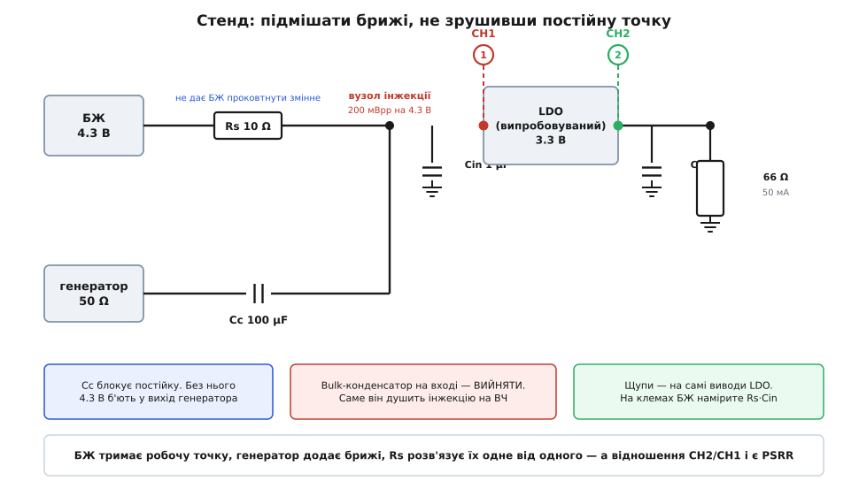
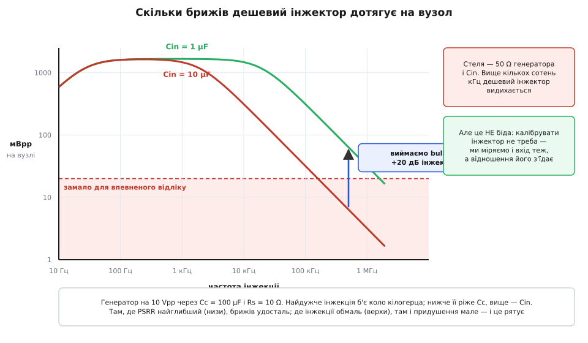
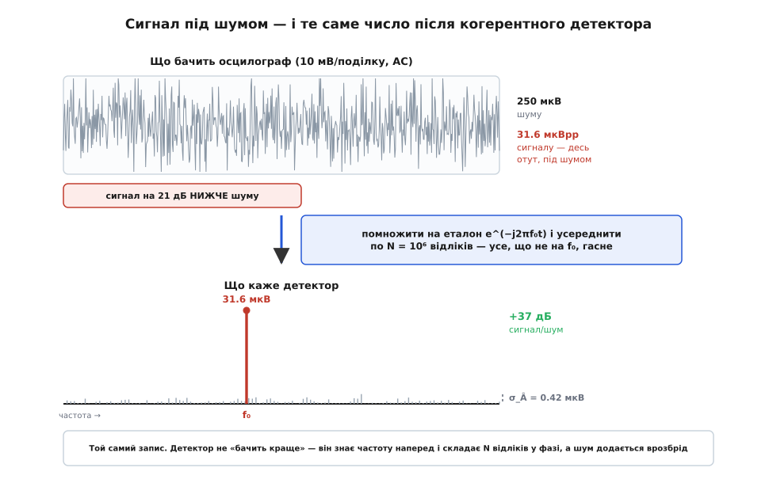

# ⚙️ Стенд для PSRR: підмішати брижі й порахувати відношення

<preknowlist>
- [LDO](topic:electronics/ldo) — лінійний стабілізатор: прохідний транзистор під наглядом петлі тримає вихід рівним; dropout — найменша різниця входу й виходу, за якої він ще регулює.
- [Потужність і децибели](topic:communications/power-decibels) — децибел як 20·log₁₀ від відношення напруг; 60 дБ = у 1000 разів.
- [Осцилограф](topic:electronics/oscilloscope) — вертикальна шкала В/поділку, AC-зв'язок, частота дискретизації, глибина пам'яті, захоплений запис.
- [ДПФ](topic:math/dft) — дискретне перетворення Фур'є як скалярний добуток запису з еталонною синусоїдою: скільки саме цієї частоти сидить у сигналі.
- [RC-фільтр](topic:electronics/rc-filter) — опір конденсатора спадає з частотою як 1/(2πfC); послідовний резистор із паралельним конденсатором ділять змінну напругу.
</preknowlist>

## Задача

У даташиті вже є крива PSRR — навіщо міряти самому? Бо надрукована крива знята **за їхніх умов**: їхній вихідний конденсатор, їхній струм навантаження, їхній запас між входом і виходом, їхня плата, а часто ще й конденсатор на виводі еталона, якого у вас нема. Придушення залежить від кожної з цих речей, і у вас відмінна щонайменше половина. Додайте до цього, що крива зазвичай уривається на мегагерці — рівно там, де починає шуміти ваш [перетворювач](topic:electronics/switching-converter), — і питання «що я насправді отримав на своїй платі» виявляється зовсім не тим питанням, на яке відповідає даташит.

Тож зберімо стенд. Треба: лабораторний блок живлення, генератор сигналів, двоканальний осцилограф, [електронне навантаження](topic:electronics/electronic-load) або просто резистор, і паяльник. Мета — крива PSRR від десятків герц до одиниць мегагерц для **вашого** LDO у **вашому** режимі.

## Ідея

PSRR — це відношення двох амплітуд на **одній і тій самій** частоті, зняте тоді, коли випробовуваний стабілізатор (англ. *device under test* — «пристрій під випробуванням», далі коротко DUT) сидить у своїй справжній робочій точці. Звідси три обов'язки стенда: утримати постійну точку, накласти на неї невелику змінну складову й точно зміряти дві амплітуди рівно на частоті інжекції.

І тут ховається послаблення, яке робить усю затію можливою вдома. **Інжектор не треба ні калібрувати, ні вирівнювати за частотою.** Ми міряємо не тільки вихід, а й вхід — а у відношенні все спільне скорочується. Хай генератор на одній частоті дає вдесятеро більше, ніж на іншій: обидва канали побачать це однаково, і в частці воно зникне. Від інжектора потрібно рівно три речі: дати **досить** амплітуди, не зрушити постійну точку й лишитися лінійним. Не «рівно», не «відомо скільки» — просто досить.

## Стенд: як накласти змінне на постійне

Конфлікт видно одразу. Блок живлення — це джерело напруги, і його робота в тому, щоб тримати свої вольти незалежно ні від чого; його вихідний опір — міліоми. Генератор має вихідний опір 50 Ω. З'єднайте їх в одному вузлі — і БЖ переможе з рахунком 10000:1: ваша синусоїда просто зникне в його низькому опорі.

Ліки — рознести їх опорами:

- **Послідовний резистор Rs** між БЖ і вузлом. Тепер БЖ сидить за десятьма омами й більше не може проковтнути змінне.
- **Розділовий конденсатор Cc** між генератором і вузлом. Він не пускає постійну напругу шини у вихід генератора. Без нього 4.3 В б'ють просто в 50-омний вихідний каскад — це 0.37 Вт і мертвий генератор.


*БЖ тримає робочу точку, генератор додає пульсацію, Rs розв'язує їх одне від одного. Відношення того, що бачать CH2 і CH1, і є PSRR.*

Числа для LDO на 3.3 В із струмом 50 мА:

```
Rs = 10 Ω, I = 50 мА
спад на Rs:   U = I·Rs = 0.05 · 10 = 0.5 В
напруга БЖ:   Uбж = Uвих + запас + I·Rs = 3.3 + 0.5 + 0.5 = 4.3 В
тепло на Rs:  P = I²·Rs = 0.05² · 10 = 0.025 Вт   (згодиться будь-який резистор)
```

Зверніть увагу на другий рядок: резистор інжектора **краде запас над dropout**, і БЖ доводиться піднімати рівно на вкрадене. Забудете — і зміряєте не PSRR свого LDO, а PSRR LDO, загнаного впритул до dropout. Це та сама пастка, що й у розрахунках на папері, тільки тут ви створюєте її власними руками.

Звідси й межа методу вгору за струмом: на 1 А ті самі 10 Ω з'їли б десять вольтів. Для сильнострумових DUT замість резистора ставлять дросель — його опір постійному струму майже нульовий, а змінному на високих частотах великий. Але дросель безпорадний на низах: сто мікрогенрі на 10 Гц — це шість міліомів, тобто знову коротке замикання для вашої інжекції. Резистор працює всюди, але коштує I·Rs; дросель дармовий, але лише вгорі. Для DUT на десятки міліампер беріть резистор і не думайте.

Розділовий конденсатор рахуємо з нижнього кінця розгортки:

```
|Z| = 1/(2π·f·Cc) = 1/(2π · 10 · 100·10⁻⁶) ≈ 159 Ω   на 10 Гц
```

Півтори сотні омів послідовно з 50-омним генератором — це послаблення, але не глухий мур. А оскільки ми міряємо вхід, послаблення нам байдуже: аби вистачило. Практично — 100 мкФ електроліта паралельно з 1 мкФ плівки (власна індуктивність електроліта вбиває його на високих частотах, плівка підхоплює). Полярність: бік вузла сидить на +4.3 В, бік генератора на нулі, тож «плюсом» до вузла, і напруга ніколи не перевертається.

### Головний убивця — вхідний bulk-конденсатор

Ось де більшість спроб тихо провалюється. Порахуймо, що бачить генератор у вузлі інжекції:

```
|Z| = 1/(2π·f·C)

Cin = 10 мкФ на 500 кГц:  1/(2π · 5·10⁵ · 10·10⁻⁶) = 0.032 Ω
Cin =  1 мкФ на 500 кГц:  1/(2π · 5·10⁵ ·  1·10⁻⁶) = 0.32 Ω
```

Тридцять два міліоми. Ваш генератор крізь свої 50 Ω силкується розгойдати вузол, який для нього — глухе коротке замикання; з десяти вольтів розмаху на вузол дійде близько шести мілівольтів. Вийміть із плати bulk-конденсатор на вході, лишіть тільки те, що даташит LDO вимагає для стійкості (звичайно 1 мкФ) — і та сама інжекція виросте вдесятеро.


*Найдужче інжекція б'є коло кілогерца: нижче її ріже розділовий конденсатор, вище — вхідний. Виймання bulk-конденсатора коштує двадцять децибелів інжекції на високих частотах.*

Крива має вигляд поразки, а насправді це успіх, і варто зрозуміти чому. На 1 МГц інжектор доносить лише 32 мВpp — та саме там PSRR становить двадцять із чимось децибелів, тож на виході буде 1…3 мВpp, які видно й неозброєним оком. А на 10 Гц, де PSRR сягає сімдесяти й кожен мікровольт на рахунку, інжектор кидає на вузол під шістсот мілівольтів — більше, ніж ви взагалі можете собі дозволити, бо стільки пульсації просто заб'є LDO в dropout. **Дешевий інжектор дужий рівно там, де придушення глибоке, і кволий рівно там, де воно мілке.** Дві криві хиляться в один бік, і саме це рятує затію.

### Чому не трансформатор

Знавцям [петльового підсилення](topic:electronics/loop-gain) кортить узяти інжекційний трансформатор — стандартний інструмент для зняття [АЧХ петлі](topic:electronics/bode-plot), чудово широкосмуговий. Тут він не годиться, і причина фізична: трансформатор не терпить постійного струму. За даними Picotest, навіть мізерні постійні струми — п'ять міліампер і менше — здатні різко зрізати сигнальну спроможність або й повністю загнати осердя в насичення. Ті самі властивості, що роблять його широкосмуговим, роблять його непридатним до шини, якою тече струм навантаження.

Саме тому існує окремий клас приладів: **лінійний інжектор** (Picotest J2120A — до 10 МГц за постійного струму до 5 А, з розмахом інжекції в межах приблизно 50…500 мВpp залежно від ємності й струму) і **модульований блок живлення** (Accel Instruments TS200) — по суті джерело постійної напруги з входом модуляції, тобто БЖ і генератор, сплавлені в один прилад. Драбина виходить така: Rs + Cc задарма (десятки міліампер, до кількох сотень кілогерц) → повторювач чи силовий буфер, щоб збити вихідний опір → готовий лінійний інжектор.

### Куди чіпляти щупи — це не дрібниця

Rs і Cin разом утворюють фільтр нижніх частот, який ви щойно власноруч поставили перед LDO:

```
f = 1/(2π·Rs·Cin) = 1/(2π · 10 · 1·10⁻⁶) ≈ 16 кГц
```

Тепер уявіть, що CH1 причеплено до клем БЖ. Ви б міряли придушення LDO **плюс** послаблення цього RC — і видавали суму за паспорт мікросхеми. На 500 кГц сама лише RC-ланка дає під тридцять децибелів: вийшла б розкішна, переконлива й цілком вигадана крива.

Тож CH1 — на вивід Vin самого LDO, CH2 — на вивід Vout. Тоді все, що вище за течією — БЖ, Rs, Cc, нерівність генератора, кабелі, — опиняється **поза** вимірюванням і зіпсувати його не може. Це той самий принцип, що й з калібруванням інжектора: відношення з'їдає спільне. Обидва земляні кінці — на вивід землі LDO, а не куди дотягнеться: дві різні землі означають, що різниця між ними додасться до вашого числа ([про земляний вусик щупа](topic:electronics/measurement-errors/comp-probe-ground.md)).

## Перешкода: осцилограф не бачить того, що треба зміряти

Тепер порахуймо, у що ми вплуталися.

```
інжекція на вході:  200 мВpp
PSRR:               70 дБ  →  k = 10^(70/20) ≈ 3162
на виході:          200 мВpp / 3162 ≈ 63 мкВpp
амплітуда:          63/2 ≈ 32 мкВ   →  RMS = 32/√2 ≈ 22 мкВ
шум осцилографа:    ≈ 250 мкВ RMS (8 біт, найчутливіша шкала)
сигнал/шум:         20·log₁₀(22/250) ≈ −21 дБ
```

Те, що треба зміряти, лежить на двадцять один децибел **нижче** за власний шум приладу, яким його міряють. Меню Measure → Vpp бадьоро покаже число — це буде число шуму. Дванадцятибітний осцилограф зі своїми ~50 мкВ RMS відсуває стелю, але не прибирає стіну.

Усереднення на осцилографі — уже не пусте: якщо запускати розгортку від CH1, тобто від самої інжекції, то усереднення **когерентне**, і шум спадає як √M. Але 256 усереднень — це лише 24 дБ, з −21 дБ вони виводять на жалюгідні +3 дБ. Причина слабкості проста: осцилограф усереднює по **запусках**, яких у нього сотні. А в одному-єдиному глибокому записі лежить **мільйон відліків** — і саме їх треба скласти.

## Ідея коду: софтовий локін

Ми знаємо f₀ точно — самі її й задали. Тож не питаймо «який тут розмах?»: у цього питання нема жодного захисту від шуму. Спитаймо інакше: **«скільки в цьому записі саме оцієї синусоїди?»**

Помножмо запис на еталон e^(−j2πf₀t) і усереднімо. Складова на f₀ від множення застигає й переживає усереднення. Усе інше — гул мережі, гармоніки генератора, дрібне сміття самого осцилографа — далі крутиться й у сумі гаситься само собою.

```
 = (2/Σw) · Σ v[n] · w[n] · e^(−j2πf₀·n·dt)
```

Це одна-єдина комірка ДПФ, узята рівно на частоті інжекції (а не в центрі найближчого біна). У залізі такий прилад зветься [локін-підсилювачем](topic:electronics/lock-in-amplifier); у коді це чотири рядки. А коли ту саму суму треба рахувати на мікроконтролері в реальному часі, у неї є рекурсивна форма — [алгоритм Гертцеля](topic:algorithms/goertzel) (Джеральд Гертцель, американський фізик-теоретик, опублікував її 1958 року в *American Mathematical Monthly*, працюючи тоді в Nuclear Development Corporation of America).

Скільки це дає — рахується точно:

```
σ_Â = √3 · σ / √N     (вікно Ханна)
σ_Â = √2 · σ / √N     (без вікна)

σ = 250 мкВ, N = 2²⁰ ≈ 1.05·10⁶
σ_Â = √3 · 250·10⁻⁶ / 1024 ≈ 0.42 мкВ

сигнал 32 мкВ  →  похибка 0.42/32 ≈ 1.3 % ≈ 0.12 дБ
```

Від «на 21 дБ під шумом» до «з точністю 1.3 %». Виграш — п'ятдесят вісім децибелів, і коштує він самої лише арифметики.


*Той самий запис. Детектор не «бачить краще» — він знає частоту наперед і складає мільйон відліків у фазі, тоді як шум додається врозбрід.*

Вікно потрібне ось для чого: якщо в запис не вклалося ціле число періодів, його краї — то стрибок, а стрибок розмазує енергію по всіх частотах ([витік](topic:math/windowing-leakage)). Вікно Ханна плавно вводить і виводить запис, і стрибка нема. Коштує це √1.5 ≈ 1.76 дБ шуму — дешева ціна, тим паче що вкласти розгортку осцилографа в ціле число періодів однаково не вийде.

**Дві речі скорочуються задарма, і це важить більше, ніж здається.** Обидва канали множаться на те саме вікно з тим самим нормуванням — тож коефіцієнт вікна у відношенні зникає. Обидва канали проходять крізь однаковий AC-зв'язок осцилографа (завал коло 10 Гц на вході 1 МΩ) — його просідання на нижній декаді теж скорочується. Обидва канали живуть в одному захопленні — та сама частота дискретизації, той самий згладжувальний фільтр. Усе спільне ділиться навзаєм. Не скорочується лише те, що **різне**: послаблення двох щупів і похибка підсилення двох каналів. Заради них і роблять наскрізне калібрування.

**Вісім бітів — не стіна.** На шкалі 10 мВ/поділку весь екран — це 80 мВ, а на 256 рівнів виходить 0.31 мВ на сходинку: уп'ятеро більше за ввесь розмах сигналу. Звучить як вирок, але ні. Власний аналоговий шум осцилографа — ті самі 250 мкВ, тобто близько 0.8 сходинки, — **розтрушує** квантувач. Кожен окремий відлік — сміття, але сміття незміщене, і середнє з мільйона таких відліків відновлює величину далеко глибше за одну сходинку. Якби вхідний тракт був ідеально тихий, сигнал зник би під сходинкою назавжди і жодне усереднення його б не витягло. Шум, з яким ви воюєте, — це той самий шум, який робить вимірювання можливим.

Ще один подарунок: власний шум самого LDO (ті мікровольти, якими хизуються малошумні моделі) у запис теж потрапляє — але він **широкосмуговий**, а не на f₀, тож детектор його викидає разом з усім іншим.

## Код

Далі — робочий скрипт; блоки склеюються в один файл у порядку викладу. Прилади — генератор Keysight 33500B і осцилограф Keysight InfiniiVision серії DSOX; для іншого вендора міняються тільки рядки SCPI, логіка та сама. Потрібні `pyvisa` й `numpy`.

Серце — детектор. Заразом і оцінка шумової підлоги: та сама операція на сусідніх частотах, де сигналу свідомо нема (зсуви взято не кратними до f₀, щоб не влучити в гармоніку чи субгармоніку, а медіана боронить від того, що найближчі точки трохи підсвічує сам сигнал).

```python
# -*- coding: utf-8 -*-
"""Розгортка PSRR: генератор жене синусоїду по частотах, осцилограф ловить
вхід і вихід, когерентний детектор дістає амплітуди з-під шуму."""
import math
import time

import numpy as np
import pyvisa

VIN_TARGET_PP = 0.200        # цільова пульсація НА ВХОДІ LDO, Vpp
GEN_VPP_MAX = 10.0           # стеля генератора
F_START, F_STOP, PER_DEC = 10.0, 2e6, 10
MARGIN_MIN = 12.0            # менший запас над шумом → числу не віримо


def amp_at(v, dt, f0, window=True):
    """Комплексна амплітуда синусоїди частоти f0 у записі v із кроком dt.
    |Â| — амплітуда (не розмах), arg  — фаза."""
    n = len(v)
    t = np.arange(n) * dt
    w = np.hanning(n) if window else np.ones(n)
    return 2.0 * np.sum(v * w * np.exp(-2j * math.pi * f0 * t)) / np.sum(w)


def floor_at(v, dt, f0):
    """Шумова підлога: та сама оцінка на сусідніх частотах, де сигналу нема."""
    offs = (0.15, 0.21, 0.29, 0.37, 0.43)
    e = [abs(amp_at(v, dt, f0 * (1 + s * k))) for k in offs for s in (-1, 1)]
    return float(np.median(e))
```

Драйвери приладів. Тут майже кожен рядок — це рішення, а не формальність: щуп 1:1 замість 10:1 дає вдесятеро більший сигнал (смуга такого щупа мала, але нам вище за пару мегагерц і не треба); AC-зв'язок обов'язковий, бо інакше 3.3 В постійки з'їдять усю шкалу; обмеження смуги на 20 МГц зрізає шум, якого ми однаково не міряємо; режим HRES усереднює в залізі й заразом не дає широкосмуговому шуму згорнутися в нашу смугу на низьких частотах, коли осцилограф сам знижує частоту дискретизації ([аліасинг](topic:math/aliasing)).

```python
class Awg:
    """Генератор синусоїди."""

    def __init__(self, dev):
        self.d = dev
        self.d.write("OUTP1 OFF")
        self.d.write("SOUR1:FUNC SIN")
        self.d.write("SOUR1:VOLT:OFFS 0")
        self.d.write("OUTP1:LOAD 50")

    def set(self, freq, vpp):
        self.d.write("SOUR1:FREQ %.6f" % freq)
        self.d.write("SOUR1:VOLT %.4f" % min(vpp, GEN_VPP_MAX))
        self.d.write("OUTP1 ON")

    def off(self):
        self.d.write("OUTP1 OFF")


class Scope:
    """Двоканальний осцилограф: захопити пару записів."""

    def __init__(self, dev):
        self.d = dev
        self.d.timeout = 30000
        for ch in (1, 2):
            self.d.write(":CHAN%d:DISP ON" % ch)
            self.d.write(":CHAN%d:PROB 1" % ch)      # щуп 1:1 — удесятеро більше сигналу
            self.d.write(":CHAN%d:IMP ONEM" % ch)
            self.d.write(":CHAN%d:COUP AC" % ch)     # інакше 3.3 В з'їдять шкалу
            self.d.write(":CHAN%d:BWL ON" % ch)      # 20 МГц — геть зайвий шум
            self.d.write(":CHAN%d:OFFS 0" % ch)
        self.d.write(":ACQ:TYPE HRES")               # згладжування в залізі + антиаліас
        self.d.write(":TRIG:SOUR CHAN1")
        self.d.write(":TRIG:LEV 0")

    def set_scale(self, ch, volts_pp):
        """Вертикальна шкала: 6 поділок під розмах, у межах приладу."""
        s = min(max(volts_pp / 6.0, 1e-3), 5.0)
        self.d.write(":CHAN%d:SCAL %.6f" % (ch, s))

    def capture(self, f0, cycles):
        self.d.write(":TIM:SCAL %.9f" % (cycles / f0 / 10.0))   # 10 поділок на екран
        self.d.write(":TIM:POS 0")
        self.d.write(":DIG CHAN1,CHAN2")             # блокує, поки не набере
        return self._read(1), self._read(2)

    def _read(self, ch):
        self.d.write(":WAV:SOUR CHAN%d" % ch)
        self.d.write(":WAV:FORM BYTE")
        self.d.write(":WAV:POIN:MODE RAW")
        self.d.write(":WAV:POIN MAX")
        pre = [float(x) for x in self.d.query(":WAV:PRE?").split(",")]
        xinc, yinc, yorg, yref = pre[4], pre[7], pre[8], pre[9]
        raw = self.d.query_binary_values(":WAV:DATA?", datatype="B", container=np.array)
        clipped = bool((raw <= 1).any() or (raw >= 254).any())
        return (raw - yref) * yinc + yorg, xinc, clipped
```

Одна точка. Тут два зустрічні регулятори: інжекцію підганяємо так, щоб на **вході LDO** вийшло близько цільових 200 мВpp (бо самому генератору, як ми бачили, до вузла доходить від сотих часток до шостої частини — залежно від частоти), а вертикальну шкалу CH2 підганяємо під вихідну пульсацію, здогад про яку беремо з попередньої точки: крива неперервна, тож сусід — добрий провидець. Кількість періодів росте з частотою: на низах довгий запис коштує секунди, на верхах він задарма.

```python
def measure_point(awg, scope, f0, state):
    """Один вимір: підігнати інжекцію й шкалу, захопити, повернути PSRR."""
    cycles = min(max(f0 * 0.02, 20), 2000)
    gen, out_pp, got = state["vpp"], state["out_pp"], None

    for _ in range(6):
        awg.set(f0, gen)
        scope.set_scale(1, max(VIN_TARGET_PP, 0.02))
        scope.set_scale(2, out_pp)
        time.sleep(0.15)                             # інжектор має устоятися
        (v1, dt, clip1), (v2, _, clip2) = scope.capture(f0, cycles)

        if clip2:                                    # вихідна шкала завузька
            out_pp *= 4
            continue
        if clip1:                                    # інжекція зашкалює вхідний канал
            gen *= 0.5
            continue

        a_in = abs(amp_at(v1, dt, f0))
        a_out = abs(amp_at(v2, dt, f0))
        got = (v2, dt, a_in, a_out)
        out_pp = max(4 * a_out, 6e-3)                # запас: синус плюс шум

        in_pp = 2 * a_in
        if 0.7 * VIN_TARGET_PP <= in_pp <= 1.4 * VIN_TARGET_PP or gen >= GEN_VPP_MAX:
            break
        gen = min(gen * VIN_TARGET_PP / max(in_pp, 1e-9), GEN_VPP_MAX)

    if got is None:
        raise RuntimeError("f=%.0f Гц: не вдалося зняти чистий запис" % f0)

    v2, dt, a_in, a_out = got
    noise = floor_at(v2, dt, f0)
    state["vpp"], state["out_pp"] = gen, out_pp
    return {
        "f": f0,
        "psrr": 20 * math.log10(a_in / a_out),
        "in_pp": 2 * a_in,
        "out_pp": 2 * a_out,
        "margin": 20 * math.log10(a_out / noise),    # наскільки вихід вищий за шум
        "ceiling": 20 * math.log10(a_in / noise),    # найглибше, що стенд узагалі покаже
        "n": len(v2),
    }
```

Розгортка й наскрізне калібрування. Зверніть увагу, що `thru()` не має власного коду вимірювання — це той самий `measure_point`, лише щупи стоять поруч на одному вузлі.

```python
def sweep(awg, scope):
    n = int(round(math.log10(F_STOP / F_START) * PER_DEC))
    state = {"vpp": 0.05, "out_pp": 0.2}
    rows = []
    for i in range(n + 1):
        r = measure_point(awg, scope, F_START * 10 ** (i / PER_DEC), state)
        solid = r["margin"] > MARGIN_MIN
        print("%9.1f Гц  PSRR %6.2f дБ%s  вх %6.1f мВpp  вих %8.3f мВpp  "
              "запас %5.1f дБ  N=%d"
              % (r["f"], r["psrr"], " " if solid else " ‼", r["in_pp"] * 1e3,
                 r["out_pp"] * 1e3, r["margin"], r["n"]))
        if not solid:
            print("            ↑ вихід тоне в шумі — це стеля стенда, а не PSRR: "
                  "чесно казати «глибше за %.1f дБ»" % r["ceiling"])
        rows.append(r)
    return rows


def thru(awg, scope, freqs=(100.0, 1e4, 1e6)):
    """Обидва щупи на ОДИН вузол. Має вийти 0 дБ; що вийшло — то розбіг каналів."""
    state = {"vpp": 0.5, "out_pp": 0.3}
    for f0 in freqs:
        r = measure_point(awg, scope, f0, state)
        print("%9.0f Гц: розбіг каналів %+.2f дБ" % (f0, r["psrr"]))


def main():
    rm = pyvisa.ResourceManager()
    awg = Awg(rm.open_resource("USB0::0x0957::0x2C07::MY52815943::INSTR"))
    scope = Scope(rm.open_resource("USB0::0x2A8D::0x1797::CN59356102::INSTR"))
    try:
        rows = sweep(awg, scope)
    finally:
        awg.off()                                    # не лишати брижі на шині
    with open("psrr.csv", "w", encoding="utf-8") as fh:
        fh.write("f_Hz,psrr_dB,vin_pp_V,vout_pp_V,margin_dB\n")
        for r in rows:
            fh.write("%.3f,%.3f,%.6f,%.9f,%.2f\n"
                     % (r["f"], r["psrr"], r["in_pp"], r["out_pp"], r["margin"]))


if __name__ == "__main__":
    main()
```

## Перевірки, без яких числу вірити не можна

Стенд, який ніхто не перевірив, видає красиві числа з тією самою готовністю, що й правильний. Чотири проби, кожна за хвилину:

**Наскрізна.** Обидва щупи — на **один** вузол, вузол інжекції. Має вийти 0 дБ. Що вийшло насправді — то розбіг ваших каналів і щупів; віднімайте його від результату. Півдецибела тут — норма, два децибели означають, що щупи різні або один не скомпенсований.

**Дротом замість LDO.** Замкніть вхід на вихід перемичкою. Знову має вийти 0 дБ — тепер уже через увесь тракт, разом із розводкою й землями. Якщо наскрізна дала нуль, а дріт — ні, ви ловите щось землями.

**Підлога.** Вимкніть інжекцію й зніміть точку. Те, що лишилося на f₀, — ваша межа. Якщо на якійсь частоті вимірювання підійшло до підлоги ближче ніж на десяток децибелів, число там — не PSRR стабілізатора, а PSRR вашого стенда.

**Лінійність.** Удвічі зменшіть інжекцію. PSRR не має зрушити. Зрушив — ви вибили LDO з лінійного режиму й міряєте вже не те.

## Складність і пастки

Арифметики тут нема на що дивитися: розгортка лінійна за числом точок, а ДПФ мільйона відліків numpy робить за тридцять мілісекунд. Час з'їдає **перекачування** — той самий мільйон байтів на канал повзе по USB близько секунди. Півсотні точок по дві спроби — три-п'ять хвилин, і якщо колись схочете пришвидшити, пришвидшуйте передачу (LAN замість USB), а не математику.

Пастки натомість коштовні.

**Інжекція з'їдає запас над dropout.** 200 мВpp — це ±100 мВ навколо робочої точки. Із запасом 0.5 В усе гаразд, але якщо ви міряєте на запасі 0.3 В, то западини лишають 0.2 В, і LDO вивалюється з регуляції щоперіоду. Ви зміряєте зрізану нелінійну кашу й отримаєте **песимістичний** PSRR, який до малосигнального придушення не має стосунку. Правило: амплітуда інжекції набагато менша за запас; проба — та сама лінійність.

**Легке навантаження й економний режим.** Багато LDO на малому струмі перемикаються в режим малого власного споживання, де придушення — зовсім інший звір. Міряйте на **своєму** струмі: якщо схема бере 50 мА, не знімайте паспорт на одному міліампері.

**Сервопривід уперся в стелю, а ви не помітили.** На високих частотах генератор виходить на максимум, інжекція падає нижче цільової, і вимірювання далі «працює» — рівно доти, доки вихід не потоне в шумі. Для цього в результаті й живе поле `margin`. **Крива PSRR, яка вирівнюється в горизонтальну поличку вгорі графіка, — це майже завжди підлога стенда, а не стеля деталі.** Тим самим артефактом, до речі, хворіють і надруковані криві в даташитах: рівна поличка на 80 дБ частіше означає межу їхнього стенда, ніж чесно зміряне придушення.

**Розділовий конденсатор.** Полярність — плюсом до вузла. А якщо він колись пробився накоротко, шина жене свої вольти просто у вихід генератора. Кілька омів послідовно в генераторному дроті або запобіжник — дешева страховка.

**Забути вимкнути інжекцію.** Генератор лишився ввімкнений — і кожне наступне вимірювання на цій платі бреше. Тому `awg.off()` стоїть у `finally`.

**Нижня декада.** Завал AC-зв'язку коло 10 Гц у відношенні скорочується, але лише з точністю до розбігу двох розділових кіл — це кілька відсотків. Нижче двадцяти герц числа беріть як орієнтовні. І пам'ятайте, що AC-зв'язок є тільки на вході 1 МΩ: у режимі 50 Ω його не роблять, бо конденсатор довелося б брати на чотири порядки більший.

## Коли це вже не ваш інструмент

Чесна межа цього стенда — шістдесят-сімдесят децибелів упевнено, вісімдесят натужно. Далі починають правити бал розбіг каналів, наведення на щупи й власний шум DUT, і кожен наступний децибел коштує дедалі більше метушні. Приладова відповідь — аналізатор частотних характеристик із лінійним інжектором: та сама розгортка за півхвилини й зі ста з гаком децибелами динамічного діапазону, бо його приймач — вузькосмуговий стежний детектор у залізі, тобто те саме когерентне детектування, зроблене як належить.

Якщо ви знімаєте характеристики деталей щодня — купуйте прилад. Якщо треба один раз дізнатися, що насправді вміє ваша плата, то резистор, конденсатор і сотня рядків Python скажуть вам правду — і, на відміну від даташита, саме про ваш примірник, ваше навантаження й ваш запас.
