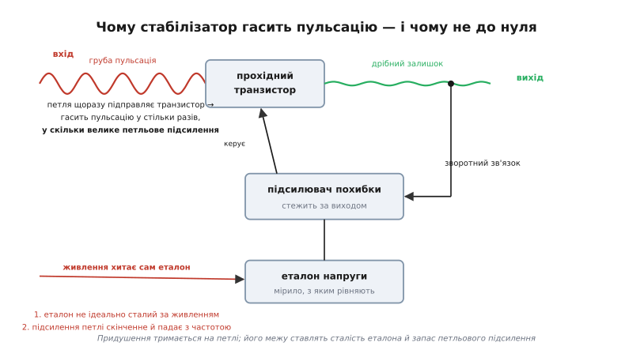
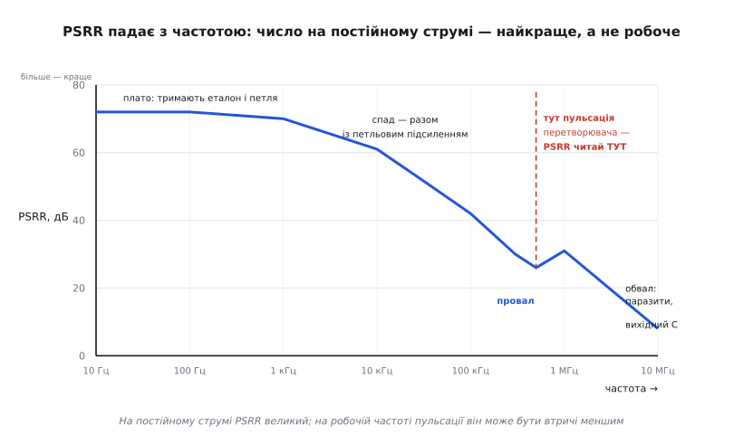
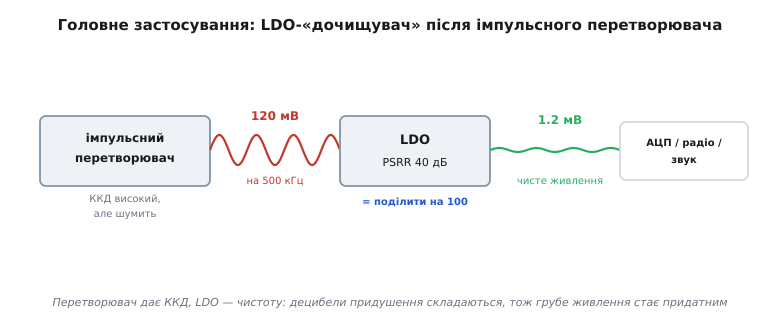

# PSRR — придушення пульсацій

<preknowlist>
- [LDO зсередини](book:electronics/ldo-internals) — стабілізатор тримає вихід рівним петлею: прохідний транзистор, підсилювач похибки, еталон напруги.
- [Підсилення в контурі](book:electronics/loop-gain) — петля гасить збурення у стільки разів, у скільки велике її підсилення; воно падає з частотою.
- [Потужність і децибели](book:communications/power-decibels) — децибел як 20·log₁₀ від відношення напруг; 60 дБ = у 1000 разів.
- [Імпульсний перетворювач](book:electronics/switching-converter) — звідки на шині береться пульсація: ключ рубає струм на частоті десятків-сотень кілогерц.
</preknowlist>

Живлення, з якого ви годуєте схему, ніколи не буває ідеально рівним. [Імпульсний перетворювач](book:electronics/switching-converter) рубає струм ключем сотні тисяч разів на секунду, і кожен удар лишає на шині брижі — пульсацію (англ. *ripple* — «брижі», дрібні хвилі на воді). Спільна шина тягне на собі перемикальний шум від цифри поруч. Батарея просідає під кидками струму. І ось ця нерівна напруга приходить на вхід стабілізатора, а з його виходу живиться щось чутливе: опорна напруга АЦП, гетеродин радіо, вхід звукового підсилювача. Якщо пульсація входу протече на вихід, шістнадцятибітне число АЦП затремтить у молодших розрядах, у спектрі радіо проступлять побічні складові на частоті перетворювача, а в навушниках почується його свист.

Тож потрібне одне число: **наскільки менше пульсації опиняється на виході, ніж було на вході?** Це число й називають PSRR (англ. *power supply rejection ratio* — «коефіцієнт придушення завад живлення»).

## Що це за число

PSRR — це просто відношення пульсації входу до пульсації виходу, записане в децибелах:

```
PSRR = 20 · log₁₀( Uвх_пульс / Uвих_пульс )   [дБ]
```

Чому в децибелах і чому «20·log» — бо це відношення двох **напруг**, а логарифмічна шкала стискає діапазон від одиниць до мільйона в зручні десятки. [Децибельна](book:communications/power-decibels) арифметика тут дає дуже наочне правило: кожні 20 дБ — це множення ще на десять. 20 дБ — гасіння вдесятеро, 40 дБ — у сто разів, 60 дБ — у тисячу. Що **більший** PSRR, то краще: тим глибше стабілізатор давить пульсацію.

**LDO обіцяє в даташиті 60 дБ — що це в мілівольтах.** Нехай на вході 100 мВ пульсації від перетворювача.

```
гасіння в разах:     k = 10^(PSRR/20) = 10^(60/20) = 10³ = 1000
залишок на виході:   Uвих_пульс = Uвх_пульс / k = 100 мВ / 1000 = 0.1 мВ
```

Сто мілівольт бруду перетворюються на десяту частку мілівольта — цього вже не помітить більшість схем. Ось що ховається за сухим «60 дБ»: тисячократне гасіння. Але це число — лише за ідеальних умов, і за мить стане ясно, чому на практиці воно так легко тане.

## Чому стабілізатор узагалі гасить пульсацію

Придушення береться не з чарів, а прямо з тієї ж [петлі зворотного зв'язку](book:electronics/ldo-internals), якою стабілізатор тримає вихід рівним. Усередині сидить прохідний транзистор — керований опір, увімкнений послідовно з навантаженням, — а поряд [підсилювач похибки](book:electronics/error-amplifier), що весь час звіряє вихід із внутрішнім еталоном. Коли пульсація входу штовхає вихід угору, підсилювач це бачить і трохи прикриває транзистор; коли штовхає вниз — прочиняє. Петля щомиті гасить те, що входить, підправляючи опір транзистора у протифазу до збурення.

Наскільки сильно гасить — задає [підсилення в контурі](book:electronics/loop-gain) (англ. *loop gain*). Це коефіцієнт, на який петля множить будь-яке помічене відхилення, аби вигнати його назад. Груба, але правильна суть: **пульсація давиться приблизно у стільки разів, у скільки велике петльове підсилення на її частоті.** Велика петля — глибокий PSRR.


*Петля стежить за виходом і підправляє прохідний транзистор у протифазу до пульсації входу — тому вона гасне. Глибину гасіння задає петльове підсилення. Два червоні шляхи — чому воно не безмежне.*

> 🔧 **Навіщо це.** PSRR — не окрема «фіча» чипа, а прямий наслідок того самого механізму, що робить стабілізатор стабілізатором. Тому щойно ви бачите в даташиті велике петльове підсилення на низьких частотах, ви вже знаєте: там і PSRR буде глибоким. І навпаки — усе, що вбиває петльове підсилення (мала смуга, близькість до dropout), одразу вбиває й придушення.

## Чому воно не безмежне

Якби петля була ідеальна, вона гасила б пульсацію до нуля. Не гасить — і причин дві, обидві принципові.

Перша: **еталон сам не абсолютно сталий за живленням.** Внутрішнє джерело опорної напруги живиться від того ж входу, тож дещиця вхідної пульсації просочується прямо в еталон. А еталон — це мірило, з яким петля рівняє вихід; якщо здригнувся він, петля слухняно повторить це здригання на виході, бо для неї воно тепер «правильне». Глибше за власну сталість еталона стабілізатор придушити не здатен — це підлога, нижче якої петля не опуститься. Саме тому в кращих LDO виводять окремий вивід NR/BYP (англ. *noise reduction / bypass*): почепив на нього конденсатор — і разом із внутрішнім опором він утворює фільтр, що згладжує пульсацію на вході самого [еталона](book:electronics/voltage-reference), відсуваючи цю підлогу далеко вниз.

Друга: **петльове підсилення скінченне й падає з частотою.** На постійному струмі його багато — сотні тисяч разів, — тож і PSRR там найглибший. Але з ростом частоти підсилення підсилювача похибки неминуче спадає (інакше петля втратила б стійкість), а разом із ним слабшає й придушення. Тому PSRR — не одне число, а **крива вздовж частоти.**

## Головна пастка: число на постійному струмі — не робоче число

Ось де гине більшість наївних розрахунків. Даташит гордо друкує «PSRR = 70 дБ», інженер множить пульсацію на цю тисячу з гаком — і дивується, чому на осцилографі бруду вдесятеро більше, ніж мало бути. Причина проста: **70 дБ — це на низькій частоті, а пульсація перетворювача сидить на сотнях кілогерц, де від тих 70 дБ лишилася третина.**


*Придушення тримається високо, поки велике петльове підсилення, і спадає слідом за ним. Читати PSRR треба не на постійному струмі, а на тій частоті, де реально сидить ваша пульсація.*

Форма кривої йде прямо з механізму. На низьких частотах — плато: петля потужна, еталон тримає, придушення впирається в свою підлогу. Далі підсилення петлі спадає — і PSRR спадає разом із ним, децибел у децибел. У середині смуги часто зяє **провал** — там петля вже майже не допомагає, а вихідний конденсатор ще не почав шунтувати пульсацію; це найгірша точка, і лихо, коли частота перетворювача попадає рівно в неї. На високих частотах криву вже тримає не петля, а [вихідний конденсатор](book:electronics/converter-caps) із власними паразитами й розводка плати. Те, як саме складаються всі ці внески в єдину криву, розписано в [окремому виведенні PSRR через петльове підсилення](book:electronics/psrr/math-psrr-loop-gain.md).

**Той самий LDO, але на частоті перетворювача.** На постійному струмі даташит обіцяв 70 дБ; на 500 кГц крива показує лише 26 дБ.

```
на постійному струмі:  k = 10^(70/20) ≈ 3160   →  100 мВ / 3160 ≈ 0.03 мВ  (обіцянка)
на 500 кГц:            k = 10^(26/20) ≈ 20      →  100 мВ /   20  =  5 мВ    (дійсність)
```

П'ять мілівольт замість трьох сотих — гірше у півтори сотні разів. Число з таблички не збрехало, воно просто стосувалося іншої частоти. **Завжди читайте PSRR на тій частоті, де реально сидить ваша пульсація**, а не найбільше число з рядка «typical».

> 🔧 **Навіщо це.** Практичне правило: знайдіть частоту пульсації (для перетворювача — його робоча частота, дивіться в його ж даташиті чи на осцилографі), проведіть на графіку PSRR вертикаль у цій точці й лише звідти знімайте децибели. Планувати чистоту живлення за низькочастотним PSRR — найпоширеніша причина, чому «за розрахунком мало вистачити», а на столі свистить.

## Друга пастка: біля dropout придушення просто зникає

Є режим, у якому навіть чудовий LDO перестає придушувати геть — коли ви заганяєте його майже в dropout, тобто лишаєте замало запасу між входом і виходом. Щоб керувати виходом, прохідний транзистор мусить мати «куди рухатися»: петля прочиняє й прикриває його навколо якоїсь робочої точки. Та коли запас входу тане, транзистор відкривається чимдалі повніше, аж поки не впреться у власний повністю відкритий стан — а звідти прочиняти вже нíкуди. Керувати нíчим: транзистор перетворюється на простий шматок опору, і пульсація входу тече крізь нього на вихід майже один-до-одного.

**Скільки треба лишати.** Практичне правило: тримайте запас не просто над dropout, а з добрим гаком — приблизно на 0.3…0.5 В вище, а для збереження високочастотного PSRR і того більше.

```
хай dropout LDO:       Uдроп = 0.2 В при робочому струмі
мінімум для регуляції: Uвх − Uвих ≥ 0.2 В      (інакше вихід просто «попливе»)
щоб тримати PSRR:      Uвх − Uвих ≳ 0.5…0.6 В   (з гаком над dropout)
близько до dropout:    Uвх − Uвих ≈ 0.2 В  →  PSRR обвалюється до одиниць дБ
```

Тобто LDO, який у паспорті мав 70 дБ, за нестачі запасу перетворюється майже на дріт: 100 мВ входу дадуть майже 100 мВ виходу. Причому високочастотне придушення осідає **першим**, задовго до того, як зникне сама регуляція напруги. Живлячи LDO від майже розрядженої батареї чи від «утиснутого» перетворювача, легко отримати номінально правильну напругу — і повний брак фільтрації.

## Як цим користуються: дочищувач після перетворювача

Найпоширеніше застосування PSRR виростає з очевидного конфлікту. [Імпульсний перетворювач](book:electronics/switching-converter) дає високий ККД — 85…95 %, — але за це шумить: на його виході завжди сидить пульсація на робочій частоті. [Лінійний стабілізатор](book:electronics/ldo) навпаки — тихий і чистий, але спалює всю зайву напругу теплом. Поєднати сильні боки обох просто: **перетворювач тягне основну потужність, а слідом за ним LDO дочищає його вихід.** Такий LDO називають пост-регулятором (англ. *post-regulator*) або дочищувачем.


*Перетворювач дає ККД, LDO — чистоту. Оскільки LDO працює за малої різниці напруг, він майже не гріється, а його PSRR збиває пульсацію перетворювача до придатного рівня.*

Тут добре видно, чому децибели зручні: **придушення каскаду складається в децибелах.** Поставили перед LDO ще й невеликий [RC- чи LC-фільтр](book:electronics/rc-filter) — його придушення в децибелах просто додається до PSRR стабілізатора.

**Скласти децибели: перетворювач + фільтр + LDO.** Перетворювач дає 120 мВ на 500 кГц, а АЦП вимагає під 1 мВ. Самого LDO з 26 дБ на цій частоті замало (120/20 = 6 мВ). Додаймо простенький RC-фільтр із 20 дБ на 500 кГц:

```
RC-фільтр:        20 дБ
LDO на 500 кГц:   26 дБ
разом:            20 + 26 = 46 дБ

k = 10^(46/20) ≈ 200
Uвих_пульс = 120 мВ / 200 = 0.6 мВ   →  вкладаємось під 1 мВ
```

Двадцять дешевих децибелів від резистора з конденсатором дотягнули каскад туди, куди сам LDO не діставав. Так само працює ферит-намистина на вході чи згаданий конденсатор на виводі еталона: кожен додає свої децибели в потрібному діапазоні. Головне — стежити, **на якій частоті** кожна ланка дає свій внесок, бо RC давить високі частоти, а конденсатор на еталоні — низькі.

> 🔧 **Навіщо це.** Схема «перетворювач + LDO-дочищувач» — стандартний спосіб нагодувати чутливу аналогову частину (АЦП, ЦАП, гетеродин, звук) від того ж брудного живлення, що й цифру. LDO тут ставлять на **малу** різницю напруг (скажімо, 3.5 В → 3.3 В): тепла майже нема, ККД високий, а PSRR збиває пульсацію перетворювача. Але тільки якщо ви лишили LDO запас над dropout — інакше дочищувач стає прозорим і сенс каскаду зникає.

## Як його зміряти

PSRR не читають омметром — його **міряють**: підмішують невелику синусоїду відомої амплітуди на вхідну шину, знімають осцилографом амплітуду пульсації до й після стабілізатора й беруть їхнє відношення в децибелах. Аби дістати всю криву, синусоїду женуть по частотах — від десятків герц до одиниць мегагерц. Хитрість — акуратно накласти змінний сигнал на постійну напругу живлення, не просадивши її; практичне складання такого стенда, схему підмішування й скрипт, що рахує PSRR із захопленої пари сигналів, зібрано в [окремому розборі вимірювання PSRR](book:electronics/psrr/proj-psrr-measure.md).

## Головне

PSRR каже одне: у скільки разів менше пульсації живлення опиняється на виході стабілізатора, ніж було на вході, і рахується це як 20·log₁₀ від відношення напруг, тож кожні 20 дБ — ще десяток гасіння. Береться воно з петлі зворотного зв'язку — придушення приблизно дорівнює петльовому підсиленню, — а обмежують його дві речі: власна сталість еталона (підлога на низьких частотах) і спад петльового підсилення з частотою (тому PSRR — крива, а не число). Звідси два практичні застереження, на яких сходить нанівець більшість розрахунків: читайте PSRR **на частоті вашої пульсації**, а не найбільше число з даташита, і лишайте стабілізатору **запас над dropout**, бо впритул до нього придушення обвалюється до одиниць децибелів. А коли треба нагодувати чутливу схему від шумного перетворювача — ставте LDO дочищувачем на малу різницю напруг: децибели придушення каскаду складаються, тож грубе, але ефективне імпульсне живлення стає чистим.
