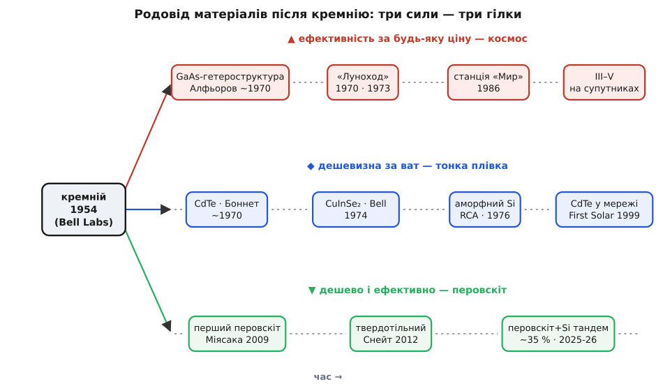
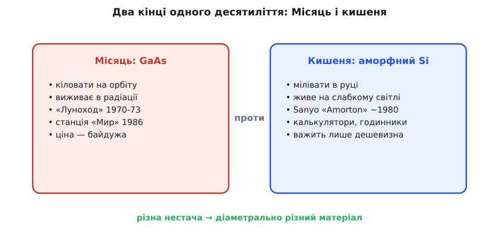

# 📜 Матеріальний «зоопарк»: що штовхало фотоелемент після кремнію

Коли 1954 року в Bell Labs показали кремнієвий елемент, історія могла б на цьому й скінчитися. Кремній лежить майже в оптимумі забороненої зони, його вдосталь у піску, він нетоксичний, служить десятиліттями, а промисловість навчилася очищати його бездоганно. Здавалося б — ось універсальна відповідь, навіщо шукати ще? Та за наступні сімдесят років навколо кремнію виріс цілий «зоопарк» несхожих матеріалів: коштовний арсенід галію на супутниках, дешева темна плівка на сонячних фермах, ледь помітна смужка в калькуляторі, ніжний перовскіт у лабораторних рекордах.

Пояснення просте, щойно поставити правильне питання. «Найкращого» фотоелемента взагалі не існує — є найкращий **для конкретної скрути**. Іноді бракує **площі** (супутник, дах), і тоді платять будь-які гроші за кожен відсоток ККД. Іноді площі вдосталь (велике поле), і важить лише **ціна за ват**. Іноді треба крихту енергії від кімнатної лампи, а не кіловати від сонця. Кожна нова родина матеріалів народилася як відповідь на **свою** нестачу — і саме тому їх стільки. Три сили, сплітаючись, і виростили цей родовід: гонитва за ефективністю там, де площа дорога; гонитва за дешевизною там, де площа дешева; і мрія дістати обидва разом. Пройдімо ці гілки по черзі — Беккереля, Фріттса й саму команду Bell тут проминаємо, їх розказує [окрема історія](book:electronics/photovoltaic-cell/hist-bell-solar.md), — і почнімо там, де кремнію стало **мало**.


*Від кремнієвого стовбура 1954 року відходять три гілки, і кожну гне своя сила. Угорі — гонитва за ефективністю будь-якою ціною (GaAs, III–V, космос). Посередині — гонитва за дешевизною за ват (аморфний кремній, CdTe, CIGS). Унизу — молода спроба поєднати дешевизну й ефективність (перовскіти та перовскіт-кремнієві тандеми). Дати — задокументовані «перші» кожної родини.*

### GaAs: коли ціна не має значення, а важить кожен відсоток

Перша сила, що відірвала фотоелектрику від кремнію, прийшла з неба — з **космічних перегонів** 1960–70-х. Супутник живиться лише сонцем, його не полагодиш і не заміниш, а на орбіті на нього ллється жорстке проміння радіаційних поясів. Тут кремній має дві вади. По-перше, під потоком протонів і електронів його ґратка поступово псується, дефекти ловлять носіїв, і елемент **деградує** швидше, ніж хотілося б для багаторічної місії. По-друге, кремній непрямозонний, тож пластина мусить бути товстою й важкою, а на орбіту кожен грам коштує шалено.

Матеріал, що обходить обидві вади, — **арсенід галію** (GaAs), сполука елементів III і V груп таблиці. Його заборонена зона (1.42 еВ) майже точно в оптимумі; він прямозонний, тож ловить світло тонким шаром; він краще за кремній тримає високу температуру й куди стійкіший до радіації. За все це доводиться платити буквально — рости бездефектні кристали GaAs дорого, і матеріал коштує в рази більше за кремній. Але в космосі гроші — не та валюта, якою міряють; там міряють ватами на кілограм і роками служби, і за цією міркою GaAs вигравав.

Ключ до **ефективного** GaAs-елемента знайшовся не в конструкції, а в тонкій фізиці — у **гетероструктурі**, стику двох різних напівпровідників, дібраних так, щоб один утримував світло й носіїв усередині іншого. Цю ідею довів до діла радянський фізик **Жорес Алфьоров** (*Zhores Alferov*; народився 1930 року у Вітебську, тепер Білорусь) у Фізико-технічному інституті імені Йоффе в Ленінграді; близько 1970 року його група показала GaAs-гетероструктурний сонячний елемент із небаченим для одного переходу ККД. За розробку напівпровідникових гетероструктур для оптоелектроніки Алфьоров дістав 2000 року Нобелівську премію з фізики (розділивши її). Це добре задокументована першість, і варто назвати автора точно: не «десь у СРСР винайшли», а конкретна школа Йоффе в Ленінграді на чолі з Алфьоровим.

Далі — космічна практика, і тут перевага GaAs видно наочно. Радянська програма першою вивела гетероструктурний GaAs на орбіту й далі: панелями з арсеніду галію живилися місяцеходи **«Луноход-1»** (1970) і **«Луноход-2»** (1973), а згодом станція **«Мир»** (1986) несла близько 10 кВт GaAs-елементів із питомою потужністю до ~180 Вт/м². Пригадаймо для контрасту: перший сонячний супутник, американський Vanguard I (1958), літав ще на **кремнії**. Тобто протягом одного покоління космічна енергетика перейшла з дешевого кремнію на дорогий, зате ефективніший і живучіший GaAs — саме тому, що в цій ніші перший важіль, ефективність-на-площу, переважив усе.

> 🔧 **Навіщо це.** Логіка «плачу будь-що за відсоток ККД» не лишилася в минулому — вона й породила найефективніші елементи взагалі. Саме на GaAs та споріднених III–V матеріалах будують [багатоперехідні (тандемні) елементи](book:electronics/tandem-multijunction), де кілька переходів із різними зонами складають стопкою, і кожен бере свою частину спектра. Так обходять [межу одного переходу](book:electronics/shockley-queisser-limit): сучасні супутники живляться III–V-«трипереходами» на ~30%, а лабораторні концентраторні беруть уже понад 47% — недосяжне для жодного одиночного матеріалу. Космос, де народився дорогий GaAs, і досі лишається його головним домом.

### Тонка плівка: коли важить не відсоток, а ціна за ват

Протилежна сила тягла в інший бік. На Землі, де площа під панелі часто дешева, головне питання не «скільки відсотків», а «скільки коштує ват». А в кремнієвому елементі найдорожче — сам товстий шматок надчистого кристала, який ще й треба вирізати з великого зливка. Звідси спокуса: якщо взяти **прямозонний** матеріал, що гасить світло в перших мікрометрах, вистачить плівки в сотню разів тоншої — менше матеріалу, дешевше виробництво, велика площа за малі гроші. Так народилися **тонкоплівкові** елементи, і одразу кількома незалежними стежками.

Перша стежка — **аморфний кремній** (a-Si), той самий кремній, але застиглий безладно, без кристалічної ґратки. Безлад робить його прямозонним на вигляд: він поглинає світло сильно й іде тонкою плівкою. Перший такий елемент показали 1976 року **Девід Карлсон** (*David Carlson*) і **Крістофер Вронскі** (*Christopher Wronski*) в лабораторіях RCA у Прінстоні — ККД був жалюгідні ~2.4%, зате плівку наносили дешево, з газового розряду в силані. У a-Si виявилася прикра вада: під сонцем він перші тижні **деградує**, аж поки не встоїться на нижчому ККД. Цей ефект світлового старіння так і назвали — **ефект Штеблера–Вронскі** (*Staebler–Wronski*, 1977), і, за іронією, ловив його той самий Вронскі, що елемент і зробив.

Низький ККД і старіння закрили a-Si дорогу у велику енергетику — зате відчинили несподівану, дуже близьку нам. Аморфний кремній чудово працює на **слабкому розсіяному світлі**, майже задарма коштує й іде плівкою будь-якої форми. Саме тому він знайшов свій перший масовий ринок там, де треба не кіловати, а **мілівати**: у **калькуляторах і годинниках** зламу 1970–80-х. Класичний приклад — тонісінькі калькулятори Sanyo з a-Si-елементами «Amorton» близько 1980 року, яким вистачало смужки під кімнатною лампою, щоб роками не міняти батарейку. Це був перший приклад «кишенькового» сонця, і живив його саме той матеріал, який для даху був би безнадійно кволий.

Друга стежка вела до великої енергетики — через **телурид кадмію** (CdTe). Його заборонена зона (~1.5 еВ) майже ідеальна, а плівку наносять швидко й дешево. Перший робочий тонкоплівковий CdTe-елемент зробив на зламі 1969–1972 років німець **Дітер Боннет** (*Dieter Bonnet*) — структуру CdS/CdTe довів приблизно до 6%. Та в промисловість CdTe вивела вже інша людина й інша логіка: американець **Гарольд Макмастер** (*Harold McMaster*), піонер загартовування скла, заснував 1990 року компанію Solar Cells Inc., спершу спробував аморфний кремній, а тоді переключився на CdTe. 1999 року фірму викупили й перейменували на **First Solar** — і саме вона зробила CdTe головним тонкоплівковим матеріалом **великої** енергетики, де на величезних фермах модулі чесно змагаються з кремнієм за ціною кіловат-години.

Третя стежка — **CIGS** (мідь-індій-галій-селенід), і цінна вона окремою рисою: заборонену зону тут можна **підстроювати** складом (приблизно від 1.0 до 1.7 еВ), а плівка добре лягає навіть на гнучку фольгу. Родовід і в неї строкатий. Перші елементи на спорідненому CuInSe₂ виростили ще 1974 року в Bell Labs (**С. Ваґнер**, **Дж. Л. Шей** і колеги, *S. Wagner, J. L. Shay*) — на монокристалі, ~12%. Тонкоплівковий варіант розвинула компанія Boeing близько 1981 року; перші комерційні CIGS-модулі продала Arco Solar 1988-го; а власне галій у сплав додали в NREL 1995 року, піднявши ККД до ~17%. Складність рівномірно нанести чотири елементи на великій площі довго не давала CIGS наздогнати кремній у масовому випуску — та на гнучкій основі, для рюкзака чи вигнутого даху, він лишається своїм.


*Одна й та сама фотоелектрика 1970-х розійшлася в протилежні боки під тиском протилежних сил. Ліворуч — GaAs на місяцеходах і станціях: кіловати, радіаційна стійкість, ціна не має значення. Праворуч — аморфний кремній у калькуляторах: мілівати від кімнатної лампи, а важить лише дешевизна. Той самий фотон — але діаметрально різні матеріали, бо різна нестача.*

### Перовскіти: спроба дістати і дешевизну, і ефективність

Дві сили — ефективність і ціна — довго тягли в різні боки: хочеш рекорд, готуй дорогий GaAs; хочеш дешево, миришся з кволою плівкою. Остання гілка родоводу — це спроба дістати **обидва** разом, і саме тому вона так збурила фотоелектрику.

Ідеться про **перовскіти** — клас кристалів із певною будовою ґратки, названий на честь мінералу, який 1839 року знайшов в уральських горах німець **Ґустав Розе** (*Gustav Rose*) і назвав на честь російського мінералога й вельможі Лева Перовського. Для фотоелемента вони мають рідкісний букет: заборонена зона підстроюється складом у широкій смузі (~1.2–2.3 еВ), матеріал прямозонний (тонка плівка), а найголовніше — його можна наносити **з розчину**, майже як друкувати, без дорогих кристалів і печей. Тобто в задумі — ефективність тонкої плівки без її дешевої кволості.

Першим перовскітний сонячний елемент показав 2009 року японець **Цутому Міясака** (*Tsutomu Miyasaka*) з колегами: метиламоній-свинцевий йодид як поглинач дав ~3.8%. Той перший елемент був іще напіврідкий — електроліт розчиняв ніжну ґратку за лічені хвилини, тож радше цікавинка, ніж прилад. Зрушив усе перехід до **твердотільного** елемента 2012 року — тут особливо відзначився британець **Генрі Снейт** (*Henry Snaith*) з Оксфорда, підняв ККД одразу за 10%. А далі почалося небачене: за якихось кілька років ефективність перовскітних елементів злетіла від одиниць до понад 25% — темпом, якого не знала жодна попередня технологія.

```
Стрибок ефективності перовскітів (сертифіковані віхи):
  2009  ~3.8 %   Міясака — перший елемент (напіврідкий)
  2012  ~10 %    Снейт — твердотільний
  ...            (за десятиліття — швидше за будь-яку іншу родину)
  нині  >25 %    одиночний перовскітний елемент
```

Та за карколомним злетом ховається вада, що досі тримає перовскіти переважно в лабораторії, — **стійкість**. Волога, тепло й ультрафіолет розкладають цю ніжну ґратку швидше, ніж служить кремній, а від панелі чекають двадцять-тридцять років. Плюс більшість рецептів містять **свинець**. Над обома бідами інтенсивно працюють, і найпереконливіший результат прийшов не від чистого перовскіту, а від **тандему з кремнієм**: тонкий перовскітний шар зверху забирає синє світло, кремній під ним — червоне й інфрачервоне, і разом вони [обходять кремнієву стелю](book:electronics/tandem-multijunction). Тут перовскіт грає не проти кремнію, а **разом** із ним, додаючи саме те синє, що товстий кремнієвий елемент марнує.

І цифри вражають. Там, де сам кремній застряг на ~27%, перовскіт-кремнієві тандеми пішли вгору стрімко: китайська LONGi показала 34.85% у квітні 2025 року, а вже в липні 2026-го — 35.5% (обидва рекорди підтвердили незалежні лабораторії). Британська Oxford PV тим часом почала відвантажувати перші комерційні тандемні панелі. Це наймолодша гілка родоводу — і, найпевніше, той напрям, звідки прийде наступний масовий тип, щойно приборкають стійкість.

### Три сили, що й далі гнуть родовід

Озирнімося на весь «зоопарк» — і побачимо, що безлад у ньому лише позірний. Кожну родину виштовхнула на світ **своя** нестача, і саме нестача, а не мода, пояснює, чому їх стільки.

```
Родина        Що гнало             Де перемогла
────────────  ───────────────────  ─────────────────────
GaAs / III–V   ефективність,        космос, супутники
               радіаційна стійкість (ціна не важить)
a-Si           гранична дешевизна   калькулятори, слабке
               й слабке світло      кімнатне світло
CdTe           дешева ціна за ват    великі сонячні ферми
CIGS           гнучкість, тюнінг    гнучкі й вигнуті основи
               зони
перовскіт-      дешево І ефективно   надія на наступний
кремній                             масовий тип
```

Причинний ланцюг щоразу той самий, лише нестача різна. Дорога площа й жорстке проміння → плати за ефективний і живучий GaAs. Дешева площа й тісний бюджет → мирися з кволішою, зате дешевою плівкою. Крихта світла в кишені → бери матеріал, якому й лампи досить. А коли з'явився шанс дістати дешевизну й ефективність воднораз — виросла перовскітна гілка, наймолодша й найгарячіша.

Варто вкласти в пам'ять і чесну рису цієї історії: майже кожен «перший» тут належить конкретній людині й конкретній школі — Алфьоров і Йоффе для гетероструктурного GaAs, Карлсон із Вронскі в RCA для аморфного кремнію, Боннет для CdTe, Ваґнер із Шеєм у Bell для CuInSe₂, Міясака й Снейт для перовскітів (кожного ми назвали з першоджерелом імені там, де він з'явився). Велику техніку й тут робили не самотні генії, а різні люди в різних країнах, кожен під тиском своєї задачі. І поки в світі є ніші, де по-різному дорогі площа, гроші та стійкість, родовід фотоелектричних матеріалів не завмре — він і далі гілкуватиметься туди, куди його гнутиме нестача.
