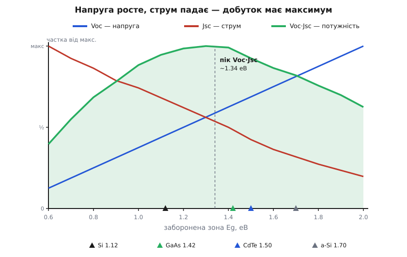
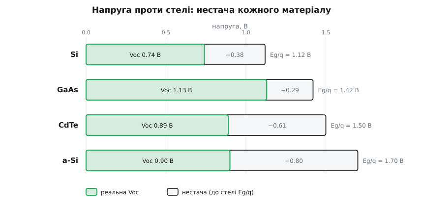

# 🧮 Компроміс матеріалу: зона ↔ напруга ↔ струм

Коли треба обрати напівпровідник для фотоелемента, здається, ніби вибираєш одразу три речі — яке світло елемент упіймає, скільки вольт видасть і скільки струму дасть. Насправді вибираєш **одне** число: ширину [забороненої зони](topic:physics/energy-bands) Eg. Решта — напруга й струм — не вільні, вони жорстко зчеплені з Eg, і зчеплені **в різні боки**. Підняв зону — напруга росте, струм падає. Опустив — навпаки. Корисне ж — це їхній добуток, потужність. Тож питання «який матеріал» зводиться до простої, але не очевидної математики: де добуток двох величин, що тягнуть у протилежні боки, найбільший. Порахуймо це руками — і стане видно, чому робочі матеріали тиснуться саме до смуги 1.0–1.7 еВ, а не будь-де.

Це кількісний бік компромісу; повне детально-балансове виведення абсолютної стелі одного переходу [розбирає окрема тема про межу Шоклі–Квайссера](topic:electronics/shockley-queisser-limit). Тут коротший шлях — не вивести стелю з першопринципів, а **порівняти матеріали** двома простими правилами: одне для струму, одне для напруги.

### Означення: три числа, зчеплені зоною

Про фотоелемент варто тримати в голові три параметри, і кожен має точний фізичний сенс.

**Струм короткого замикання** Jsc (*short-circuit current density*, на одиницю площі, мА/см²) — скільки струму елемент дає, коли його виводи замкнуті накоротко й уся народжена пара «носіїв» витікає у зовнішнє коло. Це верхня межа струму елемента.

**Напруга холостого ходу** Voc (*open-circuit voltage*, В) — яку напругу елемент набирає на розімкнутих виводах, коли струм нікуди не йде. Це верхня межа напруги.

**Корисна потужність** — не Voc і не Jsc окремо, а їхній добуток у робочій точці:

```
P = Voc · Jsc · FF
```

Множник **FF** (*fill factor*, коефіцієнт заповнення, ≈ 0.80…0.87) — це «прямокутність» вольт-амперної кривої: наскільки реальна робоча точка близька до добутку Voc·Jsc. Він майже сталий і слабко залежить від зони, тож на **вибір** матеріалу майже не впливає — уся драма в перших двох множниках. І ось головне: обидва вони — функції однієї Eg, тільки протилежні за нахилом.

```
росте зона Eg →  Voc ↑   (кожна пара енергійніша)
росте зона Eg →  Jsc ↓   (менше фотонів долає поріг)
```

Добуток зростаючої й спадної величини має **максимум** десь усередині. Знайти його — і є завдання. Розберімо кожен множник окремо, а тоді перемножимо.

### Струмовий бік: рахуємо фотони

Струм — це найпрямолінійніша частина. У фотоелементі діє тверде правило: **один надпороговий фотон → рівно одна пара носіїв → один електрон у колі**. Фотон, чия енергія менша за Eg, проходить крізь матеріал намарно (його не видно для елемента); фотон, сильніший за поріг, народжує пару — але тільки одну, скільки б надлишку енергії він не ніс. Тому струм — це просто **лічба фотонів** над порогом:

```
Jsc = q · Φ(>Eg)

q        = 1.602×10⁻¹⁹ Кл   (заряд електрона)
Φ(>Eg)   = потік фотонів з енергією понад Eg, шт/(см²·с)
```

[Енергію окремого фотона задає його довжина хвилі](topic:electronics/led-photodiode/math-photon-energy.md) (E = h·c/λ), тож «поріг Eg» — це просто гранична довжина хвилі, довше за яку світло вже безсиле. Підняти зону означає **відсунути** цю межу в бік коротших хвиль і викинути всю довгохвильову частину спектра. А в сонячному світлі довгих хвиль багато — тому кожні відрізані «0.1 еВ» коштують відчутного шматка струму.

Стандартне яскраве сонце (спектр AM1.5G) несе близько 1000 Вт/м². Якщо порахувати, скільки фотонів цього спектра лежить вище кожного порогу, й помножити на заряд, дістанемо **найбільший можливий** струм для матеріалу з такою зоною (за умови, що зібрано кожен надпороговий фотон):

```
Eg, еВ   гранична λ    Jsc,max (100% збору)   відносно Si
0.7      1770 нм       ~61 мА/см²             140 %
1.0      1240 нм       ~49 мА/см²             113 %
1.12     1107 нм       ~44 мА/см²             100 %   ← кремній
1.34      925 нм       ~35 мА/см²              80 %   ← оптимум
1.42      873 нм       ~32 мА/см²              73 %   ← GaAs
1.50      827 нм       ~28 мА/см²              64 %   ← CdTe
1.70      729 нм       ~21 мА/см²              48 %   ← a-Si
2.00      620 нм       ~13 мА/см²              30 %
```

Дивишся на цю драбину — і струмовий бік стає очевидним: кремній (1.12 еВ) збирає майже вдвічі більше струму, ніж аморфний кремній (1.70 еВ), просто тому, що бачить усе аж до 1100 нм, тоді як a-Si сліпне вже на 730 нм і пропускає весь ближній інфрачервоний потік. Кожні 0.1 еВ угору — це приблизно 5–7 мА/см² викинутого струму. Ось чому **широка зона — це мало струму**: не якась вада елемента, а просто менше зловлених фотонів.

> 🔧 **Навіщо це.** Друга, прихована плата за поріг — **термалізація**. Фотон із енергією 2 еВ, упавши на кремній (поріг 1.12 еВ), народить одну пару й **тут-таки згубить надлишок 0.88 еВ** теплом: над порогом «зайва» енергія не рахується. Тож вузька зона не лише ловить більше фотонів (плюс до струму) — вона й **марнує більше** з кожного енергійного (мінус до якості). Обидві втрати — підпорогова прозорість і надпорогова термалізація — тягнуть оптимум усередину, і саме їх точно зважує повна [межа Шоклі–Квайссера](topic:electronics/shockley-queisser-limit).

### Напруговий бік: чому Voc = Eg/q − нестача

Тепер тонше. Наївно очікуєш, що елемент із зоною 1.12 еВ видасть 1.12 В: адже кожна пара має саме таку енергію. Насправді жоден елемент цього не дає — кремній зупиняється десь на 0.7 В. Між Eg/q і реальним Voc завжди зяє **нестача** (*bandgap-voltage offset*) у 0.3–0.5 В. Звідки вона й чому неусувна — ключ до всього компромісу, бо саме через неї вузька зона програє: у неї й стеля напруги низька, і нестача її ще підгризає.

Корінь нестачі — у самому означенні Voc. Холостий хід — це стан, коли фотострум народжується, але нікуди не тече; отже, він мусить повністю **гаситися зустрічною рекомбінацією**. А фотоелемент — це той самий [PN-перехід](topic:electronics/photovoltaic-cell), і рекомбінаційний струм у ньому підкоряється [експоненційному законові діода Шоклі](topic:electronics/diode-iv-curve/math-shockley-equation.md). Прирівнявши фотострум до рекомбінаційного за нульового зовнішнього струму, дістаємо напругу холостого ходу:

```
0 = J₀·(exp(q·Voc / kT) − 1) − Jsc      (баланс на холостому ході)

⇒  Voc = (kT/q) · ln(Jsc / J₀ + 1) ≈ (kT/q) · ln(Jsc / J₀)
```

Уся сіль — у **струмі насичення** J₀ (той сталий струмок витоку діода). Він росте з температурою й **експоненційно спадає із зоною**: чим ширша щілина, тим важче носієві її подолати тепловим стрибком, тим менший J₀:

```
J₀ = J₀₀ · exp(−Eg / kT)        (J₀₀ — повільний передмножник)
```

Підставимо це в Voc і розкладемо логарифм — Eg вилазить назовні лінійним доданком:

```
Voc = (kT/q)·[ Eg/kT + ln(Jsc / J₀₀) ]
    =  Eg/q  +  (kT/q)·ln(Jsc / J₀₀)
       ↑           ↑
    стеля       від'ємна поправка (нестача):
                Jsc ≪ J₀₀, тож логарифм < 0
```

Ось вона, формула компромісу. Напруга **дорівнює зоні у вольтах мінус стала нестача**, і нестача — це теплова напруга kT/q, помножена на логарифм. Порахуймо її масштаб.

**Приклад (звідки береться ~0.4 В нестачі).**

```
Теплова напруга за 300 К:   kT/q = 0.026 В
Логарифм ln(Jsc/J₀₀):        Jsc ~ 0.04 А/см², а передмножник
                             J₀₀ величезний (~10⁶–10⁸ А/см²),
                             тож відношення ~10⁻⁸, а |ln| ≈ 15–19

Нестача = (kT/q)·|ln| ≈ 0.026 · 15 ≈ 0.40 В
```

Нестача виходить ~0.3–0.5 В — і, що дивовижно, **майже не залежить від зони**: kT/q мале й стале, а логарифм міняється повільно. Вимірювання підтверджують це прямо — для якісних кристалічних матеріалів у широкому діапазоні від 0.67 до 2.1 еВ нестача тримається біля 0.3–0.4 В майже незмінно. Ось чому груба, але надійна робоча формула для доброго елемента —

```
Voc ≈ Eg/q − 0.4 В      (типовий добрий елемент)
Voc ≈ Eg/q − 0.3 В      (рекордний, близький до радіативної межі)
```

Фізичний зміст нестачі глибший за арифметику. Навіть **ідеальний** елемент без жодного дефекту не дотягне Voc до Eg/q: він мусить сам світитися теплом назад у небо (будь-яке нагріте тіло випромінює), і ця неминуча зустрічна емісія знімає щонайменше ~0.25–0.3 В — це термодинамічна, ентропійна плата за перетворення широкого сонячного спектра на одну-єдину напругу. Реальні дефекти, межі зерен і безлад ґратки додають до цієї фундаментальної нестачі ще свою — і саме тут матеріали різко розходяться, як побачимо на числах.

### Добуток: де сидить пік

Тепер перемножимо два правила. Потужність (без майже-сталого FF) — це

```
Voc · Jsc  ≈  (Eg/q − 0.4) · q·Φ(Eg)
              └── росте з Eg ──┘   └── спадає з Eg ──┘
```

Зростаюча пряма помножена на спадну криву. Прожену числа по всій смузі зон, беручи Voc = Eg/q − 0.4 і Jsc,max із драбини вище:

```
Eg, еВ   Voc, В   Jsc, мА/см²   Voc·Jsc, мВт/см²
0.7      0.30       61            18.3
0.9      0.50       52            26.0
1.0      0.60       49            29.4
1.12     0.72       44            31.7
1.20     0.80       41            32.8
1.34     0.94       35            32.9   ← максимум
1.42     1.02       32            32.6
1.50     1.10       28            30.8
1.60     1.20       24            28.8
1.70     1.30       21            27.3
2.00     1.60       13            20.8
```

Добуток піднімається зліва, вигинається **широким горбом** і осідає праворуч, а вершина сидить біля **1.3–1.4 еВ**. Помножимо пік (~33 мВт/см²) на FF ≈ 0.85 і поділимо на падаючі 100 мВт/см² — вийде близько **28%**; точніший радіативний рахунок (нестача 0.3 В) підтягує до знаменитих ~33% Шоклі–Квайссера. Наша груба модель схибила в абсолютній цифрі на кілька відсотків, зате **місце піка вловила точно** — а для вибору матеріалу важить саме воно.


*Напруга (синя пряма) росте із зоною, струм (червона крива) падає; їхній добуток — потужність (зелений горб) — має широкий максимум біля ~1.34 еВ. Кожну криву показано у власному масштабі, щоб порівняти форму. Робочі матеріали (позначки внизу) тиснуться до вершини не випадково — там добуток найбільший.*

Чому виграє саме смуга **1.0–1.7 еВ**, видно з країв горба. **Ліворуч** (вузька зона): напруга танучи наближається до самої нестачі — при Eg ≈ 0.5 еВ множник (Eg/q − 0.4) уже майже нуль, елемент дає струм, але майже без напруги, а до того ж люто марнує термалізацією. **Праворуч** (широка зона): напруга висока, зате фотонів усе менше, і струмовий множник обвалюється. Тільки посередині обидва множники ще здорові водночас — і горб широкий, а не гострий, тому оптимум прощає промах на ±0.2 еВ. Кремній (1.12), GaAs (1.42), CdTe (1.50) усі лежать на пологій вершині — програш кожного проти ідеалу лічені відсотки. А от аморфний кремній (1.70) вже сповз на правий схил.

### Реальні матеріали: модель проти виміряного

Прикладімо обидва правила до чотирьох матеріалів статті й порівняймо з рекордними елементами — тут модель і зізнається, де вона працює, а де ні.

```
матеріал  Eg    Eg/q   Voc(модель)  Voc(рекорд)  нестача   Jsc,max  Jsc(рекорд)
          еВ     В     Eg/q−0.4     реальна       W, В     мА/см²   мА/см²
Si       1.12   1.12    0.72         0.74         0.38      44        42
GaAs     1.42   1.42    1.02         1.13         0.29      32        30
CdTe     1.50   1.50    1.10         0.89         0.61      28        32*
a-Si     1.70   1.70    1.30         0.90         0.80      21        16
```


*Повна довжина смуги — стеля Eg/q; зафарбована частина — реальна Voc рекордного елемента; світлий залишок — нестача. Досконалі кристали Si й GaAs підходять до стелі впритул (нестача 0.3–0.4 В), полікристалічний CdTe і безладний a-Si недобирають удвічі більше.*

Читаймо таблицю по-чесному. **Кремній** лягає в модель майже ідеально: нестача 0.38 В — рівно наша «0.4», струм 42 проти теоретичних 44 (зібрано 95%). **GaAs** навіть **перевершує** модель: нестача лише 0.29 В — досконалий прямозонний кристал майже без дефектів працює на самій радіативній межі, тому й тримає рекорд серед одиночних переходів (~29%). А от **CdTe** й **a-Si** валяться нижче: у CdTe нестача аж 0.61 В, у аморфного кремнію — цілих 0.80 В. Причина не в зоні, а в **безладі**: межі зерен полікристалічного CdTe й повний структурний хаос аморфного кремнію напхані пастками, де носії рекомбінують нерадіативно, роздуваючи J₀ і з'їдаючи напругу. Фундаментальна нестача (~0.3 В) у них та сама — але поверх неї нашарувалася дефектна.

Зірочка біля CdTe — окремий урок. Рекордні 32 мА/см² **вищі** за теоретичні 28 для чистих 1.50 еВ, бо сучасні «CdTe»-елементи насправді підмішують селен і опускають ефективну зону до ~1.4 еВ — навмисне посувають матеріал ближче до оптимуму, щоб виграти струм. Тобто інженери свідомо тягнуть матеріал у ту саму вершину горба. А аморфний кремній програє двічі: і струм у нього найменший (широка зона), і нестача найбільша (безлад) — тому під яскравим сонцем його ~10% ККД і близько не конкурент. Живе він там, де спектр **інший**: кімнатна лампа світить переважно у видимому, вузько, і широка зона a-Si раптом лягає на цей вузький спектр краще, ніж кремній, — але це вже про освітленість, не про компроміс під сонцем.

### Де це працює у виборі типу

Уся математика зводиться до однієї картини. Ширина зони — єдиний важіль; він одночасно піднімає напругу й опускає струм, а корисне — добуток — має пологий максимум біля 1.34 еВ. Тому вибір матеріалу для одиночного елемента **не вільний**: хоч би що ти взяв, фізика заганяє тебе у вузьку лійку 1.0–1.7 еВ, і всі практичні матеріали товпляться там не з моди, а тому, що поза нею добуток обвалюється з одного чи другого боку. Кремній, GaAs, CdTe сидять просто на вершині; a-Si чіпляється за правий схил і бере своє лише під штучним світлом.

Що вирізняє реальні матеріали **всередині** цієї лійки — уже не зона (вони всі близько оптимуму), а **нестача**: наскільки чистий кристал дає підійти до стелі Eg/q. Досконалий GaAs недобирає 0.3 В, брудніший поліматеріал — 0.6–0.8 В. Ось чому монокристал завжди б'є полікристал, а епітаксійний GaAs — усіх: не краща зона, а менша нестача.

І ось де межа цього компромісу: доки переходів **один**, вершина горба (~33%) непереборна — одна зона фізично не може взяти більше. Єдиний вихід — не шукати «кращу» зону, а поставити **кілька** різних одна за одною, щоб кожна працювала у своєму шматку спектра; так [багатоперехідні й тандемні елементи](topic:electronics/tandem-multijunction) обходять горб зверху. Але це вже інша математика — складання кількох компромісів, а не пошук одного найкращого.
