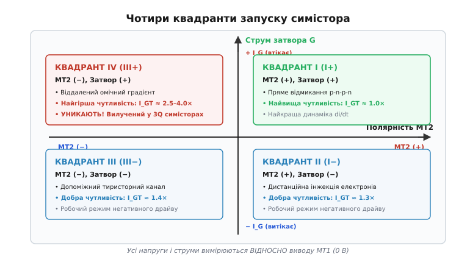
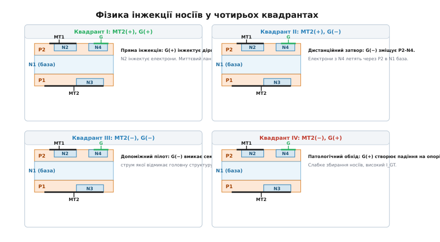
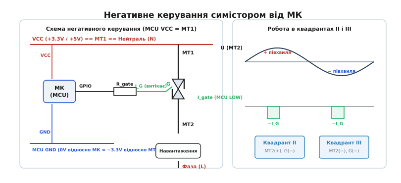
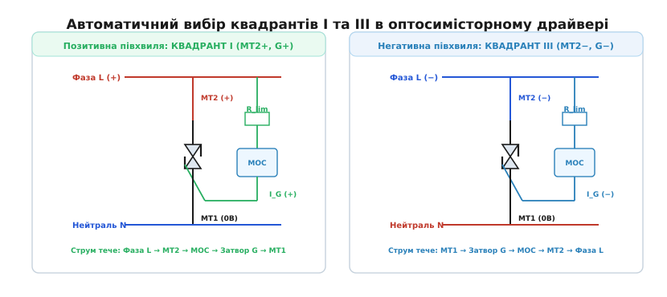
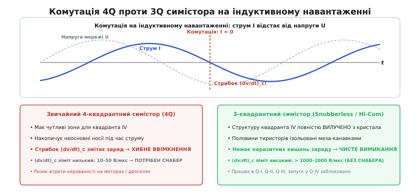

# Квадранти запуску симістора: фізика і вибір режиму

<preknowlist>
- [Тиристор](book:electronics/thyristor-scr) — чотиришарова структура p-n-p-n, регенеративне відмикання та утримання струму.
- [Симістор](book:electronics/triac) — зустрічно-паралельне об'єднання двох тиристорних каналів у спільному кристалі для обох півхвиль.
- [Фазове керування](book:electronics/phase-control-dimmer) — регулювання потужності зміщенням кута відмикання затвора.
- [Снабери та dv/dt](book:electronics/snubbers-dvdt) — швидкість наростання напруги, ємнісний струм зміщення та хибне відмикання переходу.
</preknowlist>

Розробник збирає твердотільне реле для нагрівача або колекторного двигуна на базі звичайного симістора і підключає затвор до виходу мікроконтролера через підсилювальний біполярний NPN-транзистор, який підтягує затвор до шини живлення +5 В. На додатній півхвилі мережі синусоїдальний струм комутується бездоганно: симістор відкривається коротким імпульсом струму 15 мА. Проте на від'ємній півхвилі навантаження починає хаотично тріщати, ключ пропускає фази, а при зниженні температури середовища до мінусових значень від'ємна півхвиля зникає повністю. Симістор мимовільно перетворюється на однопівперіодний випрямляч, постійний струм насичує осердя підключеного мережевого трансформатора, обмотка перегрівається і вибиває автомати захисту.

Причина цієї аварії криється не в несправності симістора, а в його внутрішній напівпровідниковій асиметрії. Слово «симетричний» у назві симістора стосується лише його здатності проводити силовий струм в обох напрямках після відмикання. Процес же керування затвором кардинально різниться залежно від взаємної полярності напруги на силових виводах та напрямку струму затвора.

### Система координат квадрантів: чому MT1 є непорушною базою

У класичного тиристора є анод, катод і затвор. Керування однозначне: затворний струм завжди подається відносно катода. У симістора виводи позначаються як **MT1** *(Main Terminal 1)* та **MT2** *(Main Terminal 2)*. Цей поділ фундаментальний: кристал влаштований так, що контакт затвора **G** геометрично та електрично прив'язаний виключно до виводу MT1.

Усі напруги керування, струми затвора та потенціали силового виводу MT2 в технічній документації та фізичних моделях вимірюються **строго відносно MT1**, який приймається за умовний нульовий потенціал (0 В):

1. **Полярність MT2:**
   - **MT2 (+):** потенціал MT2 вищий за потенціал MT1 (додатна півхвиля змінної напруги).
   - **MT2 (−):** потенціал MT2 нижчий за потенціал MT1 (від'ємна півхвиля змінної напруги).
2. **Полярність струму затвора G:**
   - **Затвор (+)** або **`I_G > 0`:** струм втікає в затвор від зовнішнього джерела і виходить через MT1 (потенціал затвора вищий за MT1).
   - **Затвор (−)** або **`I_G < 0`:** струм витікає з затвора в зовнішнє коло (потенціал затвора нижчий за MT1, тобто на затвор подано мінус відносно MT1).

Комбінація двох можливих знаків напруги на MT2 та двох напрямків струму затвора дає чотири робочі стани, які традиційно позначають римськими цифрами I, II, III, IV або комбінацією знаків полярностей.


*Чотири квадранти запуску симістора на площині полярностей: по горизонталі — напруга на MT2 відносно MT1, по вертикалі — струм затвора. Квадранти I, II та III є надійними робочими режимами, тоді як квадрант IV вирізняється найгіршою чутливістю.*

- **Квадрант I (позначення `I+` або `Q1`):** `V_MT2 > 0`, `I_G > 0` *(MT2 додатний, затвор додатний)*.
- **Квадрант II (позначення `I−` або `Q2`):** `V_MT2 > 0`, `I_G < 0` *(MT2 додатний, затвор від'ємний)*.
- **Квадрант III (позначення `III−` або `Q3`):** `V_MT2 < 0`, `I_G < 0` *(MT2 від'ємний, затвор від'ємний)*.
- **Квадрант IV (позначення `III+` або `Q4`):** `V_MT2 < 0`, `I_G > 0` *(MT2 від'ємний, затвор додатний)*.

Чутливість симістора до вмикання характеризується мінімальним струмом відмикання затвора `I_GT` *(gate trigger current)*, необхідним для надійного переходу приладу в провідний стан. У типовому чотириквадрантному симісторі (наприклад, BT136 або BT139) значення `I_GT` у квадрантах суттєво відрізняються:

```
I_GT(I)   = 1.0 · I_GT_typ   [базова найвища чутливість, наприклад 10 мА]
I_GT(II)  = 1.3 · I_GT_typ   [чутливість висока, близько 13 мА]
I_GT(III) = 1.4 · I_GT_typ   [чутливість висока, близько 14 мА]
I_GT(IV)  = 2.5...4.0 · I_GT_typ  [найгірша чутливість, 25...40 мА і більше]
```

Щоб зрозуміти, чому квадрант IV вимагає втричі більшого струму керування і чому прилад у цьому режимі легко виходить з ладу, необхідно спуститися на рівень мікроскопічної будови кремнієвої пластини.

### Внутрішня фізика кристала: шари, переходи та інжекція носіїв

Монолітний кристал симістора являє собою складну багатошарову структуру з п'яти або шести напівпровідникових областей p- та n-типу провідності. У ньому немає двох фізично відокремлених зустрічних тиристорів — обидва напрямки струму використовують спільні внутрішні шари кремнію, але різні ділянки поверхневих контактів.

Структура типового чотириквадрантного симістора у вертикальному розрізі містить:

1. **Верхній бік кристала:**
   - Основна базова область **P2**.
   - Дифузійне вкраплення **N2**, яке контактує з металізацією **MT1**.
   - Допоміжне дифузійне вкраплення **N4**, розташоване безпосередньо під металізацією затвора **G**.
   - Металізація MT1 одночасно накриває ділянки P2 та N2 (формуючи так звані емітерні закоротки для покращення стійкості до `dv/dt`).
   - Металізація затвора G накриває ділянки P2 та N4.
2. **Центральна частина кристала:**
   - Широка слабколегована n-область **N1** (дрейфова база). Вона сприймає на себе високу блокуючу напругу обох полярностей на центральному p-n переході **J2** (між N1 та P2).
3. **Нижній бік кристала:**
   - Базова область **P1**.
   - Дифузійне вкраплення **N3**.
   - Металізація виводу **MT2**, яка одночасно контактує з P1 та N3.


*Мікроструктура кристала симістора у чотирьох квадрантах: конфігурація P-N переходів та траєкторії руху інжектованих носіїв. У квадранті I відбувається пряме відмикання; у квадрантах II і III задіюється допоміжний емітер N4; у квадранті IV струм змушений долати високий омічний опір бази P2.*

Розглянемо фізичний механізм вмикання симістора в кожному з чотирьох квадрантів окремо.

#### Квадрант I: MT2(+), G(+) — Пряме відмикання класичного тиристора

Потенціал MT2 позитивний, MT1 — нульовий, затвор G — позитивний.

- Силовий ланцюг утворений чотиришаровою структурою **P1 – N1 – P2 – N2**. Область P1 виступає анодом, N2 — катодом.
- Переходи J1 (P1-N1) та J3 (P2-N2) зміщені в прямому напрямку. Центральний перехід J2 (N1-P2) зміщений у зворотному напрямку і блокує мережеву напругу.
- Подача позитивної напруги на затвор G зміщує перехід між базою P2 та емітером N2 у прямому напрямку.
- Затвор інжектує дірки в шар P2, а емітер N2 інжектує електрони в шар P2. Електрони дифундують через тонку базу P2, підхоплюються електричним полем зворотно зміщеного переходу J2 і викидаються в дрейфову базу N1.
- Поява надлишкового негативного заряду в N1 знижує її потенціал і викликає зустрічну інжекцію дірок з емітера P1 через перехід J1.
- Вмикається класичний регенеративний механізм позитивного зворотного зв'язку пари транзисторів p-n-p (P1-N1-P2) та n-p-n (N1-P2-N2). Струм лавиноподібно зростає, перехід J2 насичується носіями, і структура переходить у стан низького омічного опору.

Це найпростіший, найшвидший і найбільш енергоефективний механізм. Струм відмикання мінімальний, час затримки вмикання становить лише `t_d ≈ 0.2...0.5 мкс`, а допустима швидкість наростання струму `di/dt` досягає максимальних паспортних значень (понад 100 А/мкс).

#### Квадрант II: MT2(+), G(−) — Дистанційний затвор (Remote Gate Triggering)

Потенціал MT2 позитивний, MT1 — нульовий, затвор G — від'ємний відносно MT1.

- Силовий шлях струму залишається тим самим: **P1 – N1 – P2 – N2**.
- Оскільки на затвор G подано мінус відносно MT1 (який з'єднаний з P2), пряме відмикання переходу P2-N2 неможливе.
- Замість цього від'ємний потенціал затвора зміщує в прямому напрямку допоміжний перехід **P2 – N4**, розташований під затворним контактом.
- Емітер N4 починає інтенсивно інжектувати електрони в базову область P2.
- Інжектовані електрони рухаються в товщі P2 в бік зворотно зміщеного переходу J2 (N1-P2), перетинають його під дією поля і потрапляють у центральну базу N1.
- Накопичення електронів у N1 запускає інжекцію дірок з нижнього шару P1 (анода MT2). Дірки досягають бази P2 поблизу основного емітера N2, створюючи там локальне падіння напруги, яке зрештою відмикає основний перехід P2-N2.
- Запускається головний регенеративний процес структури P1-N1-P2-N2.

Оскільки запуск відбувається опосередковано — через перенесення електронів від допоміжного переходу N4 до центральної бази N1, — цей механізм називають керуванням через **дистанційний затвор** *(remote gate)*. Чутливість тут трохи нижча, ніж у квадранті I (струм `I_GT` на 20–30% вищий), час затримки зростає до `t_d ≈ 0.5...1.0 мкс`, але процес відмикання відбувається чітко, швидко і без паразитного перегріву кристала.

#### Квадрант III: MT2(−), G(−) — Допоміжний тиристорний канал

Потенціал MT2 від'ємний відносно MT1 (MT1 є анодом), затвор G — від'ємний відносно MT1.

- Основний силовий струм протікає через зворотну структуру **P2 – N1 – P1 – N3**, де шар P2 під виводом MT1 працює анодом, а шар N3 під виводом MT2 — катодом.
- Блокуючим є перехід J2 (між N1 та P2), але тепер його полярність протилежна.
- Від'ємний затворний струм зміщує в прямому напрямку допоміжний перехід **P2 – N4**.
- Електрони, інжектовані з N4 у шар P2, діють як керувальний базовий струм для допоміжного пілотного тиристора, утвореного шарами N4-P2-N1-P1-N3.
- Допоміжний пілотний тиристор миттєво відмикається. Його внутрішній струм починає протікати через шар P2 безпосередньо під основною площею контакту MT1, створюючи потужну інжекцію дірок з P2 в N1.
- Ця потужна інжекція підхоплює основну структуру P2-N1-P1-N3, переводячи весь кристал у режим насичення.

Квадрант III демонструє відмінну динаміку і високу надійність. Струм відмикання `I_GT(III)` практично дорівнює струму `I_GT(II)`, а час перемикання становить близько 1.5–2.0 мкс.

#### Квадрант IV: MT2(−), G(+) — Патологія віддаленого омічного градієнта

Потенціал MT2 від'ємний (MT1 є анодом), затвор G — додатний відносно MT1.

- Основний силовий шлях струму — це **P2 – N1 – P1 – N3**.
- Контакт MT1 з'єднаний з шаром P2 і має нульовий потенціал. Затвор G має позитивний потенціал, тобто струм затвора втікає в шар P2.
- У зоні затвора немає прямозміщеного n-емітера, з'єднаного з землею: перехід P2-N4 закритий, оскільки на затворі плюс.
- Струм затвора являє собою потік дірок, які втікають через затворний контакт у шар P2 і повинні стекти до металізації MT1.
- Протікаючи вздовж шару P2 до контакту MT1, цей струм створює бічне омічне падіння напруги на розподіленому внутрішньому опорі бази P2.
- Лише тоді, коли струм затвора досягає дуже великих значень (десятки міліампер), бічне падіння напруги стає достатнім, щоб віддалена ділянка переходу **P2 – N2** (яка взагалі не бере участі в провідності на цій півхвилі!) виявилася локально прямозміщеною.
- Тільки після цього емітер N2 починає мляво інжектувати електрони, які здійснюють довгий шлях крізь P2 до переходу J2, намагаючись ініціювати запуск структури P2-N1-P1-N3.

Через надзвичайно довгу траєкторію носіїв і колосальні втрати на рекомбінацію коефіцієнт підсилення в цьому контурі мізерний.

Наслідки роботи в квадранті IV фатальні для надійності схеми:

1. **Гігантський струм відмикання `I_GT(IV)`:** у 2.5–4 рази вищий за норму. Драйвер, розрахований на 15–20 мА, просто не може відкрити симістор.
2. **Величезна температурна нестабільність:** при падінні температури до −10...−40 °C рухливість носіїв падає, і `I_GT(IV)` зростає до 80–120 мА. Схема повністю втрачає працездатність на морозі.
3. **Затримка відмикання та фазовий джитер:** час відмикання досягає `t_gt ≈ 5...9 мкс`, що вносить суттєву асиметрію фазового кута між півхвилями та генерує постійну складову струму в навантаженні.
4. **Локальний шнуровий перегрів і деградація `di/dt`:** струм вмикання концентрується на крихітній випадковій ділянці кристала. Якщо навантаження має ємнісний або низькоомічний характер, локальна густина струму пропалює кристал у точці первинного запуску ще до того, як провідність пошириться на всю площу напівпровідника.

Інженерне правило силової електроніки категоричне: **роботи в квадранті IV необхідно уникати за будь-яку ціну.**

---

### Динамічні пороги: струм защіпки `I_L` проти струму утримання `I_H`

При проєктуванні драйверів затвора необхідно чітко розрізняти два граничні струми силового кола симістора:

1. **Струм утримання `I_H`** *(holding current)*: мінімальний струм навантаження, який повинен протікати через відкритий симістор після закінчення затворного імпульсу, коли процес регенерації вже повністю захопив усю площу кристала. Якщо миттєвий струм навантаження опуститься нижче `I_H`, регенеративний зв'язок розривається, і симістор вимикається. Струм `I_H` практично симетричний для обох напрямків провідності і становить типово 5–25 мА.
2. **Струм защіпки `I_L`** *(latching current)*: мінімальний струм навантаження, якого силове коло повинно досягти **в момент закінчення керуючого імпульсу затвора**, щоб симістор залишився у відкритому стані самостійно.

Поки імпульс затвора активний, провідність зосереджена на крихітній ділянці кристала безпосередньо біля затворного контакту. Щоб плазма носіїв поширилася на весь об'єм пластини і створила самопідтримувану регенерацію, струм силового кола повинен перевищити `I_L`.

Значення струму защіпки `I_L` суттєво залежить від робочого квадранта:

```
I_L(I)   ≈ 1.5...2.0 · I_H   [наприклад, 15...30 мА]
I_L(II)  ≈ 2.0...2.5 · I_H   [наприклад, 25...40 мА]
I_L(III) ≈ 2.0...2.5 · I_H   [наприклад, 25...40 мА]
I_L(IV)  ≈ 3.5...5.0 · I_H   [наприклад, 50...80 мА]
```

Якщо керувальний імпульс занадто короткий (наприклад, 5 мкс), а навантаження має індуктивність, струм у колі встигає зрости лише до кількох міліампер. Якщо в момент закінчення імпульсу фактичний струм менший за `I_L`, симістор миттєво згасне. У квадранті IV поріг `I_L` настільки високий, що короткі імпульси практично ніколи не забезпечують стабільного вмикання на індуктивності.

---

### Температурний дрейф струму відмикання та морозне блокування

Струм відмикання затвора `I_GT` має виражений **негативний температурний коефіцієнт**: зі зростанням температури кристала величина `I_GT` знижується (орієнтовно на −0.5% на кожен градус Цельсія).

Причиною цього є фізика теплової генерації носіїв:
1. При нагріванні кремнієвої пластини (наприклад, до робочих `+100...+125 °C`) власна концентрація електронів та дірок зростає, а час їхнього життя до рекомбінації збільшується.
2. Коефіцієнти підсилення внутрішніх транзисторних структур `α_npn` та `α_pnp` зростають, тому для досягнення умови регенеративного вмикання `α_npn + α_pnp = 1` потрібна значно менша зовнішня інжекція з затвора.
3. У результаті гарячий симістор відмикається значно легше (струм `I_GT` падає на 30–50% від номіналу при 25 °C). Проте одночасно різко падає його завадостійкість: гарячий кристал у рази чутливіший до випадкових шумів, сплесків напруги та паразитного ефекту `dv/dt`.

Зворотна і значно небезпечніша ситуація виникає при охолодженні приладу (робота вуличної автоматики, воріт, компресорів або неопалюваних складів при температурах від −10 °C до −40 °C):
1. Теплова генерація носіїв різко сповільнюється, рухливість дірок у базі P2 падає, а час життя носіїв скорочується.
2. У квадрантах I, II та III струм `I_GT` зростає на 40–80%, що легко перекривається стандартним інженерним запасом струму драйвера.
3. У квадранті IV, де механізм відмикання критично залежить від бічного дрейфу дірок та вторинної емісії віддаленого переходу, струм `I_GT(IV)` зростає експоненціально — у 3–5 разів порівняно з кімнатною температурою. Драйвер, який видає фіксований імпульс 25 мА, при −20 °C повністю втрачає здатність відмикати симістор на від'ємній півхвилі.

---

### Осцилографічне діагностування роботи квадрантів

Під час перевірки симисторного вузла на стенді використовують цифровий осцилограф з ізольованими диференційними щупами та струмовий пробник:

1. **Канал 1 (напруга між MT2 і MT1):** підключається високовольтним диференційним щупом. Дозволяє бачити синусоїду мережі, момент відмикання (спад напруги до 1.5 В) та комутаційний стрибок у момент переходу струму через нуль.
2. **Канал 2 (напруга на затворі G відносно MT1):** дозволяє точно оцінити форму, полярність та тривалість керуючого імпульсу. Якщо напруга на затворі додатна при від'ємному MT2 — схема працює в забороненому квадранті IV.
3. **Канал 3 (струм затвора `I_G` через токовий пробник):** вимірює амплітуду струму запуску та фіксує перевантаження вихідного каскаду мікроконтролера чи фотосимістора оптопари.
4. **Канал 4 (силовий струм навантаження `I_load`):** виявляє індуктивний зсув фази `φ`, форму наростання струму та підтверджує перехід струму через поріг защіпки `I_L` до моменту спаду імпульсу затвора.

Якщо на осцилограмі спостерігається затримка вмикання симістора на кілька мікросекунд після подачі затворного сигналу на від'ємній півхвилі, або симістор відкривається лише при амплітудній напрузі мережі — це пряма діагностична ознака дефіциту струму затвора через потрапляння в квадрант IV.

---

### Схемотехнічний вибір режимів керування

Щоб виключити найгірший квадрант IV, схема керування повинна забезпечувати роботу або в парі квадрантів **I та III**, або в парі квадрантів **II та III**.

#### Метод 1: Негативне уніполярне керування від мікроконтролера (Квадранти II і III)

Якщо система керування не має гальванічної розв'язки і живиться від безтрансформаторного джерела з спільним проводом, симістор підключають за схемою **негативного драйву** *(Negative Gate Drive)*.

У цій конфігурації позитивна шина живлення мікроконтролера `VCC` (+3.3 В або +5 В) об'єднується з виводом **MT1** симістора та нейтральним проводом мережі **N**. Власна земля мікроконтролера `GND` опиняється під потенціалом **−3.3 В (або −5 В) відносно MT1**.


*Негативне керування від мікроконтролера: шина VCC об'єднана з силовим виводом MT1. Коли порт GPIO видає логічний нуль (GND МК), струм витікає із затвора, що забезпечує стабільну роботу в квадрантах II та III на обох півхвилях мережі.*

Коли вихідний порт GPIO мікроконтролера формує логічний нуль (`0`), його вихід з'єднується з шиною GND мікроконтролера. Потенціал виводу стає від'ємним відносно MT1 (рівно −3.3 В). Струм тече від шини MT1 (VCC) крізь перехід затвора симістора в пін мікроконтролера (втікаючий струм, *current sinking*):

- На додатній півхвилі мережі (MT2 > 0) симістор запускається в **квадранті II (I−)**.
- На від'ємній півхвилі мережі (MT2 < 0) симістор запускається в **квадранті III (III−)**.

Обидва квадранти мають високу чутливість (`I_GT ≈ 10...15 мА`), запуск симетричний на обох півхвилях, а квадрант IV повністю виключений. Детальний схемотехнічний розрахунок і програмні алгоритми фазового регулятора для різних платформ винесені в окремий інженерний проєкт [Пряме негативне керування симістором від мікроконтролера](book:electronics/quadrant-triggering/proj-mcu-quadrant-drive.md).

#### Метод 2: Оптосимісторний драйвер (Квадранти I і III)

У промисловій апаратурі та безпечних побутових приладах мікроконтролер обов'язково відокремлюють від силової мережі 230 В оптосимістором (наприклад, **MOC3021 / MOC3023** для фазового керування або **MOC3041 / MOC3063** з вбудованим вузлом Zero-Cross).

Вихідний фотосимістор оптопари вмикається послідовно зі струмообмежувальним резистором `R_lim` між силовим виводом **MT2** та затвором **G** основного симістора.


*Оптосимісторний драйвер: коло керування живиться безпосередньо від напруги між MT2 та MT1. На додатній півхвилі струм тече в затвор (квадрант I), на від'ємній — витікає з затвора (квадрант III).*

Розглянемо рух струмів у такій топології:

1. **Додатна півхвиля (MT2 має позитивний потенціал відносно MT1):**
   - Коли світлодіод оптопари засвічується, внутрішній фотосимістор відкривається.
   - Струм тече за контуром: **MT2 (+) → обмежувальний резистор `R_lim` → оптосимістор → затвор G → перехід затвора → MT1 (0 В)**.
   - Струм втікає в затвор (`I_G > 0`). Оскільки `V_MT2 > 0` і `I_G > 0`, система автоматично працює в **квадранті I**.
2. **Від'ємна півхвиля (MT2 має негативний потенціал відносно MT1):**
   - Потенціал MT1 (0 В) вищий за потенціал MT2 (−).
   - Струм тече у зворотному напрямку: **MT1 (0 В) → перехід затвора → затвор G → оптосимістор → резистор `R_lim` → MT2 (−)**.
   - Струм витікає із затвора (`I_G < 0`). Оскільки `V_MT2 < 0` і `I_G < 0`, система автоматично працює в **квадранті III**.

Оптосимістор створює ідеальну узгодженість полярностей: знак струму затвора завжди збігається зі знаком напруги на MT2. Як результат, схема завжди використовує виключно найефективнішу пару **Квадрант I + Квадрант III**. Квадранти II та IV у такій схемі фізично недосяжні.

#### Розрахунок струмообмежувального резистора `R_lim`

Резистор `R_lim` захищає вихідний кристал оптопари від перевантаження за струмом у момент відкривання, поки основний симістор ще не встиг зашунтувати коло.

Максимальний піковий струм фотосимістора серії MOC30xx становить `I_TSM = 1.0 А`. Для мережі змінного струму 230 В з амплітудним значенням напруги `V_peak = 230 · √2 ≈ 325 В`:

```
R_lim_min = V_peak / I_TSM                 [закон Ома: амплітуда мережі / граничний піковий струм]
= 325 / 1.0                                [підстановка значень: 325 В / 1.0 А]
= 325 Ом                                   [мінімальний безпечний опір для захисту MOC]
```

При відмиканні на куті 90° (пік напруги) імпульсний струм у затвор становитиме:

```
I_G_peak = (V_peak - V_TM_opto - V_GT) / R_lim   [закон Ома з урахуванням спадів напруг на переходах]
= (325 - 1.5 - 1.2) / 330                        [підстановка: спад на MOC 1.5 В, на затворі 1.2 В]
= 322.3 / 330                                    [падіння напруги на резисторі R_lim]
≈ 0.976 А                                        [піковий струм відмикання силового симістора]
```

Такий потужний імпульс триває менше 1–2 мікросекунд, поки силовий симістор не відкриється і не знизить напругу на затворному колі до залишкового падіння `1.2...1.5 В`. Це гарантує миттєве і чітке спрацьовування навіть «тугих» симісторів з струмом відмикання `I_GT = 50 мА`.

#### Метод 3: Імпульсні трансформатори (Pulse Transformers)

У високовольтних промислових установках та трифазних комутаторах для гальванічної розв'язки часто використовують мініатюрні імпульсні феритові трансформатори (коефіцієнт трансформації 1:1 або 2:1).

Щоб забезпечити надійну роботу через трансформатор, вторинну обмотку підключають з урахуванням полярності:
1. Початок вторинної обмотки підключається до виводу **MT1**, а кінець — через обмежувальний резистор до затвора **G**.
2. При подачі прямокутного імпульсу в первинну обмотку на вторинній формується від'ємний імпульс на затворі відносно MT1 (`I_G < 0`).
3. Завдяки цьому прилад на обох півхвилях працює строго в **квадрантах II і III**, гарантуючи повну завадостійкість та симетрію відмикання.

---

### Індуктивне навантаження, комутаційний стрибок (dv/dt)_c та народження 3-квадрантних симісторів

Коли симістор керує активним навантаженням (нагрівачі, лампи розжарювання), струм і напруга збігаються за фазою. Коли струм падає до нуля в кінці півхвилі, напруга мережі також дорівнює нулю. Симістор спокійно вимикається, не відчуваючи динамічного стресу.

Ситуація докорінно змінюється при підключенні індуктивного навантаження (асинхронні або колекторні двигуни, компресори, котушки реле, дроселі).


*Комутація індуктивного навантаження: струм відстає від напруги. У момент згасання струму (I = 0) напруга на симісторі миттєво стрибає до миттєвого значення мережі з високою швидкістю (dv/dt)_c. У 4Q симісторі залишковий заряд провокує хибний повторний запуск, тоді як 3Q симістор вимикається чисто.*

Через індуктивний зсув фаз струм `I` відстає від напруги `U` на кут `φ = arctan(ωL / R)`.

Коли струм синусоїди перетинає нуль і симістор намагається згаснути, напруга на ньому не нульова — вона миттєво підскакує до величини:

```
V_comm = V_peak · sin(φ)
```

Цей стрибок напруги відбувається з колосальною швидкістю наростання — **комутаційною швидкістю `(dv/dt)_c`** *(rate of rise of commutating off-state voltage)*.

У класичному чотириквадрантному симісторі під час протікання прямого струму в базових напівпровідникових шарах накопичується значний заряд неосновних носіїв. Особливо критичним є накопичення заряду в паразитно зв'язаних допоміжних областях, призначених для забезпечення чутливості в квадранті IV.

Коли струм згасає, цим носіям потрібен час на рекомбінацію. Стрибок зворотної напруги `(dv/dt)_c` створює високий ємнісний струм зміщення:

```
i_disp = C_j · ((dv/dt)_c)
```

Цей струм зміщення змітає нерекомбіновані носії прямо в керуючі переходи зустрічного тиристорного каналу. Симістор мимовільно відмикається на наступній півхвилі **взагалі без сигналу на затворі**. Втрачається керованість: ключ залишається постійно відкритим на 100% потужності.

Щоб запобігти цьому аварійному явищу в 4Q симісторах, паралельно виводам MT1–MT2 обов'язково встановлюють захисний демпфер — [RC-снабер](book:electronics/snubbers-dvdt), який уповільнює наростання напруги до безпечного рівня 10–20 В/мкс.

#### Триквантові симістори (Snubberless / Alternistor / Hi-Com)

Щоб назавжди позбутися проблеми комутаційного зриву без громіздких та гарячих RC-снаберів, виробники (STMicroelectronics, WeEn Semiconductors, Littelfuse) створили **триквантові симістори** *(3-Quadrant TRIACs)*.

Фізична сутність технології полягає в наступному:

1. **Повна ліквідація структури квадранта IV:** напівпровідникова топологія кристала перероблена так, що допоміжний шар N4 та спільні канали інжекції квадранта IV фізично видалені з пластини.
2. **Глибока ізоляція напівперіодів:** два зустрічні тиристорні канали розділені глибокими меза-канавками з оксидною або поліімідною пасивацією. Накопичений заряд прямого напівперіоду повністю ізольований і не здатний проникнути в область зустрічного каналу під час зміни полярності.

Наслідки такої оптимізації кристала:

- Прилад **в принципі не здатен запуститися в квадранті IV** (подача позитивного струму затвора при від'ємному MT2 просто ігнорується приладом).
- Комутаційна стійкість `(dv/dt)_c` зростає з мізерних 10–20 В/мкс до **1000–2000 В/мкс** (у 100 разів!).
- Комутаційна швидкість спаду струму `(di/dt)_c` зростає з 2–4 А/мс до **16–30 А/мс**.
- Будь-яке індуктивне навантаження комутується надійно **без використання RC-снабера** (*Snubberless*).

Особливості маркування, групи чутливості та правила проєктування силових вузлів на таких приладах детально розглянуті в довіднику [Триквантові симістори](book:electronics/quadrant-triggering/comp-three-quadrant-triac.md).

---

### Порівняльна матриця вибору режимів та інженерні рекомендації

Під час розробки схем на симісторах інженер обирає поєднання типу приладу та топології драйвера за чіткою матрицею відповідності:

| Топологія схеми керування | Використовувані квадранти | Сумісність з 4Q симісторами | Сумісність з 3Q симісторами (Snubberless) | Потреба в RC-снабері на індуктивності | Типове застосування |
| :--- | :--- | :--- | :--- | :--- | :--- |
| **Оптосимістор (MOC3021 / MOC3041)** | **I та III** | Повна (відмінна чутливість) | Повна (найкраща надійність) | Для 4Q — так; для 3Q — ні | Безпечні димери, промислова автоматика, реле |
| **Негативний драйв МК (VCC = MT1)** | **II та III** | Повна (симетричний струм) | Повна (ідеальний режим) | Для 4Q — так; для 3Q — ні | Дешеві плати пральних машин, кухонних комбайнів |
| **Позитивний драйв МК (GND = MT1)** | **I та IV** | **Вкрай ненадійно!** (збій у Q-IV на холоді) | **НЕ ПРАЦЮЄ!** (від'ємна півхвиля не вмикається) | Не рятує від збою відмикання | **Заборонена схемотехнічна помилка** |
| **Аналоговий фазовий регулятор на DIAC (DB3)** | **I та III** | Повна (симетричний імпульс) | Повна | Для 4Q — так; для 3Q — ні | Настінні світлорегулятори, ручний електроінструмент |
| **Імпульсний трансформатор (зворотна полярність)** | **II та III** | Повна (висока завадостійкість) | Повна (промисловий стандарт) | Для 4Q — так; для 3Q — ні | Потужні трифазні контактори, плавний пуск |

> 🔧 **Інженерне правило вибору.** Якщо в схемі використовується гальванічна розв'язка — застосовуйте оптосимісторний драйвер (робота строго в квадрантах I і III). Якщо мікроконтролер підключається безпосередньо — підключайте його позитивну шину живлення до MT1 та відкривайте ключ виключно активним нулем (робота строго в квадрантах II і III). Для будь-яких індуктивних навантажень замість стандартних 4Q симісторів використовуйте триквантові прилади серій Snubberless або Alternistor (BTA/BTB..BW, BTA/BTB..CW, T1235, Q6012LH) — це позбавляє від необхідності встановлювати паралельні високовольтні конденсатори та резистори снабера.
