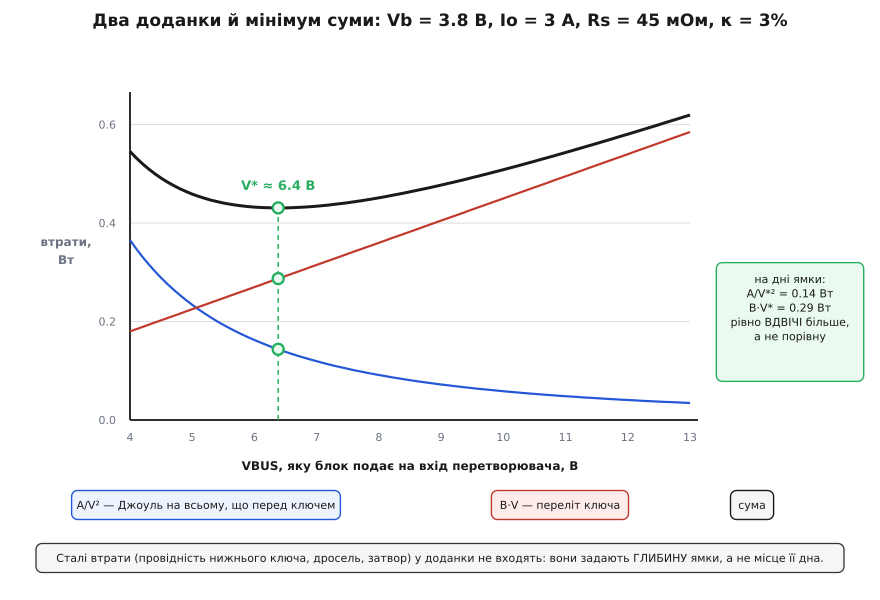
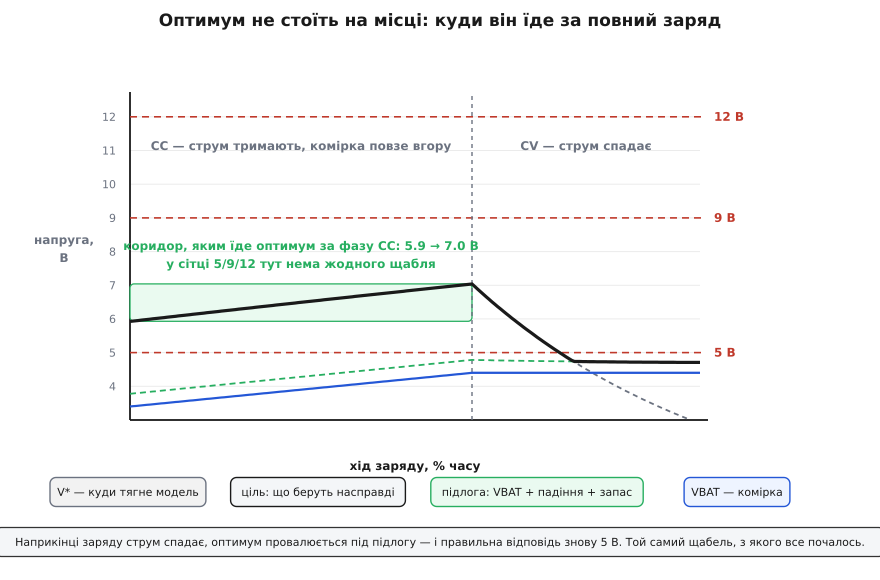
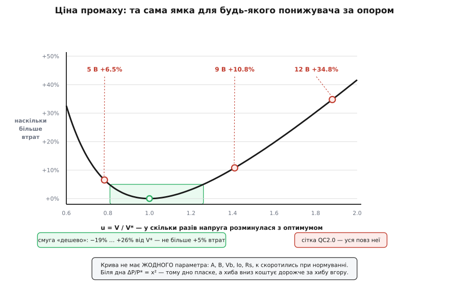

# 🧮 Де лежить оптимум HVDCP: два доданки й корінь кубічний

<preknowlist>
- [Buck-перетворювач](book:electronics/buck) — понижувач із ключем і дроселем; шпаруватість D = Vвих/Vвх, і саме в D разів вхідний струм менший за вихідний.
- [Втрати перемикання в силових ключах](book:electronics/switching-losses) — енергія, яку ключ палить за один переліт, поки на ньому одночасно є й напруга, й струм.
- [Джоулеве тепло](book:physics/joule-heating) — P = I²R: втрати на опорі ростуть як **квадрат** струму, а не як струм.
- [Екстремуми](book:math/extrema) — дно гладкої функції шукають там, де похідна дорівнює нулю.
- [Зарядка Li-ion](book:electronics/li-ion-charger) — CC/CV: спершу тримають струм, а напруга комірки повзе вгору; потім тримають напругу, а струм спадає.
</preknowlist>

Твердження «ККД заряду має пік» звучить як спостереження — щось таке, що можна тільки зміряти. Насправді пік можна **вивести**, і виведення дає значно більше за саме число. Воно каже, чому дно лежить саме там; чому воно повзе; на скільки воно повзе; наскільки дорого повз нього промахнутись; і в який бік промахуватись безпечніше. Усе це випливає з двох доданків, які будь-хто здатен виписати за півхвилини.

## Спершу — що саме шукаємо

Слово «ККД» тут заважає, бо ККД — це дріб, а дроби незручно мінімізувати. Позбудьмося дробу.

Поки триває фаза постійного струму, комірка бере **заданий** струм Io при тій напрузі Vb, на якій вона зараз сидить. Ані Io, ані Vb не є нашим вибором: перше задав зарядний алгоритм, друге — сама хімія в цю мить. Отже, корисна потужність

```
Pк = Vb · Io
```

**зафіксована**. Вона не залежить від того, яку напругу ми попросимо в блока. А ККД — це Pк/(Pк + Pвтрат), тобто дріб зі сталим чисельником. Максимізувати такий дріб — те саме, що мінімізувати знаменник, тобто просто **Pвтрат**.

Так зникає дріб, і лишається чиста задача: є одна вільна змінна V — напруга, яку блокові накажуть зробити. Є функція Pвтрат(V). Знайти її дно.

Це не косметична перестановка. З неї одразу випливає наслідок, який ще стане в пригоді: **сталі доданки втрат на місце дна не впливають узагалі**. Якщо якась втрата однакова при п'яти вольтах і при дванадцяти, вона піднімає всю криву на ту саму висоту й не зрушує її найнижчої точки ані на мілівольт. Тому проста модель здатна влучити в **положення** піку, навіть не намагаючись угадати абсолютний ККД.

## Два вороги, що тягнуть у різні боки

Перш ніж рахувати, варто побачити, чому дно взагалі мусить існувати.

Опустімо V. Щоб донести ту саму потужність нижчою напругою, потрібен більший струм — а струм тече крізь усе, що стоїть на його шляху до ключа: шнур, роз'єми, вхідний транзистор, шунт. Кожен міліом бере своє за законом Джоуля, причому **квадратично**. Знижуючи напругу, ми самі себе караємо.

Тепер підіймімо V. Струм спав, шнур охолов — але транзистор перемикається не миттєво. Кожного разу, поки він летить з відкритого стану в закритий, крізь нього одночасно є й напруга, й струм; це перекриття палить енергію. І чим вища вхідна напруга, тим більший шлях мусить пробігти потенціал точки комутації за один переліт, і тим дорожчий кожен переліт. Підіймаючи напругу, ми знову самі себе караємо — просто в іншому місці.

Один доданок спадає, другий росте. Отже, десь між ними є найнижча точка. Це вже зрозуміло без жодної формули — але **де саме** вона, інтуїція не скаже. Для цього обидва доданки треба виписати точно.

## Доданок, який спадає: усе, що стоїть перед ключем

У понижувача вхідний струм тече не весь час, а лише поки відкритий верхній ключ, тобто частку D періоду. Тому середній вхідний струм у D разів менший за вихідний:

```
Iвх = D · Io,   а  D = Vb / V
Iвх = Vb · Io / V
```

Ось і вся причина, чому висока напруга рятує шнур: струм на вході обернено пропорційний V. А втрати на послідовному опорі — квадрат струму:

```
Pпосл = Iвх² · Rs = (Vb · Io)² · Rs / V²  ≡  A / V²,   де A = (Vb · Io)² · Rs
```

Зверніть увагу на степінь. Втрати спадають не як 1/V, а як **1/V²** — бо квадратичний закон Джоуля множиться сам на себе: підняли напругу вдвічі, струм упав удвічі, а тепло — учетверо. Саме ця крутість робить лівий бік ями таким урвистим, і саме вона згодом скаже, у який бік безпечніше помилятись.

Що таке Rs? **Усе, що стоїть послідовно перед ключем**: вхідний транзистор, вимірювальний шунт, доріжки плати, контакти роз'єму, шнур. Питання, що саме з цього переліку рахувати, виявиться найцікавішим у всій моделі — до нього ще дійдемо.

## Доданок, який росте: ціна одного перельоту

Ідеальний ключ перемикається за нуль часу й палить нуль. Справжній летить скінченний час tsw, і поки він летить, напруга на ньому спадає від V до нуля, а струм піднімається від нуля до Io — тобто добуток «напруга × струм» не дорівнює нулю ні на мить перельоту. Енергія за один переліт — приблизно площа трикутника:

```
Eперельоту ≈ ½ · V · Io · tsw
```

Перельотів стільки, скільки перемикань: fsw разів на секунду. Отже:

```
Pперем = ½ · V · Io · tsw · fsw
```

Тут напрошується згорнути дві сталі ключа в одну величину, і вона виходить на диво промовистою:

```
κ = tsw · fsw          ← безрозмірна: частка часу, яку ключ проводить У ПЕРЕЛЬОТІ
```

Секунди на герци — число без одиниць. Для звичайного зарядного чипа з частотою 1.5 МГц і повним часом перельоту близько 20 нс воно дає κ = 0.03: **три відсотки життя ключ не відкритий і не закритий, а десь між**. Уся ціна високої напруги схована в цих трьох відсотках. Тоді

```
Pперем = ½ · κ · Io · V  ≡  B · V,   де B = ½ · κ · Io
```

> 🔧 **Навіщо це.** κ — єдина стала ключа, яка тут узагалі потрібна, і вона зводить докупи дві речі, що в даташиті лежать на різних сторінках: швидкість затвора й частоту. Подвоївши частоту заради меншого дроселя, ви подвоюєте κ — і, як зараз побачимо, зсуваєте оптимальну напругу вниз. Ось чому в чипа з частотою 3 МГц оптимум не там, де в його ж родича на 750 кГц, хоча схема та сама.

## Увесь реєстр — по степенях V

Чесність вимагає виписати не два доданки, а всі, і розсортувати за степенем V. Тоді одразу видно, хто справді вирішує.

```
степінь V   доданок                            звідки береться
────────────────────────────────────────────────────────────────────────────
  V⁻²       (Vb·Io)² · Rs / V²                 Джоуль на всьому, що перед ключем
  V⁻¹       (Vb/V) · Io² · (Rвк − Rнк)         перекіс провідності верхнього й нижнього ключів
  V⁰        Io² · (Rнк + RL) + Qg·Vg·fsw       провідність нижнього ключа, дросель, затвор
  V¹        ½ · κ · Io · V                     переліт ключа
  V²        ½ · Coss · fsw · V²                перезаряд власної ємності ключа
```

Рядок V⁰ — сталі. Їхня похідна нульова, тож вони, як уже сказано, задають **глибину** ями, а не місце її дна. Викидаємо без вагань.

Рядок V⁻¹ заслуговує на секунду уваги, бо його легко проґавити. Верхній ключ проводить частку D і палить D·Io²·Rвк — цей доданок із напругою **спадає**. Нижній проводить решту, (1−D), і палить (1−D)·Io²·Rнк — цей **росте**. Разом:

```
Pпровід = Io² · [Rнк + D · (Rвк − Rнк)]
```

Якщо опори двох ключів однакові, дужка перетворюється на Rнк — і залежність від напруги **зникає повністю**. У чипі з інтегрованими ключами вони близькі за конструкцією, тож лишається дрібний залишок, і ним у скелеті можна знехтувати.

Рядок V² при п'яти-дев'яти вольтах малий, але при дванадцяти й вище перестає бути малим. Це єдина суттєва сліпа пляма нашого скелета, і вона вся на **правому** боці ями. Запам'ятаймо це.

Лишається скелет:

```
P(V) = A/V² + B·V + C
```

І тут варто зняти одну можливу підозру. Інтуїція каже «втрати перетворювача ростуть із **перепадом**», тобто мали б бути пропорційні (V − Vb), а не V. Фізика каже своє: точка комутації гойдається від нуля до повної V, тож переліт коштує пропорційно V. Хто має рацію? **Обидва — і для дна це не має жодного значення.** Різниця між B·V і B·(V − Vb) — це B·Vb, тобто стала. А сталі, як ми щойно домовились, дна не рухають. Дві різні картинки світу дають той самий оптимум.

## Дно: корінь кубічний і правило 1:2

Похідна нуль:

```
dP/dV = −2A/V³ + B = 0
```

```
V*³ = 2A/B
V*  = ∛(2A/B)
```

Чи це справді мінімум, а не якийсь інший екстремум? Друга похідна 6A/V⁴ при додатних V додатна завжди, і обидва доданки на промені V > 0 опуклі — отже, точка одна-єдина, і вона глобальне дно. Жодних других розв'язків, жодних локальних пасток.

Тепер найцікавіше. Підставмо V* назад і подивімось, у якому стані застали доданки одне одного на дні:

```
V*³ = 2A/B   ⟹   B·V* = 2A/V*²
```

**На дні зростальний доданок рівно вдвічі більший за спадний.** Не порівну! А оце вже проти інтуїції: «баланс двох сил» у голові малюється як рівність, і в задачах, де обидві сили однакової природи, так воно й буває. Тут не так — і причина точна.

Візьмімо загальний випадок: A/Vⁿ + B·Vᵐ. Похідна:

```
−n·A·V⁻ⁿ⁻¹ + m·B·V^(m−1) = 0
n · (A/Vⁿ) = m · (B·Vᵐ)
```

Тобто на дні доданки стоять у відношенні **m : n** — обернено до своїх степенів. Порівну вони стають лише тоді, коли степені однакові. У нас n = 2, m = 1, звідси 1 : 2. Спадний доданок «важчий» на одиницю степеня, тому йому дозволено бути вдвічі меншим — його важіль удвічі довший.

І з цього випадає безкоштовний стендовий тест: **ви на дні тоді й лише тоді, коли втрати перемикання вдвічі більші за втрати на послідовному опорі.** Ніякої похідної біля осцилографа не треба.


*Спадний доданок падає як 1/V², зростальний іде прямою — сума мусить мати дно. Три зелені крапки на вертикалі V* показують головне й найменш очевидне: на дні доданки стоять не порівну, а рівно 1 : 2, бо їхні степені різні. Сталі втрати в цю картину не входять зовсім — вони задають глибину ями, не місце її дна.*

## Звідки беруться 6.4 вольта

Тепер підставмо фізику в ∛(2A/B) і подивімось, що вийде.

```
V*³ = 2A/B = 2·(Vb·Io)²·Rs / (½·κ·Io) = 4 · Vb² · Io · Rs / κ
```

```
V* = ∛( 4 · Vb² · Io · Rs / κ )
```

Розмірність збігається, і це варто перевірити, бо формула виглядає надто простою для правди: В² · А · Ом = В² · В = В³, а κ безрозмірна. Кубічний корінь із кубів вольтів дає вольти.

**Приклад (зарядний чип під повним струмом, комірка посеред заряду).**

```
Vb = 3.8 В    комірка в середині заряду
Io = 3.0 А    струм фази CC
Rs = 45 мОм   вхідний ключ ≈25 мОм + шунт, доріжки, контакти ≈20 мОм
κ  = 20 нс × 1.5 МГц = 0.03

V*³ = 4 · 3.8² · 3.0 · 0.045 / 0.03
    = 4 · 14.44 · 3.0 · 0.045 / 0.03
    = 7.7976 / 0.03
    = 259.9 В³

V*  = ∛259.9 = 6.38 В
```

Перевірка правилом 1 : 2:

```
A     = (3.8 · 3.0)² · 0.045 = 11.4² · 0.045 = 5.848 Вт·В²
B     = ½ · 0.03 · 3.0                       = 0.045 Вт/В

A/V*² = 5.848 / 6.38² = 0.144 Вт    ← спадний
B·V*  = 0.045 · 6.38  = 0.287 Вт    ← зростальний
        0.287 / 0.144 = 1.99 ≈ 2    ✓ дно знайдено правильно
```

Шість і три десятих вольта. Не «десь між п'ятьма й дев'ятьма», а конкретне число — з чотирьох параметрів, кожен із яких є в даташиті або міряється мультиметром. Виміряний пік лежить біля 6.4 В; скелет із двох доданків кладе його на 6.38 В. Збіг до другої цифри не означає, що модель ідеальна — Rs і κ узяті типовими, і їх можна було б підкрутити. Означає він інше й важливіше: **пік справді робиться цими двома доданками, а не якимось п'ятим механізмом**, якого ми не бачимо. Решта реєстру дає глибину, але дно ставлять ці двоє.

## Закон масштабу: чому «в 1.7 раза» — не закон

Формула зібрана, тепер із неї можна вичавити те, чого жодний окремий вимір не покаже. Дивимося на показники:

```
V* ∝ Vb^(2/3) · Io^(1/3) · Rs^(1/3) · κ^(−1/3)
```

Кожний параметр сидить під коренем. Наслідок різкий: **оптимум майже неможливо зрушити.** Учетверо товщий шнур? V* зміниться в ∛4 = 1.59 раза. Увосьмеро — рівно вдвічі. Кубічний корінь з'їдає все, тож дно живе в дуже вузькому інтервалі напруг, хоч як ви катуєте залізо.

Друге, гостріше. Спостереження «пік лежить приблизно в 1.7 раза вище за комірку» виглядає як закон природи — гарне кругле відношення. Модель каже: це **не** закон. Поділімо:

```
V*/Vb ∝ Vb^(2/3) / Vb = Vb^(−1/3)
```

Відношення залежить від Vb — і **спадає**, поки комірка наповнюється:

```
Vb = 3.4 В  →  V* = 5.93 В  →  V*/Vb = 1.74
Vb = 3.8 В  →  V* = 6.38 В  →  V*/Vb = 1.68
Vb = 4.2 В  →  V* = 6.82 В  →  V*/Vb = 1.62
Vb = 4.4 В  →  V* = 7.04 В  →  V*/Vb = 1.60
```

«У 1.7 раза» — це один знімок, зроблений при 3.8 В, а не константа. Насправді відношення повзе від 1.74 до 1.60 за той самий заряд. Причина проста: чисельник росте в степені ⅔, а знаменник — у першому. Оптимум **прив'язаний** до комірки, так — але прив'язаний слабше, ніж пропорційно.

## Оптимум не стоїть на місці

Тепер найважливіше практично: як V* мандрує за живий заряд.

**Фаза CC.** Струм тримають, комірка повзе з 3.4 до 4.4 В. За законом Vb^(2/3) оптимум іде слідом: **з 5.93 до 7.04 В**. Хід — рівно 1.1 вольта. Ось точне число, якого бракувало: не «щось десь рухається», а **вікно завширшки 1.1 В, у якому не стоїть жодний із щаблів 5/9/12**. П'ять під усім вікном, дев'ять над усім вікном. Ціль їде порожнім коридором, куди груба сітка просто не має чим дотягнутись.

**Фаза CV.** Напруга комірки впирається в стелю, і спадати починає струм. А Io сидить у формулі в степені ⅓ — отже, оптимум провалюється:

```
Io = 3.00 А  →  V* = 7.04 В
Io = 1.50 А  →  V* = 5.59 В
Io = 0.75 А  →  V* = 4.43 В
Io = 0.30 А  →  V* = 3.27 В
```

Останні рядки — нісенітниця, і саме тому вони цінні. Понижувач не може видати 4.4 В із входу 3.27 В: під ним є **підлога**. Щоб на виході жили Vb, на вході має бути щонайменше Vb, плюс падіння на Rs, плюс запас, нижче якого ключ уже не встигає регулювати:

```
Vмін = Vb + Iвх·Rs + Vзапасу  ≈  4.4 + 0.05 + 0.3  ≈  4.75 В
```

Задача насправді була з обмеженням, просто досі воно не тиснуло:

```
Vціль = max( ∛(4·Vb²·Io·Rs/κ),  Vb + Iвх·Rs + Vзапасу )
```

Підлога перехоплює керування, щойно струм спадає нижче ≈0.9 А. Далі відповідь одна — **підлога**, тобто близько 4.75 В, що на сітці 200 мВ округлюється до 4.8, а по-людськи означає просто «вертайся на п'ять вольтів».

І це знімає питання, яке інакше муляло б: чи не дурня той щабель 5 В у протоколі, якщо оптимум ніколи не буває таким низьким? Виявляється, буває — наприкінці кожного заряду. **П'ять вольтів — не тільки легасі-спадок, а й математично правильна відповідь для хвоста CC/CV.** Груба сітка не безглузда; вона просто не має чим накрити середину.


*У фазі CC комірка повзе вгору й тягне оптимум за собою — з 5.9 до 7.0 В; у цьому коридорі сітка 5/9/12 порожня. У фазі CV струм спадає, оптимум провалюється як ∛Io й сідає на підлогу Vb + падіння + запас. Сіре пунктиром — чого хоче необмежена модель, чорним — що беруть насправді. Кінець заряду знову правильно обслуговується п'ятьма вольтами.*

## Скільки коштує промах

Ми знаємо, де дно. Лишилось найпрактичніше: наскільки взагалі боляче в нього не влучити?

Тут модель показує свій найкращий фокус. Пронормуймо: нехай u = V/V*. Спочатку сама глибина дна:

```
P(V*) = A/V*² + B·V* = B·V*/2 + B·V* = 3·B·V*/2
```

а тоді відношення до неї в довільній точці:

```
P(u)/P* = 1/(3u²) + 2u/3
```

Придивіться, чого тут **нема**. Нема A. Нема B. Нема Vb, Io, Rs, κ. Усе скоротилось. Ця крива — **одна на всі понижувачі світу**, які живляться крізь опір: чип на 1.5 МГц і силовий модуль на 100 кГц, три ампери й тридцять, тонкий шнур і товстий. Різні V*, але **одна форма ями** навколо нього. Уся конкретика ховається в тому єдиному числі V*, а що діється навколо — універсальне.

Розкладімо біля дна. Нехай u = 1 + x:

```
f(u) = ⅓u⁻² + ⅔u ,   f(1) = 1 ,  f′(1) = 0 ,  f″(1) = 2

f(1+x) ≈ 1 + ½·2·x² = 1 + x²
```

```
ΔP/P* ≈ x²
```

Чистіше не буває: **відносний надлишок втрат дорівнює квадрату відносної хиби напруги.** Помилились на 10% — заплатили 1% від втрат. На 20% — 4%. Дно пласке, як і належить дну.

І звідси одразу — перше практичне число. Один щабель 200 мВ біля 6.4 В — це хиба 3.1%. Її ціна:

```
x = 0.2/6.38 = 0.031  →  x² = 0.001  →  0.1% від втрат
```

Одна тисячна. Крок сітки **на порядки точніший**, ніж треба, щоб сидіти на дні.

Друге — яма **перекошена**, і ось це вже підказує тактику:

```
u = 0.5  (удвічі нижче)  →  +67% втрат
u = 2.0  (удвічі вище)   →  +42% втрат
```

Ліворуч урвище, праворуч пологий схил — рівно тому, що спадний доданок має степінь 2, а зростальний 1. Звідси правило: **як маєте промахнутись — промахуйтесь угору.** Смуга, у якій переплата не перевищує 5%, лежить від −19% до +26% навколо V*, тобто від 5.15 до 8.04 В. П'ять вольтів у неї не влазять (+6.5%), дев'ять тим паче (+10.8%), дванадцять — уже інша історія (+35%).

Осторога, і чесна. «Промахуйся вгору» — порада на щабель-другий, не ліцензія на двадцять вольтів. Скелет не бачить рядка V² з реєстру: перезаряду власної ємності ключа, а заразом і зростання втрат у осерді дроселя, бо з напругою росте [пульсація струму](book:electronics/buck/math-inductor-ripple.md). Обидва сидять на **правому** схилі й роблять його стрімкішим, ніж обіцяє формула. Тобто справжня яма менш поблажлива вгору, ніж універсальна.


*Після нормування на V* яма та сама для будь-якого понижувача за опором — у формулі не лишилось жодного параметра. Дно пласке (ΔP/P* = x²), тож 200 мВ — точність із запасом у сотні разів. Але яма перекошена: удвічі занизити коштує +67%, удвічі завищити — лише +42%. Ліворуч 1/V², праворуч усього лиш V.*

## Тоді навіщо взагалі дрібний крок

Тут два щойно здобутих числа стикаються — і разом дають відповідь, якої жодне з них окремо не дає.

Точність 200 мВ біля дна коштує 0.1% втрат: **надлишкова**. Але ціль за фазу CC проїжджає 1.1 вольта. Отже, дрібний крок потрібен **не щоб влучити, а щоб доїхати**. Це вимога до **ходу**, а не до роздільності: треба вміти стати будь-де в коридорі 5.9…7.0 В, а сітка 5/9/12 туди просто не дотягується. Двісті мілівольтів дають у цьому коридорі шість щаблів — надміру для точності, якраз для стеження.

Той самий аргумент пояснює, чому ще дрібніший крок [PPS](book:electronics/pps-charging) — двадцять мілівольтів — існує не заради цієї ями. Двадцять мілівольтів від 6.4 В — це x = 0.3%, тобто x² = одна стотисячна від втрат. Для нашої ями — нуль. Дрібний крок PPS годує зовсім іншу задачу: [зарядний насос](book:electronics/charge-pump) із жорстким діленням на два не має власного регулювання, тож напругу комірки мусить тримати сам блок, і тримати точно. Інша робота — інша вимога. Числа не переносяться між ними, хоч обидві звуться «крок напруги».

## Чий саме нагрів рахуємо

Лишився один параметр, який досі проходив повз увагу, а він тут найгостріший. Що саме класти в Rs?

Ми домовились: «усе, що послідовно перед ключем». Але **де провести межу?** І відповідь виявляється не технічною, а поставленою задачею — **чий нагрів мінімізуємо**.

```
Rs = 45 мОм   (вхідний ключ + шунт + доріжки)        →  V* = 6.4 В
Rs = 250 мОм  (те саме + шнур і роз'єми)             →  V* = 11.3 В
```

Ті самі формули, той самий чип, той самий заряд — і два різні оптимуми, бо це два різні питання.

Питання перше: **що гріється в кишені?** Тепло шнура гріє шнур, а не телефон. Для теплового бюджета телефона Rs — це лише те, що всередині нього, ≈45 мОм, і відповідь 6.4 В. Саме таку картину бачить вимір ККД **чипа**: у ньому шнур стоїть до точки виміру, а не після.

Питання друге: **що набігає на лічильнику?** Тут шнур рахується — він теж живиться з розетки. Rs ≈ 250 мОм, і відповідь 11.3 В, тобто дванадцятивольтовий щабель майже влучає, а дев'ятивольтовий (u = 0.80) недобирає лише 5.6%. За системним критерієм груба сітка виглядає геть не так безнадійно, як за чиповим.

Обидві відповіді правильні — просто на різні запитання. Знову ж таки, розводить їх усього лиш кубічний корінь: опір різниться в 5.5 раза, а оптимуми — менш ніж удвічі. І помітьте, чого шнур **не** робить у першій задачі: він не входить у те, що ми мінімізуємо, зате входить у **обмеження**. Його падіння з'їдає підлогу — і це вже не про відсотки ККД, а про те, чи вистачить напруги взагалі.

> 🔧 **Навіщо це.** Перш ніж сперечатись, «оптимальні» 9 В чи ні, спитайте, який Rs у знаменнику суперечки. Криві ККД у даташитах міряють від вхідного виводу чипа — шнура в них нема, і їхній пік завжди буде **нижчий** за системний. Візьмете число з такої кривої як ціль для пристрою, що живиться крізь двометровий шнур, — систематично занизите напругу й будете дивуватись, чому шнур теплий. Rs у формулі мусить збігатися з тим, чиє тепло вам болить.

## Модель у прошивці

Дно шукають **обчисленням**, а не пошуком. Це не стильова вподоба — це прямий наслідок пласкості. Пробний крок 200 мВ біля оптимуму міняє втрати на 0.1% від 0.43 Вт, тобто приблизно на **0.4 мВт** із дванадцяти ватів, що входять у чип. Такої різниці не побачить жодний АЦП у телефоні: сигнал лежить глибоко під шумом виміру. Наосліп мацати схил, дивлячись на ватметр, безнадійно — саме тому, що дно таке зручно пласке. Ями, приємні в експлуатації, незручні для пошуку.

Отже, V* рахують за формулою з наперед відкаліброваних сталих і двох живих величин — Vb та Io, які зарядний чип і так міряє щомиті. Це прошивка зарядного контролера, без FPU, тож усе цілими.

```c
#include <stdint.h>

// Сталі плати: міряються один раз при калібруванні й далі живуть у прошивці.
#define RS_MOHM     45      // послідовний опір ДО ключа: вхідний FET + шунт + доріжки
#define KAPPA_PPM   30000   // κ = (t_r + t_f)·f_sw = 20 нс × 1.5 МГц = 0.03
#define VHEAD_MV    300     // запас, нижче якого понижувач випадає з регулювання
#define VSTEP_MV    200     // крок сітки, у яку однаково доведеться округлити

// ⌊∛n⌋ цілими: двійковий пошук по бітах результату.
// 21 біта досить — (2²¹)³ = 2⁶³ перекриває весь uint64_t.
static uint32_t icbrt64(uint64_t n) {
    uint32_t r = 0;
    for (int b = 20; b >= 0; b--) {
        uint32_t t = r | (1u << b);
        if ((uint64_t)t * t * t <= n) r = t;
    }
    return r;
}

// V* = ∛(4·Vb²·Io·Rs/κ). У мВ/мА/мОм множник 1000 вирівнює степені десятки.
static uint32_t vbus_optimum_mv(uint32_t vbat_mv, uint32_t ichg_ma) {
    uint64_t v3 = 4ull * vbat_mv * vbat_mv;   // 4·Vb²
    v3 = v3 * ichg_ma / KAPPA_PPM;            // ·Io/κ — ділимо РАНО, поки не рознесло
    v3 = v3 * RS_MOHM * 1000ull;              // ·Rs та вирівнювання одиниць → мВ³
    return icbrt64(v3);
}

// Модель дає ідеал; реальність затискає його підлогою й сіткою.
uint32_t vbus_target_mv(uint32_t vbat_mv, uint32_t ichg_ma) {
    uint32_t v = vbus_optimum_mv(vbat_mv, ichg_ma);

    // Підлога: під повним струмом на вході ключа мусить лишитись Vb + запас.
    uint32_t iin_ma   = (uint32_t)((uint64_t)ichg_ma * vbat_mv / v);  // Iвх = Io·Vb/V
    uint32_t floor_mv = vbat_mv + (iin_ma * RS_MOHM) / 1000 + VHEAD_MV;
    if (v < floor_mv) v = floor_mv;

    // Округлюємо ВГОРУ: яма перекошена, промах угору дешевший за промах униз.
    return ((v + VSTEP_MV - 1) / VSTEP_MV) * VSTEP_MV;
}
```

Що ця функція каже через увесь заряд:

```
Vb = 3.4 В, Io = 3.0 А  →  V* = 5925 мВ  →  ціль 6000 мВ
Vb = 3.8 В, Io = 3.0 А  →  V* = 6381 мВ  →  ціль 6400 мВ    ← той самий пік
Vb = 4.4 В, Io = 3.0 А  →  V* = 7037 мВ  →  ціль 7200 мВ
Vb = 4.4 В, Io = 1.5 А  →  V* = 5585 мВ  →  ціль 5600 мВ
Vb = 4.4 В, Io = 0.5 А  →  V* = 3872 мВ  →  ціль 4800 мВ    ← підлога перехопила
```

Сім рядків арифметики повторюють усю історію: підйом у CC, обвал у CV, підлога, і посередині — рівно той щабель 6.4 В, який дала і формула, і вимір.

Варто відзначити, як це узгоджується з тим, що про свій механізм каже сам Qualcomm. У публічних описах INOV подано як алгоритм, яким **пристрій визначає, що просити** в кожну мить, а не як блок, що навпомацки шукає найкращу напругу; згадують і стеження за станом батареї. Внутрішньої реалізації Qualcomm не публікував, тож деталі лишаються непідтвердженими — але напрям збігається з тим, що вимагає математика: пласке дно можна тільки **порахувати**, знайти його пробами не вийде ні в кого, хоч як його реалізуй.

## Підсумок

Пік ККД заряду — не емпірична дивина, а дно суми двох доданків, які тягнуть у різні боки: `A/V²` (Джоуль на всьому, що стоїть перед ключем, з `A = (Vb·Io)²·Rs`) і `B·V` (переліт ключа, з `B = ½·κ·Io`, де `κ = tsw·fsw` — частка часу, яку ключ проводить у перельоті). Сталі втрати задають глибину ями, але не місце дна, тому цих двох доданків досить, щоб влучити в положення піку. Дно — `V* = ∛(4·Vb²·Io·Rs/κ)`, і на ньому доданки стоять не порівну, а **1 : 2**, обернено до своїх степенів — готовий стендовий тест. Для зарядного чипа з `Rs ≈ 45 мОм` і `κ = 3%` при комірці 3.8 В та струмі 3 А формула дає **6.38 В** — тобто виміряний пік 6.4 В відтворюється з чотирьох параметрів даташита. Усе під кубічним коренем: `V* ∝ Vb^(2/3)·Io^(1/3)·Rs^(1/3)·κ^(−1/3)`, тож оптимум майже неможливо зрушити, а «в 1.7 раза вище за комірку» — знімок при 3.8 В, а не закон: відношення повзе з 1.74 до 1.60, бо `V*/Vb ∝ Vb^(−1/3)`. За фазу CC дно проїжджає **з 5.9 до 7.0 В** — вікно завширшки 1.1 В, у якому щаблів 5/9/12 просто нема; за фазу CV воно провалюється як `∛Io` і сідає на підлогу `Vb + Iвх·Rs + Vзапасу ≈ 4.75 В`, тобто наприкінці заряду **п'ять вольтів знову стають правильною відповіддю**. Після нормування яма універсальна й безпараметрична — `P/P* = 1/(3u²) + 2u/3`, а біля дна `ΔP/P* = x²`: 200 мВ коштують 0.1% втрат, отже дрібний крок потрібен **не для влучності, а для ходу** за ціллю, тоді як 20 мВ у PPS годують уже іншу задачу — [зарядний насос](book:electronics/charge-pump), якому блок мусить тримати точну напругу комірки. Яма перекошена (удвічі занизити — +67%, удвічі завищити — +42%), тож промахуватись слід угору — але недалеко, бо на правому схилі чатують `V²`-доданки, яких скелет не бачить. І головне питання моделі — не технічне: що покласти в `Rs`. Без шнура виходить 6.4 В (тепло в кишені), зі шнуром — 11.3 В (енергія з розетки); обидві відповіді правильні на свої запитання, а розводить їх усього лиш кубічний корінь. Нарешті, та сама пласкість, що робить дно поблажливим, робить його **невидимим для пошуку**: 200 мВ проби міняють втрати на ≈0.4 мВт із дванадцяти ватів, тож оптимум лишається тільки рахувати.
