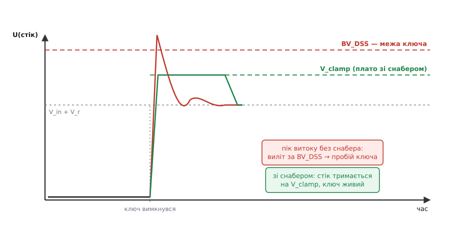
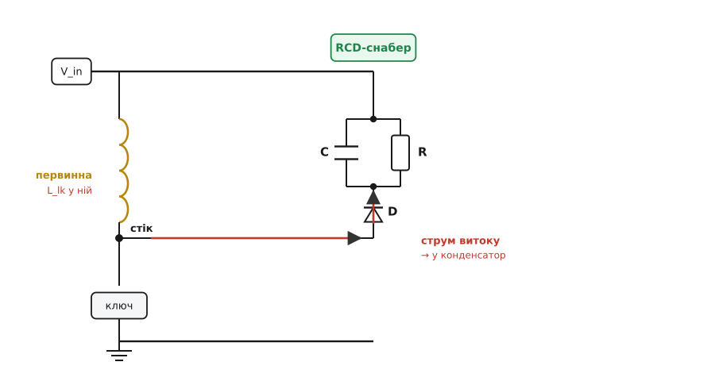
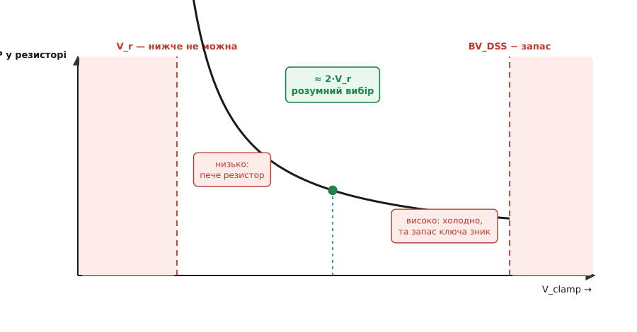

# RCD-снабер для flyback

<preknowlist>
- [Flyback-перетворювач](book:electronics/flyback-isolated) — ізольована топологія «накопичити в осерді на ВКЛ, віддати у вторинну на ВИКЛ»; що таке первинна обмотка, стік ключа й відбита напруга.
- [Спарена котушка й індуктивність витоку](book:electronics/coupled-inductor) — обмотки зчеплені не на 100 %; незчеплена частка = послідовна котушка витоку, чия енергія не переходить у пару.
- [Брикання котушки](book:electronics/inductor-kickback) — рвеш струм індуктивності → вона викидає сплеск напруги (L·di/dt); базова причина проблеми.
- [Силовий ключ (MOSFET)](book:electronics/mosfet-power-switch) — що таке максимальна напруга стік-витік BV_DSS і чому її не можна перевищувати.
</preknowlist>

У кожному зарядному адаптері, кожному ізольованому джерелі на кілька ват стоїть маленька непоказна ланка з трьох деталей: діод, конденсатор і резистор, увімкнені поряд із силовим транзистором. Без неї перетворювач працює лічені секунди — транзистор пробиває й вигоряє. Ця ланка зветься **RCD-снабер** (від назв деталей: R — resistor, C — capacitor, D — diode; *snubber* — англ. «глушник, той, що втихомирює»). Її єдина робота — приборкати різкий викид напруги, який flyback народжує на кожному циклі. Розберімо, звідки цей викид береться, чому саме такий рятунок, і як порахувати три його номінали, щоб транзистор жив, а перетворювач не грівся дарма.

## Звідки викид: енергії витоку нема куди подітися

[Трансформатор flyback](book:electronics/flyback-isolated) — це насправді [спарена котушка](book:electronics/coupled-inductor): осердя запасає енергію, поки ключ відкритий, і віддає її у вторинну обмотку, щойно ключ закрився. Але реальні обмотки зчеплені **не на всі сто**. Частина магнітного потоку первинної замикається повз вторинну — ця «нічия» частка поводиться як окрема маленька котушка, послідовна з первинною обмоткою. Її звуть **індуктивністю витоку** (*leakage inductance*), позначають L_lk, і зазвичай це кілька мікрогенрі — крихта проти сотень мікрогенрі самої первинної.

Поки ключ відкритий, крізь первинну (а отже, і крізь витік) наростає струм. У ньому запасається енергія — і в головній індуктивності, і в цій паразитній котушці витоку. Настає мить вимикання. Головна енергія осердя знає, куди піти: вона зчеплена з вторинною, тож перекидається туди й тече в навантаження. А от енергія витоку зчеплена **ні з чим** — на те він і витік. Перекинутися у вторинну вона не може. Але струм крізь котушку не можна обірвати миттєво: [котушка, чий струм рвуть](book:electronics/inductor-kickback), відповідає викидом напруги за законом

```
U_L = L · di/dt
```

Ключ намагається обірвати струм за десятки наносекунд — di/dt величезне, і навіть кілька мікрогенрі витоку дають сотні вольт викиду. Цей струм, якому раптом перекрили дорогу, кидається в єдине, що лишилося: у власну паразитну ємність стоку транзистора. Він її заряджає — і напруга на стоку злітає гострим піком угору.

Погляньмо, що взагалі стоїть на стоку flyback-ключа після вимикання. Знизу — вхідна напруга живлення V_in. Згори до неї додається **відбита напруга** (*reflected voltage*) V_r — це вихідна напруга, перерахована через коефіцієнт витків у первинну сторону; саме вона тримає діод вторинної відкритим, поки осердя віддає енергію. Тобто навіть у ідеальному світі стік спокійно сидить на рівні V_in + V_r. А тепер згори на цей рівень сідає ще й гострий пік витоку — і сумарна напруга легко перестрибує **BV_DSS**, граничну напругу стік-витік транзистора. Один такий перестриб — і [ключ](book:electronics/mosfet-power-switch) пробитий.


*Без снабера пік індуктивності витоку (червоний) сідає поверх плато V_in+V_r і вилітає за BV_DSS — ключ пробитий. RCD-снабер утримує стік на рівні V_clamp (зелений), безпечно нижче за BV_DSS; уся енергія викиду йде в резистор снабера.*

> 🔧 **Навіщо це.** Це найпоширеніша причина, чому свіжозібраний flyback «димить на увімкненні». Осцилограф на стоку показує гострий дзвін під самісіньку межу транзистора або за неї. Витоку не видно в жодному номіналі схеми — він народжується в намотці трансформатора, і бореться з ним саме снабер. Тому RCD-ланку закладають **до** першого ввімкнення, а не після того, як згорів перший ключ.

## Чому саме R, C і D: кожна деталь на своєму місці

Ідея снабера проста: дати енергії витоку **окремий, визначений шлях**, замість того щоб вона пробивала транзистор. Але шлях цей має відкриватися лише в потрібну мить і в потрібному напрямку. Звідси й три деталі, кожна зі своєю роллю.

**Діод** — однобічний клапан. Його вмикають від стоку до конденсатора снабера так, щоб він відкривався **лише** тоді, коли напруга на стоку перевищить напругу на конденсаторі. Поки стік нижчий — діод замкнений, снабер спить і нічого не відбирає. Щойно пік витоку підняв стік вище за рівень конденсатора — діод відкривається й пускає надлишковий струм витоку в конденсатор. Ця однобічність критична: без діода конденсатор просто висів би на стоку паралельно й дзвенів би разом із ним щоцикла, марнуючи енергію постійно.

**Конденсатор** — накопичувач-буфер. Він приймає в себе струм витоку й тим не дає напрузі стрибнути далі: заряд розтікається в ємність, а не жене вольтаж угору. Конденсатор беруть достатньо великим, щоб за один кидок витоку його напруга піднялася лише трохи — тоді впродовж циклу він тримає майже **сталий** рівень, який і зветься **напругою фіксації** V_clamp. По суті снабер перетворює гострий короткий пік на пологе плато: та сама енергія, але розмазана в часі й обмежена по висоті.

**Резистор** — випускний клапан і пічка. Якби конденсатор лише набирав заряд щоцикла, його напруга росла б без упину, поки знову не досягла б небезпечних значень. Резистор увімкнений паралельно конденсатору й повільно розряджає його між кидками — зливає накопичену енергію, обертаючи її на тепло. У сталому режимі встановлюється рівновага: скільки енергії витоку конденсатор набрав за цикл, стільки ж резистор устиг злити. Саме резистор і є тим місцем, де енергія витоку зрештою гине.


*RCD-ланку вмикають від шини живлення V_in до стоку ключа, паралельно первинній обмотці. При вимиканні струм витоку (червоний) уже не має ходу в осердя — і йде крізь діод у конденсатор, підіймаючи його до V_clamp. Резистор поміж кидками зливає цей заряд у тепло, тримаючи рівень сталим.*

Разом виходить чіткий цикл. Ключ вимкнувся → пік витоку підняв стік → діод відкрився → струм витоку злився в конденсатор, піднявши його до V_clamp → діод замкнувся → упродовж решти циклу резистор потроху розрядив конденсатор назад. І так щоразу. Стік ніколи не переступає V_clamp + невелику пульсацію — а цей рівень ми ставимо самі, вибором номіналів, безпечно нижче за BV_DSS.

## Головний компроміс: де поставити плато

Тут криється вся інженерія снабера, і вона на диво чесна. Куди ставити V_clamp? Начебто хочеться поставити його якнайнижче — щоб транзистор мав велику фору до свого BV_DSS, жив безпечно. Але нижче плато коштує дорожче теплом. І ось чому.

Уявімо баланс потужностей на резисторі. Конденсатор тримає майже сталий V_clamp, отже, на резисторі теж стоїть V_clamp, і він розсіює

```
P_R = V_clamp² / R
```

Ця потужність мусить дорівнювати тому, що вливається в снабер щоцикла. А вливається туди **не лише** енергія витоку. Поки стік стоїть на V_clamp, а відбита напруга V_r менша за нього, різниця (V_clamp − V_r) далі жене струм крізь витік у снабер — і цю додаткову енергію постачає вже сам вхід. Тобто снабер розсіює енергію витоку **плюс** трохи «накачки» від входу, і що ближче V_clamp до V_r, то довше витік доганяється й то більше цієї накачки. Точний баланс дає класичну проєктну формулу для резистора:

```
        V_clamp · (V_clamp − V_r)
R = ─────────────────────────────────
        ½ · L_lk · I_pk² · f_sw
```

де V_r — відбита напруга, L_lk — індуктивність витоку, I_pk — піковий струм первинної в момент вимикання, f_sw — частота перемикання. Знаменник — це просто потужність, яку витік приносить сам по собі (енергія ½·L_lk·I_pk² помножена на кількість циклів за секунду f_sw).

Придивімося до формули — вона розповідає всю історію. У знаменнику стоїть різниця (V_clamp − V_r), і саме вона керує компромісом. Поставиш V_clamp низько, ледь вище за V_r — різниця крихітна, R виходить малий, а мала R при сталому V_clamp означає **велику** розсіювану потужність V_clamp²/R. Плато низьке й безпечне, зате пічка пече. Піднімеш V_clamp вище — різниця росте, R росте, розсіювана потужність падає. Плато вище (транзистор ближче до межі), зате втрати менші. Класичний вибір ставлять десь так, щоб V_clamp було приблизно вдвічі за V_r: тоді (V_clamp − V_r) ≈ V_r, компроміс збалансований — і транзистор ще має запас, і резистор не розжарюється. Відомий орієнтир: коли надлишок над відбитою дорівнює половині відбитої напруги, снабер розсіює приблизно **потрійну** енергію витоку — за це «потрійне» ми й купуємо помірний рівень фіксації.

І є жорстка стеля згори, яку не можна переступати за жодних міркувань про ККД:

```
V_in(макс) + V_clamp  <  BV_DSS  (з запасом)
```

Стік бачить суму вхідної й фіксації; ця сума мусить лишатися нижче за граничну напругу транзистора з добрим запасом (звичайно закладають хоча б 10–20 % на розкид, температуру й дзвін поверх плато). Ось чому вибір V_clamp — це завжди затиск між двома стінами: **знизу** його підпирає відбита напруга V_r (нижче не можна — снабер перестане працювати), **згори** — межа транзистора мінус запас. У цей коридор і треба влучити.


*Опустиш V_clamp до V_r — резистор пече (P росте), хоч запас ключа величезний. Піднімеш до BV_DSS — резистор холодний, та запас ключа зникає. Розумний вибір — приблизно вдвічі за V_r: і втрати помірні, і до межі транзистора лишається фора.*

## Порахуймо на пальцях

Візьмімо типовий мережевий адаптер на кілька ват. Після [мостового випрямляча](book:electronics/bridge-rectifier) на вході стоїть приблизно V_in ≈ 325 В (пік від 230 В мережі). Трансформатор дає відбиту напругу V_r ≈ 100 В. Індуктивність витоку L_lk ≈ 5 мкГ, піковий струм первинної I_pk ≈ 1 А, частота f_sw = 65 кГц. Транзистор — на BV_DSS = 650 В.

**Крок 1. Скільки енергії кидає витік за секунду?**

```
E_lk = ½ · L_lk · I_pk²  = 0.5 · 5e-6 · 1²  = 2.5 мкДж
P_lk = E_lk · f_sw        = 2.5e-6 · 65000   ≈ 0.16 Вт
```

Небагато на перший погляд — але ці 0.16 вата летять у стік гострими піками, і без снабера кожен пік пробиває транзистор.

**Крок 2. Обираємо рівень фіксації.** Ставимо V_clamp = 200 В — це вдвічі за V_r, збалансований вибір. Перевіримо стелю: V_in + V_clamp = 325 + 200 = 525 В проти BV_DSS = 650 В. Запас 650 − 525 = 125 В, тобто ~19 % — комфортно.

**Крок 3. Рахуємо резистор.**

```
        V_clamp · (V_clamp − V_r)      200 · (200 − 100)
R = ─────────────────────────────── = ───────────────────── ≈ 123 кОм
          ½ · L_lk · I_pk² · f_sw            0.16
```

Беремо найближчий стандартний — 120 кОм. Скільки він розсіє?

```
P_R = V_clamp² / R  = 200² / 120000  ≈ 0.33 Вт
```

Ставимо резистор на 0.5 Вт (краще 1 Вт з запасом). Зверни увагу: 0.33 вата проти 0.16 вата чистого витоку — це і є та «накачка» від входу, майже подвоєння; поставили б V_clamp нижче — розсіювання злетіло б іще вище.

**Крок 4. Конденсатор.** Його беруть так, щоб за один кидок витоку напруга піднялася лише на кілька відсотків V_clamp — тоді плато справді пласке. Практичний орієнтир — щоб стала часу розряду R·C була помітно більша за період (тоді між кидками конденсатор майже не встигає розрядитися):

```
T = 1 / f_sw = 1 / 65000 ≈ 15 мкс
беремо R·C ≈ (5…10)·T:   C ≈ 10·15e-6 / 120000 ≈ 1.2 нФ
```

Округляємо до 1 нФ (стандартний). І — важлива деталь — конденсатор мусить бути на робочу напругу з запасом (щонайменше на 250–400 В, бо на ньому стоїть V_clamp), а сам стійкий до імпульсних струмів (плівковий, а не дешевий керамічний класу з великим спадом ємності від напруги).

Ось як цей розрахунок виглядає в коді прошивки — якщо, скажімо, треба на льоту підбирати номінали під різні трансформатори в інструменті проєктувальника:

**Розрахунок RCD-снабера для заданого трансформатора та ключа**

:::tabs
```cpp
#include <optional>
#include <print>

struct Snubber { double r, p, c; };   // резистор (Ом), розсіювання (Вт), ємність (Ф)

// Порахувати резистор і потужність снабера; повернути порожнє, якщо вибір
// V_clamp негодящий (нижче за відбиту або вище за стелю транзистора з запасом).
std::optional<Snubber> rcd_snubber(double v_in,     // вхідна напруга (В)
                                   double v_r,      // відбита напруга (В)
                                   double l_lk,     // індуктивність витоку (Гн)
                                   double i_pk,     // піковий струм первинної (А)
                                   double f_sw,     // частота (Гц)
                                   double v_clamp,  // бажаний рівень фіксації (В)
                                   double bv_dss,   // гранична напруга ключа (В)
                                   double margin)   // запас до BV_DSS, 0.15 = 15 %
{
    if (v_clamp <= v_r)                              // нижче за відбиту — снабер не працює
        return std::nullopt;
    if (v_in + v_clamp > bv_dss * (1.0 - margin))    // за стелю транзистора
        return std::nullopt;

    double p_lk = 0.5 * l_lk * i_pk * i_pk * f_sw;   // потужність витоку (Вт)
    double r = v_clamp * (v_clamp - v_r) / p_lk;     // резистор (Ом)
    double p = v_clamp * v_clamp / r;                // розсіювання на R (Вт)
    double c = 10.0 / (r * f_sw);                    // C з R·C ≈ 10·період (Ф)
    return Snubber{r, p, c};
}

int main()
{
    if (auto s = rcd_snubber(325, 100, 5e-6, 1.0, 65000, 200, 650, 0.15))
        std::println("R = {:.0f} кОм,  P = {:.2f} Вт,  C = {:.1f} нФ",
                     s->r / 1e3, s->p, s->c * 1e9);
    else
        std::println("Вибір V_clamp негодящий — перегляньте рівень фіксації");
}
// Вивід: R = 123 кОм,  P = 0.33 Вт,  C = 1.5 нФ
```
```python
# Порахувати резистор і потужність снабера; повернути None, якщо вибір V_clamp
# негодящий (нижче за відбиту або вище за стелю транзистора з запасом).
def rcd_snubber(v_in, v_r, l_lk, i_pk, f_sw, v_clamp, bv_dss, margin):
    # v_in — вхідна напруга (В);  v_r — відбита (В);  l_lk — витік (Гн);
    # i_pk — піковий струм (А);   f_sw — частота (Гц);
    # v_clamp — рівень фіксації (В);  bv_dss — межа ключа (В);  margin — запас
    if v_clamp <= v_r:                          # нижче за відбиту — снабер не працює
        return None
    if v_in + v_clamp > bv_dss * (1.0 - margin):  # за стелю транзистора
        return None

    p_lk = 0.5 * l_lk * i_pk**2 * f_sw          # потужність витоку (Вт)
    r = v_clamp * (v_clamp - v_r) / p_lk        # резистор (Ом)
    p = v_clamp**2 / r                          # розсіювання на R (Вт)
    c = 10.0 / (r * f_sw)                        # C з R·C ≈ 10·період (Ф)
    return r, p, c

res = rcd_snubber(325, 100, 5e-6, 1.0, 65000, 200, 650, 0.15)
if res:
    r, p, c = res
    print(f"R = {r/1e3:.0f} кОм,  P = {p:.2f} Вт,  C = {c*1e9:.1f} нФ")
else:
    print("Вибір V_clamp негодящий — перегляньте рівень фіксації")
# Вивід: R = 123 кОм,  P = 0.33 Вт,  C = 1.5 нФ
```
:::

Код навмисно вертає порожній результат у двох випадках-пастках: коли V_clamp опустили нижче за відбиту (формула дала б від'ємний опір — фізичний сигнал «так не буває, снабер весь час відкритий») і коли V_in + V_clamp пробиває стелю транзистора. Обидва — часті помилки початківця, і ловити їх краще на етапі розрахунку, ніж на палаючому ключі.

## Діод, який не можна ставити абияк

Три деталі снабера рівноправні на схемі, але діод має вимогу, про яку легко забути. Він відкривається й закривається **на кожному** циклі перетворювача — 65 тисяч разів за секунду в нашому прикладі, а в сучасних адаптерах і більше. І закриватися він мусить **швидко**. Якщо діод «залипає» відкритим на мить після того, як напруга змінила знак — а звичайні випрямні діоди саме так і роблять через [зворотне відновлення](book:electronics/reverse-recovery) заряду, — то щоцикла крізь нього протікає паразитний зворотний струм, гріючи діод і саму ланку, а часом і породжуючи власний дзвін. Тому в снабер ставлять **швидкий** (ultrafast) діод із коротким часом відновлення й на достатню напругу (він бачить ту саму суму V_in + V_clamp, що й транзистор). Дешевий мережевий діод типу 1N400x тут — типова помилка: він занадто повільний і сам стане джерелом втрат та шуму.

## Коли RCD — не найкращий вибір

RCD чесний і дешевий, але він **завжди спалює** енергію витоку в резисторі — це його природа. На малих потужностях ці частки вата нікого не турбують. Але там, де за кожен відсоток ККД борються, або де витоку багато, дисипативний снабер стає помітним тягарем. Тоді дивляться в бік інших рішень, і корисно знати межу застосовності.

Найпростіша альтернатива — **захисний діод TVS** (*transient voltage suppressor*) замість RC-ланки: він просто «зрізає» все, що вище за свою напругу пробою, як запобіжний клапан. Схема простіша (одна деталь замість трьох), рівень фіксації чіткіший і стабільніший, але вся енергія так само гине в діоді — тож на потужностях, де RCD вже гарячий, TVS теж не порятунок за ККД, зате виграє простотою й точністю рівня. Детальніше — у статті про [TVS-діод](book:electronics/tvs-diode).

Коли ж ККД справді критичний, ідуть далі — до **активного затиску** (*active clamp*): замість резистора-пічки ставлять другий керований ключ, який ловить енергію витоку в конденсатор і **повертає** її назад у схему замість того, щоб палити. Це вже не снабер, а окрема топологія зі своїм керуванням і своїми складнощами — але вона піднімає ККД там, де кожен ват на рахунку. RCD ж лишається робочою конякою всюди, де важливіші простота, ціна й надійність, а не остання крапля ККД, — тобто в переважній більшості дрібних адаптерів довкола нас.

Отже, вся суть RCD-снабера складається в одну думку: індуктивність витоку flyback запасає енергію, якій нікуди подітися при вимиканні ключа, і ця енергія б'є викидом напруги, здатним пробити транзистор. Снабер дає викиду визначений шлях — діод впускає, конденсатор буферує, резистор спалює, — тримаючи стік на безпечному плато під граничною напругою ключа. Три номінали рахуються з балансу потужностей, а весь вибір зводиться до одного рішення: де поставити плато між відбитою напругою знизу й межею транзистора згори, платячи за нижче й безпечніше плато більшим теплом у резисторі.
