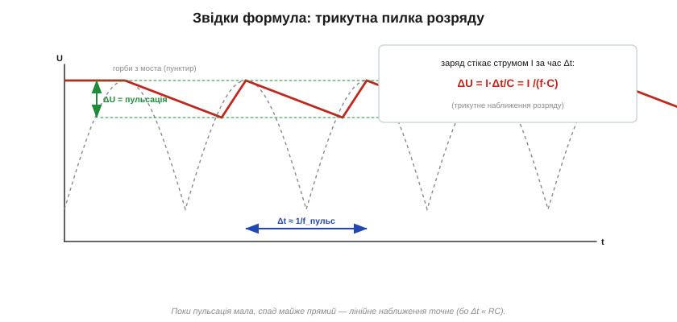
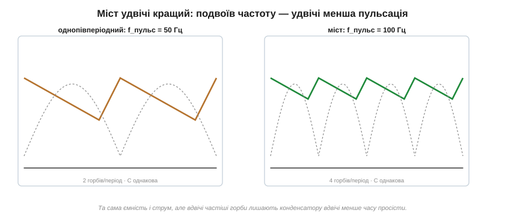
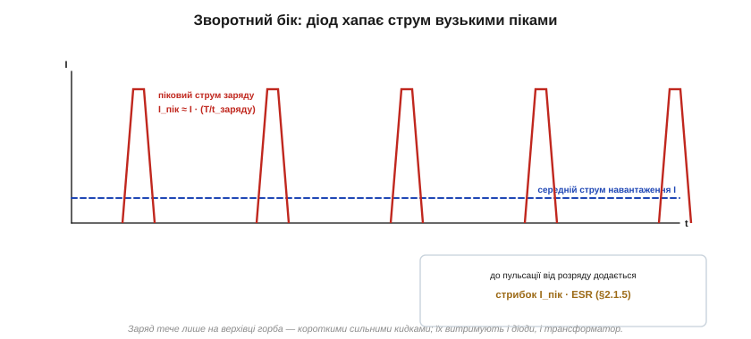

# 🧮 Пульсації після випрямляча: як вибрати згладжувальний конденсатор

> Це математична вставка про пульсації після [випрямляча](book:electronics/rectification). Якісна картина проста: конденсатор заряджається на піках і розряджається в западинах, лишаючи невелику «брижу». Тут перетворимо це на формулу — щоб під задану пульсацію **порахувати ємність**, побачити в числах, чому міст удвічі кращий за однопівперіодний, і не забути про дві пастки: кидок струму заряду й внесок ESR.

### Виведення: пульсація — це розряд за час між горбами

Уся арифметика будується на одному факті про [ємність](book:electronics/capacitance): заряд конденсатора Q = C·U. Подивімося, що з ним коїться за один період пульсації. На верхівці горба діоди підзаряджають конденсатор до піка. Щойно горб пішов на спад, діоди замикаються — і навантаження живиться **тільки з конденсатора**, який віддає струм I протягом часу Δt до наступного горба:


*Рис. Між горбами конденсатор розряджається струмом навантаження майже по прямій. Втрачений заряд ΔQ = I·Δt опускає напругу на ΔU = ΔQ/C. Це і є пульсація.*

Записуємо втрачений заряд двома способами й прирівнюємо:

```
ΔQ = I · Δt        (стекло струму I за час Δt)
ΔQ = C · ΔU        (заряд конденсатора впав на ΔU)
⇒  ΔU = I · Δt / C
```

А час між горбами Δt — це період пульсації, тобто 1/f_пульс. Звідси робоча формула, яку варто пам'ятати:

```
U_пульс ≈ I / (f_пульс · C)
```

Ми зробили одне спрощення — припустили, що **спад лінійний** (трикутна пилка), хоча насправді конденсатор розряджається на резистор експонентою (із [сталою часу RC](book:electronics/rc-time-constant)). Але саме тут і ховається краса: поки пульсація мала (а її для того й роблять малою), час розряду Δt набагато менший за сталу τ = RC, а на початку експонента майже пряма. Тож трикутне наближення не просто зручне — воно й точне для будь-якого пристойного блока живлення.

### Чому міст удвічі кращий — у числах

Повне випрямлення згладжується легше за однопівперіодне — і формула показує **чому саме вдвічі**: у ній сидить f_пульс, а вона в моста вдвічі вища.


*Рис. Однопівперіодний випрямляч дає 50 горбів на секунду, міст — 100. За тієї самої ємності й струму вдвічі частіші горби лишають конденсатору вдвічі менше часу просісти — і пульсація вдвічі менша.*

```
однопівперіодний:  f_пульс = 50 Гц   (один горб на період мережі)
міст (двопівперіодний): f_пульс = 100 Гц  (обидві півхвилі)
```

Підставивши 100 замість 50, дістаємо вдвічі меншу U_пульс — або, що те саме, вдвічі меншу потрібну ємність за тієї самої брижі. Це і є кількісна перевага моста, додатково до того, що він не марнує половину енергії.

### Приклад: підбираємо ємність

Обернемо формулу — адже на практиці задають **допустиму** пульсацію, а шукають C:

```
C ≈ I / (f_пульс · U_пульс)
```

**Задача.** Мостовий випрямляч (f_пульс = 100 Гц) живить навантаження I = 0.5 А; хочемо пульсацію не більше U_пульс = 1 В.

```
C ≈ 0.5 / (100 · 1) = 0.005 Ф = 5000 мкФ
```

П'ять тисяч мікрофарад — ось чому в блоках живлення стоять такі великі «бочки». І одразу видно всі важелі: подвоїти струм навантаження — подвоїти ємність; удвічі зменшити дозволену брижу — знову подвоїти; перейти з моста на однопівперіодну схему — знову вдвічі більший конденсатор. Корисно й прикинути сталу часу розряду: при U ≈ 15 В і I = 0.5 А навантаження виглядає як R = 30 Ом, тож τ = RC = 30 · 0.005 = 150 мс — справді набагато більше за Δt = 10 мс, що й виправдовує лінійне наближення.

### Пастка перша: кидок струму заряду

За малу пульсацію доводиться платити, і платіж бере діод. Конденсатор віддає заряд **повільно** (увесь час Δt між горбами), а добирає його назад **швидко** — лише за коротку верхівку горба, коли вхідна напруга вища за напругу на ньому:


*Рис. Середній струм навантаження тече рівно, а діод подає його вузькими сильними кидками на верхівках горбів. Що більший конденсатор і менша пульсація, то вужчий і вищий пік.*

Закон збереження заряду невблаганний: весь заряд, що стік за період, діод мусить повернути за коротку частку t_заряду цього періоду. Тому піковий струм у рази більший за середній:

```
I_пік ≈ I · (T_пульс / t_заряду)
```

Якщо заряд триває лише десяту частину періоду, піки вдесятеро вищі за середній струм. Парадокс проєктування: **що краще ми згладжуємо** (більша C, менша пульсація), **то коротший і гостріший** кидок — і то важче доводиться діодам мосту й трансформатору. Саме тому випрямні діоди беруть із запасом не лише за середнім струмом, а й за піковим (*surge current* у даташиті), а у великих блоках інколи ставлять терморезистор, що гасить початковий кидок при ввімкненні.

### Пастка друга: ESR додає свою брижу

Наша формула вважала конденсатор ідеальним. Реальний має [послідовний опір ESR](book:electronics/capacitor-parasitics) — і той самий гострий піковий струм, протікаючи крізь ESR, дає **додаткову** пульсацію стрибками:

```
U_пульс(повна) ≈ I/(f·C)   +   I_пік · ESR
                 ─────────       ──────────
                 від розряду     від опору
```

У потужних низьковольтних блоках ESR-складова часом **переважує** ту, що від розряду, — і тоді нарощувати ємність марно: треба брати конденсатор із **низьким ESR** (або кілька паралельно). Ось чому в живленні стоять спеціальні «low-ESR» конденсатори, а не просто найбільші за ємністю.

### Де це працює

Формула U_пульс ≈ I/(f·C) — перший інструмент проєктування будь-якого лінійного блока живлення: вона зв'язує ємність, струм і брижу в одному рядку. Та сама логіка «заряд = струм × час» працює всюди, де конденсатор тримає напругу між підзарядками — від [резервного живлення на суперконденсаторі](book:electronics/supercapacitor) до розв'язки шин. А лишок пульсації, який конденсатор не подужав, добирає стабілізатор — найпростіший із них стоїть на [діоді Зенера](book:electronics/zener-schottky). Дві пастки — кидок струму й ESR — нагадують головне: у реальній схемі ідеальних деталей немає, і часто саме їхні «дрібні» недоліки диктують вибір.
