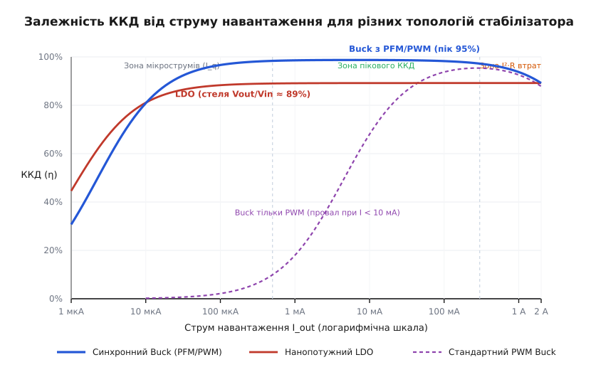
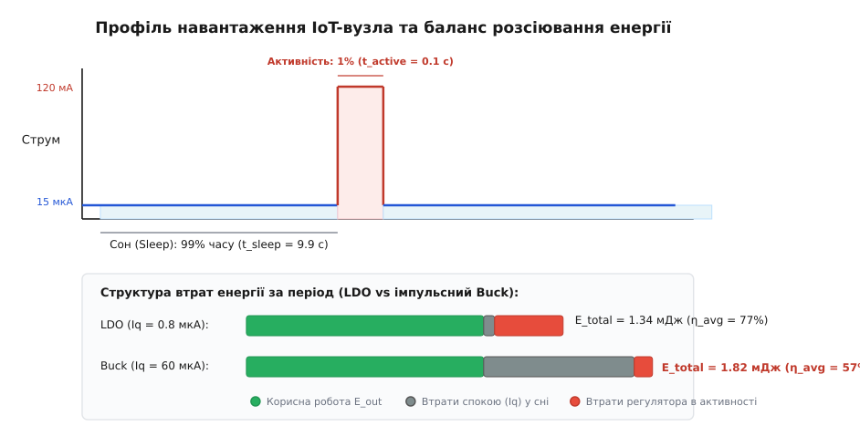
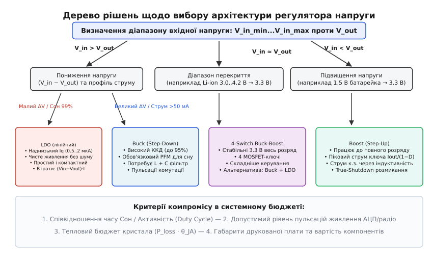
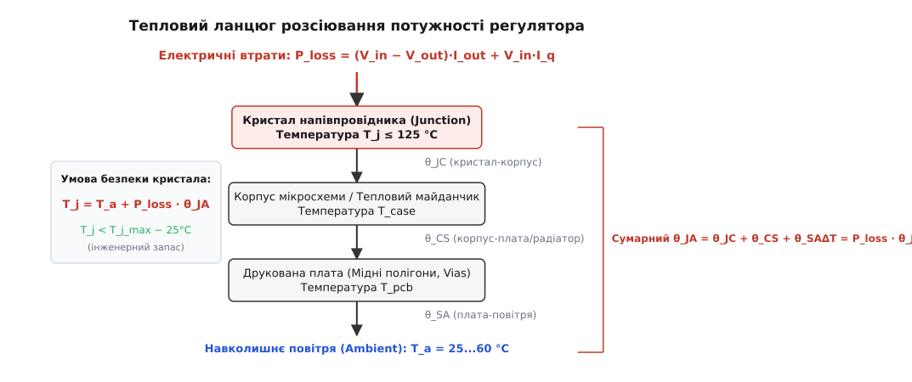

# ККД регулятора в енергетичному бюджеті

<preknowlist>
- [Закон Ома](book:electronics/ohms-law) — зв'язок напруги, струму та опору в електричному колі.
- [LDO](book:electronics/ldo) — принцип лінійного регулювання напруги та втрати на спаді напруги регулювального ключа.
- [Buck-перетворювач](book:electronics/buck) — імпульсне пониження напруги через періодичну комутацію та накопичення енергії в індуктивності.
- [Бюджет енергії](book:electronics/energy-budget) — баланс потужності та розрахунок споживання вузлів системи в часі.
- [Енергія й тепло](book:electronics/companion-power-thermal) — розсіювання потужності втрат та нагрівання компонентів.
</preknowlist>

Бездротовий датчик температури з живленням від літієвої батарейки ємністю `1000 мА·год` споживає в активному режимі передачі `100 мА` протягом `50 мс`, а решту часу — `9.95 с` із кожного десятисекундного циклу — спить зі струмом `15 мкА`. Інженер обирає імпульсний понижувальний стабілізатор, спокусившись написом на першій сторінці документації: «ККД до 95%». Простий розрахунок обіцяє понад три роки безперервної автономної роботи. Проте реальний пристрій на стенді розряджає нову батарею менш ніж за сорок днів. Перетворювач, який демонструє бездоганні `95%` ефективності під час активного зв'язку, у фазі глибокого сну перетворюється на паразитного споживача, де його власний коефіцієнт корисної дії обвалюється нижче `20%`. Одиничне паспортне число виявилося не характеристикою схеми, а значенням в одній-єдиній точці, у якій пристрій перебуває лише пів відсотка свого життєвого часу.

Енергетичний бюджет автономного приладу визначається не піковим ККД перетворювача, а інтегралом втрат потужності за всіма робочими станами. Щоб змусити пристрій працювати роками, схемотехнік повинен розкласти роботу стабілізатора на фізичні механізми втрат, зрозуміти поведінку кривої ефективності у всьому діапазоні струмів — від наноамперів до одиниць амперів — і узгодити профіль навантаження з тепловим бюджетом кристала.

---

## Анатомія втрат: чому падає ККД регуляторів

Коефіцієнт корисної дії `η` (грец. *ἦτα*, у фізиці — міра ефективності перетворення енергії, від лат. *efficere* — здійснювати) визначається як відношення корисної вихідної потужності `P_out`, що надходить у корисне навантаження, до повної електричної потужності `P_in`, відібраної від первинного джерела:

```
η = P_out / P_in = (V_out · I_out) / (V_in · I_in)
```

Різниця між цими потужностями є потужністю втрат `P_loss = P_in - P_out`. Уся втрачена енергія незворотно перетворюється на тепло на кристалі та пасивних елементах схеми. Природа цих втрат кардинально відрізняється для лінійних та імпульсних топологій.

### Механізм втрат лінійного регулятора (LDO)

Лінійний стабілізатор з малим спадом напруги (англ. *Low-Dropout Regulator*, LDO) працює за принципом керованого подільника напруги. Його силовий елемент — P-канальний MOSFET або біполярний PNP-транзистор — працює в активній (лінійній) області, безперервно підтримуючи такий динамічний опір каналу, щоб на виході залишалася строго задана напруга `V_out`.

Вхідний струм LDO дорівнює струму навантаження плюс власний струм спокою кіл керування `I_q` (англ. *quiescent current*, від лат. *quiescere* — перебувати в спокої): `I_in = I_out + I_q`. Звідси потужність втрат лінійного регулятора описується виразом:

```
P_loss_LDO = (V_in - V_out) · I_out + V_in · I_q
```

Вираз містить два доданки з абсолютно різною фізикою:
1. **Втрати на спаді напруги прохідного елемента `(V_in - V_out) · I_out`:** регулювальний транзистор пропускає повний струм навантаження під різницею потенціалів `(V_in - V_out)`. Ці втрати прямо пропорційні струму навантаження і величині перепаду напруг.
2. **Втрати струму спокою `V_in · I_q`:** струм, необхідний для живлення внутрішнього джерела опорної напруги (Bandgap), підсилювача похибки та вимірювального резистивного дільника. Цей струм протікає на землю завжди, навіть коли навантаження повністю відключене (`I_out = 0`).

Коли струм навантаження великий (`I_out >> I_q`), струмом спокою можна знехтувати, і ККД лінійного регулятора наближається до свого теоретичного максимуму:

```
η_LDO ≈ V_out / V_in
```

Це рівняння виявляє жорстку стелю: ККД лінійного регулятора принципово не може перевищити співвідношення вихідної напруги до вхідної. Якщо LDO живить мікроконтролер `3.3 В` від автомобільної шини `12 В`, його ККД за визначенням становить `3.3 / 12 = 27.5%`. Решта `72.5%` енергії акумулятора перетворюється на нагрівання корпусу стабілізатора. Проте якщо той самий регулятор живить шину `3.3 В` від літій-залізо-фосфатної батареї LiFePO4 з напругою `3.6 В`, ККД досягає `3.3 / 3.6 = 91.6%` — показник, що конкурує з найкращими імпульсними перетворювачами, але без жодних високочастотних завад і без потреби в габаритній котушці індуктивності.

При мікрострумах (`I_out < I_q`) доданок `V_in · I_q` починає переважати, і ККД лінійного стабілізатора падає до нуля.

---

### Механізм втрат імпульсного перетворювача (Buck / Boost)

Імпульсний перетворювач (англ. *Switching Mode Power Supply*, SMPS) передає енергію порціями: силові MOSFET-ключі працюють виключно в ключовому режимі (або повністю відкриті з мінімальним опором `R_ds_on`, або повністю закриті), а проміжне накопичення енергії забезпечує магнітне поле дроселя `L`.

Повні втрати імпульсного регулятора розпадаються на три групи, які по-різному залежать від навантаження:

```
P_loss_SMPS = P_fixed + P_switching(I_out) + P_conduction(I_out²)
```


*Криві ККД LDO та імпульсних перетворювачів: провал при мікрострумах через струм спокою Iq, пік узгодження втрат і спад при великих струмах через омічні втрати I²·R.*

#### 1. Статичні та фіксовані втрати `P_fixed`

Ця група втрат не залежить від вихідного струму навантаження:
- **Струм спокою аналогових блоків `P_q = V_in · I_q`:** живлення внутрішнього генератора пилкоподібної напруги, компараторів ШІМ, логіки захисту від короткого замикання та схеми захисту від перегріву.
- **Втрати на перезаряджання затворів (Gate Drive) `P_gate = Q_g_tot · V_drv · f_sw`:** щоразу, коли драйвер відкриває і закриває силовий польовий транзистор, паразитна ємність затвора повинна зарядитися до напруги керування `V_drv`, а потім розрядитися на землю. Енергія, витрачена за один такт, дорівнює `Q_g · V_drv`. Помножена на частоту комутації `f_sw` (герци), вона дає постійну потужність втрат, пропорційну частоті.
- **Втрати в осерді індуктивності (Core Loss) `P_core`:** циклічне перемагнічування феритового або порошкового матеріалу осердя дроселя викликає втрати на магнітний гістерезис і вихрові струми Фуко. Вони зростають пропорційно частоті в степені `1.3...1.8` і розмаху індукції `ΔB`.

#### 2. Динамічні комутаційні втрати перекриття `P_switching`

Під час перемикання силовий MOSFET не може змінити свій стан миттєво через скінченну швидкість перезаряджання ємності Міллера `C_gd`. Протягом часу наростання `t_r` (англ. *rise time*) та часу спаду `t_f` (англ. *fall time*) через транзистор уже протікає значний струм навантаження, тоді як напруга на його виводах стік-витік ще не впала до нуля.

Втрати перекриття напруги і струму за період комутації прямо пропорційні вихідному струму та робочій частоті:

```
P_sw = 0.5 · V_in · I_out · (t_r + t_f) · f_sw
```

Сюди ж належать втрати на зворотне відновлення заряду (англ. *Reverse Recovery*, `Q_rr`) внутрішнього паразитного body-діода нижнього синхронного MOSFET або діода Шотткі: `P_rr = Q_rr · V_in · f_sw`.

#### 3. Провідні (омічні) втрати `P_conduction`

Коли транзистори відкриті, струм індуктивності тече крізь активні опори провідників силового контуру. Згідно із законом Джоуля-Ленца, потужність втрат зростає строго квадратично від струму:

```
P_cond = I_out² · R_eq
```

Еквівалентний опір `R_eq` складається з послідовного ланцюга:
- Опір відкритого каналу верхнього транзистора `R_ds_on_high`, помножений на коефіцієнт заповнення `D = V_out / V_in`;
- Опір відкритого каналу нижнього синхронного транзистора `R_ds_on_low`, помножений на `(1 - D)`;
- Активний опір обмотки індуктивності постійному струму `DCR` (англ. *DC Resistance*);
- Втрати на еквівалентному послідовному опорі `ESR` вхідного та вихідного конденсаторів від протікання пульсуючих струмів.

Детальне математичне виведення еквівалентного опору та рівняння екстремуму кривої наведено у вставці [Математична модель втрат регулятора та інтегральний ККД](book:electronics/regulator-efficiency-budget/math-weighted-efficiency.md).

---

## Форма кривої ККД та режими модуляції (PWM проти PFM)

Крива залежності ККД імпульсного перетворювача від струму навантаження `η(I_out)` має характерний куполоподібний вигляд із трьома вираженими зонами:

1. **Зона мікрострумів (`I_out < 1 мА`):** вихідна корисна потужність `P_out = V_out · I_out` прямує до нуля, тоді як фіксовані втрати `P_fixed` (струм спокою, комутація затворів на сталій частоті `f_sw`) залишаються сталими. Відношення корисної потужності до повної катастрофічно падає.
2. **Зона пікової ефективності (Sweet Spot):** точка, де фіксовані втрати `P_fixed` точно зрівнюються з квадратичними провідними втратами `R_eq · I_out²`. Для типового понижувального регулятора цей оптимум лежить в інтервалі `100...400 мА`, де ККД досягає `92...96%`.
3. **Зона великих струмів:** панують втрати `I_out² · R_eq`. Зі збільшенням навантаження нагрівання провідників збільшує їхній опір (позитивний температурний коефіцієнт міді та кремнію), і ККД плавно спадає до `75...85%`.

### Порятунок мікрострумів: режим пропуску імпульсів (PFM)

Якщо змусити перетворювач перемикатися з фіксованою частотою ШІМ (англ. *Pulse Width Modulation*, PWM) `1.5 МГц` при навантаженні `20 мкА`, енергія кожного такту перевищуватиме потреби навантаження в сотні разів. Щоб утримати напругу, контролер зменшуватиме шпаруватість до мінімально можливої, але комутаційні втрати на затворах `P_gate = Q_g · V_drv · f_sw` залишаться сталими (наприклад, `10...20 мВт`). При корисній потужності `V_out · I_out = 3.3 В · 20 мкА = 66 мкВт` ККД становить менше одного відсотка!

Для боротьби з цим ефектом сучасні мікросхеми перетворювачів оснащують режимом частотно-імпульсної модуляції (англ. *Pulse Frequency Modulation*, PFM), який також називають режимом пропуску імпульсів (Pulse Skipping), сплесковим режимом (Burst Mode) або Eco-mode.

Коли струм навантаження падає нижче порогового рівня (межа переходу в режим переривчастих струмів індуктивності, DCM):
1. Контролер вимикає генератор фіксованої частоти та переводить більшість внутрішніх компараторів у сплячий режим;
2. Силовий ключ відкривається на один або кілька коротких імпульсів фіксованої тривалості, накачуючи вихідний конденсатор порцією енергії;
3. Коли напруга на виході досягає верхнього порогу компаратора, перетворювач повністю припиняє комутацію і «засинає» зі струмом спокою менше `1...2 мкА`;
4. Навантаження живиться виключно зарядом вихідного конденсатора. Що менший струм споживання, то довша пауза між сплесками комутації: ефективна частота комутації падає від сотень кілогерців до кількох герців, пропорційно знижуючи втрати перезаряджання затворів.

Завдяки PFM сучасні імпульсні стабілізатори підтримують ККД на рівні `80...90%` навіть при мікрострумах `50...100 мкА`. Платою за це є збільшення розмаху вихідних пульсацій напруги (до `20...50 мВ` замість `5 мВ` у режимі PWM) та перехід частоти пульсацій у звуковий діапазон, що вимагає уважності при живленні чутливих радіотрактів та аудіопідсилювачів.

---

## Профіль навантаження та середньозважений ККД

Реальні пристрої Інтернету речей (IoT), автономні реєстратори та датчики функціонують циклічно. Їхня робота поділена на дискретні фази (State Machine):


*Часовий розподіл струму навантаження та порівняння структури втрат енергії за період для нанопотужного LDO та класичного Buck-перетворювача.*

Розглянемо типовий цикл бездротового датчика тривалістю `T_cycle = 10 с`:
- **Фаза сну (Sleep):** тривалість `t_sleep = 9.9 с` (99% часу), мікроконтролер у режимі Deep Sleep, працює лише годинник реального часу (RTC), струм навантаження `I_sleep = 15 мкА`, вихідна напруга `3.3 В`. Корисна потужність: `P_out_sleep = 3.3 В · 15 мкА = 49.5 мкВт`.
- **Фаза активності (Burst):** тривалість `t_active = 0.1 с` (1% часу), процесор прокидається, опитує сенсори, обчислює криптографічний підпис і вмикає передавач Bluetooth LE або LoRaWAN зі струмом `I_active = 120 мА`. Корисна потужність: `P_out_active = 3.3 В · 120 мА = 396 мВт`.

Джерело живлення — один літій-іонний акумулятор із середньою напругою `V_in = 3.7 В`.

### Інженерний розрахунок корисної енергії

Корисна енергія `E_out`, яку отримує навантаження за один повний період циклу `10 с`:

```
E_out_sleep  = 49.5 мкВт · 9.9 с ≈ 0.490 мДж
E_out_active = 396 мВт · 0.1 с = 39.600 мДж
E_out_total  = 0.490 + 39.600 = 40.090 мДж
```

Зауважте: хоча стан активності триває лише `1%` часу, на нього припадає `39.6 / 40.09 = 98.78%` усієї корисної енергії навантаження!

### Порівняння трьох схем живлення

#### Сценарій 1: Класичний Buck-перетворювач без PFM (жорсткий PWM)
- В активному режимі (`120 мА`): перетворювач працює біля свого оптимуму з ККД `η_active = 92%`.
- У режимі сну (`15 мкА`): через постійне перемикання ключів на частоті `1.5 МГц` фіксовані втрати становлять `P_fixed = 15 мВт`. Вхідна потужність у сні дорівнює `P_in_sleep = 49.5 мкВт + 15 мВт ≈ 15.05 мВт`, що дає ККД фази сну `η_sleep = 0.0495 / 15.05 = 0.33%`.

Енергія, відібрана від акумулятора за цикл:
```
E_in_sleep  = 15.05 мВт · 9.9 с = 148.995 мДж
E_in_active = 39.6 мДж / 0.92 = 43.043 мДж
E_in_total  = 148.995 + 43.043 = 192.038 мДж
```

Середньозважений системний ККД:
```
η_avg = E_out_total / E_in_total = 40.090 / 192.038 = 20.88%
```

Через високі фонові втрати у сні `77.6%` енергії акумулятора витрачено даремно в режимі очікування!

#### Сценарій 2: Нанопотужний LDO (струм спокою `I_q = 0.8 мкА`)
- В активному режимі (`120 мА`): ККД обмежений спадом напруги: `η_active ≈ 3.3 / 3.7 = 89.19%`.
- У режимі сну (`15 мкА`): струм входу `I_in_sleep = 15 мкА + 0.8 мкА = 15.8 мкА`. Вхідна потужність: `P_in_sleep = 3.7 В · 15.8 мкА = 58.46 мкВт`. ККД фази сну: `η_sleep = 49.5 / 58.46 = 84.67%`.

Енергія, відібрана від акумулятора за цикл:
```
E_in_sleep  = 58.46 мкВт · 9.9 с = 0.579 мДж
E_in_active = 39.6 мДж / 0.8919 = 44.400 мДж
E_in_total  = 0.579 + 44.400 = 44.979 мДж
```

Середньозважений системний ККД:
```
η_avg = 40.090 / 44.979 = 89.13%
```

#### Сценарій 3: Сучасний Buck-перетворювач з ультранизьким PFM (`I_q = 1.5 мкА`)
- В активному режимі (`120 мА`): ККД `η_active = 94%`.
- У режимі сну (`15 мкА`): перетворювач переходить у PFM із частотою кілька герців, ККД становить `η_sleep = 82%`. Вхідна потужність: `P_in_sleep = 49.5 мкВт / 0.82 = 60.37 мкВт`.

Енергія, відібрана від акумулятора за цикл:
```
E_in_sleep  = 60.37 мкВт · 9.9 с = 0.598 мДж
E_in_active = 39.6 мДж / 0.94 = 42.128 мДж
E_in_total  = 0.598 + 42.128 = 42.726 мДж
```

Середньозважений системний ККД:
```
η_avg = 40.090 / 42.726 = 93.83%
```

### Підсумки порівняння тривалості автономної роботи

Для акумулятора ємністю `1200 мА·год` (`3.7 В`, доступна енергія `15.98 кДж` з урахуванням `90%` DoD):
- **Buck без PFM:** `15.98 кДж / (0.192 Дж / 10 с) = 832 291 с` ≈ **9.6 днів**;
- **Нанопотужний LDO:** `15.98 кДж / (0.045 Дж / 10 с) = 3 551 111 с` ≈ **41.1 день**;
- **Buck з PFM:** `15.98 кДж / (0.0427 Дж / 10 с) = 3 742 388 с` ≈ **43.3 дні**.

Простий LDO перевершив дешевий імпульсний перетворювач у **4.3 раза за часом автономності**, поступившись топовому Buck-перетворювачу лише на 5%, при цьому LDO коштує втричі дешевше, не вимагає індуктивності і займає вчетверо менше місця на платі.

Практичний програмний інструмент для автоматичного розрахунку подібних профілів із моделями реальних компонентів розібрано у вставці [Калькулятор енергетичного бюджету та оцінки часу автономності](book:electronics/regulator-efficiency-budget/proj-battery-budget-calculator.md).

---

## Вибір архітектури стабілізації живлення

Вибір топології живлення в системному енергетичному бюджеті здійснюється за деревом інженерних рішень:


*Інженерний алгоритм вибору топології стабілізатора на основі діапазону вхідної та вихідної напруг, середнього струму та вимог до шумів.*

### 1. Пониження напруги (`V_in > V_out`)

- **LDO обирають, коли:**
  1. Різниця напруг мала (`V_in - V_out < 0.5...1.0 В`), що забезпечує власний ККД `>80%`;
  2. Пристрій перебуває в глибокому сні понад `95%` часу, де критичний наднизький струм спокою `I_q < 1 мкА`;
  3. Навантаження чутливе до шуму: високоточні 24-бітні АЦП, малошумні підсилювачі біопотенціалів, ГУН (VCO) радіопередавачів. LDO має коефіцієнт придушення пульсацій живлення (PSRR, англ. *Power Supply Rejection Ratio*) до `60...80 дБ` на низьких частотах і нульовий рівень випромінюваних завад (EMI).
- **Понижувальний Buck обирають, коли:**
  1. Великий перепад напруг (наприклад, `12 В → 3.3 В` або `5 В → 1.2 В`), де LDO спалить понад `60...75%` енергії;
  2. Середній струм навантаження перевищує `50...100 мА`, де втрати тепла в LDO спричинять неприпустимий перегрів кристала;
  3. Обов'язкова наявність автоматичного переходу в режим PFM для збереження ККД у фазах сну.

### 2. Підвищення напруги (`V_in < V_out`)

Якщо джерелом є одна лужна батарейка `1.5 В` або сонячний елемент `0.5...2.0 В`, а навантаженню потрібна шина `3.3 В`, застосовують підвищувальний Boost-перетворювач.

Головна небезпека Boost-топології в енергетичному бюджеті — піковий струм індуктивності. У режимі неперервного струму середній струм котушки пов'язаний із струмом навантаження через шпаруватість:

```
I_L_avg = I_out / (1 - D) = I_out · (V_out / (V_in · η))
```

Якщо батарейка розряджається до `1.0 В`, а радіомодуль споживає `I_out = 100 мА` при `3.3 В` (ККД `85%`), струм через індуктивність досягає:

```
I_L = 0.1 · (3.3 / (1.0 · 0.85)) = 0.388 А = 388 мА
```

При такому струмі внутрішній опір старої батарейки `0.5 Ом` викличе просідання напруги на `0.388 · 0.5 = 0.194 В`, що знизить напругу до `0.8 В`, ще більше збільшить шпаруватість і призведе до лавинного вимкнення за порогом UVLO (Under-Voltage Lockout).

### 3. Діапазон перекриття (`V_in` плаває вище і нижче `V_out`)

Типова ситуація для живлення шини `3.3 В` від Li-ion акумулятора: свіжозаряджений акумулятор має `4.2 В` (`V_in > V_out`), номінальне плато становить `3.7 В`, а наприкінці розряду напруга падає до `2.8...3.0 В` (`V_in < V_out`).

Варіанти схемотехнічних рішень:
- **4-ключовий синхронний Buck-Boost:** забезпечує повний розряд батареї до `2.7 В` зі стабілізацією `3.3 В`. Недолік: у зоні `V_in ≈ V_out` одночасно комутуються всі 4 ключі, що викликає локальний провал ККД на `5...8%` та підвищує струм спокою мікросхеми до `20...40 мкА`.
- **LDO з надмалим падінням напруги (Ultra-Low Dropout):** якщо обрати LDO з опором каналу `R_ds_on = 0.2 Ом`, при струмі `100 мА` спад напруги насичення (Dropout Voltage) становить лише `V_drop = I · R_ds_on = 0.1 · 0.2 = 20 мВ`. Такий регулятор тримає вихід `3.3 В` до напруги батареї `3.32 В`. Оскільки залишковий заряд Li-ion акумулятора нижче `3.3 В` становить менше `3...5%` повної ємності, втратою цих кількох відсотків часто свідомо нехтують заради простоти, низької вартості та крихітного струму спокою LDO.
- **Гібридний каскад (Buck + LDO):** імпульсний Buck понижує напругу від `12 В` до `3.6 В` із високим ККД `93%`, а наступний LDO фільтрує комутаційні шуми і формує ультрачисту шину `3.3 В` для аналогового тракту з втратою лише `(3.6 - 3.3) / 3.6 = 8.3%` енергії.
- **Динамічне керування шляхами живлення (Power Path Management):** у пристроях, що живляться як від акумулятора, так і від зовнішнього інтерфейсу USB (`5 В`), традиційна схема об'єднання джерел на діодах Шотткі (Diode OR-ing) створює паразитно високий спад напруги `0.35...0.5 В`. При струмі навантаження `500 мА` діод Шотткі розсіює `0.35 В · 0.5 А = 175 мВт` у вигляді даремного тепла. Застосування контролерів «ідеального діода» на базі P-канальних MOSFET зменшує прямий спад напруги до `20...30 мВ`, заощаджуючи понад `90%` енергії комутації та запобігаючи неконтрольованому нагріванню плати під час одночасної зарядки та активної роботи приладу.

---

## Динамічний відгук на стрибок навантаження (Load Transient)

У циклічних системах навантаження змінюється стрибкоподібно: під час пробудження мікроконтролера та увімкнення радіотракту струм зростає від `15 мкА` до `120 мА` менш ніж за одну мікросекунду (`di/dt > 100 А/мс`). Жоден регулятор напруги не здатний зреагувати на такий стрибок миттєво, оскільки смуга пропускання його підсилювача похибки та контуру зворотного зв'язку обмежена величиною `f_bw` (зазвичай `20...100 кГц` для нанопотужних стабілізаторів).

Протягом часу затримки реакції контуру регулювання `t_resp ≈ 1 / (2 · π · f_bw)` (для смуги `50 кГц` це приблизно `3.2 мкс`) регулювальний елемент ще залишається закритим, і весь додатковий струм навантаження забезпечується виключно зарядом вихідного конденсатора `C_out`.

Миттєве просідання напруги на вихідній шині (англ. *Voltage Undershoot*) складається з двох компонентів:

```
ΔV_undershoot = (I_step · t_resp) / C_out + I_step · ESR_C
```
де `I_step` — амплітуда стрибка струму, `ESR_C` — еквівалентний послідовний опір вихідного конденсатора.

Якщо для струму `I_step = 100 мА` встановлено керамічний конденсатор ємністю `C_out = 4.7 мкФ` з опором `ESR = 0.02 Ом`, просідання напруги становить:

```
ΔV_undershoot = (0.1 · 3.2 · 10⁻⁶) / (4.7 · 10⁻⁶) + 0.1 · 0.02 [підстановка параметрів]
              = 0.068 В + 0.002 В                    [обчислення доданків]
              = 70 мВ                                [підсумовування спаду напруги]
```

Якщо вихідна ємність занижена (наприклад, `1 мкФ`), просідання напруги досягає `322 мВ`, що знижує напругу шини `3.3 В` до `2.98 В` і викликає скидання мікроконтролера за сигналом Brownout Reset.

Проте надмірне збільшення вихідної ємності (`C_out = 100...470 мкФ`) породжує іншу енергетичну проблему: під час кожного запуску або виходу з глибокого сну на заряджання цієї ємності витрачається енергія `E = 0.5 · C_out · V_out²`. Для конденсатора `100 мкФ` при напрузі `3.3 В` це `0.54 мДж`, що співрозмірно з корисним споживанням усього сенсорного циклу. Оптимальний вибір вихідного конденсатора — це точний компроміс між стійкістю до просідання напруги та мінімізацією енергії перезаряджання.

---

## Схемотехнічна гігієна та паразитні витоки друкованої плати

Застосування нанопотужного стабілізатора зі струмом спокою `I_q = 0.5...1.0 мкА` втрачає будь-який сенс, якщо на друкованій платі допущені типові схемотехнічні та топологічні помилки:

1. **Пастка резистивного подільника зворотного зв'язку:** регульовані версії стабілізаторів (Adjustable) задають вихідну напругу за допомогою зовнішнього подільника `R1/R2`. Класичні номінали `R1 = 100 кОм` та `R2 = 50 кОм` (для виходу `3.3 В` і опори `1.1 В`) постійно споживають струм:
   ```
   I_fb = 3.3 В / (100 кОм + 50 кОм) = 3.3 / 150 000 = 22 мкА
   ```
   Цей струм у 22 рази перевищує струм спокою самого стабілізатора! Для збереження мікрострумового бюджету номінали подільника обирають у мегаомному діапазоні (`R1 = 2.0 МОм`, `R2 = 1.0 МОм`, струм `1.1 мкА`), або використовують мікросхеми з фіксованою вихідною напругою (Fixed Output), де подільник інтегрований у кристал і оптимізований виробником.
2. **Фазове випередження у мегаомному колі:** встановлення мегаомних резисторів утворює паразитний полюс із вхідною ємністю виводу Feedback (`C_pin ≈ 2...5 пФ`), що може порушити стійкість контуру регулювання. Для компенсації фази паралельно верхньому резистору `R1` обов'язково встановлюють конденсатор випередження (Feedforward Capacitor) `C_ff = 10...47 пФ`.
3. **Поверхневі струми витоку та залишки флюсу:** за наявності мікрозабруднень або залишків безвідмивного флюсу (No-Clean Flux) в умовах підвищеної вологості поверхневий опір текстоліту FR-4 між сусідніми провідниками з різницею потенціалів `3.7 В` може падати до `5...10 МОм`. Струм витоку крізь текстоліт досягає `I_leak = 3.7 В / 10 МОм = 0.37 мкА`, що подвоює споживання вузла у фазі сну. Захист вимагає обов'язкового відмивання плати в ультразвуковій ванні зі спеціалізованими розчинниками, трасування охоронних кілець (Guard Rings) навколо високоомних вузлів та нанесення вологозахисного конформного лаку (Conformal Coating).

---

## Тепловий бюджет та розрахунок перегріву кристала

Будь-яка енергія втрат `P_loss` перетворюється на тепло всередині напівпровідникового кристала площею всього `0.5...4 мм²`. Якщо потужність розсіювання перевищить здатність корпусу відводити тепло в навколишнє середовище, температура p-n переходів (Junction Temperature, `T_j`) перетне максимально допустиму межу (зазвичай `+125 °C` або `+150 °C`), що активує вбудований захист від перегріву (Thermal Shutdown) або призведе до деградації напівпровідника.


*Еквівалентна теплова схема регулятора: передача тепла від кристала Tj через корпус і плату до навколишнього повітря Ta через тепловий опір θ_JA.*

### Тепловий еквівалент закону Ома

Тепловий потік підпорядковується закономірностям, повністю аналогічним електричним колам:
- Потужність втрат `P_loss` (Вт) відіграє роль джерела струму;
- Різниця температур `ΔT = T_j - T_a` (°C або Кельвіни) є аналогом різниці потенціалів;
- Тепловий опір `R_th` (або `θ`, позначається у °C/Вт) є аналогом електричного опору.

Стаціонарна температура кристала розраховується за формулою:

```
T_j = T_a + P_loss · R_thJA
```
де `T_a` — температура повітря всередині закритого корпусу приладу (°C), `R_thJA` — повний тепловий опір «кристал — навколишнє середовище» (англ. *Junction-to-Ambient*).

Повний тепловий опір є послідовною сумою трьох ділянок:

```
R_thJA = R_thJC + R_thCS + R_thSA
```
де `R_thJC` — внутрішній опір «кристал — корпус мікросхеми», `R_thCS` — опір контакту «корпус — друкована плата/радіатор», `R_thSA` — опір тепловіддачі «плата/радіатор — навколишнє повітря».

### Чому вибір корпусу визначає допустимий струм

Розглянемо лінійний стабілізатор, що живить мікроконтролер `V_out = 3.3 В` від джерела `V_in = 5.0 В` при струмі `I_out = 300 мА`. Втрати потужності:

```
P_loss = (5.0 - 3.3) · 0.3 = 1.7 · 0.3 = 0.51 Вт
```

Температура повітря всередині промислового щита: `T_a = +50 °C`.

Порівняємо два варіанти конструктивного виконання тієї самої мікросхеми:
1. **Компактний корпус SOT-23-5:** тепловий опір за стандартного монтажу становить `R_thJA ≈ 220 °C/Вт`.
   ```
   T_j = 50 °C + 0.51 Вт · 220 °C/Вт = 50 + 112.2 = 162.2 °C
   ```
   Температура кристала перевищила критичну межу `125 °C`! Стабілізатор вимкнеться за перегрівом через кілька секунд після вмикання.
2. **Корпус DFN-6 (2×2 мм) або SOT-89 з тепловим майданчиком (Exposed Thermal Pad):** відкритий металевий майданчик на череві мікросхеми припаюється безпосередньо до мідного полігону плати площею `4 см²` з масивом теплових перехідних отворів (Thermal Vias). Тепловий опір знижується до `R_thJA ≈ 45 °C/Вт`.
   ```
   T_j = 50 °C + 0.51 Вт · 45 °C/Вт = 50 + 22.95 = 72.95 °C
   ```
   Кристал працює в абсолютно безпечній температурній зоні із запасом понад `50 °C` до порогу деградації.

> 🔧 **Навіщо це:** електричні характеристики регулятора в каталогах (наприклад, «максимальний вихідний струм 1 А») є суто теоретичними лімітами затворів ключів. Реальний робочий струм регулятора майже завжди обмежується тепловим опором `R_thJA` та допустимим перегрівом кристала `(T_j_max - T_a) / P_loss`.

---

## Методологія складання повного системного бюджету

Для гарантованого забезпечення розрахункового терміну служби приладу розробник повинен пройти сім послідовних кроків:

1. **Побудова графа станів пристрою:** визначити всі можливі режими функціонування (глибокий сон, черговий режим, зчитування сенсорів, обробка даних, радіопередача, очікування відповіді ACK).
2. **Інструментальне вимірювання струмів:** замість паспортних значень виміряти реальне споживання кожного стану на прототипі за допомогою логера струму із широким динамічним діапазоном (Power Profiler).
3. **Хронометраж фаз:** зафіксувати точний час перебування в кожному стані `t_i`. Особливу увагу слід приділити перехідним процесам: часу стабілізації кварцового резонатора (може досягати `2...5 мс`), часу запуску АЦП та калібрування радіотракту.
4. **Пофазне обчислення втрат:** розрахувати ККД регулятора `η_i` окремо для кожної фази `i`, враховуючи струм цієї фази та розрядну напругу батареї.
5. **Розрахунок інтегральної енергії:** підсумувати енергію, відібрану від первинного джерела за повний період циклу:
   ```
   E_cycle_in = ∑ [i=1..N] ( (V_out · I_i · t_i) / η_i )
   ```
6. **Врахування коефіцієнтів дератингу акумулятора:** зменшити паспортну ємність батареї на коефіцієнт робочої температури (наприклад, `-30%` для роботи при `-20 °C`), врахувати поріг відсічки Dropout та додати струм річного саморозряду.
7. **Теплова верифікація найгіршого випадку (Worst-Case Thermal Analysis):** перевірити температуру кристала `T_j` для стану з максимальною потужністю втрат при максимальній робочій температурі навколишнього середовища `T_a_max`.

---

## Синтез: енергетичний баланс як системний компроміс

Енергетичний бюджет електронного пристрою не є ізольованою характеристикою джерела живлення: це результат системної оптимізації трьох взаємопов'язаних складових — архітектури заліза, алгоритмів вбудованого програмного забезпечення та електрохімії первинного джерела.

Високий коефіцієнт корисної дії перетворювача перетворюється на реальні роки автономності лише тоді, коли інженер мінімізує інтегральну площу втрат енергії за часом, а не женеться за піковими даташитними відсотками. У системах із глибоким сном нанопотужний LDO зі струмом спокою менше мікроампера виявляється вигіднішим за імпульсний перетворювач із високим піковим ККД. Навпаки, у системах із високим постійним навантаженням або значним перепадом напруг імпульсна топологія із синхронним випрямленням та PFM-модуляцією стає безальтернативною, рятуючи пристрій як від передчасного розряджання батареї, так і від теплового розгону кремнію.
