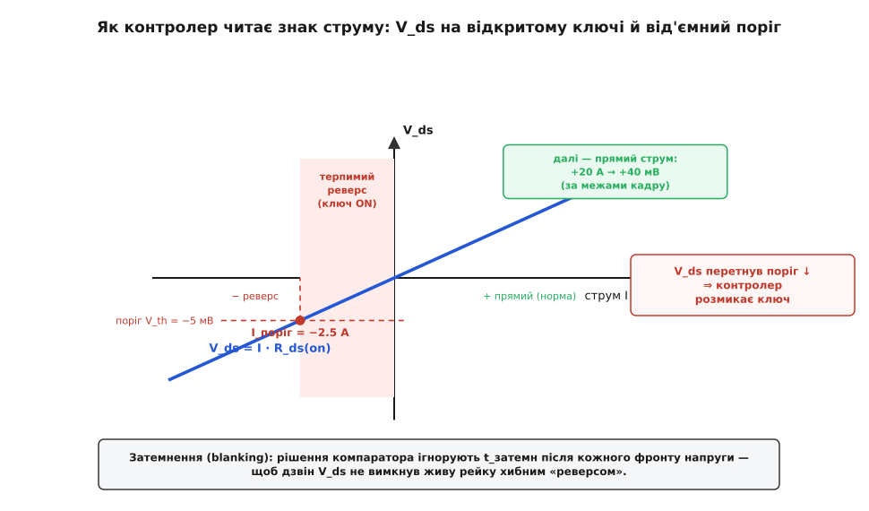
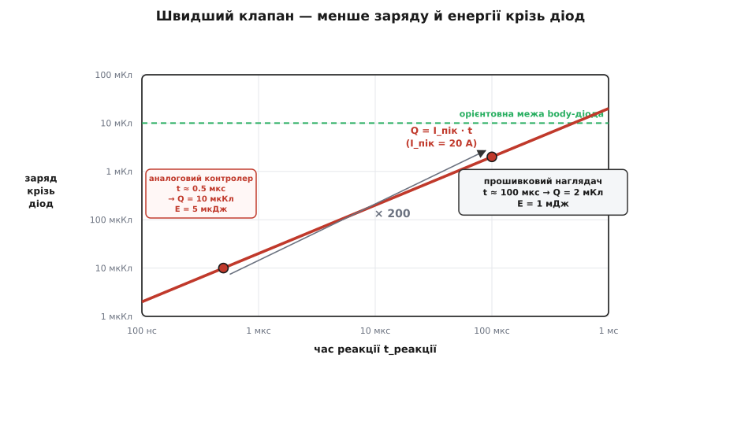
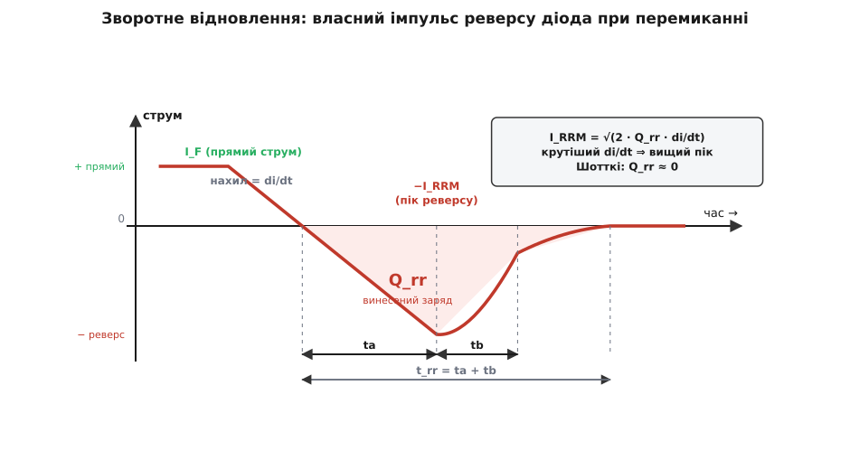

# 🧮 Числа зворотного струму

<preknowlist>
- [Закон Ома](topic:electronics/ohms-law) — напруга = струм · опір; звідси струм між двома точками = різниця напруг, поділена на опір шляху.
- [Опір шляху й внутрішній опір джерела](topic:electronics/internal-resistance) — реальний провідник, ключ і джерело мають скінченний опір; через малий опір навіть мала різниця напруг дає великий струм.
- [Опір відкритого каналу R_ds(on)](topic:electronics/rds-on) — відкритий MOSFET це маленький резистор у кілька міліом; та сама величина і гріє ключ, і слугує вимірювальним шунтом.
- [Body-діод MOSFET](topic:electronics/body-diode) — паразитний pn-діод усередині кожного польового транзистора; проводить в один бік із падінням ~0.5 В незалежно від затвора.
- [Інтеграл як накопичена площа](topic:math/integral) — площа під кривою добутку двох величин у часі дорівнює накопиченому за цей час (тут — заряд і енергія).
</preknowlist>

> У темі зворотний струм лишили здебільшого як явище: коли й чому нижня сторона порту стає вищою за джерело, і які три клапани цьому запобігають. Тут ми переведемо явище в числа й дамо точні відповіді на три питання, що в темі прозвучали без розрахунку. **Наскільки** великий реверс і чому мале число опору робить його вироком. **Як** контролер узагалі відрізняє зворотний струм від прямого, коли він міряє мілівольти на міліомах. І **скільки** заряду й енергії встигає проскочити, поки клапан зачиняється, — з окремим сюрпризом наприкінці: сам діод, що мав би стерегти реверс, при кожному перемиканні впорскує власний зворотний імпульс, і цей імпульс теж має точну величину.

## Означення: реверс — це різниця напруг, поділена на опір

Почнімо з єдиної формули, з якої росте вся кількісна картина. Струм між двома точками кола задає різниця їхніх потенціалів і опір шляху між ними — це закон Ома, застосований до пари «джерело ↔ те, що нижче за течією»:

```
I_зв = ΔV / R
```

Тут `ΔV` — на скільки нижня сторона порту піднялася **над** джерелом (те саме обернення ролей, з якого починається вся біда), а `R` — сумарний опір зворотного шляху: мідна доріжка, відкритий канал ключа, контакти роз'єму й **внутрішній опір самого джерела**, у яке струм тепер ллється назад. Формула проста до банальності. Уся її вага — не в самій рівності, а в тому, **як швидко** `I_зв` реагує на `R`.

## Інтуїція: чутливість до опору — ось де отрута

Візьмімо похідну струму за опором при сталій різниці напруг. Вона показує, на скільки ампер зрушить реверс від найменшої зміни опору шляху:

```
dI_зв/dR = −ΔV / R²
```

Ключове тут — **квадрат** у знаменнику. Чутливість реверсу до опору росте не як `1/R`, а як `1/R²`: що менший опір шляху, то шаленіше струм відгукується на кожен його міліом. Порахуймо на живому прикладі, щоб відчути порядок.

**Нижня сторона порту на 1 В вище за джерело; зворотний шлях (мідь + відкритий ключ + роз'єм) — 20 мОм.**

```
I_зв     = ΔV / R    = 1.0 / 0.020   = 50 А
dI_зв/dR = −ΔV / R²  = −1.0 / 0.0004 = −2500 А/Ом
                                     = −2.5 А на кожен міліом
```

П'ятдесят ампер від одного вольта «помилки» — і, що страшніше, кожен зайвий чи відсутній міліом опору хитає цей струм на два з половиною ампери. Виробничий розкид `R_ds(on)` ключа в кілька міліом, зайвий контакт роз'єму, тепловий дрейф — усе це на низькоомному шляху перекладається в амперами вимірювані стрибки реверсу. Ось чому зворотний струм майже ніколи не буває «трошки»: коли перепад ділиться на дуже малий опір, результат одразу великий і нервово чутливий.

> 🔧 **Навіщо це.** Квадрат у `dI_зв/dR` — це кількісне формулювання того, де взагалі ставлять реверс-захист. Дві рейки з різницею в частку вольта, зведені товстою міддю (одиниці міліом), — це десятки ампер потенційного реверсу; ті самі рейки через кілоомний опір — мікроампери й жодної біди. Небезпеку задає не «наскільки вище», а **у скільки разів малий опір їх розділяє**. Тому клапан ставлять саме на низькоомних вузлах — виходах джерел, входах об'єднаних шин, розриві між батареєю та зарядним колом.

Є одна поправка, без якої картина була б завищена. Якщо єдиний зворотний шлях — це діод (блокувальний або паразитний body-діод), то струм задає вже **не чистий закон Ома**. Діод тримає на собі майже сталу напругу `V_f` (свої ~0.5 В), тож перші пів вольта різниці він просто «з'їдає», і лише **надлишок** над `V_f` лягає на опір `R`:

```
I_зв ≈ 0                    поки ΔV < V_f    (діод замкнений, тече лише витік — мікроампери)
I_зв = (ΔV − V_f) / R       коли ΔV > V_f    (діод відкрився; надлишок над V_f жене опір R)
```

Тобто діод робить **поріг** різким: нижче `V_f` — тиша, вище — раптовий струм. Але саму **величину** над порогом він не приборкує — її, як і раніше, задає малий `R`. Той самий 1 В над джерелом крізь body-діод і 20 мОм дає `(1.0 − 0.5)/0.020 = 25 А` замість 50 А — удвічі менше, та все одно двадцять п'ять ампер туди, куди струму бути не повинно. Діод зсуває старт, не рятує від величини.

## Формальний апарат I: як контролер читає знак струму

[«Ідеальний діод» на MOSFET](topic:electronics/ideal-diode-controller) не має окремого давача струму — і в цьому вся елегантність. Відкритий канал ключа **уже є** маленьким резистором `R_ds(on)`, а напруга на резисторі однозначно несе знак струму. Контролер просто міряє падіння на самому ключі:

```
V_ds = I · R_ds(on)          знак V_ds = знак струму
```

Прямий струм дає одну полярність `V_ds`, зворотний — протилежну. Відрізнити реверс від норми означає впіймати **зміну знаку** цієї напруги — задача для швидкого [компаратора](topic:electronics/comparator), що стежить за `V_ds` ключа.

Тонкість у тому, що поріг спрацювання не можна ставити рівно на нуль. Біля нульового струму `V_ds` теж коло нуля, і будь-який шум змусив би компаратор нескінченно смикатися «реверс — не реверс — реверс». Тому поріг зсувають на маленьку **від'ємну** напругу `V_th`: контролер оголошує реверс лише коли зворотний струм переступив певну межу. Ця напруга-поріг перекладається у струм-поріг тим самим множником `R_ds(on)`:

```
I_поріг = V_th / R_ds(on)
        = −5 мВ / 2 мОм
        = −2.5 А
```

Отже контролер свідомо **терпить** реверс приблизно до 2.5 А, перш ніж розімкнути ключ, — і це не недбалість, а плата за те, щоб не спрацьовувати від шуму на нулі.


*Падіння на відкритому ключі лінійне за струмом: прямий струм тягне V_ds угору, зворотний — униз. Компаратор не чекає точного нуля, а спрацьовує на маленькому від'ємному порозі V_th; йому відповідає струм-поріг I_поріг = V_th/R_ds(on). Смуга між нулем і порогом — реверс, який контролер навмисно терпить, щоб не тремтіти від шуму.*

Тут криється чудова напруга між двома бажаннями, і вона теж кількісна. Малий `R_ds(on)` — це мала втрата в прямому напрямі (те, заради чого взагалі беруть MOSFET замість діода). Але той самий малий `R_ds(on)` **стискає вимірювальний сигнал**: що менший опір, то менше мілівольтів дає кожен ампер, і то важче компаратору розчути знак крізь власний зсув та шум.

```
сигнал на 1 А струму = R_ds(on)
при R_ds(on) = 1 мОм:      20 А прямого струму → лише 20 мВ на ключі
зсув компаратора ±1 мВ    →  невизначеність струму ±1 А
```

Мілівольтовий зсув компаратора при міліомному ключі — це вже цілий ампер невизначеності в тому, де насправді нуль. Тому `R_ds(on)` не можна зменшувати безкарно: нижче певної межі втрачається сама здатність надійно почути реверс. Багато контролерів через це ще й **активно тримають** пряме падіння на невеликому відомому рівні (близько 25 мВ) при легкому навантаженні — щоб робоча точка сиділа на чіткій, вимірній відстані від порога, а не тонула в шумі коло нуля.

Лишається останній ворог швидкого сенсора — **хибні спрацювання від перемикальних завад**. Кожен різкий фронт напруги на сусідніх вузлах наводиться крізь паразитні ємності на стік ключа; лінія `V_ds` дзвенить, і на частки наносекунди може перетнути поріг, хоча струм насправді прямий. Щоб не вимкнути живу рейку від дзвону, рішення компаратора **затемнюють** (англ. *blanking*): протягом короткого вікна `t_затемн` після збурення його ігнорують, або вимагають, щоб умова реверсу протрималася `t_затемн`, перш ніж діяти. Це проста фільтрація сплесків — і за неї теж треба платити, бо затемнення прямо додається до часу реакції. Довше затемнюєш — надійніше проти шуму, але повільніше зачиняєш клапан. Ця плата виводить нас до головного компромісу теми.

## Формальний апарат II: скільки проскакує за час реакції

Між миттю, коли струм повернув, і миттю, коли ключ розімкнувся, минає час реакції `t_реакції`, і весь цей час реверс тече крізь той шлях, що ще лишився відкритим. Скільки саме заряду й енергії проскочить — це інтеграли добутку струму на напругу й на час. Заряд:

```
Q_through = ∫ i dt ≈ I_пік · t_реакції
```

а енергія, що виділиться теплом у тому, крізь що струм тече:

```
E = ∫ v·i dt ≈ v · I_пік · t_реакції
```

Уся сіль — у множнику `v`, напрузі на провідному елементі, бо саме він вирішує, скільки джоулів осяде. І тут важить, **чим саме** тече реверс у вікні реакції — ще відкритим каналом чи паразитним body-діодом. Різниця драматична:

```
крізь відкритий канал:  v = I·R_ds(on) = 20 · 0.002 = 40 мВ  → E = 0.040 · 20 · 1e-6 = 0.8 мкДж
крізь body-діод:        v = V_f        = 0.5 В              → E = 0.5   · 20 · 1e-6 = 10  мкДж
```

Той самий струм за той самий час, а тепла в body-діоді у **дванадцять з половиною разів** більше — бо на діоді падає ціле пів вольта проти сорока мілівольтів на каналі. Це кількісно пояснює, чому body-діод у цій темі — не лише «чорний хід», яким реверс просочується при вимкненому каналі, а й **найгарячіша** ланка: кожен ампер крізь нього коштує в рази більше джоулів, ніж крізь канал. Звідси й практика мінімізувати «мертвий час», коли струм змушений іти паразитним діодом.

Порахуймо тепер прикидку з брифу теми — двадцять ампер реверсу крізь body-діод за одну мікросекунду:

```
E = V_f · I · t = 0.5 · 20 · 1e-6 = 10 мкДж
Q = I · t       =       20 · 1e-6 = 20 мкКл
```

Десять мікроджоулів. Чи це багато? Порівняймо з тим, що діод здатний пережити одним імпульсом. Показник теплового виживання — це `I²·t` (за ним рахують і плавкі запобіжники):

```
I²·t = 20² · 1e-6 = 400 · 1e-6 = 4e-4 А²·с
```

Типова одноімпульсна стійкість силового діода — це одиниці-десятки `А²·с`, а разова енергія, яку тримає кристал, — від міліджоулів до джоулів. Наші `4·10⁻⁴ А²·с` і `10 мкДж` — на три-п'ять порядків нижче. **Одиничний** сплеск реверсу за час реакції доброго контролера body-діод навіть не помічає: крихітна енергія розмазується по тепловій масі кристала й підіймає його температуру на соті частки градуса.

Небезпека, отже, не в поодинокій події, а в двох її розвитках. Перший — **повторюваність**: якщо аварія не разова, а періодична (дзвінке коло, збійне джерело, що моргає), мікроджоулі множаться на частоту й стають ватами середньої потужності — уже тепловим питанням. Другий — **величина піку**: у жорсткому короткому, коли `I_пік` не двадцять, а кількасот ампер, за ту саму мікросекунду `I²·t` вилітає на кілька порядків угору й може перевищити імпульсний рейтинг діода — тут уже вирішує не інтеграл енергії, а сам пік струму. Модель `E ≈ V_f·I·t` чесна, поки струм у вікні приблизно сталий і поки виживання впирається в тепло; коли пік величезний або фронт крутий — треба дивитися на `I_пік` і `I²·t` окремо.

## Формальний апарат III: час реакції ↔ що проскочить

Обидва інтеграли вище лінійні за часом реакції — і в цьому весь компроміс. Піковий струм `I_пік` контролеру **не підвладний**: його задає коло, різниця напруг на опорі шляху (наш `ΔV/R`) або струм короткого замикання джерела, у яке ллється реверс. Єдине, чим контролер керує, — **як довго** цей пік тече. Тому все, що проскакує, прямо пропорційне часу реакції:

```
Q_through = I_пік · t_реакції
E_through = V_f · I_пік · t_реакції
```

Удвічі швидший контролер — удвічі менше заряду й енергії крізь діод. Ось і вся цінність швидкодії, у одному рядку. Порівняймо два різні клапани перед тим самим двадцятиамперним реверсом — аналоговий контролер із субмікросекундною реакцією й програмний наглядач у прошивці, що читає давач струму мікроконтролером і реагує за сотню мікросекунд:

```
аналоговий контролер   t = 0.5 мкс  → Q = 20 · 0.5e-6 = 10 мкКл,   E = 0.5 · 10e-6 = 5 мкДж
прошивковий наглядач   t = 100 мкс  → Q = 20 · 100e-6 = 2000 мкКл, E = 0.5 · 2000e-6 = 1 мДж
```

Двісті разів різниці в заряді й енергії, що проскочать, — рівно стільки, у скільки разів різняться часи реакції. Ось чому повільний прошивковий наглядач годиться лише там, де реверс за своєю природою неспішний (нічний розряд крізь панель), і майже завжди потребує ще й окремого струмообмеження — сам він за сто мікросекунд аварійний пік не спинить.


*Заряд крізь діод = піковий струм · час реакції — пряма лінія в подвійному логарифмі. Аналоговий контролер (~0.5 мкс) і прошивковий наглядач (~100 мкс) сидять на ній за двісті разів один від одного; що правіше точка, то більше заряду й енергії встигає проскочити. Горизонталь — орієнтовна одноімпульсна межа body-діода: усе, що нижче, він переживає.*

Здавалося б, звідси просте гасло «роби якнайшвидше». Але час реакції має **тверду підлогу** й **м'яку стіну**, і між ними живе справжній оптимум. Підлога — це фізика вимкнення: розкласти реакцію на складові й побачити, що жодну не звести до нуля.

```
t_реакції = t_затемн + t_компаратора + t_вимк
```

Останній доданок — час вигнати [заряд із затвора](topic:electronics/mosfet-gate-charge) MOSFET, бо ключ не зачиняється, поки драйвер не стягне заряд затвора крізь свій вихідний опір:

```
t_вимк ≈ Q_g / I_стік = 30 нКл / 1 А = 30 нс
```

До цих тридцяти наносекунд додається затримка поширення компаратора (типово сотні наносекунд) і те саме затемнення `t_затемн`. Разом виходить, що навіть найкращий аналоговий клапан має дно в районі частки-одиниць мікросекунд, а прошивка з її АЦП і циклом — десятки-сотні мікросекунд. М'яка стіна — з іншого боку: щоб реагувати ще швидше, треба вкоротити затемнення й підняти чутливість порога, а це прямо запрошує **хибні спрацювання** від шуму. Тому не можна віджати `t_реакції` до нуля, не заплативши ризиком вимкнути живу рейку від дзвону. Оптимум сидить там, де реакція вже досить швидка, щоб `I_пік·t_реакції` вписалося в імпульсний рейтинг діода, але ще досить повільна й затемнена, щоб не смикатися від завад.

## Формальний апарат IV: Q_rr — власний реверс діода при перемиканні

Досі весь зворотний струм у нас народжувався ззовні — від оберненої різниці напруг на малому опорі. Але є ще одне джерело реверсу, суто **внутрішнє** для діода, і воно теж має точну величину. Виникає щоразу, коли діод, який щойно проводив прямий струм, різко замикають зворотною напругою.

Причина — у самій фізиці pn-переходу. Поки [діод](topic:physics/pn-junction) проводить уперед, його база напхана надлишковими неосновними носіями — це і є провідність. Обірвати струм миттєво не можна: перш ніж перехід почне тримати зворотну напругу, увесь цей накопичений заряд треба **вимести** з бази. І поки він виметається, крізь діод у зворотному напрямі тече струм — короткий, але справжній сплеск реверсу, породжений не аварією, а самим перемиканням. Сумарний винесений заряд звуть **зворотним відновлювальним зарядом** `Q_rr` (англ. *reverse recovery charge*), а час його виметання — `t_rr`.

Форма цього сплеску — трикутник (докладніше — у [зворотному відновленні діода](topic:electronics/reverse-recovery)). Струм від нуля падає з тією швидкістю `di/dt`, яку нав'язує зовнішнє коло, перескакує нуль, доходить до піка `I_RRM`, а тоді відновлюється назад до нуля. Час ділять на дві частини — `ta` від переходу через нуль до піка й `tb` від піка до майже-нуля, — а їхнє відношення характеризує «м'якість» відновлення:

```
t_rr = ta + tb          S = tb / ta          (фактор м'якості)
```

Пов'язати `Q_rr`, пік і крутизну можна геометрично. Площа трикутника струму — це заряд; для різкого (снепового) діода, де `tb` мала:

```
Q_rr = ½ · I_RRM · t_rr           (площа трикутника)
ta   = I_RRM / (di/dt)            (пік досягається на крутизні di/dt)
⇒  I_RRM = √(2 · Q_rr · di/dt)
```

а в загальному випадку з м'якістю `S`:

```
I_RRM = √( 2 · Q_rr · (di/dt) / (1 + S) )
```

Порахуймо на реальному body-діоді, який комутують у синхронному вузлі:

```
Q_rr = 100 нКл,  di/dt = 200 А/мкс = 2e8 А/с
I_RRM = √(2 · 100e-9 · 2e8) = √40 ≈ 6.3 А
t_rr  = 2·Q_rr / I_RRM = 2·100e-9 / 6.3 ≈ 32 нс
```

Тобто body-діод, у якому було накопичено сотню нанокулонів, при перемиканні з крутизною 200 А/мкс кидає назад **шестиамперний** сплеск, що триває близько тридцяти наносекунд. Це зворотний струм — рівно те, з чим тема бореться, — але приходить він **при кожному перемиканні**, а не лише в аварії. І що крутіший фронт `di/dt`, то вищий пік: `I_RRM` росте як корінь із крутизни, тож різкіше перемикання карається більшим зворотним викидом і сильнішим дзвоном на паразитних індуктивностях.


*Прямий струм не обривається миттєво: він падає з нав'язаною колом крутизною di/dt, перескакує нуль і йде в реверс до піка −I_RRM, доки з бази виметається накопичений заряд, а тоді відновлюється. Заштрихована площа під нулем — це і є Q_rr, винесений заряд. Ширший трикутник — більший заряд, вищий пік реверсу; у Шотткі виметати нічого, тож площа стягується майже в точку.*

Кожен такий викид ще й несе енергію: заряд `Q_rr` перекидається через зворотну напругу `V_R`, до якої діод «снепається», і на частоті перемикання це вже стала потужність:

```
E_rr = Q_rr · V_R      = 100e-9 · 12    = 1.2 мкДж   (за одне перемикання)
P_rr = E_rr · f_перем  = 1.2e-6 · 100e3 = 0.12 Вт    (+ електромагнітна завада)
```

Мікроджоуль за раз — дрібниця, але на сотні кілогерц це вже десяті частки вата чистих втрат плюс висока завада від дзвону.

Ось де кількісно замикається улюблена порада теми — брати **діод Шотткі**. Річ не лише в малому прямому падінні. [Шотткі](topic:electronics/schottky-diode) — прилад на **основних** носіях: у ньому немає накопиченого в базі неосновного заряду, отже й вимітати нічого. Його `Q_rr` близький до нуля — лишається тільки зарядка власної ємності переходу:

```
Q_rr(Шотткі) ≈ Q_c = C_j · V_R ≈ кілька нКл    (лише ємнісний, без накопичених носіїв)
```

Тож блокувальний діод Шотткі не тільки менше гріється у прямому напрямі — він ще й **не виробляє власного зворотного імпульсу** при кожному перемиканні. А body-діод MOSFET — це звичайний pn-перехід із повноцінним `Q_rr`, і саме тому він двічі слабка ланка: пропускає чужий реверс при вимкненому каналі й додає свій при кожній комутації. Схеми, що дають body-діоду провести, а тоді різко його замикають, платять `Q_rr`-сплеском щоразу.

> 🔧 **Навіщо це.** Повний «бюджет зворотного струму» вузла складається з двох доданків, і обидва — заряди. Аварійний: `Q_through = I_пік · t_реакції` — те, що проскочить за час зачинення клапана. Комутаційний: `Σ Q_rr` — власні викиди діодів на кожному перемиканні. Обидва зменшують тими самими важелями: малим накопиченим зарядом (Шотткі замість pn там, де можна), швидким вимкненням (щоб урізати `t_реакції`) і достатнім імпульсним рейтингом діода (щоб пережити пік, який усе одно проскочить). Порахувати обидва доданки — і є кількісний спосіб сказати наперед, чи витримає реверс-захист свою роботу, замість того щоб дізнатися це на палаючій платі.
