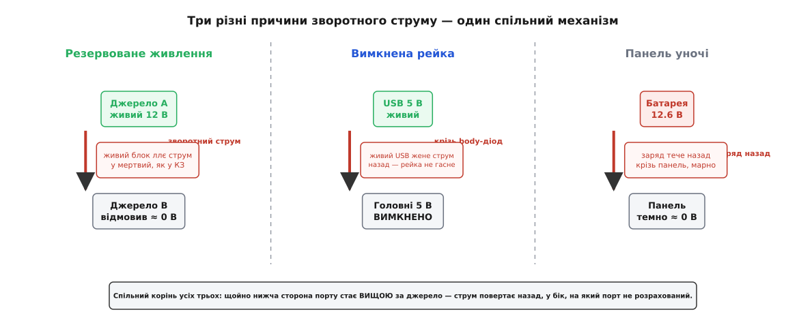
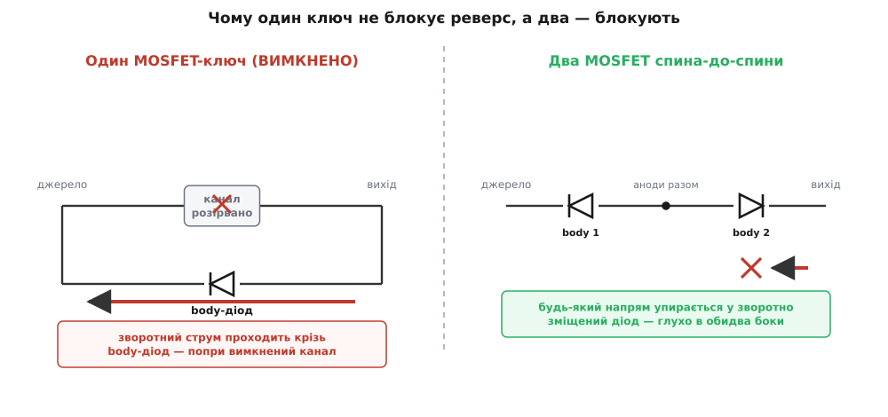
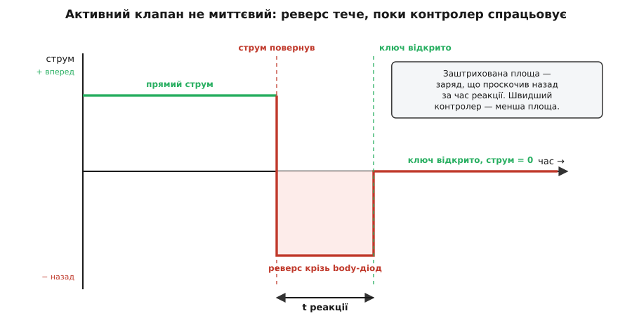

# Захист від зворотного струму

<preknowlist>
- [PN-перехід](topic:physics/pn-junction) — діод як однобічний клапан: у прямому напрямі проводить, у зворотному тримає напругу й не пускає струм.
- [Діод Шотткі](topic:electronics/schottky-diode) — діод із малим прямим падінням (~0.3–0.4 В); типовий пасивний клапан проти реверсу.
- [«Ідеальний діод»](topic:electronics/ideal-diode) — MOSFET під керуванням контролера: у відкритому стані опір у міліоми, а зворотний струм активно розмикає.
- [Body-діод MOSFET](topic:electronics/body-diode) — паразитний діод усередині кожного польового транзистора, що проводить в один бік **незалежно** від напруги на затворі.
- [Внутрішній опір джерела](topic:electronics/internal-resistance) — реальне джерело просідає під струмом; через малий опір шляху навіть мала різниця напруг дає великий струм.
</preknowlist>

Полюси під'єднані правильно, живлення в нормі — а струм усе одно тече не туди. Не з входу через плату до землі, як задумано, а назад: із виходу в бік входу, зі спільної шини в бік джерела, з батареї в бік того, що мало б її заряджати. Це **зворотний струм** (англ. *reverse current*) — і шкодить він не гірше за переплутані полюси, тільки підступніше, бо приходить при цілком **правильному** підключенні, коли нічого не віщує біди.

Одразу відокремимо його від сусіда, з яким його вічно плутають. [Захист від переполюсування](topic:electronics/reverse-polarity-protection) береже плату, коли **джерело під'єднали задом наперед** — плюс на місце мінуса. Це разова помилка: батарейку вставили не тим боком, роз'єм зібрали дзеркально. Зворотний струм — зовсім інше. Полюси **правильні**, підключення **штатне**, а струм повертає назад тому, що в якусь мить те, що стоїть нижче за течією, стало **вищим за напругою**, ніж саме джерело. Винні не переплутані дроти, а різниця потенціалів, яка на мить обернулася.

### Коли струм повертає назад

Струм тече з вищого потенціалу в нижчий — це вся електрика, коротко. Порт живлення проєктують під один звичний перепад: джерело вище, навантаження нижче, струм іде вперед. Але «джерело вище» — не закон природи, а лише **звична умова**. Щойно вона порушилась — нижня сторона піднялася над джерелом — той самий закон жене струм у зворотний бік. Ніякої окремої «сили реверсу» не існує: є проста різниця напруг і опір шляху між двома точками.

А шлях цей зазвичай **короткий**. Мідна доріжка, відкритий транзисторний ключ, пара контактів роз'єму — разом [лічені міліоми опору](topic:electronics/internal-resistance). І тут криється отрута: малий опір робить зворотний струм **надчутливим** до різниці напруг. Той самий механізм, що робить пряме паралелення джерел підступним, тут обертається проти нас.

**Нижня сторона порту опинилася лише на 1 В вище за джерело; шлях між ними — 0.1 Ом (мідь + ключ + роз'єм).**

```text
I_зв = ΔV / R
     = 1.0 / 0.1
     = 10 А
```

Один вольт «помилки» — і десять ампер ринуть туди, куди струму текти не повинно взагалі. Порт, розрахований на ампер уперед, дістає десятикратний удар назад. А якби опір шляху був не 0.1, а 0.02 Ом — було б уже 50 А. Ось чому зворотний струм так рідко буває «трошки»: коли перепад помножено на велику провідність, він одразу небезпечний.

> 🔧 **Навіщо це.** Із цієї арифметики випливає головне правило: небезпека реверсу визначається не тим, «наскільки сильно» щось стало вищим, а тим, **наскільки малий опір** їх розділяє. Дві сусідні рейки живлення з різницею в частку вольта, зведені товстою міддю, — це потенційно десятки ампер; ті самі рейки через кілоомний резистор — мікроампери й жодної біди. Тому реверс-захист ставлять саме там, де шлях **низькоомний**: на виходах джерел, на входах об'єднаних шин, у розриві між батареєю та зарядним колом.

### Три обличчя однієї біди

Причин, чому нижня сторона піднімається над джерелом, небагато, і кожну варто впізнавати з першого погляду.


*Резервування: живий блок ллє струм у мертвий, як у коротке замикання. Вимкнена рейка: живий сусід жене струм назад крізь ключ, і рейка не гасне. Панель уночі: заряджена батарея розряджається назад крізь темну панель. Корінь усюди один — нижча сторона порту стала вищою за джерело.*

**Два джерела на одній шині.** Коли [кілька джерел об'єднують у резерв](topic:electronics/power-oring), їхні виходи сходяться в одну точку. Поки всі живі, вищий за напругою вже підганяє струм у нижчих сусідів. Та справжня біда — коли одне джерело **помирає**: його вихід просідає майже до нуля, і для живого сусіда мертвий блок виглядає точнісінько як коротке замикання. Живий з усієї сили ллє струм у труп замість навантаження — і або згорає сам, або спрацьовує його захист, і тоді без живлення лишається все. Резерв, зроблений «у лоб», обертається подвійною відмовою.

**Рейка, яку вимкнули, а вона не гасне.** Це найпідступніший випадок, бо тут немає жодної аварії — лише звичайне вимкнення. Уявіть пристрій із головним живленням 5 В і запасним входом USB на ті самі 5 В. Ви розмикаєте ключ головної рейки, щоб її знеструмити, — а USB усе ще під напругою й зв'язаний із тією рейкою. Струм тече з живого USB **назад** у щойно вимкнену рейку.

**Головні 5 В розімкнули ключем, але USB-вхід 5.0 В лишився живим і зв'язаний із рейкою крізь паразитний діод ключа (Vf ≈ 0.5 В).**

```text
Напруга на «вимкненій» рейці:  5.0 − 0.5 = 4.5 В  (жива!)
```

Рейка, яку ви щойно вимкнули, сидить на 4.5 В і **жива**. Усе, що на ній висить, не скидається, індикатор не гасне, мікросхема не бачить вимкнення й ніколи не перезавантажується. Тут зворотний струм небезпечний не величиною (його обмежує споживання тієї рейки), а самим фактом: **вимкнене не вимикається**. Шлях, яким струм просочується, — той самий паразитний діод усередині транзисторного ключа, і саме він робить одиничний MOSFET-ключ нездатним блокувати реверс. Цей паразитний діод — серце теми.

**Джерело, що вночі стає навантаженням.** Сонячна панель удень — джерело; уночі, в темряві, її напруга падає майже до нуля, і заряджена батарея починає **розряджатися назад крізь панель**, марно віддаючи накопичене. Той самий поворот ролей буває з двигуном: коли його гальмують чи він крутиться за інерцією, він працює генератором і власною [проти-ЕРС](topic:electronics/back-emf) жене струм назад у джерело живлення. Спільне в усіх трьох сценаріях те саме — щось нижче за течією стало вищим за джерело, — тож і ліки будуть спільні.

### Однобічний клапан і три його втілення

Ліки очевидні з самої постановки: між джерелом і рештою треба поставити **однобічний клапан** — пристрій, що вільно пускає струм уперед і надійно тримає його назад. Уся тема — це вибір, **яким саме** зробити цей клапан. Втілень три, і кожне — інший компроміс між втратами, ціною й повнотою блокування.

**Втілення перше — блокувальний діод.** Природний однобічний клапан — це [діод](topic:physics/pn-junction): у прямому напрямі проводить, у зворотному тримає напругу. Ставимо його в розріз дроту вістрям (катодом) у бік навантаження — і струм назад стає неможливим фізично. Один компонент, жодного налаштування, працює завжди. Ціна цієї простоти — **падіння напруги** на прямому струмі. Навіть [діод Шотткі](topic:electronics/schottky-diode) із його низьким бар'єром губить свої 0.3–0.4 В — і то постійно, увесь час роботи.

**Блокувальний діод Шотткі, Vf = 0.4 В, струм навантаження 3 А.**

```text
Втрати:  P = Vf · I = 0.4 · 3 = 1.2 Вт   (постійно, у тепло)
Просадка: навантаження недоотримує 0.4 В із кожного вольта входу
```

1.2 Вт, що безперервно йдуть у тепло лише за право пускати струм в один бік. На малому струмі — десятки міліампер — це дрібниця, і діод там ідеальний. На амперах — уже потрібен радіатор, а просаджена напруга дратує чутливий вузол. Це не нова проблема й не новий винахід: до появи дешевих напівпровідників ту саму роботу — не дати батареї розрядитися назад у генератор, що заглух, — виконувало електромеханічне [реле зворотного струму](topic:electronics/reverse-current-protection/hist-reverse-current-cutout.md), і блокувальний діод є прямим твердотілим спадкоємцем того реле.

**Втілення друге — «ідеальний діод».** Щоб позбутися падіння, діод замінюють керованим MOSFET: відкритий транзистор — це не вентиль із порогом, а крихітний опір у кілька міліом, тож замість 0.4 В на ньому падають десятки мілівольт. Спеціальний контролер стежить за напрямом струму й **сам розмикає** ключ, щойно струм спробує піти назад. Так виходить [«ідеальний діод»](topic:electronics/ideal-diode) — та сама однобічність, але майже без втрат. Це стандартне рішення там, де струми великі, а гріти діод шкода: на входах об'єднаних джерел, у [ключах навантаження](topic:electronics/load-switch), на виходах блоків живлення.

**Втілення третє — і пастка, що його вимагає.** Тут маємо зупинитись, бо саме на цьому місці найчастіше роблять помилку. Здавалося б: MOSFET уже стоїть у розриві як ключ — вимкнув його, і зворотного струму немає. Але **не немає**. У кожному польовому транзисторі є [паразитний body-діод](topic:electronics/body-diode) (англ. *body diode*, від *body* — «тіло», підкладка кристала), і він проводить в один бік **незалежно** від того, що на затворі. Вимкнули канал — струм уперед перекрито, а назад він преспокійно тече крізь цей body-діод, ніби ключа й немає.


*Ліворуч: канал розірвано, але body-діод дивиться так, що пропускає зворотний струм — вимкнений ключ реверс не тримає. Праворуч: два MOSFET з'єднані витоками (спина-до-спини), їхні body-діоди стоять анодами назустріч, тож будь-який напрям упирається у зворотно зміщений діод — глухо в обидва боки.*

Звідси рішення: щоб **справді** перекрити реверс транзистором, ставлять **два MOSFET спина-до-спини** — з'єднані витоками так, що їхні body-діоди дивляться анодами назустріч один одному. Тепер, куди б струм не поткнувся, він одразу впирається в один зі зворотно зміщених діодів — і не проходить, поки обидва канали не відкриті керуванням. Ця пара — основа [двобічного блокування в захисті акумуляторів](topic:electronics/mosfet-back-to-back): один транзистор блокує зайвий заряд, другий — зайвий розряд. Блокувальному діоду ця морока не потрібна — він і є суцільний перехід без паразитного «чорного ходу»; а от кожен, хто робить реверс-захист на MOSFET, мусить пам'ятати про body-діод, інакше «захист» пропускає саме те, від чого мав захищати.

> 🔧 **Навіщо це.** Один MOSFET блокує струм лише **в один бік** — той, куди дивиться його body-діод зворотно. Для звичайного ключа навантаження цього досить. Але щойно потрібно тримати реверс — при об'єднанні джерел, у батарейному вході, на вузлі, де напруга може обернутися, — одиничний ключ не годиться, і треба або діод, або пару спина-до-спини. Переплутати ці два випадки — типова помилка, після якої «захищена» плата тихо пропускає зворотний струм.

### Активний клапан не встигає миттєво

У «ідеального діода» є тонкість, яку легко проґавити: контролер, що стежить за напрямом струму, **не нескінченно швидкий**. Між миттю, коли струм повернув назад, і миттю, коли контролер устиг розімкнути ключ, минає якийсь час — і весь цей час зворотний струм тече крізь той самий body-діод, ніким не спинений.


*Поки струм прямий — усе спокійно. Щойно він повернув (лівий пунктир), крізь body-діод проходить сплеск зворотного струму, і триває він, доки контролер не спрацює (правий пунктир) і не розімкне ключ. Заштрихована площа — заряд, що проскочив назад за час реакції; що швидший контролер, то вужча ця смуга.*

Час реакції доброго ORing-контролера — від часток до кількох мікросекунд. Здавалося б, дрібниця. Але за ці мікросекунди при аварії, коли сусідній блок раптово закоротило, крізь body-діод встигає піти повний сплеск струму — десятки ампер. Одиничний такий сплеск — це крихітна енергія, і діод його переживає; проблема — коли аварії повторюються або коли струми справді великі. Тому контролер роблять **швидким** (щоб звузити смугу) і закладають body-діод із запасом по імпульсу (щоб пережити те, що все ж проскочить). Скільки саме заряду просочується за час реакції, як обирають поріг, за яким струм уважається «зворотним», і чому сам блокувальний діод має власний зворотний відновлювальний заряд — у [математиці зворотного струму](topic:electronics/reverse-current-protection/math-reverse-current.md).

Ту саму логіку — «помітив реверс, розімкнув ключ» — можна винести й у прошивку: [програмний наглядач зворотного струму](topic:electronics/reverse-current-protection/proj-reverse-current-supervisor.md) читає двобічний давач струму мікроконтролером і сам керує ключем, із витримкою й гістерезисом проти хибних спрацювань. Він повільніший за аналоговий контролер, зате гнучкіший і вміє ще й повідомити систему про подію.

### Як обрати клапан

Три втілення — це три відповіді на питання «чим платити за однобічність».

- **Малий струм, простота найважливіша** → блокувальний діод. Втрати мізерні, схема з одного компонента, нема чому ламатися. Класика — сонячна панель із батареєю, дрібні входи живлення.
- **Великий струм, шкода тепла й просадки** → «ідеальний діод» на MOSFET із контролером. Десятки мілівольт замість 0.4 В, самоскидання без заміни деталей. Об'єднання джерел, ключі навантаження, входи блоків живлення.
- **Треба тримати струм в обидва боки** → два MOSFET спина-до-спини. Єдиний варіант, коли напруга на вузлі може обернутися й у той, і в той бік. Батарейні входи, двобічні порти.

> 🔧 **Навіщо це.** Реверс-захист рідко живе окремим вузлом — він майже завжди **вбудований** у щось інше: у контролер об'єднання джерел, у [ключ навантаження](topic:electronics/load-switch), у мікросхему захисту акумулятора. Тому, обираючи такий вузол, дивіться не лише на струм і опір у відкритому стані, а й на те, **чи блокує він реверс** і **в скільки боків**. Плата, де про це не подумали, зовні працює бездоганно — рівно доти, доки одна рейка не стане на частку вольта вищою за іншу.
