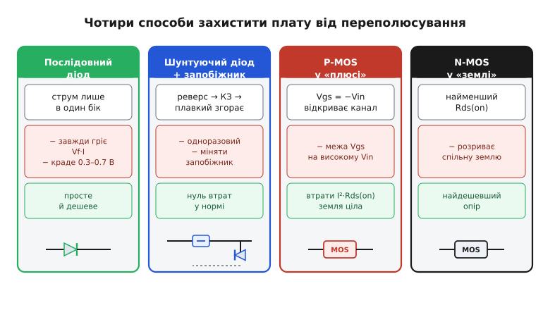
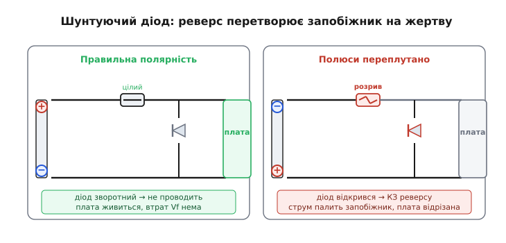

# Захист від переполюсування

Живлення приходить двома дротами: «плюс» і «мінус». Переплутати їх місцями — справа однієї неуважної секунди: батарейку вставили не тим боком, роз'єм зібрали дзеркально, клеми акумулятора під час підкурювання накинули навхрест. І дуже часто за цю секунду плата гине. **Захист від переполюсування** (англ. *reverse-polarity protection*, від *reverse* — «зворотний» і *polarity* — «полярність») — це вузол на самому вході живлення, чия єдина робота: пропустити струм, коли полюси правильні, і не пропустити нічого, коли їх переплутали.

Щоб обрати захист свідомо, а не переписати перший-ліпший приклад зі схеми, треба спершу зрозуміти, **що саме** ламає зворотна напруга й чому. А тоді вже — які чотири родини рішень із цього виростають і чим кожна платить за свій захист.

### Чому зворотна напруга вбиває плату

Здавалося б, електрика симетрична: тече в один бік, тече й у інший. Але майже все на платі живлення розраховане на струм **лише в один бік**, і зворотна напруга жене його туди, куди він іти не повинен.

Найперша жертва — **електролітичні конденсатори**. Вони полярні за будовою: тонкий ізолювальний оксид на аноді нарощується й тримається саме прикладеною напругою правильного знаку. Подайте напругу навпаки — оксид починає розчинятися, крізь конденсатор тече струм, електроліт закипає, тиск росте, і корпус розривається (нерідко з гучним ляском і бризками електроліту). Це не «поступова деградація» — це секунди.

Друга жертва — **мікросхеми**. Майже кожна цифрова чи аналогова ІМС має на виводах живлення вбудовані захисні діоди (від статики й перенапруги). У нормі вони зворотно зміщені й нічого не роблять. Але при переполюсуванні напруга відкриває їх **прямо**, і крізь кристал тече струм, обмежений хіба що опором дротів — десятки чи сотні міліампер крізь структуру, розраховану на міліампери. Тонкі внутрішні доріжки перегорають, як плавка вставка, і чип гине.

Третя — усе, що по природі однобічне: інші **діоди**, входи **лінійних стабілізаторів**, підкладки транзисторів. Спільний корінь один: у правильній полярності ці елементи або тримають напругу, або пропускають струм у свій бік; у зворотній — крізь них відкривається шлях, на який їх не проєктували, і найслабший згорає першим.

> 🔧 **Навіщо це.** Зрозумівши механізм, ви бачите, що захист треба ставити **перед** усім вразливим — на самому вводі живлення, до першого конденсатора й до першого стабілізатора. Захист, поставлений «десь усередині», не врятує те, що стоїть до нього. І ще: якщо пристрій живиться від акумулятора, який користувач вставляє руками, або від зовнішнього адаптера з роз'ємом — переполюсування не «малоймовірна аварія», а питання часу, тож захист тут не розкіш, а норма.

### Чотири родини рішень

Способів захисту рівно стільки, скільки є відповідей на питання «як не пустити струм у зворотному напрямку». Їх чотири, і кожен — це інший компроміс між ціною, втратами в нормальній роботі та поведінкою в аварії.


*Послідовний діод — просто й дешево, але завжди гріє Vf·I. Шунтуючий діод із запобіжником — нуль втрат у нормі, але спрацьовує одноразово. P-MOS у «плюсі» — малі втрати I²·Rds(on) і ціла земля. N-MOS у «землі» — найменший опір, але розриває спільну землю. Кожен варто розібрати причинно.*

### Спосіб перший: послідовний діод

Найпростіша ідея — поставити в плюсовий провід **діод**, орієнтований так, щоб пропускати струм лише в правильний бік. Полюси правильні — діод зміщений прямо, струм тече, плата живиться. Переплутали — діод зміщений зворотно, струм не йде, плата ізольована. Один компонент, жодного налаштування, працює завжди.

Ціна цієї простоти — **падіння напруги**. Кремнієвий діод відкривається, лише коли прикладена напруга долає дифузійний потенціал його переходу — близько 0.6–0.7 В. І це падіння тримається на **повному** струмі навантаження, увесь час, поки плата працює. Діод [Шотткі](book:electronics/schottky-diode) (метал-напівпровідник) не накопичує дірковий заряд і має нижчий бар'єр — падіння ~0.3–0.4 В, — тому в захисті беруть саме його. Та навіть 0.4 В на струмі в кілька ампер обертаються на відчутну потужність у тепло і на просадку напруги, якої недоотримує плата.

**Вхід 5 В, струм 2 А, захисний діод Шотткі з Vf = 0.4 В.**

```text
Втрати в діоді:  P = Vf · I  = 0.4 · 2 = 0.8 Вт   (постійно, у тепло)
Просадка:        плата бачить 5.0 − 0.4 = 4.6 В замість 5.0 В
```

0.8 Вт — це вже потрібен корпус діода, що вміє розсіяти таке тепло, а 4.6 В замість 5.0 можуть не влаштувати чутливий вузол. На малому струмі (десятки міліампер) послідовний діод — ідеальне рішення: втрати мізерні, схема з одного компонента. На великому — його втрати стають нестерпними, і тоді тягнуться до наступних способів.

### Спосіб другий: шунтуючий діод і запобіжник

Наступна ідея хитріша й обходить головну ваду першої — падіння в нормальній роботі. Діод ставлять **не в розріз** дроту, а **впоперек** входу — паралельно живленню, катодом до «плюса». І послідовно з входом ставлять **плавкий запобіжник**.


*Правильна полярність: діод зворотно зміщений, струму крізь нього немає, плата живиться напряму — падіння Vf ніде не втрачається. Переплутана: діод відкривається прямо, коротить зворотну напругу накоротко, величезний струм миттєво палить запобіжник — і плата виявляється відрізаною від джерела.*

Розберемо обидва стани. У **правильній** полярності катод діода на «плюсі», анод на «мінусі» — діод зміщений **зворотно**, він мовчить, струму крізь нього нема. Плата живиться напряму через цілий запобіжник, і — ось головний виграш — **жодного падіння Vf** ніде не втрачається. У нормальній роботі цей захист «безкоштовний».

У **переплутаній** полярності все навпаки: на катоді тепер «мінус», на аноді «плюс», діод відкривається **прямо** і фактично коротить зворотну напругу сам на себе. Крізь послідовний запобіжник ринає величезний струм короткого замикання — і запобіжник миттєво **перегорає**, розриваючи ланцюг. Плата виявляється відрізаною від джерела ще до того, як зворотна напруга встигла її пошкодити. Це той самий прийом захисту через навмисне [коротке замикання](book:electronics/short-circuit), що й у [crowbar-захисті](book:electronics/crowbar) від перенапруги: жертвуємо запобіжником, щоб урятувати все інше.

Плата за нульові втрати — **одноразовість**. Спрацював захист — треба фізично замінити плавку вставку (а часто ще й перевірити, чи вцілів шунтуючий діод, який на мить пропустив крізь себе весь струм КЗ). Тому діод беруть із запасом по імпульсному струму, а запобіжник — швидкий, щоб перегоріти раніше, ніж що-небудь інше. Замість плавкого запобіжника іноді ставлять [самовідновний](book:electronics/ptc-fuse) (полімерний PTC): він не перегорає назавжди, а різко нарощує опір від нагріву й «відпускає» назад, коли аварію усунули, — тоді захист переживає переполюсування без заміни деталей.

> 🔧 **Навіщо це.** Шунтуючий діод із запобіжником — типовий вибір там, де падіння Vf нестерпне, а переполюсування — рідкісна разова аварія (наприклад, помилка монтажника на виробництві). В автомобільній техніці цей механізм має цікавий природний варіант: якщо запобіжника в колі немає, то при перевернутій батареї струм замикає **діоди випрямляча самого генератора**, які й гасять зворотну напругу — саме на цей випадок стандарт випробувань дозволяє полегшений режим у −4 В замість повних −14 В ([історія автомобільного випробування](book:electronics/reverse-polarity-protection/hist-reverse-battery.md)).

### Спосіб третій: P-MOS у плюсовому проводі

Обидва попередні способи або гріють діод у нормі, або жертвують запобіжником в аварії. Третій прибирає обидві вади — це **транзисторний ключ**, що поводиться як діод майже без падіння й скидається сам, без заміни деталей.

Ідея виростає з простого спостереження: відкритий MOSFET — це не «вентиль» з порогом, а маленький [резистор Rds(on)](book:electronics/rds-on). Падіння на резисторі — це I·R, воно росте від нуля лінійно й на струмах у кілька ампер лишається крихітним. Пропустимо струм крізь відкритий транзистор замість діода — і замість 0.4 В отримаємо десятки мілівольт.

Ключ ставлять у **плюсовий** провід — це верхнє плече (англ. *high-side* — «з боку плюса»). І природний вибір тут — [P-канальний MOSFET](book:electronics/nmos-pmos): його витік сидить на найвищому потенціалі схеми (+Vin), а відкривається він, щойно затвор стягнути **нижче** за витік. Уся хитрість — у тому, як під'єднати затвор: витік на «плюс» батареї, затвор через резистор на «землю».

Чому ця схема сама вмикається в правильну полярність і сама вимикається в неправильну — варто простежити причинно. У **правильній** полярності «плюс» заходить на витік (нехай +Vin = 12 В), а затвор резистор тримає близько нуля. Напруга затвор–витік виходить Vgs ≈ 0 − 12 = −12 В — глибоко від'ємна, куди більша за поріг, тож канал розкривається повністю й падіння стає крихітним I·Rds(on). У **переплутаній** полярності на витік приходить «мінус» батареї (витік опускається нижче землі), а затвор той самий резистор тримає коло нуля — тепер затвор **вищий** за витік, Vgs стає **додатним**, і для P-каналу це команда «закрийся». Канал перекритий, а вбудований [body-діод](book:electronics/body-diode) транзистора при зворотній батареї орієнтований так, що теж блокує струм. Плата ізольована.

Ось повний розрахунок виграшу проти діода на тому самому струмі.

**Вхід 5 В, струм 2 А. Порівняти діод Шотткі (Vf = 0.4 В) і P-MOS (Rds(on) = 25 мОм гарячий).**

```text
Діод Шотткі:
  падіння   Vf = 0.40 В
  втрати    P  = Vf · I = 0.40 · 2 = 0.80 Вт
  просадка  плата бачить 4.60 В

P-MOS «ідеальний діод»:
  падіння   Vds = I · Rds(on) = 2 · 0.025 = 0.050 В
  втрати    P   = I² · Rds(on) = 2² · 0.025 = 0.10 Вт
  просадка  плата бачить 4.95 В

Виграш:   падіння 0.40 / 0.05 = 8×,   тепло 0.80 / 0.10 = 8×
```

Втрати на MOSFET ростуть як **I²**, а на діоді — майже лінійно, тож існує струм рівноваги, вище якого формально виграє вже діод: I = Vf / Rds(on) = 0.40 / 0.025 = 16 А. Нижче цієї межі (тобто для майже всіх портативних і вбудованих задач) MOSFET виграє з великим запасом. Ця схема настільки поширена, що дістала власну назву — **«ідеальний діод»** (англ. *ideal diode*), а її повний розбір із самозміщенням, захистом затвора стабілітроном і активними мікросхемами-контролерами винесено в окрему статтю: [«ідеальний діод» на MOSFET](book:electronics/ideal-diode). Головне, що варто знати тут: P-MOS у плюсовому проводі дає захист від переполюсування майже без втрат, скидається сам і лишає «землю» недоторканою.

> 🔧 **Навіщо це.** Побачили на вході живлення транзистор у плюсовому проводі із затвором через резистор на землю — це майже напевно захист від переполюсування на P-MOS. Він виграє в діода тим сильніше, чим більший струм: на 2 А це 0.1 Вт замість 0.8 Вт і повна напруга на платі замість просадженої. Одне застереження: на високому Vin (12–24 В) стягнутий до нуля затвор дає Vgs = −Vin, що може перевищити межу затвора (±20 В) і пробити оксид, — там затвор бережуть стабілітроном.

### Спосіб четвертий: N-MOS у землі

Є й дзеркальний варіант — поставити захисний ключ не в «плюс», а в **зворотний** провід, у «землю» пристрою. Тут природний вибір — **N-канальний MOSFET**, і причина суто фізична: за однакову ціну й розмір кристала N-канал дає **менший** Rds(on), ніж P-канал (рухливість електронів вища за рухливість дірок). Тобто це найдешевший спосіб отримати найменше падіння.

Схема працює так: витік N-MOS сидить на «землі» пристрою, а затвор підтягують до «плюса» входу (через дільник). У **правильній** полярності затвор виявляється вищим за витік — Vgs додатна, N-канал відкритий, струм тече крізь малий Rds(on). У **переплутаній** знаки перевертаються, Vgs стає від'ємною, транзистор іде у відсічку, а його body-діод при цьому блокує зворотний струм. Механізм той самий, лише в нижньому плечі.

Здавалося б, найкращий варіант — найменше падіння, найдешевше. Але є суттєва вада, через яку його **рідко** беруть: цей ключ розриває **спільну землю** пристрою. А земля зазвичай має бути наскрізною й недоторканою — по ній ідуть опорні потенціали, екрани, обплетення сигнальних і USB-кабелів, спільні точки кількох вузлів. Розрив землі означає, що «мінус» пристрою більше не дорівнює «мінусу» джерела: варто підключити ще один кабель (наприклад, USB чи інтерфейс до сусіднього приладу), і струм знайде обхідний шлях повз захисний транзистор, а сам захист перестане працювати. Тому N-MOS у землі застосовують лише там, де пристрій живиться **єдиною** ізольованою парою дротів і жодних інших спільних з'єднань не має. У решті випадків панує P-MOS у плюсовому проводі — трохи дорожчий і з більшим опором, зате він лишає землю цілою.

### Як вибрати

Зведімо чотири родини в один причинний ланцюжок вибору.

**Струм малий (десятки міліампер), і кожна копійка на рахунку** — послідовний діод. Його падіння Vf на такому струмі дає мізерні втрати, а схема з одного компонента непереможна за простотою.

**Струм великий, переполюсування — рідкісна разова аварія** — шунтуючий діод із запобіжником. У нормі втрат нема зовсім; ціна — заміна плавкої вставки після аварії (або самовідновний PTC, щоб і цього уникнути).

**Струм чималий, а падіння й тепло діода нестерпні, при цьому потрібне багаторазове самоскидання** — P-MOS у плюсовому проводі («ідеальний діод»). Втрати I²·Rds(on) крихітні, скидається сам, земля ціла. Це найпоширеніший сучасний вибір для портативної та вбудованої техніки.

**Потрібне абсолютно мінімальне падіння, а пристрій має єдину ізольовану пару дротів** — N-MOS у землі. Найдешевший опір, але тільки там, де розрив спільної землі нікому не завадить.

І окремо варто пам'ятати: захист від переполюсування — це захист лише від **сталої** зворотної напруги переплутаних полюсів. Від коротких зворотних **викидів** (наприклад, при скиданні індуктивного навантаження чи в автомобільній бортовій мережі) береже інший вузол — [обмежувач перенапруги (TVS-діод)](book:electronics/tvs-diode), і часто обидва ставлять поруч на одному вводі, бо стережуть вони від різних бід.

> 🔧 **Навіщо це.** Вибір захисту — це не «який найкращий», а «який компроміс під мій випадок». Спитайте себе по черзі: який струм? чи стерпне падіння діода? переполюсування рідкісне чи ймовірне? земля має бути наскрізною? Відповіді самі приведуть до однієї з чотирьох родин. А найчастіше для сучасного пристрою відповідь — P-MOS у плюсовому проводі: майже без втрат, самоскидний, земля недоторкана.
