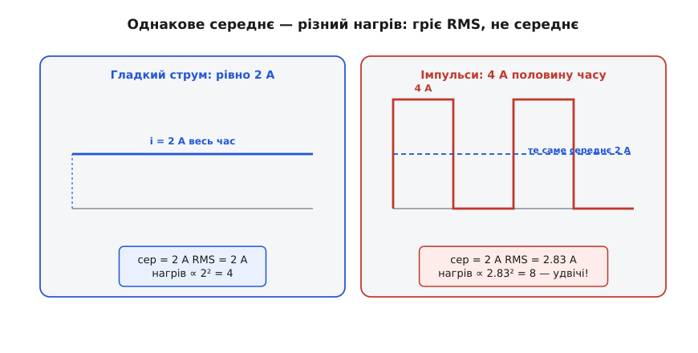
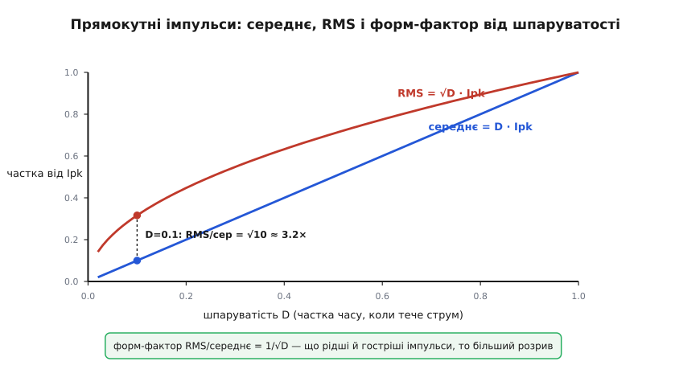
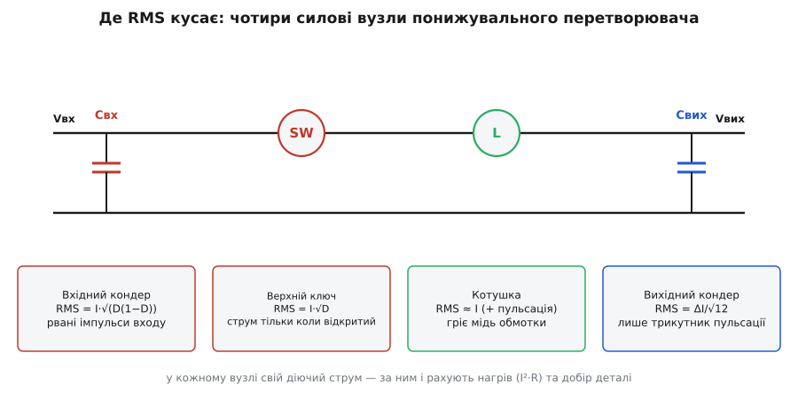

# Діючий струм (RMS) у перетворювачах

Конденсатор із паспортним «5 А», що згорів у вузлі, який віддає «3 ампери». MOSFET, розрахований на 10 А безперервно, який плавиться на середніх трьох. Доріжка, що чорніє під струмом, удвічі меншим за той, на який її клали. Усе це — та сама помилка, і коштує вона згорілими платами: людина взяла **середній** струм там, де нагрів визначає **діючий** (англ. *RMS*, *root mean square* — корінь із середнього квадрата). А в імпульсному перетворювачі ці два числа розходяться драматично, бо струм там не тече рівно — його ріжуть на клапті ключі, що вмикаються сотні тисяч разів на секунду.

Питання, отже, стоїть руба: якщо струм у вузлі смикається імпульсами, гострими піками й провалами, — **яким одним числом** його чесно оцінити, коли треба знати, скільки цей вузол нагріється й яку деталь під нього ставити? Відповідь — діюче значення, і вся річ у тім, **чому** саме воно, а не звичне середнє, і **де** в перетворювачі воно кусає найболючіше.

## Чому нагрів слухає квадрат, а не середнє

Корінь усього — у тім, як струм стає теплом. Нагрів провідника (обмотки котушки, каналу відкритого MOSFET, паразитного опору конденсатора, мідної доріжки) — це потужність на його опорі R, а вона йде зі **квадрата** струму:

```
p(t) = i(t)² · R
```

Квадрат тут вирішує все. Поки струм тече рівно, різниці між «середнім» і «діючим» немає — гладкі 2 ампери гріють як гладкі 2 ампери. Та щойно струм починає стрибати, з'являється пастка: **середній квадрат не дорівнює квадрату середнього**. Короткий високий пік важить у нагріві непропорційно багато, бо його висоту підносять у квадрат, — а звичайне середнє цього піку не бачить, воно лише розмазує його по часу.

Порахуймо на найпростішому прикладі — струмі, що половину часу дорівнює 4 амперам, а половину нулю (саме так поводиться вхід понижувального перетворювача зі шпаруватістю ½). Його **середнє** очевидне: (4 + 0)/2 = 2 ампери. А тепер тепло. Поки тече 4 А, потужність пропорційна 4² = 16; поки нуль — нулю. У середньому за час нагрів пропорційний (16 + 0)/2 = 8. Але ж рівний струм 2 А дав би нагрів, пропорційний лише 2² = 4. Той самий «середній струм 2 А» — а тепла **вдвічі** більше. Число, квадрат якого дорівнює 8, і є діючий струм: √8 ≈ 2.83 ампера.


*Обидві форми мають однакове середнє — 2 ампери, і джерело віддає в обидві однаковий заряд за період. Та резистору байдуже до середнього: він гріється за миттєвим квадратом струму. Гострі 4-амперні імпульси гріють удвічі сильніше за гладкі 2 А, бо середній квадрат (8) удвічі більший за квадрат середнього (4). Саме різницю ловить діюче значення: 2.83 А проти 2 А.*

Ось чому середнє тут — оманливе число: воно чесно каже, скільки заряду перенесено, але мовчить про тепло. А деталь горить від тепла. Діюче ж значення будують саме так, щоб воно віддавало правильний нагрів: підносиш струм у квадрат, усереднюєш, береш корінь — і дістаєш той рівний струм, що грів би так само. Це загальний рецепт, не прив'язаний до перетворювачів; [чому саме квадрат-середнє-корінь і чому корінь наприкінці повертає ампери](topic:math/rms) — окрема тема, і якщо це опертя хитке, її варто переглянути. Тут же нам важить наслідок: **у будь-якому вузлі, де струм рваний, добирати деталь і рахувати нагрів треба за діючим струмом, а середнє відкладемо вбік.**

> 🔧 **Навіщо це.** Кожна цифра струму в даташиті силової деталі — допустимий струм конденсатора, безперервний струм стоку MOSFET, струм доріжки — це **діюче** значення, бо саме воно задає нагрів і ресурс. Взяти замість нього середнє — означає систематично недобирати деталь: вона житиме гарячішою, ніж на папері, і помре передчасно. Рахунок RMS — не академічна вправа, а спосіб не спалити вузол.

## Імпульс струму: діюче, середнє і форм-фактор

Найтиповіша форма струму в перетворювачі — **прямокутний імпульс**: поки ключ відкритий, тече повний струм Ipk; поки закритий — нуль. Частку часу, коли струм тече, називають шпаруватістю (англ. *duty cycle*, робочий цикл) і позначають D. Для такої форми обидва числа беруться просто.

Середнє — це висота, помножена на частку часу під нею:

```
Iсер = Ipk · D
```

А діюче? Квадрат імпульсу дорівнює Ipk² частку D часу і нулю решту, тож середній квадрат є Ipk²·D, а корінь із нього:

```
Irms = Ipk · √D
```

Різницю між ними зручно зміряти одним числом — **форм-фактором** (англ. *form factor*), відношенням діючого до середнього:

```
Irms / Iсер = √D / D = 1 / √D
```

І тут ховається головна інтуїція про перетворювачі. Що **менша** шпаруватість — то рідші й гостріші імпульси — то **більший** розрив між діючим і середнім. При D = ½ форм-фактор 1/√0.5 ≈ 1.41: діюче на 41 % вище за середнє. При D = 0.1 (короткі рідкі сплески) форм-фактор уже √10 ≈ 3.2 — діюче **втричі** перевищує середнє. Саме тому інтуїція «струм же невеликий у середньому» так підводить: у вузлі з малою шпаруватістю рвана форма гріє в рази сильніше, ніж підказує середнє.


*Для прямокутних імпульсів середнє росте з шпаруватістю лінійно (D·Ipk), а діюче — як корінь (√D·Ipk), тож при малих D воно набагато вище. Розрив між кривими і є форм-фактор 1/√D: при D = 0.1 діюче втричі перевищує середнє. Гострі рідкі імпульси — найпідступніший режим: середнє мале, а нагрів великий.*

Форма буває не лише прямокутна. Струм котушки — **трикутник** (лінійно наростає, поки ключ жене енергію, і спадає, поки віддає), і його діюче значення рахують інакше. Але принцип незмінний: береш квадрат форми, усереднюєш, береш корінь. [Звідки беруться готові формули діючого для трикутника, трапеції та прямокутника](topic:electronics/rms-current/math-current-shapes.md) — виведення для кожної типової форми струму в перетворювачі винесене в окрему вставку; тут скористаємося результатами.

## Де воно кусає: обхід понижувального перетворювача

Тепер найцінніше — пройтися силовими вузлами й побачити, що **в кожному свій діючий струм**, зі своєю формулою, і саме він задає нагрів і добір. Візьмімо [понижувальний перетворювач](topic:electronics/buck) (buck) з вихідним струмом I: скільки б він не віддавав у навантаження гладко, всередині струм у різних вітках рваний по-різному.


*У кожному силовому вузлі перетворювача — свій діючий струм. Вхідний конденсатор бере рвані імпульси входу (I·√(D(1−D))); верхній ключ проводить струм лише поки відкритий (I·√D); котушка несе майже весь вихідний струм (≈ I плюс пульсація); вихідний конденсатор — тільки трикутник пульсації (ΔI/√12). За цими числами рахують нагрів I²·R у кожній деталі й добирають її.*

**Вхідний конденсатор — найважчий режим.** Понижувальний перетворювач смикає з входу струм імпульсами: повний струм навантаження, поки верхній ключ відкритий, і нуль, поки закритий. Джерело віддає лише середнє (D·I), а всю рвану різницю бере на себе [вхідний конденсатор](topic:electronics/converter-caps). Його діючий струм:

```
Iвх(rms) ≈ I · √(D·(1−D))       максимум при D = 0.5  →  0.5·I
```

Це часто найгарячіша деталь усього вузла: діючий струм тече крізь її паразитний послідовний опір ESR і гріє (Irms²·ESR), тож вхідний конденсатор добирають **за діючим струмом**, а не за ємністю.

**Верхній ключ — струм лише під час відкриття.** MOSFET верхнього плеча проводить повний струм навантаження, поки відкритий, і нічого, поки закритий, — прямокутник зі шпаруватістю D. Його діючий струм — рівно наш прямокутний випадок:

```
Iкл(rms) ≈ I · √D
```

Саме цей діючий струм, помножений на опір відкритого каналу, дає нагрів провідності: Pпров = Iкл(rms)²·Rds(on). Це **втрати провідності** — їх не можна плутати з [втратами перемикання](topic:electronics/switching-losses), що виникають на самих фронтах вмикання-вимикання; діючий струм відповідає лише за першу частину, за нагрів відкритого каналу.

**Котушка — майже весь струм навантаження.** Через [котушку](topic:electronics/converter-inductor) тече середній струм, рівний вихідному I, з накладеною трикутною пульсацією ΔI. Її діючий струм лише трохи вищий за I:

```
IL(rms) = √( I² + ΔI²/12 )   ≈  I   (коли пульсація мала)
```

Цей струм гріє мідь обмотки на її опорі (IL(rms)²·Rdc) — так звані **омічні втрати** в котушці. Пульсаційний доданок ΔI²/12 звичайно малий проти I², тож для котушки діюче майже дорівнює вихідному струму — але саме «майже», і в осерді пульсація дає ще й окремі втрати, які тут не чіпаємо.

**Вихідний конденсатор — тільки пульсація.** [Вихідний конденсатор](topic:electronics/converter-caps) бере на себе лише **змінну** частину струму котушки — той самий трикутник ΔI, бо постійну складову споживає навантаження. Діюче значення чистого трикутника розмаху ΔI:

```
Iвих(rms) = ΔI / √12  ≈  0.29 · ΔI
```

Тут струм невеликий — це пояснює, чому вихідний конденсатор гріється куди менше за вхідний: крізь нього тече лише діючий струм пульсації, а не повні імпульси навантаження.

Один вихідний струм навантаження — чотири геть різні діючі струми в чотирьох деталях. Ось чому не можна взяти одне число «струм перетворювача» й прикласти до всього: кожен вузол ріже струм по-своєму, і нагрів кожного треба рахувати за **його** діючим значенням.

## Рахунок у прошивці: діюче з форми струму

Коли форма струму відома аналітично (прямокутник, трикутник), діюче беруть готовою формулою. Та часто струм — це масив відліків із давача, і форма довільна; тоді діюче рахують чисельно, прямо за означенням. Обидва шляхи корисно тримати в коді контролера — для оцінки нагріву чи захисту.

**Умова.** Вузол віддає I = 3 А при шпаруватості D = 0.3. Треба оцінити діючий струм вхідного конденсатора й верхнього ключа й порівняти з наївним добором «за середнім».

Спершу — за формулами, у кілька рядків:

:::tabs
```cpp
#include <cmath>

// Діючий струм вхідного конденсатора buck-перетворювача.
// I — вихідний струм навантаження, A;  D — шпаруватість (0..1).
float cin_rms(float I, float D)
{
    return I * std::sqrt(D * (1.0f - D));   // I·√(D(1−D))
}

// Діючий струм верхнього ключа (прямокутник зі шпаруватістю D).
float highside_rms(float I, float D)
{
    return I * std::sqrt(D);                // I·√D
}
```
```python
from math import sqrt

# Діючий струм вхідного конденсатора buck-перетворювача.
# I — вихідний струм навантаження, A;  D — шпаруватість (0..1).
def cin_rms(I, D):
    return I * sqrt(D * (1.0 - D))          # I·√(D(1−D))

# Діючий струм верхнього ключа (прямокутник зі шпаруватістю D).
def highside_rms(I, D):
    return I * sqrt(D)                      # I·√D
```
:::

**Розбір на числах.** Підставмо I = 3 А, D = 0.3:

```
вхідний кондер:  Iвх = 3 · √(0.3·0.7) = 3 · √0.21 ≈ 3 · 0.458 ≈ 1.37 А
верхній ключ:    Iкл = 3 · √0.3       ≈ 3 · 0.548 ≈ 1.64 А
```

А тепер порівняймо з тим, що підказало б середнє. Середній струм входу — лише D·I = 0.3·3 = 0.9 А. Людина, що добирає конденсатор «на 1 ампер», гадає, ніби має запас, — а насправді крізь деталь тече 1.37 А діючого, на 50 % більше, і вона перегріється. Ось ціна плутанини середнього з діючим: недобір саме там, де гаряче.

Коли ж форма струму довільна (є масив відліків), діюче рахують у лоб — той самий триступеневий рецепт, що й у формулі, лише чисельно:

:::tabs
```cpp
#include <cmath>
#include <span>

// Діюче (RMS) значення блоку відліків струму. Блок не порожній.
float rms_of_block(std::span<const float> i)
{
    float sum_sq = 0.0f;
    for (float s : i)
        sum_sq += s * s;                        // крок 1: квадрат, одразу в суму
    return std::sqrt(sum_sq / i.size());        // крок 2 і 3: середнє, тоді корінь
}
```
```python
import numpy as np

# Діюче (RMS) значення блоку відліків струму. Блок не порожній.
def rms_of_block(i):
    a = np.asarray(i, dtype=float)
    return np.sqrt(np.mean(a * a))              # квадрат → середнє → корінь
```
:::

**Підступ — тип суми й зсув нуля.** На цілочислових відліках квадрат росте швидко: відлік 3000 дає квадрат 9·10⁶, і після кількох додавань 32-бітне ціле переповнюється — суму квадратів накопичують у ширшому типі (64-бітному цілому або float). Друга пастка — постійна складова: якщо давач струму віддає значення навколо середини шкали, а не навколо нуля, її треба відняти **до** піднесення в квадрат, інакше в діюче домішається сталий зсув, а не лише сам струм. Обидві пастки коштують невірного числа саме тоді, коли за ним рахують захист чи нагрів.

## Що з цим робити на практиці

Із діючого струму випливає кілька твердих правил проєктування. Перше вже назване: **читаючи даташит силової деталі, звіряйтеся з рейтингом за діючим струмом** — для конденсатора це допустимий пульсаційний струм (та ще й при робочій температурі, бо в спеку він нижчий), для MOSFET безперервний струм разом із тепловим опором корпусу. Середній струм у ці графи не підставляють.

Друге — **як зменшити діючий струм, коли деталь не тягне.** Оскільки нагрів іде зі квадрата, розкидати струм між кількома деталями надзвичайно вигідно: два однакові конденсатори в паралель ділять діючий струм навпіл, а нагрів кожного падає **вчетверо** (бо (Irms/2)² = Irms²/4). Тому вхідну ємність часто набирають кількома конденсаторами — не лише заради ємності, а щоб розділити діючий струм. Той самий мотив стоїть за [паралельно-фазним перетворювачем](topic:electronics/interleaved-converter): дві фази, зсунуті в часі, ділять діючий струм входу й ще й частково гасять його пульсацію.

Третє — **теплова перевірка змикає коло.** Порахований діючий струм дає нагрів I²·R у кожній деталі; далі цей нагрів через тепловий опір корпусу піднімає температуру, а вища температура часто збільшує сам опір (у міді, у каналі MOSFET) — і нагрів підростає ще. Тому добір за діючим струмом завжди перевіряють на робочій, а не кімнатній температурі: деталь, що ледь проходить холодною, у гарячому вузлі може піти в тепловий розгін.

Підсумуймо нитку. Нагрів провідника йде зі квадрата струму, тож для рваного струму перетворювача чесне число — не середнє, а діюче: той рівний струм, що грів би так само. Для прямокутного імпульсу воно дорівнює Ipk·√D, для трикутника пульсації — ΔI/√12, і форм-фактор 1/√D показує, наскільки діюче перевищує середнє (при малій шпаруватості — у рази). У понижувальному перетворювачі кожен вузол несе свій діючий струм — вхідний конденсатор I·√(D(1−D)) у найважчому режимі, верхній ключ I·√D, котушка ≈ I, вихідний конденсатор ΔI/√12, — і за цими числами рахують нагрів та добирають деталі. Плутанина середнього з діючим — типова причина того, що вузол, який «на папері» тримає струм, у залізі перегрівається й горить.
