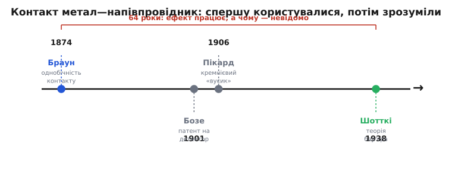
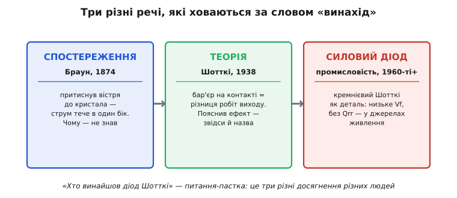

# 📜 Від «котячого вусика» до бар'єра Шотткі

Є одна дивна, майже незручна річ у назві «діод Шотткі»: людина, чиє ім'я на ньому стоїть, народилася **через дванадцять років** після того, як цей самий діод уже працював у чужих руках. Ефект, на якому тримається весь прилад, побачили 1874 року. Вальтер Шотткі народився 1886-го. Свою теорію, що дала діодові ім'я, він оприлюднив аж 1938-го — за шістдесят чотири роки після першого спостереження.

Це не помилка й не історична несправедливість. Це найчастіший, найтиповіший спосіб, у який народжуються прилади: спершу хтось **натикається** на явище й починає ним користуватися, не розуміючи чому; десятиліттями воно служить як фокус, який працює, але який ніхто не вміє пояснити; і лише потім приходить теорія — і, за іронією, забирає собі назву. Розберімо цю історію по кроках, бо в ній видно, як узагалі влаштоване відкриття: чим спостереження відрізняється від пояснення, а пояснення — від готового виробу.

*Однобічну провідність контакту метал—напівпровідник спершу побачили й почали використовувати, і лише через шістдесят чотири роки пояснили. Проміжок між «працює» і «зрозуміло чому» — головна думка всієї історії.*

## Браун притискає дріт до кристала

1874 рік, Лейпциг. Двадцятичотирирічний Карл Фердинанд Браун (*Karl Ferdinand Braun*) — німецький фізик, родом із Фульди — щойно склав учительський іспит і викладає математику та природознавство в лейпцизькій Томас-школі (тій самій, де колись працював Бах). Викладання викладанням, але поза уроками він досліджує, як тече струм крізь різні речовини. І натрапляє на дивину.

Він бере кристали металевих сульфідів — свинцевий блиск (галеніт, PbS), мідний і залізний колчедан — і пропускає крізь них струм. За звичайним законом Ома опір має бути тим самим, хоч куди тече струм: провідник — він і назад провідник. А тут — ні. Браун виявляє, що опір такого контакту **залежить від напрямку струму**: в один бік струм іде легше, в інший — важче, і різниця сягає до третини величини (до ~30 %). Він публікує це того ж року в поважному часописі — статтею з назвою «Ueber die Stromleitung durch Schwefelmetalle» («Про проходження струму крізь металеві сульфіди») у Погендорфових «Анналах».

> 🔧 **Навіщо це.** Саме ця асиметрія — і є суть будь-якого діода: пропускати струм в один бік і заступати дорогу в інший. Браун першим у світі задокументував випрямний ефект на твердому тілі. Те, що він тримав у руках, — вістря дроту, притиснуте до кристала сульфіду, — фізично **той самий** контакт метал—напівпровідник, що й у сучасному діоді Шотткі. Примітивний, невідтворюваний від кристала до кристала, але той самий за природою.

Тут важлива точність, бо історію Брауна часто плутають. Відкриття він зробив **у Лейпцигу**, не у Вюрцбурзі — Вюрцбург був раніше, коротким асистентством одразу після захисту, ще до цієї роботи; пізніше Браун очолюватиме кафедри в Марбурзі, Страсбурзі, Карлсруе, Тюбінгені. І ще: Браун **не зрозумів**, чому контакт випрямляє. Він чесно описав, що бачить — асиметрію опору, — але механізму не мав. Пояснити його на той час не міг ніхто: до квантової теорії твердого тіла, до самого поняття «напівпровідник» у нинішньому сенсі лишалися десятиліття. Це чистий приклад **спостереження без теорії**: явище зафіксоване, назване, виміряне — і незрозуміле.

Статус: **усталений факт**. Дата, авторство, назва статті, місце — усе підтверджене першоджерелом і біографіями. Браун за цю та інші заслуги 1909 року розділить Нобелівську премію з фізики з Марконі (*Guglielmo Marconi*) — але, що характерно, **за радіотелеграфію**, за свій безіскровий контур передавача, а зовсім не за випрямний контакт. Випрямляч 1874 року тоді ще нікому не здавався важливим.

## «Котячий вусик»: діод, якого не розуміли, стає масовим

Півстоліття Браунів контакт лежав курйозом. Він ожив, коли з'явилося радіо, — і виявилося, що цей незрозумілий ефект розв'язує пекучу практичну задачу.

Щоб почути радіосигнал, високочастотні коливання з антени треба **випрямити** — здерти з них звукову обвідну, інакше в навушнику буде тиша. Потрібен був діод. Електронні лампи щойно з'явилися, коштували дорого, вимагали розжарення й живлення. А контакт метал—кристал не вимагав нічого: притиснув дротик до правильного місця на кристалі галеніту — і маєш детектор, який сам випрямляє, без живлення взагалі.

Так народився **«котячий вусик»** (англ. *cat's whisker*): тонкий пружний дротик, яким намацують на поверхні кристала «чутливу» точку. Назва точна до буквальності — дротик і справді схожий на кошачу вусину, і поводитися з ним доводилося так само делікатно. Точка була капризна: заденеш кристал — і треба шукати наново, водячи вусиком, доки станція знову не озветься. Але для мільйонів перших радіоаматорів це був єдиний доступний приймач — простий, дешевий, без батарей.

За патенти на цей детектор змагалося кілька людей, і тут теж корисно розрізняти, хто що зробив:

- **Джагадіш Чандра Бозе** (*Jagadish Chandra Bose*) — бенгальський фізик із Калькутти — застосував контакт металу з кристалом для приймання надвисокочастотних хвиль і 1901 року подав у США патент на точковий напівпровідниковий випрямляч-детектор. Це одне з найраніших свідомих використань ефекту в радіо.
- **Ґрінліф Пікард** (*Greenleaf Whittier Pickard*) — американський інженер — між 1902 і 1906 роками перебрав тисячі мінералів, шукаючи найкращий, і 1906-го запатентував детектор на **кремнії**. Він же із партнерами заснував фірму, що продавала кристалічні детектори, — імовірно, перша компанія, яка виготовляла й продавала кремнієві напівпровідникові прилади взагалі.

Зверніть увагу на дати: **1901, 1906**. Люди патентують, виробляють і масово продають прилад — а пояснення того, чому він працює, ще **не існує**. Інженери підбирали кристали й метали суто навпомацки, за таблицями «що з чим краще випрямляє», як кухар підбирає спеції на смак. Працювало — і добре; чому — питання відкладали. Це другий важливий урок історії: **робоча технологія цілком може випереджати теорію на десятиліття**. Спершу вміння, потім розуміння — а не навпаки.

## Шотткі пояснює бар'єр

Тепер на сцену виходить людина, чиє ім'я зрештою дістанеться діодові.

Вальтер Ганс Шотткі (*Walter Hans Schottky*) народився 1886 року **в Цюриху** — у сім'ї німецького математика Фрідріха Шотткі, який саме тоді викладав у Цюрихському університеті. Батьки німці, і 1892-го родина повертається до Німеччини; Вальтер згодом захищає докторат у Берліні під керівництвом самого Макса Планка (*Max Planck*). Отже за точним розрізненням: **німець за походженням і громадянством, народжений у Швейцарії**. Кар'єру він зробить здебільшого в промисловості — багато років дослідником у концерні «Сіменс».

До 1930-х фізика вже мала апарат, якого бракувало Браунові: квантову механіку, зонну теорію, ясне поняття напівпровідника з його донорами й акцепторами. З'явилася змога нарешті **пояснити** старий випрямний контакт. І 1938 року Шотткі це робить — короткою, але вирішальною роботою «Halbleitertheorie der Sperrschicht» («Напівпровідникова теорія загороджувального шару») у часописі «Naturwissenschaften».

Суть його ідеї — та, що й досі лежить в основі приладу. Коли метал торкається напівпровідника, електрони перетікають між ними, доки їхні енергетичні рівні не зрівняються. Біля межі з боку напівпровідника лишається шар, збіднений на вільні носії, а в ньому — **потенціальний бар'єр**. Висота цього бар'єра визначається **різницею робіт виходу** металу й напівпровідника (робота виходу — енергія, потрібна, щоб вирвати електрон із матеріалу назовні). Струмові в один бік бар'єр майже не заважає, а в інший — заступає дорогу. Ось і випрямлення. Те, що Браун намацав руками й не зміг пояснити, Шотткі вивів із перших принципів фізики твердого тіла.

> 🔧 **Навіщо це.** Це не просто «нарешті зрозуміли». Теорія бар'єра дала **важіль керування**: якщо висота бар'єра — це різниця робіт виходу, то, **добираючи метал**, її можна навмисне робити високою чи низькою. Саме тому інженер сьогодні може замовити діод Шотткі з наперед заданим прямим падінням — низьким для малих втрат або трохи вищим заради меншого витоку. Поки ефект був загадкою, ним лише користувалися; щойно він став теорією — ним навчилися **проєктувати**. У цьому вся практична цінність пояснення.

І тут — ще один урок, уже про саму природу науки. Теорію бар'єра на контакті метал—напівпровідник **не створив одноосібно** один геній. Майже одночасно й незалежно до близьких висновків прийшли інші: англієць Невілл Мотт (*Nevill Mott*, майбутній нобелівський лауреат) у роботі 1938–1939 років і фізик Борис Давидов. Через це фізичну картину подеколи звуть **моделлю Шотткі—Мотта**. Сам Шотткі, до речі, надрукував ту коротку замітку 1938 року **поспіхом, саме щоб застовпити першість** перед Моттом, — виразний слід того, що ідея визріла в кількох головах воднораз, а не спалахнула в одній. Ім'я закріпилося за Шотткі, але за ним стоїть колективна праця кількох людей у різних країнах. Приписати винахід одній людині — майже завжди спрощення; тут воно видно як на долоні.

Статуси: народження, громадянство, дата й назва роботи Шотткі — **усталені факти**. Одночасність і незалежність внесків Мотта й Давидова — теж **усталений факт** історії фізики; конкретний розподіл заслуг між ними — питання, де фахівці розставляють акценти по-різному, тож чесно казати «модель Шотткі—Мотта», а не «діод, який винайшов Шотткі».

## Три різні речі під одним словом «винахід»

Тепер стає видно, чому питання «хто винайшов діод Шотткі» — пастка. Під словом «винахід» тут ховаються **три різні досягнення**, розділені десятиліттями й зроблені різними людьми.

*Спостереження ефекту, його теоретичне пояснення й промисловий силовий прилад — три окремі речі. Плутанина між ними й породжує суперечки «хто перший».*

**Спостереження ефекту** — Браун, 1874. Побачив і виміряв асиметрію, але не пояснив. Це вже діод — фізично, — але ще не осмислений.

**Теорія бар'єра** — Шотткі (разом із Моттом і Давидовим), 1938. Пояснила, **чому** контакт випрямляє, і дала спосіб цим керувати. Це вже розуміння — але ще не деталь у корпусі.

**Промисловий силовий діод** — інженерія, від 1960-х і далі. Одна річ — розуміти фізику бар'єра; зовсім інша — навчитися робити з неї **надійну масову деталь**: чистий кремній, рівномірний металевий контакт по всій площі, керована висота бар'єра, корпус із гарним тепловідводом. Тільки коли це склалося, діод Шотткі став тим, за чим ми сьогодні по нього тягнемося, — компонентом для випрямлячів і імпульсних перетворювачів. Це вже виріб — плід праці багатьох інженерів, чиїх імен історія здебільшого не зберегла.

Ось чому чесна відповідь на «хто винайшов діод Шотткі» — «ніхто окремо». Браун побачив. Радіоінженери зробили масовим, не розуміючи. Шотткі з колегами пояснив. Промисловість перетворила пояснення на деталь. Ім'я дісталося тому, хто дав **теорію**, — і в цьому є своя логіка: назва відсилає не до першого дотику й не до першого виробу, а до тієї миті, коли явище перестало бути фокусом і стало зрозумілою фізикою, якою можна свідомо користуватися. Але за одним прізвищем на корпусі стоїть довгий ланцюг рук — і в цьому, а не в культі одного «винахідника», і полягає справжня історія майже кожного приладу.
