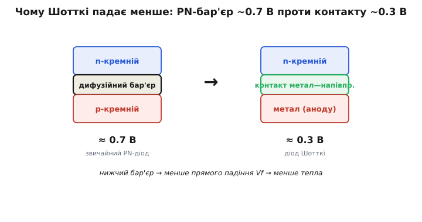
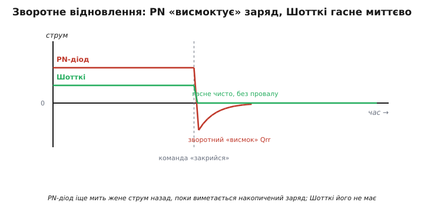
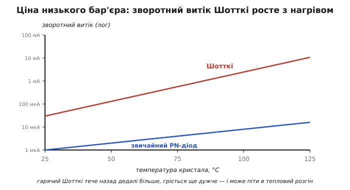

# Діод Шотткі

Звичайний кремнієвий діод пропускає струм в один бік — але бере за це дорого: поки струм тече вперед, на діоді падає близько 0.7 В, і кожен цей вольт, помножений на струм, згорає теплом. У сигнальному колі, де струми міліампери, це дрібниця. Але в силовому вузлі, де через випрямляч ідуть ампери й перемикання відбуваються сотні тисяч разів на секунду, ці 0.7 В стають ватами тепла й радіатором завбільшки з саму мікросхему.

**Діод Шотткі** (названий на честь німецького фізика Вальтера Шоттки, *Walter Schottky*, що дав теорію бар'єра на контакті метал—напівпровідник) розв'язує саме цю проблему. Він проводить струм в один бік так само, як звичайний діод, але падає на ньому лише ~0.3–0.4 В замість ~0.7 В, і закривається він майже миттєво. Обидві переваги — і низьке падіння, і швидкість — випливають з однієї фізичної причини: у Шотткі немає повноцінного p-n-переходу. Розберімо, звідки береться ця причина, що вона дає задарма, і чим доводиться платити.

## Чому звичайний діод падає ~0.7 В

Щоб побачити, що усуває Шотткі, спершу треба зрозуміти, звідки взагалі береться падіння в звичайному діоді. Кремнієвий діод — це p-n-перехід: межа між областю кремнію з надлишком дірок (p, легованою акцепторами) і областю з надлишком електронів (n, легованою донорами). На самій межі електрони з n-боку й дірки з p-боку дифундують назустріч і рекомбінують, залишаючи по собі шар без вільних носіїв — **збіднену зону**. Оголені йони домішок у цьому шарі створюють внутрішнє електричне поле, а разом з ним — потенціальний бар'єр, **вбудований дифузійний потенціал**. Для кремнію він виходить приблизно 0.6–0.7 В.

Поки зовнішня напруга не «зрівняє» цей вбудований потенціал, крізь перехід майже нічого не тече. Тому пряме падіння звичайного діода — це не омічний опір (не I·R), а фіксована **висота бар'єра**, яку треба сплатити, перш ніж відкриється лавина провідності. Звідси й характерне «діод відкривається на 0.7 В»: до цієї напруги струм крихітний, після неї він росте стрімко. (Точну форму цієї залежності описує [експонента ВАХ діода](topic:electronics/diode-iv-curve) — тут нам вистачить самої висоти бар'єра.)

Є й другий, прихований наслідок p-n-переходу, який виявиться щойно ми спробуємо діод **закрити**. Поки він відкритий, у базу з обох боків нагнітається заряд неосновних носіїв — дірки залітають у n-область, електрони в p-область, і там вони деякий час живуть, перш ніж рекомбінувати. Цей **накопичений неосновний заряд** доведеться кудись подіти, коли ми різко змінимо полярність. Запам'ятаймо це — саме тут криється друга слабкість звичайного діода.

## Що робить контакт метал—напівпровідник

Тепер прибираймо причину бар'єра. Діод Шотткі влаштований радикально простіше: замість двох легованих напівпровідників у нього **контакт металу з напівпровідником** — зазвичай шар металу (аноду) на злегка легованому n-кремнії (катоду). P-області немає взагалі.

Коли метал торкається n-кремнію, електрони перетікають між ними, доки їхні рівні енергії не зрівняються, і на межі теж утворюється збіднений шар з бар'єром — **бар'єр Шотткі**. Але висота цього бар'єра визначається не вбудованим дифузійним потенціалом двох легувань, а лише **різницею робіт виходу** металу й напівпровідника (робота виходу — енергія, потрібна, щоб вирвати електрон з матеріалу). Підбором металу цей бар'єр роблять помітно нижчим за p-n-шний — типово ~0.3–0.4 В замість ~0.7 В.

Нижчий бар'єр — менше напруги треба сплатити на вході в провідність — менше прямого падіння Vf — менше тепла на кожному ампері струму. Ось і вся суть першої переваги, в одному причинному ланцюжку.


*У звичайному діоді струму заступає дорогу високий дифузійний бар'єр двох легованих областей (~0.7 В); у Шотткі — лише невисокий бар'єр контакту метал—напівпровідник (~0.3 В). Нижчий бар'єр напряму означає менше прямого падіння, а отже й менше тепла.*

> 🔧 **Навіщо це.** У даташиті будь-якого діода перша ж цифра, на яку дивляться в силовому колі, — Vf на робочому струмі. Заміна звичайного випрямного діода на Шотткі в тому самому місці зрізає падіння вдвічі: там, де кремнієвий випрямляч на 5 А палив би 0.7 В × 5 А = 3.5 Вт, Шотткі спалить ~0.4 В × 5 А = 2 Вт. Це різниця між «потрібен радіатор» і «вистачить мідного полігону на платі».

## Друга перевага задарма: немає зворотного відновлення

Той самий факт — контакт метал—напівпровідник замість p-n — дає другу перевагу, і саме вона робить Шотткі незамінним у високочастотних перетворювачах.

У Шотткі струм несуть **лише основні носії** — електрони з n-кремнію (за цю «гарячість» електронів, що перестрибують бар'єр, діод Шотткі ще звуть *hot-carrier diode*, «діод на гарячих носіях»). Металевий анод не інжектує в кремній дірок — накопиченого неосновного заряду просто **немає**. А раз нема чого накопичувати, то нема чого й виметати при закриванні.

Порівняймо це зі звичайним діодом. Коли p-n-діод, що вів струм уперед, різко перемикають у зворотну полярність, він **не закривається одразу**. Спершу схема мусить висмоктати той накопичений дірковий заряд, що встиг натекти в базу, — і поки заряд виметається, діод ще мить проводить струм у **зворотний** бік. Струм провалюється нижче нуля, тримається там, доки заряд не піде, і лише тоді діод перекривається. Цей провал зветься **зворотним відновленням** (*reverse recovery*), а заряд, який довелося вимести, — Qrr. Кожне таке відновлення — це і втрачений час, і сплеск втрат, бо в момент провалу на діоді одночасно є і струм, і напруга.

Шотткі гасне чисто: струм доходить до нуля й зупиняється, без провалу назад. Для перетворювача, що комутує сотні тисяч разів на секунду, це критично — кожен зайвий сплеск множиться на частоту й перетворюється на постійний нагрів. Тонший механізм цього провалу й від чого залежить Qrr — в окремій темі про [зворотне відновлення діода](topic:electronics/reverse-recovery).


*Коли надходить команда «закрийся», p-n-діод ще мить жене струм у зворотний бік, поки виметається накопичений заряд Qrr, — струм провалюється нижче нуля й повертається до нуля по хвості. Шотткі неосновного заряду не має, тож обриває струм майже вертикально, без зворотного провалу.*

> 🔧 **Навіщо це.** У [понижувальному buck-перетворювачі](topic:electronics/buck) чи [підвищувальному boost](topic:electronics/boost) діод відкривається й закривається щоцикла — десятки й сотні тисяч разів на секунду. Постав туди звичайний випрямний діод — і на кожному циклі отримаєш сплеск reverse-recovery, що гріє і сам діод, і силовий ключ поруч, та ще й сипле електромагнітними завадами. Шотткі (або ще швидший діод) тут не примха, а вимога: без нього перетворювач на пристойній частоті просто не матиме потрібного ККД.

## За що платимо: зворотний витік і низька зворотна напруга

Задарма не буває. Той самий низький бар'єр, що дає всі переваги, має зворотний бік — буквально.

Коли Шотткі закритий (на нього подано зворотну напругу), крізь нього все одно тече невеликий **зворотний струм витоку**. У будь-якого діода тепловому електрону іноді вистачає енергії перестрибнути бар'єр «не туди»; але в Шотткі бар'єр **нижчий**, тож перестрибнути його легше, і зворотний витік на порядки більший, ніж у p-n-діода з його високим бар'єром. Мало того — цей витік **круто росте з температурою**: що гарячіший кристал, то більше електронів мають достатньо теплової енергії, і струм витоку зростає в рази на кожні кілька десятків градусів.

Тут ховається пастка, специфічна саме для Шотткі, — **тепловий розгін** (детально механізм розібрано в темі про [тепловий розгін транзистора](topic:electronics/thermal-runaway), фізика та сама). Зворотний витік тече крізь діод, на якому стоїть зворотна напруга, тож він **виділяє потужність** (P = Vзвор × Iвитоку). Ця потужність гріє кристал; гарячіший кристал дає ще більший витік; більший витік гріє ще дужче. Якщо тепло не встигає відводитися, петля замикається сама на себе, і діод іде в розгін — аж до теплового пробою. Тому Шотткі, що працює під високою зворотною напругою й у теплі, треба свідомо перевіряти на цей сценарій, а не лише на пряме падіння.


*Зворотний витік Шотткі на порядки більший за p-n-діод і круто зростає з нагрівом кристала (вісь витоку логарифмічна). Оскільки цей витік під зворотною напругою сам гріє діод, за поганого тепловідводу петля «гарячіше → більший витік → ще гарячіше» може замкнутися в тепловий розгін.*

Друга плата — **низька допустима зворотна напруга**. Тонкий низький бар'єр витримує менше, ніж товстий перехід p-n-діода: типові кремнієві Шотткі роблять на 20, 40, 60, 100 В, і що вищу зворотну напругу закладено, то більший у них питомий витік і пряме падіння — усе взаємопов'язано. Класичний кремнієвий Шотткі на 600 В просто не роблять: там, де потрібні і висока напруга, і швидкість, беруть діоди з ширшою забороненою зоною — карбіду кремнію (SiC). Тому правило вибору звучить так: Шотткі — це діод для **низьких і середніх напруг**, де його низьке Vf і швидкість вирішують, а зворотної напруги вистачає з запасом.

> 🔧 **Навіщо це.** Обираючи Шотткі, не бери «з мінімальним Vf» наосліп. Спершу глянь, яка максимальна зворотна напруга буде на діоді в схемі (у buck це вхідна напруга плюс запас на дзвін), і візьми діод із запасом за нею. Тоді серед придатних за напругою вибирай за Vf і струмом. І якщо діод працюватиме гарячим під помітною зворотною напругою — порахуй його зворотний витік при робочій температурі з даташиту, щоб не влетіти в розгін.

## Куди його ставлять

Три властивості — низьке Vf, швидке закривання, однонапрямність — визначають, де Шотткі поза конкуренцією.

**Черговий (freewheel) діод в імпульсних перетворювачах.** У buck-перетворювачі, коли верхній ключ розмикається, струмові котушки потрібен зворотний шлях на землю — його дає діод, що відкривається сам від напруги вузла. Тут Шотткі виграє двічі: низьке Vf прямо зменшує втрати на цьому шляху (а він активний більшу частину циклу), а відсутність Qrr прибирає сплески на кожному перемиканні. Коли струми стають великими, а Vвих низькою, навіть Шотткі гріється забагато — і тоді його замінюють активним ключем, [синхронним випрямлячем](topic:electronics/sync-rectifier); але доти асинхронна схема з діодом Шотткі проста й дешева.

**Випрямлення низьких напруг.** У [випрямлянні](topic:electronics/rectification) змінної напруги в постійну на кожному діоді губиться його Vf. Коли випрямляють невисоку напругу (скажімо, вторинну обмотку на 5 В), втратити 0.7 В у кремнієвому [діодному мості](topic:electronics/bridge-rectifier) — це відчутна частка; Шотткі з його ~0.4 В повертає цю частку у навантаження. Тому в низьковольтних випрямлячах ставлять саме Шотткі.

**Or-ing і захист від переполюсування.** Коли два джерела живлення об'єднують так, щоб струм ішов лише від сильнішого (діодне «АБО»), або ставлять діод послідовно, щоб він не пускав струм при [неправильній полярності живлення](topic:electronics/reverse-polarity-protection), кожен вольт падіння на діоді — це втрачена напруга й тепло. Шотткі з ~0.4 В програє тут менше, ніж кремнієвий діод. (На великих струмах навіть це забагато, і діод замінюють на MOSFET з керуванням — «ідеальний діод», — але для скромних струмів Шотткі лишається простим і чесним рішенням.)

## Worked-приклад: скільки тепла економить заміна на Шотткі

Порахуймо конкретно, що дає заміна звичайного випрямного діода на Шотткі в чинному вузлі — на цифрах, які реально стоять у прошивці, коли вона рахує тепловий бюджет свого живлення.

**Пряме падіння й тепло: кремнієвий діод (Vf = 0.7 В) проти Шотткі (Vf = 0.4 В) на струмі 3 А, у корпусі з тепловим опором θ = 40 °C/Вт.**

:::tabs
```cpp
// Прошивка сама живиться від цієї шини й телеметрує її тепловий стан.
// Той самий розрахунок вирішує, чи вистачить діода без радіатора.
float I      = 3.0f;   // прямий струм крізь діод, А
float Vf_si  = 0.70f;  // пряме падіння кремнієвого діода, В
float Vf_sch = 0.40f;  // пряме падіння Шотткі, В
float theta  = 40.0f;  // тепловий опір кристал→середовище, °C/Вт
float Tamb   = 45.0f;  // температура довкола плати, °C

float P_si  = Vf_si  * I;            // 0.70 * 3 = 2.10 Вт
float P_sch = Vf_sch * I;            // 0.40 * 3 = 1.20 Вт

float dT_si  = P_si  * theta;        // 2.10 * 40 = 84 °C нагрів над середовищем
float dT_sch = P_sch * theta;        // 1.20 * 40 = 48 °C нагрів над середовищем

float Tj_si  = Tamb + dT_si;         // 45 + 84 = 129 °C — на межі, гаряче
float Tj_sch = Tamb + dT_sch;        // 45 + 48 = 93 °C — з запасом
```
```python
# Прошивка сама живиться від цієї шини й телеметрує її тепловий стан.
# Той самий розрахунок вирішує, чи вистачить діода без радіатора.
I      = 3.0    # прямий струм крізь діод, А
Vf_si  = 0.70   # пряме падіння кремнієвого діода, В
Vf_sch = 0.40   # пряме падіння Шотткі, В
theta  = 40.0   # тепловий опір кристал→середовище, °C/Вт
Tamb   = 45.0   # температура довкола плати, °C

P_si  = Vf_si  * I                   # 0.70 * 3 = 2.10 Вт
P_sch = Vf_sch * I                   # 0.40 * 3 = 1.20 Вт

dT_si  = P_si  * theta               # 2.10 * 40 = 84 °C нагрів над середовищем
dT_sch = P_sch * theta               # 1.20 * 40 = 48 °C нагрів над середовищем

Tj_si  = Tamb + dT_si                # 45 + 84 = 129 °C — на межі, гаряче
Tj_sch = Tamb + dT_sch               # 45 + 48 = 93 °C — з запасом
```
:::

Заміна на Шотткі зрізала розсіювану потужність з 2.1 до 1.2 Вт — майже вдвічі — і опустила температуру кристала зі 129 °C (де кремнієвий діод уже на межі свого максимуму ~150 °C і будь-яке підвищення струму чи довколишньої температури штовхне його за край) до спокійних 93 °C. Ті самі 0.9 Вт, що більше не гріють діод, — це і менший нагрів усього вузла, і вищий ККД. Ось чому в низьковольтних силових вузлах Шотткі — типовий вибір, а не виняток.

## Звідки взявся Шотткі

Контакт метал—напівпровідник, що пропускає струм в один бік, знали задовго до транзистора — раніше, ніж узагалі зрозуміли, як він працює.

> Однобічну провідність кристала відкрив німецький фізик Фердинанд Браун (*Ferdinand Braun*) ще 1874 року у Вюрцбурзі: вістря дроту, притиснуте до кристала сульфіду, пропускало струм переважно в один бік. Це був фактично примітивний діод Шотткі — той самий контакт метал—напівпровідник. Такі «котячі вусики» (*cat's whisker*) стали першими детекторами в кристалічних радіоприймачах. Теорію ж бар'єра, що пояснює це випрямлення різницею робіт виходу, дав Вальтер Шотткі аж 1938 року — і саме тому діод носить його ім'я, хоч сам ефект спостерігали за півстоліття до того.

[Історія: від «котячого вусика» до бар'єра Шотткі](topic:electronics/schottky-diode/hist-metal-semiconductor.md)
