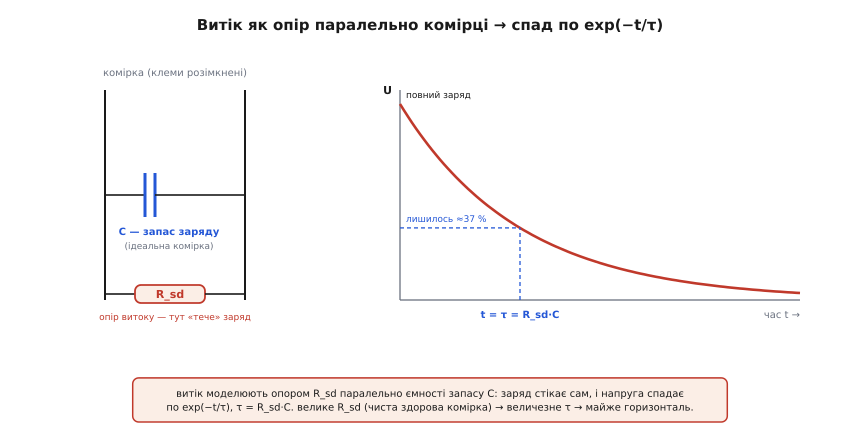
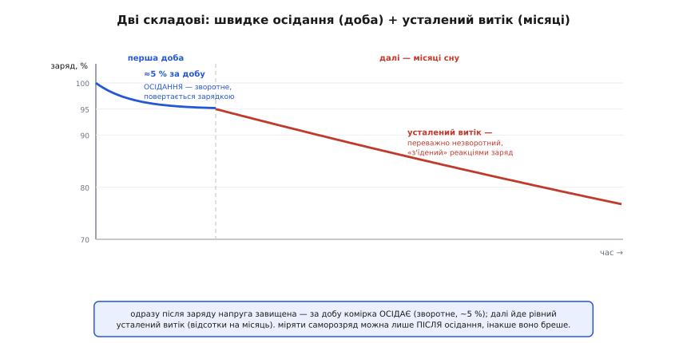
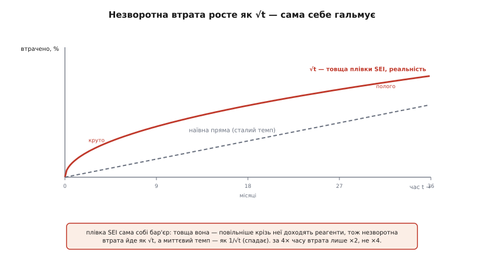

# 🧮 Математика саморозряду

Саморозряд легко описати словами — «заряд повільно тече зсередини» — але щоб *передбачити* його наперед (скільки втратить партія за півроку на теплому складі; на скільки збреше паливомір після трьох місяців сну; де межа, за якою комірка сама сповзе в небезпеку), самих слів мало. Потрібна кількісна модель: рівняння, у яке підставляєш час, температуру й рівень заряду — а на виході отримуєш втрату у відсотках. Ця вставка будує таку модель з першопринципів: спершу найпростіший образ витоку як опору, потім поділ спаду на дві часові шкали, далі температурний множник за Арреніусом і, нарешті, чому незворотна частина росте не рівно, а сповільнюючись — як √t. Кожна формула тут не постулат, а наслідок конкретного фізичного механізму, і я показуватиму цей механізм, а не лише кінцевий вираз.

## Найпростіший образ: витік як опір паралельно комірці

Почнімо з питання, на яке відповідає вся модель: **як заряд може текти, коли до комірки нічого не під'єднано?** Ззовні коло розімкнене, струм крізь клеми нульовий — а заряду меншає. Значить, шлях для струму лежить **усередині** самої комірки. І щойно ми це визнали, напрошується найпростіший спосіб його описати: якщо десь усередині тече струм пропорційно до напруги, то це поводиться рівно як **резистор**. Не справжній дротяний опір, а *ефективний* — сукупність усіх внутрішніх шляхів (побічні реакції, мікромістки крізь сепаратор, поверхнева плівка), які разом дають витік. Позначимо цей ефективний опір R_sd (англ. *self-discharge resistance* — опір саморозряду).

Тепер уявімо запас заряду комірки як велику ємність C — конденсатор, що тримає заряд Q при напрузі U. Це груба, але чесна аналогія: у конденсаторі теж Q = C·U, і в комірці більший заряд означає вищу напругу. Приєднаймо R_sd паралельно цій ємності — і отримаємо класичну RC-схему, у якій заряджений конденсатор саморозряджається крізь власний опір витоку.


*Ліворуч — еквівалентна схема: ідеальна комірка як ємність запасу C, а весь внутрішній витік зведено в один опір R_sd паралельно їй. Праворуч — до чого це веде: напруга на розімкнених клемах спадає по exp(−t/τ), τ = R_sd·C. Здорова чиста комірка має величезне R_sd, тому τ — роки, і крива майже горизонтальна.*

> 🔧 **Навіщо це.** Звести всю мішанину внутрішньої хімії до одного числа R_sd — це не спрощення заради краси, а те, що дає **вимірюваність**. Опір витоку не поміряти омметром (він мізерний струм, схований усередині), зате його легко *обчислити* з двох замірів напруги спокою через відомий час — і саме так у лабораторіях і в розумних BMS відрізняють здорову комірку від бракованої з мікрокоротким: у поганої R_sd на порядок менше, і це видно за швидшим просіданням напруги.

Що дає ця схема кількісно? Струм витоку в кожну мить — за законом Ома: [Закон Ома](book:electronics/ohms-law) — струм = напруга / опір, базовий зв'язок величин.

```
I_leak = U / R_sd
```

Цей струм забирає заряд з ємності, тож напруга падає. Швидкість падіння напруги — це струм, поділений на ємність (бо dU = dQ/C, а dQ/dt = −I). [Похідна](book:math/derivative) — миттєва швидкість зміни величини; тут це швидкість зміни напруги в часі.

```
dU/dt = −I_leak / C = −U / (R_sd · C)
```

Ось воно — рівняння, де швидкість зміни величини пропорційна самій величині. Це **фундамент експоненційного спаду**: що вища напруга, то більший струм витоку, то швидше вона падає; що нижча — то повільніше. Розв'язок такого рівняння відомий: [Експоненційне ОДУ](book:math/exponential-ode) — рівняння виду dy/dt = −y/τ, чия швидкість зміни пропорційна самій величині, розв'язується експонентою.

```
U(t) = U₀ · exp(−t / τ),      τ = R_sd · C
```

Величина **τ (тау) — часова стала** (англ. *time constant*): час, за який напруга спадає в e ≈ 2.718 раза, тобто до ≈37% від початкової над рівнем «дна». Вона й задає темп усього процесу. Ключова інтуїція: **τ = R_sd·C**. Більший опір витоку (чистіша, здоровіша комірка) → більша τ → повільніший спад. Більша ємність (більша батарея) при тому самому опорі теж дає більшу τ — велика батарея в *відносних* відсотках саджається повільніше за дрібну комірку з тим самим R_sd, бо їй є звідки втрачати.

Прикиньмо порядок τ для реальної комірки, щоб відчути масштаб. Хай літій-іонна комірка на 3000 мА·год саджається 2% на місяць. Тоді:

**Приклад (яка τ ховається за «2% на місяць»).** Знайдімо часову сталу й ефективний опір витоку.

```
2 %/міс — це частка exp-спаду за місяць:
   U(1 міс)/U₀ = 1 − 0.02 = 0.98
   exp(−1/τ) = 0.98   →   τ = −1 / ln(0.98) ≈ 49.5 місяця ≈ 4 роки

Тобто «дно» комірка мала б покласти аж за роки — цілком у дусі того,
що літій живе на полиці місяцями без біди.

Ефективний опір (беручи «ємність запасу» умовно):
   C_запасу ≈ Q / U ≈ (3000 мА·год · 3600 с) / 3.7 В ≈ 2.9·10⁶ Ф  (!)
   R_sd = τ / C = (49.5 · 30 · 86400 с) / 2.9·10⁶ ≈ 44 Ом... на комірку?
```

Останній рядок навмисно доведено до абсурду, щоб показати **де аналогія ламається**. «Ємність запасу» комірки — це мільйони фарад: жоден конденсатор так не запасає, бо в комірці заряд тримає *хімія*, а не електричне поле між пластинами. Тому чисельне R_sd з цієї моделі — фікція, і рахувати його в омах немає сенсу. **Модель дає правильну *форму* — exp(−t/τ) — і правильну *якісну* залежність (більше R_sd → повільніше), але не фізичні числа опору.** Це важлива межа: RC-схема — це мова опису темпу, а не буквальна електрична схема комірки.

І тут криється друга, глибша межа. Реальний саморозряд керує **не напруга**, а хімія: побічні реакції на електродах ідуть майже з тим самим темпом, поки заряду ще багато, і мало залежать від того, 4.1 В зараз чи 4.0 В. Це означає, що на більшій частині шляху витік ближчий не до «пропорційного напрузі» (як у чистого резистора), а до **майже постійного струму** — комірка тратить приблизно однакову частку на місяць, доки не наблизиться до порожнього. Тому в інженерній практиці частіше беруть не exp-спад, а простіший лінійний темп: «стільки-то відсотків на місяць». Розберімо, коли яка модель правдива.

## Дві часові шкали: швидке осідання плюс повільний витік

Якщо поміряти напругу свіжозарядженої комірки щогодини, побачиш не одну плавну експоненту, а **дві різні поведінки, склеєні в часі**. Перші години-добу напруга падає помітно швидко, потім злам — і далі повзе дуже повільно. Це не одна крива з однією τ, а **сума двох процесів із різними часовими сталими**, і плутати їх — головна пастка вимірювання саморозряду.


*Одразу після заряду напруга завищена, і за першу добу комірка круто осідає до рівноваги (синє, ~5%, зворотне — повертається зарядкою). Далі йде рівний усталений витік (червоне, відсотки на місяць, переважно незворотний). Через це саморозряд коректно міряти лише ПІСЛЯ осідання: інакше швидка фаза видасть себе за страшний темп.*

**Швидка складова — осідання (релаксація).** Одразу по заряді приповерхневі шари електродів «перезаряджені» проти глибини: іони ще не встигли рівномірно розподілитися, і напруга спокою завищена над справжнім рівноважним значенням. За перші години-добу система релаксує — заряд перерозподіляється всередину, напруга осідає. Цей заряд **не втрачено**, він просто перейшов у чесніший «повний»; зарядка легко його повертає. У літію ця фаза дає **близько 5% за першу добу** — цифру підтверджують і виробники, і лабораторні заміри релаксації напруги спокою. Математично осідання — це швидкий exp-доданок з малою часовою сталою τ_fast (години):

```
ΔQ_осід(t) ≈ Q_осід · [1 − exp(−t / τ_fast)]     τ_fast ~ години
```

**Повільна складова — усталений витік.** Коли осідання добігло кінця, лишається те, що йде роками: хімічне поїдання заряду побічними реакціями. Тут темп майже сталий у часі (на масштабі місяців) і виражається лінійним відсотком:

```
ΔQ_витік(t) ≈ k · t          k — усталений темп (напр. 2 %/міс)
```

Повна втрата за час t — сума обох:

```
ΔQ(t) = Q_осід · [1 − exp(−t/τ_fast)]  +  k · t
        └────── швидке, зворотне ──────┘   └── повільне, незворотне ──┘
```

Практичний висновок із цієї суми — правило вимірювання, яке інакше не вивести: **міряти саморозряд треба, давши комірці спершу відпочити добу-другу**, щоб перший доданок вичерпався. Поміряєш одразу після заряду — зловиш круту швидку фазу й вирішиш, що комірка тече катастрофічно, хоча то лише зворотне осідання. І навпаки: якщо навіть **після** відпочинку темп k помітно вищий за паспорт — це вже справжня біда (посилені реакції в старій/перегрітій комірці або мікрокоротке в бракованій).

Тепер видно, коли яка з двох моделей першого розділу правдива. **Exp-спад U₀·exp(−t/τ)** добре описує *швидку* фазу (осідання справді керується напругою й падає пропорційно відхиленню від рівноваги) і взагалі будь-який витік, домінований поверхневою/омічною втратою. **Лінійний темп k·t** краще описує *повільну* хімічну фазу, бо реакції йдуть майже незалежно від точної напруги, поки заряду вдосталь. На практиці для сплячого пристрою беруть саме лінійний темп — він простий, а на горизонті місяців exp і пряма майже збігаються (при 2%/міс різниця між ними за рік — лічені відсотки, як побачимо в кінці).

## Температурний множник: правило Арреніуса

Найсильніший важіль саморозряду — температура, і його теж треба вміти рахувати, а не лише знати якісно «в теплі швидше». Механізм цілком конкретний: усталений витік — це хімічні реакції, а швидкість реакції росте з температурою за **законом Арреніуса** (Сванте Арреніус, шведський хімік, сформулював залежність 1889 року — усталений факт фізичної хімії, Нобелівська премія 1903). Ідея закону: щоб реакція сталася, молекули мусять здолати енергетичний бар'єр E_a (енергія активації), а частка молекул, яким теплового руху вистачає на цей бар'єр, росте експоненційно з температурою:

```
k(T) = A · exp(−E_a / (R · T))
```

де T — абсолютна температура в кельвінах, R = 8.314 Дж/(моль·К) — газова стала, A — передекспоненційний множник, E_a — енергія активації (Дж/моль). Сам по собі цей вираз незручний для прикидок. Але нам майже ніколи не треба абсолютне k — треба **відношення** темпів за двох температур, і там A скорочується:

```
k(T₂)/k(T₁) = exp[ (E_a/R) · (1/T₁ − 1/T₂) ]
```

Ось звідки береться знамените інженерне правило. Підставмо реалістичну для літію енергію активації саморозряду й порахуймо, у скільки разів пришвидшується витік на кожні +10 °C біля кімнатної температури.

**Приклад (звідки «×2 на +10 °C»).** Візьмімо E_a, типову для саморозряду літію, і знайдімо множник Q₁₀ (у скільки разів росте темп на +10 °C) біля 25 °C.

```
Умовно E_a ≈ 53 кДж/моль,  T₁ = 298 К (25 °C),  T₂ = 308 К (35 °C):
   Q₁₀ = exp[ (53000/8.314) · (1/298 − 1/308) ]
       = exp[ 6375 · (0.003356 − 0.003247) ]
       = exp[ 6375 · 1.09·10⁻⁴ ]
       = exp(0.693) = 2.00

Тобто саме E_a ≈ 53 кДж/моль (≈0.55 еВ) дає рівно подвоєння на +10 °C.
```

Отже, **правило «кожні +10 °C ≈ ×2» — це закон Арреніуса для конкретної енергії активації близько 0.55 еВ**, а не окремий емпіричний закон. Це варто засвоїти твердо: правило не висіло в повітрі, воно — окремий випадок фундаментальнішої залежності. І звідси одразу видно його межі. Виміряні енергії активації саморозряду літію лежать у ширшому діапазоні — приблизно **0.6–0.94 еВ** (≈60–90 кДж/моль) залежно від хімії й того, яка реакція домінує. А що більша E_a, то **крутіша** температурна залежність:

```
E_a = 0.6 еВ  →  Q₁₀ ≈ 2.1
E_a = 0.7 еВ  →  Q₁₀ ≈ 2.4
E_a = 0.94 еВ →  Q₁₀ ≈ 3.3
```

Тобто «×2 на +10 °C» — це радше **нижня, консервативна оцінка**: реальні комірки часто реагують на тепло ще різкіше (×2.5, а деякі процеси й ×3). Для прикидки «на скільки гірше в теплі» правило ×2 безпечне як мінімум, а точну цифру беруть з паспорта конкретної хімії. Це та сама арреніусова машина, що стоїть за календарним [старінням батарей](book:electronics/battery-aging) — саморозряд і незворотне старіння прискорюються теплом за одним законом, бо це той самий клас реакцій.

Зручна для голови форма правила через Q₁₀:

```
k(T) = k(T_ref) · Q₁₀^((T − T_ref)/10)
```

— темп множиться на Q₁₀ на кожні 10 °C вгору й ділиться на кожні 10 °C униз. Саме цю формулу закладають у прошивку, щоб масштабувати паспортний темп під фактичну температуру зберігання.

**Приклад (холодильник проти спеки).** Комірка тратить 3%/міс за 25 °C. Скільки за 5 °C і за 45 °C при Q₁₀ = 2?

```
За 5 °C  (на 20 °C нижче):  3.0 · 2^(−20/10) = 3.0 · 2⁻² = 3.0/4 = 0.75 %/міс
За 45 °C (на 20 °C вище):   3.0 · 2^(+20/10) = 3.0 · 2²  = 3.0·4 = 12   %/міс

Розрив холодильник↔спека: 12 / 0.75 = 16 разів.
```

Та сама комірка, залежно лише від температури полиці, саджається то вчетверо повільніше, то вчетверо швидше за паспорт — 16-кратна вилка. Ось чому «тримати літій у прохолоді» — не забобон, а прямий наслідок експоненти в законі Арреніуса.

## Чому незворотна частина росте як √t, а не рівно

Лишилася найтонша, але й найкорисніша частина апарату. Досі усталений витік ми брали лінійним, k·t — сталий відсоток на місяць. Для коротких і середніх строків це чесно. Але на **довгих** строках (роки) незворотна складова саморозряду — та, що з'їдає ємність назавжди, — насправді **сповільнюється**: за подвоєний час втрачається *менше*, ніж удвічі. Розберімо, чому, бо механізм і красивий, і практично важливий.

Незворотну втрату в літію головно спричиняє ріст плівки [SEI](book:electronics/battery-aging) (*solid electrolyte interphase*) на аноді: реагенти з електроліту доходять до поверхні анода, реагують, споживають літій — і **самі стають частиною плівки**. І ось ключ: **плівка, що наросла, — це бар'єр для наступної реакції**. Щоб прореагувати далі, реагент (чи електрон) мусить *продифундувати крізь уже наявну плівку*. А що товща плівка — то довший шлях дифузії, то повільніше доходить реагент, то повільніша реакція. Плівка сама себе гальмує: вона — і продукт реакції, і перепона для неї.


*Незворотна втрата (червоне) росте як √t — круто спершу, дедалі пологіше далі, бо товща плівка SEI гальмує власний ріст. Наївна пряма сталого темпу (сіре пунктиром) швидко переоцінює втрату на довгих строках. За вчетверо довший час втрачається лише вдвічі більше, не вчетверо.*

Виведімо форму цієї залежності — вона елементарна. Позначимо L — товщину плівки. Швидкість реакції (а отже й швидкість росту плівки) обернено пропорційна довжині дифузійного шляху, тобто самій товщині L:

```
dL/dt ∝ 1/L         (товща плівка → повільніший ріст)
```

Домножмо обидві сторони на L:

```
L · dL/dt ∝ const   →   d(L²)/dt ∝ const   →   L² ∝ t   →   L ∝ √t
```

Товщина плівки росте як корінь із часу. А **втрачений незворотно заряд Q_irr пропорційний кількості спожитого на плівку літію, тобто товщині плівки** — отже:

```
Q_irr(t) ∝ √t
```

Це і є **параболічний (дифузійно-обмежений) закон росту** — той самий математичний скелет, що керує ростом оксидної плівки на металі, потьмянінням срібла й іржавінням під шаром іржі. Скрізь, де продукт реакції сам стає бар'єром між реагентами, виходить √t. Дослідження SEI підтверджують: коли крок, що лімітує, — дифузія крізь плівку (розчинника чи електронів), товщина й незворотна втрата ємності ростуть саме як корінь із часу.

Практично важливий наслідок — **миттєвий темп спадає як 1/√t**:

```
dQ_irr/dt ∝ 1/√t     (похідна від √t)
```

Тобто «відсотків на місяць» — величина *не стала*: у молодої комірки незворотний витік найшвидший (плівка тонка, гальмувати нічому), а з роками він природно вгамовується. Тому паспортні «2%/міс» — це радше *усереднення першого періоду*, а не вічна константа; на дистанції в роки лінійна екстраполяція **переоцінює** втрату. Порахуймо, наскільки.

**Приклад (√t проти прямої на дистанції років).** Комірка за перший місяць втратила незворотно 0.5%. Скільки за 4 місяці й за 36 місяців за √t-законом — і що напророчила б наївна пряма?

```
√t-закон:  Q_irr(t) = 0.5 % · √(t / 1_міс)

t = 4 міс:   0.5 · √4  = 0.5 · 2 = 1.0 %      (пряма дала б 0.5·4 = 2.0 %)
t = 36 міс:  0.5 · √36 = 0.5 · 6 = 3.0 %      (пряма дала б 0.5·36 = 18 % !)

За 3 роки наївна пряма завищує незворотну втрату в 6 разів.
Правило кореня: вчетверо довший час → лише вдвічі більша втрата.
```

Розрив вражає: там, де пряма лякає 18-ма відсотками за три роки, дифузійне гальмування лишає близько 3%. Саме тому літій-іонні комірки, що *просто лежать* при помірній температурі й напрузі, старіють на диво поволі попри «страшний» лінійний темп молодості — плівка достигла й сама себе стримала.

Тут варто чесно розмежувати два доданки саморозряду за їхньою математикою, бо вони різні:

- **Зворотне осідання** — швидкий exp, τ_fast ~ години; заряд повертається; це не втрата ємності.
- **Незворотний хімічний витік** — на коротку/середню дистанцію ≈ лінійний k·t (зручна інженерна модель), а на роки — точніше **√t** (дифузійне гальмування росту SEI); цей заряд утрачено назавжди, і він одночасно є [старінням](book:electronics/battery-aging).

Для сплячого пристрою на місяці лінійна модель цілком достатня; √t-поправка стає відчутною лише на роки. Але знати про неї треба, щоб не злякатися, лінійно екстраполюючи молодий темп на все життя комірки.

## Де вся ця математика працює в темі

Зведімо апарат до інженерних дій — кожна пряма з відповідної формули.

**Прикинути втрату за N місяців сну при заданій температурі.** Це головна прикладна задача. Береш паспортний темп k при опорній температурі, масштабуєш його за Арреніусом під фактичну температуру, множиш на час. Ось повний робочий приклад — саме той, що ховається за [оцінювачем заряду (SoC)](book:electronics/state-of-charge) сплячого пристрою.

**Приклад (скільки втратить комірка за півроку в теплому складі).** Літій, паспорт 2%/міс за 25 °C. Склад під дахом тримає 35 °C. Скільки заряду піде за 6 місяців сну?

```
1) Масштаб темпу за Арреніусом (Q₁₀ = 2, +10 °C):
      k(35°C) = 2.0 %/міс · 2^((35−25)/10) = 2.0 · 2¹ = 4.0 %/міс

2) Лінійна оцінка за 6 місяців:
      втрата ≈ 4.0 · 6 = 24 %

3) Точніше, exp-моделлю (щоб урахувати, що з кожним місяцем
   лишається менше, від чого й тратити):
      лишок = exp(−0.04 · 6) = exp(−0.24) = 0.787
      втрата = 1 − 0.787 = 21.3 %

Відповідь: близько 21–24 % за півроку — комірка прийде до клієнта
помітно розрядженою (а з ~50%-го зберігання сповзе під 30%!).
```

Зверни увагу на розбіжність лінійної (24%) і exp-оцінки (21.3%): на коротких строках вона крихітна, але коли сумарна втрата велика, лінійна модель починає перебільшувати, бо ігнорує, що витік *пропорційний тому, що ще лишилось*. Для дрібних втрат (одиниці відсотків) бери просту лінійну; для великих (десятки) — exp чесніша.

**Поправка паливоміра за сон.** Кулонометрія (лічба ампер-годин крізь клеми) саморозряду **не бачить у принципі** — витік іде повз клеми. Тому оцінка [SoC](book:electronics/state-of-charge) сплячого пристрою систематично дрейфує вгору, і поправку рахують саме цією математикою: знаючи час сну (від годинника реального часу), температуру й хімію, прошивка віднімає передбачену втрату k(T)·Δt від оцінки заряду ще до пробудження. У коді це буквально кілька рядків:

:::tabs
```cpp
#include <algorithm>
#include <cmath>

constexpr float q10 = 2.0f;   // множник Арреніуса на +10 °C (консервативно)

// Поправка SoC на саморозряд за час сну (лінійна модель).
// k_ref — паспортний темп, %/місяць за t_ref_C (напр. 2.0 за 25 °C).
float self_discharge_loss(float k_ref, float t_ref_C,
                          float t_cell_C, float sleep_months)
{
    float k = k_ref * std::pow(q10, (t_cell_C - t_ref_C) / 10.0f);  // темп при T
    return k * sleep_months;                                        // втрата, %
}

// на пробудженні:
soc_percent -= self_discharge_loss(2.0f, 25.0f, temp_C, months_asleep);
soc_percent = std::max(soc_percent, 0.0f);
```
```python
Q10 = 2.0   # множник Арреніуса на +10 °C (консервативно)

# Поправка SoC на саморозряд за час сну (лінійна модель).
# k_ref — паспортний темп, %/місяць за t_ref_C (напр. 2.0 за 25 °C).
def self_discharge_loss(k_ref, t_ref_C, t_cell_C, sleep_months):
    k = k_ref * Q10 ** ((t_cell_C - t_ref_C) / 10.0)   # темп при T
    return k * sleep_months                            # втрата, %

# на пробудженні:
soc_percent -= self_discharge_loss(2.0, 25.0, temp_C, months_asleep)
soc_percent = max(soc_percent, 0.0)
```
:::

Без цих рядків прилад, що показав бадьорі «80%» після трьох місяців сну, за хвилини роботи впаде до реальних ~74% — бо весь загублений саморозрядом заряд лічильник просто пропустив. З поправкою оцінка чесна ще до пробудження.

**Діагностика бракованої комірки.** Дві точки напруги спокою через відомий час дають ефективний R_sd (з exp-моделі: R_sd·C = −Δt / ln(U₂/U₁)). Комірка з мікрокоротким має R_sd на порядок нижче за здорову — і в багатокомірковій збірці її ловить [BMS](book:electronics/bms) за швидшим просіданням, ще до того, як вона потягне весь пакет у розбаланс.

**Планування довгого зберігання.** З'єднавши все: температурний множник Арреніуса × усталений темп × час, плюс знання, що зворотне осідання (~5%) станеться в перші дні незалежно від умов, — інженер прикидає, до якого рівня заряду впаде партія за строк складу, і закладає стартовий рівень так, щоб за час зберігання не сповзти під безпечний поріг (~3.0 В у літію). Це прямий розрахунок, а не здогад: підставив температуру складу й місяці — отримав кінцевий SoC.

Уся ця математика зводиться до однієї думки, вартої запам'ятання: **саморозряд передбачуваний**. Він не випадковий і не містичний — це exp-спад від напруги для швидкої зворотної частини, лінійний (а на роки — √t) хімічний темп для незворотної, і арреніусів множник ×2 на +10 °C, що зшиває все з температурою. Маючи ці три цеглини й годинник, що міряє час сну, можна наперед сказати, якою комірка доживе до користувача — і саме тому чесний паливомір сплячого пристрою не вгадує заряд, а **рахує** його, віднімаючи передбачену втрату.
