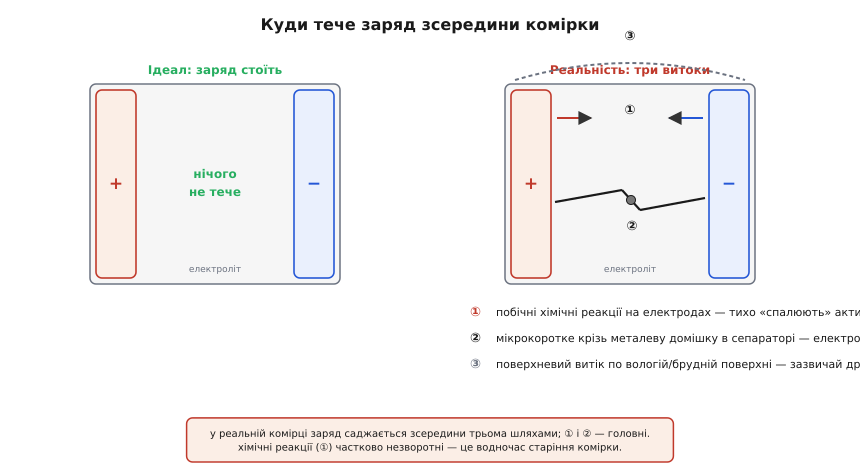
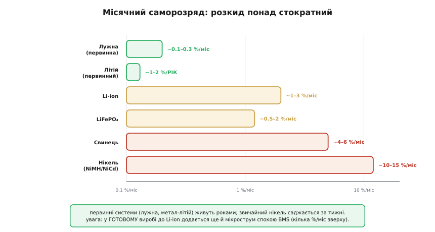

# Саморозряд батареї

<preknowlist>
- [Акумулятори](topic:electronics/batteries) — що таке комірка, її напруга (3.0–4.2 В у літію) і ємність у мА·год.
- [Заряд, що лишився (SoC)](topic:electronics/state-of-charge) — як оцінюють залишковий заряд і чому лічба заряду дрейфує.
- [Старіння батарей](topic:electronics/battery-aging) — шар SEI, календарна деградація й правило Арреніуса «+10 °C ≈ вдвічі швидше».
</preknowlist>

Залиште повністю заряджений акумулятор просто лежати — не під'єднаним, без жодного навантаження, без єдиного проводу назовні — і за кілька місяців він однаково розрядиться сам. Ніхто не брав з нього струму, а заряду поменшало. Це й є **саморозряд** (англ. *self-discharge*): повільна втрата запасеного заряду зсередини, без зовнішнього кола. Батарея — не герметична бочка, з якої нічого не витікає, поки не відкриєш кран; це радше відро з мікроскопічними тріщинками, крізь які вміст сочиться сам, навіть коли кран закрито.

Питання, яке варто поставити одразу: **куди** дівається заряд, якщо ззовні його ніхто не бере? Адже закон збереження нікуди не подівся. Відповідь у тому, що всередині комірки заряд можна «витратити» й **не виводячи** його на клеми — його поглинають хімічні реакції та мікроскопічні внутрішні шляхи струму, яких у ідеальній батареї не було б, а в реальній вони є завжди. Саморозряд — це рахунок за те, що жодна хімія не буває ідеально інертною, коли між двома різними електродами лежить рідина, що проводить іони.

Ця тема пояснює три речі, які постійно збивають з пантелику: **чому** батарея саджається без навантаження, **наскільки швидко** це відбувається в різних хімій (тут розкид величезний — від відсотка на рік до відсотка на день), і **як з цим жити** інженеру — від вибору хімії під довге зберігання до того, чому оцінювач заряду в пристрої, що місяцями спить, конче мусить знати про цей повільний витік.

### Куди тече заряд без зовнішнього кола

Розкладімо витік на складові, бо їх кілька й вони різної природи. Уявімо заряджену комірку: на одному електроді накопичено надлишок того, що прагне прореагувати з іншим. Розділяє їх електроліт — рідина, що чудово проводить **іони**, але має **не** проводити електрони. Ось у цьому «не» і криється весь саморозряд: у реальності електроліт та межі електродів пропускають потрошку й того, чого не мали б.


*Ліворуч — недосяжний ідеал: заряд просто стоїть. Праворуч — реальність: заряд саджається зсередини трьома шляхами. Побічні хімічні реакції на електродах тихо «спалюють» активну речовину; мікрокоротке крізь металеву домішку в сепараторі веде електрони навпростець; поверхневий витік стікає плівкою вологи чи бруду по корпусу. Перші два — головні, третій зазвичай дрібний.*

**Перший шлях — побічні хімічні реакції.** Заряджений електрод — речовина в напруженому, реакційно-активному стані, і вона потроху реагує з тим, що поруч, навіть без зовнішнього кола. У літію заряджений катод — сильний окисник, який поволі **окиснює сам електроліт**; заряджений анод, навпаки, відновлює електроліт, і на ньому наростає захисна плівка [SEI](topic:electronics/battery-aging) (*solid electrolyte interphase*). Обидві реакції споживають активний літій та електроліт — тобто буквально з'їдають заряд зсередини. Це та сама хімія, що стоїть за календарним старінням: саморозряд і календарна деградація — **два обличчя одного процесу**, тихих реакцій, що йдуть самі собою, поки комірка просто існує.

**Другий шлях — мікрокоротке замикання.** Якщо електрони знаходять усередині доріжку з електрода на електрод в обхід зовнішнього кола, заряд стікає прямо там. Такі доріжки беруться з дрібних **металевих домішок**, що потрапили в комірку ще на виробництві (частинки заліза, міді, цинку): вони розчиняються й **осаджуються знову** тонкими провідними містками-«вусами» (*dendrites*), проколюючи сепаратор і з'єднуючи електроди слабеньким внутрішнім опором. Через такий місток тече крихітний струм, що й саджає комірку. Саме цей механізм і робить окрему браковану комірку в збірці «поганою»: у неї саморозряд помітно вищий за сусідів, і в довгому ряду вона поступово тягне весь пакет у розбаланс.

**Третій шлях — поверхневий витік.** По зовнішньому боку комірки — по плівці вологи, флюсу, бруду між клемами — теж може текти мікрострум. У сухій чистій батареї він мізерний, але волога, конденсат чи брудні контакти здатні його підняти. Це найбезневинніший і найлегший до усунення шлях: суха чиста поверхня його майже прибирає.

Розрізняти ці три корисно з практичного погляду: вони по-різному лікуються й по-різному залежать від умов. Хімічні реакції керуються **температурою** й **рівнем заряду**; мікрокоротке — це вада конкретної комірки (тут рятує лише якість виготовлення); поверхневий витік — питання чистоти й вологості. Коли батарея саджається «швидше, ніж має», діагноз починають саме з поділу на ці три причини.

### Зворотний і незворотний: не весь заряд втрачено назавжди

Тонкість, яку варто засвоїти рано: не кожен «загублений» саморозрядом заряд втрачено **безповоротно**. Втрату ділять на дві частини, і плутати їх — значить неправильно судити про здоров'я комірки.

**Незворотна частина** — це заряд, з'їдений хімічними реакціями (окиснення електроліту, ріст SEI). Ці реакції **необоротні**: витрачений на них літій уже не повернути зарядкою, він назавжди випав з обігу. Саме ця частина саморозряду одночасно є **старінням** — вона потроху зменшує повну ємність комірки.

**Зворотна частина** пов'язана радше з перерозподілом і релаксацією всередині: одразу після заряду напруга й «наповненість» приповерхневих шарів електрода трохи завищені, і за перші години-добу комірка **осідає** до рівноважного стану. Цей заряд не знищено — комірка просто прийшла до чеснішого «повного». Тому в літію характерне падіння **близько 5% за першу добу** після повного заряду, а далі темп різко спадає до неквапних відсотків на місяць. Перше — переважно осідання, друге — усталений хімічний витік.

Практичний висновок звідси прямий: **міряти саморозряд треба не одразу після заряду**, а давши комірці добу-другу відпочити, інакше зворотне осідання видасть себе за страшний витік. І навпаки — якщо навіть після відпочинку комірка втрачає помітно більше за паспорт, це вже сигнал незворотної біди: або посилених побічних реакцій (стара, перегріта комірка), або мікрокороткого (бракована).

### Порядок величини: від відсотка на рік до відсотка на день

Тепер найкорисніше для інженера — **числа**, бо саме тут між хімій лежить прірва в сто разів. Наведені цифри — типові орієнтири за кімнатної температури (близько 25 °C) для здорових комірок; конкретна модель може відхилятися, тож це порядок величини, а не паспорт.


*Місячний саморозряд за кімнатної температури, орієнтовно. Первинна лужна — частки відсотка (роки на полиці); літій-іонний і LiFePO₄ — одиниці відсотків; свинцево-кислотний — кілька; звичайний нікель-метал-гідрид (NiMH) і нікель-кадмій — десятки відсотків на місяць. Розкид — понад стократний, і саме він диктує, яку хімію брати під довге зберігання.*

Пройдімося зверху вниз, від найкволіших до найпрудкіших.

**Первинна лужна батарея** (та сама «пальчикова» AA, що не перезаряджається) саджається дуже повільно — **приблизно 0.1–0.3% на місяць**, тобто одиниці відсотків на рік. Звідси її **термін придатності 5–10 років**: купуєш, кидаєш у шухляду, і за роки вона майже не втрачає. Це не диво хімії, а наслідок того, що суха первинна система порівняно інертна, поки її не задіяли.

**Первинний літій** (метал-літієві комірки — монетки CR2032, циліндри для лічильників і давачів) — чемпіон живучості: **порядку 1–2% на рік**, з терміном придатності до десяти-двадцяти років. Саме тому їх ставлять туди, де замінити батарею важко або треба, щоб пристрій прокидався раз на рік десятиліттями, — у пам'ять годинника комп'ютера, у промислові давачі, у медичні імпланти. Наднизький саморозряд тут — головна чеснота, важливіша за все інше.

**Літій-іонний акумулятор** (той, що перезаряджається, — у телефонах, ноутбуках, дронах) — **близько 1–3% на місяць** самої комірки, причому LiFePO₄ ще трохи менше (**0.5–2%**). Це вже не роки, а місяці помітного витоку — але для перезаряджуваної системи дуже добре. Важлива приписка: **в реальному пристрої до цього додається апетит електроніки**. Плата захисту й монітор ([BMS](topic:electronics/bms)) споживають власний мікрострум спокою навіть коли пристрій вимкнено, і це легко додає **ще кілька відсотків на місяць** поверх хімічного саморозряду. Тобто «сама комірка» й «комірка в готовому виробі» саджаються по-різному, і друге завжди гірше.

**Свинцево-кислотний** акумулятор (автомобільний, у ДБЖ) — **приблизно 4–6% на місяць**, помітно швидше за літій. Тому машина, що простояла місяць-два в мороз чи спеку, легко відмовляється заводитись: стартерна батарея просто саджається сама. У свинці саморозряд ще й тісно пов'язаний із **сульфатацією** — глибоко саморозряджена свинцева комірка заростає сульфатом свинцю й частково гине, тож її шкідливо лишати надовго розрядженою.

**Звичайний нікель** (NiMH, NiCd) — рекордсмен витоку: **10–15% на місяць**, а буває й більше. Заряджений NiMH-акумулятор за кілька тижнів на полиці помітно «худне», а за пару місяців може розрядитися майже вщент. Це історично й дало нікелю недобру славу «саморозряджається на очах». Ту славу переламали **низькосаморозрядні NiMH** (*low self-discharge*, LSD) — комірки з покращеним сепаратором, що тримають заряд місяцями; про те, як інженерія боролася з нікелевим витоком і як з'явилися готові-до-вжитку акумулятори, оповідає [історія боротьби за термін придатності](topic:electronics/self-discharge/hist-shelf-life.md).

Один наскрізний висновок з усього ряду: **саморозряд — це вимога до вибору хімії, а не дрібниця «на потім»**. Пристрій, що має роками чекати в готовності, будують на первинному літії чи LSD-нікелі, а не на звичайному NiMH; акумулятор, що місяцями лежатиме зарядженим, беруть літієвий, а не свинцевий.

### Головний важіль — температура

Одна умова керує саморозрядом сильніше за всі інші — **температура**. Причина проста й уже знайома зі старіння: саморозряд у своїй головній, хімічній частині — це реакції, а швидкість реакцій росте з теплом за правилом Арреніуса. Груба, але надійна інженерна прикидка: **кожні +10 °C приблизно подвоюють** швидкість саморозряду.

Наслідки контрінтуїтивно різкі. Комірка в холодильнику саджається в рази повільніше за ту саму комірку в теплій кімнаті, а батарея в гарячому багажнику влітку втрачає заряд катастрофічно швидше, ніж узимку. Порахуймо, наскільки саме.

**Приклад (у скільки разів холод продовжує зберігання).** Літій-іонна комірка втрачає 3% на місяць за 25 °C. Скільки вона втратить за 5 °C і за 45 °C, якщо кожні 10 °C міняють темп удвічі?

```
Правило: темп ×2 на кожні +10 °C  (÷2 на кожні −10 °C)

За 25 °C:  3.0 %/міс                       (опорна точка)
За  5 °C:  на 20 °C холодніше = ÷2 ÷2 = ÷4
           3.0 / 4 = 0.75 %/міс            (у 4 рази повільніше)
За 45 °C:  на 20 °C тепліше  = ×2 ×2 = ×4
           3.0 × 4 = 12 %/міс              (у 4 рази швидше!)

Різниця холодильник↔спека: 0.75 проти 12 — це ~16-кратний розрив.
```

Висновок промовистий: **та сама комірка, залежно лише від температури зберігання, саджається то в чотири рази повільніше, то в чотири рази швидше за паспортне значення**. Звідси проста й дешева порада для довгого зберігання літію — тримати комірки **в прохолоді**, аж до полиці холодильника (але сухо, без конденсату, і давати зігрітися перед вжитком). Спека ж — не лише прискорений саморозряд, а й прискорене [старіння](topic:electronics/battery-aging): гаряча батарея одночасно швидше саджається й швидше зношується назавжди.

> 🔧 **Навіщо це.** Правило «+10 °C ≈ ×2» — не абстракція, а прямий інструмент планування складу й логістики. Партія літію, що півроку лежить на теплому складі під дахом (35 °C), втратить заряду вчетверо більше за ту саму партію в прохолодному приміщенні (15 °C) — і прийде до клієнта помітно розрядженішою, а часом і за небезпечним нижнім порогом. Так само батарею у виробі тулять **подалі від гарячих вузлів** (силових перетворювачів, процесора): тепло сусіда прискорює і її саморозряд, і її старіння. Одне рішення компонування — «де ляже батарея» — впливає на те, якою вона доживе до користувача.

### Заряд теж має значення: повна саджається швидше

Другий за силою важіль після температури — **рівень заряду**, на якому комірка лежить. У літію повна комірка (4.2 В) саджається помітно швидше за напівзаряджену. Механізм той самий, що й у старінні: за високої напруги заряджений катод — активніший окисник, і побічні реакції з електролітом ідуть жвавіше. Напівзаряджена комірка «спокійніша» хімічно, тож і витік у неї менший.

Це змикається з відомим правилом зберігання літію — **тримати на середині, а не повним**. Комбінація «прохолодно + наполовину» дає найповільніший саморозряд і найповільніше старіння водночас; «гаряче + повне» — найгірше з усіх поєднань. Виробники недарма продають літій у «зберігаючому» стані близько 50%: так комірка й на складі саджається мляво, і не старіє на повній напрузі.

І тут ховається пастка, про яку варто пам'ятати чи не найбільше. Саморозряд, лишений сам на себе надовго, здатен **убити комірку**, завівши її нижче безпечного порога. Літій, що просів за **~3.0 В** і глибше й довго там пробув, зазнає незворотної шкоди (розчинення мідного струмознімача), а зарядити такий уже небезпечно. Ось чому не можна класти на тривале зберігання **майже порожню** літієву комірку: за місяці саморозряду вона сповзе в ту заборонену зону сама. Золота середина — саме середина: ~50% дає і повільний витік, і достатній запас, щоб за час зберігання не докотитися до дна.

### Чому це болить оцінювачу заряду

Окремо варто показати, чому саморозряд — головний біль для пристроїв, що довго сплять, і для їхнього [оцінювача заряду (SoC)](topic:electronics/state-of-charge). Річ у тім, що найточніший спосіб рахувати заряд — **кулонометрія**, лічба ампер-годин, що втекли крізь клеми, — саморозряду **не бачить у принципі**. Витік іде **всередині**, повз клеми, тож жоден датчик струму на дроті його не зарахує. Пристрій, що місяць пролежав у сні, чесно порахує «я віддав майже нуль ампер-годин, отже заряд той самий» — а комірка тим часом тихо просіла зсередини на кілька відсотків.

Наслідок: за час довгого сну оцінка заряду **дрейфує вгору** від реальності — прилад думає, що заряджений повніше, ніж є насправді. Прокинувшись і показавши бадьорі «80%», він може за лічені хвилини впасти до реальних 60%, бо весь загублений саморозрядом заряд лічильник просто пропустив. Для пристрою, що працює безперервно, це дрібниця; для того, що місяцями чекає в готовності, — серйозна похибка.

Лікують її двома способами. Перший — **періодичне перекалібрування за напругою**: коли пристрій прокидається й комірка встигла відпочити, її напругу спокою (OCV) звіряють з очікуваною й підправляють оцінку заряду — так витік, пропущений лічбою, «ловлять» за фактом просідання напруги. Другий — **модель саморозряду в прошивці**: знаючи хімію, температуру й час сну, оцінювач сам віднімає передбачену втрату, замість вдавати, що за сон нічого не сталося. Годинник реального часу тут стає в пригоді — він міряє, **скільки** комірка спала, а без цього поправку нема від чого рахувати.

**Приклад (наскільки бреше лічильник за три місяці сну).** Пристрій із літієвою коміркою заснув на 90 днів. Комірка саджається 2%/місяць, а лічильник заряду не робить жодної поправки на саморозряд.

```
Реальна втрата за сон:  2 %/міс × 3 міс = 6 %
Лічильник зарахував:    ≈ 0 %  (струму крізь клеми не було)

Похибка оцінки на пробудженні:  ~6 % завищення
Було «показано» 80%  →  насправді ~74%

З поправкою в прошивці (відняти 2%/міс × 3):
   оцінка виправлена до ~74% ще ДО пробудження — брехні нема.
```

Висновок: **без явної поправки на саморозряд оцінювач заряду сплячого пристрою систематично оптимістичний**, і що довший сон — то більша брехня. Тому в приладах з довгими паузами модель саморозряду й перекалібрування за напругою — не розкіш, а обов'язковий елемент чесного паливоміра. Точну форму цієї поправки — як витік залежить від часу, температури й заряду й як його прикинути наперед — розкладає [математика саморозряду](topic:electronics/self-discharge/math-self-discharge.md).

### Як жити з саморозрядом

Зберімо все в практичні ходи — усі вони випливають з механізмів, а не додаються ззовні.

**Вибирати хімію під сценарій зберігання.** Треба, щоб пристрій прокидався роками без заміни батареї? — первинний літій (монетка, циліндр), а не нікель. Готова партія лежатиме зарядженою місяцями? — літій, а не свинець і не звичайний NiMH. Потрібні перезаряджувані «пальчики», що не худнуть на полиці? — LSD-нікель. Саморозряд тут — головний критерій вибору, а не другорядний.

**Тримати прохолодно.** Найдешевший важіль: кожні −10 °C приблизно вдвічі сповільнюють витік. Прохолодний склад, прохолодне місце в пристрої, батарея подалі від гарячих вузлів.

**Зберігати на середині заряду.** ~50% для літію — і витік повільніший, і старіння менше, і є запас, щоб за час зберігання не сповзти нижче безпечного порога. Ніколи не лишати літій надовго ані повним, ані майже порожнім.

**Періодично освіжати при довгому зберіганні.** Раз на кілька місяців перевіряти напругу, а за потреби [підзарядити до ~50%](topic:electronics/li-ion-charger) — щоб саморозряд не завів комірку в заборонену зону. Особливо це стосується свинцю (сульфатація від сидіння розрядженим) і будь-чого, що лежить дуже довго.

**Закладати саморозряд у прошивку.** У пристроях з довгими паузами — модель витоку плюс перекалібрування за напругою на пробудженні, щоб оцінка заряду не брехала після сну.

**Стежити за аномаліями в збірках.** У багатокомірковому пакеті комірка з підвищеним саморозрядом (мікрокоротке) поступово випадає з балансу. Система, що моніторить окремі комірки, ловить таку «текучу» ще до того, як вона потягне весь пакет, — це вже завдання [захисту й балансування (BMS)](topic:electronics/bms).

> 🔧 **Навіщо це.** Різниця між урахованим і знехтуваним саморозрядом — це різниця між пристроєм, що після року на полиці спокійно вмикається, і таким самим, що зустрічає користувача розрядженим чи взагалі мертвим. Жоден із цих ходів не коштує дорого: правильна хімія обирається на етапі проєкту безплатно, прохолодне місце — питання компонування, поправка в прошивці — кілька рядків коду й годинник реального часу. А ціна недбалості — рекламації «нова батарея, а вже сіла», передчасно вбиті глибоким саморозрядом літієві комірки й паливомір, якому не можна вірити після сну.

### Підсумок теми

**Саморозряд** — це повільна втрата заряду **зсередини** комірки, без зовнішнього кола, і бере вона початок із трьох джерел: **побічних хімічних реакцій** на заряджених електродах (окиснення електроліту, ріст SEI — та сама хімія, що й [календарне старіння](topic:electronics/battery-aging)), **мікрокороткого** крізь металеві домішки в сепараторі й дрібного **поверхневого витоку**. Частина втрати **незворотна** (з'їдений реакціями заряд — це водночас старіння), частина **зворотна** (осідання за першу добу після заряду), тож міряти витік коректно лише після відпочинку. Темпи різняться понад стократно: первинна лужна — частки відсотка на місяць, первинний літій — відсотки на **рік**, літій-іон — 1–3% на місяць (плюс апетит [BMS](topic:electronics/bms) у виробі), свинець — 4–6%, звичайний нікель — 10–15% на місяць. Два головні важелі — **температура** (кожні +10 °C ≈ вдвічі швидше) і **рівень заряду** (повна саджається швидше за напівзаряджену), звідки й правило зберігання літію «прохолодно й наполовину». Для сплячих пристроїв саморозряд особливо підступний, бо **лічба заряду його не бачить** — витік іде повз клеми, — і оцінка [SoC](topic:electronics/state-of-charge) дрейфує вгору; лікують перекалібруванням за напругою та моделлю витоку в прошивці. А лишений сам на себе надовго, саморозряд здатен звести літій нижче безпечного порога й **убити** комірку, — тому «просто лежить» не означає «в безпеці».
