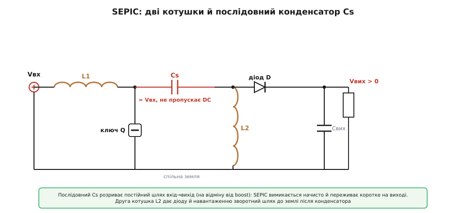
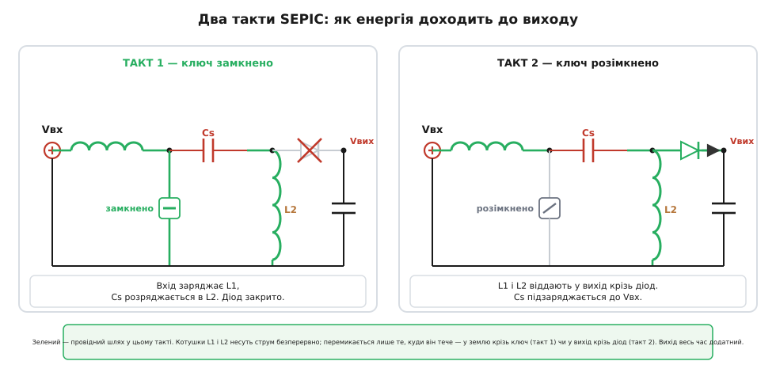

# SEPIC-перетворювач

<preknowlist>
- [Імпульсний перетворювач](book:electronics/switching-converter) — як ключ і котушка порціями перекидають енергію та що таке коефіцієнт заповнення D.
- [Boost-перетворювач](book:electronics/boost) — підвищення напруги накопиченням енергії в котушці; звідки береться пряма провідна ланка вхід→вихід.
- [Buck-boost](book:electronics/buck-boost) — топологія, що вміє і вгору, і вниз, але перевертає полярність виходу.
- [Спарені котушки](book:electronics/coupled-inductor) — дві обмотки на одному осерді та взаємоіндукція між ними.
</preknowlist>

Одна літій-іонна банка повна дає близько 4.2 В, а розряджена сповзає до ≈3.0 В. Якщо платі потрібні стабільні 3.3 В, то на початку розряду банка **вища** за ціль, а під кінець — **нижча**. Знижувальний [buck](book:electronics/buck) уміє лише опускати напругу; підвищувальний [boost](book:electronics/boost) — лише піднімати. Жоден із них не переживе моменту, коли вхід переходить через ціль.

Класичний [інвертувальний buck-boost](book:electronics/buck-boost) накриває обидва напрямки за величиною — але віддає напругу протилежного знаку: замість +3.3 В на виході стоятиме −3.3 В. Для звичайної цифрової плати з додатним живленням це марно. Залишається питання: як покрити весь діапазон — і коли вхід вищий, і коли нижчий за ціль — **не перевертаючи полярність**? Одна з відповідей — SEPIC.

SEPIC (англ. Single-Ended Primary-Inductor Converter — однотактний перетворювач із вхідною котушкою) будується з двох котушок і одного послідовного конденсатора між ними. «Однотактний» тут означає, що ключ один і прив'язаний до землі, а не розкиданий у мостову пару. Щоб побачити, звідки береться саме така схема, зберемо її крок за кроком — від знайомого boost.

## Чому саме такий вигляд

Boost починається з котушки від входу, ключа від її кінця на землю й діода далі на вихід. Він чудово підвищує напругу, але має ваду, про яку згадують нечасто: від входу до виходу тягнеться **неперервна провідна ланка** — котушка й діод з'єднані напряму постійним струмом. Тому boost неможливо по-справжньому вимкнути (вихід лишається під напругою входу крізь діод) і він беззахисний перед коротким замиканням на виході — струм ллється через котушку й діод без упину.

SEPIC робить один рішучий крок: вставляє між ключовим вузлом і рештою схеми **послідовний конденсатор** Cs. Конденсатор не пропускає постійного струму — і прямий шлях вхід→вихід зникає сам собою. Це і є визначальна риса SEPIC: вихід відв'язаний від входу по постійці, тож перетворювач вимикається начисто й спокійно переживає коротке на виході. За це платять **другою котушкою** L2: після конденсатора діоду й навантаженню потрібен зворотний шлях до землі, і саме його дає L2.



*Дві котушки й послідовний конденсатор між ними; Cs не пропускає постійного струму, тож прямого проходу вхід→вихід немає.*

У сталому режимі середня напруга на будь-якій котушці — нуль (інакше струм ріс би без меж). Тому середній потенціал лівої обкладки Cs дорівнює Vвх, а правої — нулю. Виходить проста, але важлива річ: **Cs весь час заряджений рівно до напруги входу**.

## Два такти

Коли ключ замкнений, він садить лівий кінець Cs на землю. Вхід через L1 качає в неї енергію — струм у L1 наростає. Заряджений до Vвх конденсатор тепер штовхає струм у L2: обидві котушки запасають енергію. Діод у цей час замкнений, а навантаження живиться з вихідного конденсатора.

Коли ключ розмикається, струмам котушок треба кудись подітися — миттєво урвати їх не можна. Тепер вони обидві течуть через діод у вихід: струм L1 — крізь Cs, струм L2 — прямо. Конденсатор Cs при цьому підзаряджається назад до Vвх, готуючись до наступного такту. Так порція за порцією енергія доходить до виходу, і вихід лишається **додатним**, бо діод дивиться вістрям на нього.



*Ліворуч — ключ замкнено (котушки запасають), праворуч — розімкнено (котушки віддають у вихід через діод).*

## Скільки на виході

Частку періоду, коли ключ замкнений, називають коефіцієнтом заповнення D. У режимі [неперервного струму](book:electronics/ccm-dcm-boundary) вихід задається так:

```
Vвих / Vвх = D / (1 − D)
```

При D = 0.5 вихід дорівнює входу; нижче — SEPIC знижує, вище — підвищує. За величиною це та сама залежність, що й у buck-boost, але вихід тут **додатний**. Звідки береться саме `D/(1−D)` — з рівності «вольт·секунд» на обох котушках, [покроково розписано окремо](book:electronics/sepic/math-sepic-transfer.md).

**Приклад: 3.3 В з однієї банки Li-ion (3.0…4.2 В).** З формули `Vвих/Vвх = D/(1−D)` виходить `D = Vвих/(Vвих + Vвх)`:

```
D = Vвих / (Vвих + Vвх)

повна банка (4.2 В):    D = 3.3 / (3.3 + 4.2) = 0.44   → D < 0.5, схема ЗНИЖУЄ
порожня банка (3.0 В):  D = 3.3 / (3.3 + 3.0) = 0.52   → D > 0.5, схема ПІДВИЩУЄ
```

Контролер плавно веде D через 0.5 — і 3.3 В тримаються від повної до розрядженої банки, без жодного перемикання топології.

## Дві котушки — на одному осерді

Придивімося до напруг на котушках у кожному такті: коли ключ замкнено, на L1 стоїть +Vвх, а на L2 — рівно −Vвх; коли розімкнено, на L1 стоїть −Vвих, а на L2 +Vвих. За величиною напруга на обох котушках **щомиті однакова** (лише протилежна знаком). А раз так, їх можна намотати на одне [спільне осердя](book:electronics/coupled-inductor): виходить одна деталь замість двох. Більше того, при правильному намотуванні взаємоіндукція гасить пульсацію так, що вхідний струм можна звести майже до гладкого — рідкісна розкіш серед перетворювачів.

## Ціна універсальності

За все це доводиться платити, і головний рахунок виставляє той самий Cs. Через нього щотакту проходить уся енергія до виходу, тож він несе **повний струм навантаження** за діючим значенням і мусить бути конденсатором із малим внутрішнім опором і великою припустимою пульсацією струму. Це найгарячіша точка схеми і головний обмежувач її ККД. Додайте сюди дві котушки (нехай і на одному осерді) плюс конденсатор — SEPIC об'ємніший і дорожчий за простий buck чи boost. І ще: дві котушки з двома конденсаторами роблять систему четвертого порядку, тож стабілізувати петлю керування помітно складніше.

> 🔧 **Навіщо це.** SEPIC беруть там, де вхід гуляє і вище, і нижче цілі, а вихід треба додатний: одна банка Li-ion чи Li-Po на шину 3.3 В, суперконденсатор, широкий бортовий вхід автомобіля. Його ж люблять у драйверах світлодіодів, де струм треба тримати незалежно від того, просів вхід чи піднявся. Близький родич SEPIC — [перетворювач Ćuk](book:electronics/cuk-converter): та сама ідея з послідовним конденсатором, тільки з від'ємним виходом і гладшим струмом на виході. [Звідки взялися ці схеми й що ховає назва «single-ended»](book:electronics/sepic/hist-sepic.md) — окрема, коротка історія.
