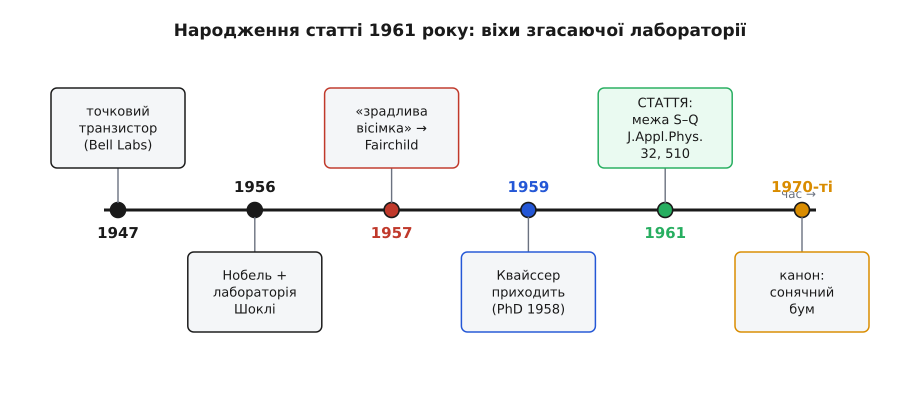

# 📜 Стаття, що накреслила стелю: як 1961 року порахували межу сонячного елемента

До 1961 року на питання «наскільки добрим може бути сонячний елемент?» чесної відповіді не існувало. ККД був суто дослідним числом: зробили пристрій, зміряли, дістали кілька відсотків — і поволі покращували їх майстерністю. Але чи є попереду стеля і де вона, не знав ніхто. Відповідь — і то на диво просту й тверду — дали двоє фізиків у згасаючій каліфорнійській лабораторії. Їхня стаття із сухою назвою «Detailed Balance Limit of Efficiency of p-n Junction Solar Cells» (*Journal of Applied Physics*, том 32, с. 510–519, березень 1961) уперше провела межу, вище якої один p-n перехід під сонцем не підніметься ніколи. Ця межа й досі зветься їхніми іменами.

### Лабораторія на спаді: Шоклі після «зрадливої вісімки»

Щоб зрозуміти, звідки взялася стаття, варто зайти в лабораторію, де її написали, — а вона на той час уже вмирала.

Вільям Бредфорд Шоклі (англ. *William Bradford Shockley*) народився 13 лютого 1910 року в Лондоні в родині американців — і був американцем; ріс і навчався у США. 1956 року він розділив Нобелівську премію з фізики з Джоном Бардіном (англ. *John Bardeen*) і Волтером Браттейном (англ. *Walter Brattain*) «за дослідження напівпровідників і відкриття транзисторного ефекту» — за той самий [транзистор](topic:electronics/transistor-idea), що переродив усю електроніку. На хвилі цієї слави Шоклі того ж таки 1956-го відкрив під Сан-Франциско, у Маунтин-В'ю, власну фірму — Shockley Semiconductor Laboratory (гроші дав концерн Beckman Instruments). Він стягнув туди найталановитішу молодь країни, яку сам і виглядав.

І сам же її розігнав. Керувати Шоклі вмів украй тяжко — підозріливо, деспотично, — і 1957 року восьмеро його найкращих інженерів пішли гуртом, заснувавши Fairchild Semiconductor; в історію вони ввійшли як [«зрадлива вісімка»](topic:electronics/transistor-idea/hist-traitorous-eight.md) (англ. *traitorous eight*), і саме з неї виросте вся майбутня Кремнієва долина. Лабораторія Шоклі після цього так і не оговталася: 1960 року її продали фірмі Clevite. Тож коли за рік з'явиться стаття про межу, її напишуть у конторі, що вже втратила і своїх зірок, і власну незалежність, — на самому спаді.

### Молодий співавтор: Ганс-Йоахім Квайссер

Другий автор прийшов до цієї лабораторії вже після відходу вісімки. Ганс-Йоахім Квайссер (нім. *Hans-Joachim Queisser*) народився 6 липня 1931 року в Берліні; докторат з фізики захистив у Геттінгені 1958 року в Рудольфа Гільша (нім. *Rudolf Hilsch*), а тоді перебрався за океан і 1959-го влаштувався до Шоклі — за два роки по тому, як звідти пішли найкращі. Молодий німецький постдок у напівпорожній лабораторії — саме йому випало сісти поруч із нобелівським лауреатом і разом порахувати те, чого до них не рахував ніхто.

*Статус доказовості: дати життя, докторат (Геттінген, 1958) і роки в Shockley Semiconductor (1959–1965) усталені за біографічними джерелами.*


*Стаття народилася не на злеті, а на спаді: Шоклі здобув Нобеля й відкрив лабораторію 1956-го, за рік втратив «зрадливу вісімку», ще за два прийняв Квайссера — і вже проданою конторою 1961-го вийшла стаття. Канонічним число стане аж у сонячний бум 1970-х. Події рознесено рівномірно, а не пропорційно рокам.*

### Питання, яке ставили не з того боку

Тепер сама загадка. Сонячні елементи вже існували — [перший практичний кремнієвий](topic:electronics/photovoltaic-cell) показали в Bell Labs 1954 року, він давав близько 6% світла в електрику. Далі число поволі повзло вгору: чистіший кристал, кращі контакти, менше відбиття. І тут висіла незручна незнана: 6% — це вже впритул до можливого чи до нього ще як до неба? Чи мислима панель на 50%? На це не міг відповісти жоден дослід, бо всі міряли одне й те саме — що виходить із конкретного кристала. Ніхто не питав із протилежного боку: а скільки взагалі дозволяє природа, незалежно від чистоти кремнію й спритності рук? Поки питання ставлять від пристрою, стелі не побачити — її видно, лише коли спитати від фізики.

### Інструмент: детальний баланс — стара ідея, нове застосування

Щоб відповісти на таке питання, Шоклі мав під рукою рідкісний інструмент — і це був не свіжий винахід, а принцип із півторастолітнім корінням, що зветься **детальним балансом**.

Ще 1859 року Густав Кірхгоф (нім. *Gustav Kirchhoff*) показав: тіло, що добре поглинає на певній довжині хвилі, на ній самій мусить і добре випромінювати — поглинання й випромінювання нерозривні, це один процес, пущений у два боки. 1917-го Альберт Ейнштейн (нім. *Albert Einstein*) уточнив цей зв'язок для квантів, увівши коефіцієнти, що пов'язують поглинання зі спонтанним і вимушеним випромінюванням світла. А 1954 року сам Шоклі разом із Віллемом ван Роосбруком (нід. *Willem van Roosbroeck*) переклав принцип мовою напівпровідника: якщо кристал поглинає світло, народжуючи пари носіїв, то тим самим механізмом він приречений і світитися сам, коли ті пари возз'єднуються, — це **випромінна рекомбінація**.

Отже, до 1961-го принцип був готовий і навіть відточений на напівпровіднику: ідеальний поглинач неминуче є випромінювачем, і цього податку не оминути. Бракувало одного кроку — навести готовий принцип на питання про ККД. Це й зробила стаття.

### Що саме зробила стаття 1961 року

Хід Шоклі й Квайссера був зухвало прямий. Вони уявили **найдоброзичливіший** елемент, який лишень дозволяє фізика: ані дефекту в кристалі, ані краплі паразитного опору, кожен придатний фотон упійманий, а єдина втрата, якої прибрати не можна, — та сама вимушена випромінна рекомбінація, вшита в саму здатність поглинати. Для такого ідеального елемента вони звели баланс: скільки надпорогових фотонів приносить Сонце (взяте як розжарене чорне тіло) — і скільки квантів неминуче йде назад на власне світіння елемента за його температури. Різниця цих двох потоків — те, що зостається на струм.

Оптимізувавши цей залишок по ширині забороненої зони матеріалу, вони дістали число:

```
гранична ефективність ≈ 30 %    при    Eg ≈ 1.1 еВ
```

Уся вага — у слові «гранична». Це не «скільки вийшло в нас», а «скільки взагалі дозволено» — стіна для будь-якого одного переходу під звичайним сонцем, хоч як його вдосконалюй.

Тут варто чітко розділити три речі, які легко злити в одну.

- **Ідея.** Принцип детального балансу — старий: Кірхгоф, Ейнштейн, ван Роосбрук зі Шоклі. Його ніхто в цій статті не винаходив.
- **Теорія.** Конкретний результат — абсолютна стеля ККД сонячного p-n елемента як функція його забороненої зони — був новий, і саме він становить внесок 1961 року.
- **Визнання.** Слава цього числа, його канонічний статус прийде ще пізніше й аж ніяк не одразу — і це окрема історія.

### Чому стаття не прогриміла одразу — і чому стала каноном

Дивно, але велике число не спричинило негайного вибуху. Причина проста й позанаукова: 1961 року сонячні елементи були дорогою екзотикою. Їхнє єдине поважне застосування було в космосі — з 1958-го ними живили супутники (перший на сонячному живленні, Vanguard 1, полетів того ж 1958-го); на землі ват від панелі коштував захмарно, і жодна індустрія не тиснула з питанням «а де стеля?». Красива межа лишалася красивою межею — цікавою радше теоретикам, ніж інженерам.

Усе змінили 1970-ті. Нафтові кризи різко підняли світовий інтерес до сонячної енергії, у поле ринули гроші й люди — і от тоді число Шоклі–Квайссера стало тим, чим є досі: **компасом**. Кожен новий елемент відтоді міряють не абсолютно, а відносно цієї стелі — «скільки відсотків від межі ми взяли». Кожну хитрішу конструкцію, як-от [багатоперехідні елементи](topic:electronics/tandem-multijunction), оцінюють тим, наскільки законно вона цю стелю обходить. Стаття, що кілька років пролежала майже непоміченою, зробилася наріжним каменем усієї фотовольтаїки.

*Статус доказовості: те, що визнання прийшло з піднесенням сонячних досліджень у 1970-х, а не одразу 1961-го, — обґрунтований висновок зі стану галузі тих років (сонячні елементи були нішевою космічною технологією), а не задокументоване дослідження цитованості; сам факт публікації 1961-го і подальший канонічний статус межі — усталені.*

### Дві долі після статті

Стаття пережила обох своїх авторів, а їхні шляхи після неї розійшлися різко.

Квайссер зробив довгу й поважну кар'єру. 1965 року він перейшов до Bell Labs у Мюррей-Гілл (штат Нью-Джерсі), 1966-го став професором фізики у Франкфуртському університеті, а 1970-го — одним із засновників-директорів нового Інституту фізики твердого тіла Товариства Макса Планка (нім. *Max-Planck-Institut für Festkörperforschung*) у Штутгарті, де очолював свій напрям аж до виходу на пенсію 1998 року. Він помер 27 червня 2025 року, майже на 94-му році життя, — доживши до часів, коли його стеля стала загальником підручників.

Шоклі скінчив інакше й сумніше. Його лабораторія зрештою згасла, а сам він останні десятиліття життя присвятив просуванню псевдонаукових поглядів про спадковість і расові відмінності інтелекту — що зробило колишнього нобелівського лауреата постаттю сумнозвісною. Він помер 1989 року.

І над цими двома такими різними долями лишилося те саме число — тридцять із чимось відсотків. Його порахували майже мимохідь, у конторі, що доживала віку, — а воно пережило і лабораторію, і Кремнієву долину її часів, і самих авторів, ставши тією твердою стелею, від якої й досі відлічує кожен, хто робить сонячні елементи.
