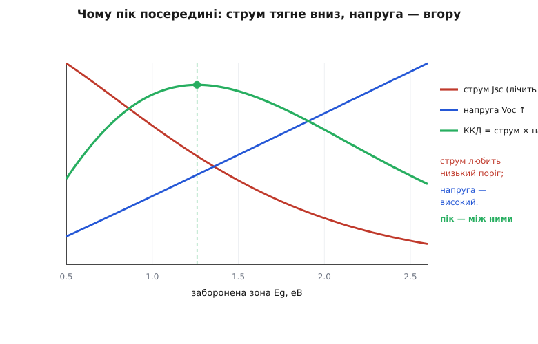

# Межа Шоклі–Квайссера: чому один перехід не бере й третини сонця

<preknowlist>
- [Фотоелемент](book:electronics/photovoltaic-cell) — як p-n перехід під світлом народжує електронно-діркові пари й віддає їх у струм; без цього механізму нема про яку ефективність говорити.
- [Напівпровідник](book:physics/semiconductor) — валентна й провідна зони та **заборонена зона** Eg між ними: поріг енергії, нижче якого світло не поглинається.
- [Фотон](book:physics/photon) — світло приходить порціями-квантами, енергія кванта E = h·c/λ; сонячне світло — суміш фотонів різних енергій.
- [Випромінювання чорного тіла](book:physics/blackbody-radiation) — усяке нагріте тіло світиться суцільним спектром, тим яскравіше й «синіше», чим воно гарячіше; Сонце поводиться як тіло ~5800 K.
</preknowlist>

Візьмімо ідеальний кремнієвий елемент. Ані дефекту в кристалі, ані краплі опору в контактах, поверхня не відбиває нічого, кожен народжений заряд дійшов до клем. Скільки сонця він оберне на електрику? Здавалося б, майже все — недосконалості ж усунуто. Насправді — **близько третини, і ні відсотком більше**. Ця стеля не має нічого спільного з якістю виготовлення: скільки не вдосконалюй один кремнієвий перехід, вище третини він не підніметься. Її 1961 року порахували [Вільям Шоклі й Ганс-Йоахім Квайссер](book:electronics/shockley-queisser-limit/hist-detailed-balance-paper.md), і відтоді вона зветься **межею Шоклі–Квайссера**.

Мета — не завчити цифру «33%», а зрозуміти, з яких саме трьох втрат вона складається, чому кожна з них **неминуча** для одного переходу, і — найцікавіше — які припущення треба порушити, щоб її законно перестрибнути. Тоді стеля перестане бути прикрою межею й стане картою: вона показує, коли ще є що вичавлювати з наявної конструкції, а коли доводиться міняти саму конструкцію.

### Один поріг проти цілого спектра

Уся біда починається з невідповідності. Напівпровідник має **один** поріг — заборонену зону Eg: щоб вибити електрон і народити пару носіїв, фотонові треба принести енергію не меншу за Eg. А [сонячне світло — це не один сорт фотонів, а широка суміш](book:physics/photon): від кволого інфрачервоного (менш як 1 еВ) до енергійного ультрафіолету (понад 3 еВ). Один фіксований поріг зустрічається з цілою веселкою — і жодним чином не може підійти всій їй одразу.

Звідси випливають дві втрати, обидві принципові й протилежні за напрямком.

**Фотон, слабший за поріг**, кремнієві просто не по зубах. Його енергії не вистачає, щоб перекинути електрон через зону, тож він проходить крізь кристал наскрізь, як крізь скло, не народивши нічого. Уся його енергія втрачена, бо для елемента такого фотона мовби й немає. Це — **підпорогова втрата** (елемент прозорий для довгих хвиль).

**Фотон, сильніший за поріг**, пару народжує — але тут криється друга пастка. Байдуже, ледь-ледь він перескочив поріг чи вдвічі його переважив: народжується **рівно одна** пара, і вибитий електрон за якісь фемтосекунди скочується на саме дно провідної зони, а весь **надлишок** енергії (E − Eg) віддає теплом коливанням кристалічної ґратки. У діло йде лише «порогова» порція Eg; усе, що фотон приніс понад неї, гине. Це — **термалізація** (від грец. *thérme* — тепло): зайва енергія осідає теплом, ще перше ніж носій дійде до контакту.


*Потік сонячних фотонів за енергіями (Сонце як чорне тіло ~5800 K), поріг Eg проведено вертикаллю. Ліворуч від порога (синє) фотони надто кволі — елемент для них прозорий, енергія втрачена. Праворуч (червоне) пара народжується, та надлишок над порогом одразу йде теплом. Один поріг фізично не може взяти обидва краї спектра.*

Тепер видно, чому втрати тягнуть у різні боки. **Опустимо поріг** — усередину пустимо більше фотонів (менша підпорогова втрата), зате з кожного візьмемо менше корисної енергії й більше змарнуємо теплом. **Піднімемо поріг** — з кожного фотона візьмемо більше, зате багато фотонів опиняться «нижче» й пройдуть намарно. Обидва краї одночасно не виграти. Уже сама ця невідповідність спектру — до всякої термодинаміки — не лишає одному переходу навіть половини сонця.

### Лічать фотони, а не енергію — і тому оптимум гострий

Ось тонкість, без якої годі зрозуміти, чому стеля стоїть саме там, де стоїть. Струм елемента рахує **фотони**, а не їхню енергію. Кожен упійманий надпороговий фотон переносить через зону одну пару — тобто один квант заряду, і байдуже, скільки він приніс енергії понад поріг. Тому короткий струм пропорційний **кількості** надпорогових фотонів:

```
Jsc = q · (число фотонів із E ≥ Eg за секунду на площу)
```

А корисна енергія, яку кожна пара здатна віддати в коло, обмежена згори порогом: приблизно Eg на пару, не більше (надлишок уже зник теплом). Виходить, максимальна потужність — це грубо **добуток** двох величин, що по-різному залежать від порога:

```
P ≈ Eg × (число надпорогових фотонів)
```

Опустиш Eg — другий множник росте (більше фотонів кваліфікуються), але перший (Eg) падає. Піднімеш Eg — навпаки. Добуток такого штибу завжди має **горб** десь посередині: обидва множники разом максимальні не з краю, а всередині діапазону. Саме тому оптимальний поріг не «якнайнижчий» і не «якнайвищий», а десь **1.1–1.4 еВ** — і кремній зі своїми 1.12 еВ лежить майже в яблучко, що згодом виявиться його щасливою рисою.

### Струм проти напруги: чому пік посередині

Той самий торг зручніше бачити мовою клем — струму й напруги, бо саме їх віддає елемент у навантаження.

**Струм** веде облік фотонів: що нижчий поріг, то більше фотонів над ним, то більший короткий струм. Струм **любить низький** поріг.

**Напруга** веде облік енергії з пари. Що вищий поріг, то більшу напругу здатна дати кожна пара — груба стеля напруги є Eg/q (поріг у вольтах). Напруга **любить високий** поріг.


*Зі зростанням забороненої зони короткий струм (червоне, лічить фотони) спадає, а напруга розімкнутого кола (синє) росте. Їхній добуток — потужність, а отже й ККД (зелене) — не має краю: він максимальний посередині, де жодна з двох тенденцій ще не задавила іншу. Це та сама межа Шоклі–Квайссера, лише в координатах «струм–напруга».*

Потужність — це струм на напругу, тож вона максимальна там, де їхній **добуток** найбільший: не там, де кожне з них максимальне, а в компромісній точці. Ось перше й найпростіше джерело стелі: одному порогові фізично годі бути водночас і низьким (заради струму), і високим (заради напруги). Але це ще не вся історія. Досі ми мовчки припускали, що напруга сягає повного Eg/q. Насправді ні — і причина цього третього недобору найглибша.

### Третя, найглибша втрата: елемент мусить світитися

Уявімо, що спектральні втрати ми якось перемогли й зібрали всі надпорогові пари до єдиної. Чи вийде тоді взяти з кожної повний Eg у вигляді напруги? Ні. І тут вступає термодинаміка, від якої не втекти жодною інженерією.

Ключ — у простій, але непозбувній симетрії: **добрий поглинач світла неминуче є добрим випромінювачем**. Це закон Кірхгофа для теплового випромінювання: якщо тіло вміє на певній довжині хвилі жадібно поглинати, то тим самим механізмом воно вміє на ній і **світити**. Поглинання й випромінювання — не два різні явища, а один процес, пущений у два боки. Отже, елемент, що ідеально ловить надпорогові фотони Сонця, тим самим приречений **світитися сам** — [як усяке тіло за своєї температури](book:physics/blackbody-radiation), тобто за кімнатних 300 K. Це світіння має конкретне ім'я в напівпровіднику: **випромінна рекомбінація** — пара носіїв возз'єднується й віддає назад фотон.

Простежмо баланс. У повній темряві, в рівновазі, елемент купається у власному тепловому випромінюванні середовища (300 K): скільки таких фотонів він поглинає, стільки ж і випромінює — потоки зустрічно рівні, це і є **детальний баланс**. Тепер посвітімо на нього Сонцем і прикладімо напругу V у прямому напрямку. Напруга, прикладена до переходу, розсуває всередині нього «резервуари» електронів і дірок — і, за статистикою, **підганяє випромінювання** рівно в exp(qV/kT) разів проти рівноважного. Іншими словами, **щоб утримувати напругу, елемент мусить світитися дедалі яскравіше** — і це світіння забирає носіїв, які могли б піти в струм.

На розімкнутих клемах (максимум напруги) уся генерація йде на це вимушене світіння: скільки пар народило Сонце, стільки ж і згоріло у власному сяйві елемента. Звідси напруга розімкнутого кола:

```
q·Voc = Eg − kT · ln( потік світіння елемента / потік Сонця над порогом )
```

Дріб під логарифмом — це відношення того, як **тьмяно** світиться холодний елемент (300 K), до того, як **яскраво** його заливає Сонце (5800 K) у надпороговій частині спектра. Сонце незрівнянно яскравіше, тож логарифм від'ємний і невеликий — але **не нульовий**. Саме він і є той недобір: напруга завжди помітно нижча за Eg/q — на кількасот мілівольтів. Це, по суті, той самий термодинамічний податок, що й коефіцієнт Карно теплової машини: не можна взяти повну енергію кванта як роботу, працюючи між гарячим Сонцем і теплим елементом, — частина неминуче «розсіюється» назад у сяйво. За порогу 1.34 еВ модель дає Voc ≈ 1.09 В замість повних 1.34 — недобір близько 0.25 В, і його ніяк не прибрати.

> 🔧 **Навіщо це.** Ця думка — «ідеальний поглинач мусить світитися» — і є те, що робить межу Шоклі–Квайссера **справжньою стелею**, а не поточним рекордом. Детальний баланс рахує найдоброзичливіший з можливих сценаріїв: єдина дозволена втрата — випромінна рекомбінація, а її прибрати не можна, бо вона вшита в саму здатність поглинати. Будь-яка **реальна** втрата (безвипромінна рекомбінація на дефектах, опір, відбиття) лише **додається** зверху й тягне ще нижче. Тому цифра S–Q — це стіна: не «скільки виходить у нас», а «скільки взагалі дозволяє фізика одному переходу».

### Складімо стелю: три множники

Тепер зберімо всі три втрати в одне число. Шоклі й Квайссер записали ККД як добуток трьох множників, і кожен відповідає одній з розібраних втрат:

- **u — спектральний (граничний) множник.** Частка сонячної енергії, що лишилася б, якби кожен надпороговий фотон віддав рівно Eg. Він разом вирізає обидві спектральні втрати — підпорогову й термалізацію. Коло оптимуму u ≈ **0.44**: самі лише спектральні втрати вже забирають більш як половину.
- **v — множник напруги.** Voc/(Eg/q): яка частка порога дійшла в напругу після термодинамічного податку на світіння. Коло оптимуму v ≈ **0.80**.
- **m — множник форми ВАХ** (fill factor, «коефіцієнт заповнення»). Реальна [вольт-амперна крива елемента](book:electronics/panel-iv-mpp) — це коліно: одночасно й повний струм, і повну напругу зняти не можна, робоча точка максимальної потужності сидить у згині. Ця геометрія забирає ще ~12%: m ≈ **0.88**.

**Приклад (звідки береться ~третина).** Перемножмо три множники коло оптимального порога:

```
u (спектр)     = 0.44     ← навіть по Eg з кожного надпорогового фотона
v (напруга)    = 0.80     ← Voc ≈ 0.8 · Eg/q (податок на світіння)
m (форма ВАХ)  = 0.88     ← коліно кривої, робоча точка в згині

η = u · v · m = 0.44 · 0.80 · 0.88 ≈ 0.31   (31%)
```

Тридцять один відсоток — рівно те, що дає чесний підрахунок із Сонцем як чорним тілом ~5800 K, і саме стільки (30% при 1.1 еВ) отримали Шоклі й Квайссер 1961 року. Коли ж підставити не ідеальне чорне тіло, а **реально виміряний** наземний спектр AM1.5 (сонце крізь атмосферу), пік трохи підіймається — до **33.7% при 1.34 еВ**. Це і є канонічна цифра межі.


*Розклад падної потужності коло оптимуму. Спершу спектр з'їдає більшість: ~33% проходить нижче порога, ще ~25% гине термалізацією. З рештою (~42%) працює термодинаміка: податок на вимушене світіння забирає частину напруги, а форма ВАХ — ще трохи. У струм доходить близько третини — і це стеля, а не поточний результат.*

Кожна сходинка водоспаду — одна з розібраних втрат, і жодну не можна прибрати, лишаючись при одному переході. Точні виведення потоків і напруги — Планків потік фотонів, струм насичення, повний вивід Voc і оптимізація потужності — зібрано в [математичному розборі детально-балансового ККД](book:electronics/shockley-queisser-limit/math-efficiency-integral.md).

### Крива межі й місце кремнію

Порахувавши цей добуток для кожного можливого порога, дістаємо криву межі — ККД як функцію забороненої зони матеріалу. Цю криву неважко відтворити самому: [невелика програма інтегрує сонячний спектр, проганяє детальний баланс по всіх порогах і знаходить пік](book:electronics/shockley-queisser-limit/proj-sq-curve.md) — саме нею й пораховано всі числа тут.


*Стеля ККД проти Eg. Вершина — широке плато 1.1–1.4 еВ (для чорнотільного Сонця ~31%, для реального AM1.5 — 33.7% при 1.34 еВ). Кремній (1.12 еВ) сидить майже на вершині; GaAs (1.42 еВ) — з іншого боку плато. Ліворуч ККД валить термалізація, праворуч — підпорогова прозорість.*

Дві речі впадають в око. По-перше, вершина **широка й полога**: у смузі 1.1–1.5 еВ межа майже не міняється. По-друге, **кремній стоїть майже на піку**. Його заборонена зона 1.12 еВ — трохи ліворуч від оптимуму, і чиста детально-балансова стеля для нього ~32–33%. Це велике щастя для індустрії: найдешевший, найпоширеніший у корі Землі напівпровідник випадково має майже ідеальний для сонця поріг. Не тому кремній панує в панелях, що він найкращий фізично, — а тому, що він «досить добрий» і при цьому копійчаний.

Варто розрізняти три різні числа, які легко сплутати. **Детально-балансова стеля** кремнію ~32%. Додаймо неминучу для кремнію **оже-рекомбінацію** (втрата, якої в чистому S–Q немає, бо вона безвипромінна) — реальна фізична межа падає до ~29.4%. А **найкращий лабораторний** кремнієвий елемент дає сьогодні ~27% (рекорд LONGi, 2023). Розрив між 27% і 29% — це те, за що ще борються інженери; розрив між 29% і 33% — податок самого кремнію проти ідеального матеріалу; а 33% — стіна фізики для будь-якого одного переходу. [Різні матеріали з різними порогами](book:electronics/pv-cell-types) сідають у різні точки цієї кривої: GaAs (1.42 еВ) ближчий до чистого піку й у лабораторії дає рекордні для одного переходу 29.1%.

Чому реальний кремній не дотягує до своєї стелі й з інших причин — почасти тому, що [його заборонена зона непряма](book:physics/direct-indirect-bandgap): кремній поглинає світло мляво, і елемент доводиться робити товстим, а в товщі більше шансів на рекомбінацію. Але це вже не про межу S–Q, а про те, як до неї підповзти.

### Що межа насправді припускає — і як її чесно обійти

Тепер, коли видно, з чого стеля складається, стає ясно, як її **законно** перестрибнути: не порушивши фізику, а порушивши одне з припущень, на яких вона стоїть. А припущень чотири: (1) один перехід з одним порогом; (2) звичайне, несконцентроване сонце; (3) єдина втрата — випромінна рекомбінація; (4) один фотон народжує рівно одну пару. Кожне з них — двері, за якими вища стеля.

**Кілька переходів замість одного.** Головна причина стелі — один поріг проти всього спектра. Складімо [кілька переходів з різними порогами один за одним](book:electronics/tandem-multijunction): верхній, з високим порогом, зніме синій край з великою напругою й пропустить донизу решту; наступний візьме зелений, ще нижчий — червоний, і так по східцях. Кожен перехід ловить свій шматок веселки й марнує на термалізацію лише свій вузький надлишок. Стеля піднімається різко: два переходи — до ~42%, три — до ~49%, а нескінченна стопка — аж до **68.7%** під звичайним сонцем. Це не порушення межі S–Q, а вихід за її головне припущення — саме так живлять супутники й концентраторні станції.

**Сконцентроване сонце.** Напруга недобирала через відношення «як тьмяно світиться елемент проти того, як яскраво його заливає Сонце». **Сфокусуймо** сонце лінзою в сотні разів — у надпороговій частині елемент заливає яскравіше, дріб під логарифмом росте, недобір напруги меншає. Концентрація трохи підіймає стелю кожного переходу; для нескінченної стопки під максимально сконцентрованим сонцем термодинамічна межа сягає **86.8%** — це вже впритул до карнотівської стелі перетворення сонячного тепла на роботу.

**Розбити «один фотон — одна пара».** Найекзотичніший напрямок цілить у термалізацію: змусити енергійний фотон народжувати **дві** пари (множення носіїв), або встигати зняти «гарячий» носій, поки він не охолов, або підняти два підпорогові фотони в один надпороговий. Усе це поки що радше лабораторія, ніж панель на даху, — але кожен такий фокус атакує конкретну сходинку водоспаду, а не «межу взагалі».

Спільне в усіх трьох — межа Шоклі–Квайссера не забороняє високого ККД сонячної установки; вона забороняє його **одному переходу під звичайним сонцем**. Знаючи, яка саме сходинка водоспаду тебе тримає, знаєш і які двері відчиняти: тісно зі спектром — став другий перехід; недобирає напруга — концентруй світло; забагато тепла з синіх фотонів — шукай множення носіїв. Стеля не гасить амбіцію, а показує, об яку саме стіну ти вперся й куди від неї є обхід. Найдешевший кремній тим часом спокійно живе коло своєї третини — не через недоробку інженерів, а тому що така фізика одного переходу, і з нею просто рахуються.
