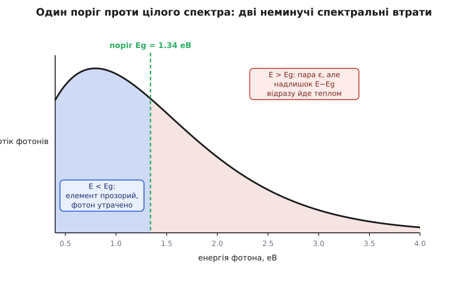
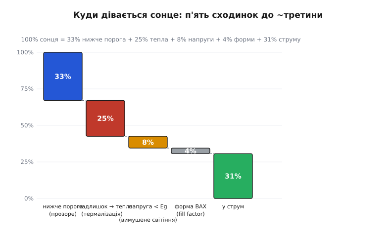
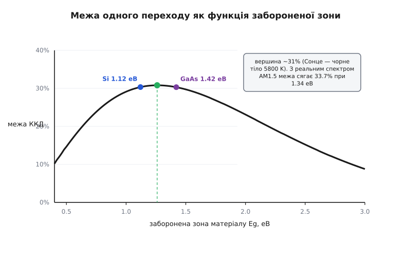

# Межа Шоклі–Квайссера

<preknowlist>
- [Фотоелемент](topic:electronics/photovoltaic-cell) — будова p-n переходу під світлом і розділення фотогенерованих зарядів.
- [Напівпровідник](topic:physics/semiconductor) — валентна зона, зона провідності та заборонена зона Eg.
- [Фотон](topic:physics/photon) — квант світла з енергією E = h·ν; сонячне світло як суміш фотонів різної енергії.
- [Випромінювання чорного тіла](topic:physics/blackbody-radiation) — теплове випромінювання нагрітих тіл (Сонце ~5800 K, елемент ~300 K).
</preknowlist>

Ідеальний напівпровідниковий кристал без жодного дефекту решітки, з нульовим омічним опором контактів і стовідсотковим розділенням народжених зарядів перетворює на електрику лише близько третини сонячної енергії. Скільки б не вдосконалювали якість кремнієвого p-n переходу, під природним сонячним світлом один елемент не перетне теоретичну стелю ~33.7% (за стандарту спектра AM1.5G при забороненій зоні Eg ~ 1.34 еВ). Цю фундаментальну термодинамічну межу 1961 року вивели американські фізики [Вільям Шоклі й Ганс-Йоахім Квайссер](topic:electronics/shockley-queisser-limit/hist-detailed-balance-paper.md). Вона дістала назву **межі Шоклі–Квайссера** (англ. *Shockley–Queisser limit*) і визначає ціну, яку сплачує одиночний перехід за роботу під широким спектром Сонця.

### Два спектральні марнотратства: один поріг проти неперервного спектра

Головна причина низького ККД криється в невідповідності між квантовою структурою напівпровідника та спектром сонячного світла. Сонце випромінює як нагріте тіло за температури близько 5800 K, посилаючи потік фотонів з енергіями від інфрачервоного діапазону (< 0.5 еВ) до жорсткого ультрафіолету (> 3.5 еВ). Напівпровідник натомість має фіксовану ширину забороненої зони Eg (англ. *bandgap*), яка діє як єдиний енергетичний поріг.

Зустріч широкого спектра з одним порогом породжує дві неминучі втрати:

- **Підпорогове пропускання (h·ν < Eg).** Фотон не має достатньо енергії, щоб перекинути електрон із валентної зони в зону провідності. Для таких довгих хвиль напівпровідник є оптично прозорим: фотони проходять кристал наскрізь, не створюючи носіїв заряду (втрата ~33% енергії падного світла).
- **Термалізація (h·ν > Eg).** Фотон поглинається й створює пару носіїв, але весь надлишок енергії понад поріг (h·ν − Eg) за лічені фемтосекунди передається коливанням кристалічної ґратки (фононам). У корисну роботу йде лише частка Eg, а решта перетворюється на тепло. Це — **термалізація** (від грец. *therme* — тепло), що забирає ще ~25% сонячної потужності.


*Потік сонячних фотонів за енергіями та єдиний поріг поглинання Eg. Ліворуч від порога фотони проходять наскрізь через нестачу енергії. Праворуч — фотони народжують носії, але весь надлишок енергії над порогом миттєво розсіюється у кристалічній ґратці теплом.*

Зміна ширини забороненої зони не усуває компромісу: зменшення Eg дозволяє захопити більше фотонів (росте струм короткого замикання Jsc), проте обвалює робочу напругу й збільшує втрати на термалізацію; збільшення Eg підвищує напругу з кожної пари, але робить більшість сонячного спектра прозорою.

### Детальна рівновага та недобір напруги

Навіть якби вдалося зібрати енергію Eg з кожного надпорогового фотона, напруга розімкнутого кола Voc не досягла б потенціалу зони Eg/q. За законом Кірхгофа, будь-який добрий поглинач випромінювання зобов'язаний з такою самою ефективністю випромінювати.

У стані термодинамічної рівноваги з довкіллям (300 K) фотоелемент випромінює стільки ж теплових фотонів, скільки поглинає — це **принцип детальної рівноваги** (англ. *detailed balance*). Освітлення Сонцем і поява напруги прямого зміщення V підвищують концентрацію електронів і дірок, підсилюючи зворотний процес — **випромінювальну рекомбінацію** (від лат. *re-* — знову та *combinare* — сполучати):

```
R_rad(V) = R_0 · exp(q·V / (k_B·T))
```

де `R_0` — рівноважне випромінювання за `T = 300 K`, `k_B` — стала Больцмана, `q` — елементарний заряд.

У режимі розімкнутих клем уся сонячна генерація врівноважується цим вимушеним світінням. Сонце світить із 5800 K у крихітний тілесний кут (~6.8·10⁻⁵ ср), тоді як холодний елемент світиться при 300 K в усю відкриту півсферу. Через цю ентропійну невідповідність власне світіння врівноважує генерацію за напруги Voc, що помітно менша за Eg/q:

```
q·Voc = Eg − k_B·T · ln( N_cell / N_sun )
```

Цей термодинамічний недобір становить 0.25–0.40 В: наприклад, за Eg = 1.34 еВ напруга Voc не перевищує 1.09 В замість потенційних 1.34 В.

Додаткове зниження потужності зумовлене формою діодної вольт-амперної характеристики (ВАХ). Добуток струму й напруги `P(V) = J(V) · V` досягає піка в точці максимальної потужності (MPP, англ. *maximum power point*), розташованій у коліні кривої. Геометрія цієї кривої визначає **коефіцієнт заповнення** (англ. *fill factor*, FF = Pmax / (Jsc · Voc) ≈ 0.88–0.89), що відбирає ще 11–12% потужності.


*Баланс перетворення сонячної енергії в одноперехідному фотоелементі біля точки оптимуму. Пропускання підпорогових фотонів і термалізація надлишку енергії забирають понад 57% потужності. Власне випромінювання та форма ВАХ знижують частку корисної електрики до ~31–33.7%.*

### Крива межі та місце кремнію

Перемноження спектральної частки поглинання, коефіцієнта напруги `Voc / (Eg/q)` та коефіцієнта заповнення формує криву межі з максимумом в інтервалі 1.1–1.4 еВ. Для спектра AM1.5G теоретична стеля становить **33.7% при 1.34 еВ** (або ~31% для спрощеної моделі Сонця як чорного тіла 5800 K).


*Крива межі Шоклі–Квайссера для одного переходу. Максимум лежить в інтервалі 1.1–1.4 еВ. Кремній (Si, 1.12 еВ) та арсенід галію (GaAs, 1.42 еВ) розташовані на пологому плато найвищої теоретичної ефективності.*

Кремній із забороненою зоною 1.12 еВ випадково опинився майже на вершині цієї кривої з теоретичною стелею ~32.3%. З урахуванням неминучої безвипромінювальної [оже-рекомбінації](topic:physics/semiconductor), за якої енергія передається третьому носію, фізична межа кремнію становить **29.4%** (лабораторний рекорд сягає ~26.8%). Прямозонний арсенід галію GaAs (Eg = 1.42 еВ) досягає рекордних для одного переходу 29.1%.

### Шляхи подолання межі

Межа Шоклі–Квайссера обмежує лише один p-n перехід під прямим сонячним світлом. Її долають трьома основними напрямами:

- **Багатоперехідні (тандемні) структури** (англ. *multi-junction*). Каскад переходів із різними Eg ділить спектр на смуги: верхній шар бере сині фотони з високою напругою, нижні — червоні й інфрачервоні. Потрійні елементи GaInP/GaAs/Ge живлять космічні апарати, а тандеми перовскіт-кремній (перовскітний шар 1.7 еВ поверх кремнію 1.12 еВ) у лабораторіях уже перевищили 33% ККД. Границя для 2 переходів — ~42%, для 3 — ~49%, для нескінченної стопки — **68.7%**.
- **Концентратори світла** (англ. *concentrator photovoltaics*, CPV). Фокусування світла лінзами в сотні разів збільшує густину фотонів, піднімаючи Voc. Для нескінченного каскаду за максимальної концентрації термодинамічна межа сягає **86.8%**.
- **Проміжні зони та множення носіїв** (англ. *intermediate band solar cells*, IBSC). Додаткові квантові рівні всередині зони дозволяють поглинати підпорогові фотони у два етапи, а множинна генерація екситонів вибиває дві пари носіїв з одного ультрафіолетового фотона замість розсіювання тепла.

Точні рівняння детального балансу та розрахунок струмів наведено в [математичному виведенні ефективності](topic:electronics/shockley-queisser-limit/math-efficiency-integral.md), а чисельну модель — у [проєкті побудови межі S–Q](topic:electronics/shockley-queisser-limit/proj-sq-curve.md).
