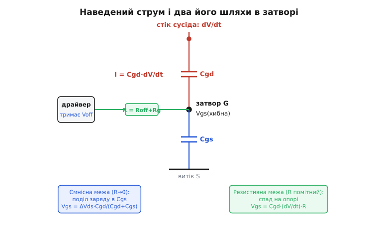
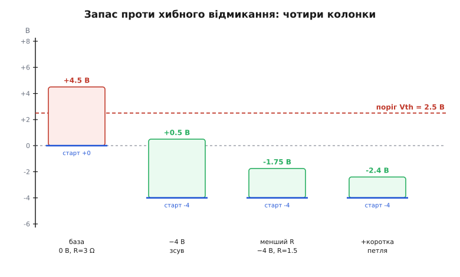
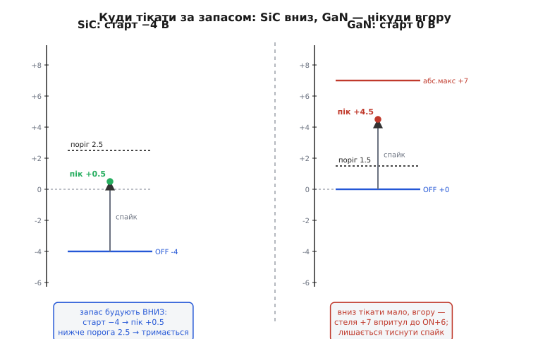

# 🧮 Запас проти перехресного наведення при високому dV/dt

<preknowlist>
- [Затвор як ємність](book:electronics/gate-capacitance) — паразитні ємності Cgd (Crss) і Cgs, заряд затвора, звідки береться струм зміщення крізь ємність.
- [Ефект Міллера](book:electronics/miller-effect) — ємність між входом і виходом, крізь яку перепад напруги на одному кінці впорскує струм на інший.
- [Драйвер затвора](book:electronics/gate-driver) — опір затвора, окремі шляхи ввімкнення/вимкнення, Міллерове хибне відмикання в кремнію.
- [Закон Ома](book:electronics/ohms-law) — напруга на опорі = струм · опір; звідси спад на резисторі стягання.
</preknowlist>

У півмості два ключі стоять один над одним, і коли нижній різко вмикається, спільний вузол між ними — стік верхнього — валиться вниз із шаленою швидкістю. Верхній ключ у цей момент **закритий** і мусить лишатися закритим. Але його затвор з'єднаний зі стоком крихітною ємністю Cgd, і крізь цю ємність падіння напруги на стоці впорскує в затвор струм. Струм тече в затвор, піднімає на ньому напругу — і якщо ця хибна напруга дотягнеться до порога, закритий ключ на мить **привідкриється**. Обидва ключі півмоста на коротку хвилю провідні одночасно — це наскрізний струм, гарячий, безглуздий, іноді фатальний. Явище звуть **перехресним наведенням** *(англ. crosstalk)* між плечима.

Питання, на яке ця вставка дає точну числову відповідь, звучить просто: **за яких умов хибна напруга гарантовано не дотягнеться до порога?** Відповідь — нерівність, у якій з одного боку стоїть наведення (швидкість, ємність, опір), з другого — запас (поріг мінус стартова точка затвора). Виведемо цю нерівність від першопричини, розберемо, який важіль її зсуває й на скільки, а тоді на реальних числах SiC і GaN побачимо, чому ці два матеріали борються за запас **різними** засобами — і чому GaN узагалі позбавлений головного важеля кремнію та SiC.

## Звідки береться наведений струм

Почнімо з єдиного факту, з якого росте все інше: **струм крізь ємність задає не напруга на ній, а швидкість зміни цієї напруги**. Це визначальне рівняння ємності:

```
I = C · dU/dt
```

Поки напруга стала — струму немає, хоч би вона була величезна. Щойно напруга починає мінятися — тече струм, і тим більший, чим швидша зміна. Це не завада, не витік, а сама природа ємності: щоб змінити напругу на конденсаторі, треба піднести чи забрати заряд, а рух заряду і є струм.

Тепер прикладімо це до Cgd верхнього ключа. Одна її обкладка сидить на затворі (який драйвер тримає закритим), друга — на стоці, що валиться вниз зі швидкістю dV/dt. Різниця напруг на Cgd змінюється саме з цією швидкістю, тож крізь неї тече

```
I = Cgd · dV/dt
```

Це і є **наведений струм** — струм зміщення крізь Міллерову ємність, породжений не сигналом, не драйвером, а самим лише падінням стоку. Він рветься в затвор верхнього ключа, і питання лише в тому, куди він звідти подінеться й скільки напруги встигне там накопичити.

> 🔧 **Навіщо це.** Наведений струм росте прямо пропорційно швидкості перемикання. Саме тому WBG-ключі — з їхніми десятками й сотнями В/нс — страждають від наведення там, де повільний кремній його не помічав: та сама Cgd, помножена на вдесятеро вищий dV/dt, дає вдесятеро більший струм. Швидкість, заради якої брали SiC чи GaN, і є джерелом цієї біди.

## Куди тече наведений струм: два шляхи, дві межі

Наведений струм влився у вузол затвора. Далі йому нікуди подітися, крім двох доріг — і на кожній він піднімає напругу по-своєму. Розуміння цих двох доріг і є ключ до всієї нерівності запасу.

**Дорога перша — вниз, крізь Cgs у витік.** Затвор і витік теж з'єднані ємністю — Cgs. Частина наведеного струму заряджає Cgs, і на ній росте напруга. Це «ємнісна» дорога.

**Дорога друга — вбік, крізь опір стягання у драйвер.** Драйвер тримає затвор закритим через свій вихідний опір і зовнішній резистор вимкнення. Частина наведеного струму тече цим опором назад у драйвер, і на опорі за законом Ома падає напруга. Це «резистивна» дорога.


*Стік сусіда валиться з dV/dt, крізь Cgd у вузол затвора G тече наведений струм I = Cgd·dV/dt. У вузлі він розгалужується: вниз крізь Cgs у витік (синій шлях) і вбік крізь опір R = Rвих.драйвера + Rзатвора у драйвер, що тримає Voff (зелений шлях). Розподіл вирішує опір: коли R помітний, струм тече крізь нього й хибну напругу задає спад I·R (резистивна межа); коли R майже нульовий, спад зникає, але лишається поділ заряду між Cgd і Cgs — ємнісна межа, підлога, нижче якої не опустити.*

Скільки струму піде якою дорогою — вирішує опір стягання **проти** того, наскільки легко струм тече в Cgs. Розберімо два крайні випадки, бо реальність завжди лежить між ними, а межі рахуються точно.

**Резистивна межа — опір веде струм у драйвер.** Уявімо, що драйвер міцно притискає затвор: опір стягання малий, і наведеному струму найлегша дорога — вбік, крізь R у драйвер, а не вгору по напрузі на Cgs. Практично весь струм тече опором, і хибна напруга — це просто спад на ньому:

```
Vgs(хибна) = I · R = Cgd · (dV/dt) · R
```

Це і є формула, якою користуються найчастіше, бо вона прямо в'яже три важелі — швидкість, ємність, опір — з висотою хибного піка. Саме її зручно рахувати «на серветці». Тут хибна напруга росте зі швидкістю фронту: чим різкіший dV/dt, тим більший струм і тим вищий спад. Формула справедлива, поки опір стягання не надто малий, — тобто в більшості реальних схем зі скінченним Rвимк.

**Ємнісна межа — опору мало, струм лишається в ємностях.** Тепер протилежна крайність: опір стягання настільки малий (наближається до нуля), що спад I·R сам по собі нікчемний, — здавалося б, хибної напруги нема зовсім. Але лишається другий шлях: наведений заряд не встигає весь стекти в драйвер (заважає індуктивність петлі й скінченна швидкість драйвера) і **ділиться між двома ємностями**, Cgd і Cgs, як напруга ділиться між двома послідовними конденсаторами. Це чистий **ємнісний дільник**:

```
Vgs(хибна) = ΔVds · Cgd / (Cgd + Cgs)
```

Тут ΔVds — повний розмах напруги на стоці (скажімо, всі 800 В), а не швидкість. Хибна напруга не залежить ні від опору (його ж майже нема), ні навіть від того, наскільки швидко все сталося, — лише від **співвідношення ємностей** і повного стрибка стоку. Це та підлога, нижче якої хибний пік не опустити ніяким зменшенням опору: навіть із ідеальним драйвером сам поділ заряду між Cgd і Cgs піднімає затвор.

Різниця між двома межами принципова. Резистивна формула каже: **хочеш менший пік — зменшуй опір** (притискай затвор сильніше). Ємнісна каже: опір уже не рятує, лишається сама конструкція приладу — **співвідношення Cgd/Cgs**. Реальний пік завжди між цими двома оцінками: опір зрізає його зверху, але нижче ємнісної межі не опустить, хоч який малий опір постав. Тому серйозний виробник WBG свідомо робить прилад з **малим відношенням Cgd/Cgs** — щоб навіть у цій ємнісній межі хибна напруга не дотяглася до порога.

> 🔧 **Навіщо це.** Дві межі підказують два різні важелі. Якщо ваш розрахунок Cgd·(dV/dt)·R дає хибний пік нижче порога, але ключ усе одно хибно відкривається — імовірно, ви вперлися в **ємнісну** межу, і зменшення Rвимк далі не поможе; треба або прилад з меншим Cgd/Cgs, або від'ємне зміщення. І навпаки: якщо ємнісна межа ΔVds·Cgd/(Cgd+Cgs) сама по собі нижча за поріг, то ваш прилад стійкий «за конструкцією», і вся боротьба зводиться до розумного опору стягання.

## Ланка, яку не можна забути: індуктивність петлі

Дотепер ми мовчки вважали, що хибна напруга на затворі — це рівно те, що накопичилося на Cgs чи впало на R. Але між драйвером і затвором завжди є **індуктивність петлі затвора** Lg — дротики виводів, доріжки, внутрішній вивід кристала. І наведений струм, рвучись у затвор, крізь цю індуктивність теж наводить напругу, бо на індуктивності напруга задається швидкістю зміни струму:

```
Vls = Lg · dI/dt
```

Тут два ефекти, і обидва погані. Перший: індуктивність **додає** свою напругу до хибного піка — на затворі опиняється не лише спад I·R, а й викид Lg·(dI/dt) від наростання самого наведеного струму. Другий, підступніший: Lg разом із ємністю затвора утворює **коливальний контур**. Різкий поштовх наведеного струму «дзвонить» цей контур, і напруга на затворі не просто підскакує, а **перелітає** розрахункове значення — гойдається вище, ніж дав би чистий спад I·R. Те, що в резистивній оцінці здавалося безпечним, коливальний викид легко виносить за поріг.

Тож повніша картина хибної напруги — це сума трьох внесків: спад на опорі, поділ на ємностях і викид на індуктивності. У практичному розрахунку їх не завжди розділяють акуратно; частіше беруть домінантний член (зазвичай I·R для не надто малого опору) і **закладають запас** на решту. Але концептуально важливо тримати всі три в голові, бо кожен — це окремий важіль, за який можна вхопитися, зменшуючи наведення. Індуктивність петлі — той важіль, що в кремнію майже не важив, а у WBG вийшов на передній план: коротка петля не лише не додає викиду, а й не дає контуру дзвеніти.

## Умова, за якою ключ лишається закритим

Тепер зберімо все в єдину умову. Ключ **не** відкриється хибно, якщо найвища точка, до якої злітає затвор, лишається **нижче порога** відмикання. Стартує затвор не з нуля, а з тієї напруги, на якій його тримає драйвер у закритому стані, — назвімо її Voff (для кремнію це зазвичай 0 В, для SiC — від'ємна). До цієї стартової точки додається хибний підйом Vgs(хибна). Отже, вершина затвора — це Voff + Vgs(хибна), і вона мусить не дійти до Vgs(th):

```
Voff + Vgs(хибна) < Vgs(th)
```

Перепишемо через сам запас — наскільки хибна напруга мусить бути меншою за «дистанцію до порога»:

```
Vgs(хибна) < Vgs(th) − Voff
```

Ось серце всієї вставки. Ліворуч — **наведення**: усе, що піднімає затвор (Cgd, dV/dt, опір, індуктивність — залежно від того, яка межа домінує). Праворуч — **запас**: відстань від стартової точки затвора до порога. Умова відсутності хибного відмикання — щоб наведення не з'їло весь запас.

Підставмо резистивну оцінку наведення й побачимо всі важелі одразу:

```
Cgd · (dV/dt) · R  <  Vgs(th) − Voff
```

Прочитаймо цей рядок як карту дій. **Ліва частина — вороги, права — друзі.** Кожну величину ліворуч хочеться зменшити, кожну праворуч — збільшити:

- **Cgd** — властивість приладу; менша Міллерова ємність прямо послаблює наведення. Вибір приладу, не схеми.
- **dV/dt** — можна пригальмувати більшим опором увімкнення сусіда, але це коштує втрат на перемиканні; тут завжди компроміс.
- **R** — опір стягання нашого ключа; чим менший, тим менший спад I·R. Прямий і дешевий важіль.
- **Vgs(th)** — поріг; властивість приладу, і у WBG він, на біду, низький.
- **Voff** — стартова точка; **опустивши її під нуль, ми прямо збільшуємо праву частину**. Це і є від'ємне зміщення.

Три з цих п'яти величин — у руках схемотехніка (dV/dt, R, Voff), дві задано приладом (Cgd, Vgs(th)). Уся інженерія запасу — це гра трьома доступними важелями так, щоб нерівність виконувалася з комфортним запасом на все, чого розрахунок не врахував (індуктивний дзвін, розкид приладів, температуру).

## Числа: чому саме від'ємне зміщення рятує SiC

Візьмімо конкретний півміст на SiC і пройдімо нерівність з числами. Прилад: Cgd (Crss) ≈ 30 пФ, поріг Vgs(th) = 2.5 В. Шина 800 В. Нижнє плече вмикається так, що на стоці верхнього dV/dt = 50 В/нс. Затвор верхнього стягнуто через сумарний опір R = 3 Ω (внутрішній вихід драйвера плюс зовнішній Rвимк).

Спершу наведений струм:

```
I = Cgd · dV/dt
  = 30·10⁻¹² Ф · 50·10⁹ В/с
  = 1.5 А
```

Півтора ампера — крізь тридцять пікофарад, лише тому, що напруга летить п'ятдесят вольт за наносекунду. Тепер хибна напруга по резистивній межі:

```
Vgs(хибна) = I · R = 1.5 А · 3 Ω = 4.5 В
```

І тепер сама умова, для двох стартових точок:

```
вимкнення на 0 В:   Voff + Vgs(хибна) = 0 + 4.5 = +4.5 В   проти порога 2.5 В  →  +4.5 > 2.5  →  ВІДКРИЄТЬСЯ
вимкнення на −4 В:  Voff + Vgs(хибна) = −4 + 4.5 = +0.5 В  проти порога 2.5 В  →  +0.5 < 2.5  →  тримається, запас 2.0 В
```

Ось точна, числова причина від'ємного живлення в SiC. Наведення в 4.5 В **саме собою** перевищує поріг у 2.5 В — жодного запасу, ключ хибно відкриється, хоч би опір стягання був ідеальний. Права частина нерівності при Voff = 0 дорівнює лише 2.5 В, і наведення її пробиває. Опустивши стартову точку до −4 В, ми підняли праву частину до 2.5 − (−4) = 6.5 В — і ті самі 4.5 В наведення тепер лишають 2 В запасу. Від'ємне зміщення не «покращує» щось абстрактне: воно буквально **дописує 4 вольти до дистанції, яку наведенню треба подолати**.


*Той самий SiC-приклад, чотири колонки. Червона пунктирна лінія — поріг 2.5 В; синя риска в основі кожної колонки — стартова точка Voff, верх колонки — пік Voff + Vgs(хибна). База (0 В, R = 3 Ω): пік +4.5 В стирчить над порогом — хибне відмикання. Додаємо −4 В зсуву: та сама висота наведення 4.5 В, але старт опущено, пік +0.5 В < поріг. Далі вдвічі менший опір (R = 1.5 Ω) вполовинює наведення до 2.25 В — пік падає до −1.75 В. Коротка петля прибирає індуктивний викид — пік ще нижче. Кожен важіль додає запасу.*

Порахуймо й другий важіль — опір. Зменшивши R удвічі, до 1.5 Ω, ми вполовинюємо наведення:

```
Vgs(хибна) = 1.5 А · 1.5 Ω = 2.25 В
пік при −4 В: −4 + 2.25 = −1.75 В  →  запас до порога аж 4.25 В
```

Це показує, чому в WBG-драйверах роблять **окремий, дуже низькоомний шлях вимкнення** — часто окремий вивід «сильного стягання», що обходить звичайний Rвимк. Малий R не лише пришвидшує вимкнення, а й прямо тисне ліву частину нерівності, зменшуючи хибний пік. Разом із від'ємним зміщенням це дає подвійний запас: старт опущено **і** підйом зменшено.

**Тонкість про від'ємну межу.** Опускати Voff здається безкоштовним — то чому не поставити −10 В і забути про наведення? Бо в півмості транзистор бачить **дві** протилежні події. Коли сусід вмикається, стік валиться вниз, dV/dt додатний, наведення штовхає затвор **угору** — це той випадок, який ми рахували. Але коли сусід вимикається, стік злітає вгору, dV/dt від'ємний, і той самий Cgd тепер тягне затвор **униз**, нижче Voff. Стартуючи вже з −4 В, від цього від'ємного викиду затвор може провалитися до, скажімо, −8 чи −9 В — а в затвора є й **нижня** абсолютна межа (для SiC це зазвичай близько −10 В). Тож Voff затиснуто з двох боків: згори його тягне вгору потреба в запасі проти хибного **відкриття**, знизу — ризик пробити затвор від'ємним викидом на протилежному фронті. Тому обирають помірне −2…−4 В, а не «якнайнижче»: це компроміс між двома викидами, а не вільний параметр.

## Чому GaN бореться інакше: у нього нема цього важеля

Тепер найцікавіше порівняння. Візьмімо реальний GaN e-mode прилад — скажімо, GaN Systems GS66508T — і подивімося на його вікно напруги затвора очима нашої нерівности.

Числа GaN такі. Рекомендована напруга відкриття — близько **+6 В**. Абсолютний максимум затвора (постійний) — усього **+7 В**. Поріг низький — близько **+1.5 В**. Між робочими +6 і стелею +7 лежить **один вольт**. Порівняйте із SiC, де стеля згори (+25 В) стоїть за десяток вольт від робочої точки: там перерегулювання затвора на кілька вольт — дрібниця, тут — смерть приладу.

Тепер підставмо GaN у нерівність запасу проти хибного відкриття. Права частина — Vgs(th) − Voff. Поріг лише 1.5 В. А стартову точку Voff GaN **майже не може опустити під нуль так, як SiC**. Формально в GaN-приладів є й від'ємна межа (у того ж GS66508T постійний мінімум близько −10 В), тож маленьке від'ємне зміщення, −2…−3 В, застосовують і в GaN. Але важіль цей у GaN куди слабший, і ось чому.


*Той самий спайк наведення 4.5 В прикладено до двох приладів. SiC (ліворуч): старт опущено до −4 В, пік злітає лише до +0.5 В — нижче порога 2.5 В, ключ тримається; згори простору вдосталь (абс. макс за межами шкали, +25 В). GaN (праворуч): поріг 1.5 В зовсім близько, старт біля 0 В, і той самий спайк виносить пік до +4.5 В — це і вище порога (хибне відкриття), і майже впритул до стелі +7 В. Униз тікати мало, угору — нікуди; лишається зменшувати сам спайк опором і петлею.*

Причина глибша за самі числа вікна — вона в **природі затвора GaN**. У SiC-MOSFET затвор ізольований оксидом: це чистий конденсатор, йому байдуже, тримати −4 В чи 0 В, струму він у сталому стані не бере. Затвор p-GaN — це фактично **прямозміщений діод**: у відкритому стані крізь нього тече сталий струм, а вся робоча напруга тісниться у вузькому вікні між порогом діода й його пробоєм. Це вікно фізично мале — не тому, що виробник полінувався, а тому, що таке влаштування p-GaN-затвора. Розтягнути його вниз на кілька вольт від'ємного зміщення, як у SiC, GaN не дає: асиметрії «+15/−4» тут нема, є вузька смуга близько нуля.

Отже, у нерівності `наведення < Vgs(th) − Voff` GaN має **малий поріг** праворуч і **майже нерухому стартову точку** — права частина мала й майже незмінна. Опустити її помічним від'ємним зміщенням, як SiC, не вийде. Що ж лишається? Лише **тиснути ліву частину** — саме наведення:

- **Cgd** — брати прилад з найменшою Міллеровою ємністю (GaN тут від природи гарний — ємності крихітні).
- **R** — гранично малий опір стягання, окремий сильний шлях вимкнення, часто активний фіксатор (клемп), що коротить затвор на витік і не пускає хибну напругу вгору.
- **Lg** — **найкоротша можлива петля затвора**. Ось чому в GaN індуктивність петлі з другорядного параметра стає питанням життя: у нерівності немає запасу праворуч, тож будь-який зайвий викид Lg·(dI/dt) чи коливальний дзвін ліворуч одразу пробиває поріг — а то й стелю +7 В, убиваючи затвор.

Тому GaN тиснуть **не на стартову точку, а на швидкість та її наслідки**. Коротка петля, драйвер у корпусі поруч (а для найшвидших — інтегрований із ключем в один кристал), клемп на затворі — усе це способи зменшити ліву частину нерівності, коли праву чіпати майже не можна. Асиметричне вікно, що рятує SiC, у GaN недоступне за конструкцією, і вся боротьба за запас переноситься на боротьбу зі швидкістю.

> 🔧 **Навіщо це.** Практичний висновок нерівності роздвоюється за матеріалом. У **SiC** запас будують передусім **праворуч** — від'ємним зміщенням −2…−4 В опускають Voff, і навіть чималий спайк лишається під порогом; опір і петля допомагають, але головний важіль — старт. У **GaN** правої частини майже нема (низький поріг, майже нерухомий Voff, стеля впритул), тож увесь запас виборюють **ліворуч** — мінімальним опором, найкоротшою петлею, клемпом, драйвером поруч. Плутати ці дві стратегії небезпечно: поставити GaN на кремнієву схему з довгою петлею, сподіваючись «додати від'ємне зміщення, як у SiC», — прямий шлях до тихо пробитих затворів.

## Що з цієї нерівності забрати

Уся боротьба з перехресним наведенням стискається в один рядок і його прочитання.

```
Cgd · (dV/dt) · R  +  (індуктивний і ємнісний внески)  <  Vgs(th) − Voff
```

Ліворуч — **наведення**, породжене швидкістю: наведений струм Cgd·(dV/dt) розганяється фронтом стоку й піднімає затвор — спадом на опорі, поділом на ємностях, викидом на індуктивності. Праворуч — **запас**: дистанція від стартової точки затвора до порога. Немає хибного відкриття рівно доти, доки наведення не з'їло весь запас.

Кожна буква — окремий важіль, і кожен зсуває нерівність у свій бік. Cgd й Vgs(th) задає прилад — тому WBG свідомо роблять з малим Cgd/Cgs. dV/dt можна пригальмувати, але ціною втрат. R — дешевий і прямий важіль: малий опір стягання ріже наведення й пришвидшує вимкнення. Lg — важіль, що у WBG вийшов уперед: коротка петля не додає викиду й не дає контуру дзвеніти. А Voff — головний важіль SiC: опустивши старт під нуль, прямо збільшуємо праву частину.

І сама асиметрія двох матеріалів випливає з того, який бік нерівності доступний. SiC має ізольований оксидний затвор і широку нижню межу — тож будує запас **праворуч**, від'ємним зміщенням, і характерне вікно +15/−4 народжується саме звідси. GaN має діодний p-GaN-затвор із вузьким вікном близько нуля й низьким порогом — права частина мала й нерухома, тож увесь запас він виборює **ліворуч**, тиском на швидкість: мінімальний опір, найкоротша петля, клемп, драйвер поруч. Одна нерівність, два різні боки оборони — і в цьому вся різниця між керуванням затвором SiC і GaN у півмості.
