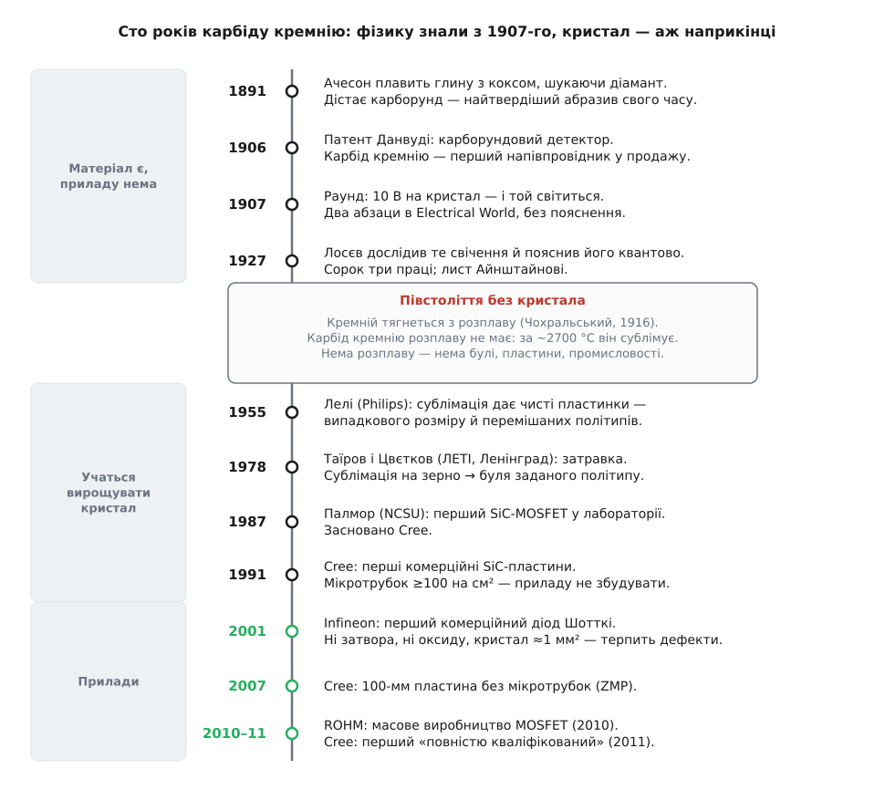
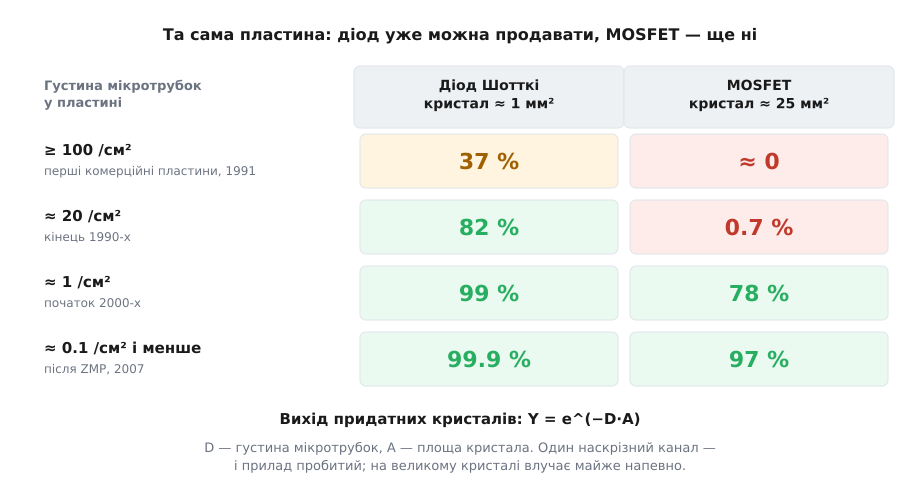

# 📜 Сто років від абразиву до ключа

> 1907 рік. Британський інженер притискає дротик до крихти карборунду, дає десять вольт — і кристал світиться. Це перше в історії спостережене свічення напівпровідника, і сталося воно на карбіді кремнію за сорок років до кремнієвого транзистора. Тоді ж карборундові детектори вже продавали для корабельних радіостанцій — коли кремній був хімічною цікавинкою, а германій не знав ніхто. А потім карбід кремнію зник з електроніки на півстоліття й повернувся силовим транзистором аж 2011-го. Матеріал за цей час не змінився ні на йоту. То що змінилося?

Відповідь на це питання варта того, щоб її розкопати, бо вона не про фізику. Фізику карбіду кремнію знали ганебно рано. Ціле століття пішло на інше — і те «інше» повторюється в історії кожного напівпровідника.


*Події не розкладені рівно. Усе цікаве з фізики трапилося на самому початку, тоді — розрив, і аж наприкінці, коли навчилися робити кристал, прилади посипалися один за одним за якийсь десяток років.*

## Ачесон шукав діамант, а знайшов назву з помилки

1884 року Едвард Ачесон (Edward Goodrich Acheson) узявся робити штучні діаманти в електричній печі. Ідея була пряма: діамант — це вуглець, отже треба взяти вуглець і дати йому дуже гарячу дугу. 1891-го він прожарив суміш глини з коксом вугільною дугою в залізній мисці й побачив на електроді жменьку блискучих шестикутних кристалів. Вони дряпали все, що траплялося під руку. Патент на спосіб їх добування він дістав 28 лютого 1893 року.

Тепер найсмачніше — звідки взялася назва. Ачесон вирішив, що виросла сполука вуглецю з глиноземом, який був у глині. Глинозем у вигляді мінералу зветься корунд *(corundum)*. Отже: carbon + corundum = **carborundum**, карборунд. Він помилився: у кристалі не було ані сліду алюмінію. Це був карбід кремнію — вуглець і кремній, узятий із тієї ж таки глини. Назва виявилася скам'янілою помилкою, і ця помилка живе в мові вже сто тридцять років.

Помилка була навіть подвійна, бо діаманта Ачесон теж не отримав. Але майже вгадав із твердістю — карборунд став найтвердішим штучним абразивом свого часу, і на цьому Ачесон збудував The Carborundum Company.

Іронія на цьому не закінчується. Через два роки, 1893-го, Анрі Муассан (Henri Moissan) розчиняв у кислоті уламок метеорита з Каньйону Діабло в Аризоні й у залишку знайшов ті самі кристали. Він теж спершу прийняв їх за діаманти й лише 1904 року впізнав карбід кремнію; того ж року Джордж Кунц (George F. Kunz) назвав мінерал **муасанітом** на його честь. Тобто людство спочатку навчилося карбід кремнію робити й аж потім упізнало його в природі. (Ще раніше, 1824 року, на можливість сполуки Si–C натякав Єнс Якоб Берцеліус (Jöns Jacob Berzelius) — але це радше здогад, який приписали заднім числом, ніж задокументоване відкриття; статус доказовості тут слабкий, і будувати на ньому першість не варто.)

Зверніть увагу на візерунок: усі, хто натикався на карбід кремнію, полювали на діамант. Це не збіг, і саме тут ховається перший натяк на всю подальшу історію. Твердість карборунду й [ширша заборонена зона](book:physics/energy-bands), заради якої його через сто років потягли в силову електроніку, — **це один і той самий фізичний факт**. Зв'язок Si–C короткий і дуже міцний. Міцний зв'язок означає, що ґратку важко продряпати механічно — це твердість. Той самий міцний зв'язок означає, що електрон із неї важко вирвати — це широка заборонена зона, а з неї вже випливає високе критичне поле. Абразив, яким шліфують сталь, і ключ, який тримає 1200 В, тримаються на одній властивості. Ачесон намацав силову електроніку руками, просто не мав як про це дізнатися.

## Карборунд був першим напівпровідником — раніше за кремній

Далі карбід кремнію робить те, чого від абразиву ніхто не чекав: він стає першим напівпровідниковим приладом, який продавали за гроші.

23 березня 1906 року Генрі Данвуді (Henry Harrison Chase Dunwoody), відставний генерал Корпусу зв'язку армії США, дістав патент на **карборундовий детектор** — крихту карборунду, затиснуту між металевими контактами, як випрямляч для радіоприймача. Це на два тижні пізніше за патент Пікарда на кремній, але саме карборунд пішов у широкий вжиток, і ось чому. Класичний детектор «котячий вус» на галеніті вимагав легесенького дотику дротика й пошуку чутливої цятки навпомацки; від першого ж струсу настройка збивалася. Карборунд же працював під **сильним** притиском — його можна було затиснути намертво пружиною чи залити легкоплавким сплавом, і він тримав настройку. Тому карборундові детектори осіли там, де трясе найбільше: на корабельних радіостанціях.

Осмисліть це як слід. Карбід кремнію був **першим комерційно важливим напівпровідниковим матеріалом** — за десятиліття до того, як германій і кремній хоч когось зацікавили.

А наступного року з нього ж вилетіло й перше спостережене свічення напівпровідника. У лютому 1907-го Генрі Джозеф Раунд (Henry Joseph Round) із лабораторії Марконі опублікував в «Electrical World» замітку на два абзаци: подав десять вольт на карборундовий кристал — біля контакту з'явилося жовтувате світло; на інших зразках при 110 В світило яскравіше. Раунд не пояснив нічого й пішов далі своїми справами. Замітку забули майже на двадцять років.

## Лосєв: той, хто не пройшов повз

Підняв її Олег Лосєв (1903, Твер, Російська імперія — 1942, Ленінград), і зробив із нею те, чого не зробив Раунд.

Десь близько 1924 року, працюючи в Нижньогородській радіолабораторії, Лосєв помітив, що точковий контакт на карборунді під постійним струмом дає зеленувату цяточку світла, — і, на відміну від попередника, вчепився в це явище. 1927-го він публікує його опис. Далі найважливіше: Лосєв не просто описав свічення, а **пояснив** його — і пояснив правильно. Він вирішив, що річ у новій тоді квантовій механіці й що перед ним фотоефект навпаки: не світло вибиває електрон, а електрон віддає світло. Він навіть написав про це Айнштайнові. Усього по собі він лишив сорок три праці й шістнадцять авторських свідоцтв.

Тут варто розкласти першість чесно, бо її регулярно перекручують на обидва боки. Раунд **спостеріг** явище першим — це факт, і два абзаци 1907 року нікуди не подіти. Але спостерегти й зрозуміти — різні дії. Лосєв першим це явище **дослідив, пояснив і побачив у ньому прилад**, і саме тому його ім'я стоїть в історії світлодіода по праву, а не з ласки. Обидва твердження задокументовані й не сперечаються між собою; сперечаються лише ті, хто плутає «побачив» із «зрозумів».

Так само чесно варто сказати й те, що зазвичай губиться. По-перше, **кристадин** — знаменитий генератор Лосєва на від'ємному опорі, з яким він будував підсилювачі й супергетеродини на частоти до 5 МГц за чверть століття до транзистора, — працював не на карборунді, а на цинкіті (ZnO); до історії карбіду кремнію той прилад стосунку не має. По-друге, [світлодіод](book:electronics/led) Лосєва був приречений: карбід кремнію — напівпровідник із **непрямою** забороненою зоною, і випромінювати світло він фізично не вміє як слід. Тож оптична кар'єра карборунду була безнадійна від початку — а силова ні. Це різна фізика, і в цьому вся сіль.

Лосєв помер 22 січня 1942 року в блокадному Ленінграді від голоду. Йому було 38.

## Кремній перемагає, бо його можна розплавити

Отже, 1930-ті. Карбід кремнію — визнаний напівпровідник із десятилітнім стажем у продажу. 1947-го в Bell Labs роблять транзистор — і роблять його на германії, потім на кремнії. Карборунд не бере участі. Чому?

Ось відповідь, і вона того варта, бо пояснює все сто років одним реченням: **кремній можна розплавити, а карбід кремнію — ні.**

1916 року Ян Чохральський (Jan Czochralski), польський хімік, працюючи в AEG у Німеччині, за неуважності вмочив перо не в чорнильницю, а в розплавлене олово — і витягнув з нього тоненьку ниточку, яка виявилася монокристалом. Він опублікував метод 1918-го. Сьогодні приблизно дев'ять із десяти напівпровідникових приладів світу зроблені з матеріалу, вирощеного [витягуванням монокристала з розплаву](book:physics/czochralski-growth).

Кремній плавиться за 1414 °C. Це подарунок: маючи розплав, ви маєте всі важелі одразу. Занурили затравку, тягнете вгору, крутите — керуєте діаметром. Кинули домішку в розплав — керуєте легуванням. Ведете фронт кристалізації повільно — керуєте дефектами. Уся кремнієва цивілізація виросла з того, що кремній має рідку фазу, з якою зручно поратися.

Карбід кремнію рідкої фази за звичайного тиску **не має взагалі**. Він не плавиться, а десь від 2700 °C сублімує — розкладається просто в пару, оминаючи рідину. І тут ланцюжок обривається весь одразу:

```
нема розплаву → нема витягування за Чохральським
              → нема булі
              → нема пластини
              → нема приладу
              → нема промисловості
```

Ось і все пояснення півстолітньої тиші. Не бракувало ані ідей, ані розуміння фізики — Раунд світив кристалом 1907-го. Бракувало **печі**. Кремній виграв не тому, що він кращий напівпровідник (він гірший майже за всіма параметрами, які важать у силовій техніці), а тому, що з ним домовився технолог.

## Лелі: сублімація в обхід — і чому цього не вистачило

Перший обхід знайшов 1955 року Ян Антоні Лелі (Jan Anthony Lely) з Philips (заявка подана в Нідерландах 1954-го, у США — 1955-го). Логіка проста: не можеш працювати з розплавом — працюй із парою. Розжарюємо карбід кремнію в порожнині приблизно до 2500 °C, він сублімує й осідає назад на холодніших стінках уже чистим монокристалом.

Кристали виходили гарні. Промисловість із них не вийшла — і причина повчальна.

Зародження й ріст у Лелі ніхто не контролював: де зачепилося, там і виросло. На виході — купа шестикутних пластинок **випадкового розміру**. Та навіть не розмір був біда. Карбід кремнію має близько **250** відомих [політипів](book:physics/polytypism) — різних способів скласти ті самі шари Si–C у стосик. Політипи мають **різну ширину забороненої зони**, а росли вони в одній пластинці впереміш, сусідніми ділянками. А тепер згадайте, що таке межа двох напівпровідників із різними зонами: це перехід. Отже, всередині кожного кристалика Лелі сиділи **випадкові переходи, яких туди ніхто не клав**.

На такому не збудуєш нічого. Прилад — це переходи, розставлені там, де ви їх задумали; якщо кристал підкидає вам власні, у випадкових місцях, він не підкладка, а лотерея. Кристали Лелі стали чудовим матеріалом для дослідників і безнадійним — для заводу.

## Таїров і Цвєтков: зерно, яке вирішило все

Розв'язок прийшов 1978 року з Ленінградського електротехнічного інституту (ЛЕТІ), від Юрія Таїрова й Валерія Цвєткова.

Ідея, як усі гарні ідеї, до смішного проста: якщо в Лелі кристал росте де попало й яким попало — **дай йому зразок для наслідування**. Кладемо над порошком-джерелом **затравку** — кристалик того політипу, який нам потрібен, — і тримаємо керований перепад температури. Пара (а це суміш Si, Si₂C і SiC₂) іде з гарячого джерела на холоднішу затравку й осідає на ній, укладаючись у ті самі позиції, що в затравці. Політип уже не жереб, а вибір. Геометрія теж: росте не пластинка, а **буля** — стовпчик, з якого ріжуться пластини.

Метод називають по-різному: модифікований метод Лелі, фізичне перенесення в парі (PVT), сублімація на затравку; у російськомовній літературі — метод ЛЕТІ або метод Таїрова–Цвєткова. Тут якраз той випадок, коли приписувати нічого не треба й нічого не треба відбирати: авторство чисте, західна література називає метод іменами авторів без застережень, і **саме він донині лишається стандартним способом об'ємного росту карбіду кремнію**. Кожна SiC-пластина в кожному інверторі кожного сьогоднішнього електромобіля вийшла з процесу, чий кістяк описано в тій статті 1978 року.

Від паперу до товару, щоправда, ще далеко. Роберт Девіс (Robert Davis) у Університеті штату Північна Кароліна (NCSU) розробляв карбід кремнію за гроші Управління військово-морських досліджень, і 1987 року шестеро — серед них Джон Палмор (John Palmour) — вийшли з його лабораторії й заснували Cree. Того ж 1987-го Палмор зробив **перший SiC-MOSFET** — лабораторний, збіднювального типу, який працював за 650 °C, і подав патент на MOS-структуру на карбіді кремнію. Прилад був, товару не було ще чверть століття.

Тим часом Cree заробляла зовсім на іншому: у серпні 1989-го вона випустила перший комерційний **синій світлодіод** — на карбіді кремнію. Той самий непрямозонний карбід, тож ККД був 0.03 % — світлодіод світив ледь-ледь. 1993 року Сюдзі Накамура (Shuji Nakamura) показав синій світлодіод на InGaN, у тисячу разів яскравіший, і ринок синього SiC-світлодіода помер за лічені роки. Але завод, що вмів робити SiC-пластини, лишився — і 1991-го Cree вже продавала **перші комерційні пластини карбіду кремнію** у світі. (Що саме керувало поворотом Cree до силових приладів, джерела прямо не кажуть — це вже правдоподібне міркування, а не задокументований факт.)

## Мікротрубка: дефект, який убиває саме силовий прилад

Пластини були. Приладів усе одно не було — бо в пластинах жила мікротрубка.

Ще 1951 року Чарльз Френк (F. C. Frank) передбачив: гвинтова [дислокація](book:physics/crystal-defects) з достатньо великим вектором Бюргерса накопичує в осерді стільки пружної енергії, що кристалові **вигідніше виїсти вздовж осі дірку** — заплатити поверхневою енергією, аби скинути пружну. Діаметр цієї дірки:

```
d = μ·b² / (4·π²·γ)

d — діаметр порожнього осердя,   μ — модуль зсуву,
b — вектор Бюргерса,             γ — питома поверхнева енергія
```

Чим більший b, тим ширший канал. У карбіді кремнію мікротрубки — це рівно френківські гвинтові дислокації з порожнім осердям, вектор Бюргерса в яких зазвичай у 3–7 разів більший за період ґратки c. Тобто мікротрубка — не брак технолога-невдахи, а **закономірний наслідок самого механізму росту**.

Тепер — чому це вбивчо саме для силового приладу. Мікротрубка йде **вздовж осі c**, тобто рівно в тому напрямку, у якому вертикальний силовий ключ проводить струм і тримає напругу. Це наскрізна порожня трубка через увесь блокуючий шар. Прилад, крізь який вона пройшла, під напругою просто пробитий.

А далі — чиста арифметика, і вона пояснює обидві дати з історії SiC точніше за будь-які міркування про «зрілість ринку». Убивчі дефекти сиплються на пластину випадково, тож частка придатних кристалів рахується за Пуассоном:

**Скільки кристалів виживе.**

```
Y = e^(−D·A)      D — мікротрубок на см²,  A — площа кристала, см²

Перші пластини Cree, D ≥ 100 /см²
  діод Шотткі,  A ≈ 1 мм²  = 0.01 см² → D·A = 1     → Y = e⁻¹    ≈ 37 %
  MOSFET,       A ≈ 25 мм² = 0.25 см² → D·A = 25    → Y = e⁻²⁵   ≈ 0.0000000014 %

Кінець 1990-х, D ≈ 20 /см²
  діод,   D·A = 0.2   → Y = e⁻⁰·²   ≈ 82 %     ← можна продавати
  MOSFET, D·A = 5     → Y = e⁻⁵     ≈ 0.7 %    ← не можна

Після 2007-го, D ≈ 0.1 /см²
  MOSFET, D·A = 0.025 → Y = e⁻⁰·⁰²⁵ ≈ 97.5 %  ← нарешті
```

Ось воно. **З тієї самої пластини діод уже можна продавати, а MOSFET — ще ні**, і різниця тільки в площі кристала. Не в грошах, не в маркетингу, не в готовності інженерів — у показнику експоненти.


*Стовпчик діода зеленіє вже на пластинах кінця 1990-х, стовпчик MOSFET — аж коли мікротрубки добили майже до нуля. Площа кристала стоїть у показнику експоненти, тож двадцятип'ятикратна різниця в площі перетворюється на різницю у виході в сто разів.*

> 🔧 **Навіщо це.** Звідси видно, чому мікротрубки добивали до нуля так уперто — і чому робили це за гроші армії США та DARPA. Cree оголосила 100-мм пластини **без мікротрубок** (Zero Micropipe, ZMP) 23 травня 2007 року. Порахуйте самі: між ZMP-пластиною й першим серійним SiC-MOSFET — рівно три-чотири роки. Це не збіг. Доки в пластині лишалася хоч одна мікротрубка на квадратний сантиметр, великий силовий кристал був статистично неможливий, і жодні гроші цього не міняли.

## Чому першим був діод (2001)

Тепер зрозуміло, чому перший прилад був саме [діодом Шотткі](book:electronics/schottky-diode), а не транзистором.

Діод Шотткі — найпростіший з можливих вертикальних SiC-приладів: метал, покладений на епітаксійний дрейфовий шар. Немає затвора. Немає підзатворного оксиду. Немає інверсійного каналу. Немає взагалі нічого, крім випрямного контакту метал–напівпровідник. Йому потрібен тільки добрий дрейфовий шар — і все. Кристал у нього крихітний, порядку квадратного міліметра, а отже, як щойно порахували, він переживає ту густину дефектів, яка великий кристал стирає на порох.

І — що не менш важливо — на нього вже чекав покупець із готовим болем. Кремнієвий швидкий діод у підвищувальному коректорі коефіцієнта потужності щоразу жбурляє в ключ сплеск [зворотного відновлення](book:electronics/reverse-recovery): накопичений заряд треба вимести, і на цьому гріється і діод, і транзистор поруч. У діода Шотткі на карбіді кремнію накопиченого заряду по суті немає — виметати нічого. Тому навіть за ціни в рази вищої за кремнієву він окупався одразу, просто на блоках живлення.

2001 року Infineon випустила перші комерційні SiC-діоди Шотткі на 300 і 600 В під маркою thinQ! — і стала першим у світі постачальником дискретних силових приладів на карбіді кремнію.

## Зрада оксиду — і чому до MOSFET було ще десять років

Лишалася друга стіна, і саме вона з'їла десятиліття між діодом і транзистором.

Ось що всіх надихало. Карбід кремнію — **єдиний** широкозонний напівпровідник, який вирощує собі власний SiO₂ термічно, точнісінько як кремній. Погрійте його в кисні — дістанете двоокис кремнію, той самий прекрасний ізолятор, на якому стоїть уся кремнієва MOS-індустрія. Це виглядало як дарунок долі: увесь кремнієвий інструментарій переїде на новий матеріал майже задарма.

А тепер поставте очевидне питання, яке довго не мало гарної відповіді. Ви окиснюєте SiC. Кремній із нього йде в SiO₂. **А вуглець куди?**

Частина відлітає чадним газом. Частина — ні. Те, що лишається, осідає на межі вуглецевими скупченнями плюс дефектами в приповерхневому недоокисі. Наслідок — густина пасток на межі порядку 10¹³ на см², на порядки гірше за кремнієву. Пастки біля дна зони провідності хапають електрони каналу: вільних носіїв меншає, а ті, що лишилися, розсіюються на заряджених пастках. Рухливість у каналі падала до одиниць см²/(В·с) — проти приблизно 950 см²/(В·с) в об'ємі 4H-SiC.

Відчуйте всю знущальність ситуації. Двадцять років училися вирощувати кристал заради тонкого й малоопірного дрейфового шару — а опір каналу, що сидить просто на ньому згори, зжирає весь виграш. Перевага була справжня в об'ємі й гинула на поверхні, у двох нанометрах від неї.

Розв'язок знайшовся в азоті. Відпал у монооксиді азоту NO — приблизно 1175 °C протягом двох годин — саджає азот на межу, і той пасивує пастки. Опубліковані 2000–2001 років результати (роботи за участю груп з Обернського університету й співавторів) показали: густина пасток біля дна зони провідності падає з ~8·10¹², а рухливість у каналі за кімнатної температури зростає на порядок — до ≈ 35 см²/(В·с).

І ось тут потрібна чесність, якої в рекламних матеріалах не буває. 35 проти 950 — це все ще **у 25 разів гірше за об'єм**. Задачу не розв'язали; її забили досить глибоко, щоб можна було продавати. Саме тому в сьогоднішньому SiC-MOSFET канал досі відповідає за помітну частку опору, і саме тому підзатворний оксид лишається найтоншим місцем приладу за надійністю: він працює під полем, якого кремнієвий оксид зроду не бачив, бо кристал під ним тримає вдесятеро більше.

## 2010, 2011 — і як насправді роблять першість

Лишилося останнє: хто ж зробив перший серійний SiC-MOSFET. Питання здається простим, а насправді воно показове — бо відповідей три, і всі правдиві.

```
1987  Палмор, NCSU        перший SiC-MOSFET узагалі
                          лабораторний, збіднювальний, працював за 650 °C
                          → це демонстрація, не товар

2010  ROHM                перше у світі МАСОВЕ ВИРОБНИЦТВО
                          планарний SiC-MOSFET

2011  Cree, 18 січня      перший «ПОВНІСТЮ КВАЛІФІКОВАНИЙ» комерційний
                          CMF20120D: 1200 В, 80 мОм за 25 °C,
                          менше за 100 мОм у всьому робочому діапазоні
```

Придивіться до формулювання Cree: «industry's first **fully qualified** commercial silicon carbide power MOSFET» — перший у галузі **повністю кваліфікований** комерційний силовий SiC-MOSFET. Кожне слово тут несе вагу, і найбільше — оте «fully qualified». Саме воно лишає недоторканим масове виробництво ROHM 2010 року. Ніхто не збрехав: ROHM справді першою поставила SiC-MOSFET на потік, Cree справді першою випустила повністю кваліфікований прилад. Просто це різні мірки, і кожен назвався першим за своєю.

Так першість і роблять у промисловості — здебільшого не брехнею, а точно дібраним прикметником. Тому на питання «хто перший» чесна відповідь звучить так: **залежить від того, що ви лічите — потік чи кваліфікацію**; фізичного змісту в цьому виборі немає, є комерційний. А 2011-й закріпився в галузі як дата не тому, що Cree переконливіше сперечалася, а тому, що саме приладом Cree інженери почали масово проєктувати.

## Що з цієї сотні років видно

Століття пішло не на фізику. Фізика лежала на столі непристойно рано: кристал світився в Раунда 1907-го, детектори продавали 1906-го, Лосєв пояснив свічення квантово 1927-го — коли до кремнієвого транзистора лишалося ще двадцять років. Ба більше: те, що робить карбід кремнію добрим силовим ключем, Ачесон тримав у руках 1891-го — просто називав це твердістю.

Усе сто років пішло на кристал, і кожна затримка має точну технічну назву:

```
не плавиться        → 1978, затравка Таїрова й Цвєткова
мікротрубки         → 2007, пластина без мікротрубок
вуглець на межі     → 2001, азотний відпал (і то лише «забито», не «розв'язано»)
```

Звідси й мораль, ширша за карбід кремнію. У напівпровідниках вузьким місцем майже ніколи не буває матеріал — його властивості зазвичай відомі задовго наперед і нікуди не тікають. Вузьким місцем щоразу виявляється **кристал**: чи вміємо ми виростити цю річ великою, чистою й однаковою. Карбід кремнію ніколи не чекав на ідею. Він чекав на піч.
