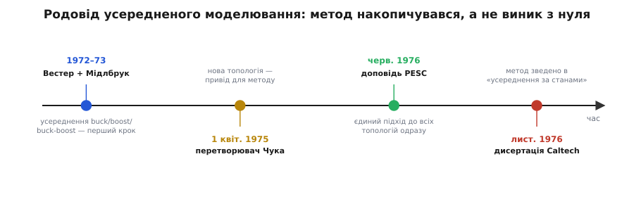
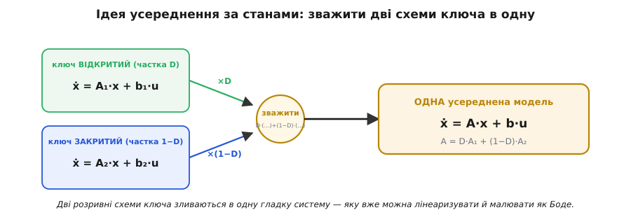

# 📜 Як приручили імпульсний перетворювач: Мідлбрук, Чук і усереднення за станами

Уявіть інженера початку 1970-х із паяльником і рахувальною лінійкою, перед яким стоїть імпульсний перетворювач, що норовить задзвеніти. Ключ у ньому рубає струм десятки тисяч разів на секунду; поки ключ відкритий — одна схема, поки закритий — інша. Інженер хоче лише простого: замкнути зворотний зв'язок так, щоб вихід тримався рівно й не пішов у коливання. Але щоб проєктувати зворотний зв'язок, потрібна **передатна функція** — гладкий опис «наскільки сильно й швидко вихід відгукнеться на смик керування». А передатної функції нема й бути не може: об'єкт **розривний**, він щотакту стрибає між двома схемами, і жодне гладке рівняння його не бере.

Що робили на практиці? Будували, вмикали й дивилися, чи задзвенить. Крутили номінали навмання. Ставили зайвий конденсатор «про всяк випадок». Це була епоха, коли імпульсне живлення вже [подешевшало й полетіло в космос](topic:electronics/switching-converter), а проєктування його контуру лишалося наполовину чаклунством. Бракувало **теорії** — способу взяти перемикальний брикет і чесно перетворити його на лінійну систему, з якою вміє працювати вся наука про керування. Цю теорію виробили в середині 1970-х у Каліфорнійському технологічному інституті (Caltech), і вона варта того, щоб знати, як саме вона народилася — бо історія тут не про раптове осяяння одного генія, а про кілька років накопичення, у якому кожен крок спирався на попередній.

## Що саме бентежило

Корінь клопоту — у слові «розривний». Лінійна теорія керування, діаграми Боде, запаси стійкості — усе це живе у світі **гладких** систем, які описуються сталими коефіцієнтами. Підсилювач на лампах чи транзисторах гладкий: подав малий сигнал — дістав пропорційний відгук, і можна писати передатну функцію. Імпульсний перетворювач такого не дозволяє. Його «коефіцієнти» **перемикаються** щотакту: то котушка під'єднана до входу, то відрізана; то конденсатор заряджається від котушки, то живить навантаження сам. Формально це система зі змінною в часі структурою, і класична передатна функція для неї просто не визначена.

Був і другий, тонший бік. Навіть якби хтось написав точні рівняння для кожної з двох фаз, лишалося питання: **як їх зшити** в одну модель, що описує повільну поведінку виходу, не тягнучи за собою кожен окремий імпульс? Адже інженера цікавить не форма пилки на котушці, а те, як вихід реагує на зміну навантаження за мілісекунди — набагато повільніше за такт комутації. Потрібен був спосіб **згладити** швидке перемикання й лишити тільки повільну суть, та ще й строго, з формулами, а не «на око».

І третій клопіт, найпідступніший. Дехто вже помічав, що деякі топології поводяться дивно: смикнеш керування в один бік, а вихід спершу йде в **протилежний**. Це та сама «реакція навпаки», яку в boost дає нуль правої півплощини. Без теорії таку поведінку неможливо було ні передбачити, ні навіть назвати — вона виглядала просто як незрозумілий норов конкретної схеми. Модель мала не лише згладжувати, а й **виводити** такі особливості з перших принципів, показуючи, звідки в передатній функції беруться полюси й нулі.

## Перший крок: Вестер згладжує три топології

Тут важливо не піддатися спокусі героїчної легенди «прийшов Мідлбрук і все винайшов». Насправді підмурок заклали раніше — і заклав його інший аспірант Мідлбрука, **Ґордон Вестер** (*Gordon W. Wester*).


*Метод не виник з нуля одним стрибком, а накопичувався кілька років. Вестер із Мідлбруком першими показали, що buck, boost і buck-boost можна замінити наближеними неперервними моделями (1972–73). Винахід перетворювача Чука (1 квітня 1975) дав живий привід шукати загальний метод. Доповідь на PESC (червень 1976) уперше подала єдиний підхід до всіх топологій, а дисертація Чука (листопад 1976) звела все в строгу процедуру.*

У докторській дисертації Вестера 1972 року в Caltech — «Low-Frequency Characterization of Switched DC-DC Converters» — і в статті, яку вони з Мідлбруком опублікували наступного, 1973 року в журналі *IEEE Transactions on Aerospace and Electronic Systems*, уперше зроблено ключовий хід: замінити перемикальний перетворювач **наближеною неперервною моделлю**. Вони показали, що для трьох базових топологій — [buck, boost і buck-boost](topic:electronics/buck-boost) — можна вивести прості аналітичні вирази для перехідної й частотної характеристик, згладивши перемикання усередненням. Уже там жила головна ідея: якщо фільтр однаково повільний проти такту комутації, то вихід бачить не окремі імпульси, а їхнє **середнє**, і саме середнє можна описати гладко.

Але Вестерів підхід був радше набором окремих рецептів **на кожну топологію**, ніж єдиним методом. Для buck — свої формули, для boost — свої, для buck-boost — треті. Бракувало загального апарату, який брав би **будь-яку** схему й видавав модель за одним рецептом. І бракувало приводу цей апарат шукати — доки привід не з'явився сам.

## Привід: перетворювач Чука

Той привід приніс до Caltech новий аспірант — **Слободан Чук** (*Slobodan Ćuk*; серб, вимова «Чук», а не «Кук»). І тут варто одразу поставити крапку в питанні ідентичності, бо його часто плутають. Чук — **серб, а не росіянин**. Народився й виріс у Югославії, здобув ступінь бакалавра в Белградському університеті 1970 року, а 29 лютого 1972 року емігрував із Белграда до Сполучених Штатів. Здобув магістра в університеті Санта-Клари 1974-го й прийшов в аспірантуру Caltech до Мідлбрука. Це усталений, добре задокументований факт: Чук — серб-американець, і жодного стосунку до російської чи радянської школи він не має. Плутанина береться хіба з того, що слов'янське прізвище на захід чують гамузом; але серб із Белграда — це серб із Белграда.

Чук був не лише теоретиком. **1 квітня 1975 року** він винайшов власну топологію перетворювача — ту саму, що тепер зветься його ім'ям, *Ćuk converter*, «перетворювач оптимальної топології» з майже нульовою пульсацією і на вході, і на виході. І ось тут історія робиться цікавою: **саме цей винахід став живим приводом** шукати загальний метод моделювання. Нова топологія не лягала в готові Вестерові рецепти — її треба було аналізувати з нуля, а робити це щоразу заново для кожної нової схеми було нестерпно. Потрібен був **універсальний** апарат, який брав би опис будь-якого перетворювача й механічно видавав його динамічну модель. Винахід поставив задачу; метод став відповіддю на неї.

> 🔧 **Навіщо це.** Ця пара — «винайшов топологію, тоді змусив себе вивести загальний метод її аналізу» — типова для інженерної науки. Практична потреба (як полічити мій новий перетворювач?) породжує теорію ширшу за саму потребу. Коли сьогодні ви берете даташит контролера й читаєте частоту зрізу контуру, за цим числом стоїть саме той загальний апарат, який Чук із Мідлбруком змушені були винайти, бо конкретна нова схема не вкладалася в старі формули.

## Ідея: зважити дві схеми в одну

Що ж вони зробили? Метод дістав назву **усереднення за простором станів** (*state-space averaging*), і його серцевина навдивовижу проста — настільки, що її можна побачити на одній картинці.


*Уся ідея усереднення за станами на одному погляді. Перетворювач за такт живе у двох станах: ключ відкритий (частка такту D) і ключ закритий (частка 1−D), кожен зі своїм рівнянням. Замість зшивати їх щотакту, беруть зважену суму — стан ВКЛ із вагою D, стан ВИМК із вагою (1−D). Виходить ОДНА усереднена система зі сталими коефіцієнтами, що описує повільну поведінку без жодного ключа. Її вже можна лінеаризувати навколо робочої точки й малювати як діаграму Боде.*

Розберімо цей хід. Перетворювач за один такт побуває у двох станах. Поки ключ **відкритий** (це частка такту, рівна шпаруватості D), схема описується одним набором рівнянь — мовою теорії систем, матрицею A₁: похідні струмів і напруг залежать від самих струмів і напруг ось так. Поки ключ **закритий** (решта такту, частка 1−D), схема інша — матриця A₂. Дві правди, що змінюють одна одну щотакту.

Прозріння в тому, що якщо фільтр повільний, то виходу байдуже до миттєвого перемикання — йому важить лише **скільки часу** система провела в кожному стані. А це і є ваги D і (1−D). Тож замість того, щоб чесно зшивати дві схеми на межі кожного такту (що безнадійно складно), беруть просто **зважену суму** їхніх рівнянь:

```
A = D·A₁ + (1−D)·A₂          (усереднена матриця стану)
b = D·b₁ + (1−D)·b₂          (усереднений зв'язок із входом)
```

І все. Дві розривні схеми злилися в **одну усереднену** систему зі сталими коефіцієнтами. Розривність зникла — бо ми викинули сам факт перемикання й лишили тільки його усереднений слід, зашитий у ваги D і (1−D). Тепер це звичайна гладка система, з якою вже вміє працювати класична теорія: її можна лінеаризувати навколо робочої точки (замінити шпаруватість на «робоче D плюс мала гойданка») і дістати ту саму передатну функцію керування→вихід, яку хотів наш інженер із паяльником. А оскільки ваги залежать від D, то й **зміна шпаруватості** природно входить у модель — звідси беруться і полюси LC-фільтра, і нуль ESR, і навіть той підступний нуль правої півплощини в boost, який раніше виглядав незбагненним норовом.

Оце і є вся суть. Метод не вимагає розв'язувати диференціальні рівняння з розривами — він **обходить** розрив зважуванням. Проста думка, але саме вона перетворила проєктування імпульсних перетворювачів із чаклунства на інженерію.

## Знакова доповідь: PESC, червень 1976

Оприлюднили метод на конференції **IEEE Power Electronics Specialists Conference (PESC)**, що проходила в Клівленді **8–10 червня 1976 року**. Доповідь Мідлбрука й Чука мала промовисту назву — «A General Unified Approach to Modelling Switching-Converter Power Stages» («Загальний уніфікований підхід до моделювання силових каскадів перемикальних перетворювачів»). Уже в назві — відповідь на головний біль епохи: не рецепт на одну топологію, а **загальний, уніфікований** підхід до **будь-якого** перетворювача.

У доповіді вони зробили ще один елегантний хід поверх усереднення — запропонували **канонічну схему-модель** (*canonical circuit model*): єдину еквівалентну схему з незмінною топологією, яка вміщує всі суттєві властивості входу-виходу й керування будь-якого DC-DC перетворювача, хоч би яка складна була його реальна конфігурація. Тобто мало того, що метод давав формули, — він давав ще й **наочну схему**, у якій видно, звідки беруться полюси й нулі передатної функції. Це був той рідкісний випадок, коли теорія виходить одночасно строгою й зрозумілою оком.

Дисертацію, у якій усе це зведено докупи, Чук завершив у **листопаді 1976 року** (ступінь доктора Caltech присвоєно 1977-го); називалася вона «Modeling, Analysis, and Design of Switching Converters». Відтоді усереднену модель перетворювача часто-густо звуть **«моделлю Мідлбрука»** — на честь наукового керівника, у чиїй групі метод визрів. Назва усталена в спільноті, хоч, як ми бачили, чесніше було б казати «модель Мідлбрука–Чука», а корінням сягати ще Вестера: наука ця **колективна й кумулятивна**, як майже все справді важливе в інженерії.

## Чому це не легенда про одного героя

Варто затриматися на тому, **яку саме історію** ми щойно розповіли, бо вона свідомо не така, як часто подають. Спокуса будь-якої історії винаходу — стиснути її в одне ім'я й один момент осяяння: «Мідлбрук винайшов усереднення за станами». Так і пишуть у багатьох підручниках, і формально це не зовсім хиба — метод справді визрів у його групі й носить його ім'я. Але справжня картина багатша й точніша.

Був **перший крок** — Вестер, який ще 1972–73 показав, що перемикальний перетворювач можна замінити неперервною моделлю, хай і окремим рецептом на кожну топологію. Був **привід** — конкретна нова топологія Чука, яка не лягла в старі рецепти й змусила шукати загальний метод. Був **синтез** — усереднення за станами й канонічна схема, у яких Чук із Мідлбруком звели розрізнені прийоми в один строгий апарат, оприлюднений 1976 року. Кожен крок спирався на попередній; жоден не був би можливий поодинці. Це не применшує ні Мідлбрука, ні Чука — навпаки, показує їхню справжню роль точніше за легенду: вони не витягли метод із порожнечі, а **завершили й узагальнили** те, що дозріло в кількох роках роботи цілої групи.

І окремо — про Чука. Його слов'янське ім'я легко проковтнути й приписати «російській школі», якої тут і близько немає. Чук — **серб із Белграда**, серб-американець, що приїхав до США 1972 року й зробив кар'єру в Caltech; згодом він заснував власну фірму TESLAco (1979) і отримав понад півсотні патентів. Плутати його національність — та сама недбалість, що клеїть «російське» на все східноєвропейське гамузом. Тут ідентичність задокументована однозначно, і плутати нема причин: серб, а не росіянин.

## Що з цього забрати

Ця історія цінна двома речами — одна про сам предмет, друга ширша.

**Про предмет.** Наступного разу, коли ви розкриєте діаграму Боде імпульсного перетворювача чи прочитаєте в даташиті контролера частоту зрізу контуру, знайте: за цим стоїть цілком конкретний винахід середини 1970-х. Метод усереднення за станами перетворив розривний, перемикальний об'єкт на гладку лінійну систему одним акуратним ходом — зважуванням двох схем ключа з вагами D і (1−D). До нього контур імпульсного живлення проєктували наполовину навмання; після нього — рахують. Це рідкісний приклад теорії, що прямо змінила щоденну інженерну практику й досі лежить в основі кожної книжки з силової електроніки.

**Ширше — про те, як читати історії винаходів.** Майже кожен «винахід одного генія» під пильним поглядом розсипається на **низку кроків цілої групи**, де важать і попередник, якого забули (Вестер), і живий привід із практики (топологія Чука), і синтез, що все звів докупи. Тримайте цю недовіру до простих легенд увімкненою — і водночас віддавайте кожному його справжнє: Мідлбруку — керівництво й узагальнення, Чуку — привід і синтез (і точну національність — серб, не росіянин), Вестеру — перший крок. Точність тут не педантизм, а повага: до людей, які справді зробили роботу, і до читача, який заслуговує знати, як усе було насправді.
