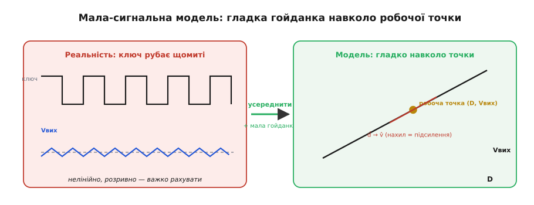
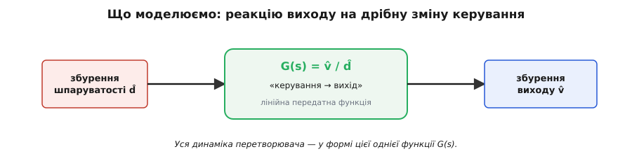
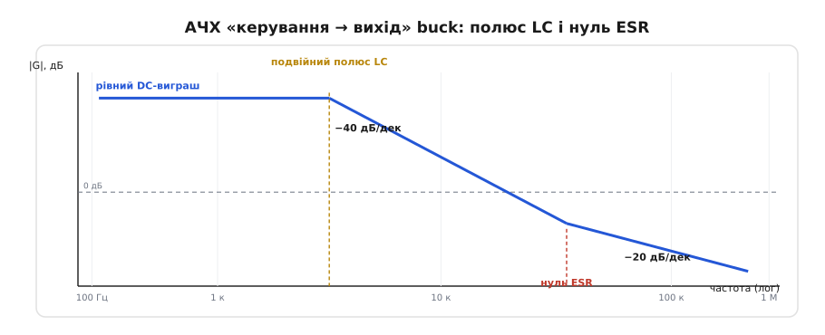
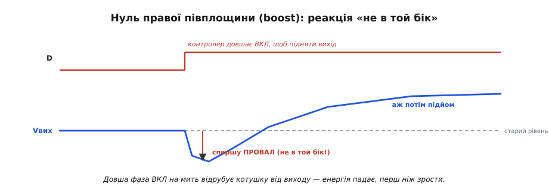

# Малосигнальна модель DC/DC перетворювача

Імпульсний DC/DC перетворювач — прилад підступно нелінійний. Усередині сидить ключ, що рубає струм сотні тисяч разів на секунду; напруга на ньому стрибає між нулем і входом прямокутником, струм у котушці пиляє трикутником, а вихід тремтить дрібною пульсацією. Спробуйте описати таку річ звичайним рівнянням — і впораєтеся зле: розривний, перемикальний, стрибкоподібний об'єкт погано лягає в гладку математику. А описати його **треба**: без моделі не скажеш, чи буде зворотний зв'язок стійким, чи не піде вихід у дзвін, наскільки швидко перетворювач відпрацює стрибок навантаження. Отут і народжується **малосигнальна модель** — хитрий спосіб перетворити цей нелінійний брикет на просту, знайому лінійну систему, з якою вміє працювати вся теорія керування.

Уся ідея — у двох рухах: спершу **прибрати ключ усередненням**, тоді **дивитися лише на дрібну гойданку** навколо робочої точки. Розберімо обидва по черзі — і побачимо, звідки береться та єдина функція, що вміщує всю динаміку перетворювача.

### Крок перший: усереднити ключ геть

Погляньмо, що саме заважає. Заважає ключ: доки він відкритий — одна схема, доки закритий — інша, і перемикання рве будь-яке гладке рівняння на шматки. Але придивімося до того, що **реально важить** для виходу. Вихідний конденсатор із котушкою — це фільтр, і фільтр цей **повільний**: він згладжує все, що швидше за кілька десятків кілогерц. Перемикання йде на сотнях кілогерц — тобто **набагато швидше**, ніж вихід узагалі здатний ворухнутися. Виходить, вихід не бачить окремих імпульсів ключа; він бачить лише їхнє **середнє**.

А середнє задає одна-єдина величина — **шпаруватість** (*duty cycle*, D), частка такту, коли ключ відкритий. Для знижувального buck-перетворювача, наприклад, середня напруга на виході дорівнює просто D·Vвх. Ключ то там, то тут, прямокутник скаче — а вихід тримається на D·Vвх, ніби ключа й немає, а є плавний «кран», відкритий на частку D.

Оце і є **усереднення** (*averaging*): ми викидаємо з розгляду сам факт перемикання й лишаємо тільки його усереднений ефект. Замість «ключ рубає щомиті» кажемо «крутиться кран на D». Розривна схема стала гладкою: тепер вихід — плавна функція шпаруватості, а не мозаїка з двох станів.


*Два кроки моделювання одним поглядом. Зліва — реальність: ключ рубає щотакту, напруга стрибає прямокутником, вихід тремтить пульсацією — розривно й важко рахувати. Справа — після усереднення: вихід стає гладкою функцією шпаруватості Vвих(D). Лишається знайти нахил цієї кривої в одній точці — і дрібна гойданка навколо неї (d̂ → v̂) описується прямою.*

> 🔧 **Навіщо це.** Усереднення — це дозвіл забути про такт комутації, коли рахуєш поведінку виходу. Саме тому в даташиті [контролера](topic:electronics/controller-fsw) параметри контуру дають у герцах смуги (одиниці–сотні кГц), а не «на такт»: контур живе в усередненому світі, де перемикання вже згладжене фільтром. Без цього дозволу довелося б моделювати кожен імпульс — і жодна практична розробка так не рахує.

### Крок другий: дивитися лише на дрібну гойданку

Гладка крива Vвих(D) — уже краще, але це ще нелінійна крива: у boost-перетворювача, скажімо, вихід залежить від D зовсім не прямо, а як Vвх/(1−D), тобто круто вигинається. Працювати з кривими незручно; хочеться **прямої**. І тут — другий, вирішальний хід.

Перетворювач у роботі не гуляє шпаруватістю від нуля до одиниці. Він сидить у **робочій точці** (*operating point*): усталене D, за якого вихід дорівнює цілі, скажімо 5 В. Зворотний зв'язок лише **трошки** підкручує D навколо цього значення — щоб утримати вихід, коли смикнулося навантаження чи вхід. Ці підкрутки **крихітні** проти самого D. А раз ми ніколи не відходимо від точки далеко, то й **крива на цьому клаптику — майже пряма**: будь-яка гладка крива зблизька виглядає відрізком своєї **дотичної**.

Оце і є **лінеаризація** (*linearisation*, від лат. *linea* — лінія): ми замінюємо вигнуту криву її дотичною в робочій точці й далі маємо справу тільки з малими відхиленнями вздовж цієї прямої. Домовимося про позначення: великою літерою — усталене (робоче) значення, а **малою з дашком** — крихітне збурення навколо нього. Тоді:

```
D = D₀ + d̂       (шпаруватість = робоча + мала гойданка)
Vвих = V₀ + v̂    (вихід = робочий + мала гойданка)
```

Величини з дашком — d̂, v̂, î — і є той «малий сигнал» (*small signal*), від якого й назва моделі. Модель нічого не каже про самі D₀ і V₀ (їх задає усталений режим); вона описує **лише зв'язок гойданок**: як мала зміна керування d̂ породжує малу зміну виходу v̂. І оскільки на клаптику крива — пряма, цей зв'язок теж прямий, лінійний. Нахил тієї прямої — **підсилення** (*gain*): у скільки разів d̂ переганяється у v̂.

Варто одразу побачити, де ця гарна картина **ламається**. Дотична вірна, лише **поки гойданка мала**. Смикніть навантаження так різко, що контролер сам на мить упреться в D=0 або D=100 %, — і перетворювач **вилетить** з клаптика, де крива схожа на пряму; модель у цю мить бреше, бо реальність пішла в **обмеження великого сигналу** (насичення котушки, ключ повністю відкритий/закритий). Малосигнальна модель — про **дрібні** відхилення й стійкість навколо точки, а не про велике збурення на межі можливостей. Пам'ятати цю межу — половина справи.

### Що саме моделюємо: реакцію виходу на керування

Тепер найважливіше — **навіщо** нам зв'язок d̂ → v̂. Бо саме ним замикається зворотний зв'язок. [Контур керування](topic:electronics/feedback-stability) працює так: побачив, що вихід просів, — підкрутив шпаруватість, щоб підняти його назад. Тобто контролер **смикає d̂ і чекає v̂**. Наскільки сильно й наскільки **швидко** вихід відгукнеться на смик керування — це і вирішує, буде контур стійким чи піде в дзвін. А відповідь на це «наскільки сильно й швидко» ховається якраз у передатному зв'язку **керування → вихід**.

Позначають цей зв'язок функцією передачі G(s) — «скільки виходу на одиницю керування»:

```
G(s) = v̂ / d̂      (реакція виходу на дрібну зміну шпаруватості)
```


*Уся малосигнальна модель силової частини вкладається в один блок. На вході — дрібна зміна керування d̂, на виході — дрібна зміна напруги v̂, а між ними — функція передачі G(s). Спроєктувати зворотний зв'язок — означає знати саме цю функцію: як сильно і як швидко вихід відгукується на смик шпаруватості.*

Тут з'являється загадкове **s** — і воно того варте, щоб пояснити просто. Ми не хочемо знати реакцію лише на **повільні** зміни (це просто нахил кривої, звичайне число). Ми хочемо знати реакцію на зміни **будь-якої швидкості** — бо контур смикає D і повільно, і швидко, а силова частина на різних швидкостях відгукується по-різному: на повільний смик вихід іде слухняно, на дуже швидкий — не встигає, бо котушка інертна, а конденсатор згладжує. Змінна s — це, грубо, **швидкість (частота) збурення**: підставив повільну — G(s) каже реакцію на повільне, підставив швидку — каже реакцію на швидке. Одна функція G(s) зберігає **всю** цю залежність від швидкості. Тому вона й описує повну динаміку: не одне число, а закон «як відгук залежить від того, наскільки різко смикнути».

> 🔧 **Навіщо це.** Уся практика проєктування контуру — це робота з G(s) силової частини. Коли даташит контролера дає «частоту зрізу контуру» чи радить певні R і C компенсації — за цим стоїть G(s) саме цього перетворювача. Тому й [котушку з конденсатором](topic:electronics/converter-caps) не можна міняти безкарно: вони входять у G(s), і зміна номіналу зсуває всю динаміку — контур, стійкий на одних деталях, задзвенить на інших.

### Обличчя моделі: діаграма Боде

Функцію G(s) незручно тримати в голові формулою. Зате її дуже зручно **намалювати** — як залежність відгуку від швидкості збурення. Такий графік — **діаграма Боде** (за іменем Гендріка Боде, інженера Bell Labs): по горизонталі — частота збурення (у логарифмічному масштабі, бо цікавлять цілі декади), по вертикалі — наскільки сильним виходить відгук (у децибелах — теж логарифмічна міра підсилення). Для типового buck-перетворювача це обличчя має впізнаваний вигляд.


*Обличчя функції передачі buck. На малих частотах відгук рівний — «скільки виходу на керування» тут просто стале число (DC-виграш). На частоті резонансу фільтра котушка-конденсатор крива зламується вниз одразу на −40 дБ/дек: пара реактивних елементів дає подвійний полюс. Вище — ще один злам угору (нуль), який вносить паразитний опір конденсатора (ESR), і спад вирівнюється до −20 дБ/дек.*

Прочитаймо цей графік як історію відгуку. **Зліва (повільні збурення)** крива рівна: смикаєш D помалу — вихід іде слухняно, у сталу кількість разів. Це **DC-виграш**, звичайний нахил кривої Vвих(D), про який ми говорили.

Далі крива різко **завалюється вниз** — і завалюється круто, на **−40 дБ на декаду** (тобто вдесятеро на кожні десять разів частоти — і то у квадраті). Цей злам — на частоті **резонансу LC-фільтра**, тієї самої пари котушка-конденсатор, що згладжує вихід. Інженери звуть таку особливість **полюсом** (*pole*), а оскільки тут їх зразу два (два реактивні елементи — L і C), кажуть **подвійний полюс**. Фізичний зміст простий: вище резонансу фільтр перестає пропускати. Смикаєш D **швидше** за резонанс — а котушка з конденсатором уже не встигають перекинути енергію на вихід, і відгук падає. Саме цей крутий завал і робить контур схильним до дзвону: на резонансі фільтр додає велике **запізнення**, і надто швидкий контур перестрибує ціль.

А ще вище крива несподівано **вирівнюється** — спад із −40 стає −20 дБ/дек, ніби щось підняло відгук назад. Це робота **нуля** (*zero*) — протилежності полюса: там, де полюс завалює, нуль підпирає. Родом цей нуль — від **паразитного опору вихідного конденсатора** (ESR, *equivalent series resistance* — еквівалентний послідовний опір; жоден реальний конденсатор не без нього). На високих частотах конденсатор — це вже не чиста ємність, а ємність із маленьким резистором ESR, і саме той резистор дає струмові прямий шлях, підпираючи відгук. Тому й кажуть «нуль ESR».

Оці три риси — рівний DC-виграш, подвійний полюс LC, нуль ESR — і є вся малосигнальна анатомія buck-перетворювача, зчитана з одного графіка. Хто розуміє цю картину, той бачить наперед, де контур схильний зірватися і що робить [компенсація](topic:electronics/feedback-stability): вона підправляє форму цієї кривої, притлумлюючи відгук там, де полюс LC додав небезпечне запізнення.

### Каверза boost: нуль, що тягне не в той бік

Досі все виглядало доброзичливо: смикнув D угору — вихід пішов угору, лише з різною швидкістю. Для buck так і є. Але є топології, де малосигнальна модель ловить справжню каверзу, і найвідоміша з них — у [boost-перетворювачі](topic:electronics/boost).

Уявіть, що boost хоче **підняти** вихід. Щоб накопичити більше енергії, контролер **довшає фазу ВКЛ** — тримає ключ відкритим довше. Але поки ключ відкритий, котушка в boost **відрізана** від виходу: вона в цю фазу лише запасає енергію в собі, а віддає її навантаженню в **іншій** фазі, коли ключ закривається. Тож перше, що відчує вихід від довшої фази ВКЛ, — це що його **на мить лишили без підживлення**: конденсатор трохи розряджається на навантаження сам. Вихід **просідає** — рівно тоді, коли ми хотіли його підняти. І лише **згодом**, коли накопичена в котушці зайва енергія почне вивалюватися на вихід, він піде вгору, вище, ніж був.


*Реакція boost «не в той бік». Контролер довшає фазу ВКЛ, щоб підняти вихід (верхня лінія). Але довша фаза ВКЛ на мить відрубує котушку від виходу — і вихід спершу ПРОВАЛЮЄТЬСЯ нижче старого рівня, і аж потім піднімається. Ця вроджена «зворотна реакція» — нуль правої півплощини — змушує робити контур boost помітно повільнішим.*

Ця «реакція навпаки» — не збій і не поганий монтаж, а **вроджена властивість** топології, і малосигнальна модель ловить її як особливий об'єкт — **нуль правої півплощини** (*right-half-plane zero*, RHP-нуль). Звичайний нуль (як той ESR) — доброзичливий; нуль правої півплощини — його лихий двійник: він теж підпирає відгук за силою, але додає при цьому підступного **запізнення**, ніби система впирається, перш ніж послухатися. А запізнення — злий ворог зворотного зв'язку. Контур бачить «вихід просів», додає ще D — а від цього вихід **просідає ще глибше**, перш ніж піти вгору; контур додає ще — і розганяє коливання замість гасити.

Наслідок суто практичний і суворий: контур boost доводиться робити **навмисне повільним**. Його смугу (швидкість реакції) беруть у кілька разів **нижчою** за частоту цього RHP-нуля — просто щоб контролер **не встигав** зреагувати на оманливе початкове просідання. Тому boost за тієї самої потужності завжди тугіший на стрибок навантаження, ніж buck: за це його вроджену каверзу й доводиться платити. Той самий RHP-нуль живе і в [buck-boost, і у зворотноходовому flyback](topic:electronics/buck-boost) — усюди, де котушка віддає енергію виходу лише у фазі ВИМК.

> 🔧 **Навіщо це.** Це найпрактичніший висновок усієї моделі: якщо схема живиться від boost (типово — підняти напругу акумулятора до потрібної рейки), не чекайте від неї блискавичної реакції на різкий стрибок споживання. Закладайте більший вихідний конденсатор, щоб він **сам** тримав рейку в ту мить, поки повільний контур розганяється. І ніколи не «прискорюйте» такий контур наосліп — швидший boost не кращий, він нестійкий.

### Звідки береться сама модель

Ми весь час користалися нахилами й полюсами так, ніби вони самі собою відомі. Насправді за ними стоїть акуратна процедура: **усереднення за простір станів** (*state-space averaging*) — рецепт, що з двох схем перетворювача (ключ відкритий / ключ закритий) складає **одну усереднену** модель, лінеаризує її навколо робочої точки й видає ту саму G(s) із її полюсами й нулями у вигляді формул. Саме звідти беруться точні вирази для частоти резонансу LC, для нуля ESR, для RHP-нуля boost. Хто хоче не лише **читати** діаграму Боде, а й **вивести** її для своєї топології, знайде повне виведення у [🧮 математичній вставці про усереднення за простір станів](topic:electronics/small-signal-converter/math-state-space-averaging.md).

Метод цей — не безіменна класика, і його історія варта згадки. Його виробили в середині 1970-х у Каліфорнійському технологічному (Caltech): [Роберт Мідлбрук і його аспірант Слободан Чук](topic:electronics/small-signal-converter/hist-averaging.md) — сербський, а не російський інженер, що приїхав до США з Белграда. Їхня доповідь 1976 року на конференції PESC уперше подала єдиний підхід до моделювання силових каскадів, і відтоді усереднену модель перетворювача часто так і звуть «моделлю Мідлбрука». Це усталений, документований факт, а не пізніша легенда.

### Що з цього забрати

Малосигнальна модель — це два прості дозволи, що приборкують нелінійний перемикальний прилад. Перший: **усередни ключ** — фільтр однаково згладжує перемикання, тож вихід бачить лише середнє, задане шпаруватістю. Другий: **дивись на дрібну гойданку** навколо робочої точки — на клаптику крива схожа на пряму, і зв'язок «керування → вихід» стає лінійним. Разом вони дають одну функцію передачі G(s), у якій вкладена вся динаміка: як сильно й наскільки швидко вихід відгукується на смик шпаруватості.

Читати цю функцію найзручніше з діаграми Боде: рівний DC-виграш, крутий подвійний полюс на резонансі LC, нуль ESR вище. А в boost і його рідні — ще й нуль правої півплощини, «реакція навпаки», через яку контур доводиться робити повільним. Усе це — не абстрактна теорія, а те, що прямо диктує, які деталі ставити, як компенсувати контур і чому один перетворювач стійкий, а інший дзвенить. Модель варта того, щоб її розуміти: вона перетворює «перетворювач якось поводиться» на «перетворювач поводиться саме так, і ось чому».
