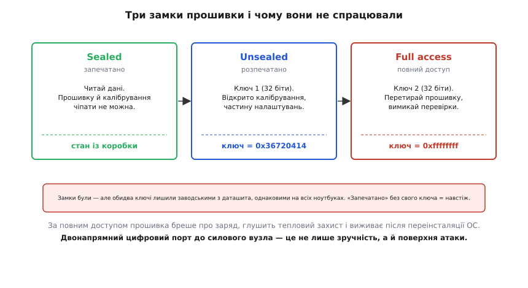

# 📜 Коли батарея стала поверхнею атаки

Літня спека 2011-го, Лас-Вегас, конференція Black Hat. На сцену виходить чоловік і каже залу приблизно таке: у вашому ноутбуку є маленький комп'ютер, про який ви не думаєте, і я вмію переписати його прошивку так, що батарея почне вам брехати про свій стан, а тоді, можливо, спалахне. Чоловіка звали Чарлі Міллер (Charlie Miller) — американський дослідник безпеки, математик за освітою (докторат у Нотр-Дам), який до того п'ять років працював в АНБ, а згодом прославиться зломом iPhone, першого Android-телефона й, разом із Крісом Валасеком, дистанційним перехопленням керма Jeep Cherokee прямо на ходу. Того року він узявся за річ, у безпеку якої ніхто до нього серйозно не заглядав, — за акумулятор ноутбука.

Щоб зрозуміти, чому це важливо не лише для власників MacBook, треба спершу побачити, що саме він атакував — і чому та сама властивість, яка робить розумну батарею зручною, робить її вразливою.

## Річ, про яку ніхто не думав

Уся принада розумної батареї — у тому, що вона **говорить**. Усередині корпусу сидить мікроконтролер, який рахує заряд, стежить за температурою й напругою банок і виставляє назовні стандартний цифровий інтерфейс. Ноутбук не міряє батарею — він її **запитує**, а вона відповідає числами: стільки-то мілівольтів, стільки-то відсотків, стільки-то циклів позаду.

Тут і криється тонкість, яку легко проґавити. Якщо канал двонапрямний — якщо батарея не лише **відповідає**, а й **приймає** команди, — то постає питання, на яке роками ніхто не давав відповіді: **а що ще, крім читання даних, цей канал дозволяє зробити?** Прочитати напругу — безпечно. А от **записати** щось у мозок батареї — це вже інша розмова. Записати можна калібрування («вважай, що повна ємність тепер ось така»). Можна поновити налаштування захисту. А в деяких контролерів — і **саму прошивку**.

Ось де закінчується зручність і починається поверхня атаки. Розумна банка — це не пасивний шматок хімії, а **вбудована обчислювальна система з власним кодом**, під'єднана до силового вузла, що керує кількома десятками ват-годин літію. І як будь-яка обчислювальна система з кодом, вона ставить два класичні питання: *хто має право її перепрограмувати* і *чи можна цьому завадити*. Міллер вирішив перевірити, наскільки серйозно виробники на ці питання відповіли.

> 🔧 **Навіщо це.** Коли ви кладете в пристрій програмований силовий вузол — байдуже, батарею, зарядник чи регулятор, — ви за замовчуванням додаєте до нього **інтерфейс керування**. Якщо цей інтерфейс приймає записи, він за визначенням є поверхнею для зловживань. Питання не «чи атакують», а «що станеться, коли атакують, і що я зробив, щоб підняти ціну атаки».

## Три замки — і два ключі з даташита

Міллер узяв конкретну ціль: газовий лічильник (gas gauge) **bq20z80** виробництва Texas Instruments — саме такий мозок стояв у батареях MacBook, MacBook Pro й MacBook Air тих років. Виявилося, інженери TI про безпеку подумали. Контролер має **три рівні доступу**, і перехід між ними закриває пароль.

Найнижчий рівень — **sealed** (запечатано): у цьому стані чип віддає дані, але не дає чіпати ні калібрування, ні прошивку. Це стан «із коробки». Щоб піднятися на рівень **unsealed** (розпечатано) — де вже можна правити калібрування й частину налаштувань, — треба надіслати **32-бітний ключ**. А щоб дістатися **full access** (повний доступ), де відкрито перезапис прошивки й вимкнення внутрішніх перевірок, — треба другий 32-бітний ключ. Два замки, два ключі. Начебто надійно.

Проблема виявилася не в замках, а в ключах. Міллер розібрав офіційне поновлення батарейної прошивки, яке сама Apple розсилала користувачам, — і **знайшов у ньому ключ розпечатування**. Ключ виявився заводським значенням із документації TI: `0x36720414`. А ключ повного доступу був іще прозоріший — заводське `0xFFFFFFFF`, теж просто взяте з даташита й **ніким не змінене** перед відвантаженням ноутбуків. Обидва паролі були однакові на **всіх** перевірених машинах.

```
рівень доступу     ключ (32 біти)     що відкриває
─────────────────  ─────────────────  ─────────────────────────────
sealed             —                  лише читання даних
unsealed           0x36720414         калібрування, налаштування
full access        0xFFFFFFFF         перезапис прошивки, перевірки
```


*Замки на прошивці були передбачені конструкцією. Провал не в архітектурі, а в тому, що заводські ключі не змінили: пароль, однаковий у всіх і надрукований у документації, не захищає ні від кого.*

Механізм передавання ключа — та сама шина, якою ноутбук читає відсотки заряду. Ключ надсилають у спеціальний регістр **ManufacturerAccess** (код команди `0x00`) двома 16-бітними словами, молодшим уперед. Тобто щоб розпечатати батарею, досить під'єднатися до її двох сигнальних дротів і послати кілька байтів — точнісінько як для читання напруги, лише з відомим паролем. Жодного розкриття корпусу, жодного паяльника: **уся атака йде по тому самому цифровому каналу, що й нормальна робота**.

Тут варто чесно розрізнити виміри «провалу». Сама *ідея* захисту паролем — правильна. *Реалізація* TI — робоча: три рівні, окремі ключі, це грамотно. Зламалася **експлуатація**: рішення лишити заводський пароль незмінним на мільйонах пристроїв. Це та сама помилка, що й роутер із логіном `admin/admin`, — тільки тепер вона стоїть між зловмисником і літієвим пакетом. Пароль, який однаковий у всіх і надрукований у публічному даташиті, — це не пароль, це формальність.

## Що з цього виходить, коли замок відкрито

Опинившись у режимі повного доступу, Міллер зробив те, чого від батареї ніхто не очікує. По-перше, він **переписав дані, що їх батарея повідомляє хосту**. А це підважує саму основу «розумності»: ноутбук довіряє числам від батареї, бо припускає, що тільки батарея знає себе. Якщо ці числа підроблені, довіра стає діркою. Батарея може казати «45 %», коли в ній 5 %; може занижувати виміряну напругу чи струм — а занижений вимір штовхає зарядник **лити більше**, ніж треба, бо зарядник вірить, що банка ще не повна. Хост, який покладається на [кулонівський підрахунок заряду](book:electronics/state-of-charge) всередині батареї, тут просто читає брехню й ухвалює за нею рішення.

По-друге — і це серйозніше — маючи повний доступ, можна чіпати **логіку захисту**. Розумна батарея сама піднімає прапорці «перегрів», «перезаряд» і сама диктує заряднику дозволені струм та напругу. Уся ця оборона живе в прошивці. А прошивку тепер можна переписати. Теоретично — вимкнути тепловий захист, підняти дозволену напругу заряду понад безпечну межу, змусити банку прийняти струм, який їй шкодить. Саме тут постає найгучніша частина історії — «а чи спалахне?».

Відповідь важлива, і її часто перекручують. Міллер **не підпалив жодної батареї**. У документі й інтерв'ю він прямо сказав, що починав з ідеї перевірити, чи можна довести пакет до вибуху, але **не став цього робити**: «Я працюю вдома, тож не дуже хотів улаштувати вибух тут». Тобто підпал лишився **правдоподібним, але не продемонстрованим** — ризик, який випливає з логіки (захист у прошивці → прошивку зламано → захисту може не стати), а не показаний експеримент. Плутати ці дві речі не можна: одне — доведений факт, інше — обґрунтована гіпотеза. Чесна історія тримає їх нарізно.

А от що Міллер **справді зробив** — то це вбив батареї остаточно. У ході дослідів він перетворив **сім** акумуляторів на «цеглу»: після його втручання вони більше не заряджались і не розряджались — оживити їх штатними засобами вже не виходило. Це не гіпотеза, це підрахований результат: сім мертвих пакетів на лабораторному столі.

І третій, найпідступніший наслідок — **сталість**. Прошивка батареї живе не в операційній системі. Переставите Windows чи macOS начисто — код у батареї лишиться недоторканим. Тому Міллер вказав на неприємну можливість: батарея — це місце, де зловмисне ПЗ могло б **сховатися від переінсталяції системи**, тихий закуток, куди антивірус не заглядає, бо нікому й на думку не спадає шукати шкідливий код у батарейному контролері. Атака на «периферію, про яку не думають» саме тому й небезпечна.

## PEC ловить шум, але не бреху

Тут спливає тонка, але принципова річ, яку ця історія висвітлює краще за будь-який підручник. У протоколі розумної батареї є **PEC** — контрольний байт CRC-8, що додається до транзакцій, аби впіймати спотворений біт. Здавалося б, захист є. Але захист **не від того**.

[Циклічний надлишковий код](book:communications/crc) — це перевірка **цілісності**: він доводить, що байти не побилися по дорозі від наведеної завади чи поганого контакту. Він **не** доводить, що байти надіслав **той, кому дозволено**. PEC відрізняє шум на дротах від чистого сигналу — але для нього законний хост і зловмисник, який під'єднався до тих самих двох дротів і рахує ту саму CRC-8, **однаково легітимні**. Контрольна сума збереться в обох. Цілісність — не автентичність; перевірка помилок — не контроль доступу. Плутати їх — класична пастка проєктування: додав CRC, поставив галочку «захищено» й не помітив, що прикрив зовсім інший клас загроз.

> 🔧 **Навіщо це.** Проєктуючи будь-який цифровий канал до силового чи безпекового вузла, тримайте в голові дві **різні** осі. Перша: *чи не побилися дані* — це CRC/PEC, контрольні суми. Друга: *чи має відправник право це робити* — це паролі, підписи, автентифікація. Одне без одного дає хибне відчуття захисту. Надійний PEC на команді, яку може надіслати будь-хто, — це замок на дверях, які й так не замкнені.

## Caulkgun: коли латку пише той, хто зламав

Найкорисніше в цій історії — те, що зробив Міллер **після** злому. Він не лишив користувачів наодинці з проблемою й не чекав виробника. Він написав маленький інструмент під назвою **Caulkgun** (буквально «пістолет для герметика» — назва про те, щоб замастити щілину). Робив той інструмент рівно одну річ: заходив на батарею відомим заводським паролем і **міняв обидва ключі на випадкові**. Після цього стандартна атака Міллера переставала працювати — бо ключі більше не заводські й не відомі наперед.

У цьому ході є гірка іронія, характерна для безпеки як ремесла. Той самий доступ, який дозволяє **зламати** батарею, дозволяє її **закрити**. Caulkgun користувався тією ж діркою — записом у ManufacturerAccess, — але замість шкоди ставив свій, невідомий чужому, замок. Щоправда, збоку тут теж є пастка: перезаписавши ключі на випадкові й забувши їх, ви замикаєте батарею й **від себе теж** — законне сервісне калібрування стане неможливим. Безпека майже завжди має таку ціну; безкоштовного замка не буває.

Міллер повідомив про знахідку і Apple, і Texas Instruments. Публічної гучної реакції тоді не пролунало — TI вважала деталі пристрою пропрієтарними й подробиць не розкривала. Але напрям галузі після 2011-го зрозумілий і без офіційних заяв.

## Що змінилося відтоді

Головний зсув простий: **заводський пароль на мільйонах пристроїв перестав бути прийнятною практикою**. Урок «не лишай ключ із даташита незмінним» засвоїли не лише в батареях — це загальне правило для будь-якої вбудованої системи, від роутера до промислового контролера.

Другий зсув — глибший і цікавіший. Наступні покоління батарейних контролерів TI (родини `bq30z`, `bq40z`) додали **криптографічну автентифікацію** пакета: хост може математично переконатися, що перед ним **справжня** батарея, а не підробка, — через виклик-відповідь на основі SHA-1/HMAC із секретним ключем у захищеній пам'яті. Це закриває саме той клас, який PEC не закривав: доводить не цілісність байтів, а **походження** пакета.

Але тут криється важлива й недооцінена деталь, яку варто закарбувати. Автентифікація пакета й **замок на прошивці — це різні речі, і плутати їх не можна**. У ранніх контролерів криптоперевірка була пов'язана з механізмом розпечатування; у пізніших родинах її навмисно **відв'язали** — тепер вона служить лише тому, щоб хост упізнав фальшивий пакет, і **не** відмикає доступ до прошивки сама по собі. Тобто «батарея довела, що вона справжня» **не** означає «її прошивку не можна переписати». Це два окремі замки на двоє окремих дверей, і безпека системи тримається лише тоді, коли замкнені обидва.

І це, зрештою, головний висновок усієї історії — ширший за одну модель чипа й одного виробника. Щойно до силового вузла тягнеться **двонапрямний цифровий інтерфейс**, ви отримуєте не лише зручний «паливомір», а й **порт, крізь який у ваш пристрій можна писати**. Ця властивість нейтральна: вона однаково служить і законному хосту, і тому, хто під'єднався до тих самих двох дротів. Захищає її не сам факт наявності протоколу й навіть не контрольна сума в ньому, а **свідомо поставлені замки** — унікальні ключі, автентифікація походження, окремий захист прошивки — і дисципліна їх **справді** замикати, а не лишати відчиненими із заводу. Розумна батарея розумна в обидва боки; чиїм боком вона обернеться, вирішує не хімія всередині, а те, наскільки серйозно поставилися до її цифрового входу.
