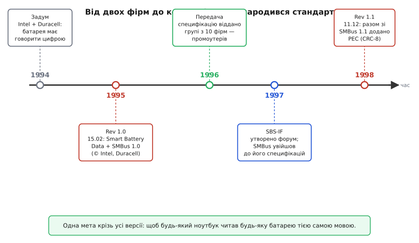

# 📜 Як народився стандарт розумної батареї

На початку 1990-х ноутбук був сліпий до власної батареї. До двох силових клем причепили акумулятор — а система гадки не мала, що це за пакет, скільки в ньому заряду й коли він осяде без попередження. Індикатор «залишку» був відвертою брехнею: він міряв напругу на клемах і за нею вгадував відсотки. Але напруга літієвої банки під навантаженням просідає, а без навантаження підскакує; та сама «половина шкали» могла означати і годину роботи, і три хвилини. Користувач бачив «50 %» — і за мить екран гас.

Причина проста: **знання про батарею жило не там, де його потребували**. Точний стан пакета — реальну ємність, кількість циклів, температуру кожної банки — може знати лише те, що сидить *усередині* корпусу й безперервно за цим стежить. А рішення на основі цього знання ухвалює ноутбук зовні. Між ними — тільки два товстих дроти для струму й жодного каналу для слова. От би батарея могла *сказати* хосту: «у мені лишилось 2140 мА·год, я на 41 %, не жени в мене більше пів ампера — я холодна».

Щоб таке «сказати» стало можливим, треба було домовитися про три речі: **які дроти**, **яка мова** і — найважче — **хто цю мову затвердить так, щоб їй повірили всі**. Саме третє й перетворило гарну технічну ідею на живий промисловий стандарт.

## Дивна пара: чипмейкер і виробник батарейок

Ідея розумної батареї носилася в повітрі — надто вже боляче було всім. Але щоб вона злетіла, за неї мусили взятися двоє, хто поодинці її не витягнув би, і хто на перший погляд не мав би сидіти за одним столом.

**Intel** будувала чипсети для мобільних платформ і бачила проблему з боку системи: батарею треба причепити до материнки, знімати з неї покази й керувати зарядом — але без зайвих ніжок і товстих джгутів. Розкоші виділити батареї десяток контактів не було; хотілося тонкого цифрового каналу поверх мінімуму дротів. У Intel уже лежав під рукою підхожий інструмент — послідовна шина I²C (створена Philips), де на двох лініях висить купа пристроїв.

**Duracell** дивилася з протилежного боку — з боку самої хімії. Виробник елементів живлення знав, *що саме* треба вимірювати й повідомляти, щоб літієвий пакет був безпечним і чесним: як рахувати заряд інтегруванням струму, як стежити за напругою поелементно, які тривоги критичні. Але шину й системну частину Duracell не робила.

Тобто одна фірма знала «як передати», друга — «що передавати». Поодинці — половинки; разом — увесь стандарт. У 1994 році вони почали працювати спільно, і з цього союзу вийшли одразу два документи-близнюки, опубліковані **15 лютого 1995 року**:

- **Smart Battery Data Specification, Rev 1.0** — *словник*: перелік команд, регістрів і одиниць, якими розумна батарея відповідає («команда 0x09 — напруга в мілівольтах», «0x0d — заряд у відсотках»).
- **System Management Bus (SMBus) Specification 1.0** — *дроти й правила розмови*: як електрично й у часі влаштована сама шина.

Обидва несли той самий копірайт — Intel і Duracell. І тут варто розділити те, що часто злипається в переказах.

> 🔧 **Навіщо це.** Ця пара документів досі визначає, що ви бачите в даташиті будь-якої SMBus-батареї: одиниці регістрів і адреси йдуть від Smart Battery Data, а таймаути й рівні шини — від SMBus. Знаючи, що це два різних стандарти від того самого союзу, ви не дивуєтеся, чому «протокол SMBus» і «команди батареї» описані в різних місцях.

## Ідея, специфікація і форум — це різні речі

Плутанина в історіях техніки майже завжди зводиться до одного: змішують *ідею*, *специфікацію* і *орган, що специфікацію веде*. Тут ці три шари видно як на долоні.

**Ідея** — «нехай батарея сама розповідає про себе цифрою» — не належить нікому конкретному; вона визріла в галузі, бо всім боліло однакове. Приписати її одній людині чи одній фірмі було б легендою.

**Специфікація** — конкретний документ із конкретною датою, номером ревізії й копірайтом. Ось тут ім'я й число доречні: Rev 1.0, 15 лютого 1995, Intel і Duracell. Це вже не «хтось придумав», а «ось текст, за яким можна будувати сумісні пристрої».

**Орган** — консорціум, що документ *підтримує й розвиває* далі. І це окрема, третя подія в часі, яку легко проґавити.

Бо перша версія стандарту мала вроджену слабкість: **його тримали дві компанії**. Для решти галузі це звучало як «грайте за правилами Intel і Duracell» — а конкуренти не люблять залежати від стандарту, яким володіє суперник. Стандарт, що належить двом, — це ще не *галузевий* стандарт; це технічно гарна, але політично крихка річ.

## Передача: від двох власників до десяти промоутерів

Розв'язок був той самий, до якого доходять усі вдалі відкриті стандарти: **власники мусять випустити кермо з рук**. У **1996 році** Intel і Duracell передали специфікації Smart Battery System групі з **десяти компаній-промоутерів**, які й утворили ядро стандарту. Це були (двомовно, за копірайтом пізнішої редакції):

- **Benchmarq Microelectronics** (США, Техас) — розробник тих самих мікросхем-«паливомірів»;
- **Duracell** (США) — співавтор із першого дня;
- **Energizer Power Systems** (США) — інший великий виробник елементів;
- **Intel** (США) — співавтор і власник шинної частини;
- **Linear Technology** (США) — аналогова схемотехніка живлення;
- **Maxim Integrated Products** (США) — мікросхеми керування живленням;
- **Mitsubishi Electric** (Японія, яп. 三菱電機) — електроніка й напівпровідники;
- **National Semiconductor** (США) — напівпровідники;
- **Toshiba Battery** (Японія, яп. 東芝) — виробник акумуляторів;
- **Varta Batterie AG** (Німеччина) — європейський виробник елементів.

Склад промовистий: тут і виробники *хімії* (Duracell, Energizer, Toshiba, Varta), і виробники *кремнію* (Benchmarq, Linear, Maxim, National, Mitsubishi, Intel). Знову той самий баланс, що в дивній парі-засновниці, лише вшир: щоб стандарт жив, за ним мусили стояти й ті, хто робить банки, й ті, хто робить мікросхеми до них. Географія теж не випадкова — США, Японія, Німеччина: три центри тодішньої силової й напівпровідникової електроніки.

А **наступного, 1997 року** з цієї групи виріс постійний орган — **SBS Implementers Forum** (Форум упроваджувачів Smart Battery System, SBS-IF). Тоді ж під його дах перейшла й шина: SMBus став частиною специфікацій, що їх веде форум. Ось чому дати «передали в 1996» і «форум у 1997» — це дві різні події, і в акуратній розповіді їх не варто зливати в одну: спершу власники розкрили стандарт для ширшого кола, а вже потім це коло оформилося в постійну структуру з процедурами, членством і правом випускати нові редакції.

Саме ця передача й зробила стандарт справжнім. Відтоді «розумна батарея» перестала бути технологією двох фірм і стала *галузевою мовою*: будь-який ноутбук читає будь-яку батарею тими самими командами — не тому, що всі копіюють Intel, а тому, що всі домовились у спільному форумі.

*П'ять кроків від ідеї до галузевого стандарту. Червоним — випуски специфікації, зеленим — передача власності, синім — поява постійного форуму.*

## 1998-й: коли до слова додали печатку

Перша версія дала батареї голос — але не дала *гарантії, що її почули правильно*. А ставка на цій шині незвична для «просто датчика»: батарея не лише повідомляє покази, вона ще й **диктує заряднику режим заряду** — якою напругою й струмом лити струм у літієвий пакет. Якщо на дроті, що тягнеться повз силові кабелі, один біт у слові «дозволена напруга» тихо перекинеться — і 4200 мВ обернеться на щось більше — це вже не косметична похибка, а шлях до роздутої банки. Каналу, що передає команди небезпечному силовому вузлу, конче потрібен спосіб *ловити спотворені байти*.

Тому **11 грудня 1998 року** вийшла **Smart Battery Data Specification, Rev 1.1** — уже за підписом усіх десяти промоутерів — а разом із нею оновлена **SMBus 1.1**, яка й принесла ключове доповнення: **PEC** (Packet Error Check — перевірка помилок пакета). Механізм — додатковий байт наприкінці транзакції: контрольна сума CRC-8, порахована по всіх байтах пакета. Приймач рахує ту саму суму й звіряє; один перекинутий біт гарантовано «не збігається», і зіпсований пакет відкидають замість того, щоб виконати помилкову команду.

Показово, що PEC оселився саме в *шинній* специфікації (SMBus 1.1), а не в словнику команд. Це логічно за тим самим поділом «дроти окремо, мова окремо»: цілісність передачі — властивість каналу, байдужа до того, яке саме число ним їде. Батарея лишилася зі своїм словником, а надійність доставки додали шару нижче — там, де їй і місце.

Друга редакція виправила не голос, а *довіру* до нього. Після 1998-го розумна батарея не просто говорить — вона говорить так, що співрозмовник може перевірити кожне слово на цілість. Для системи, що керує енергією в літії, це різниця між «іноді роздута банка з незрозумілої причини» і «надійно».

## Нитка, що тягнеться дотепер

Історія стандарту не закінчилася в архіві — вона досі лежить у вас на столі, у літерах на мікросхемі.

Згадана серед десятьох **Benchmarq Microelectronics** робила мікросхеми-«паливоміри» (англ. *gas gauge* — «покажчик пального») з характерним префіксом **bq** у назві, як-от bq2040. У 1998 році Benchmarq купила **Unitrode**, а Unitrode у жовтні 1999-го влилася в **Texas Instruments**. Та сама технологія й той самий префікс дожили до сьогодні: сучасні лічильники заряду TI — bq27441, bq27426 і подібні — прямі нащадки тих чипів однієї з фірм-промоутерів, що в 1996-му підхопили стандарт із рук Intel і Duracell. Коли ви бачите на пакеті мікросхему з «bq», ви тримаєте пряме продовження тієї історії.

І головне лишилося незмінним крізь усі редакції та зміни власників. Мета, задля якої дивна пара сіла за один стіл у 1994-му, справдилася буквально: **будь-який ноутбук читає будь-яку батарею тією самою мовою**. Не тому, що хтось один нав'язав формат, а тому, що галузь спершу випустила гарну ідею з-під замка двох компаній, а тоді разом домовилася про спільний словник — і навчила літієвий пакет чесно казати, скільки в ньому лишилось.
