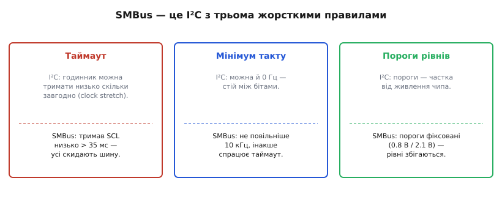
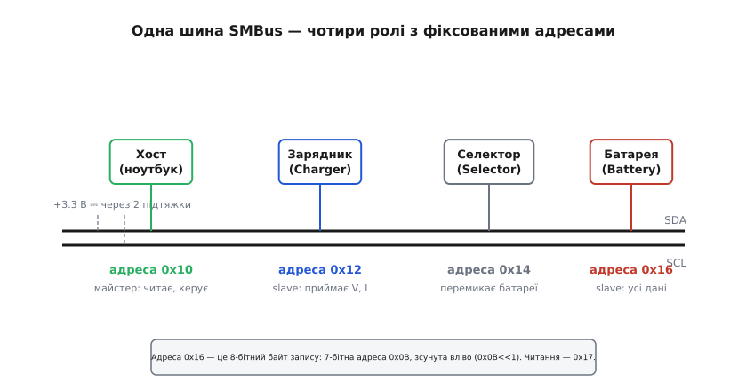
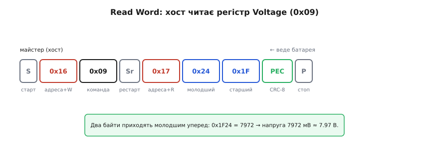

# Smart Battery і SMBus: протокол і команди

Вставте в ноутбук стару батарею — і на екрані одразу з'явиться «залишилось 47 %, приблизно 1 год 12 хв». Звідки система це знає? Вона не міряла батарею сама. Вона **запитала** її — надіслала по двох дротах коротке цифрове питання «скільки в тобі заряду?» і отримала число у відповідь. Батарея тут не пасивна банка з хімією: усередині її корпусу сидить мікроконтролер, який рахує заряд, стежить за температурою й напругою кожної банки, а назовні виставляє **стандартний цифровий інтерфейс**, яким його може опитати будь-який ноутбук будь-якого виробника.

Цей інтерфейс і є **Smart Battery** — «розумна батарея», що спілкується по шині **SMBus** (System Management Bus — шина керування системою). Розберімо, як саме влаштована ця розмова: якими дротами, за яким протоколом, якими командами — і чому наївний драйвер `i2c` тут спотикається.

## Навіщо батареї говорити

Почнімо з проблеми, яку це розв'язує. Літій-іонна банка — істота підступна: перезаряд її роздуває, глибокий розряд убиває, а точну ємність вона з роками тихо втрачає. Щоб нею безпечно й точно керувати, треба **знати її стан зсередини**: скільки заряду реально лишилось (не «скільки вольт на клемах» — це бреше під навантаженням), скільки разів її циклили, за якою хімією й на яку напругу її можна заряджати.

Хто мав би це знати? Не ноутбук — він бачить лише дві силові клеми й не має жодного уявлення, що за пакет до них під'єднали. А от сама батарея «знає» себе досконало: усередині корпусу живе крихітний обчислювач, який безперервно інтегрує струм, міряє напругу поелементно й веде облік. Логічно, щоб **саме батарея й повідомляла** свій стан назовні. Лишається домовитись про мову.

От тут і народжується стандарт. Якби кожен виробник батарей вигадував свій формат, жоден ноутбук не читав би чужий пакет. Тому в 1995 році [консорціум навколо Intel і Duracell](book:electronics/smbus-smart-battery/hist-sbs-origins.md) випустив специфікацію **Smart Battery Data** — єдиний словник команд і одиниць, яким будь-яка розумна батарея відповідає будь-якому хосту однаково. Ноутбук не мусить нічого знати про конкретну модель: він шле стандартне питання «команда 0x0d — скільки відсотків?» і будь-яка SBS-батарея відповідає числом у відсотках.

> 🔧 **Навіщо це.** Коли ви проєктуєте пристрій на змінному акумуляторі — квадрокоптер, медичний прилад, промисловий сканер — SMBus-батарея дає вам готовий «паливомір» безкоштовно: не треба ставити зовнішній лічильник заряду й калібрувати його під конкретну хімію. Ваша прошивка просто читає готові числа. А ще стандарт означає, що користувач зможе купити сумісний запасний пакет у стороннього постачальника, і ваш прилад його впізнає.

## Дроти: SMBus — це майже I²C

Фізично розмова йде по двох сигнальних лініях плюс спільна земля. Лінії ті самі, що в добре відомій шині [I²C](book:communications/i2c-bus): **SDA** (дані) і **SCL** (такт), обидві з відкритим стоком і зовнішніми підтяжками до живлення. Обидві лінії у спокої підтягнуті вгору; будь-який учасник може «просадити» їх до нуля, і саме чергування нулів та одиниць кодує біти. Одна пара дротів — багато пристроїв на ній, кожен зі своєю **адресою**.

SMBus і виріс з I²C — це його строгіший нащадок. Але цих «строгіших» правил рівно стільки, щоб наївний I²C-драйвер на них спіткнувся. Три відмінності варто закарбувати.


*SMBus додає до I²C три жорсткі обмеження в часі й рівнях; на кожному з них наївний драйвер може «зависнути» або читати сміття.*

**Перше — таймаут.** У чистому I²C підлеглий може «притримати» лінію такту низько скільки завгодно (це зветься *clock stretching* — розтягування такту), щоб виграти час на обчислення. SMBus такого не пробачає: якщо SCL пролежав унизу довше за **35 мс**, усі пристрої на шині вважають, що хтось завис, і **скидають** свою логіку, звільняючи шину. Це рятує систему живлення від намертво заблокованої шини — але означає, що ваш підлеглий мусить укладатися в цей строк.

**Друге — мінімальна частота.** Звідси ж випливає: SMBus не працює повільніше за **10 кГц**. Не тому, що не вміє, а тому, що надто повільний такт сам би спрацював як «застрягла лінія» й викликав таймаут. Стеля — 100 кГц (пізніші версії додали швидші режими). Тобто «покрокове» ручне смикання ніжок GPIO раз на секунду, яким іноді бавляться з I²C, тут просто заборонене.

**Третє — пороги рівнів.** I²C визначає «нуль» і «одиницю» як частку від напруги живлення чипа — а вона в різних чипів різна. SMBus задає **фіксовані** пороги (близько 0.8 В для нуля й 2.1 В для одиниці незалежно від живлення). Тому батарея на 3.3 В і хост на 3.3 В гарантовано «розуміють» рівні одне одного — сумісність не залежить від того, хто чим живиться.

Практичний висновок: майже завжди ви говоритимете зі Smart Battery через звичайну I²C-периферію мікроконтролера — електрично вони сумісні. Але **таймаути й швидкість** тримайте в межах SMBus, інакше отримаєте загадкові «зависання» раз на тисячу транзакцій.

## Хто на шині: чотири ролі, фіксовані адреси

SBS-стандарт не просто чіпляє батарею на шину — він розписує **ролі** й закріплює за кожною **фіксовану 7-бітну адресу**. Це не випадкові числа: будь-яка розумна батарея у світі відповідає на ту саму адресу, тож хост знає, кого гукати, ще до знайомства.


*Чотири стандартні ролі SBS на одній шині. Хост — майстер, що опитує; батарея й зарядник — підлеглі. Селектор потрібен лише там, де батарей кілька.*

- **Хост (0x10)** — розумна частина системи (ноутбук, контролер приладу). Це **майстер**: він ініціює всі опитування.
- **Зарядник, Charger (0x12)** — вузол, що фізично жене струм у банки. Він підлеглий і чекає команд «якою напругою й струмом заряджати».
- **Селектор, Selector (0x14)** — перемикач, коли батарей у системі дві й треба обрати активну. У простих пристроях його немає.
- **Батарея, Battery (0x16)** — сам «мозок» пакета. Підлеглий, що на запит видає будь-яке число про себе.

Тут ховається класична пастка, на якій спотикається кожен новачок. У специфікації адресу батареї часто пишуть як **0x16** — а в даташиті вашого I²C-контролера параметр зветься «7-бітна адреса», і туди треба покласти **0x0B**. Це те саме число. SMBus, як і I²C, у першому байті транзакції передає 7 біт адреси плюс один біт напрямку (0 — запис, 1 — читання). Тобто:

```
7-бітна адреса батареї = 0x0B  = 0b0001011
байт запису (адреса<<1 | 0)     = 0x16  = 0b00010110
байт читання (адреса<<1 | 1)    = 0x17  = 0b00010111
```

Переплутаєте — і замість батареї гукнете когось за адресою 0x16 (а це вже інший пристрій або нікого), і транзакція мовчки провалиться. **Пишете 0x16 у поле «8-бітна адреса запису» — але 0x0B у поле «7-бітна адреса».** Половина «батарея не відповідає» на форумах — саме про це.

## Один регістр — одне число: Read Word

Тепер найголовніше: як хост дістає з батареї конкретне число. Батарея зсередини — це набір **регістрів**, кожен зі своїм **кодом команди** (одним байтом) і сталим змістом. Код 0x09 — це завжди напруга, 0x0d — завжди відсоток заряду, 0x08 — завжди температура. Хост не «читає пам'ять», а називає код команди й отримує пов'язане з ним число.

Майже все читається операцією **Read Word** («прочитати слово») — вона повертає рівно **два байти**, тобто 16-бітне число. Розберімо одну транзакцію по кроках.


*Читання одного регістра: хост спершу «пише» код команди, тоді рестартом розвертає напрямок і «читає» два байти відповіді. Молодший байт іде першим.*

Хост робить це так. Спершу він **пише**: старт-умова, байт `0x16` (адреса батареї + запис), потім байт `0x09` — код команди «Voltage». Батарея зрозуміла, *яке* число просять. Тоді хост, не відпускаючи шину, робить **повторний старт** (Sr) і **читає**: байт `0x17` (адреса + читання), і батарея у відповідь виставляє два байти. Стоп.

Один нюанс, який ловить усіх: два байти приходять **молодшим уперед** (little-endian — «тупокінцевий» порядок). Спершу молодша половина числа, тоді старша. Тобто пари байтів `0x24, 0x1F` треба зібрати як `0x1F24`, а не `0x241F`.

**Умова:** хост прочитав регістр 0x09 (Voltage) і отримав по шині два байти: спершу 0x24, потім 0x1F. Що це за напруга?

:::tabs
```cpp
// SMBus Read Word: код 0x09 → два байти LSB-перший
uint8_t  cmd = 0x09;            // Voltage()
uint8_t  raw[2];               // [0]=молодший, [1]=старший
smbus_read_word(BATT_ADDR7, cmd, raw);   // BATT_ADDR7 == 0x0B

uint16_t mv = (uint16_t)raw[0] | ((uint16_t)raw[1] << 8);
// raw = {0x24, 0x1F} → mv = 0x24 | (0x1F << 8) = 0x1F24 = 7972

float volts = mv / 1000.0f;    // одиниця регістра — мілівольти
// volts ≈ 7.97 В  → двобанковий Li-ion пакет
```
```python
from smbus2 import SMBus

# SMBus Read Word: код 0x09 → два байти LSB-перший
BATT_ADDR7 = 0x0B
cmd = 0x09                      # Voltage()

with SMBus(1) as bus:
    mv = bus.read_word_data(BATT_ADDR7, cmd)  # smbus2 сам збирає LSB-перший
# для сирого запиту {0x24, 0x1F} → mv = 0x1F24 = 7972

volts = mv / 1000.0             # одиниця регістра — мілівольти
# volts ≈ 7.97 В  → двобанковий Li-ion пакет
```
```go
// SMBus Read Word: код 0x09 → два байти LSB-перший
const battAddr7 = 0x0B
const cmd = 0x09 // Voltage()

raw, err := dev.ReadWordData(cmd) // raw[0]=молодший, raw[1]=старший
if err != nil {
    log.Fatal(err)
}

mv := uint16(raw[0]) | uint16(raw[1])<<8
// raw = {0x24, 0x1F} → mv = 0x24 | (0x1F << 8) = 0x1F24 = 7972

volts := float64(mv) / 1000.0 // одиниця регістра — мілівольти
// volts ≈ 7.97 В  → двобанковий Li-ion пакет
```
:::

Ключове тут — **одиниця**. Стандарт жорстко фіксує, у чому виражений кожен регістр, і драйвер мусить це знати наперед, бо в самих байтах одиниці немає. Напруга — у **мілівольтах**. Струм — у **мілі-амперах** (і це **число зі знаком**: додатне — заряджання, від'ємне — розряджання). Температура — у **десятих частках кельвіна** (щоб перейти в градуси Цельсія: поділити на 10 і відняти 273.15). Ємність — у **мА·год**. Відсоток заряду — просто ціле від 0 до 100.

## Словник команд: що можна спитати

Регістрів у стандарті кілька десятків, але щоб зчитувати стан батареї, вистачає жменьки. Ось найуживаніші коди й що вони означають:

```
0x08  Temperature          температура,   0.1 K
0x09  Voltage              напруга пакета, мВ
0x0a  Current              миттєвий струм, мА (знаковий)
0x0b  AverageCurrent       усереднений струм, мА
0x0d  RelativeStateOfCharge  заряд, %  (відносно поточної повної ємності)
0x0e  AbsoluteStateOfCharge  заряд, %  (відносно проєктної ємності)
0x0f  RemainingCapacity    що лишилось, мА·год
0x10  FullChargeCapacity   реальна повна ємність зараз, мА·год
0x11  RunTimeToEmpty       скільки хвилин до нуля за поточним струмом
0x14  ChargingCurrent      бажаний струм заряду, мА
0x15  ChargingVoltage      бажана напруга заряду, мВ
0x16  BatteryStatus        бітове поле: тривоги й режими
0x17  CycleCount           скільки повних циклів пережито
0x18  DesignCapacity       проєктна ємність, мА·год
0x20  ManufacturerName     назва виробника (рядок)
0x21  DeviceName           назва моделі (рядок)
0x22  DeviceChemistry      хімія, напр. "LION" (рядок)
```

Два з цих регістрів заслуговують окремої уваги, бо саме вони роблять батарею «розумною», а не просто балакучою.

**RelativeStateOfCharge (0x0d)** — це і є той «залишок у відсотках», який ви бачите на екрані. Тонкість у слові «Relative» (відносний): відсоток рахується не від колишньої заводської ємності, а від **теперішньої повної ємності** батареї, яку прошивка постійно переоцінює. Тому старий пошарпаний пакет чесно доходить до «100 %» — просто ці 100 % тепер менші в мА·год. Як мікроконтролер усередині рахує ці відсотки, безперервно інтегруючи струм, — це окрема історія, [кулонівський підрахунок](book:electronics/state-of-charge).

**BatteryStatus (0x16)** — не число, а **бітове поле тривог і режимів**. Окремі біти означають «перегрів», «перезаряд», «розряджено вщент», «повністю заряджено». Прошивка хоста читає це слово й перевіряє біти маскою:

:::tabs
```cpp
uint16_t st = smbus_read_word_u16(BATT_ADDR7, 0x16);  // BatteryStatus()

#define OVER_TEMP_ALARM   (1u << 12)
#define TERMINATE_CHARGE  (1u << 14)   // «годі заряджати»
#define OVER_CHARGED      (1u << 15)

if (st & OVER_TEMP_ALARM)  stop_everything();   // перегрів — вимикаємо
if (st & TERMINATE_CHARGE) charger_off();       // батарея каже: досить
```
```python
st = bus.read_word_data(BATT_ADDR7, 0x16)  # BatteryStatus()

OVER_TEMP_ALARM  = 1 << 12
TERMINATE_CHARGE = 1 << 14   # «годі заряджати»
OVER_CHARGED     = 1 << 15

if st & OVER_TEMP_ALARM:   stop_everything()   # перегрів — вимикаємо
if st & TERMINATE_CHARGE:  charger_off()       # батарея каже: досить
```
```go
raw, err := dev.ReadWordData(0x16) // BatteryStatus()
if err != nil {
    log.Fatal(err)
}
st := uint16(raw[0]) | uint16(raw[1])<<8

const (
    overTempAlarm   = 1 << 12
    terminateCharge = 1 << 14 // «годі заряджати»
    overCharged     = 1 << 15
)

if st&overTempAlarm != 0 {
    stopEverything() // перегрів — вимикаємо
}
if st&terminateCharge != 0 {
    chargerOff() // батарея каже: досить
}
```
:::

Ось де видно різницю між «розумною» батареєю й звичайною банкою: батарея не чекає, поки хост здогадається про біду, — вона **сама виставляє прапорець тривоги**, і відповідальний хост зобов'язаний його прочитати й зреагувати.

Рядкові регістри (назва виробника, модель, хімія) читаються трохи інакше — не Read Word, а **Read Block** («прочитати блок»): батарея спершу віддає один байт довжини, а тоді стільки байтів тексту. Так хост дізнається `"LION"` чи `"NiMH"`, не знаючи наперед, скільки там літер.

## Батарея командує зарядником

Найелегантніша частина стандарту — те, як батарея керує власним заряджанням. Здавалося б, напругу й струм заряду мав би призначати зарядник. Але хто краще за саму батарею знає, чого їй зараз треба? Холодній банці не можна лити повний струм; майже повній — треба знизити напругу; здутій — узагалі припинити. Усі ці рішення ухвалює мікроконтролер **усередині** батареї, бо тільки він бачить температуру й напругу кожної банки.

Тому Smart Battery **сама диктує режим заряду**. У регістрах 0x14 (ChargingCurrent) і 0x15 (ChargingVoltage) вона тримає числа «яким струмом і до якої напруги мене зараз заряджати». Ці числа не сталі — батарея їх **безперервно переписує** залежно від свого стану: нагрілась — знизила дозволений струм; підійшла до повного — зменшила напругу, переходячи в режим доливання; сталося лихо — виставила нулі, тобто «стоп».

Далі ці значення мусять дійти до зарядника. У повній SBS-системі це роблять двома шляхами, і різниця тонка, але важлива. У «розумному» варіанті батарея сама стає **майстром** на короткий час і **надсилає** свіжі ChargingVoltage/ChargingCurrent прямо заряднику за адресою 0x12 — не чекаючи, поки її спитають. У простішому, поширенішому варіанті **хост** періодично опитує батарею (читає 0x14/0x15) і сам передає ці уставки заряднику. Хай там як, керує процесом батарея — зарядник лише виконує; він тупий силовий вузол, що жене рівно те, що йому назвали. Практична порада для вашої прошивки: **опитуйте 0x14/0x15 кілька разів на секунду й одразу застосовуйте** — саме так батарея штовхає зарядний струм донизу, коли гріється.

Тонкощі цього обміну — коли батарея стає майстром, як зарядник трактує нулі як «стоп», що робити, якщо батарея замовкла посеред заряду, — розписані в [детальній версії](book:electronics/smbus-smart-battery/detail).

## PEC: щоб число не збрехало

Лишилось одне питання, і воно про довіру. Батарея й хост керують потоками енергії в літієвому пакеті. Якщо через наведену заваду один біт у слові «дозволена напруга заряду» перекинеться — і 4200 мВ раптом стане 4712 мВ — це вже не косметична похибка, а шлях до роздутої банки. Дешева цифрова шина, що передає команди небезпечному силовому вузлу, зобов'язана вміти **ловити спотворені байти**.

Саме для цього версія SMBus 1.1 (1998) додала **PEC** (Packet Error Check — перевірка помилок пакета). Механізм простий: наприкінці транзакції додається ще один байт — **контрольна сума CRC-8**, порахована по **всіх** байтах пакета (включно з адресами й бітами напрямку). Приймач рахує ту саму суму самостійно й звіряє. Збіглося — байти дійшли цілими; ні — транзакцію відкидають і повторюють. Один зіпсований біт гарантовано «не збіжиться».

CRC-8 тут — не магія, а звичайний [циклічний надлишковий код](book:communications/crc): біти проганяють через поліном `x⁸ + x² + x + 1`, і 8-бітний «залишок» від цього ділення й є контрольною сумою. Приймач ділить те саме — і якщо хоч один біт по дорозі перекинувся, залишок виходить інший.

Той самий байт даних `0x1F24` з нашого прикладу, підкріплений PEC, дійде або точно таким, або взагалі не дійде — третього не буде. Важливе застереження: PEC **необов'язковий**. Прості пристрої його не рахують. Але **в батарейних системах його вмикають майже завжди** — ціна помилки надто висока. Якщо ваш пристрій читає уставки заряду, читайте їх **з PEC** і відкидайте пакети, що не пройшли перевірку.

> 🔧 **Навіщо це.** Уявіть безпілотник із SMBus-акумулятором: шлейф до батареї тягнеться повз силові дроти двигунів, де наводок — море. Без PEC випадковий збій у слові струму заряду міг би тихо перевести зарядник у небезпечний режим. З PEC такий пакет просто відкидається й повторюється. Це різниця між «іноді роздута банка з незрозумілої причини» і «надійно».

## Що це дає в підсумку

Складімо картину. **Smart Battery** — це літієвий пакет із власним мікроконтролером, що виставляє себе назовні як набір стандартних регістрів по шині **SMBus** (строгий, з таймаутами й фіксованими рівнями, нащадок I²C). Хост-майстер за фіксованою адресою `0x0B` читає операцією Read Word будь-яке число про батарею — напругу в мВ, струм у мА зі знаком, залишок у відсотках, тривоги в бітовому полі BatteryStatus. Батарея сама диктує заряднику режим заряду через регістри 0x14/0x15 і сама піднімає прапорці біди. А байт **PEC** (CRC-8) стежить, щоб жодна команда не дійшла спотвореною.

Тому ноутбук і показує «47 %, 1 год 12 хв», нічого не знаючи про конкретну модель батареї всередині. Він просто спитав стандартною мовою — і батарея, яка знає себе досконало, чесно відповіла.

Ця розмова — не лише зручність, а й **поверхня для зловживань**: якщо мікроконтролер батареї приймає команди, його прошивку можна й перепрограмувати. У 2011 році дослідник [Чарлі Міллер показав](book:electronics/smbus-smart-battery/hist-battery-hacking.md), що вбудований контролер ноутбучної батареї можна зламати прямо по SMBus — аж до підробки показів і, в теорії, небезпечних режимів. Розумна батарея розумна в обидва боки.
