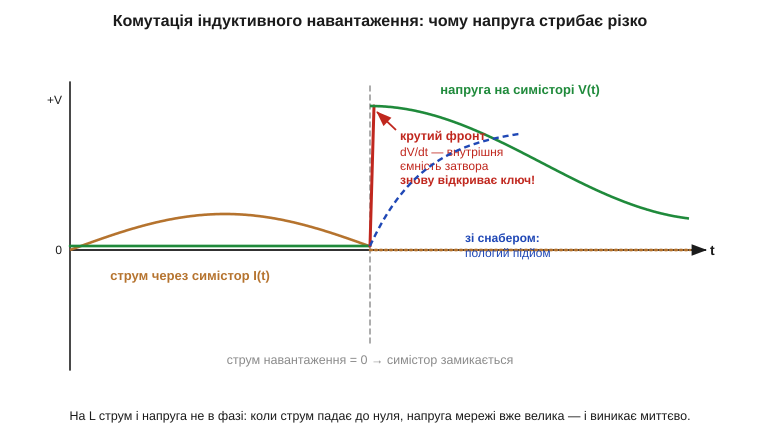
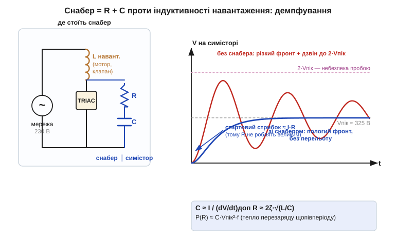

# 🧮 Оцінка RC-снабера: від струму навантаження до номіналів

> На індуктивному навантаженні симістор самовмикається від крутого фронту повторно прикладеної напруги; рятує його **RC-снабер**. Тут — як перетворити цей механізм на **числа** й вибрати конкретні R та C, маючи лише струм навантаження й паспортне обмеження dV/dt. Це не вивід заради краси, а коротка процедура «на серветці», яку проганяють перед тим, як паяти.

### Що ми рахуємо і чому це не снабер для DC-контактів

Снабер для DC-контактів влаштований інакше: там конденсатор гасить іскру [розриву індуктивного струму](book:electronics/inductor-kickback), а резистор обмежує розряд при замиканні. У мережі змінного струму задача інша. Симістор (*TRIAC*) сам вимикається щопівперіоду — у мить, коли струм падає нижче утримуючого. Але на **індуктивному** навантаженні струм і напруга не в фазі: коли струм через нуль, напруга мережі вже велика. Щойно ключ замкнувся, ця напруга **миттєво** опиняється на ньому — і круте dV/dt крізь внутрішню ємність структури знову відмикає симістор. Снабер тут — не проти іскри, а проти **самовмикання**: його робота — зрізати швидкість наростання повторно прикладеної (*reapplied*) напруги нижче за паспортну межу.


*Струм навантаження (мідний) відстає від напруги. У мить його переходу через нуль симістор замикається — і напруга мережі (зелена) виникає на ключі стрибком: критичне dV/dt. Снабер бере цей фронт на себе й робить його пологим (синій пунктир), не давши внутрішній ємності знову відкрити ключ.*

### Інтуїція: конденсатор продає час, котушка хоче дзвеніти

Щоб цей фронт зрізати, потрібен елемент, який не дає напрузі рости миттєво, — і таким елементом є конденсатор. Серце оцінки — рівність I = C·dV/dt, що випливає прямо з означення [ємності](book:electronics/capacitance). Конденсатор не дає напрузі рости швидше, ніж дозволяє струм, який його заряджає: dV/dt = I/C. Хочемо повільніший фронт — ставимо більший C. Це й дає першу формулу.

Та лишити сам конденсатор не можна. Разом з індуктивністю навантаження він утворює [LC-контур](book:electronics/lc-resonance), а стрибок напруги — це по суті ступінчастий вплив на нього. Недемпфований LC на сходинку відповідає **дзвоном із перельотом удвічі**: напруга на ключі злітає не до Vпік, а майже до 2·Vпік — те саме [«брикання» індуктивності](book:electronics/inductor-kickback). Резистор гасить цей дзвін — він вводить втрати, перетворюючи коливальний контур на аперіодичний. Виходить той самий компроміс, що й на DC: C виграє час на фронті, R платить за спокій теплом.


*Снабер стоїть паралельно симістору. Без нього (червона) напруга має крутий фронт і дзвенить до 2·Vпік — небезпека пробою. Зі снабером (синя) фронт пологий, перельоту немає. Але сам резистор дає стартовий стрибок ≈ I·R — тому R не роблять завеликим. Внизу — три формули оцінки.*

### Апарат: три формули

Ці два міркування — C проти крутизни фронту, R проти дзвону — і формалізуються трьома рядками: один на ємність, один на опір, один на його потужність.

**1. Конденсатор — за дозволеним dV/dt.** Беремо паспортну критичну швидкість (*critical dV/dt*) симістора — типово десятки В/мкс — і ділимо на неї струм, що тече в снабер у мить комутації (це амплітудне значення струму навантаження):

```
C ≈ I / (dV/dt)доп
```

**2. Резистор — за демпфуванням контуру.** Щоб приборкати дзвін LC, цілимось у коефіцієнт демпфування (*damping ratio*) ζ ≈ 0.5…1. З теорії RLC опір зв'язаний із характеристичним імпедансом √(L/C):

```
R ≈ 2·ζ·√(L/C)
```

R обмежений зверху ще й тим, що в першу мить весь струм тече крізь нього й дає на ключі **стартовий стрибок ≈ I·R**: завеликий R сам зведе нанівець користь від C.

**3. Потужність резистора — за енергією перезаряду.** Щопівперіоду конденсатор перезаряджається до амплітуди мережі, і вся ця енергія ½·C·V² двічі за період гріє R. На частоті мережі f:

```
P(R) ≈ C·Vпік²·f
```

> 🔧 **Навіщо це.** Перш ніж ставити симістор на мотор, насос чи клапан (усе це — індуктивність), проженіть три рядки: C ≈ I/(dV/dt), R ≈ 2ζ·√(L/C), P ≈ C·Vпік²·f. Без снабера такий ключ або не вимикається зовсім, або живе недовго. Якщо L навантаження невідома (а так буває майже завжди) — беруть народну пару **100 нФ + 100 Ом** і перевіряють осцилографом: вона недарма стоїть у безлічі симісторних модулів.

**Приклад (симістор на індуктивному навантаженні, мережа 230 В).** Навантаження тягне 1 А (діюче), амплітуда струму Iₐ = 1·√2 ≈ 1.4 А; амплітуда напруги Vпік = 230·√2 ≈ 325 В. Симістор за даташитом терпить 50 В/мкс. Індуктивність навантаження оцінюємо як L ≈ 0.1 Гн. Беремо ζ ≈ 0.6.

```
dV/dt доп = 50 В/мкс = 50·10⁶ В/с

C ≈ Iₐ / (dV/dt) = 1.4 / (50·10⁶) = 28 нФ      → беремо 33 нФ (плівка, клас X2)

√(L/C) = √(0.1 / 33·10⁻⁹) = √(3.03·10⁶) ≈ 1740 Ом
R ≈ 2·0.6·1740 ≈ 2090 Ом                        → завелико: стрибок I·R = 1.4·2090 ≈ 2900 В (!)
```

Стартовий стрибок виявився більшим за саму амплітуду мережі — отже, теоретичний R для «гарного» ζ тут непридатний. На практиці R обирають **компромісно** — десятки–сотні Ом, жертвуючи частиною демпфування заради прийнятного стрибка:

```
візьмемо R = 100 Ом:   стрибок I·R = 1.4·100 = 140 В   — менше за Vпік, прийнятно
P(R) ≈ C·Vпік²·f = 33·10⁻⁹ · 325² · 50 ≈ 0.17 Вт       → резистор 0.5 Вт із запасом
```

Підсумок: **33 нФ X2 + 100 Ом / 0.5 Вт**. C задає фронт, R обрано не за ідеальним ζ, а за допустимим стартовим стрибком, а півватний резистор спокійно витримує нагрів перезаряду. Це і є та «народна» пара, лише перевірена числами під конкретний струм.

### На що це спирається

Снабер тримається на трьох цеглинках: I = C·dV/dt з означення [ємності](book:electronics/capacitance), [LC-резонанс і дзвін](book:electronics/lc-resonance) (те саме [«брикання» котушки](book:electronics/inductor-kickback)) та реактивний імпеданс √(L/C). Готові симісторні драйвери й твердотільні реле часто вже містять снабер на платі; як його впізнати й коли він потрібен зовні — у компонентних вставках про [симістор із оптодрайвером](book:electronics/triac/comp-triac-driver.md) і [SSR](book:electronics/snubbers-dvdt/comp-ssr.md).
