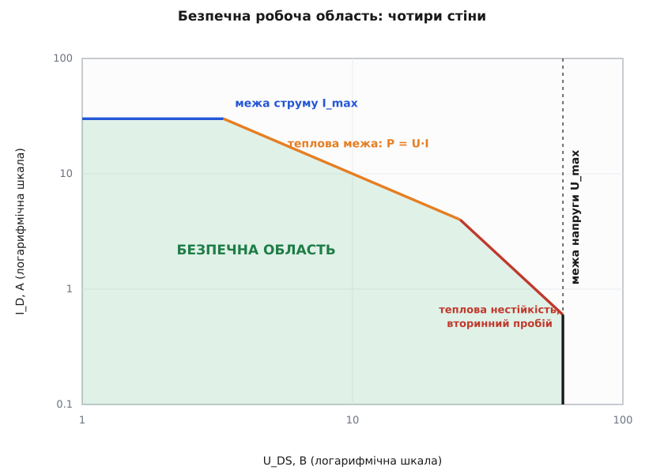
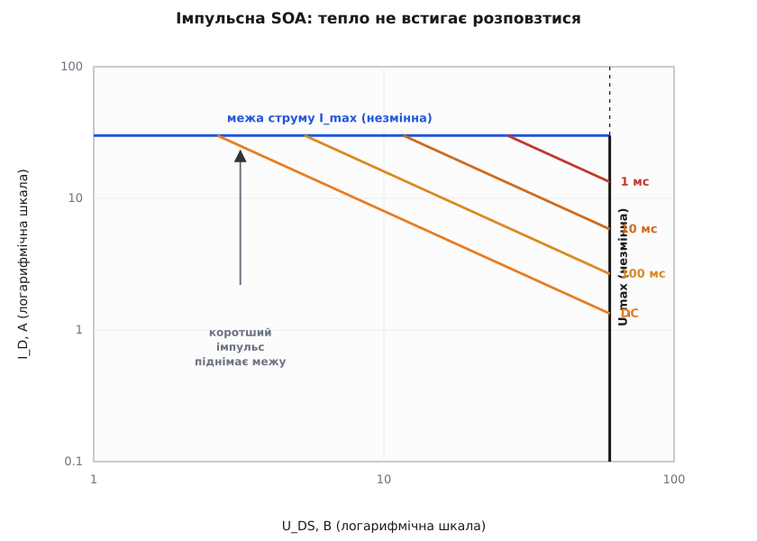
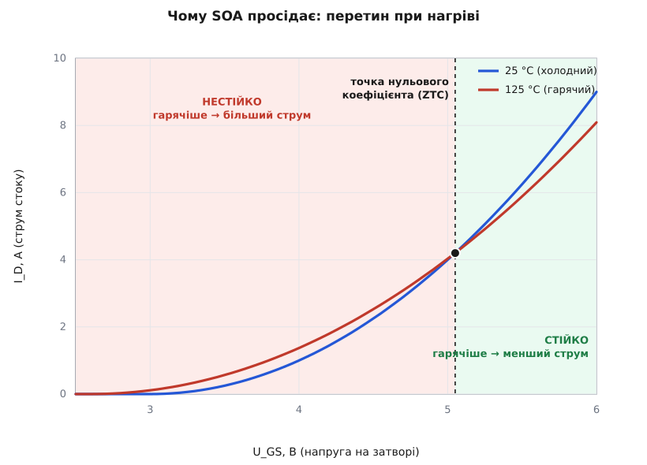

# Безпечна робоча область (SOA)

<preknowlist>
- [Тепловий опір: ланцюжок Rθ і температура переходу](book:physics/thermal-resistance) — як розсіяна потужність підіймає температуру переходу через тепловий опір; це ядро теплової стіни SOA.
- [Силовий ключ на MOSFET](book:electronics/mosfet-power-switch) — стік, витік, затвор; що таке U_DS, I_D і опір відкритого каналу. SOA описує саме такий прилад.
- [Тепловий розгін транзистора](book:electronics/thermal-runaway) — додатний тепловий зворотний зв'язок: гарячіше → більший струм → ще гарячіше.
- [Поріг MOSFET](book:electronics/mosfet-threshold) — порогова напруга затвора й те, що з нагрівом вона падає; звідси й нестійкість у лінійному режимі.
</preknowlist>

Візьміть даташит силового транзистора — на першій сторінці стоять три великі числа: гранична напруга, граничний струм, гранична потужність. Спокуса очевидна: тримайся під кожним із трьох — і все гаразд. Але це не так. Прилад згорить у режимі, де жодне з трьох чисел не перевищене поодинці — просто тому, що вони натиснули **разом**, у поєднанні, якого окремі межі не бачать.

Причина в тому, що безпека транзистора — не три незалежні числа, а **область на площині**. По горизонталі відкладаємо напругу на приладі U_DS, по вертикалі — струм крізь нього I_D; кожна робоча точка (U, I) або лежить усередині дозволеної області, або випадає з неї. Ця область і зветься **безпечною робочою областю** (SOA, англ. *Safe Operating Area*). І вона менша за прямокутник «гранична напруга × граничний струм»: її обрізають одразу кілька різних механізмів руйнування, кожен зі свого боку.

Чому взагалі область, а не прямокутник? Бо різні способи вбити прилад чіпляються за різні комбінації U та I. Завеликий струм рве метал усередині майже незалежно від напруги. Зависока напруга пробиває кристал майже незалежно від струму. А ось **тепло** — то вже добуток: гріє саме потужність P = U·I, і однакову порцію тепла дає і мала напруга при великому струмі, і велика напруга при малому. Тому теплова межа — не горизонталь і не вертикаль, а лінія навскіс. Складіть усі ці межі докупи — і замість прямокутника дістанете область із кількома різними стінами.

## Чотири стіни


*Осі логарифмічні — тому теплова межа сталої потужності P = U·I лягає прямою з нахилом −1. Кожна стіна має свою причину загибелі приладу; безпечна область — це те, що всі вони лишають усередині.*

Осі беруть логарифмічними навмисне: у таких осях межа сталої потужності стає прямою лінією, і всю картину видно з одного погляду. Пройдімося по стінах — чому кожна стоїть саме там.

**Стіна струму (згори, горизонтальна).** Крізь кристал струм заходить тонкими алюмінієвими дротиками-виводами й розтікається металізацією по поверхні. Ці провідники мають скінченний переріз; жени крізь них забагато ампер — і вони перегріються та переплавляться, скільки б не була мала напруга на самому приладі. Це чиста струмова межа I_max: горизонтальна лінія, яка не залежить від того, яка напруга стоїть на стоці.

**Теплова стіна (навскіс, нахил −1).** Це найважливіша й найхитріша межа. Прилад розсіює потужність P = U·I, вона стає теплом, тепло тече крізь тепловий опір [Rθ](book:physics/thermal-resistance) з кристала назовні й підіймає температуру переходу T_j. Є стеля T_j,max (для кремнію типово 150…175 °C) — вище кристал деградує. Тож обмежена не напруга й не струм окремо, а їхній **добуток**: усі точки з однаковим P = U·I гріють однаково й лежать на одній лінії. У логарифмічних осях рівняння U·I = const — це пряма з нахилом −1, і саме її ви бачите навскіс. Ліворуч, при малій напрузі, теплова стіна ховається за стіною струму; починаючи з якоїсь напруги вона стає головним обмежувачем.

**Стіна напруги (справа, вертикальна).** Підійміть напругу стік-витік досить високо — і замкнений p-n-перехід усередині лавинно пробивається *(avalanche breakdown)*: поле розганяє носії так, що вони вибивають нові, струм зростає стрибком. Це межа U_max — вертикаль, яку не зсунути, хоч би струм був крихітний. Докладніше механізм розбирає стаття про [пробій діода](book:electronics/diode-breakdown).

**Загин (крутіша стіна при високій напрузі).** А тепер тонкість, заради якої й існує вся ця стаття. При високій напрузі теплова стіна не просто триває прямою — вона **загинається донизу крутіше**, ніж вимагає проста P = U·I. Тобто при 60 В прилад безпечно тримає значно менше потужності, ніж при 10 В, хоч тепловий опір той самий. Ця «зрізана» ділянка — не про середню температуру кристала, а про те, що тепло збирається в одну точку. Розберемо її нижче окремо, бо саме вона щороку спалює найбільше приладів.

## Теплова стіна: порахуймо

Найкорисніше — вміти самому провести теплову стіну. Вона тримається на одному ланцюжку: потужність → нагрів → температура переходу. У сталому режимі приріст температури над корпусом дорівнює потужності, помноженій на тепловий опір:

```
T_j = T_корпуса + P · Rθ(j-c)
```

Переставимо так, щоб знайти найбільшу дозволену потужність — ту, за якої T_j саме сягає стелі:

```
P_max = (T_j,max − T_корпуса) / Rθ(j-c)
```

Ось як це рахує прошивка силового контролера, що стежить за власним тепловим бюджетом:

```c
// Скільки потужності прилад може розсіювати безперервно,
// не перегрівши кристал. Це і є теплова стіна SOA.
float Tj_max  = 175.0f;   // стеля температури переходу, °C
float Tcase   = 75.0f;    // температура корпуса на радіаторі, °C
float Rth_jc  = 1.0f;     // тепловий опір перехід–корпус, °C/Вт

float P_max = (Tj_max - Tcase) / Rth_jc;   // = (175 - 75) / 1.0 = 100 Вт

// Перевірка конкретної робочої точки:
float U = 50.0f, I = 3.0f;
float P = U * I;                            // = 150 Вт
int safe = (P <= P_max);                    // 150 > 100 → 0: поза SOA!
```

Сто ватів — це вся теплова стеля цього приладу на цьому радіаторі. Робоча точка 50 В × 3 А дає 150 Вт — прилад цього не витягне, хоч ані 50 В, ані 3 А поодинці можуть бути значно нижчі за паспортні граничні. Опустіть струм до 1.5 А — і вже 75 Вт, усередині теплової стіни. Ось чому три окремі числа з даташита оманливі: вирок виносить добуток.

> 🔧 **Навіщо це.** Та сама формула — робочий інструмент вибору радіатора. Задали робочу точку, порахували P = U·I, відняли — і одразу видно, який тепловий опір «до навколишнього повітря» вам потрібен, щоб T_j лишалася під стелею. Якщо Rθ радіатора завеликий — прилад виходить за теплову стіну не в аварії, а в штатному режимі, просто нагрівшись.

## Час має значення: імпульсна SOA

Досі малося на увазі, що потужність тече вічно й температура вже усталилася. Але тепло має **інерцію**: кристал і корпус — це теплова маса, яку ще треба нагріти. Увімкніть потужність — температура переходу підіймається не вмить, а повзе до свого сталого значення за скінченний час. Тому короткий сплеск потужності прилад переживе там, де така сама тривала потужність його б спалила: за мілісекунду тепло просто не встигає ані накопичитись у кристалі, ані розповзтися вглиб.

Це означає, що SOA залежить від **тривалості**. Замість сталого теплового опору Rθ для коротких імпульсів працює менша величина — перехідний тепловий опір Zθ(t), який тим менший, чим коротший імпульс. І теплова стіна відповідно підіймається.


*Стіни струму й напруги від часу не залежать. А теплова стіна — родина паралельних ліній: короткий імпульс дозволяє в рази більшу потужність, бо тепло не встигає нагріти кристал до стелі.*

```c
// Той самий прилад, але потужність подано коротким імпульсом 1 мс.
// Перехідний тепловий опір за 1 мс — приблизно вдесятеро менший за сталий.
float Rth_jc = 1.0f;      // сталий, °C/Вт
float Zth_1ms = 0.1f;     // перехідний за 1 мс, °C/Вт

float P_dc    = (175.0f - 75.0f) / Rth_jc;    // = 100 Вт безперервно
float P_pulse = (175.0f - 75.0f) / Zth_1ms;   // = 1000 Вт за 1 мс
```

Той самий прилад, що безперервно тягне 100 Вт, за міліcекундний імпульс витримає близько 1000 Вт — удесятеро більше, бо за 1 мс кристал прогрівається вдесятеро менше. Саме тому даташити малюють не одну криву SOA, а віяло: окрема лінія для «сталого» (DC), для 100 мс, 10 мс, 1 мс і коротше. Проєктуєте перетворювач, що вмикається в коротке навантаження, — берете лінію під свою тривалість, а не песимістичну DC.

## Чому область загинається донизу

Повернімося до найтоншої стіни — того загину при високій напрузі. Проста теплова межа P = U·I мовчки припускає, що кристал гріється **рівномірно**: уся площа однаково тепла, і важлива лише середня температура. Насправді ж кристал складається з мільйонів однакових комірок, увімкнених паралельно, і між ними точиться прихована боротьба за струм.

Уявіть, що одна комірка випадково нагрілася трохи більше за сусідів. У MOSFET порогова напруга [затвора](book:electronics/mosfet-threshold) з нагрівом **падає**: при тій самій напрузі на затворі гарячіша комірка відкрита сильніше й тягне більший струм. Більший струм у ній — більша потужність саме в ній — вона гріється ще дужче — поріг падає ще нижче — струму ще більше. Це замкнений [тепловий розгін](book:electronics/thermal-runaway), тільки локальний: струм «стягується» в найгарячішу цятку, доки та не проплавить кристал. Уся інша площа тим часом лишається холодною — середня температура ще в нормі, а прилад уже мертвий.

Чи спрацює ця пастка, залежить від однієї величини — температурного коефіцієнта струму стоку. При великій напрузі на затворі (великий струм) із нагрівом бере гору падіння рухливості: канал стає гіршим провідником, струм комірки з температурою **зменшується** — гаряча комірка сама себе гальмує, система стійка. При малій напрузі на затворі (малий струм) панує падіння порога: струм із температурою **зростає** — і починається розгін. Між цими режимами є одна особлива напруга затвора, де два впливи точно врівноважуються й струм від температури не залежить, — **точка нульового температурного коефіцієнта** (ZTC, англ. *zero temperature coefficient*).


*Ліворуч від точки перетину гарячіша крива йде вище: нагрів додає струму — додатний зворотний зв'язок, нестійко. Праворуч — гарячіша крива нижча: нагрів забирає струм, комірки самі вирівнюються. Лінійний режим силового ключа сидить саме в лівій, небезпечній зоні.*

Ось чому SOA загинається донизу саме при **високій напрузі стік-витік**: там кожен зайвий міліампер локальної цятки коштує багато ватів локальної потужності (P = U·ΔI велике, бо U велике), тож розгін розкручується легше. Формально межу стійкості дає коротка умова: добуток напруги, температурного коефіцієнта струму й перехідного теплового опору має бути менший за одиницю — [виведення й сам критерій](book:electronics/soa-power-devices/math-thermal-instability.md) розібрані окремо. У сучасних щільних траншейних MOSFET цей загин особливо крутий; його дослідили й описали на межі 2000-х (це явище часто звуть [ефектом Спіріто](book:electronics/soa-power-devices/hist-second-breakdown.md)).

У біполярних транзисторах є свій, ще давніший двійник цього явища — **вторинний пробій** *(second breakdown)*: струм так само стягується у філамент під емітером, напруга колектор-емітер раптово падає, і прилад гине за мікросекунди. Історично саме вторинний пробій біполярних приладів і змусив інженерів малювати SOA як окрему криву, а не покладатися на три числа.

> 🔧 **Навіщо це.** Цей загин — головна причина, чому не можна безкарно тримати силовий MOSFET «напіввідкритим». У ключовому режимі (повністю ввімкнено / повністю вимкнено) прилад проскакує небезпечну зону за наносекунди. Але в **лінійному режимі** — гаряче підключення плати, електронний запобіжник, обмеження кидка струму, лінійний стабілізатор, підсилювач класу A — прилад свідомо сидить при високій напрузі й помірному струмі, тобто просто в тій зоні, де область загинається. Тут звичайний ключовий MOSFET виходить із SOA задовго до своєї «теплової» стелі, і потрібні спеціальні прилади з широкою лінійною SOA.

## Пряма й зворотна стіна

Досі малювалася одна SOA, але їх насправді кілька — залежно від того, **як** прилад дійшов до точки (U, I). Коли транзистор веде струм і водночас тримає напругу з відкритим затвором, це **пряма** безпечна область (FBSOA, англ. *forward-bias SOA*) — саме її ми й обговорювали, з тепловим загином.

Але є ще момент **вимикання** індуктивного навантаження: затвор уже закривають, а струм ще тече, і напруга на стоці злітає. Тут прилад ризикує не тепловим розгоном, а стягуванням струму під час вимикання — це **зворотна** безпечна область (RBSOA, англ. *reverse-bias SOA*), і вона своя, зазвичай ширша по напрузі, але зі своїми правилами. Для [IGBT](book:electronics/igbt) до цих двох додається ще й область короткого замикання (SCSOA) — скільки прилад витримає з повним струмом при повній напрузі, поки захист його вимикає. А коли напруга на вимиканні перескакує паспортну межу, прилад входить у [лавинний режим](book:electronics/mosfet-avalanche) — і має вистачити енергії, щоб її розсіяти, не згорівши.

## Як цим користуватися

Практично SOA живе на графіку в даташиті — тому самому віялі ліній у логарифмічних осях. Робота з ним зводиться до трьох кроків: візьміть свою робочу точку (U, I), візьміть свою тривалість (стала потужність чи короткий імпульс — оберіть відповідну лінію), перевірте, що точка лежить **усередині** всіх стін для цієї тривалості. Якщо ви в лінійному режимі при високій напрузі — дивіться саме на загнуту ділянку, а не на просту теплову лінію.

Найчастіше SOA стає вирішальною там, де прилад навмисно працює напіввідкритим. У схемі [гарячого підключення](book:electronics/hot-swap) плати пусковий транзистор кілька мілісекунд тримає майже всю напругу шини при зарядному струмі конденсаторів — класична точка в глибині небезпечної зони. Те саме в [електронному запобіжнику](book:electronics/efuse), в обмежувачі [кидка струму](book:electronics/inrush-current) при вмиканні. Для таких задач беруть спеціальні прилади з розширеною лінійною SOA або ставлять кілька транзисторів паралельно — але й тут пильнують: через той самий падаючий поріг гарячіший із паралельних приладів перетягує струм на себе, тож рівномірність доводиться забезпечувати навмисно, тепловим зв'язком і врівноваженням.

> 🔧 **Навіщо це.** Захист теж можна прив'язати до SOA прямо в прошивці: контролер міряє миттєвий струм і напругу на пусковому транзисторі, оцінює його температуру переходу через модель теплового опору й вимикає прилад **раніше**, ніж робоча траєкторія перетне стіну — не за грубим порогом «струм більший за X», а за справжньою межею безпеки. Як побудувати такий тепловий вартовий у коді — у [окремому розборі](book:electronics/soa-power-devices/proj-soa-guard.md).

Підсумок простий. Безпека силового приладу — не три числа, а область, і вона тісніша за їхній добуток. Струм обмежують виводи, напругу — пробій, потужність — тепловий опір, а при високій напрузі до них додається найпідступніша стіна: тепло, що стягується в одну цятку. Хто малює всю область цілком і зважає на тривалість та на режим — той не спалює приладів там, де паспортні межі обіцяли запас.
