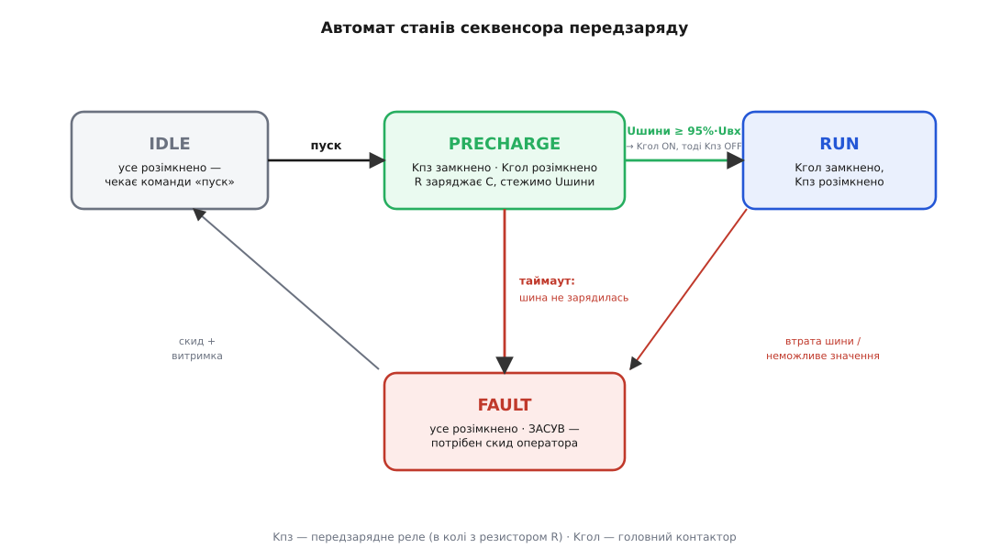
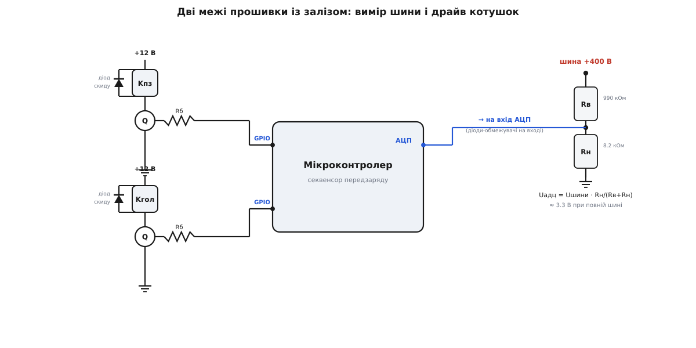

# ⚙️ Секвенсор передзаряду: прошивка, що не зварює контактор

Велика шина постійного струму — інвертора, привода, батареї електромобіля — має два ключі й один буферний конденсатор на сотні чи тисячі мікрофарад. Перший ключ, головний контактор, зʼєднує шину з навантаженням. Другий, передзарядне реле, вмикає в коло резистор, крізь який конденсатор наповнюється мʼяко. Уся драма живе в **порядку** їхнього замикання, і саме цей порядок веде мікроконтролер. Помилишся в ньому на один такт — і зваришся контактор.

Пастка тут не одна, а дві, і друга страшніша за першу. Перший кидок — це знайомий сплеск у мить подачі живлення, коли розряджений конденсатор виглядає як [коротке замикання](topic:electronics/inrush-current); його й приборкує передзарядний резистор. Але є другий кидок, і він чигає **всередині нашої власної схеми**. Якщо замкнути головний контактор, поки конденсатор ще недозаряджений, то різниця напруг між шиною і конденсатором упаде на лічені міліоми головного кола — і жене крізь контакт, що тільки-но зійшовся, струм у тисячі ампер. Цей струм зварює срібло контактів намертво: контактор більше ніколи не розімкнеться, і аварійне відключення батареї стає фізично неможливим. Ось чому передзаряд серйозної шини не «чекає таймером наздогад», а **вимірює** напругу на конденсаторі й замикає головний ключ лише тоді, коли мірятися вже майже нема чому.

Ця вставка — робочий код такого нагляду: прошивка мікроконтролера, що читає напругу шини через [АЦП](topic:electronics/adc), веде послідовність передзаряду скінченним автоматом і ловить несправність, якщо шина так і не зарядилась.

## Що саме має зробити прошивка

Розкладімо задачу на кроки, які код виконує один за одним, а тоді знайдемо в кожному свою пастку.

Спершу — топологія, яку ми керуємо. Головний контактор Kгол стоїть у головному колі. Паралельно до нього — окрема вітка з передзарядного реле Kпз і резистора R. Поки все розімкнено, шина відрізана. Пуск іде так: замикаємо Kпз — і струм тече єдиним доступним шляхом, крізь R у конденсатор, наростаючи мʼяко. Коли конденсатор дійшов майже до напруги входу, замикаємо Kгол — тепер він шунтує вітку R, і оскільки конденсатор уже заряджений, кидок крізь Kгол малий. Нарешті розмикаємо Kпз: резистор більше не потрібен, і його треба забрати з кола, щоб він не тлів і щоб схема повернулась у відомий стан.

> 🔧 **Навіщо це.** Чому взагалі **мірять**, а не просто зачекати фіксований час? Бо таймер не відрізняє «зарядилось» від «не зарядилось». Уяви коротке замикання на шині: конденсатор ніколи не набере напруги, скільки не чекай. Дурний таймер відлічить свої 200 мілісекунд і слухняно замкне головний контактор — просто в мертве коротке, на повний струм джерела. Вимірювання розвʼязує обидві задачі одним рухом: підтверджує, що конденсатор **справді** заряджений (тоді можна головний), і викриває несправність, коли напруга не росте (тоді треба аварія, а не пуск). Одне число — напруга на шині — несе обидві відповіді.

Отже прошивка мусить: періодично зчитувати напругу шини й чистити її від шуму; за командою «пуск» замикати передзарядне реле; чекати, доки Uшини дійде до порога (близько 95 % входу) **або** доки не вичерпається аварійний таймаут; за успіхом — замикати головний контактор, дати його контактам зійтися й лише тоді знімати передзаряд; за таймаутом — оголошувати несправність і **не** замикати нічого. І окремо — вміти чисто вийти з аварії за явним скидом.

## Ідея: чотири стани й одне питання щомиті

Така послідовність із розгалуженнями — природний [скінченний автомат](topic:electronics/finite-state-machines). У кожну мить прошивка перебуває рівно в одному з чотирьох станів, і весь її код зводиться до одного питання, яке вона ставить собі щотакту: «де я і чи можна далі?».

- **IDLE** — усе розімкнено, чекаємо команди «пуск».
- **PRECHARGE** — передзарядне реле замкнено, головний розімкнено; R заряджає конденсатор, а ми стежимо за напругою й за годинником.
- **RUN** — головний замкнено, передзарядне знято; робочий стан.
- **FAULT** — щось пішло не так; обидва ключі розімкнено, схема на **засуві** й чекає скиду оператора.

Сила автомата саме в тому, що переходи між станами — це єдине місце, де відбуваються небезпечні дії (замикання ключів), і кожен перехід стереже своя умова. Не можна «випадково» замкнути головний контактор: цей рядок коду виконується лише на переході PRECHARGE → RUN, а той перехід стереже перевірка напруги. Автомат перетворює словесне правило «не замикай головний, поки не зарядилось» на структуру, у якій порушити його неможливо, не переписавши перехід.


*Уся логіка передзаряду на одній мапі. З IDLE команда «пуск» замикає передзарядне реле й веде в PRECHARGE. Звідти два виходи: угору — напруга дійшла до 95 % входу, тоді замикаємо головний контактор і аж потім знімаємо передзаряд (RUN); униз — минув таймаут, а шина не зарядилась, тоді аварія (FAULT). З FAULT назад лише через явний скид із витримкою. Небезпечне замикання головного живе на єдиному переході, який стереже перевірка напруги.*

## Міст до заліза: поділити 400 вольт і згладити шум

Перш ніж автомат щось вирішить, йому потрібне надійне число — напруга шини в мілівольтах. Між чотирма сотнями вольт на шині й трьома вольтами, які терпить вхід АЦП, стоять дві ланки: [дільник напруги](topic:electronics/voltage-divider), що масштабує напругу вниз, і фільтр, що чистить відлік від шуму.

Дільник — два резистори послідовно від шини до землі; АЦП читає напругу на нижньому плечі. Підберемо плечі так, щоб повна шина давала трохи менше за опорну напругу АЦП, аби лишити запас і не впертись у стелю перетворювача.

```c
#include <stdint.h>
#include <stdbool.h>

// ── Параметри під конкретну шину ──────────────────────────────────────
#define VBUS_NOMINAL_mV     400000u   // очікувана напруга входу (400 В)
#define PRECHARGE_TARGET_pct    95u   // поріг «заряджено», % від Uвх
#define PRECHARGE_TIMEOUT_ms   500u   // не дійшло за цей час -> аварія
#define CONTACTOR_SETTLE_ms     40u   // час на злипання головного контактора
#define TICK_ms                  5u   // період виклику precharge_tick()

// Вимірювальний тракт: дільник 400 В -> трохи менше 3.3 В на 12-біт АЦП.
#define ADC_VREF_mV           3300u
#define ADC_FULLSCALE         4095u   // 2^12 − 1
#define DIV_RTOP_ohm        990000u   // верхнє плече дільника
#define DIV_RBOT_ohm          8200u   // нижнє плече

// Найбільша правдоподібна напруга: вище -> несправність давача/дільника.
#define VBUS_MAX_PLAUSIBLE_mV (VBUS_NOMINAL_mV + VBUS_NOMINAL_mV / 4u)
```

Порахуймо, що дає цей дільник, щоб переконатися в запасі.

**Умова.** Шина 400 В, верхнє плече Rв = 990 кОм, нижнє Rн = 8.2 кОм, опорна напруга АЦП 3.3 В, роздільність 12 біт.

```
Коефіцієнт поділу:   k   = Rн/(Rв+Rн) = 8200/998200      ≈ 0.008215
Напруга на вході АЦП: Uадц = 400 · k                     ≈ 3.286 В   (запас ~0.4 %)
Ціна одного відліку:  ΔU  = Uвх / 4095 = 400/4095          ≈ 0.098 В на шині
```

Отже повна шина лягає на 3.29 В — трохи нижче за опорні 3.3 В, і кожен крок 12-бітного АЦП коштує приблизно десяту вольта на шині. Цього з головою досить, щоб розрізнити 95 % і 100 % заряду. Тепер перетворення сирого коду АЦП назад у мілівольти шини — просте множення на обернений коефіцієнт, з проміжним 64-бітним числом, щоб не переповнити розрядність:

```c
// ── Межа із залізом (реалізуй під свою плату) ─────────────────────────
extern void     hw_relay_precharge(bool on); // котушка передзарядного реле Kпз
extern void     hw_relay_main(bool on);      // котушка головного контактора Kгол
extern uint16_t hw_adc_read_bus(void);       // сира вибірка АЦП із каналу шини
extern uint32_t hw_millis(void);             // монотонний час, мс
extern void     hw_fault_report(uint8_t code);

// Сирий код АЦП -> мілівольти на шині (через дільник).
static uint32_t adc_to_bus_mV(uint16_t raw)
{
    // Uадц = raw·Vref/FS ;  Uшини = Uадц·(Rв+Rн)/Rн
    uint32_t uadc_mV = (uint32_t)((uint64_t)raw * ADC_VREF_mV / ADC_FULLSCALE);
    uint64_t ubus    = (uint64_t)uadc_mV * (DIV_RTOP_ohm + DIV_RBOT_ohm) / DIV_RBOT_ohm;
    return (uint32_t)ubus;
}
```

Тепер фільтр — і тут криється думка, яку легко проґавити. Здається, ніби усереднення вимірів це косметика, «щоб гарніше». Насправді на шині високої напруги фільтр — це елемент **безпеки**. Комутація силових ключів кидає в землю голки завад; поодинокий відлік АЦП може стрибнути на десятки вольт угору навіть тоді, коли конденсатор іще напівпорожній. Один такий хибний стрибок понад поріг — і автомат вирішить, що «заряджено», і замкне головний контактор передчасно, просто в другий кидок. [Ковзне середнє](topic:algorithms/moving-average) на кілька вибірок робить одне: не дає одинокому викиду ухвалити рішення про замикання. Це не оздоба, а запобіжник від фальшивого «готово».

```c
// Ковзне середнє на 8 вибірок: гасить шум АЦП, O(1) на крок.
#define FILT_N 8u
static uint32_t f_buf[FILT_N];
static uint32_t f_sum;
static uint8_t  f_idx, f_fill;

static uint32_t filter_push(uint32_t x)
{
    f_sum -= f_buf[f_idx];      // прибрати найстаріше
    f_buf[f_idx] = x;           // покласти найновіше
    f_sum += x;
    f_idx = (uint8_t)((f_idx + 1u) % FILT_N);
    if (f_fill < FILT_N) f_fill++;
    return f_sum / (f_fill ? f_fill : 1u);
}
```

Це ковзне середнє тримає біжучу суму й на кожному кроці робить лише одне віднімання, одне додавання й одне ділення — не залежить від довжини вікна. На восьми вибірках воно гасить голки, майже не додаючи затримки, а восьмірка як степінь двійки дає компіляторові перетворити ділення на зсув.


*Дві точки дотику коду й заліза. Праворуч — вимір: дільник Rв/Rн стягує 400 В до безпечних 3.3 В на вхід АЦП. Ліворуч — керування: кожен вихід GPIO крізь транзистор живить котушку свого реле, а паралельно котушці — діод скиду, що приймає викид індуктивності в мить розмикання. Прошивка бачить залізо саме через ці три лінії: одну аналогову на вхід і дві цифрові на вихід.*

## Серце: крок автомата

Тепер сам автомат. Уся жива логіка — в одній функції `precharge_tick()`, яку планувальник викликає рівно кожні кілька мілісекунд. Вона зчитує й фільтрує напругу, перевіряє її на правдоподібність і виконує гілку поточного стану. Нижче — та сама реалізація двома мовами: класичним C, як пишуть прошивку на голому залізі, і ідіоматичним C++, де стан і межа з залізом заховані в клас із перелічним типом стану замість глобальних змінних. Логіка тотожна — різниця лише в тому, як мова дає її впорядкувати.

:::tabs
```c
typedef enum { ST_IDLE = 0, ST_PRECHARGE, ST_RUN, ST_FAULT } pc_state_t;
typedef enum { FLT_NONE = 0, FLT_TIMEOUT, FLT_BUS_LOST, FLT_SENSOR } pc_fault_t;

static pc_state_t    g_state = ST_IDLE;
static pc_fault_t    g_fault = FLT_NONE;
static uint32_t      g_t_enter;      // час входу в стан
static uint32_t      g_t_main;       // час замикання головного
static bool          g_main_closed;  // головний уже замкнено (у PRECHARGE)
static volatile bool g_start_req;    // команда «пуск» (ставить інший контекст)

static uint32_t threshold_mV(void)
{
    return (uint32_t)((uint64_t)VBUS_NOMINAL_mV * PRECHARGE_TARGET_pct / 100u);
}

static void enter_fault(pc_fault_t code, uint32_t now)
{
    hw_relay_main(false);           // ПЕРШЕ — зняти обидва ключі
    hw_relay_precharge(false);
    g_fault   = code;
    g_state   = ST_FAULT;
    g_t_enter = now;
    hw_fault_report((uint8_t)code);
}

// Викликати рівно кожні TICK_ms.
void precharge_tick(void)
{
    uint32_t now  = hw_millis();
    uint32_t vbus = filter_push(adc_to_bus_mV(hw_adc_read_bus()));

    // З будь-якого стану: неможливе значення -> аварія давача.
    if (vbus > VBUS_MAX_PLAUSIBLE_mV && g_state != ST_FAULT) {
        enter_fault(FLT_SENSOR, now);
        return;
    }

    switch (g_state) {
    case ST_IDLE:
        hw_relay_precharge(false);
        hw_relay_main(false);
        g_main_closed = false;
        if (g_start_req) {
            g_start_req = false;
            hw_relay_precharge(true);        // 1) замкнути передзарядне реле
            g_state   = ST_PRECHARGE;
            g_t_enter = now;
        }
        break;

    case ST_PRECHARGE:
        if (!g_main_closed) {
            if (vbus >= threshold_mV()) {
                hw_relay_main(true);         // 2) заряджено -> замкнути головний
                g_main_closed = true;
                g_t_main = now;
            } else if (now - g_t_enter >= PRECHARGE_TIMEOUT_ms) {
                enter_fault(FLT_TIMEOUT, now);   // шина не зарядилась -> коротке/обрив
            }
        } else if (now - g_t_main >= CONTACTOR_SETTLE_ms) {
            hw_relay_precharge(false);       // 3) контакти зійшлися -> зняти передзаряд
            g_state   = ST_RUN;
            g_t_enter = now;
        }
        break;

    case ST_RUN:
        // головний тримає шину; стежимо, що напруга не впала.
        if (vbus < VBUS_NOMINAL_mV / 2u) {
            enter_fault(FLT_BUS_LOST, now);
        }
        break;

    case ST_FAULT:
        hw_relay_precharge(false);
        hw_relay_main(false);
        break;
    }
}

// ── Керування ззовні ──────────────────────────────────────────────────
void precharge_start(void) { g_start_req = true; }   // «пуск»

void precharge_stop(void)                            // «стоп»
{
    hw_relay_main(false);
    hw_relay_precharge(false);
    g_main_closed = false;
    g_state = ST_IDLE;
}

bool precharge_reset(void)                           // скид аварії (лише з FAULT)
{
    if (g_state != ST_FAULT) return false;
    g_fault = FLT_NONE;
    g_main_closed = false;
    g_state = ST_IDLE;
    return true;
}

pc_state_t precharge_state(void) { return g_state; }
```
```cpp
#include <array>
#include <cstdint>

class PrechargeSequencer {
public:
    enum class State { Idle, Precharge, Run, Fault };
    enum class Fault { None, Timeout, BusLost, Sensor };

    // Межа із залізом — своя реалізація на кожній платі.
    struct Hal {
        virtual void     relayPrecharge(bool on) = 0;   // котушка Kпз
        virtual void     relayMain(bool on)      = 0;   // котушка Kгол
        virtual uint16_t adcReadBus()            = 0;
        virtual uint32_t millis()                = 0;
        virtual void     faultReport(Fault)      {}
        virtual ~Hal() = default;
    };

    explicit PrechargeSequencer(Hal& hal) : hal_(hal) {}

    void  start() { startReq_ = true; }
    void  stop()  { hal_.relayMain(false); hal_.relayPrecharge(false);
                    mainClosed_ = false; state_ = State::Idle; }
    bool  reset() { if (state_ != State::Fault) return false;
                    fault_ = Fault::None; mainClosed_ = false;
                    state_ = State::Idle; return true; }
    State state() const { return state_; }

    // Викликати рівно кожні TICK_ms.
    void tick()
    {
        const uint32_t now  = hal_.millis();
        const uint32_t vbus = filter_.push(adcToBusmV(hal_.adcReadBus()));

        if (vbus > kBusMaxPlausible_mV && state_ != State::Fault) {
            enterFault(Fault::Sensor, now);
            return;
        }

        switch (state_) {
        case State::Idle:
            hal_.relayPrecharge(false);
            hal_.relayMain(false);
            mainClosed_ = false;
            if (startReq_) {
                startReq_ = false;
                hal_.relayPrecharge(true);        // 1) замкнути передзарядне реле
                state_ = State::Precharge; tEnter_ = now;
            }
            break;

        case State::Precharge:
            if (!mainClosed_) {
                if (vbus >= thresholdmV()) {
                    hal_.relayMain(true);         // 2) заряджено -> замкнути головний
                    mainClosed_ = true; tMain_ = now;
                } else if (now - tEnter_ >= kTimeout_ms) {
                    enterFault(Fault::Timeout, now);
                }
            } else if (now - tMain_ >= kSettle_ms) {
                hal_.relayPrecharge(false);       // 3) зняти передзаряд
                state_ = State::Run; tEnter_ = now;
            }
            break;

        case State::Run:
            if (vbus < kBusNominal_mV / 2) enterFault(Fault::BusLost, now);
            break;

        case State::Fault:
            hal_.relayPrecharge(false);
            hal_.relayMain(false);
            break;
        }
    }

private:
    void enterFault(Fault c, uint32_t now)
    {
        hal_.relayMain(false);            // ПЕРШЕ — зняти обидва ключі
        hal_.relayPrecharge(false);
        fault_ = c; state_ = State::Fault; tEnter_ = now;
        hal_.faultReport(c);
    }

    static constexpr uint32_t thresholdmV()
    { return kBusNominal_mV * kTargetPct / 100; }

    static uint32_t adcToBusmV(uint16_t raw)
    {
        const uint32_t uadc = static_cast<uint32_t>(
            static_cast<uint64_t>(raw) * kAdcVref_mV / kAdcFullScale);
        return static_cast<uint32_t>(
            static_cast<uint64_t>(uadc) * (kRtop + kRbot) / kRbot);
    }

    // Компактне ковзне середнє (N — степінь двійки: ділення = зсув).
    template <std::size_t N> struct Moving {
        std::array<uint32_t, N> buf{}; uint32_t sum = 0;
        std::size_t i = 0, fill = 0;
        uint32_t push(uint32_t x) {
            sum -= buf[i]; buf[i] = x; sum += x;
            i = (i + 1) % N; if (fill < N) ++fill;
            return sum / (fill ? fill : 1);
        }
    };

    static constexpr uint32_t kBusNominal_mV     = 400000;
    static constexpr uint32_t kBusMaxPlausible_mV = kBusNominal_mV + kBusNominal_mV / 4;
    static constexpr uint32_t kTargetPct = 95, kTimeout_ms = 500, kSettle_ms = 40;
    static constexpr uint32_t kAdcVref_mV = 3300, kAdcFullScale = 4095;
    static constexpr uint32_t kRtop = 990000, kRbot = 8200;

    Hal&       hal_;
    State      state_     = State::Idle;
    Fault      fault_     = Fault::None;
    Moving<8>  filter_;
    uint32_t   tEnter_ = 0, tMain_ = 0;
    bool       startReq_ = false, mainClosed_ = false;
};
```
:::

Три речі в цьому коді варті окремого погляду, бо в них уся різниця між надійним секвенсором і майбутнім зварюванням.

Перше — **порядок замикання головного й розмикання передзарядного**. Наївний код зробив би це одним рядком: дійшли до порога — замкнули головний, розімкнули передзарядне. Але контактор не замикається миттєво: його якір летить кілька, а то й десятки мілісекунд, і в цю мить контакт іще торохтить. Якщо зняти передзаряд рівно тоді, коли ми лише **подали** сигнал на головний, вийде коротка мить, коли передзарядне вже розімкнулось, а головний ще не зійшовся — струм рветься. Тому автомат розбиває цей крок надвоє: спершу подає сигнал на головний і засікає час (`g_main_closed = true`), а передзаряд знімає лише через `CONTACTOR_SETTLE_ms`, коли контакти певно зійшлися. Обидва ключі коротко перекриваються — і струм ніде не рветься.

Друге — **перше, що робить `enter_fault`, це знімає обидва ключі**, і аж потім записує код та рапортує. Порядок тут не косметичний: у стані аварії найважливіше — розімкнути залізо, тож дія на залізо йде першою, ще до будь-якої бухгалтерії. Хоч би що сталося далі з логуванням, силові ключі вже безпечні.

Третє — **`g_start_req` позначено `volatile`**. Команда «пуск» приходить з іншого контексту (натиск кнопки в перериванні чи повідомлення з головного циклу), а читає її `precharge_tick()`. Без `volatile` компілятор мав би право закешувати прапорець і не помітити, що його змінили ззовні. На тонших архітектурах цього мало й потрібна атомарна операція, але суть та сама: прапорець, який пишуть в одному контексті, а читають в іншому, не можна лишати звичайною змінною.

## Числа, що задають пороги

Три константи в коді — поріг, таймаут і час злипання — не беруться з голови. За кожною стоїть розрахунок, і в двох із них ховається неочевидний компроміс.

**Таймаут проти часу заряду — і виживання резистора.** Таймаут мусить бути довшим за чесний час заряду до порога, інакше нормальний пуск падатиме в аварію. Порахуймо цей чесний час для типової шини.

**Умова.** R = 47 Ом, C = 1000 мкФ, поріг 95 %.

```
Стала часу:            τ  = R·C = 47 · 1000·10⁻⁶       = 47 мс
До 95 % (це 3τ, бо 1−e⁻³≈0.95):  t₉₅ = 3τ ≈ 141 мс
```

Отже чесний заряд до порога — близько 141 мс, і таймаут у 500 мс дає зручний запас на слабке джерело. Але тепер друге питання, яке новачок не ставить: а що робить резистор **усі ці 500 мс, якщо шина закорочена**? Він тримає на собі повну напругу входу без спаду, бо конденсатор не заряджається:

```
Потужність у R при короткому:  P = Uвх²/R = 400²/47      ≈ 3.4 кВт
Енергія за весь таймаут:        W = P·t = 3400 · 0.5      ≈ 1700 Дж
```

Тисяча сімсот джоулів — це в двадцять разів більше за ті 80 Дж (`½·C·V²`), що резистор приймає при **нормальному** заряді. Ось прихована ціна довгого таймауту: передзарядний резистор мусить пережити повну потужність короткого протягом усього таймауту. Або береш резистор із велетенською імпульсною енергією, або скорочуєш таймаут, або (найрозумніше) додаєш **перевірку поступу**: якщо за першу сотню мілісекунд напруга не зрушила з нуля, це коротке — рубай аварію негайно, не чекаючи повного таймауту. Рахунок за виживання резистора завжди програний, якщо думати лиш про нормальний пуск і забути про коротке.

**Чому поріг саме 95 % — і чому це не панацея.** Здається, ніби 95 % «майже повний заряд» і другий кидок нам не страшний. Порахуймо залишковий кидок у мить, коли головний замикається при 95 %.

```
Недобір напруги:      ΔU = 5 % · 400 = 20 В
Опір головного кола:  R_гол ≈ 20 мОм (контактор + шини + джерело)
Залишковий кидок:     I = ΔU/R_гол = 20/0.02 = 1000 А
```

Тисяча ампер — навіть при 95 %! Ось чому поріг не можна ставити абияк: залишковий кидок дорівнює недобору напруги, поділеному на опір головного кола, і навіть маленький недобір на дуже низькому опорі дає сотні чи тисячі ампер. Рятує тут дві речі. По-перше, індуктивність шин обмежує **швидкість** наростання цього струму, тож пік не такий гострий, як дає гола формула. По-друге — і головне — контактори мають окрему характеристику «струм замикання» (making capacity), тобто пік, який контакт витримує **під час** сходження без зварювання. Правило таке: піднімай поріг настільки, щоб залишковий кидок ліг **під** цю характеристику з запасом. Для стійкої низькоомної шини це може означати не 95, а 98–99 %. Число «95 %» — не догма, а відправна точка, яку перевіряють проти паспорта конкретного контактора.

## Складність і пастки

Код короткий, і вся його вартість — у дрібницях, які легко пропустити. Зберімо їх.

**Другий кидок стереже лише одна перевірка.** У всьому автоматі рівно один рядок замикає головний контактор, і його стереже рівно одна умова — `vbus >= threshold_mV()`. Це єдина стіна між правильним пуском і звареним контактором. Тому фільтр напруги — не косметика (хибний викид проб'є цю стіну), і тому поріг рахують проти характеристики замикання, а не «на око».

**Одного давача мало для строгого порівняння.** Наш код порівнює напругу конденсатора з **номіналом** 400 В. Але якщо вхід просів до 350 В, конденсатор чесно зарядиться лише до 350 В — це 87 % номіналу, поріг у 95 % не досягається, і справний пуск падає в хибний таймаут. Строгий секвенсор міряє **дві** напруги — і входу, і конденсатора — і порівнює їх між собою: «конденсатор дійшов до 95 % того, що зараз на вході». Це коштує другого каналу АЦП і другого дільника, зате знімає залежність від рівня живлення.

**Котушку реле не можна вмикати з GPIO напряму, і їй потрібен діод скиду.** Вихід мікроконтролера не дає струму на котушку контактора — між ними транзистор. А сама котушка індуктивна: у мить розмикання вона [брикається викидом напруги](topic:electronics/inductor-kickback), який проб'є транзистор, якщо не дати струмові куди подітись. Тому паралельно котушці кожного [реле](topic:electronics/relay) ставлять діод скиду (freewheel), що замикає цей викид на себе. Забудеш діод — драйвер помре на першому ж розмиканні, і котушка зависне в невідомому стані.

**Сторож на випадок зависання.** Якщо прошивка зависне **всередині** PRECHARGE — з замкнутим передзарядним реле, — резистор смажитиметься повною потужністю, аж поки не згорить. Рятує [сторожовий таймер (watchdog)](topic:programming/watchdog): якщо цикл не «погодував» його вчасно, він скидає мікроконтролер, а той при старті першою дією знімає обидва ключі. Тому апаратний стан за замовчуванням мусить бути **безпечним**: реле знеструмлене = розімкнене, тож будь-який збій живлення чи скид падає у бік «усе відключено», а не «усе замкнено».

**Земля мікроконтролера й висока напруга — різні світи.** Дільник опускає 400 В до трьох, але низ дільника сидить на землі силової шини, яка може бути під сотнями вольт відносно землі логіки. Міряти таке безпосередньо входом мікроконтролера — небезпечно і для приладу, і для людини. У серйозних приладах вимір і керування розвʼязують гальванічно: сигнали проходять крізь [оптопару](topic:electronics/optocoupler) чи ізоляційний підсилювач, і логіка ніколи не має спільної землі з високовольтним колом. І на самому вході АЦП не завадять діоди-обмежувачі до 0 і до опорної напруги — щоб випадковий сплеск на дільнику не спалив вхід.

**Аварія має бути на засуві, а не в петлі.** Стан FAULT навмисно не має автоматичного виходу — лише явний `precharge_reset()`. Спокуса «спробувати ще раз само» тут смертельна: якщо аварія від короткого, автоповтор жбурне резистор у те саме коротке знову й знову, поки він не згорить. Тому FAULT тримає засув, а перед новою спробою розумно вимагати не лише скиду оператора, а й витримки — щоб резистор охолов після невдалого пуску.

**Розряд при вимкненні — окрема турбота.** Секвенсор дбає про пуск, але заряджений конденсатор лишається небезпечним і після відключення шини: сотні вольт можуть стояти на ньому хвилинами. Це задача розрядного кола (bleeder), не нашого автомата, — та проєктувати передзаряд, не подбавши про розряд, означає лишити пастку для того, хто відкриє прилад.

Секвенсор передзаряду — це двісті рядків, які здебільшого нічого не роблять: чекають, міряють, знову чекають. Уся їхня вартість — в упертій відмові рушити далі за годинником самим. Дурний таймер замкнув би головний контактор точно за розкладом — і точно в мертве коротке. Розумний секвенсор питає щотакту одне: «а чи справді зарядилось?» — і замикає силовий ключ лише тоді, коли відповідь підтверджена виміром, а не сподіванням.
</content>
</invoke>
