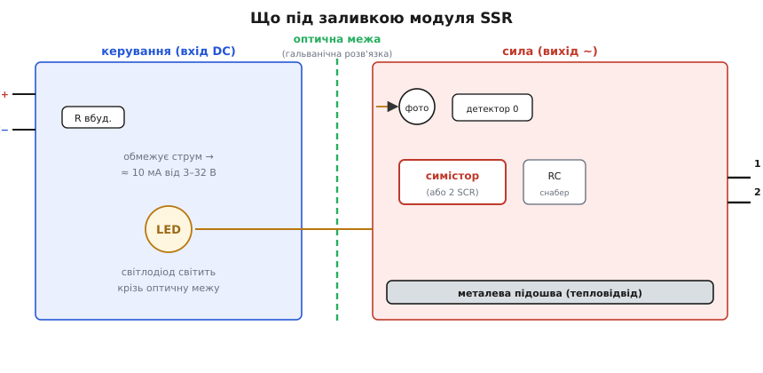
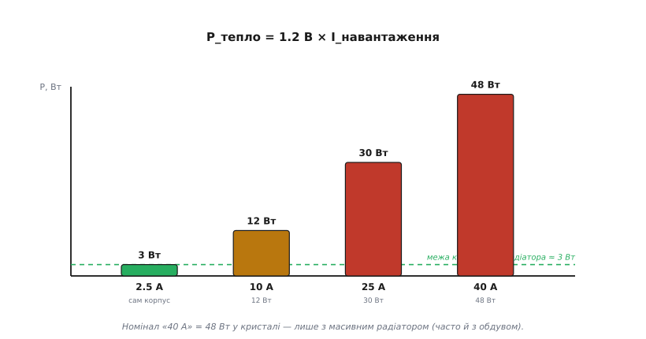

# 🔌 Модуль твердотільного реле (SSR-xxDA)

[Твердотільне реле](book:electronics/solid-state-relay) як принцип — це оптична розв'язка плюс напівпровідниковий ключ замість металевих контактів. Але на стіл до розробника воно потрапляє у вигляді цілком конкретної речі: чорної залитої компаундом «цеглинки» з чотирма гвинтовими клемами й маркуванням на кшталт **SSR-40DA**. Цей модуль настільки стандартизований між десятками виробників, що його варто розібрати як **клас**: як прочитати назву, що сидить під заливкою, як підключити обидва боки і — головне — чому велика цифра на корпусі майже завжди бреше. Партномер SSR-40DA тут лише приклад; усе сказане однакове для SSR-25DA, SSR-10DA, версій «AA» та «DD» і будь-якого виробника, бо описує саму схему, а не товар.

### Як читати маркування

Назва такого модуля — це майже повний паспорт, якщо знати код. Розберемо по літерах на прикладі **SSR-40DA**:

- **SSR** — *solid-state relay* (англ.), твердотільне реле: ключ без рухомих контактів.
- **40** — номінальний струм навантаження в амперах. Найбільша й найоманливіша цифра на корпусі (до неї повернемося наприкінці).
- **D** (перша літера) — **тип керувального входу**: **D** = *DC*, постійна напруга керування (типово 3–32 В). Якщо тут стоїть **A** — керування йде змінною напругою (90–250 В AC) з іншою вхідною обв'язкою.
- **A** (друга літера) — **тип навантаження на виході**: **A** = *AC*, ключ комутує змінний струм (усередині [симістор](book:electronics/triac) або зустрічні тиристори). Якщо тут **D** (тобто корпус «DD») — вихід комутує постійний струм, і всередині стоять уже [силові MOSFET](book:electronics/mosfet-power-switch), а не симістор.

Звідси читаються всі ходові комбінації. **DA** — «постійним керуємо, змінний комутуємо»: найпоширеніший варіант, ним з логіки чи реле-виходу мікроконтролера вмикають мережеве навантаження (нагрівач, лампу, помпу). **AA** — і керування, і навантаження змінні. **DD** — постійним керуємо, постійний і комутуємо, всередині MOSFET. Двомовні мітки на корпусі підкажуть боки: *Input / Load*, *DC+ / DC−*, *Load ~*.

### Розпіновка: чотири виводи, дві землі

Та сама оптична межа, що всередині розділяє схему на керування й силу, виходить і назовні: виводів усього **чотири**, по два з кожного боку. Переплутати боки — типова перша помилка, тож запам'ятаймо нумерацію (вона стандартна для класу):

- **3, 4 — керування** (вхід). «3» — це **+** (*DC+*), «4» — це **−** (*DC−*). Полярність важлива: усередині світлодіод оптопари, тож увімкнений «навпаки» модуль просто не засвітиться й не спрацює.
- **1, 2 — навантаження** (вихід, ~). Силові клеми. У розрив між фазою мережі й навантаженням вмикають саме їх. Для змінного струму ці два виводи рівноправні — «плюса» серед них немає.

Найважливіше тут — що вхід і вихід **гальванічно розв'язані** тією самою [оптичною межею](book:electronics/optocoupler), що й у звичайній оптопарі. Тому керувальні «3/4» можуть сидіти на логічній землі мікроконтролера, а силові «1/2» — у мережі 230 В, і жоден сплеск із мережі не пройде в логіку по мідному дроту.

«Перший байт» — як заговорити з модулем із мікроконтролера — гранично простий, бо це не шина, а просто рівень:

```
Логічний "1" на вивід "3"(+) → світлодіод усередині горить →
  → (zero-cross версія: чекаємо найближчого нуля мережі) → ключ відкрився →
    → навантаження під напругою, поки тримаємо "1".
Логічний "0" → світлодіод згас → ключ закриється на найближчому нулі струму.
```

Жодних реєстрів чи протоколів: модуль вмикається рівнем на вході. Одна пастка: усередині вже стоїть **обмежувальний резистор**, тож зовнішній не потрібен, але 3.3 В порту можуть **не дотягнути** до чесних ~10 мА через цей резистор — надійніше керувати через [транзисторний ключ](book:electronics/bjt-switch) від 5 В.

### Що під заливкою

Корпус залитий компаундом, тож розкрити його очима не вийде — але набір вузлів усередині типовий, і саме він пояснює всю поведінку модуля:


*Дві половини, розділені оптичною межею. Зліва — керування: вбудований резистор і світлодіод (≈ 10 мА від 3–32 В). Справа — силова частина: фотоприймач, у zero-cross версіях детектор нуля, силовий симістор (або два зустрічні тиристори) з RC-снабером, і все це сидить на металевій підошві корпусу.*

Ланцюжок працює так. На вхід подаємо постійну напругу — внутрішній резистор обмежує струм, і світлодіод оптопари засвічується струмом близько 10 мА. Світло перетинає оптичну межу й потрапляє на **фотоприймач** силового боку. У zero-cross версіях далі стоїть **детектор нуля**: він не дає ключу відкритися, поки миттєва напруга мережі не впаде близько до нуля ([комутація в нулі](book:electronics/zero-cross-switching)) — тому ввімкнення йде без сплеску струму й без завад. Сам силовий ключ — **симістор** (TRIAC) або пара зустрічних тиристорів; саме він пропускає струм навантаження. Паралельно ключу стоїть **RC-снабер**, що гасить швидкі стрибки напруги (*dv/dt*) і не дає ключу самовмикатися на індуктивному навантаженні ([снабери й dv/dt](book:electronics/snubbers-dvdt)). Уся силова частина змонтована на **металевій підошві** — і це не просто дно корпусу, а тепловідвідна пластина, ось чому вона критична.

### Чому радіатор обов'язковий

Ось головне, що відрізняє модуль SSR від звичайного реле і про що мовчить велика цифра на корпусі. Відкритий симістор — **не** ідеальний провідник: на ньому лишається пряме падіння напруги близько **1.2 В** (як на двох послідовних [PN-переходах](book:electronics/diode-iv-curve)), і це падіння майже не залежить від струму. А падіння напруги, помножене на струм, — це теплова потужність, яка виділяється просто в кристалі:

```
P_тепло = U_падіння × I_навантаження ≈ 1.2 В × I
```

Підставимо номінал — і стане ясно, чому корпус сам по собі не врятує:


*Тепло росте прямо зі струмом. Маленький корпус сам по собі здатний розсіяти лише близько 3 Вт — це межа близько 2.5 А. «40 А» досяжні тільки на масивному радіаторі (а часто й з обдувом), бо при 40 А виділяється близько 48 Вт — як невелика паяльна станція.*

**Приклад (нагрівач 10 А).**

```
P_тепло = 1.2 В × 10 А = 12 Вт
```

Дванадцять ват — це потужність добрячого паяльника в кубику завбільшки зі сірникову коробку: без радіатора кристал за секунди перегріється й проб'ється. Сам корпус, прикручений ні до чого, чесно розсіює одиниці ват — тобто SSR-40DA без радіатора тримає не «40 А», а в кращому разі **2–3 А**. Тому правило залізне: модуль прикручують до **алюмінієвого радіатора через термопасту**, а під струми, близькі до номіналу, додають вентилятор.

Звідси найважливіший висновок про маркування: **цифра на корпусі — це межа кристала за ідеального тепловідводу, а не те, що модуль тягне «з коробки»**. Виробник вимірює максимум при безкінечно великому радіаторі й кімнатній температурі; у реальній шафі без радіатора лишається мала частка цієї цифри.

> 🔧 **Навіщо це.** Рахуйте тепло **до** монтажу: візьміть реальний струм навантаження, помножте на ≈ 1.2 В — отримаєте ват тепла, який треба кудись відвести. Радіатор підбирайте за цією потужністю (теплова модель Rθ — як «опір» для тепла, [теплові графіки в даташиті](book:electronics/datasheet-graphs)). Ніколи не довіряйте номінальній цифрі без радіатора: для відкритого ключа це фізично недосяжно.

### Чого модуль не вміє

Тепло — лише перша з відмінностей від реле; за нею стоїть ще кілька, і кожна свого часу комусь зіпсувала схему. Модуль спокушає простотою, але це **не** проста заміна електромеханічного реле:

- **Він «тече» у вимкненому стані.** Через RC-снабер і власні витоки напівпровідника навіть «закритий» модуль пропускає струм витоку — типово одиниці міліампер. Цього досить, щоб тьмяно світився індикатор, «не до кінця гасла» енергоощадна лампа, а на навантаженні лишалася **небезпечна напруга**. [Електромеханічне реле](book:electronics/relay-driver) розриває коло фізично — модуль SSR повного розриву не дає **ніколи**, тож для безпеки потрібен окремий розрив.
- **Він гріється, а реле — ні.** Контакти реле в замкненому стані не розсіюють майже нічого, а модуль SSR постійно «палить» свої ват — це водночас і втрата енергії, і теплова проблема.
- **AC-версія не комутує постійний струм.** Симістор вимикається лише коли струм сам проходить через нуль. У мережі це стається сто разів на секунду, а в колі постійного струму — **ніколи**: відкривши DC, модуль «**DA**» його вже не закриє. Для постійного струму потрібна версія на MOSFET (корпус «DD»).
- **Він боїться кидка струму й перенапруги.** Кристал має малу теплову інерцію, тож пусковий кидок лампи чи мотора або сплеск у мережі вбиває його швидше за звичайний запобіжник. Силові модулі захищають **швидким** запобіжником і варистором ([безпека мережевих кіл](book:electronics/mains-safety)), а індуктивне навантаження — снабером.

> 🔧 **Навіщо це.** Беріть модуль SSR там, де реле зношується: часта комутація, тиха безконтактна робота, нагрівач під ШІМ-керуванням. Але пам'ятайте про три речі — він **тече** (не ізолює, для безпеки потрібен окремий розрив), він **гріється** (рахуйте радіатор), і AC-версія **не вимикає DC**. Для слабких сигналів, повної ізоляції чи постійного струму краще підійде звичайне реле — у кожного ключа своя ніша.
