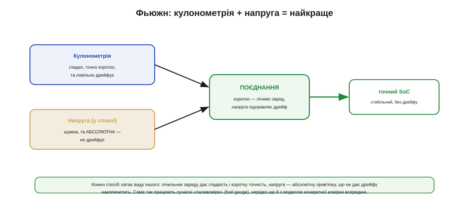
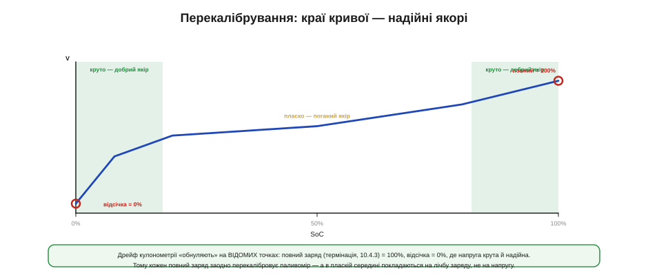
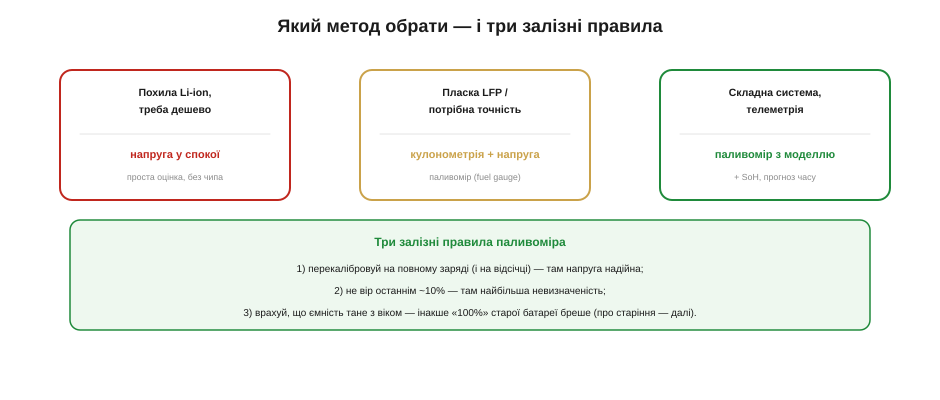

# Скільки лишилось: SoC, кулонометрія, поєднання напруги і струму

Кожен користувач хоче бачити «скільки відсотків лишилось», а кожен розробник знає, що дати цю цифру чесно — на диво важко. Стан заряду (*state of charge*, **SoC**) — не те, що батарея показує сама: усе, що видно ззовні, — це напруга й струм на клемах, а скільки заряду всередині, доводиться **обчислювати**. І тут немає одного ідеального способу: є три прийоми, кожен зі своєю вадою, і мистецтво в тому, щоб поєднати їх так, аби сильні сторони перекрили слабкі.

Корисно почати з того, чому це взагалі важко. Бензобак має поплавець, що прямо показує рівень; у батареї такого поплавця нема — заряд захований у хімії, і жоден провід не виводить його назовні. Ба більше, «повний» бак завжди той самий, а «повна» батарея з роками вміщає дедалі менше. Тож паливомір батареї — це не сенсор, а **оцінювач**: він будує здогад про невидиму величину з того дрібного, що видно на клемах. І як кожен здогад, він буває кращим чи гіршим залежно від того, скільки розуму в нього вкласти.


*Рис. Зсередини батарея непрозора: видно лише напругу й струм на клемах. Звідси три способи оцінити заряд: за напругою (швидко, але бреше), лічбою заряду (точно коротко, але дрейфує) і їхнім поєднанням (найкраще на практиці).*

Розглянемо ці три методи по черзі — метод напруги, кулонометрію та їхнє поєднання, — а тоді додамо два практичні стовпи надійного паливоміра: перекалібрування на краях і поправку на те, що сама ємність із часом тане.

Навіщо взагалі ця точність? Бо від оцінки SoC залежать конкретні рішення пристрою: коли попередити користувача, коли коректно завершити роботу й зберегтися (поки ще є енергія), коли вимкнути ненайважливіше, щоб дотягти довше. Груба оцінка тут — не дрібниця: показати «20%», коли насправді 5%, означає вимкнутись посеред справи без попередження. Тому в SoC вкладають зусиль рівно стільки, скільки коштує помилка: десь досить грубого індикатора на три поділки, а десь — точного відсотка з прогнозом часу.

### Метод напруги: швидко, але бреше

Найдешевший спосіб — за **напругою**. [Крива розряду комірки](book:electronics/battery-chemistries) пов'язує напругу зі станом заряду; отже, вимірявши напругу, можна по цій кривій (її звуть OCV-кривою) прочитати приблизний SoC. Спокусливо просто — і саме тому так часто підводить.


*Рис. На похилій кривій Li-ion напруга помітно міняється зі станом заряду, тож SoC читається пристойно. На пласкому плато LiFePO4 напруга майже стала на більшості діапазону: 10 мВ похибки тут означають десятки відсотків SoC. Та сама біда — від просадки I·Rвн під навантаженням.*

Вад одразу дві. Перша — [**просадка** під навантаженням](book:electronics/battery-sag): напруга на клемах нижча за справжню OCV на I·Rвн, тож читати SoC по напрузі можна лише **у спокої**, давши комірці відпочити, — а в робочому пристрої такого спокою часто немає. Друга, фатальна для пласких хімій, — **саме плато**. Полічімо, щоб відчути масштаб.

**Приклад (скільки SoC «коштує» 10 мВ похибки).** Порівняймо похилу Li-ion і пласку LiFePO4.

```
Li-ion (похила): 20–80% SoC ≈ 3.5–4.0 В → 0.5 В на 60% SoC ≈ 8 мВ на 1%
   10 мВ похибки → ~1.2% SoC          (стерпно)

LiFePO4 (плато): 20–80% SoC ≈ 3.20–3.30 В → 0.1 В на 60% SoC ≈ 1.7 мВ на 1%
   10 мВ похибки → ~6% SoC
   а легка просадка під струмом 2 А × 0.05 Ом = 0.1 В → «помилка» ~60% SoC!
```

Висновок жорсткий: на похилому Li-ion напруга — пристойний орієнтир, а на **пласкому LiFePO4 (чи NiMH) самої напруги для SoC майже досить лише на самих краях** — у середині вона «бреше» на десятки відсотків від дрібниці. Тому для пласких хімій потрібен інший, незалежний від напруги метод.

Додає клопоту й те, що сама OCV-крива **повзе** з умовами. Вона трохи різна на холоді й у теплі, тож точний перерахунок напруги в SoC мав би враховувати ще й температуру. А «спокій», потрібний для чесного читання, — це не мить: після помітного струму комірці треба десятки хвилин, щоб напруга **розслабилась** до справжньої OCV (та сама повільна дифузійна складова [внутрішнього опору](book:electronics/battery-sag)). Пристрій, який майже весь час під навантаженням, такого спокою не має, — ще одна причина не покладатися на саму напругу.

Є й тонший ефект — **гістерезис**: напруга комірки за того самого SoC трохи різна залежно від того, щойно її заряджали чи розряджали. У Li-ion він невеликий, а от у LiFePO4 помітний — і це додаткова причина, чому пласке плато так погано читається напругою: до майже сталої напруги додається ще й невизначеність, з якого боку ми до неї прийшли.

### Кулонометрія: лічимо заряд

Цей інший метод — **кулонометрія** (*coulomb counting*): не вгадувати заряд за напругою, а **рахувати** його напряму. Заряд — це інтеграл струму за часом, тож якщо безперервно міряти струм, що тече в батарею й з неї, можна точно вести облік: скільки ампер-годин узяли — на стільки SoC і зменшився.


*Рис. SoC = SoC(старт) − (∫ I·dt)/Ємність — як лічильник витрати на паливній трубі. Коротко це точно й гладко, але оцінка повільно **дрейфує**: дрібний зсув давача струму інтегрується в дедалі більшу помилку, а справжню ємність (що тане) лічильник наперед не знає.*

Формула проста й чесна:

```
SoC = SoC(старт) − (∫ I·dt) / Ємність
```

Кулонометрія чудова **коротко**: вона гладка, не боїться просадки й однаково працює на пласких і похилих хіміях. Та має дві свої вади. Перша — їй потрібна **відома точка старту**: інтеграл лічить *зміну* заряду, а не абсолютний рівень, тож якщо не знати, з якого SoC почали, уся лічба «висить у повітрі». Друга — **дрейф**: будь-який сталий зсув у вимірі струму (а він завжди є) інтегрується в помилку, що невпинно росте. Скажімо, зсув лише 1 мА за добу дає 24 мА·год хибної лічби — на комірці 2000 мА·год це понад відсоток за день, який накопичується далі. Сама по собі кулонометрія без періодичної прив'язки поволі «з'їжджає» з істини.

Звідки беруться ці помилки лічби, варто розуміти. Струм зазвичай міряють як падіння на маленькому **шунті** (резисторі) у силовій лінії, і будь-який сталий зсув підсилювача чи похибка номіналу шунта дають той самий невеликий, але **постійний** зсув, що інтегрується в дрейф. Додає й **частота опитування**: якщо лічильник зчитує струм рідко, він проґавить короткі піки (радіо, мотор) і недорахує відданого заряду. Тому добра кулонометрія потребує точного давача струму з малим зсувом і досить частих замірів — або спеціальної мікросхеми, заточеної саме під це (а деякі обходяться й зовсім без шунта, оцінюючи струм інакше).

### Поєднання: поєднати сильні сторони

Кожен метод має ваду, якої немає в іншого — і це підказує розв'язок. Напруга **абсолютна** (не дрейфує), але шумна й бреше на плато. Кулонометрія **гладка й точна коротко**, але дрейфує й потребує старту. Поєднаймо їх — це й зветься **поєднання**.


*Рис. Кулонометрія дає гладку короткострокову оцінку, а напруга (надто на краях кривої та у спокої) — абсолютну прив'язку, що **не дає дрейфу накопичитись**. Разом вони точніші за кожен окремо. Саме так і влаштовані сучасні «паливоміри» (fuel gauge), нерідко ще й із моделлю конкретної комірки.*

Ідея проста: **коротко довіряємо лічбі заряду** (вона гладка й не залежить від просадки), а **напругою повільно підправляємо** її дрейф, коли умови дозволяють — комірка відпочила, або ми на крутій ділянці кривої, де напруга надійна. Так дрейф кулонометрії не встигає накопичитись, а шум напруги згладжується лічбою. Сучасні мікросхеми-паливоміри роблять це поєднання всередині, часто маючи ще й **модель** конкретної хімії (як крива поводиться за різних струмів і температур), — тому й дають куди кращу оцінку, ніж будь-який метод поодинці.

Важливо, щоб напругова корекція була **м'якою**. Якби паливомір різко «смикав» оцінку SoC щоразу, коли напруга не збіглася з лічбою, відсотки стрибали б, і користувач бачив би, як вони скачуть туди-сюди. Тому корекцію вносять **поступово**, довіряючи їй більше там, де напруга надійна (спокій, крутий край кривої), і менше там, де ні (під навантаженням, на плато). По суті це проста форма того, що в теорії оцінювання звуть поєднанням зашумлених джерел: кожному джерелу — рівно стільки довіри, скільки воно заслуговує в цю мить.

> ⚙️ **Лічба заряду в прошивці — у вставці.** Як інтегрувати струм у коді, звідки береться дрейф і як його гасити корекціями — в алгоритмічній вставці про coulomb counting.

### Перекалібрування на краях

Поєднання гасить дрейф, але є ще потужніший прийом — **обнуляти** його на **відомих точках**. Найкраща така точка дається нам безкоштовно — це **повний заряд**.


*Рис. На краях розрядної кривої напруга крута й надійна, у пласкій середині — ні. Тому SoC «прибивають» до відомих точок: повний заряд (термінація CC/CV) = 100%, відсічка розряду = 0%. Кожен повний заряд заодно перекалібровує паливомір, а в пласкій середині покладаються на лічбу заряду.*

Логіка така. Коли зарядник дійшов [термінації](book:electronics/li-ion-charger) (струм впав нижче C/10), ми **точно знаємо**: комірка повна, SoC = 100%. Це ідеальний момент **скинути** накопичений дрейф кулонометрії — «прибити» лічильник до 100%. Так само нижній край: коли напруга під час розряду доходить відсічки, це надійний 0%. На цих краях напруга **крута** (а отже, надійна як орієнтир), на відміну від пласкої середини. Тому золоте правило паливоміра: **кожен повний заряд перекалібровує оцінку**, а між калібруваннями вона тримається на лічбі заряду. Звідси й практичний наслідок для пристрою, який *ніколи* не заряджають до повного, — його паливомір ризикує поволі з'їхати, бо не має де перевіритись.

Це реальна біда пристроїв, що живуть «у середині» заряду й рідко бачать повний цикл: їхній паливомір не має нагоди перекалібруватись і поволі бреше — типовий «застряглий» індикатор, що показує те саме тижнями. Інженерні відповіді тут різні: від навмисного періодичного повного заряду «для калібрування», до опори на крутіші ділянки кривої чи температурну поправку, до простого визнання більшої похибки на таких пристроях. Головне — усвідомлювати, що **точність паливоміра не дається задарма**: вона тримається на тому, що пристрій час від часу потрапляє в умови, де оцінку можна звірити з істиною. Нема таких умов — нема й точності, хоч би який розумний був чип.

### Ємність тане: «100%» — рухома ціль

Лишається остання, підступна тонкість. Усі формули вище ділять заряд на **ємність** — а вона **не стала**: з віком і циклами реальна ємність комірки [**зменшується**](book:electronics/battery-aging). Якщо паливомір рахує відсотки від *початкової* паспортної ємності, то на старій батареї його «100%» буде брехнею: насправді повна стара комірка тримає, скажімо, лише 80% колишнього заряду.

Тому добрий паливомір **навчається**: спостерігаючи за повними циклами заряд-розряд, він оновлює свою оцінку *справжньої* поточної ємності й рахує відсотки вже від неї. Це робить «100%» чесними навіть на постарілій батареї — ціною того, що паливоміру треба час від часу бачити досить повний цикл, щоб «переучитись». Тут SoC (скільки лишилось) і здоров'я батареї (скільки взагалі вміщає) сходяться разом, і одне без іншого працює погано.

Користувачу ж зазвичай цікаві не абстрактні відсотки, а **час**: скільки ще пропрацює пристрій. Його прикидають, поділивши залишковий заряд на поточне споживання, — але оскільки споживання стрибає (особливо з імпульсним радіо чи мотором), чесний прогноз згладжують і подають обережно. Звідси й знайомий «стрибучий» відсоток на ґаджетах: під великим навантаженням оцінка раптом падає, бо і просадка напруги, і висока миттєва витрата разом кажуть «лишилось менше, ніж здавалося», а коли навантаження спадає — почасти відіграє назад. Тому добрий паливомір не просто видає число, а й розумно ним розпоряджається: округлює, згладжує й перестраховується ближче до нуля, де ціна помилки найбільша.

### Який метод обрати

Зведімо все в практичне рішення.


*Рис. Похила Li-ion і дешевизна — досить оцінки за напругою у спокої. Пласка LFP або потрібна точність — паливомір із кулонометрією та напругою. Складна система з телеметрією — паливомір із моделлю (дає ще й здоров'я та прогноз часу). Унизу — три залізні правила.*

Вибір простий, щойно розкладено осі. Для **похилого Li-ion**, де висока точність не критична, часто досить дешевої оцінки **за напругою у спокої** — без жодного окремого чипа. Для **пласких хімій** (LiFePO4, NiMH) або там, де потрібна справжня точність, ставлять **паливомір** — мікросхему, що веде кулонометрію з напруговою корекцією. А в складних системах беруть паливомір **із моделлю**, який заодно оцінює здоров'я й прогнозує час роботи. І над усім цим — три залізні правила: **перекалібровуй на повному заряді** (і на відсічці), **не вір останнім ~10%** (там найбільша невизначеність — звідси й звичка показувати «<10%» замість точної цифри) і **враховуй спад ємності** з віком.

Варто додати й тверезу ноту про складність: повноцінний паливомір — це додатковий чип, шунт, прошивка й калібрування, і він виправданий не завжди. Для багатьох простих пристроїв чесніше показати грубий індикатор на три-чотири поділки за напругою у спокої, ніж удавати точність, якої насправді нема. Як завжди в інженерії — рівно стільки розуму, скільки коштує помилка: десь треба точний відсоток із прогнозом, а десь вистачить чесного «повна / середня / сідає / замінити».

> 🔌 **Паливомір зблизька — у вставці.** Розбір мікросхеми-паливоміра MAX17048-класу, що оцінює SoC без зовнішнього шунта, — у компонентній вставці про fuel gauge.

### Підсумок теми

Стан заряду (**SoC**) батарея не показує сама — його **обчислюють** з напруги й струму на клемах, і кожен спосіб має ваду. **Метод напруги** дешевий, але бреше: під навантаженням заважає просадка I·Rвн, а на **пласкому плато** LiFePO4/NiMH дрібна похибка напруги дає десятки відсотків SoC (на похилому Li-ion — стерпно). **Кулонометрія** рахує заряд як інтеграл струму: гладко й точно коротко, але **дрейфує** й потребує відомого старту. **Поєднання** зводить їх — лічба дає гладкість, напруга прибиває дрейф, — і саме так працюють мікросхеми-паливоміри, часто з моделлю комірки. Дрейф додатково **обнуляють на краях**: повний заряд = 100%, відсічка = 0%, де напруга крута й надійна, тож кожен повний заряд перекалібровує оцінку. Нарешті, ділити заряд треба на **поточну** ємність, бо вона тане з віком, — тож паливомір ще й «навчається» справжньої ємності. Практично: похилий Li-ion — досить напруги у спокої; пласкі хімії й точність — паливомір; завжди перекалібровуй на повному й не вір останнім відсоткам. А те, чому ємність узагалі тане і [що батарею старить](book:electronics/battery-aging), — окрема велика тема.
