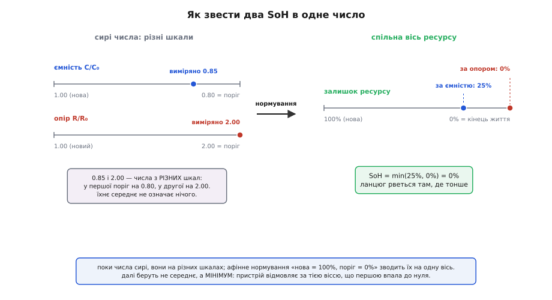
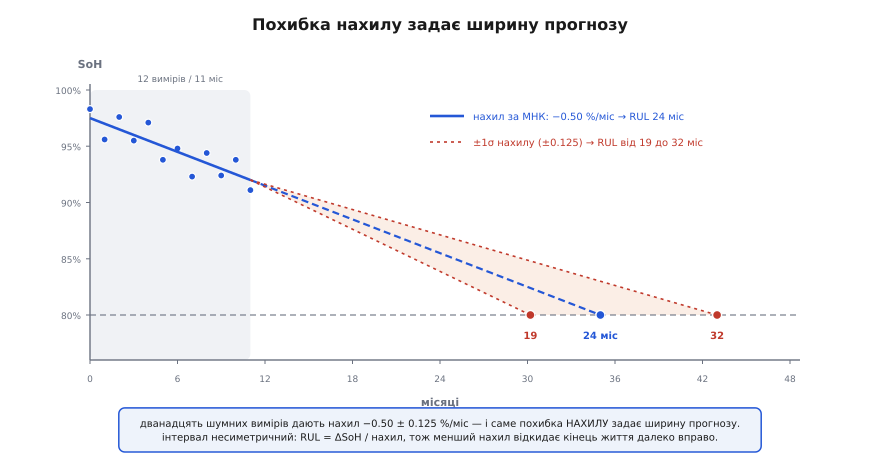
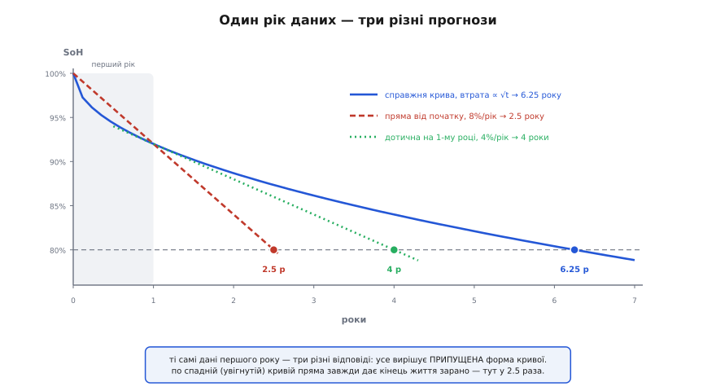

# 🧮 Математика двох SoH і залишкового ресурсу

Із комірки знімають дві цифри зношеності — частку ємності, що лишилася, і в скільки разів виріс опір, — а от усереднити їх не можна: це числа з різних шкал, як градуси й дюйми. Тут розібрано арифметику, що зводить обидві на одну вісь, правило, за яким їх поєднують в одне число (і чому це мінімум, а не середнє), і окремо — як із ряду вимірів дістати нахил спаду **разом із його похибкою**, бо саме похибка нахилу, а не сам нахил, вирішує, чи варта чогось цифра «лишилось ще стільки-то місяців».

### Дві дроби на різних шкалах

Ємнісна частка пряма й очевидна:

```
SoH_C = C / C₀        C  — повна ємність тепер
                      C₀ — паспортна ємність нової комірки
```

Нова комірка дає 1.00, домовлений поріг кінця життя — 0.80. І тут же вилазить неприємна риса цієї шкали: вона **ніколи не доходить до нуля**. Комірка з 40% ємності — це SoH_C = 0.40, хоча вжитку з неї давно немає. Нуль здоров'я лежить не там, де нуль числа.

Резистивна частка так і проситься писатися дзеркально — поділити опір нової комірки на теперішній:

```
SoH_R = R₀ / R        R₀ — опір нової комірки, R — теперішній
```

Подвоєний опір дає рівно 0.50. І от на руках дві цифри — **0.85** і **0.50**, — обидві на вигляд відсотки одного роду. Але 0.85 означає «до порога 0.80 лишилось небагато», а 0.50 не означає нічого певного, бо на цій шкалі поріг узагалі не позначено. Числа відлічені від різних кінців, тож їхнє середнє (0.675) не міряє ні часу, ні запасу, ні ймовірності відмови.

Ліки механічні: перенести обидві на **вісь ресурсу**, де 100% — нова комірка, а 0% — той самий, узгоджений заздалегідь, поріг кінця життя. Це звичайне афінне перетворення — зсув із розтягом:

```
SoH_C* = (C − C_eol) / (C₀ − C_eol)
SoH_R* = (R_eol − R)  / (R_eol − R₀)
```

Обидва вирази влаштовані однаково: у чисельнику — скільки ще лишилось до порога, у знаменнику — скільки взагалі було від нової комірки до порога. Підставмо звичні пороги — 80% ємності й подвоєний опір — і вийдуть дві короткі формули:

```
C_eol = 0.80·C₀   →   SoH_C* = (SoH_C − 0.80) / 0.20 = 5·SoH_C − 4
R_eol = 2·R₀      →   SoH_R* = (2·R₀ − R) / R₀       = 2 − R/R₀
```

Перевірмо на комірці з двома роками за плечима: паспортні 3000 мА·год, тепер 2550, опір виріс із 30 до 60 мОм.

```
ємність:  SoH_C  = 2550 / 3000 = 0.85
          SoH_C* = 5·0.85 − 4   = 0.25     → чверть ресурсу

опір:     R/R₀   = 60 / 30      = 2.00
          SoH_R* = 2 − 2.00     = 0        → ресурс вичерпано
```

Ті самі два виміри, що «на вигляд» давали 85% і 50%, після нормування кажуть щось геть інше й куди різкіше: за енергією комірка пройшла три чверті свого шляху, а за потужністю вже стоїть рівно на порозі. Тепер числа принаймні порівнянні — обидва відлічені від тієї самої нової комірки до того самого кінця життя.

Але за порівнянність доводиться платити. Ділення на вузьке вікно 0.20 — це **множник п'ять** на будь-яку похибку: помилився в ємності на один відсоток — з'їхав на п'ять пунктів по осі ресурсу. У резистивної гілки множник менший (одиниця при порозі 2·R₀), зате сам вимір опору зазвичай брудніший за вимір ємності, тож на виході обидві осі шумлять приблизно однаково. Запам'ятай цю цифру — саме такий шум далі ляже в основу прогнозу. Загальне правило переносу похибки крізь формулу — [поширення похибок](topic:math/error-propagation): похибка результату дорівнює похибці входу, помноженій на похідну формули по цьому входу; тут похідна дорівнює 5, звідки й множник п'ять.

> 🔧 **Навіщо це.** Вісь ресурсу — єдина шкала, на якій цифра здоров'я щось обіцяє. «SoH 90%» за ємністю звучить майже як нова комірка, а насправді це `5·0.90 − 4 = 0.50` — **половина ресурсу вже витрачена**. Різниця між «майже нова» і «половина життя позаду» — не риторика: саме на ній ламаються плани заміни батарей у парку пристроїв.

### Звідки береться поріг опору

Поріг 80% для ємності — домовленість галузі, і про неї сперечатися марно. А от подвоєний опір — це вже чисте правило великого пальця, і брати його наосліп не варто, бо на відміну від ємнісного порога його **можна порахувати** з вимог свого пристрою.

Логіка проста. Під піком струму напруга на клемах падає на I·R ([просадка під навантаженням](topic:electronics/battery-sag) — та сама, що змушує пристрій вимикатися раніше, ніж скінчиться заряд). Пристрій вимикається, коли напруга падає нижче за U_min. Отже, найбільший припустимий опір — це той, за якого просадка ще вкладається в запас між напругою розімкнутої комірки й порогом вимкнення:

```
U_oc − I_peak·R ≥ U_min      →      R_max = (U_oc − U_min) / I_peak
```

Тут U_oc беруть не для повної комірки, а для **найгіршого робочого стану** — майже порожньої, бо саме там запас найтонший. Порахуймо для двох різних пристроїв на одній і тій самій комірці (U_oc ≈ 3.5 В на низькому заряді, вимкнення на 3.0 В):

```
кишеньковий пристрій, пік 3 А:   R_max = 0.5 / 3  = 167 мОм
жадібний пристрій,    пік 10 А:  R_max = 0.5 / 10 = 50 мОм
```

Комірка з нашого прикладу має 60 мОм. Для першого пристрою це майже втричі менше за межу — правило «×2» оголосило б її мертвою за потужністю, хоч насправді запас величезний. Для другого вона вже за межею й вимикатиметься під піками просто зараз. **Один і той самий опір, протилежні вироки** — бо поріг задає не комірка, а навантаження.

Є й третій спосіб призначити поріг — через **спад потужності**. Скільки потужності комірка здатна віддати в момент, коли напруга просіла рівно до порога вимкнення? Струм тоді дорівнює (U_oc − U_min)/R, а потужність у навантаженні — добуток цього струму на U_min:

```
P = U_min · (U_oc − U_min) / R           →      P ∝ 1/R
```

Напруги тут закріплені вимогами пристрою, тож уся залежність сидить у знаменнику: **потужність обернено пропорційна опору**. (Те саме виходить і для іншого визначення — потужності в узгодженому навантаженні, P = U_oc²/(4R): множник інший, залежність від R та сама.) Звідси спад потужності у відсотках перекладається в ріст опору однією дією:

```
спад потужності = 1 − P/P₀ = 1 − R₀/R

20% спаду  →  R₀/R = 0.80  →  R = 1.25·R₀
```

Тобто поширений критерій «мінус 20% потужності» означає ріст опору лише на чверть — значно суворіше за правило «×2». І це різко змінює всю подальшу арифметику: при R_eol = 1.25·R₀ нормування стає `SoH_R* = 5 − 4·R/R₀`, і вже +10% опору з'їдають 40% ресурсу потужності, а наша комірка з подвоєним опором дістає −300%. Тому цифру резистивного SoH **безглуздо називати без порога, від якого її відлічили**: той самий вимір дає 0% або −300% залежно від домовленості.

### Мінімум, а не середнє

Тепер обидва числа на спільній осі, і настає спокуса усереднити. Не роби цього. Ємність і опір обмежують **різні речі**: перша — скільки енергії комірка віддасть узагалі, другий — чи витримає вона піковий струм. Пристрій відмовляє, щойно вичерпається **будь-яке** з двох обмежень, — а отже, час до відмови дорівнює меншому з двох часів, і число, яке чесно його передбачає, — теж менше з двох:

```
SoH = min(SoH_C*, SoH_R*)
```

Порахуймо ціну помилки. Візьмімо комірку, у якої за ємністю лишилося 60% ресурсу, а за опором — нуль:

```
середнє:  (0.60 + 0.00)/2 = 0.30   → «третина життя попереду»
мінімум:  min(0.60, 0.00) = 0.00   → «під піками вона вже не тягне»
```

Прилад із першою відповіддю спокійно показує «30%» і вимикається під першим же серйозним піком. Ось чому середнє тут не консервативна оцінка й не компроміс, а **маскування**: висока ємність підмальовує мертву потужність.

Заперечення «та вони ж усе одно старіють разом, тож середнє мало чим відрізняється» перевіряється дослідом. У випробуванні 175 стартерних акумуляторів, яке описує Cadex Electronics, кореляція між ємністю й струмом холодного пуску (це резистивний показник для свинцевих батарей) вийшла лише **0.55** при одиниці для ідеального збігу ([Battery University, BU-806](https://batteryuniversity.com/article/bu-806-tracking-battery-capacity-and-resistance-as-part-of-aging)). Дані стартерні, не літієві, і показник опору там свій, тож переносити число буквально не варто; але якісний висновок переноситься певно: два знаки старіння розходяться настільки, що з одного не вивести другий. А коли числа несуть різну інформацію, усереднення її просто знищує.

Коли ж середнє таки доречне? Тоді, і лише тоді, коли два числа — не два обмеження, а **два виміри тієї самої величини**. Наприклад, ємність, оцінена лічбою заряду, і ємність, оцінена з форми кривої напруги: обидві цілять в одне, обидві помиляються по-своєму. Тут поєднання не тільки дозволене, а й обов'язкове, тільки ваги беруть не навпіл, а обернено до квадратів похибок ([зважене середнє](topic:math/weighted-average) з такими вагами дає найточніший результат із можливих):

```
Ĉ = (C₁/σ₁² + C₂/σ₂²) / (1/σ₁² + 1/σ₂²)
1/σ² = 1/σ₁² + 1/σ₂²

σ₁ = 3%, σ₂ = 6%   →   ваги 0.80 і 0.20 (як 1/9 до 1/36)
C₁ = 86%, C₂ = 80% →   Ĉ = 0.80·86 + 0.20·80 = 84.8%
                       σ = 1/√(1/9 + 1/36) = 2.68%
```

І тут же — пастка для необережних. Якби ті самі два виміри взяли навпіл, вийшло б 83% із похибкою √(0.25·9 + 0.25·36) = **3.35%** — гірше, ніж 3% одного лише першого виміру. Рівні ваги на нерівних за якістю числах дають результат **гірший, ніж просто викинути гірше число**. Правильні ваги — 4:1 — витискають похибку до 2.68%, і ось це вже справжній виграш від поєднання.

Тож словосполучення «звести два числа в одне» означає дві геть різні дії залежно від того, що це за числа: **обмеження зводять мінімумом, виміри — зваженим середнім**. Плутанина між цими випадками — найчастіша помилка в оцінці здоров'я.


*Ліворуч — сирі виміри: 0.85 на шкалі ємності з порогом 0.80 і 2.00 на шкалі опору з порогом 2.00; середнє між ними безглузде. Праворуч — обидва після нормування на спільну вісь «нова = 100%, поріг = 0%», де вже видно, що резистивна вісь упала першою, і мінімум чесно бере саме її.*

### Скільки лишилось: нахил і його похибка

Другий бік справи — прогноз. Якщо здоров'я сповзає рівно, залишковий ресурс рахується в один рядок: скільки лишилось до порога, поділити на швидкість сповзання.

```
SoH(t) = SoH₀ − b·t        b — нахил, пунктів SoH за місяць

RUL = (SoH_тепер − 80%) / b

SoH_тепер = 92%,  b = 0.5 %/міс   →   RUL = 12 / 0.5 = 24 місяці
```

Формула чесна рівно настільки, наскільки чесний `b`. А от здобути `b` — саме тут і криється вся складність, бо кожен окремий вимір здоров'я шумний: польова оцінка ємності легко гуляє на ±1.5 пункта від циклу до циклу.

Найпростіше — узяти два виміри й поділити різницю на час. Найпростіше воно й найгірше. Різниця двох незалежних величин має похибку в √2 раза більшу за кожну з них, а ділення на короткий проміжок цю похибку роздуває:

```
b̂ = (SoH₂ − SoH₁) / Δt        σ_b = σ·√2 / Δt

σ = 1.5 пункта, Δt = 1 місяць  →  σ_b = 2.12 %/міс
```

Похибка нахилу вчетверо більша за сам нахил (0.5). Такий «прогноз» не просто неточний — він навіть **знак угадує погано**: ймовірність дістати додатний нахил, тобто «батарея одужує», тут близько 41%. Різниця двох сусідніх вимірів не містить майже нічого, крім шуму.

Порятунок — не вимірювати різницю, а **підганяти пряму крізь усі точки** методом [найменших квадратів](topic:math/least-squares) (шукається пряма з найменшою сумою квадратів відхилень точок від неї; для нахилу є готова формула). Для нахилу й його похибки:

```
b̂ = Σ(tᵢ − t̄)(yᵢ − ȳ) / Sₜₜ ,     Sₜₜ = Σ(tᵢ − t̄)²
σ_b = σ / √Sₜₜ
```

Уся сила сидить у `Sₜₜ` — «розмаху» точок у часі. Для n рівновіддалених вимірів із кроком Δt він рахується явно:

```
Sₜₜ = Δt² · n·(n² − 1) / 12

n = 12, Δt = 1 місяць:   Sₜₜ = 12·143/12 = 143
                         σ_b = 1.5 / √143 = 0.125 %/міс
```

Замість 2.12 маємо 0.125 — у сімнадцять разів менше. Але звідки взявся цей виграш? Ось несподіванка, що змінює те, як планують журнал вимірів. Порівняймо два виміри, рознесені на **всі одинадцять** місяців: `Sₜₜ = 2·5.5² = 60.5`, `σ_b = 1.5/7.78 = 0.193`. Тобто дванадцять точок замість двох крайніх дали виграш лише в 1.54 раза, а решта — від того, що вікно розтягли з одного місяця до одинадцяти.

Це не збіг, а закон. При великому n маємо `Sₜₜ ≈ n·T²/12`, де T — довжина вікна, і тоді:

```
σ_b ≈ σ · √(12·Δt) / T^1.5

вдвічі довше вікно (той самий крок)  →  похибка менша у 2^1.5 = 2.83 раза
вдвічі частіші виміри (те саме вікно) →  похибка менша лише у √2 = 1.41 раза
```

**Довжина вікна важить більше за частоту вимірів** — бо вона входить у степені 1.5, а кількість точок при незмінному вікні лише в степені 0.5. Звідси, до речі, відповідь на найпрактичніше питання: скільки треба спостерігати, щоб прогноз узагалі мав право голосу? Візьмімо за критерій b ≥ 3σ_b (нахил утричі більший за свою похибку):

```
σ / √Sₜₜ ≤ b/3   →   Sₜₜ ≥ (3σ/b)² = (3·1.5/0.5)² = 81
n·(n² − 1)/12 ≥ 81  →  n·(n² − 1) ≥ 972  →  n = 10  (990 ✓)
```

Десять щомісячних вимірів, тобто дев'ять місяців спостереження, — і аж тоді цифра «лишилось стільки-то» перестає бути ворожінням. Раніше — не варто її навіть показувати.

> 🔧 **Навіщо це.** Закон T^1.5 прямо диктує, як вести журнал здоров'я в прошивці. Не треба міряти щодня — треба міряти рідше, зате **не стирати старі записи**: десяток точок за рік дасть кращий прогноз, ніж сотня точок за місяць. І навпаки: якщо після оновлення прошивки журнал обнулили, прогноз повертається в нікуди на дев'ять місяців, хоч батарея й далі та сама.

Лишилося перенести похибку нахилу в похибку прогнозу. Тут ділення на невизначене число робить свою класичну шкоду: `RUL = ΔSoH/b`, тож інтервал виходить **несиметричний**.

```
b = 0.500 %/міс             →  RUL = 12/0.500 = 24.0 міс
b = 0.625 (на 1σ швидше)    →  RUL = 12/0.625 = 19.2 міс
b = 0.375 (на 1σ повільніше)→  RUL = 12/0.375 = 32.0 міс

на 2σ:  b = 0.75 → 16 міс   |   b = 0.25 → 48 міс
```

Хвіст праворуч довший і росте швидше: чим менший `b`, тим далі відлітає кінець життя, а при b → 0 прогноз іде в нескінченність. (Похибка самої `SoH_тепер` тут другорядна: для дванадцяти точок вона додає близько 7% відносних проти 25% від нахилу.) Практичний висновок: RUL завжди повідомляють інтервалом і планують за **песимістичним** його краєм — оптимістичний край математично ненадійний, бо саме він розлітається першим.


*Похибка нахилу розгортається у віяло: центральна оцінка каже «24 місяці», а межі ±1σ дають від 19 до 32. Інтервал несиметричний, бо RUL — це ділення на нахил: менший нахил відкидає поріг далеко вправо, більший підтягує ліворуч лише трохи.*

Спокуса замінити підгонку прямої простим згладжуванням — [експоненційним середнім](topic:math/exponential-smoothing), яке дешево фільтрує шум одним рядком коду, — тут не працює: воно згладжує **рівень**, а не нахил, і за самою своєю природою відстає від тренду, тож нахил, узятий із двох згладжених значень, виходить систематично заниженим. Для рівня згладжування добре, для нахилу потрібна підгонка.

### Пряма бреше: усе вирішує форма кривої

І тепер найважче. Уся арифметика вище припускала, що здоров'я спадає **прямою**. Воно так не спадає. Календарне старіння йде приблизно як корінь із часу — спершу круто, далі дедалі пологіше (чому саме корінь — у [математиці календарного старіння](topic:electronics/battery-aging/math-calendar-arrhenius.md)), а циклічне під кінець життя, навпаки, зривається в «коліно». Пряма, простягнута крізь такі дані, помиляється — і, що гірше, помиляється **систематично**, завжди в один бік.

Візьмімо загальний степеневий спад: втрата L(t) = a·t^p. Виміряли втрату L₁ у момент t₁ — коли вона доросте до порога L_eol? Одна дія:

```
L_eol / L₁ = (t_eol / t₁)^p     →     t_eol = t₁ · (L_eol / L₁)^(1/p)
```

А тепер той самий розрахунок «на око прямою», у двох звичних варіантах — через середню швидкість від початку (хорда) і через миттєву швидкість у точці виміру (дотична):

```
хорда:    t = t₁ · (L_eol/L₁)
дотична:  t = t₁ · [1 + (L_eol/L₁ − 1)/p]
```

Числа. Даташит дає 8% втрати за перший рік, поріг — 20% (тобто SoH 80%), спад календарний, p = 0.5:

```
правда (√t):  t = 1 · (20/8)²        = 6.25 року
хорда:        t = 1 · (20/8)         = 2.5 року
дотична:      t = 1 · [1 + 1.5/0.5]  = 4.0 року
```

Ті самі дані першого року — і три відповіді, що різняться в два з половиною рази. Різниця не у вимірах і не в шумі: усе вирішила **припущена форма кривої**. І напрямок помилки не випадковий: на увігнутій кривій, що вирівнюється, будь-яка пряма занижує ресурс, бо тримається за найкрутішу, найранішу ділянку. У циклічного старіння з «коліном» усе дзеркально: пряма, підігнана до пологої ділянки до коліна, ресурс **завищує**. Дві помилки не гасять одна одну — вони діють у різних фазах життя комірки.


*Справжня втрата йде як корінь із часу й перетинає поріг на 6.25 року. Пряма від початку («у середньому 8% за рік») дає 2.5, дотична на першому році — 4.0. Пряма по спадній кривій завжди тримається за найкрутішу ділянку, тому й ховає кінець життя надто близько.*

Рятує це не складніша модель, а заміна змінної. Якщо втрата йде як √t, підганяй пряму не по t, а по **x = √t** — у цих координатах крива справді пряма, і вся машинерія з нахилом та його похибкою працює без жодної зміни:

```
L = a·√t   →   L = a·x   (пряма)   →   t_eol = (L_eol / a)²
```

Заміна саме **x**, а не y, тут принципова: перетворення часу не чіпає шуму вимірів, тож звичайні найменші квадрати лишаються правильними. А от логарифмування самого y (популярний спосіб «випрямити» будь-що) шум спотворює — точки з великими значеннями стискаються сильніше за малі, — і після нього потрібні вже зважені найменші квадрати. Яка з двох форм — пряма по t чи пряма по √t — краще лягає на конкретні дані, вирішують не на око, а порівнянням залишків ([якість підгонки](topic:math/goodness-of-fit): чим менша сума квадратів відхилень і чим випадковіші їхні знаки вздовж осі, тим краще модель описує дані).

І остання, найдешевша осторога: **не проганяй екстраполяцію далі ніж приблизно вдвічі за спостережене вікно**. Прогноз на 24 місяці з дев'яти місяців журналу — уже на межі; на п'ять років — уже фантазія, хай яку гарну похибку виводить формула, бо формула рахує похибку вимірів усередині моделі й нічого не знає про хибність самої моделі.

### Де ця арифметика бреше

Три пастки лежать не в формулах, а в числах, що в них підставляють.

**Знаменник C₀.** Паспортна ємність — не те саме, що фактична ємність саме цієї комірки з конвеєра: виробники закладають запас, і свіжа комірка нерідко видає 103–105% від паспорта. Тоді формула чесно дає SoH 105%, паливоміри звично обрізають показ до 100% — і **перші місяці старіння стають невидимими**. А далі вже видно, що з цього виходить: нахил, узятий по такому «плоскому» початку, виявляється майже нульовим, і RUL, який ділиться на цей нахил, вилітає в нескінченність. Тому за початкову точку беруть не паспорт, а виміряну ємність конкретної комірки на початку служби.

**Умови виміру.** SoH — це дріб, і чисельник зі знаменником мусять бути зміряні **в одному режимі**: тим самим струмом, за тієї самої температури, до тієї самої напруги відсічки. Виміряна ємність від цих умов залежить сильно: більший струм розряду віддає менше ампер-годин ([C-рейт](topic:electronics/c-rate) — швидкість розряду відносно ємності; що вона вища, то менше встигає віддати комірка), а на морозі різниця сягає такої величини, що легко перекриває всю річну втрату від старіння. Отже, порівнюючи літній вимір із зимовим, ти міряєш переважно погоду, а не здоров'я. Тому паливоміри або чекають на цикл у сприятливих умовах, або приводять вимір до опорного режиму — інакше «тренд» стає шумом із сезонним ритмом.

**Домовленість, а не стандарт.** Єдиної галузевої формули SoH не існує: у переліку параметрів, з яких її складають, — і ємність, і опір, і саморозряд, і кількість циклів, і температурна історія, а способу поєднання ніхто не приписав (у [зведенні визначень SoH](https://en.wikipedia.org/wiki/State_of_health) прямо зазначено, що згоди щодо способу обчислення в галузі немає). Практичний наслідок жорсткий: **два прилади на одній комірці мають повне право показати різні SoH**, і жоден не бреше. Порівнювати можна лише число з тим самим числом того самого приладу в часі — тобто тренд із собою, а не цифру з цифрою.
