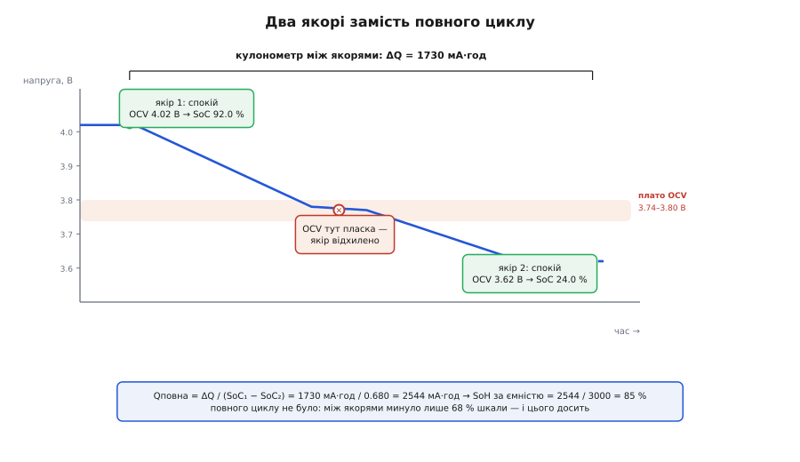
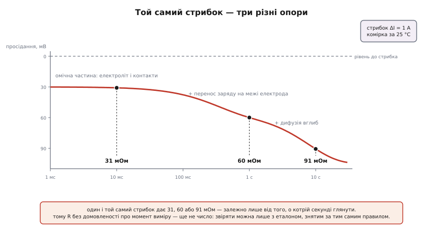

# ⚙️ Оцінка SoH у прошивці: два якорі, стрибок і одне число

Це та частина прошивки паливоміра, де він **вчиться**: як мікроконтролер здобуває справжню ємність і справжній опір постарілої комірки, жодного разу не наказавши батареї пройти лабораторний цикл. Без цього навчання будь-який відсоток на екрані з роками стає вигадкою — прошивка ділить заряд на давню паспортну цифру й тим сильніше бреше, чим більше комірка зносилась.

### Задача

Дано плату: комірка, шунт із [підсилювачем струму](book:electronics/current-sense-amplifier) (він робить із міліволтів на шунті сигнал, який видно АЦП), АЦП на напругу, термістор — і [лічильник заряду, що вже крутиться](book:electronics/state-of-charge/proj-coulomb-counting.md): інтегрує струм і тримає накопичений заряд. Треба видавати назовні здоров'я комірки — окремо за ємністю й окремо за опором.

І є обмеження, яке вирішує все: **навантаженням керуємо не ми**. Коли ставити на зарядку, до якого рівня доводити, коли розряджати — вирішує людина.

Наївний план випливає з означення сам собою: дочекатися повного заряду, дочекатися розряду до відсічки, полічити ампер-години між ними. Проблема одна, зате смертельна — цього не станеться. Телефон ставлять на зарядку на 40 % і знімають на 90 %; ноутбук місяцями живе в док-станції близько 100 %; датчик на батарейці розряджається два роки поспіль і не бачить заряду взагалі. Пристрій може відпрацювати рік і жодного разу не пройти шлях «повна → порожня» цілком. Прошивка, що чекає на повний цикл, або мовчить роками, або — гірше — весь цей час звітує паспортну ємність, наче нічого не сталося.

Отже, справжня задача звучить інакше, ніж означення: не «зміряти ємність», а **зібрати вимір із уламків** — із випадкових шматків розряду, які нам віддають, не питаючи.

### Ідея перша: два якорі замість повного циклу

Придивімося, навіщо взагалі потрібен повний цикл. Тільки задля одного: у двох його кінцях ми **знаємо SoC незалежно від лічильника** — на повній 100 %, на відсічці 0 %. Нічим іншим ці точки не особливі. Якщо навчитися дізнаватися SoC ще де-небудь, повний цикл стає непотрібним.

Такий спосіб є — **напруга комірки, що відпочила**. Під струмом на клемах суміш двох речей: рівноважної напруги хімії й падіння на внутрішньому опорі, і розділити їх на місці нічим. Зніми навантаження, зачекай — і напруга поповзе до рівноважної, до [OCV](book:electronics/ocv-curve). А OCV пов'язана з SoC кривою, яка залежить від хімії й температури, але майже не залежить від віку комірки. Тобто відпочила комірка = відома точка на шкалі заряду, і здобута вона незалежно від будь-якого інтегрування.

Далі — арифметика. Постав **якір**: комірка в спокої, з OCV читаємо SoC₁, запам'ятовуємо показ кулонометра. Людина користується пристроєм, лічильник рахує. Через день комірка знову довго лежить — другий якір: SoC₂ і другий показ. Тепер відомо і скільки заряду витекло (ΔQ — різниця показів), і яку **частку шкали** цей заряд покрив (SoC₁ − SoC₂). Ділення дає повну ємність:

```
Qповна = ΔQ / (SoC₁ − SoC₂)
```

Це і є вивчена ємність — та сама, що стоїть у чисельнику SoH. І здобули її, не наказавши батареї нічого: комірка просто двічі полежала.


*Два якорі замість повного циклу: на кожному комірка відпочила, тож її напруга — це OCV, а OCV дає SoC. Між якорями кулонометр порахував ΔQ. Ділення заряду на пройдену частку шкали дає повну ємність — хоч шлях і не був повним. Якір посеред пласкої ділянки OCV відхилено: там напруга майже не залежить від заряду.*

> 🔧 **Навіщо це.** Уся хитрість — у тому, що ці дві точки не мусять бути кінцями шкали. Чекати на повний цикл означає чекати роками або не дочекатись зовсім; чекати, поки комірка двічі відлежиться в різних місцях шкали, — означає чекати дні. Саме тому паливомір здатен тихо перевчати ємність усе життя пристрою, а не один раз на заводі, і саме тому його «100 %» лишаються чесними, коли [комірка постаріла](book:electronics/battery-aging).

### Чотири умови, без яких якір бреше

У формулі ділення на різницю двох виміряних SoC — і саме там сидить уся похибка. Чисельник надійний: за день лічильник збирає ампер-години з точністю часток відсотка. Знаменник — ні: SoC із OCV у найкращому разі знають до ±1 відсоткового пункту, а різниця двох таких вимірів — уже до ±2 п. п. Похибка ємності виходить не абсолютною, а **відносною до розмаху**:

```
розмах 20 п.п.:   2 / 20 = 10 %    → 2500 мА·год ± 250   (сміття)
розмах 37 п.п.:   2 / 37 = 5.4 %   →              ± 135
розмах 68 п.п.:   2 / 68 = 2.9 %   →              ±  74
```

Звідси **перша умова**: закороткі проміжки не вчать нічого — вимір із розмахом менше третини шкали слід просто викинути.

**Друга умова: спокій — це не мить, а стан.** Після зняття струму напруга не стрибає на OCV, а повзе до неї десятками хвилин: спершу швидко, потім усе повільніше. Схопиш зарано — візьмеш напругу, яка ще не дійшла до рівноваги, а це не випадковий шум, а систематичний зсув в один бік. Тому спокій перевіряють двома ознаками: минув мінімальний час і **швидкість дрейфу напруги впала** нижче порога. Нульового струму, до речі, не потрібно — досить, щоб він був малим (порядку C/20): на такому струмі падіння на внутрішньому опорі губиться в похибці.

**Третя умова: не якорити на плато.** Крива OCV у літій-іонної комірки має ділянки, де напруга майже не залежить від заряду. Там 5 мВ похибки виміру перетворюються на кілька відсоткових пунктів SoC, і жодний розмах цього не врятує. Просте й дієве рішення — заборонити якір у відомій напруговій смузі.

**Четверта умова: температура.** Крива OCV(SoC) сама трохи їде з температурою, а на морозі напруга усталюється помітно довше — тобто ознака спокою спрацьовує пізніше, ніж очікуєш. Найдешевше — не вчити ємність поза розумним вікном, а не намагатися все це компенсувати.

Числа тут не з голови. Texas Instruments описує свій алгоритм Impedance Track саме в такий спосіб — застосовна нотатка SLUA450A «Theory and Implementation of Impedance Track Battery Fuel-Gauging Algorithm» (січень 2008, ред. листопад 2022; первинне джерело — документація виробника). Ємність там рахують як `Qmax = PassedCharge / (DOD2 − DOD1)`, тобто те саме ділення, лише записане через глибину розряду замість заряду. Обидві точки беруть, коли комірка «добре відлежалась», а критерій — `dU/dt < 4 мкВ/с` (перевірку починають за 30 хвилин, типово умова виконується за годину, а глибше 80 % розряду — за три-чотири). Оновлення пропускають, якщо температура вища за 40 °C або нижча за 10 °C, і якщо котресь із двох вимірювань напруги випало у смугу 3737…3800 мВ — рівно через пласку OCV. Пройдений заряд має перевищити 37 % паспортної ємності, а для найпершого навчання — 90 %. Нарешті, всі наступні виміри Qmax проганяють через згладжувальний фільтр, де вимірам із меншим пройденим зарядом дають меншу вагу.

### Ідея друга: опір — це число з часовою міткою

Другий бік здоров'я міряють стрибком навантаження: змінили струм на ΔI, побачили зміну напруги ΔU, поділили. Формула виглядає так, ніби відповідь одна. Насправді ні — і ось чому.

Комірка відповідає на стрибок струму не одним падінням, а трьома, з різними сталими часу. Миттєво падає на омічній частині — електроліт, електроди, контакти, струмознімачі. За частки секунди додається перенос заряду на межі електрода. За секунди й десятки секунд наростає дифузійна складова: іони не встигають підходити до поверхні. [Розкладає ці внески на окремі числа імпедансна спектроскопія](book:electronics/battery-impedance), але для прошивки важливий грубіший висновок: **яке число ти отримаєш, залежить від того, коли подивишся.**


*Одна й та сама комірка, один і той самий стрибок струму — але виміряний опір потроюється залежно від затримки. На 10 мс видно майже саму омічну частину; до секунди долучається перенос заряду; до десяти секунд наростає дифузія. Тому опір має сенс лише разом із домовленістю про момент виміру.*

Звідси перше правило прошивки: **зафіксуй затримку** й тримайся її завжди. Затримка в 1 с — розумний вибір для пристрою з довгими навантаженнями. Еталонний опір нової комірки має бути знятий тим самим правилом, інакше порівнювати нема чого.

Друге правило: **зведи до опорної температури.** Опір комірки росте на холоді круто, приблизно за показниковим законом:

```
R(T) = R₂₅ · exp(−k·(T − 25))       k ≈ 0.028 1/°C  →  подвоєння від 25 до 0 °C
```

Коефіцієнт `k` беруть із характеризації комірки, а не з довідника. Без цієї поправки взимку прошивка «діагностує» смерть здоровій батареї: 60 мОм за 25 °C і 105 мОм за 5 °C — це та сама комірка. (Той самий Impedance Track зводить свої опори до 0 °C за формулою `Ra = R/exp(Rb·T)`, з власним коефіцієнтом на кожну точку глибини розряду.)

Третє правило випливає з того самого джерела: опір залежить ще й від заряду й найкрутіше росте в глибокому розряді. Тому серйозний паливомір тримає не одне число, а таблицю R за глибиною розряду — і недарма в тій самій нотатці сітка її точок густішає після 77.7 % розряду, де опір міняється швидко. Спрощення для однієї плати — брати вимір лише в середині шкали й порівнювати з еталоном, знятим там само.

### Робочий код

Одиниці підібрані так, щоб не було жодної коми: заряд у мА·с (3000 мА·год = 10 800 000 мА·с), SoH і SoC у сотих відсотка, напруга в мікровольтах, струм у міліамперах. Останнє дає приємний подарунок: **мкВ/мА одразу дорівнює мОм**, тож ділення просадки на стрибок струму — це вже готовий опір без жодного масштабування. Опір тримаємо у [форматі з фіксованою комою](book:programming/fixed-point) 1/256 мОм — не заради точності, а щоб згладжувальний фільтр не оглух на цілих числах.

:::tabs
```c
#include <stdbool.h>
#include <stdint.h>

/* Дає решта прошивки: таблиця OCV→SoC і сирий пробіг кулонометра. */
int16_t soc_from_ocv_cpm(int32_t u_mv, int16_t t_c);  /* SoC, сотих відсотка   */
int32_t coulomb_total_mas(void);                      /* пробіг лічильника, мА·с */

/* ── паспорт комірки і межі допуску ──────────────────────────────────────── */
#define Q_RATED_MAS   10800000L  /* 3000 мА·год = 3000×3600 мА·с              */
#define R_NEW_MOHM    30         /* опір нової комірки, зведений до 25 °C     */
#define R_EOL_MOHM    75         /* просадка, якої вже не терпить наша схема  */
#define FLAT_LO_MV    3737       /* пласка ділянка OCV — тут не якорити       */
#define FLAT_HI_MV    3800
#define T_MIN_C       10         /* поза цим вікном ємність не вчимо          */
#define T_MAX_C       40
#define REST_MIN_S    1800       /* спокій перевіряємо не раніше ніж за 30 хв */
#define REST_DVDT_NVS 4000       /* напруга усталилась: |dU/dt| < 4 мкВ/с     */
#define QUIT_MA       150        /* C/20 для 3000 мА·год — межа «спокою»      */
#define SPAN_MIN_CPM  3700       /* найменший розмах якорів: 37.00 %          */
#define DI_MIN_MA     500        /* менший стрибок не дасть точності          */

typedef struct {
    int32_t u_uv;      /* напруга на клемах, мкВ             */
    int32_t i_ma;      /* струм зі знаком: + заряд, − розряд */
    int16_t t_c;       /* температура комірки, °C            */
    int32_t dudt_nvs;  /* модуль дрейфу напруги, нВ/с        */
} meas_t;

typedef struct { int16_t soc_cpm; int32_t q_mark_mas; } anchor_t;

static int32_t  q_full_mas = Q_RATED_MAS;      /* вивчена повна ємність    */
static int32_t  r_q8       = R_NEW_MOHM * 256; /* опір @25 °C, 1/256 мОм   */
static uint32_t learn_w    = 0;                /* накопичена вага вивчення */
static anchor_t prev;
static bool     has_prev   = false;

static int32_t iabs32(int32_t x) { return x < 0 ? -x : x; }
static int32_t clamp32(int32_t x, int32_t lo, int32_t hi)
{
    return x < lo ? lo : (x > hi ? hi : x);
}

/* ── якір: точка, де SoC відомий незалежно від лічильника ────────────────── */
static bool make_anchor(const meas_t *m, uint32_t rest_s, anchor_t *out)
{
    int32_t u_mv = m->u_uv / 1000;
    if (rest_s < REST_MIN_S)                    return false; /* не відлежалась     */
    if (m->dudt_nvs > REST_DVDT_NVS)            return false; /* напруга ще повзе   */
    if (iabs32(m->i_ma) > QUIT_MA)              return false; /* спокій лише на словах */
    if (m->t_c < T_MIN_C || m->t_c > T_MAX_C)   return false; /* холод або спека    */
    if (u_mv > FLAT_LO_MV && u_mv < FLAT_HI_MV) return false; /* пласке плато OCV   */

    out->soc_cpm    = soc_from_ocv_cpm(u_mv, m->t_c);
    out->q_mark_mas = coulomb_total_mas();   /* саме сирий пробіг, не обрізаний */
    return true;
}

/* ── вивчення ємності: витеклий заряд проти пройденої частки шкали ───────── */
static void learn_capacity(const anchor_t *a1, const anchor_t *a2)
{
    int32_t span = (int32_t)a1->soc_cpm - a2->soc_cpm;  /* сотих відсотка */
    int32_t dq   = a1->q_mark_mas - a2->q_mark_mas;     /* мА·с           */
    if (span < 0) { span = -span; dq = -dq; }           /* заряд годиться так само */
    if (span < SPAN_MIN_CPM || dq <= 0) return;         /* замалий розмах — шум    */

    /* dq×10000 переповнює int32 майже в тридцять разів — рахуємо в 64 бітах */
    int32_t q = (int32_t)(((int64_t)dq * 10000) / span);
    if (q < Q_RATED_MAS / 2 || q > Q_RATED_MAS * 12 / 10) return;  /* нісенітниця */

    uint32_t w = (uint32_t)span;                        /* довіра ∝ розмах */
    q_full_mas = (int32_t)(((int64_t)q_full_mas * learn_w + (int64_t)q * w)
                           / (learn_w + w));
    if (learn_w < 20000) learn_w += w;                  /* стеля: далі фільтр глухне */
}

/* ── вхід 1: комірка лежить у спокої (кликати раз на секунду) ────────────── */
void soh_on_rest(const meas_t *m, uint32_t rest_s)
{
    anchor_t a;
    if (!make_anchor(m, rest_s, &a)) return;
    if (has_prev) learn_capacity(&prev, &a);
    prev = a;                                /* свіжий якір заступає старий */
    has_prev = true;
}

/* ── температурна поправка: R(T) = R₂₅·exp(−k·(T−25)), k ≈ 0.028 1/°C ────── */
static const uint16_t rt_gain_q8[16] = {     /* −20…+55 °C кроком 5 °C, 256 = ×1 */
    891, 776, 676, 588, 512, 446, 388, 338, 294, 256, 223, 194, 169, 147, 128, 111
};

static uint16_t rt_gain(int16_t t_c)
{
    int32_t t  = clamp32(t_c, -20, 54) + 20;
    int32_t i  = t / 5, fr = t % 5;
    int32_t a  = rt_gain_q8[i], b = rt_gain_q8[i + 1];
    return (uint16_t)(a + (b - a) * fr / 5);           /* лінійно між вузлами */
}

/* ── вхід 2: навантаження стрибнуло (зрізи до і рівно через 1 с після) ───── */
bool soh_on_load_step(const meas_t *before, const meas_t *after)
{
    int32_t di = iabs32(after->i_ma - before->i_ma);
    int32_t du = before->u_uv - after->u_uv;            /* просідання, мкВ */
    if (di < DI_MIN_MA || du <= 0) return false;

    int32_t r_raw = du / di;                            /* мкВ/мА = мОм напряму */
    int32_t r25   = (int32_t)(((int64_t)r_raw * 256) / rt_gain(after->t_c));

    r_q8 += (r25 * 256 - r_q8) / 8;                     /* фільтр у 1/256 мОм */
    return true;
}

/* ── два обличчя здоров'я і одне число назовні ───────────────────────────── */
int16_t soh_capacity_cpm(void)
{
    return (int16_t)(((int64_t)q_full_mas * 10000) / Q_RATED_MAS);
}

int16_t soh_power_cpm(void)
{
    int32_t r = r_q8 / 256;
    int32_t x = (R_EOL_MOHM - r) * 10000 / (R_EOL_MOHM - R_NEW_MOHM);
    return (int16_t)clamp32(x, 0, 10000);
}

int16_t soh_cpm(void)                        /* обережне: гірше з двох */
{
    int16_t c = soh_capacity_cpm(), p = soh_power_cpm();
    return c < p ? c : p;
}
```
```cpp
#include <algorithm>
#include <cstdint>
#include <cstdlib>
#include <optional>

/* Дає решта прошивки: таблиця OCV→SoC і сирий пробіг кулонометра. */
int16_t soc_from_ocv_cpm(int32_t u_mv, int16_t t_c);  // SoC, сотих відсотка
int32_t coulomb_total_mas();                          // пробіг лічильника, мА·с

struct CellSpec {                  // паспорт + характеризація однієї комірки
    int32_t q_rated_mas;           // 3000 мА·год = 3000×3600 мА·с
    int16_t r_new_mohm;            // опір нової комірки, зведений до 25 °C
    int16_t r_eol_mohm;            // просадка, якої вже не терпить наша схема
    int16_t flat_lo_mv, flat_hi_mv;// пласка ділянка OCV — тут не якорити
    int16_t t_min_c, t_max_c;      // вікно температур для вивчення ємності
    int16_t quit_ma;               // C/20 — межа «спокою»
    int16_t span_min_cpm;          // найменший розмах якорів
};

inline constexpr CellSpec kCell{10'800'000, 30, 75, 3737, 3800, 10, 40, 150, 3700};

struct Meas {
    int32_t u_uv;       // напруга на клемах, мкВ
    int32_t i_ma;       // струм зі знаком: + заряд, − розряд
    int16_t t_c;        // температура комірки, °C
    int32_t dudt_nvs;   // модуль дрейфу напруги, нВ/с
};

struct Anchor { int16_t soc_cpm; int32_t q_mark_mas; };

class SohEstimator {
public:
    explicit SohEstimator(const CellSpec& s)
        : spec_{s}, q_full_mas_{s.q_rated_mas}, r_q8_{s.r_new_mohm * 256} {}

    // комірка лежить у спокої: кликати раз на секунду
    void on_rest(const Meas& m, uint32_t rest_s) {
        const auto a = make_anchor(m, rest_s);
        if (!a) return;
        if (prev_) learn_capacity(*prev_, *a);
        prev_ = a;                          // свіжий якір заступає старий
    }

    // навантаження стрибнуло: зрізи до і рівно через 1 с після
    bool on_load_step(const Meas& before, const Meas& after) {
        const int32_t di = std::abs(after.i_ma - before.i_ma);
        const int32_t du = before.u_uv - after.u_uv;     // просідання, мкВ
        if (di < kDiMinMa || du <= 0) return false;

        const int32_t r_raw = du / di;                   // мкВ/мА = мОм напряму
        const auto r25 = static_cast<int32_t>(
            static_cast<int64_t>(r_raw) * 256 / rt_gain_q8(after.t_c));

        r_q8_ += (r25 * 256 - r_q8_) / 8;                // фільтр у 1/256 мОм
        return true;
    }

    [[nodiscard]] int16_t soh_capacity_cpm() const {
        return static_cast<int16_t>(
            static_cast<int64_t>(q_full_mas_) * 10000 / spec_.q_rated_mas);
    }
    [[nodiscard]] int16_t soh_power_cpm() const {
        const int32_t r = r_q8_ / 256;
        const int32_t x = (spec_.r_eol_mohm - r) * 10000
                        / (spec_.r_eol_mohm - spec_.r_new_mohm);
        return static_cast<int16_t>(std::clamp(x, 0, 10000));
    }
    [[nodiscard]] int16_t soh_cpm() const {              // обережне: гірше з двох
        return std::min(soh_capacity_cpm(), soh_power_cpm());
    }

private:
    static constexpr int32_t  kDiMinMa      = 500;   // менший стрибок не дасть точності
    static constexpr uint32_t kRestMinS     = 1800;  // спокій — не раніше ніж за 30 хв
    static constexpr int32_t  kRestDvdtNvs  = 4000;  // |dU/dt| < 4 мкВ/с
    static constexpr uint32_t kWeightCap    = 20000; // стеля довіри до вивченого

    // якір: точка, де SoC відомий незалежно від лічильника
    [[nodiscard]] std::optional<Anchor> make_anchor(const Meas& m,
                                                    uint32_t rest_s) const {
        const int32_t u_mv = m.u_uv / 1000;
        if (rest_s < kRestMinS)                  return std::nullopt; // не відлежалась
        if (m.dudt_nvs > kRestDvdtNvs)           return std::nullopt; // напруга повзе
        if (std::abs(m.i_ma) > spec_.quit_ma)    return std::nullopt; // струм завеликий
        if (m.t_c < spec_.t_min_c ||
            m.t_c > spec_.t_max_c)               return std::nullopt; // холод/спека
        if (u_mv > spec_.flat_lo_mv &&
            u_mv < spec_.flat_hi_mv)             return std::nullopt; // пласке плато

        // сирий пробіг лічильника, не обрізаний нулем і ємністю
        return Anchor{soc_from_ocv_cpm(u_mv, m.t_c), coulomb_total_mas()};
    }

    // вивчення ємності: витеклий заряд проти пройденої частки шкали
    void learn_capacity(const Anchor& a1, const Anchor& a2) {
        int32_t span = a1.soc_cpm - a2.soc_cpm;          // сотих відсотка
        int32_t dq   = a1.q_mark_mas - a2.q_mark_mas;    // мА·с
        if (span < 0) { span = -span; dq = -dq; }        // заряд годиться так само
        if (span < spec_.span_min_cpm || dq <= 0) return;

        // dq×10000 переповнює int32 майже в тридцять разів — 64 біти обов'язкові
        const auto q = static_cast<int32_t>(static_cast<int64_t>(dq) * 10000 / span);
        if (q < spec_.q_rated_mas / 2 || q > spec_.q_rated_mas * 12 / 10) return;

        const auto w = static_cast<uint32_t>(span);      // довіра ∝ розмах
        q_full_mas_ = static_cast<int32_t>(
            (static_cast<int64_t>(q_full_mas_) * learn_w_ + static_cast<int64_t>(q) * w)
            / (learn_w_ + w));
        if (learn_w_ < kWeightCap) learn_w_ += w;        // стеля: далі фільтр глухне
    }

    // температурна поправка: R(T) = R₂₅·exp(−k·(T−25)), k ≈ 0.028 1/°C
    static uint16_t rt_gain_q8(int16_t t_c) {
        static constexpr uint16_t g[16] = {   // −20…+55 °C кроком 5 °C, 256 = ×1
            891, 776, 676, 588, 512, 446, 388, 338, 294, 256, 223, 194, 169, 147, 128, 111
        };
        const int32_t t = std::clamp<int32_t>(t_c, -20, 54) + 20;
        const int32_t i = t / 5, fr = t % 5;
        return static_cast<uint16_t>(g[i] + (g[i + 1] - g[i]) * fr / 5);
    }

    const CellSpec&       spec_;
    int32_t               q_full_mas_;
    int32_t               r_q8_;        // опір @25 °C у 1/256 мОм
    uint32_t              learn_w_{0};
    std::optional<Anchor> prev_{};
};
```
:::

Дві дрібниці в коді роблять більше, ніж здається. Перша: вага `learn_w` починається з нуля, тож найперше вдале навчання **повністю витісняє** паспортну здогадку — жодного спеціального випадку для «першого разу» писати не треба. Друга: `coulomb_total_mas()` має віддавати **сирий** пробіг лічильника, а не той обрізаний нулем і ємністю заряд, що йде на індикатор. Обрізаний накопичувач упирається в межу, різниця показів стає меншою за справжню — і вивчена ємність тихо занижується.

### Приклад (від якорів до двох відсотків)

**Умова.** Комірка на 3000 мА·год, новою мала опір 30 мОм за 25 °C. Схема витримує просадку 0.225 В на піку 3 А, тож межею за опором взято R = 75 мОм. Пристрій два роки в роботі. Якір 1: комірка відлежалась, 4.02 В за 24 °C. Далі звичайне користування. Якір 2 наступного вечора: 3.62 В за 22 °C. Між ними лічильник намотав 1730 мА·год. Окремо, вранці за 5 °C, увімкнення підсвітки дало стрибок 1 А, і через секунду напруга просіла на 105 мВ.

```
розмах якорів      = 92.0 % − 24.0 %      = 68.0 п.п.   (> 37 → допущено)
Qповна             = 1730 / 0.680          = 2544 мА·год
SoH за ємністю     = 2544 / 3000           = 84.8 %  →  8480 сотих

опір сирий         = 105000 мкВ / 1000 мА  = 105 мОм   (за 5 °C)
поправка @5 °C     = 446/256               = ×1.74
опір @25 °C        = 105 × 256 / 446       = 60 мОм

SoH за потужністю  = (75 − 60) / (75 − 30) = 33.3 %  →  3333 сотих
SoH назовні        = min(8480, 3333)       = 3333    →  33 %
```

За енергією комірка ще бадьора — 85 %. За потужністю від неї лишилась третина запасу: опір подвоївся, і на піку 3 А вона просідає вже на 0.18 В замість 0.09 В. Одне число, яке віддає прошивка, — гірше з двох: пристрій відмовить там, де першою впреться в стіну [просадка під навантаженням](book:electronics/battery-sag), а не там, де скінчиться енергія. І зверни увагу, звідки взялося 75 мОм: не з паспорта комірки, а з того, скільки просадки терпить **наша** схема до відсічки. Здоров'я за опором — це завжди трохи про пристрій, а не лише про батарею.

### Складність і пастки

- **Тактів — сміх, часу — тижні.** Обчислень тут O(1) на подію, стану — десятки байтів; уся робота вміщається між іншими справами головного циклу. Дорога інша річ: перше чесне навчання настає лише тоді, коли трапиться пара придатних якорів. У телефона це дні, у приладу, що місяцями стоїть на 100 %, — може й ніколи. Прошивка мусить чесно казати назовні, скільки разів вона вчилася, — «SoH = 100 %» від ненавченого паливоміра й від справді нової комірки виглядають однаково, а варті різного.
- **Множення перед діленням і 64 біти.** `dq × 10000` для комірки на 3000 мА·год — це 6.2·10¹⁰, майже в тридцять разів більше за стелю `int32`. Поміняти порядок дій (спершу поділити) не можна: цілочисельне ділення першим кроком з'їдає всю точність. Або 64 біти, або масштаб, підібраний під розрядність, — третього немає.
- **Фільтр, який глухне.** Зважене середнє з вагою, що росте без стелі, за рік стає нечутливим: нове вимірювання зсуває оцінку на мільйонні частки. А ємність мусить **і далі** сповзати вниз, бо комірка старіє. Стеля на `learn_w` — не оптимізація, а умова того, що паливомір взагалі стежить за старінням.
- **Мертва зона цілочисельного фільтра.** `x += (ціль − x)/8` на цілих мОм не рушить з місця, поки різниця менша за 8, — оцінка застрягає з похибкою до 7 мОм. Тому накопичувач і тримають у 1/256 мОм: та сама формула, але мертва зона стискається до 0.03 мОм.
- **Напругу і струм міряти одночасно.** Якщо АЦП мультиплексований і між зрізом напруги й зрізом струму минає 10 мс, будь-яка зміна навантаження в цей проміжок піде прямо в `ΔU/ΔI`. Потрібне [одночасне взяття вибірок](book:electronics/adc-sample-hold) — двома АЦП, синхронним запуском або хоча б перемежованим читанням із усередненням.
- **Стрибок має бути великим.** [Роздільність АЦП](book:electronics/adc-resolution) б'є по опору напряму: 1 мВ молодшого розряду при ΔI = 1 А дає 1 мОм кроку, а при ΔI = 100 мА — уже 10 мОм, тобто третину всього діапазону старіння. Не можеш дочекатися великого стрибка — не міряй узагалі, бо результат буде шумом, який фільтр слухняно розмаже.
- **Шунт бреше двічі.** Зсув підсилювача додається до струму сталою складовою, а сам [шунт](book:electronics/shunt-resistor) гріється під струмом і змінює опір — тож калібрувати нуль треба регулярно, а великі стрибки міряти швидко, поки шунт не встиг нагрітися.
- **Свіжий якір проти широкого розмаху.** Заміняючи попередній якір щоразу, ми скидаємо накопичений дрейф лічильника, але й ріжемо шанс дочекатися ширшого проміжку. Обидві стратегії живі; промислові паливоміри обирають свіжість — бо дрейф інтегратора росте безупинно, а придатних якорів рано чи пізно набереться.
- **Записувати вивчене — рідко.** Ємність і опір мусять пережити перезавантаження, але [енергонезалежна пам'ять](book:programming/eeprom) має обмежений ресурс запису. Писати щоразу — вбити комірку пам'яті за рік. Пиши, коли значення зсунулося помітно (скажімо, на 1 %) або перед плановим вимкненням.
- **Абсурдні виміри існують.** Хибний якір, помилка таблиці OCV, комірка, вийнята й вставлена назад посеред проміжку — усе це дає «ємність» удвічі більшу за паспортну. Прості межі (половина й 120 % паспортної) відсіюють такі випадки задарма. Розумно так само обмежувати **швидкість** зміни оцінки: справжня ємність за один цикл на 20 % не падає.
- **Це шматок, а не весь паливомір.** Вивчена ємність тут — знаменник для [оцінки заряду](book:electronics/state-of-charge), а зведений опір — вхід до моделі, якою [паливомір](book:electronics/fuel-gauge) передбачає напругу під навантаженням. Обидва числа мають потрапити назад до лічильника заряду, інакше вся ця робота залишиться цифрою на екрані діагностики.
